# 这些代码不再允许用户在 App Store 上为应用撰写评论，但非常适合发送给那些拥有自主评论系统的网站。

### 深入探索

在 Unity 编辑器和 iOS 模拟器中测试 Unity iOS 应用虽然便捷，但终究无法替代真机测试！好消息是，为真机硬件构建应用在 Unity 端几乎无需改动（只需在`Player Settings`中将`SDK Version`设置为`Device SDK`即可）。坏消息则是，你必须完成一整套 Apple 开发者注册流程，为测试设备设置配置门户（Provisioning Portal）和配置文件（Provisioning Profiles），并为所有应用配置 iTunes Connect。从某种意义上说，这一章标志着你正式成为 iOS 开发者！

既然这些流程已告一段落，我们可以暂时搁置 Angry Bots 项目，回到保龄球游戏，并用本书剩余篇幅将其适配至 iOS 平台。不过，我们与 iTunes Connect 的缘分尚未终结——后续在集成 Game Center（第 14 章）和 iAd（第 15 章）时还会用到它。

#### Unity 手册

由于 iOS 的模拟器与真机构建步骤几乎一致，上一章提及的 Unity 手册内容同样适用于本章。此外，Unity 手册中“iOS 开发入门”章节简要列出了 Apple 提交应用至 App Store 所需步骤；而“高级”章节的“调试”页面则说明了如何将 MonoDevelop 调试会话挂载至设备上运行的 Unity iOS 应用。

#### Apple 开发者网站

所有 Apple 开发者信息的获取路径都始于 Apple 开发者网站（`http://developer.apple.com/`），因此它应是你的第一站。在此你可以找到 iOS 开发者计划（及其他 Apple 开发者计划）的说明并启动注册流程。即便注册尚未完成，你也可先探索 iOS 开发中心（iOS Dev Center），其中包含 iOS 开发者库（iOS Developer Library），而该库内又收录了 iTunes Connect 开发者指南（位于“语言与工具”分类下）。

**提示** iOS 开发者库中的文档同样可在 Xcode Organizer 中获取。考虑到 Organizer 中涉及证书配置、截图、应用提交等大量操作，你将在 Xcode 中花费大量时间在此！

注册获批后，你即可访问 iTunes Connect 网站及 Apple 开发者网站上的配置门户，完成本章所述的移动设备配置与应用提交流程。

## 第 12 章 呈现：屏幕与图标

现在 Angry Bots 的插曲告一段落，且 Unity iOS 项目构建与运行的基础知识已讲解完毕，是时候回归保龄球游戏并在 iOS 上运行了！

从现在起，我会默认你通过真机构建与运行进行测试，但在多数情况下，你也可以使用 Unity Remote 在编辑器中测试，或直接在 iOS 模拟器中测试。

**提示** 始终在 Unity 编辑器中进行部分测试是个好习惯，这能捕捉到真机测试中可能不会暴露的错误。若在真机上遇到诡异问题，请返回编辑器尝试调试。

本章重点在于让游戏在 iOS 设备上正确呈现，包括确保游戏以正确方向显示、所有游戏元素以合适分辨率出现在屏幕上——这是游戏可玩性的前提（连 Play 按钮都看不清或点不了，何谈开始游戏？）。

此外，除了提供应用名称和图标等必要属性，我们还将通过添加启动画面和熟悉的 iOS 活动指示器来优化细节，向玩家显示游戏正在加载。

这些呈现细节看似仅关乎外观且易于实现，因此常被推迟到项目末尾（通常也确实如此）。但简单工作完全可以且应该提前完成——快速完成的任务能帮你进入开发节奏。当你加班加点赶工完成游戏时，最不想看到的就是那些本可尽早解决的未完成工作。

况且，打包体验至关重要。事实上，在制作桌面软件时，我习惯从安装程序开始设计，因为这是客户的第一触点。对于 iOS 应用，客户首先看到的是应用图标和名称，启动时则看到启动画面。这些将塑造客户对应用的初步印象——它究竟是精致之作还是业余出品。而你作为应用的第一位用户，若能像打包成品一样从一开始就包装好项目，不仅会对项目更有信心，也能更清晰地构想应用形态。更何况，你永远不知道何时需要演示它！

对应的 Unity 项目可在`http://learnunity4.com/`在线获取。按惯例，我建议手动输入脚本而非直接复制在线项目中的代码。但项目文件中的某些纹理将用于图标和启动画面，因此请从第 12 章的在线项目中，将`Textures`文件夹内的额外文件复制到保龄球项目的`Textures`文件夹中（记住，你可以将文件拖拽至 Project 视图中）。你将获得三个不同分辨率的 Fugu Games 启动纹理、一个显示本书封面的启动画面，以及一个图标纹理（图 12-1）。

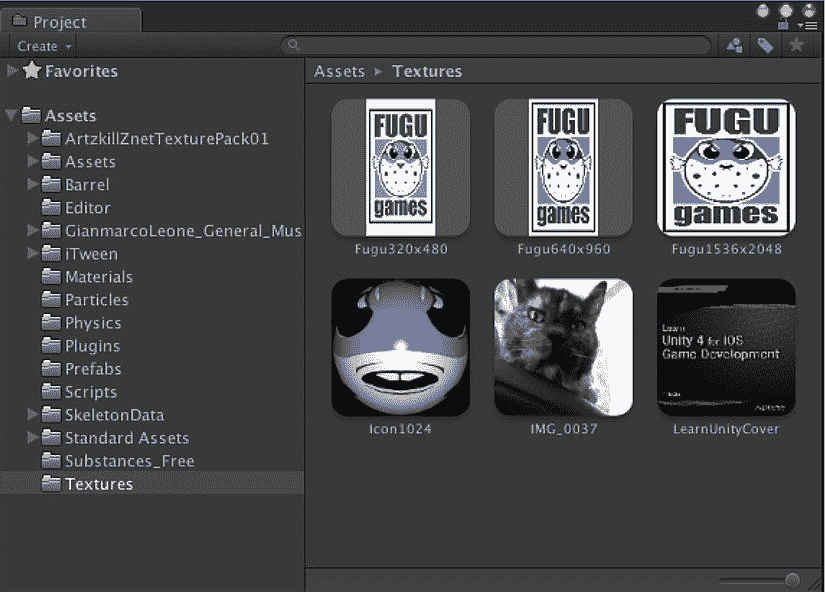

图 12-1 从`http://learnunity4.com/`复制的本章纹理

### 保龄球 iOS 版

在 Unity 编辑器中，打开项目向导（`File`菜单下的`Open Project`），选择我们在第 9 章中最后使用的保龄球项目（即在切换到 Angry Bots 之前的版本）。你现在应该已熟悉切换构建目标的操作流程。

打开构建设置窗口（`File`菜单下的`Build Settings`），选择 iOS 作为构建目标，点击`Switch Platform`按钮。

如果你已从第 9 章安装了 Necromancer GUI，切换构建目标至 iOS 后，控制台视图会出现一些脚本错误——因为该包中的测试脚本未使用`#pragma strict`且缺少某些类型声明。只需从 Project 视图中删除`GUITestScript.js`，或将所有内容包裹在`#if !UNITY_IPHONE`中即可快速解决（若进一步修复代码——为函数参数添加`:int`类型声明——则可获额外加分）。删除脚本会禁用 Necromancer GUI 测试场景，但`GUISkin`仍可在暂停菜单中使用。本章的所有改动无论是否使用 Necromancer GUI 均可正常运行（但截图展示的是更美观的 Necromancer GUI）。

资源重新导入完成后，进入`Edit`菜单，在`Settings`下选择`Player`，在 Inspector 视图中打开 Player Settings。在跨平台设置（Cross-Platform Settings）中填写公司名称和产品名称（应用名称）。选择 iOS 选项卡显示 iOS Player Settings，并填写应用的 bundle ID（图 12-2）。

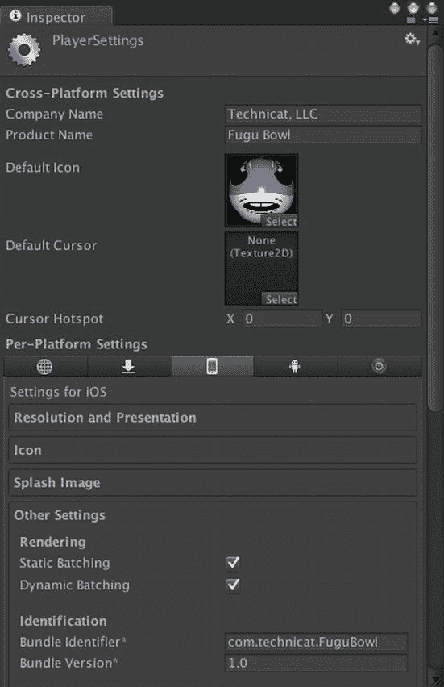

图 12-2 Fugu Bowl 的 Player Settings


`HyperBowl`的原始版本和 iOS 版本都是竖屏游戏（事实也证明竖屏模式最适合实现下一章中介绍的滑动滚球控制），因此我们将该游戏限制为竖屏模式（以及倒置竖屏模式，因为 iPad 需要这种对称性）。

因此，需要在玩家设置中将`Orientation`属性设为`Auto Rotation`，并且仅选中`Portrait`和`Portrait Upside Down`选项（图 12-3）。

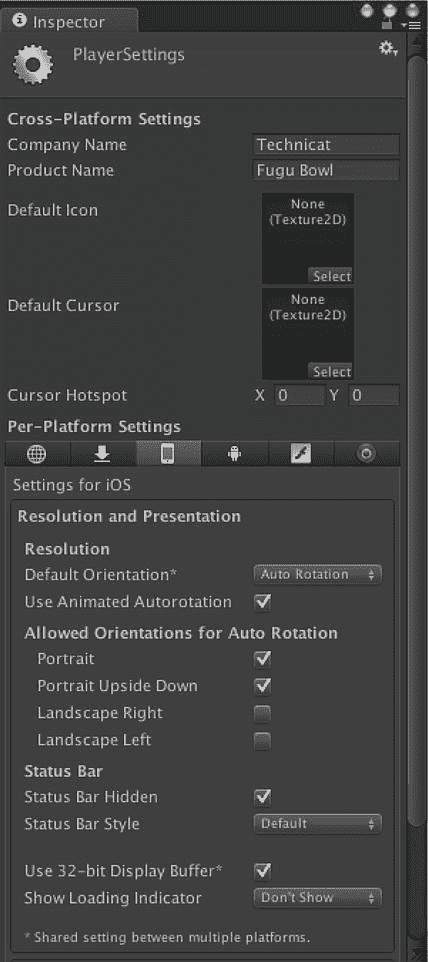

图 12-3. Fugu Bowl 的分辨率和呈现设置

#### 缩放 GUI

现在我们已准备就绪，可以构建并运行了。如果在低分辨率 iOS 设备（即 iPhone 3GS，屏幕为 320×480 像素）上运行，游戏的初始屏幕看起来还不错。但在任何新款设备上（屏幕分辨率至少是原来的两倍），暂停菜单会显得非常小，小到难以阅读甚至难以点击单个按钮。例如，图 12-4 显示了在 iPhone 4 的 640×960 屏幕上暂停菜单的样子。

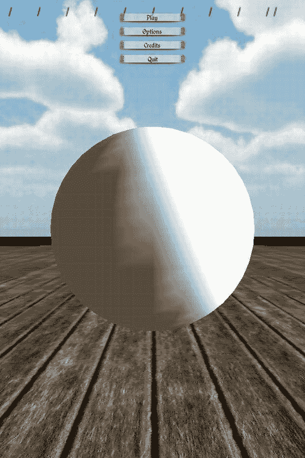

图 12-4. 暂停菜单在高分辨率屏幕上显得很小

要缩放 GUI，首先需要确定要使用的缩放因子，即当前屏幕宽度除以你最初目标屏幕宽度。GUI 在 320×480 像素的 iPhone 3GS 上看起来没问题，因此我们假设目标基础屏幕宽度为 320。所以，如果我们实际运行在 iPhone 4 上（例如 640×960 像素），就需要将 GUI 放大两倍。

下一步是应用缩放因子。这在 UnityGUI 中可以通过设置静态变量`GUI.matrix`来实现，该变量是一个*变换矩阵*。在计算机图形学中，变换矩阵包含并应用了平移（位置变化）、旋转和缩放。

实际上，`Transform`组件的局部位置、旋转和缩放对应的是该`GameObject`的一个 4×4 变换矩阵。而世界位置、旋转和缩放则是通过组合（相乘）一个`GameObject`的所有父`GameObject`的变换矩阵计算得出的。在过去，你在计算机图形编程中需要自行编写这些线性代数代码。现在你可以让游戏引擎帮你隐藏这些细节，但这里你将略窥门径。

#### 缩放记分板

我们从记分板开始，因为这部分相对简单一些，只需对`FuguBowlScoreboard`脚本进行代码清单 12-1 所示的修改。新增了一个名为`baseScreenWidth`的变量，用于指定基础屏幕宽度，默认为 iPhone 3GS 的 320 像素宽度。该变量是公开的，因此你可以在检视面板中调整它。

然后，在`OnGUI`函数的开头（这样它就会在任何 GUI 渲染之前生效），用两行代码构建缩放矩阵并将其赋值给`GUI.matrix`。

代码清单 12-1.  FuguBowlScoreboard.js 脚本中添加了缩放功能

```
var baseScreenWidth:float = 320.0;

function OnGUI() {
#if UNITY_IPHONE
        var guiScale:float = Screen.width/baseScreenWidth;
        GUI.matrix = Matrix4x4.TRS (Vector3.zero, Quaternion.identity, Vector3(guiScale, guiScale, 1));
#endif
```

新代码仅适用于 iOS（尽管它在任何平台上都能工作），因此新代码行被包裹在`#if UNITY_IPHONE`和`#endif`之间。`UNITY_IPHONE`是一个内置预处理器定义，仅当构建目标为 iOS 时才会被定义（你也可以使用`UNITY_IOS`）。最终结果是，额外的代码仅在 iOS 中变为可执行代码，如果你构建到其他目标平台，这些代码基本上会消失（我们没有对`baseScreenWidth`这样做，因为即使构建目标改变，我们也不想丢失其在检视面板中的设置）。

在这两行实际代码中，第一行根据`Screen.width`（当前屏幕宽度）和`baseScreenWidth`（GUI 编码时预设的渲染屏幕宽度）计算需要缩放 GUI 的比例。结果赋给局部变量`guiScale`。

你可能想知道为什么我们将`baseScreenWidth`声明为`float`而不是`int`。原因如下：`Screen.width`是一个`int`，如果你用`int`除以`int`，编译器会假设你想要一个`int`结果。例如，将 640（iPhone 4）除以 320 得到 2，这样没问题。但如果你在 iPad 2 上运行，需要将 768 除以 320，结果会向下取整为 2，这在某些情况下就错了。但只要运算中的其中一个数字是`float`，编译器就会将整个运算视为浮点计算。

**注意**  在进行运算时，如果你提供的是`int`输入却期望得到`float`结果，请务必小心。这是一个常见的错误来源。

计算结果传递给`Matrix4x4.TRS`调用，该函数会构建一个包含平移、旋转和缩放的 4x4 矩阵。平移量为`Vector3.zero`（x、y 和 z 均为 0），旋转量为`Quaternion.identity`（单位四元数表示无旋转），缩放量由一个`Vector3`表示。基于屏幕尺寸的缩放因子应用于 x 和 y 方向，z 轴保持未缩放状态，因为该方向指向屏幕内部。

#### 缩放暂停菜单

缩放暂停菜单的过程几乎完全相同。让我们在`FuguPause`脚本的`OnGUI`函数开头添加相同的`baseScreenWidth`公共变量和设置`GUI.matrix`的代码（代码清单 12-2）。

代码清单 12-2.  FuguPause.js 中缩放暂停菜单

```
var baseScreenWidth:float = 320.0;

function OnGUI () {
        if (IsGamePaused()) {
                 #if UNITY_IPHONE
                 var guiScale:float = Screen.width/baseScreenWidth;
                 GUI.matrix = Matrix4x4.TRS (Vector3.zero, Quaternion.identity, Vector3(guiScale, guiScale, 1));
                 #endif
                 if (skin != null) {
                         GUI.skin = skin;
                 } else {
                         GUI.color = hudColor;
                 }
                 switch (currentPage) {
                         case Page.Main: ShowPauseMenu(); break;
                         case Page.Options: ShowOptions(); break;
                         case Page.Credits: ShowCredits(); break;
                 }
        }
}
```

不过，还需要做一处修改。`BeginPage`函数使用`Screen.width`来居中 GUI，因此你需要改用`baseScreenWidth`。代码清单 12-3 展示了此项代码更改。

代码清单 12-3.  修改后的 BeginPage 函数，使其与缩放后的 GUI 配合工作

```
function BeginPage(width:int,height:int) {
#if !UNITY_IPHONE
         GUILayout.BeginArea(Rect((screenWidth-width)/2,menutop,width,height));
#else
         GUILayout.BeginArea(Rect((baseScreenWidth-width)/2,menutop,width,height));
#endif
}
```


好的，作为一名高级文档工程师和翻译员，我将根据您提供的格式和注意事项，将给定的英文文本翻译成中文。


注意到我们使用了`#if !UNITY_IPHONE`。感叹号表示“非”，因此第一行实际代码适用于除 iOS 以外的任何构建目标，而另一行仅适用于 iOS。我们也可以颠倒两行代码的顺序，并以`#if UNITY_IPHONE`开头。

在此过程中，我们还应该从暂停菜单中移除“退出”按钮，因为苹果会拒绝任何带有退出选项的应用。`FuguPause`脚本的`ShowPauseMenu`函数中的“退出”按钮已通过检查`UNITY_WEBPLAYER`预处理定义，从 Unity Web 播放器构建中排除，因此我们只需添加对`UNITY_IPHONE`的检查即可（清单 12-4）。

*清单 12-4. 从`FuguPause.js`的 iOS 构建中排除“退出”按钮*

```
function ShowPauseMenu() {
        BeginPage(150,300);
        if (GUILayout.Button ("Play")) {
                 UnPauseGame();
        }
        if (GUILayout.Button ("Options")) {
                 currentPage = Page.Options;
        }
        if (GUILayout.Button ("Credits")) {
                 currentPage = Page.Credits;
        }
#if !UNITY_IPHONE && !UNITY_WEBPLAYER
        if (GUILayout.Button ("Quit")) {
                 Application.Quit();
        }
#endif
        EndPage();
}
```

“退出”按钮仅在构建时包含在`#if !UNITY_IPHONE && !UNITY_WEBPLAYER`中，当构建目标不是 iOS*且*不是 Web 播放器时，该条件为真。现在构建游戏时，你应该能看到暂停菜单在设备（或 iOS 模拟器）上运行，并根据屏幕分辨率缩放，并且缺少“退出”按钮，如图 12-5 中的 iPhone 4 截图所示。

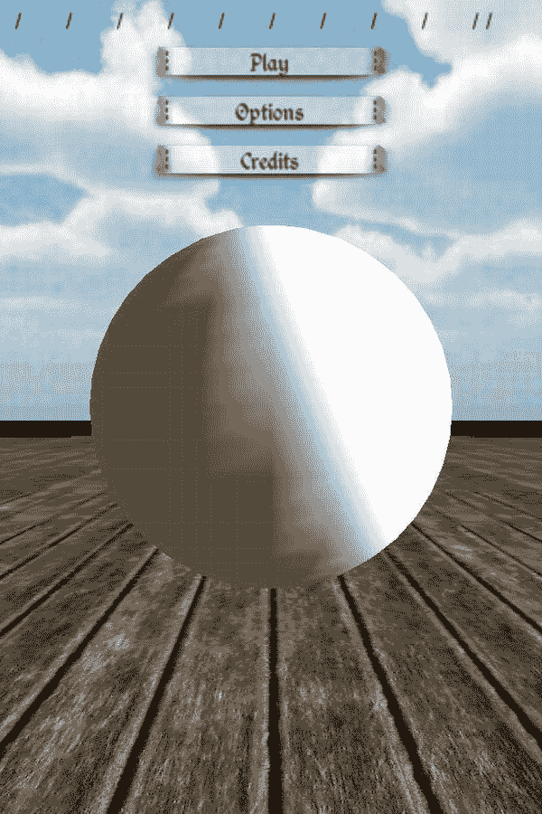

图 12-5. 缩放后的暂停菜单

### 设置图标

默认情况下，你的应用图标将是 Unity 徽标。图 12-6 展示了 Unity Technologies 在 App Store 上发布的几个演示应用的图标。除了`Angry Bots`，其他应用都使用默认的 Unity 图标，尽管是旧版本的图标，因为它们是使用 Unity 3 构建的（在撰写本文时尚未更新）。

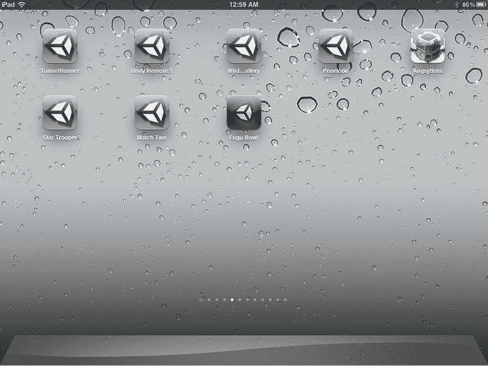

图 12-6. 带有默认 Unity 图标的应用

图 12-6 也展示了如果我们现在构建`Fugu Bowl`应用的图标。它看起来略有不同，因为它是用 Unity 4 发布的，并且还带有苹果自动应用的光泽，因为我们没有在 iOS Player Settings 中选择`Prerendered Icon`。

要自定义图标，你可以将任何纹理拖拽到 Player Settings 的`Default Icon`字段中。让我们使用`Textures`文件夹中的`Icon1024`纹理，该纹理从本章的项目`http://learnunity4.com/`复制而来。我经常在文件名中指明原始纹理尺寸（在本例中为 1024x1024 纹理），这样可以节省分配图标和启动屏幕纹理的大量时间。

由于你将纹理用作图标，因此应适当调整导入设置。

在 Project View 中选择`Icon1024`纹理，然后在 Inspector 视图中，将`Texture Type`设置为`GUI`而不是`Texture`（图 12-7）。这将防止 Unity 应用适用于 3D 模型纹理但不适用于 GUI 显示的设置。例如，用于模型的纹理的尺寸应为 2 的幂次方，如 256 × 256 或 512 × 512，因为图形硬件喜欢以这种方式工作，并且纹理无论如何都会围绕模型拉伸。但通常，GUI 纹理应保持其原始分辨率，因为它们通常根据预期的显示尺寸调整（通常不是 2 的幂次方分辨率）。你可以将`Texture Type`切换到`Advanced`来比较`Texture`和`GUI`预设纹理类型的基础设置，即选择`Texture`然后切换到`Advanced`，然后选择`GUI`再切换到`Advanced`。在`Advanced`模式下，你可以覆盖任何预设值，以便更精细地控制导入设置。

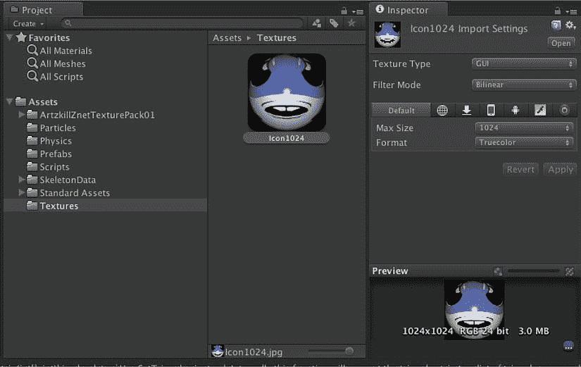

图 12-7. 图标纹理的导入设置

**提示** 如果你要将纹理用于两个不同的目的，请复制它，以便为每个目的应用不同的导入设置。

在`Texture Type`区域下方，指定了纹理的最大尺寸和压缩级别。如果使用了压缩纹理作为图标，Unity 将在构建时生成警告，正确指出压缩纹理作为图标可能看起来不好。因此，选择`Default`标签，以便这些设置适用于所有平台（除非被覆盖），将`Max Size`设置为`1024`以避免缩放纹理，并将`Format`设置为`TrueColor`以获得全彩色分辨率且无压缩。点击`Apply`以调整后的设置重新导入纹理，底部的`Preview`将反映新的格式、尺寸和内存使用情况。

现在将图标纹理拖拽到 Player Settings 中`Cross Platform`区域的`Default Icon`字段。检查 iOS Settings 的`Icon`折叠区域（图 12-8）。只要未选中`Override for iPhone`复选框，`Default Icon`的自动缩放版本将出现在所有其他图标尺寸中（图 12-8）。

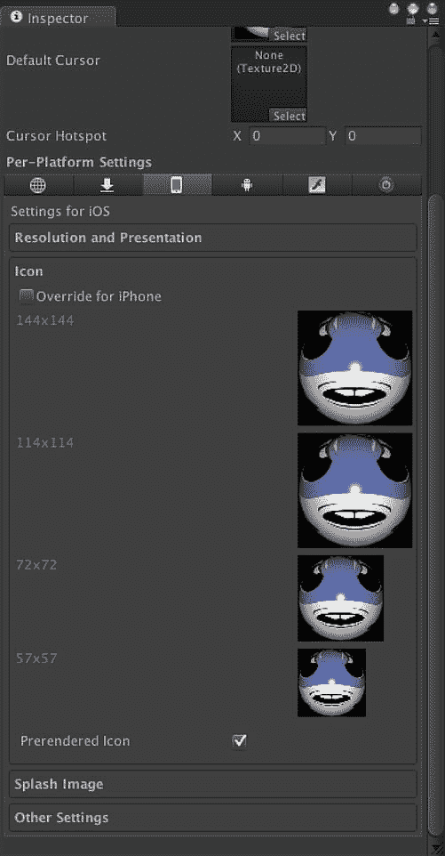

图 12-8. Player Settings 中`Default Icon`缩放为不同图标尺寸

各种图标尺寸对应于不同 iOS 设备的屏幕分辨率：

- 57 × 57：第四代之前的任何 iPhone 或 iPod touch（iPhone 3GS 或第三代 iPod touch）
- 114 × 114：第四代及之后的 iPod touch 和 iPhone
- 72 × 72：原始 iPad、iPad 2 和 iPad Mini
- 144 × 144：“新”iPad（或我喜欢称之为 iPad 3）

理想情况下，应为每种尺寸定制一个图标，在这种情况下，你需要勾选`Override`复选框，然后将图标的各个版本拖拽到相应的框中。任何未填充的框将使用`Default Icon`。但 Unity 在缩小纹理方面做得很好（缩小远优于放大），因此我经常重复使用我上传到 iTunes Connect 应用描述的同一 1024 × 1024 纹理。

**提示** 如果你未对 iTunes Connect 和 Player Settings 使用相同的图标文件，请确保各种图标至少彼此相似。我曾因应用在 iTunes Connect 上的图标与设备上显示的应用图标不相似而被拒绝。

我建议你始终选择`Prerendered Icon`选项，以避免苹果自动添加光泽。

除了可选的光泽外，从 Xcode 执行的构建部分还会自动圆角化图标并添加投影。所以不要自己处理这些！保持图标方形、尖角且无特殊边框。


### 设置启动画面（专业版）

所有 iOS 应用在启动时都会显示一个静态的“启动”画面。与默认的应用图标类似，Unity 构建的应用中的默认启动画面会显示 Unity 徽标（图 12-9）。

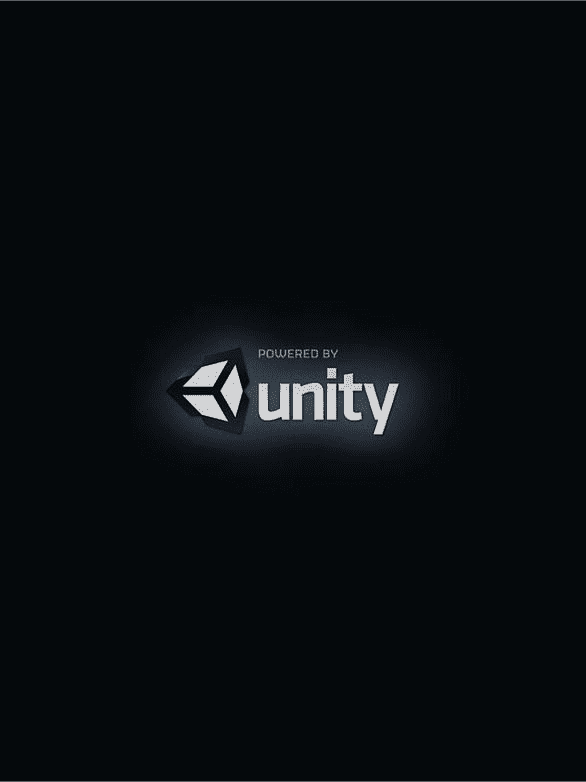

*图 12-9. 默认的 Unity 启动画面*

如果你使用的是 Unity iOS Basic 版本，则只能使用默认的启动画面。但如果你使用的是 Unity iOS Pro 版本，则可以像自定义应用图标一样，提供自己的启动画面。

“启动图像”折叠菜单位于 iOS 设置中“图标”折叠菜单的下方，与图标选择类似，它提供了适用于各种 iOS 屏幕以及纵向和横向两种方向的多分辨率插槽（图 12-10）：

*   *移动设备启动画面*：适用于第四代之前的 iPod touch 或 iPhone（即 iPhone 4），分辨率为 320 × 480
*   *iPhone 3.5 英寸/Retina*：适用于 iPhone 4、iPhone 4S 和第四代 iPod touch 的 Retina 显示屏，分辨率为 640 × 960
*   *iPhone 4 英寸/Retina*：适用于 iPhone 5 和第五代 iPod touch，分辨率为 640 × 1136
*   *iPad 纵向*：适用于初代 iPad 和 iPad 2，分辨率为 768 × 1024
*   *iPad 横向*：适用于初代 iPad 和 iPad 2，分辨率为 1004 × 768
*   *高分辨率 iPad 纵向*：适用于新 iPad（iPad 3）的 Retina 显示屏
*   *高分辨率 iPad 横向*：适用于新 iPad（iPad 3）的 Retina 显示屏

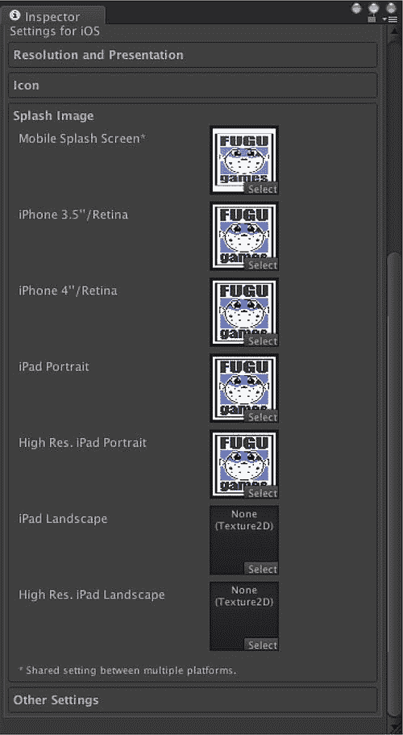

*图 12-10。不同屏幕分辨率和方向下的启动画面*

Unity 并没有一个默认的启动画面可以自动调整大小以适应所有启动分辨率，因此你必须根据你的游戏将使用的分辨率和方向，填充相应的启动画面框。由于在“分辨率和演示”设置中仅选择了纵向和纵向上下颠倒方向（以及自动旋转），因此只需要分配纵向启动画面。与图标一样，启动画面可以是任何纹理，Unity 会根据需要缩放它们，但使用已经是目标尺寸的纹理可以获得最佳效果。你应该使用适合你的公司和游戏的内容。

**注意：** Apple 建议启动画面看起来像游戏的实际画面，但通常只显示公司徽标。就我个人而言，我认为显示一个像无响应的游戏画面一样的画面会令人困惑。

将每个启动画面纹理从“纹理”文件夹拖入“播放器设置”中匹配的启动画面框（图 12-10）：将 `Fugu320x480` 拖入“移动设备启动画面”，将 `Fugu640x960` 拖入“iPhone 3.5 英寸/Retina”，将 `Fugu1536x2048` 拖入“高分辨率 iPad 纵向”。“iPhone 4 英寸/Retina”需要一个纹理，因此将最接近的匹配项 `Fugu640x960` 拖入其中。而 `Fugu1536x2048` 可用于“iPad 纵向”。

#### 第二个启动画面

虽然你不能在 Unity iOS Basic 中更改启动画面，但你可以制作一个在内置启动画面之后立即显示的启动画面。你只需要创建一个场景，在屏幕上显示启动纹理几秒钟，然后加载第一个游戏场景。如果你希望拥有多个启动画面，这对于 Unity iOS Pro 也很有用。例如，在 HyperBowl 中，我在内置启动画面中显示了一些 HyperBowl 艺术作品，然后在第二个启动画面中显示了我的 Fugu Games 徽标。

##### 创建启动场景

从“文件”菜单调用“新建场景”命令，创建一个新的空场景。将其保存为 `Splash`。调出“构建设置”窗口，点击“添加当前”将新场景添加到你的构建中。它将出现在场景列表的底部，因此将其拖到顶部。其场景索引现在应该显示为 0，这意味着它是第一个加载的场景（图 12-11）。

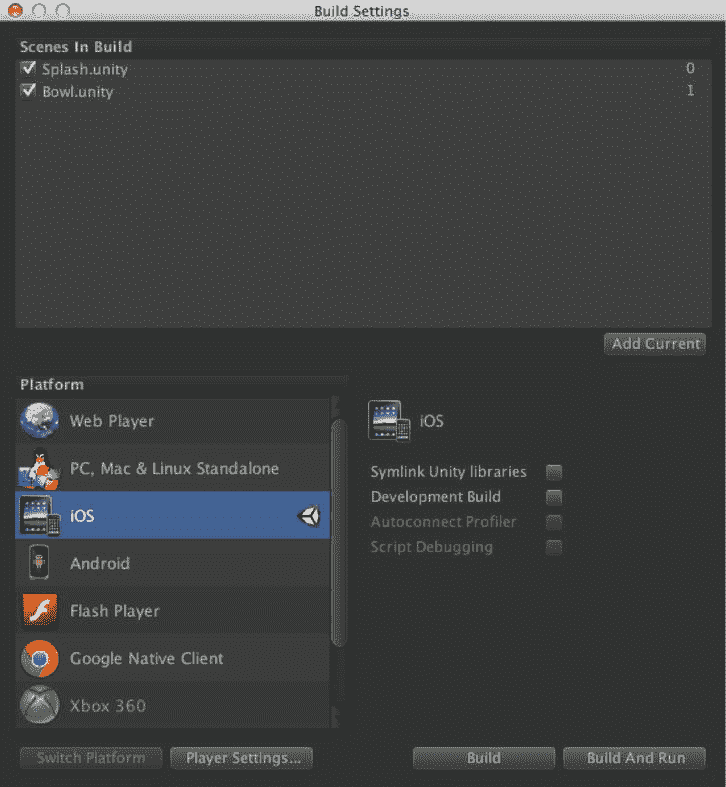

*图 12-11。添加了启动场景的构建设置*

##### 创建启动画面

显示全屏纹理的最简单方法是使用 `GUITexture`。在启动场景中，转到“游戏对象”菜单中的“创建其他”子菜单，选择“GUI 纹理”（图 12-12）。

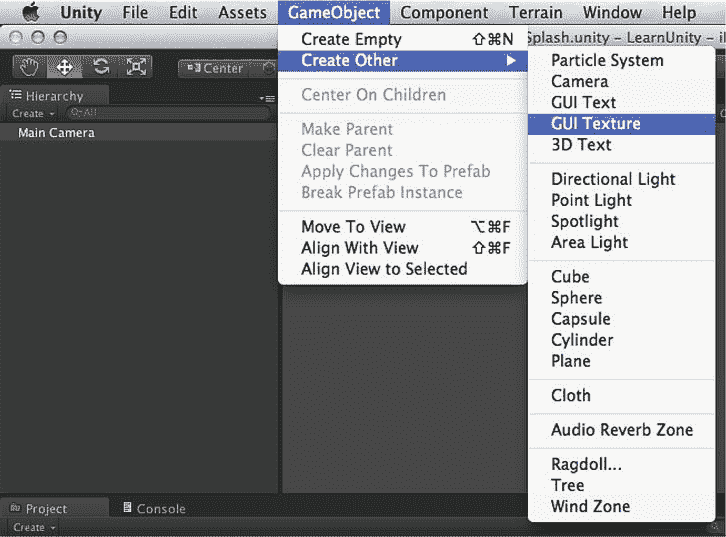

*图 12-12。创建一个 GUI 纹理*

将生成的 `GameObject` 重命名为 `Screen`，并在“检视视图”中检查它。新创建的 `GUITexture` 在屏幕中央显示一个 Unity 水印（图 12-13）。与 UnityGUI 不同，`GUITexture` 使用归一化屏幕坐标：x 和 y 的范围从 0 到 1，其中 0,0 是屏幕的左上角，1,1 是右下角，因此将 x 和 y 都设置为 0.5 表示纹理在屏幕上居中。

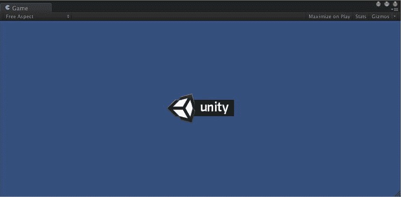

*图 12-13。默认的 GUI 纹理*

让我们用我们的启动纹理替换水印纹理。将“项目视图”中“纹理”文件夹下的 `LearnUnityCover` 纹理拖入 `GUITexture` 组件的“纹理”字段。为了使纹理拉伸铺满整个屏幕，将缩放更改为 1,1,1，并将所有 `Pixel Inset` 值设置为 0（图 12-14）。

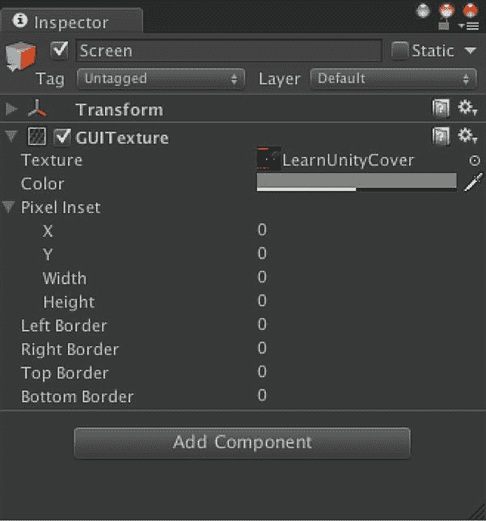

*图 12-14。全屏 GUI 纹理*

现在，如果你运行游戏，你会看到启动纹理拉伸填满屏幕。在设备或 iOS 模拟器上运行时，它将出现在内置启动画面之后（图 12-15）。

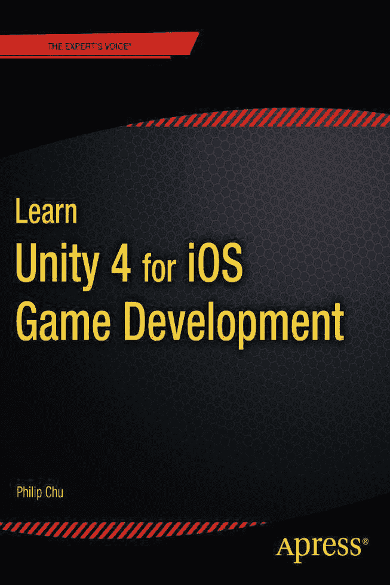

*图 12-15。全尺寸的二级启动画面*

##### 加载下一个场景

作为启动画面，此场景应停留几秒钟，然后开始加载游戏场景。像任何真实的游戏关卡一样，该场景可以使用一个主逻辑脚本，因此创建一个新的 JavaScript，将其命名为 `FuguSplash`，并添加代码清单 12-5 的内容。

*代码清单 12-5。FuguSplash.js 中的等待并加载代码*

```javascript
var waitTime:float=2; // 秒
var level:String;     // 要加载的场景名称

function Start() {
        yield WaitForSeconds(waitTime);
        Application.LoadLevel(level);
}
```

有两个可以在“检视视图”中自定义的公共变量：加载下一个场景之前的等待时间（以秒为单位）和要加载的场景名称。`Start` 函数非常简单；它等待内置协程 `WaitForSeconds` 完成，传入指定的等待时间，然后调用 `Application.LoadLevel` 加载你指定的关卡。在此过程中，当前场景将被卸载，因此启动画面将消失。

让我们将脚本添加到启动场景中。创建一个空的 `GameObject`，将其命名为 `Splash`，并将 `FuguSplash` 脚本附加到它上面。然后在“检视视图”中，在“关卡”字段中输入保龄球场景的名称（图 12-16）。现在，如果你在编辑器或 iOS 构建中运行游戏，启动画面将显示几秒钟，然后保龄球场景就会出现。

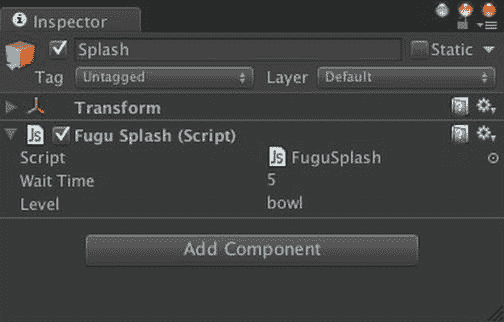

*图 12-16。添加到启动场景的 FuguSplash 脚本*

关于 `WaitForSeconds` 的几句话；它很方便，但你可以实现自己的版本。代码清单 12-6 显示了一个假设的实现。

*代码清单 12-6。WaitForSeconds 的一种实现*


```csharp
function WaitForSeconds(waitTime:float) {
        var startTime:float = Time.time;
        while (waitTime > Time.time-startTime) {
                 yield;
        }
}
```

注意，指定的等待时间是游戏时间而非真实世界时间，因此`WaitForSeconds`在游戏暂停且游戏时间停止时无实用价值。但若需按真实秒数等待，可使用假设实现的`WaitForSeconds`，将`Time.time`替换为`Time.realtimeSinceStartup`（返回游戏启动以来的真实世界秒数）（清单 12-7）。

清单 12-7.  `WaitForSeconds`的实时版本

```csharp
function WaitForSecondsRealtime(waitTime:float) {
        var startTime:float = Time.realtimeSinceStartup;
        while (waitTime > Time.realtimeSinceStartup-startTime) {
                 yield;
        }
}
```

### 显示活动指示器

当某些操作需要耗时执行时，最好能有某种加载指示器。对于初始场景加载，有一种便捷方式可显示 iOS 应用中常见的旋转指示器。在玩家设置（Player Settings）的“分辨率与演示”折叠面板底部的“显示加载指示器”选项中，选择一个活动指示器样式即可启用该功能（图 12-17）。由于启动画面提供的是偏白色背景，灰色（Gray）是最佳样式（其他样式为白色）。

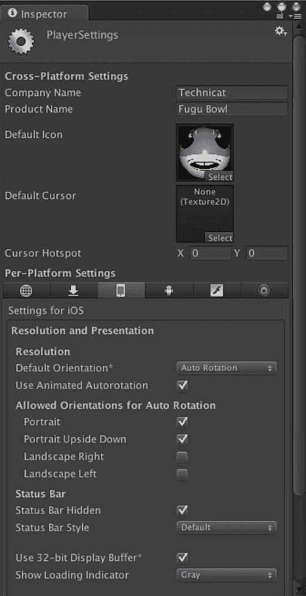

图 12-17. 玩家设置中选中灰色显示加载指示器

现在，当你在 iOS 构建版本中运行游戏时，将看到灰色活动指示器在内置启动画面上旋转。

### 编写活动指示器脚本

能在其他场景（尤其在加载其他关卡时）使用活动指示器将非常理想。幸运的是，Unity 通过`Handheld`类中的静态函数提供了活动指示器的脚本接口。我们只需编写一个调用这些函数来启动和停止活动指示器的脚本。新建一个名为`FuguSpinner`的 JavaScript 文件，并将清单 12-8 的内容添加到脚本中。

清单 12-8.  在`FuguSpinner.js`中启动和停止活动指示器

```csharp
#pragma strict

#if UNITY_IPHONE
function Start() {
        DontDestroyOnLoad(this.gameObject);
        Handheld.SetActivityIndicatorStyle(iOSActivityIndicatorStyle.WhiteLarge);
        Handheld.StartActivityIndicator();
}

function OnLevelWasLoaded() {
        Handheld.StopActivityIndicator();
        Destroy(gameObject);
}
#endif
```

在`Start`回调中，调用`Handheld.SetActivityIndicatorStyle`指定活动指示器的外观。可用的选项由`iOSActivityIndicatorStyle`枚举表示，与玩家设置中的加载指示器选项匹配。我们选择`iOSActivityIndicatorStyle.WhiteLarge`，因为我们知道第二个启动画面主要是黑色背景。

调用`Handheld.StartActivityIndicator`可使活动指示器在屏幕中央显示。Unity 脚本参考文档对`Handheld.StartActivityIndicator`的说明指出，活动指示器将在当前帧之后激活，因此在调用`Application.LoadLevel`前，至少需要`yield`一帧。否则，指示器只有在加载新关卡后才会出现，这违背了激活指示器的初衷。这里我们无需担心此问题，因为`FuguSplash`脚本在加载下一场景前会进行若干秒的`yield`。

然而，即使新场景被`FuguSplash`加载后，活动指示器仍会继续旋转。为在场景加载完成后停止活动指示器，此脚本必须能在场景加载过程中保持存活，因此在`Start`函数开头调用了`DontDestroyOnLoad`，并将此脚本所附加的游戏对象传递给它。这确保了该游戏对象（以及此脚本）在加载下一场景时得以存活。

由于游戏对象在场景加载过程中存活，我们可以确保新场景加载完成后会调用`MonoBehaviour`回调`OnLevelWasLoaded`。此处是调用`Handheld.StopActivityIndicator`关闭活动指示器的理想位置。此时，脚本及其附加的游戏对象不再需要，因此对游戏对象调用了`Destroy`。

**提示**   不再需要对象时将其销毁是一个好习惯。除了释放空间外，还能避免最坏情况：当你循环回到对象最初创建的场景时，最终会得到同一对象的两个版本！

请注意，`DontDestroyOnLoad`和`Destroy`都是`Object`类中的静态函数，因此正如我们在第 7 章中调用`Instantiate`时那样，这里不显式调用`Object.Destroy`（或为避免与.NET 中`System.Object`类名冲突而使用`UnityEngine.Object.Destroy`），而是隐式调用`this.Destroy`，因为`this`是一个`Object`。

将`FuguSpinner`脚本附加到场景中名为 Spinner 的新游戏对象上。现在在设备上构建并运行，活动指示器将出现在启动画面中央，并在下一场景加载完成后消失（图 12-18）。

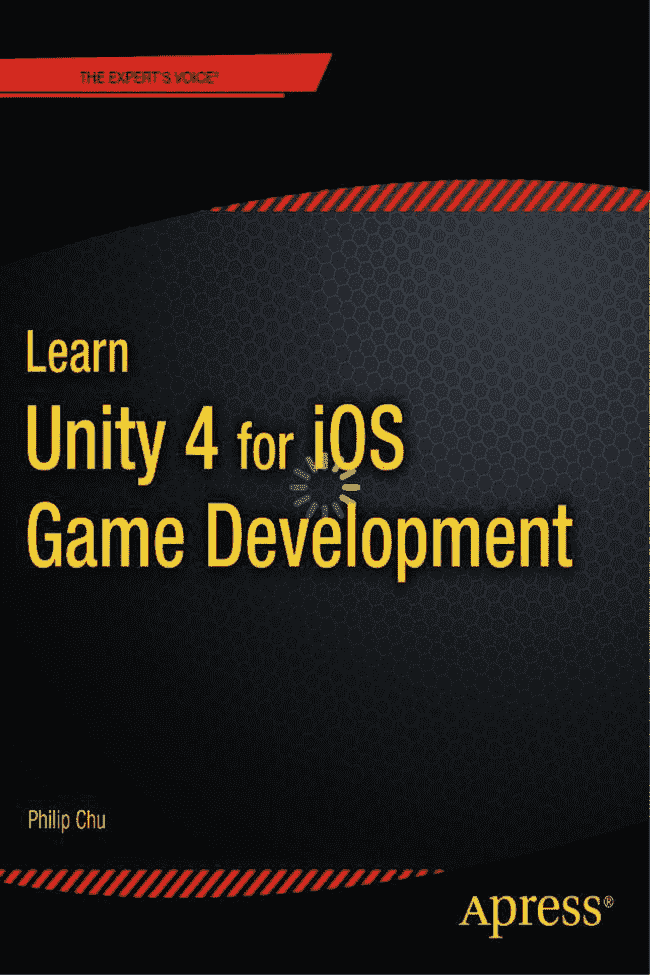

图 12-18. 带有活动指示器的第二个启动画面

## 进一步探索

现在，我们的 iOS 保龄球游戏看起来像真正的应用了！它具有图标、启动画面（或两个）、启动画面上旋转的活动指示器、以竖屏方向运行，并且图形能适配屏幕，包括 UnityGUI 记分板和暂停菜单。甚至菜单在 iOS 中也能自动工作，按钮能响应屏幕点触。虽然还不能完全说游戏玩法也是如此，但我们将在下一章实现触摸屏游戏控制。

#### 参考手册

我们再次在玩家设置中花费了一些时间（现在制作 iOS 构建版本时，玩家设置成为反复出现的主题），因此值得回顾关于玩家设置的参考手册文档。

本章只使用了一个新组件：用于启动画面图像的`GUITexture`组件。`GUITexture`及其父类`GUIElement`与 UnityGUI 无关（事实上，在 UnityGUI 出现之前，`GUITexture`及其兄弟`GUIText`是最接近用户界面元素的东西）。

本章主要致力于图标和启动画面图像，这些图像应使用 GUI 预设导入设置导入，该设置在资产组件部分的`Texture2D`文档中有说明。

#### 脚本参考

本章介绍的唯一 UnityGUI 新特性是`GUI`类中的`matrix`变量。撰写本文时，该变量的脚本参考页面几乎为空白，但`GUIUtility`类有一些文档更完善的函数，包括`ScaleAroundPivot`，该函数可作为设置`GUI.matrix`的替代方案（实际上，它是一个内部设置`GUI.matrix`的辅助函数）。

我们只使用了`Matrix4x4.TRS`构造函数，但关于`Matrix4x4`的脚本参考文档质量不错，解释了 Unity 中矩阵的用法，并列举了许多类函数，当你需要开始处理矩阵时，这些函数会很有用。
```


# 在第 8 章介绍游戏结束状态时，已经引入了`yield`指令`WaitForSeconds`，它被证明能方便地在特定秒数后显示启动画面。我们借此机会探讨了`WaitForSeconds`的假设性实现，并比较了静态`Time`变量`Time.time`和`Time.realTimeSinceStartup`。当暂停菜单弹出、游戏时间暂停时，这两者的区别至关重要。

我们调用静态的`Application`函数`LoadLevel`来从启动场景过渡到保龄球场景，但也可以调用该函数的异步版本`Application.LoadLevelAsync`。作为一个异步函数，它在加载新场景时不会暂停 Unity，因此，在等待新场景加载完成的过程中，你实际上可以让启动场景中发生任何事情。

正如我们使用`Handheld`类中的活动指示器函数所演示的那样，你可以通过调用`DontDestroyOnLoad`让物体在场景加载中存活下来，并在不再需要时调用`Destroy`来销毁它们。这两者都是`Object`类中的静态函数，由于`Object`类是场景中所有物体的父类，因此它始终值得一读。

为了显示和隐藏活动指示器，我们调用了`Handheld`类中的`StartActivityIndicator`和`StopActivityIndicator`函数。请参阅关于活动指示器函数的文档，了解在执行场景加载之前需要执行 yield 的原因。`iOSActivityIndicatorStyle`枚举列出了可用的活动指示器样式。

`Handheld`类值得一读，因为它包含了所有可脚本化编写的 Unity 移动端功能（iOS 特有功能除外）。例如，`Handheld`类有一个静态的`PlayFullScreenMovie`函数，可以播放本地存储或从网站流式传输的电影，这也是创建酷炫启动画面的另一种可能性。该函数的脚本参考页面详细介绍了支持的视频格式以及如何控制电影播放器（在撰写本文时，它基于原生的 iOS 电影播放器`MPMoviePlayerController`）。

#### iOS 开发者库

随着我们探索 Unity iOS 功能，iOS 开发者库中越来越多的文档变得相关。请记住，这些文档既可以在 Apple 开发者网站（`http://developer.apple.com/`）上找到，也可以在 Xcode Organizer 窗口中找到。

在 iOS 开发者库的`用户体验`主题中，有一份值得通篇阅读的文档，那就是 Apple 的《iOS 人机界面指南》。这份指南最初可追溯至最早的 Mac，曾是用户界面最佳实践的黄金标准。此后，该指南被分成了 Mac 和 iOS 两个版本，但即使仅仅是为了避免应用被拒，你也应该阅读 iOS 版本。与本章节相关的是，《自定义图标和图像创建指南》列出了创建应用图标和启动画面（在 Apple 的术语中称为`launch images`）的要求和建议。

许多专门针对移动端或 iOS 的 Unity 类都有对应的 Objective-C 版本。例如，由 Unity 的`Handheld`类控制的活动指示器，在 Objective-C 中是通过`UIActivityIndicatorView`类来访问的，该类同样可以在`用户体验`主题下的`窗口与视图`部分找到。

#### 资源商店

来自 DFT Games 的过渡管理器可在 Unity 资源商店免费获取，它提供了比本章所述更复杂的启动画面行为，包括屏幕淡入淡出以及使用多个屏幕。我在所有应用中都使用了这个过渡管理器。

#### 书籍

Josh Clark 的《*Tapworthy: Designing Great Apps*》这本书说服了我放弃自动图标光泽，并始终在 Unity Player Settings 中选择“Prerendered Icon”。这本书也是对应用设计的总体优秀论述。

关于线性代数的教科书有很多（甚至在`http://wikipedia.org/`上还有一篇内容详尽的`matrix`文章），但任何计算机图形学书籍都会包含矩阵数学的基础内容。例如，《Real-Time Rendering》（`http://realtimerendering.com/`）中就有一个关于《一些线性代数》的附录。

# 第 13 章

## 处理设备输入

虽然我们的保龄球游戏已经在 iOS 上运行了起来，但它尚未达到可玩的状态，因为我们没有任何有效的玩家控制。这便引出了输入处理的问题——这可能是桌面游戏与移动游戏之间最显著的区别。

iOS 游戏不能读取鼠标或键盘，而必须使用其设备传感器之一，通常是触摸屏（点击和滑动）或加速度计（摇晃和倾斜）。我们将选择触摸屏输入来控制保龄球，但也会利用加速度计做一些晃动检测，并稍微摆弄一下设备摄像头。

本章项目文件位于`http://learnunity4.com/`，其中包含了本章引入的脚本更改，没有添加其他资源。本书余下部分也是如此。从现在开始，全是脚本编写了！

### 触摸屏

UnityGUI 在 iOS 上已经能良好地配合触摸屏工作，因此，如果你现在在设备上构建并运行保龄球游戏，或者在编辑器中使用 Unity Remote 进行测试，你可以通过点击按钮来操作初始菜单。当你点击暂停菜单上的“Play”按钮时，保龄球会落下。到目前为止，一切顺利。

但保龄球的控制呢？`Input.GetAxis`在屏幕上滑动时确实会返回值，但结果很可能不是你想要的（在旧版 Unity iOS 中，`Input.GetAxis`甚至完全不起作用）。无论如何，我们首先需要定义在 iOS 版保龄球游戏中控制将如何工作。

#### 滑动球

对于“Fugu Bowl”，我们将采用我在“HyperBowl”中使用的触摸屏控制方式。玩家通过沿某个方向在屏幕上滑动，来将球推向那个方向。在屏幕上向上滑动会将球向前推，向下滑动会将球向后推，向左滑动会让球向左滚动，向右滑动则让球向右滚动。

滑动控制方案与鼠标控制非常相似，因此我们可以在现有的`FuguBowlForce`脚本框架内进行修改。打开该脚本，添加一些新的公共变量`swipepowerx`和`swipepowery`，这样我们就可以像调整鼠标控制那样调整滑动力度（代码清单 13-1）。

代码清单 13-1。`FuguBowlForce.js`中滑动控制的调整变量

```
var swipepowerx:float = 0.1;
var swipepowery:float = 0.08;
```

我们添加了新变量，而没有重用`mousepowerx`和`mousepowery`，这样我们就可以在独立平台和 iOS 构建目标之间切换，而不会干扰每个平台的力度调整值。两个平台的属性都会显示在检视面板中（图 13-1）。

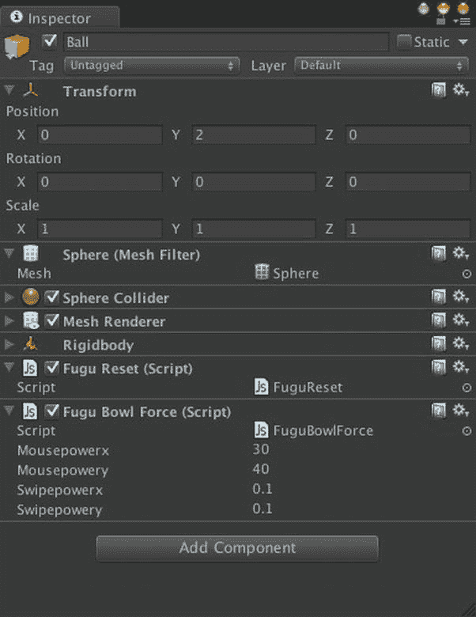

图 13-1。`FuguBowlForce.js`中桌面端和 iOS 端的控制调整

最大的变化是我们的`CalcForce`函数，它被我们的`Update`回调每帧调用一次。在 iOS 上，`CalcForce`不再调用静态函数`Input.GetAxis`来检查鼠标移动了多少，而是调用静态函数`Input.GetTouch`来检测滑动。`UNITY_IPHONE`预处理定义确保新代码只存在于 iOS 平台，而旧代码则用于其他所有平台（代码清单 13-2）。

代码清单 13-2。在`FuguBowlForce.js`中检测滑动


```csharp
function CalcForce() {
        var deltatime:float = Time.deltaTime;
#if UNITY_IPHONE
        if (Input.touchCount > 0) {
                // 获取自上一帧以来手指的移动距离
                var touch:Touch = Input.GetTouch(0);
                if (touch.phase == TouchPhase.Moved) {
                         var touchPositionDelta:Vector2 = touch.deltaPosition;
                         forcey = swipepowery*touchPositionDelta.y/deltatime;
                         forcex = swipepowerx*touchPositionDelta.x/deltatime;
                }
        }
#else
        forcey = mousepowery*Input.GetAxis("Mouse Y")/deltatime;
        forcex = mousepowerx*Input.GetAxis("Mouse X")/deltatime;
#endif
}

```

与 `Input.GetAxis` 类似，`Input.GetTouch` 返回自上一帧以来注册的信息，因此您可以在 `CalcForce` 中调用它，而 `CalcForce` 由 `Update` 调用，即每帧调用一次。

`Input.GetTouch` 返回一个 `Touch` 类型的结构体，该结构体描述了触摸事件：手指是被按下、抬起还是移动，如果移动了，则包含移动的像素数。

我们目前处理的是多点触摸屏幕，因此 `Input.GetTouch` 有一个参数，它是一个整数，指示要返回最新的 `Input.Touch` 事件中的哪一个。触摸事件的数量可通过静态变量 `Input.touchCount` 获取，因此我们可以通过如下循环来处理所有触摸事件：

```csharp
for (var i:int=0; i < Input.touchCount; ++i) {
        var touch:Touch = Input.GetTouch(i);
// 在此处编写你的处理代码
}
```

但为了简单起见，我们只关注一根手指，所以只需检查是否存在一个或多个 `Touch` 事件，如果存在，则检查第一个：

```csharp
if (Input.touchCount > 0) {
        var touch:Touch = Input.GetTouch(0);
```

`Touch` 事件可以表示不同的手指动作：按下、抬起或拖动。这可以通过检查 `Touch` 对象的 phase 属性来判断，该属性是一个 `TouchPhase` 枚举。我们只关注表示手指在屏幕上拖动的 `Touch` 事件，因此检查触摸阶段是否为 `TouchPhase.Moved`：

```csharp
if (touch.phase == TouchPhase.Moved) {
```

如果是，则计算推动保龄球所需的力。这与鼠标控制类似，但不是乘以 `Input.GetAxis`，而是乘以 `Touch` 事件的 `deltaPosition` 属性，该属性表示手指在屏幕上拖动的像素数：

```csharp
var touchPositionDelta:Vector2 = touch.deltaPosition;
forcey = powery*touchPositionDelta.y/deltatime;
forcex = powerx*touchPositionDelta.x/deltatime;
```

请注意，`deltaPosition` 属性是一个 `Vector2`，它与 `Vector3` 类似，但只有 x 和 y 属性，没有 z 值。

现在，如果您在编辑器中点击“播放”并使用 Unity Remote 进行测试，或者在设备上执行“生成并运行”，球将朝着您滑动的方向滚动。

包含触摸屏功能的完整 `FuguBowlForce` 脚本可从 `http://learnuninty4.com/` 上本章的项目中获取。

### 点击球体

尽管我们的保龄球游戏不关心滑动操作在屏幕上的位置，但许多游戏需要检测特定的 `GameObject` 是否被触摸。在桌面和 Web 平台上，可以通过 `OnMouseDown`、`OnMouseUp` 和 `OnMouseOver` 等回调函数来检测带有 `Collider` 组件的 `GameObject` 上的鼠标事件。例如，脚本中的 `OnMouseDown` 回调会在鼠标点击脚本的 `GameObject`（更准确地说，是 `GameObject` 的 `Collider` 组件）时被调用。

**注意**   `OnMouse` 回调也适用于带有 `GUIText` 和 `GUITexture` 组件的 `GameObject`。在 UnityGUI 引入之前，这是 Unity 中最接近内置 GUI 系统的功能。

为了演示 `OnMouse` 回调的工作原理，创建一个名为 `FuguDebugOnMouse` 的新 JavaScript 文件，并将其附加到球体 `GameObject` 上（图 13-2）。

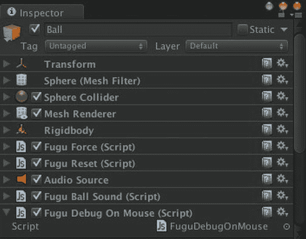

图 13-2. 附加了 `FuguDebugOnMouse` 脚本的球体

然后将 代码清单 13-3 的内容添加到脚本中。

代码清单 13-3.  在 `FuguDebugMouse.js` 中检测鼠标点击

```csharp
#pragma strict

function OnMouseDown () {
        Debug.Log("GameObject "+ gameObject.name + " was touched");
}
```

现在脚本中包含一个 `OnMouseDown` 回调，它会记录一条关于 `GameObject` 被触摸的消息。当您在编辑器中运行游戏并点击球体时，调试消息将出现在控制台视图中（图 13-3）。

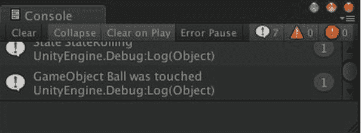

图 13-3. 演示 `OnMouseDown` 回调的调试消息

Unity iOS 会在响应触摸事件时调用 `OnMouse` 回调，除非没有明确的映射关系。例如，当鼠标悬停在 `GameObject` 上时调用的 `OnMouseOver`，其对应的触摸等效操作是什么？但当一个 `GameObject` 被点击时调用 `OnMouseDown`（当手指停止触摸屏幕时调用 `OnMouseUp`）是合理的。实际情况也确实如此，如果您在编辑器中通过 Unity Remote 再次运行游戏，或者在设备上执行“生成并运行”，您会看到相同的结果。无论哪种情况，点击球体都会产生与鼠标点击时相同的调试消息。

尽管 `OnMouse` 回调可以用于触摸操作（至少在一定程度上）非常方便，但了解如何实现自己的点击物体检测也很有用。这简单直接，只需结合检查点击操作和从屏幕位置沿相机方向向 3D 世界发射射线即可。*射线投射* 是寻找射线与第一个相交物体的过程（您可能还记得高中数学知识，射线有起点和方向，就像一支箭）。

为了演示，让我们创建一个名为 `FuguTap` 的新 JavaScript 文件，将其附加到主摄像头上（图 13-4），并将 代码清单 13-4 的内容添加到脚本中。

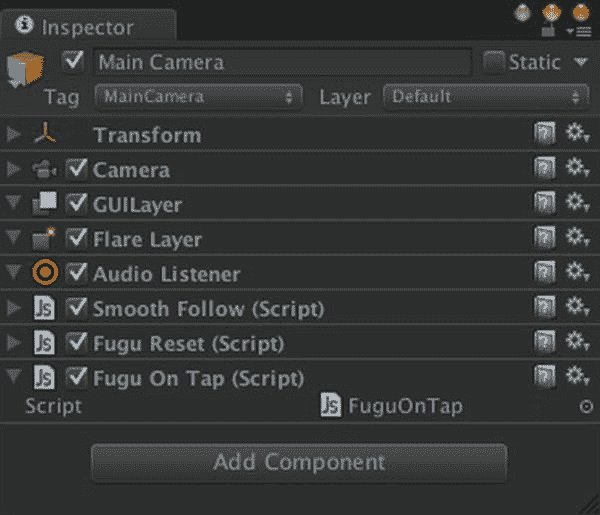

图 13-4. 附加了 `FuguOnTap` 脚本的主摄像头

代码清单 13-4.  模拟 `OnMouseDown` 事件的脚本

```csharp
#pragma strict

#if UNITY_IPHONE
function Update () {
                for (var i = 0; i < Input.touchCount; ++i) {
                         if (Input.GetTouch(i).phase == TouchPhase.Began) {
                                 var ray:Ray = camera.ScreenPointToRay (Input.GetTouch(i).position);
                                 var hit:RaycastHit;
                                 if (Physics.Raycast (ray,hit,camera.far,camera.cullingMask)) { hit.collider.SendMessage("OnTap",SendMessageOptions.DontRequireReceiver);
                                 }
                         }
                }
}
#endif
```

整个脚本由一个 `Update` 回调组成，该回调遍历上一帧中注册的所有触摸事件。但在此情况下，只关注点击的开始阶段，因此只考虑处于 `TouchPhase.Began` 阶段的触摸事件。提取每个此类触摸事件的屏幕坐标，并将其传递给 Camera 函数 `ScreenPointToRay`，以形成一个 `Ray`，该射线从屏幕位置开始，沿相机方向投射到 3D 世界中。


`Ray`被作为第一个参数传递给静态函数`Physics.Raycast`，以检查该`Ray`是否与任何游戏对象的碰撞体组件相交。如果存在第一个交点，则相关信息会通过作为第二个参数传入的`RayCastHit`结构体返回。第三个参数是射线投射的距离，第四个参数是用于测试相交的图层集合。通过将相机远平面距离作为射线投射距离，并将相机剔除遮罩（可见图层集合）作为用于相交测试的图层集合，可以限制射线投射的可能结果。

如果对`Physics.Raycast`的调用返回`true`（表示存在相交），则检索相交的碰撞体组件，并对其调用`SendMessage`以在附加的脚本中调用`OnTap`回调（对一个组件调用`SendMessage`等同于对该组件的游戏对象调用`SendMessage`）。

注意，对`SendMessage`的调用包含一个可选的第二个参数`SendMessageOptions.DontRequireReceiver`。如果没有该参数，当消息被发送到没有匹配函数（或本例中没有`OnTap`函数）的游戏对象时，Unity 会报告错误。

整个`Update`回调被包裹在`#ifdef UNITY_IPHONE`中，因为它仅用于 iOS 触摸屏输入。同样，你现在可以使用`UNITY_IPHONE`将`OnMouseDown`回调重命名为`OnTap`，以便由`FuguOnTap`脚本调用（清单 13-5）。

清单 13-5. FuguDebugOnMouse 脚本，为 iOS 提供备用回调名称

```csharp
#pragma strict
if !UNITY_IPHONE
function OnMouseDown () {
#else
function OnTap () {
#endif
        Debug.Log("GameObject "+ gameObject.name + " was touched");
}
```

现在，如果你再次运行游戏并点击球，你仍然会看到调试信息，但它将来自`FuguOnTap`发送的`OnTap`消息。

### 加速度计

每台 iOS 设备都有一个加速度计，用于测量三个不同方向的加速度。这三个值可以在静态变量`Input.accelerometer`中查看，它是一个`Vector3`。

`x`值对应于设备屏幕上从左到右的加速度。`y`值代表设备屏幕上从上到下的加速度，`z`值则是从设备正面到背面的加速度。从 Unity 4 开始，加速度计的值会根据设备方向进行调整，因此如果你以横向模式持有设备，加速度计的`x`值仍然从左到右变化。

#### 调试加速度计

一个古老而有效理解代码工作原理的方法是打印输出。让我们创建一个名为`FuguDebugAccel`的新 JavaScript 脚本，并将其附加到保龄球场景中一个名为`DebugAccel`的新游戏对象上。按照清单 13-6 所示，将`Update`函数添加到该脚本中。

清单 13-6. 打印加速度计值的代码

```csharp
function Update () {
        Debug.Log("accel x: "+Input.acceleration.x+" y: "+Input.acceleration.y+"                                                                                                                 z: "+Input.acceleration.z);
}
```

`Update`函数获取`x`、`y`和`z`的加速度计值，并将它们拼接成一个可读的字符串。如果你在 Unity 编辑器（使用 Unity Remote）中进行测试，`Debug.Log`会将该字符串发送到控制台视图；如果你在 iOS 模拟器或真机上运行，则会发送到 Xcode 调试区域。

尝试倾斜设备并观察这些值如何变化。例如，图 13-5 所示的`Debug.Log`输出结果是设备平放在桌子上时得到的。`x`和`y`值接近 0，而`z`值接近-1。如果设备翻转过来，`z`值将接近 1。

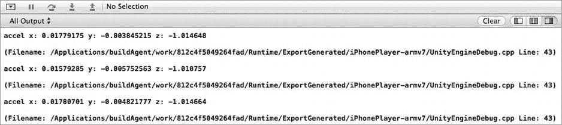

图 13-5. 加速度计值的 Debug.Log 输出

加速度值的单位是重力加速度。静止状态下，每个加速度计值的范围是-1 到 1，其中 1 代表一个完整的地球重力（9.8 米/秒²）。现在尝试摇晃设备。你应该会看到数值上下波动。

### 检测摇晃

我们的 iOS 暂停菜单存在一个问题：我们无法使用 ESC 键暂停，因为 iOS 设备上没有 ESC 键（尽管 Android 设备通常有一个行为类似 ESC 键的返回键）。

通过简单地在`OnGUI`函数内添加一个`GUI.Button`调用，可以轻松地在`FuguPause`脚本中向屏幕添加一个暂停按钮：

```csharp
if (GUI.Button(Rect(0,0,100,50), "Pause") { PauseGame(); }
```

然而，我不喜欢在游戏过程中屏幕上出现按钮，尤其是在像 iPhone 这样的小屏幕上。所以，让我们利用 iOS 设备提供的备用输入方式，通过摇晃设备来暂停。

从之前打印加速度计值的练习中，我们看到摇晃设备会导致`Input.acceleration`的`x`、`y`或`z`值中至少有一个向上或向下急剧变化。因此，我们可以通过检查是否有任何值远大于 1 或远小于-1（例如）来判断是否发生了摇晃。但不必非常精确，我们可以只计算向量大小的平方：

```csharp
if (Input.acceleration.sqrMagnitude>shakeThreshold)
```

获取`Vector3`的`sqrMagnitude`比获取`magnitude`更快，因为向量的模长是`x² + y² + z²`的平方根，使用平方根操作相对昂贵（还记得高中时学习手工计算平方根吗？）。

所以，让我们开始在`FuguPause`脚本中添加一个用于摇晃阈值的公共变量：

```csharp
var shakeThreshold:float = 5;
```

现在你可以在检视面板（图 13-6）中调整该属性，使其对摇晃更敏感或更不敏感。

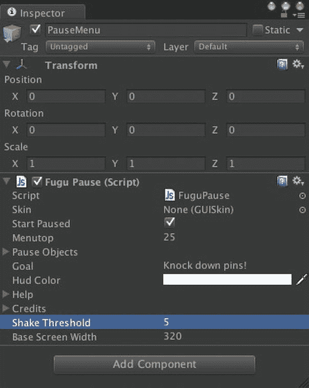

图 13-6. 在检视面板中调整“摇晃暂停”阈值

接下来，添加对`Input.acceleration`的检查，作为 ESC 键检查的`UNITY_IPHONE`版本替代方案（清单 13-7）。

清单 13-7. 在 FuguPause.js 中添加“摇晃暂停”功能

```csharp
var shakeThreshold:float = 5;

function Update() {
#if UNITY_IPHONE
        if (Input.acceleration.sqrMagnitude>shakeThreshold)
#else
        if (Input.GetKeyDown(KeyCode.escape))
#endif
        {
                switch (currentPage) {
                case Page.None: PauseGame(); break;       // 如果暂停菜单未显示，则暂停
                case Page.Main: UnPauseGame(); break; // 如果主暂停菜单正在显示，则取消暂停
                default: currentPage = Page.Main;     // 任何子页面都返回主页面
                }
        }
}
```

这就完成了。现在，当你使用 Unity Remote 或在设备上进行测试时，摇晃设备将暂停游戏！增强后的`FuguPause`脚本（仅添加了两行新代码！）位于本书项目文件中，可从 `http://learnunity4.com/` 获取。

### 摄像头

尽管 Unity 对 iOS 摄像头的内置支持不多，但 Unity 确实为将网络摄像头视频读取到纹理中提供了跨平台支持。

#### 读取网络摄像头


Unity 有一种特殊的纹理（如 `Texture2D`，它是 `Texture` 的子类）叫做 `WebCamTexture`，用于显示来自连接硬件摄像头的视频。它支持多个平台，包括 iOS。让我们试试看。创建一个名为 `FuguWebCam` 的 JavaScript 脚本，并添加 Listing 13-8 中给出的 `Start` 函数。`Start` 函数创建一个 `WebCamTexture`，将其纹理分配给脚本所挂载 `GameObject` 的材质，然后调用 `Play` 开始从摄像头视频更新纹理。

Listing 13-8. 在 `FuguWebCam.js` 中播放 `WebCamTexture`

```
function Start () {
var webcamTexture:WebCamTexture = WebCamTexture();
renderer.material.mainTexture = webcamTexture;
webcamTexture.Play();
}
```

现在将脚本挂载到 `Ball` 游戏对象上。如果在编辑器中点击播放，你会看到来自 Mac 摄像头的视频显示在球上。如果你在设备上构建并运行，你会看到同样的效果，只是使用的是设备摄像头。Figure 13-7 是我在 iPod touch 上运行游戏时的截图，当时正将摄像头对准我的白板。

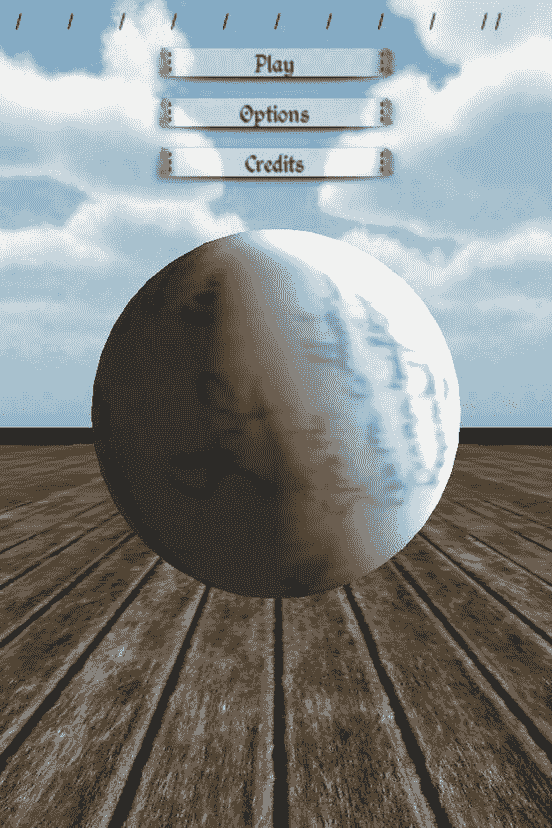

Figure 13-7. 渲染在保龄球上的 `WebCamTexture`

**进一步探索**

总的来说，为保龄球游戏实现触摸屏输入并不需要太多工作（与前一章节中的打包工作相比），尽管在实际开发中，你会花大量时间测试和调整游戏控制，直到它恰到好处。无论如何，通过“晃动暂停”功能，保龄球游戏的功能性移植已经完成。换句话说，iOS 版本的游戏现在已经可以玩了！

尽管在这个游戏中设备摄像头没有实际用途，但我们确实使用 Unity 的 `WebCamTexture` 类激活了它，以在保龄球上渲染视频纹理。这有点噱头，但游戏开发很大程度上就是学习！尤其是在 iOS 上，有很多机会尝试各种不同的控制方案和输入传感器。

**脚本参考**

本章中介绍的所有 Unity 功能几乎都是“`Input`”类的成员。实际上，脚本参考中关于 `Input` 的文档包含了对 iOS 输入功能的概述。

在阅读完 `Input` 类的概述后，你应该阅读本章中使用的每个函数的页面，特别是“`Input.GetTouch`”（及其相关的“`Touch`”结构体），其中包含展示如何遍历每一帧中所有 `Touch` 事件的代码示例；以及“`Input.acceleration`”，其中包含展示如何检查每一帧加速度值的代码示例。

需要记住的一点是，加速度计每帧可能生成多个值。在大多数情况下，每帧只采样一次 `Input.accelerometer` 就足够了，但如果需要更精细的采样，你可以访问 `Input.accelerationEventCount` 和 `Input.accelerationEvents` 变量来获取所有加速度事件。

`Input` 类提供了对其他 iOS 传感器的访问。静态变量 `Input.gyro`、`Input.compass` 和 `Input.location` 分别返回来自陀螺仪、指南针和定位服务的数据。除了记录这些变量的页面外，你还应该查看这些变量所属类的页面：“`Gyroscope`”、“`Compass`”和“`LocationServices`”类。文档虽简略，但你可以在各个类的函数中找到代码示例。静态变量 `Input.compensateSensors` 控制是否针对屏幕方向调整加速度计、陀螺仪和指南针数据。

除了测试对象选择，射线投射在游戏和图形中也被大量使用，因此你应该熟悉“`Physics.Raycast`”的页面，它包含几个代码示例。例如，在《HyperBowl》中，我使用射线投射来防止主摄像机低于地面，并设置游戏对象的初始位置刚好停在地面上。在这两种情况下，我都从游戏对象位置向下向地面进行射线投射，并检查结果距离。

最后，我们介绍了 `WebCamTexture` 类的使用。“`WebCamTexture`”页面包含很多内容，但请点击其 `Play`、`Stop` 和 `Pause` 函数（你最常用的函数）的链接，在这些页面中找到代码示例。同时请查看“`WebCamTexture`”构造函数的链接。该页面列出了一系列构造函数，允许你自定义不同分辨率下的纹理大小。

**iOS 开发者库**

除了阅读 Unity 脚本参考，甚至在此之前，阅读 iOS 参考库是一个好主意，这样你就能知道有哪些 iOS 功能可以通过 Unity 暴露出来，以及 Unity 类和方法如何映射到对应的 iOS 功能。

你可以在 `http://developer.apple.com/library` 或通过 Xcode Organizer 查看 iOS 参考库，无需登录。从那里选择“Guides”选项卡并浏览指南，特别是以下内容：

- “Event Handling Guide” 提供了触摸事件的概述（与 Unity 的 `Input.GetTouch` 和 `Touch` 类相关）以及运动事件的概述（与 `Input.acceleration` 和其他 Input 加速度计变量相关）。
- 指南“Camera Programming Topics for iOS”描述了由 Prime31 Etcetera 插件使用的 `UIImagePickerController` 类。
- “AV Foundation Programming Guide”描述了很可能被用于 Unity 中 `WebCamTexture` 类的视频捕获功能。

**Asset Store**

Unity 的 `Input` 类使我们能够访问基本的触摸信息，但它不提供对 iOS 手势识别器的访问，这些识别器可以检测更高级别的“手势”，如滑动和捏合。Asset Store 再次解围，提供了第三方包来实现高级手势检测。我使用 `Finger Gestures` 包，它有一个很好的回调系统，用于检测和处理各种手势。

例如，在《HyperBowl》中，我希望当玩家捏合屏幕（两个手指在屏幕上靠拢）时弹出暂停菜单。使用 `Finger Gestures` 包，只需在暂停菜单脚本中添加一个手势回调：

```
function OnGesturePinchEnd(pos1:Vector2,pos2:Vector2) {
    PauseGame();
}
```

然后在 `Start` 或 `Awake` 函数中添加一行代码，将该回调添加到该手势的 `FingerGestures` 回调列表中：

```
FingerGestures.OnPinchEnd += OnGesturePinchEnd;
```

Unity 并不提供对 iOS 中所有可用功能的脚本访问，而这正是插件发挥作用的地方。Unity 插件系统允许你添加访问“原生”代码的新脚本函数。因此，一般来说，如果你能用 C、C++ 或 Objective-C 编写某些代码，你就能为其创建一个 Unity 插件。例如，在 Unity Asset Store 中，你会发现围绕移动广告 SDK 构建的插件，以及用于访问 iOS 功能的插件。

插件安装在 `Assets/Plugins` 文件夹中，正如我们之前提到的，这是一个存储必须在其他任何脚本之前加载的脚本的好地方。它们通常还需要在 Xcode 中手动集成步骤，例如向 `Info.plist` 文件添加条目或安装额外的代码库（这会阻止从 Unity 直接构建并运行——你必须先构建，修改 Xcode 项目，然后从 Xcode 运行）。此外，多个插件安装在同一 Unity 项目中总存在冲突的风险。

这就是我喜欢使用 Prime31 Studios 在 `http://prime31.com/unity` 提供的插件的原因。


```markdown
它们提供了大量可在同一 Unity 项目中共存的插件，所有 Xcode 修改均由 Unity 后处理器脚本执行，因此从 Unity 构建并运行（Build and Run）仍将正常工作，无需在 Xcode 中手动操作。例如，Asset Store 上提供的 Prime31 Etcetera 插件包含一系列杂项功能，包括通过一次函数调用访问 iOS 照片库和设备相机，如下所示：

```
EtceteraBinding.promptForPhoto(1.0);
```

图 13-8 中的截图显示了在我的 Fugu Maze 应用中出现的提示（我使用照片选择器让玩家自定义迷宫墙壁纹理）。如果你想尝试一下，请从 App Store 下载 Fugu Maze Free，或下载一个免费的 HyperBowl 球道（我使用照片选择器来自定义保龄球纹理）。

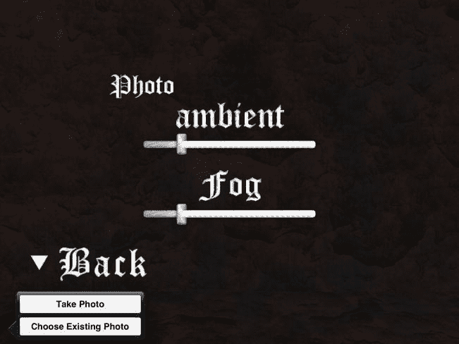

图 13-8. iPad 上的 Prime31 Etcetera 插件照片选择器

另一个提供额外设备输入的 Prime31 插件是 iCade 插件（仅在 Prime31 网站上提供）。iCade 是一种复古风格街机柜，通过蓝牙连接为 iOS 设备提供摇杆输入。iCade 本质上模拟的是蓝牙键盘，因此任何使用 iCade 插件的代码都与键盘控制代码类似。如果我们在保龄球代码的`CalcForce`函数中添加 iCade 控制代码，它看起来会像 列表 13-9 中的代码片段（此示例实际取自 HyperBowl）。

列表 13-9. 使用 Prime31 iCade 插件向`CalcForce`添加的 iCade 代码

```
var yinput:float = 0;
if (iCadeBinding.state.JoystickUp) yinput = 1;
if (iCadeBinding.state.JoystickDown) yinput = -1;
var xinput:float = 0;
if (iCadeBinding.state.JoystickLeft) xinput = 1;
if (iCadeBinding.state.JoystickRight) xinput = -1;
var deltatime:float = Time.deltaTime;
forcey += iCadePowery*yinput/deltatime;
forcex += iCadePowerx*xinput/deltatime;
```

就像我们在检查四个不同按键是否被按下一样，我们正在检查摇杆是否向四个方向之一移动。摇杆的灵敏度并不比这更高。

iCade 的产品信息位于 Ion Audio 网站：`http://www.ionaudio.com/products/details/icade`，而 ThinkGeek 博客列出了一些兼容 iCade 的游戏（`http://www.thinkgee.com/product/e762/`）。如果你的设备能在 iCade 上运行，请务必联系该博客，让你的应用被收录！

