# 第 14 章 Game Center：排行榜与成就

现在我们已经拥有一个可玩的 iOS 游戏，是时候添加一些锦上添花的功能了。我们将从当前热门趋势——社交游戏开始，这至少包括将高分收集到全局*排行榜*上，并以*成就*奖励玩家。

幸运的是，Unity 提供了针对 Apple Game Center 社交游戏平台的脚本接口。作为 iOS 用户，你很可能玩过许多向 Game Center 提交分数和成就的游戏，也许你已经使用过 iOS 自带的 Game Center 应用来查看游戏推荐、添加其他玩家为“好友”，或向这些朋友发起挑战。我们将通过为应用注册 Game Center 排行榜和几个成就，并添加必要的脚本来将这些分数和成就提交到 Game Center，从而将 Fugu Bowl 加入到这些游戏的行列中。

和前面几章一样，如果你中途加入，可以从`http://learnunity4.com/`下载并打开本章的 Unity 项目，但请注意该网站上的项目不包含来自 Standard Assets 或 Asset Store 的任何资源包。不过就本章而言，该项目已准备就绪，可以运行并演示其与 Game Center 的集成。

到目前为止，对 Fugu Bowl 的所有 iOS 修改都可以使用 Unity Remote 或 iOS 模拟器进行测试，并且不需要 Apple Developer 会员资格。但这种免费体验到此为止，因为将 Game Center 功能集成到应用中需要在 iTunes Connect 上为应用配置 Game Center。如果此时你还没有 Apple Developer 会员资格，你可以先通读本章和下一章（下一章涉及 iAd，也需要在 iTunes Connect 上进行一些设置），等准备就绪后再回来操作。

### 在 iTunes Connect 上设置 Game Center

要在 iTunes Connect 中为保龄球游戏设置 Game Center，首先需要将应用添加到 iTunes Connect，重复我们在 Angry Bots 演示中演练过的步骤。假设你已是注册的 Apple Developer，请访问`http://itunesconnect.apple.com/`，点击“管理应用”（Manage Apps），然后添加 Fuga Bowl（记住提前准备一些截图，同样按照我们在 Angry Bots 中演练的步骤进行）。对于 App Store 图标，请使用我们在 Player Settings 中设置为应用图标的同一个`Icon1024.jpg`文件。当然，你需要选择你自己的应用标识符。完成后，点击你刚创建的应用的“查看详情”（View Details）以查看应用信息页面（图 14-1）。

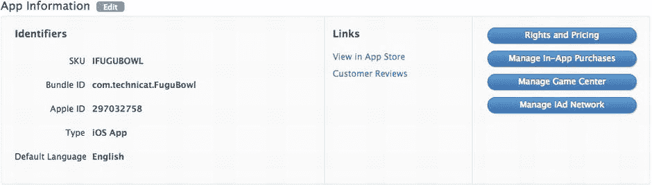

图 14-1. iTunes Connect 中应用信息页面的顶部

在 iTunes Connect 中设置好 Fugu Bowl 后，点击应用信息页面右上角的“管理 Game Center”（Manage Game Center）按钮，调出该应用的 Game Center 管理页面。

#### 添加排行榜

Game Center 管理页面有三个功能：它允许你将应用移入一个 Game Center 群组，管理此游戏的排行榜，以及管理此游戏的成就（图 14-2 显示了页面顶部和前两个选项，成就位于下方）。

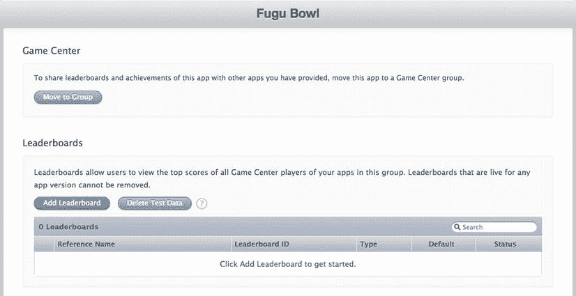

图 14-2. iTunes Connect 中管理 Game Center 页面的顶部

将应用放入 Game Center 群组允许该应用与其他应用共享排行榜和成就。例如，HyperBowl 有六条保龄球道，每条都有其自己的排行榜。每条球道也可作为免费的广告支持应用提供。通过使用 Game Center 群组，同一个排行榜在免费球道和其对应的完整付费应用之间共享。因此，在免费 HyperBowl Classic 球道中获得高分和一些成就的玩家在购买完整游戏后仍然可以看到该分数和那些成就，而从开发者的角度来看，这很好地增加了排行榜中显示的玩家人数。由于我们目前只处理一个游戏，所以无需担心群组问题（你可以在以后随时将应用移入群组）。

#### 创建单个排行榜

通过点击“添加排行榜”（Add Leaderboard）按钮创建一个新排行榜。这将打开一个窗口，提供创建“单个排行榜”（Single Leaderboard）或“组合排行榜”（Combined Leaderboard）的选项（图 14-3）。组合排行榜合并了来自多个排行榜的结果。再次以 HyperBowl 为例，该游戏的组合排行榜列出了来自六条球道排行榜的高分。

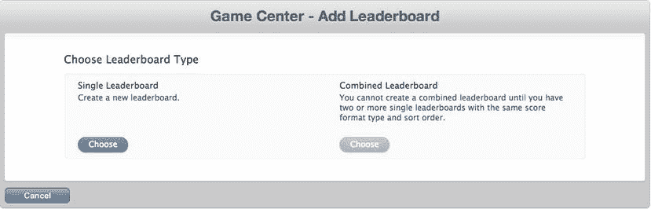

图 14-3. 在 iTunes Connect 中选择排行榜类型

你可以在需要时稍后添加组合排行榜。实际上，图 14-3 显示“组合排行榜”选项是灰显的，直到你实际拥有可以组合的排行榜。因此，现在只需选择“单个排行榜”，这将带你进入一个页面，你可以在其中填写排行榜信息（图 14-4）。
```


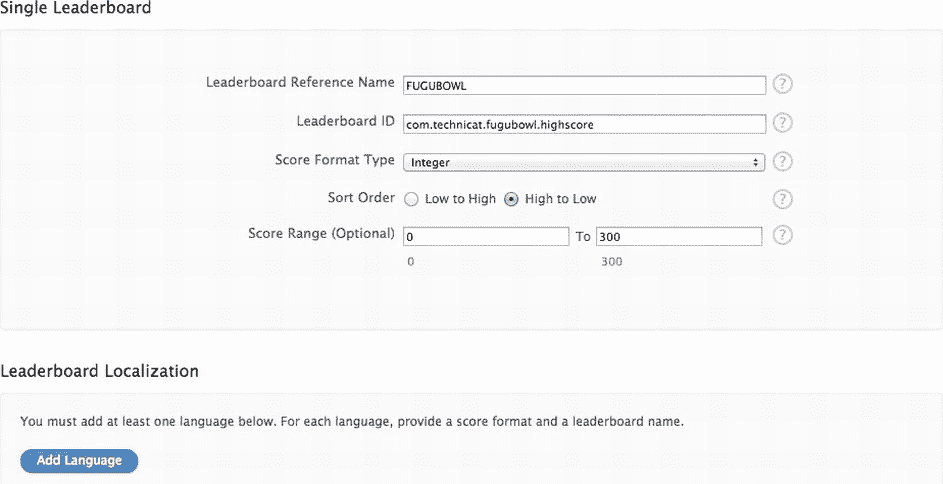 图 14-4. 在 iTunes Connect 中创建排行榜

排行榜引用名称是排行榜在 iTunes Connect 中显示的名称。我喜欢用全大写的单词作为引用名称，这样能立刻明白它不会在其他地方使用，比如用作代码中的 ID 或显示文本。`Leaderboard ID` 是将在代码中被引用的标识符。将它设为应用程序 ID 的变体（不必完全匹配）会很方便，这样当你看到`Leaderboard ID`时，就能立刻知道该排行榜属于哪个应用。这也有助于确保 ID 的唯一性。

接下来的三个字段用于提供关于提交到排行榜的得分信息。为**得分格式类型**选择`Integer`（例如，保龄球得分永远不会是 200.5），并指定**排序顺序**为从高到低，这意味着得分越高越好，排行榜应按降序显示得分。最后，将可能的得分范围指定为 0 到 300，这样 Game Center 就不会显示该范围之外的任何分数（有一段时间，如果玩家提前退出游戏，HyperBowl 会提交-1 的分数）。

**添加语言**

在你刚填写的字段下方是**排行榜本地化**部分。*本地化*是使程序适应世界上不同地区（或*区域设置*）的过程，主要涉及指定用户界面在不同语言中应使用哪些文本。你需要为此列表至少添加一种语言，因此点击**添加语言**按钮以调出相应的表单（图 14-5）。

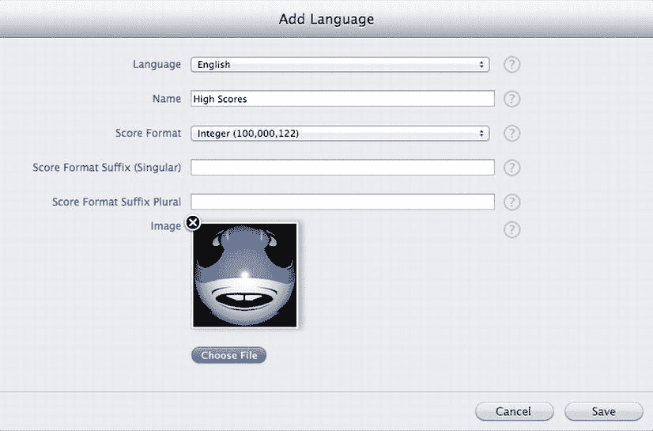 图 14-5. 在 iTunes Connect 中为排行榜添加本地化

将此本地化的**语言**指定为英语，并将此语言下排行榜的**名称**指定为 High Scores。这是在 Game Center 应用或标准 Game Center 排行榜显示中查看此排行榜时将显示的名称。

**得分格式**指定了得分的显示方式。保龄球得分永远不会超过 300，因此用逗号还是小数点来分隔数字组并不重要。**得分格式后缀**也不是必需的，但如果提供了，可以使用`Point`作为单数后缀，`Points`作为复数后缀。

对于与排行榜**名称**一同显示的图像，你可以再次从项目的`Textures`文件夹中选择`Icon1024.jpg`文件（与应用描述图标类似，iTunes Connect 要求 Game Center 图标为 1024×1024 的图像）。理想情况下，你应该为每个排行榜定制不同的图标。

当此**语言**的设置保存后，该**语言**将列在该排行榜页面的**本地化**部分中（图 14-6）。

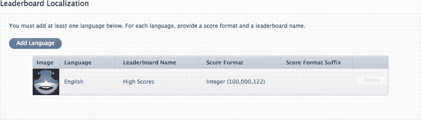 图 14-6. 在 iTunes Connect 中保存的排行榜本地化

现在，当你返回到此应用的 Game Center 管理页面时，排行榜会被列出，但工作尚未完成。你必须回到应用描述页面（返回此应用的**应用信息**页面，然后点击**查看详情**按钮）。在该页面的底部附近，点击**启用 Game Center** 按钮（图 14-7）。

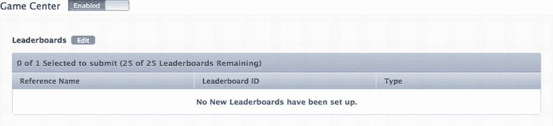 图 14-7. 在 iTunes Connect 中启用 Game Center

然后点击**编辑**按钮，会弹出一个对话框，允许你选择为此应用定义的所有新排行榜（图 14-8）。

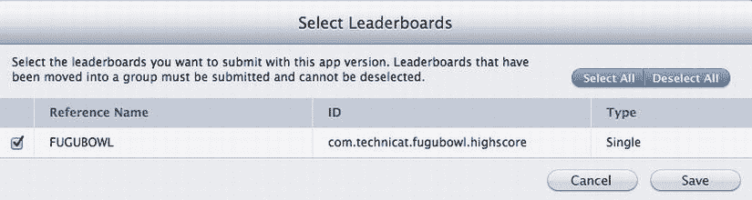 图 14-8. 在 iTunes Connect 中启用排行榜

通常，你会希望添加所有显示的排行榜，除了那些计划用于未来发布的排行榜。

**设置成就**

现在你有了排行榜，是时候处理成就了。成就的可能性是丰富多彩的。在 HyperBowl 中，成就的授予基于补中、全中、连续全中、打出完美比赛（300 分），甚至在玩家完成一局完整比赛时为每条球道都授予成就。对于 Fugu Bowl，让我们只定义获得补中和全中的成就，因为 FuguBowl 脚本已经能检测到这些情况。

添加成就的过程与添加排行榜类似。在 iTunes Connect 中，回到此应用的**Game Center** 页面（图 14-9）。

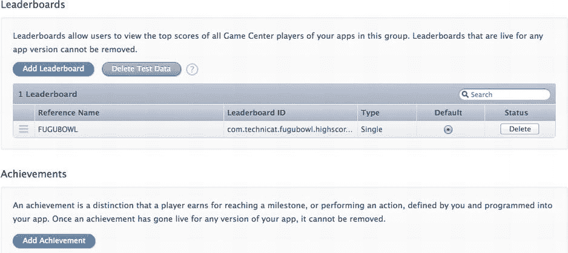 图 14-9. iTunes Connect 中的添加成就部分

在你点击**添加排行榜**的部分下方（现在那里有一个由刚创建的排行榜组成的排行榜列表），你会看到**成就**部分。点击**添加成就**按钮以调出添加成就页面（图 14-10）。

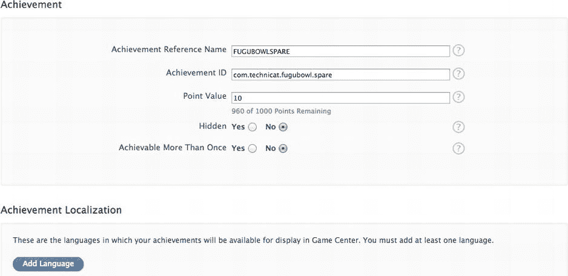 图 14-10. 在 iTunes Connect 中添加成就信息

与排行榜类似，成就有一个在 iTunes Connect 中使用的**引用名称**和一个将在脚本中被引用以指代此成就的**ID**。让我们使用`FUGUBOWLSPARE`作为引用名称，并将`.spare`附加到应用程序 ID 上以形成**成就 ID**（同样，不必精确匹配——这只是一种惯例）。

在名称和 ID 字段下方，指定一个**点数值**，即成就完成后 Game Center 奖励给玩家的点数。对于获得补中，我们选择 10 个点。

> **提示** 此游戏中分配给成就的总点数不能超过 1000，因此最好提前规划好你计划在游戏中添加的所有成就，并确保在这个预算内合理分配点数。

在**点数值**字段下方是两个“是或否”选项。*隐藏*指定成就是否可以在获得之前向玩家显示。*可多次获得*指定成就是否可以多次获得（每次都会获得点数）。如果你为此选项选择了“是”，那么玩家每次补中都会获得十分，而不仅仅是第一次补中时获得十分（图 14-11）。

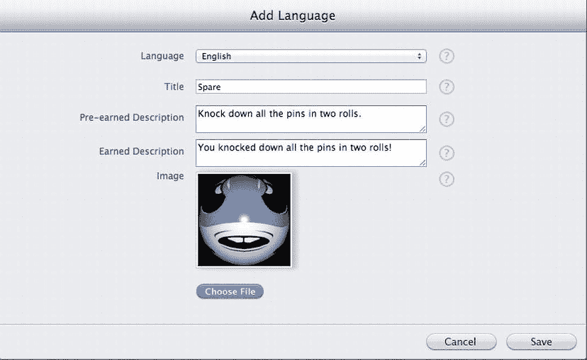 图 14-11. 在 iTunes Connect 中为成就添加本地化

与排行榜类似，成就需要在**本地化**部分添加一种**语言**。点击**添加语言**按钮会弹出一个窗口，你可以在其中指定语言（英语）、成就的**标题**（Spare）、一个**获得前描述**（在成就获得前显示）以及一个**获得后描述**（在成就获得后显示）（图 14-12）。

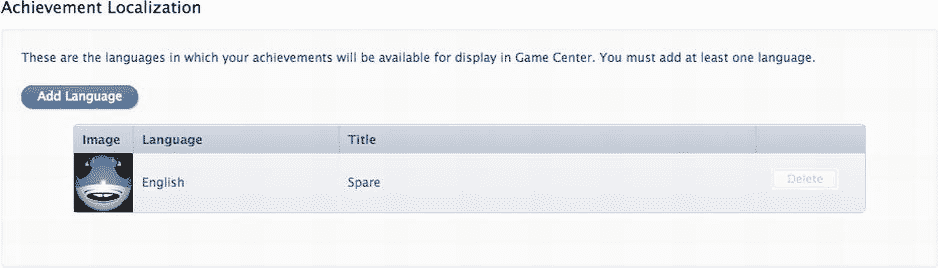 图 14-12. 在 iTunes Connect 中保存的成就本地化

同样，为简便起见，我们选择项目`Textures`文件夹中的`Icon1024.jpg`图像作为成就图标，但在一个完善的游戏中，你可能为每个成就准备不同的图标。当你点击**保存**时，新的**语言**将列在**成就本地化**部分中。


以下是按照您的要求，将给定英文文本翻译成符合规范的中文 Markdown 文档：

```markdown
在“成就”（Achievement）页面上点击“保存”（Save），该成就现在将列在“Game Center 管理”页面上。重复该过程，创建一个用于“全中”（rolling a strike）的成就。制作“全中”成就的唯一区别在于，您将使用不同的引用名称和 ID，并且奖励 20 分而不是 10 分。此外，您还应该提供不同的“已获得”和“未获得”成就描述。完成后，再次访问“应用描述”（App Description）页面（在您添加排行榜时，Game Center 已在该页面启用），然后点击“成就”（Achievements）部分上方的“编辑”（Edit）按钮，以添加可用的成就。

至此，您已经在 Game Center 中设置了一个排行榜和两个成就。现在，是时候回到脚本编写工作了！

### 集成 Game Center

Unity 通过`Social`类中的静态函数提供对 Game Center 的访问，该类为社交游戏平台提供通用接口。原则上，您甚至可以无需大幅更改代码即可访问其他社交游戏网络，但目前，`Social`仅支持 Game Center。

我们的游戏将调用`Social`类中的函数来连接 Game Center 并提交成就和分数。我们可以将这些调用直接放入游戏控制器脚本中，但通过创建一个新脚本，我们可以最大限度地减少代码膨胀并最大限度地提高代码可重用性。

在“项目视图”（Project View）中，创建一个新的 JavaScript 文件，将其放置在“脚本”（Scripts）文件夹中，并命名为`FuguGameCenter`（图 14-13）。

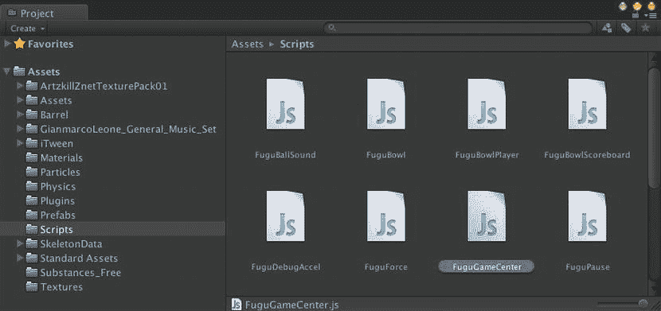

图 14-13. 创建一个新的`FuguGameCenter.js`脚本

#### 初始化 Game Center

在新的`FuguGameCenter`脚本中，我们将 Game Center 初始化代码放在`Start`回调函数中（清单 14-1），以便在脚本启用时立即进行初始化。`Start`回调函数的主体被包裹在`#ifdef UNITY_IPHONE`中，这样任何非 iOS 构建都会将该回调视为空。

清单 14-1.  `FuguGameCenter.js`中的 Game Center 初始化

```js
import UnityEngine.SocialPlatforms.GameCenter;
var showAchievementBanners:boolean = true;

function Start() {
    #if UNITY_IPHONE
        Social.localUser.Authenticate (function (success) {
            if (success && showAchievementBanners) {
                GameCenterPlatform.ShowDefaultAchievementCompletionBanner(showAchievementBanners);
                Debug.Log ("Authenticated "+Social.localUser.userName);
            } else {
                Debug.Log ("Failed to authenticate "+Social.localUser.userName);
            }
        });
    #endif
}
```

函数`Social.authenticate`执行玩家的 Game Center 登录（必要时会提示玩家输入登录信息），并接受一个回调函数作为参数。当 Game Center 报告一个`true`或`false`结果（表示操作是否成功）时，该值会被传递给回调函数。与我们之前定义函数（通过单独的名称定义）不同，为了方便，我们直接将函数定义作为参数传递，而不指定名称。以这种方式传递的函数被称为*匿名函数*。我们的匿名回调函数根据`success`值调用`Debug.Log`并输出一条消息。这为我们提供了一种简单的方法来在测试时检查登录是否失败。

该回调函数还可以选择性地激活成就横幅，这些横幅是短暂显示的成就已获得的通知。此 Game Center 功能在 iOS 5 中引入，因此该功能通常被称为 iOS 5 风格的成就通知横幅。我个人很喜欢看到它们，但这关乎个人偏好，因此我们有一个公共布尔变量`showAchievementBanners`，我们可以在“检查器视图”（Inspector View）中勾选或取消勾选它。

如果回调函数收到值为`true`的身份验证成功结果，并且`showAchievementBanners`也为`true`，那么回调函数会调用静态函数`GameCenterPlatform.ShowDefaultAchievementCompletionBanner`，该函数接受一个`true`或`false`参数来打开或关闭横幅，并接受一个成功的回调函数作为参数。成就横幅功能不被视为跨平台特性，这就是为什么该功能未在`Social`类中公开，而必须从`GameCenterPlatform`类中访问的原因。该类位于`UnityEngine.SocialPlatforms.GameCenter`命名空间中，因此我们在脚本顶部导入该命名空间，以避免在引用`GameCenterPlatform`时输入完整的命名空间名称。

#### 提交成就

提交成就只需要调用静态函数`Social.ReportProgress`即可。但该函数也需要一个成功的回调函数，而且我们首先应该检查玩家是否已实际登录到 Game Center。为了避免在每个提交成就的代码片段中都重复这些操作，我们将为`Social.ReportProgress`在`FuguGameCenter`脚本中添加一个包装函数（清单 14-2）。

清单 14-2.  在`FuguGameCenter.js`中提交成就

```js
static function Achievement(name:String,progress:double) {
    #if UNITY_IPHONE
        if (Social.localUser.authenticated) {
            Social.ReportProgress(name,progress, function(success) {
                if (success) {
                    Debug.Log("Achievement "+name+" reported successfully");
                } else {
                    Debug.Log("Failed to report achievement "+name);
                }
            } );
        }
    #endif
}
```

这个我们将调用`Achievement`的包装函数是一个静态函数，因此可以从任何脚本中以`FuguGameCenter.Achievement`的形式调用它。它接受一个成就 ID 和一个进度数值（范围为 0-100），并将它们连同成功的回调函数一起传递给`Social.ReportProgress`，该回调函数会使用`Debug.Log`打印结果。

**注意**：成就进度是以`double`类型传递的，而不是`int`或`float`，这仅仅是遵循 Game Center 的期望。`double`是一个双精度浮点数（`float`是单精度浮点数）。包括 Unity 在内的游戏引擎通常使用单精度浮点数。

但首先，`Achievement`会检查`Social.localUser.authenticated`，看在调用`Social.ReportProgress`之前玩家是否已登录到 Game Center。

#### 提交分数

向 Game Center 排行榜提交分数的代码看起来与提交成就的代码几乎相同（清单 14-3）。

清单 14-3.  在`FuguGameCenter.js`中提交分数

```js
static function Score(name:String,score:double) {
    #if UNITY_IPHONE
        if (Social.localUser.authenticated) {
            Social.ReportScore (score, name, function(success) {
                if (success) {
                    Debug.Log("Posted "+score+" on leaderboard "+name);
                } else {
                    Debug.Log("Failed to post "+score+" on leaderboard "+name);
                }
            } );
        }
    #endif
}
```

静态函数`FuguGameCenter.Score`与静态函数`FuguGameCenter.Achievement`之间的唯一区别在于，一个调用`Social.ReportScore`，另一个调用`Social.ReportProgress`。当然，它们的`Debug.Log`消息也不同，并且`Social.ReportScore`接受的是排行榜 ID 和分数，而不是成就 ID 和进度数值。

### 完整脚本

现在，您拥有了一个非常精简的 Game Center 包装脚本，其中包含一个`Start`回调、一个公共变量以及几个供其他脚本使用的静态函数。
```


# FuguGameCenter 集成

完整的 `FuguGameCenter` 脚本可在本章项目的 [`learnunity4.com/`](http://learnunity4.com/) 中获取。

### 附加脚本

由于 Game Center 的初始化是在 `FuguGameCenter.js` 的 `Start` 回调中进行的，因此必须将该脚本附加到场景中的某个 `GameObject` 上。请确保已打开保龄球场景，创建一个空 `GameObject`，将其命名为 `GameCenter`，然后将 `FuguGameCenter` 脚本拖放到该对象上。该脚本只有一个可以在检视面板中调整的属性，即是否显示 iOS 5 风格的成就横幅（图 14-14）。

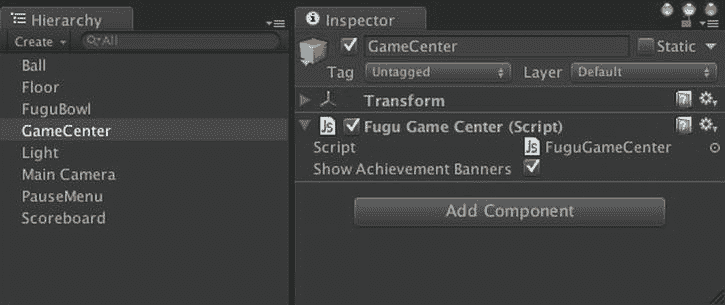

图 14-14 场景中的 `FuguGameCenter` 脚本

你也可以将 `FuguGameCenter` 脚本附加到启动场景中的某个 `GameObject` 上，因为无论该脚本是否附加到任何场景中，其中定义的静态函数都可以被调用。将脚本放在启动场景中的好处是可以更早地初始化 Game Center，但如果 `FuguGameCenter` 脚本与将要调用它的脚本（本例中为 `FuguBowl` 脚本）位于同一场景中，则会更清晰易懂。

### 集成游戏

尽管 `FuguGameCenter` 脚本负责处理 Game Center 的初始化，并提供了报告分数和成就的静态函数，但你仍然需要让 `FuguBowl` 脚本去调用这些静态函数。幸运的是，这部分非常简单。

#### 提交成就

到目前为止，我们已经设置了两个成就：一个用于补中，另一个用于全中。现在游戏需要在发生补中和全中时进行报告（至少是第一次）。这正是将游戏控制器组织为状态机所带来的巨大优势。游戏中已经存在补中状态和全中状态，因此我们只需在其中添加对 `FuguGameCenter.Achievement` 函数的调用即可（代码清单 14-4）。

代码清单 14-4 在 `FuguBowl.js` 中提交成就

```javascript
var spareAchievementID:String = "com.technicat.fugubowl.spare";
var strikeAchievementID:String = "com.technicat.fugubowl.strike";

function StateSpare() {
       FuguGameCenter.Achievement(spareAchievementID,100);
       state="StateNextBall";
}

function StateStrike() {
       FuguGameCenter.Achievement(strikeAchievementID,100);
       state = "StateNextBall";
}
```

不要硬编码传递给 `FuguGameCenter.Achievement` 的成就 ID（因为你的成就 ID 很可能与我的不同），而是为补中和全中声明公共变量，以便你可以在检视面板中自定义它们。

#### 提交分数

提交最终游戏分数与提交成就类似。我们已经在游戏结束状态使用 `Debug.Log` 打印了最终分数，因此这里很自然地可以提交最终分数给 Game Center（代码清单 14-5）。

代码清单 14-5 在 `FuguBowl.js` 中提交游戏分数

```javascript
var leaderboardID:String = "com.technicat.fugubowl.highscore";

function StateGameOver() {
       Debug.Log("Final Score: "+player.GetScore(9));
       FuguGameCenter.Score(leaderboardID,player.GetScore(9));
       yield WaitForSeconds(gameOverTime);
       state="StateNewGame";
}
```

同样，排行榜 ID 被声明为一个公共变量，因此可以在检视面板中自定义（图 14-15）。

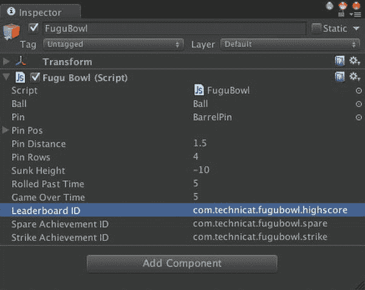

图 14-15 `FuguBowl` 脚本中自定义的 Game Center ID

这对我们的游戏控制器代码来说只是一个很小的改动，仅增加了两行代码（而且本可以合并为一行），所以我就不再列出整个 `FuguBowl` 脚本了，但修改后的脚本当然可以在本章项目的 `http://learnunity4.com/` 中找到。

### 测试游戏

在应用程序发布到 App Store 之前，成就和排行榜仅存在于 Game Center 沙箱中。沙箱本质上是 Game Center 的另一个平行宇宙，拥有自己的用户 ID、排行榜和成就数据。当一个正在开发中的应用程序（尚未获得 App Store 批准的版本）尝试连接到 Game Center 时，系统会提示玩家登录或创建一个沙箱账户。外部世界将看不到你在测试会话中获得的任何分数和成就，因为它们只记录在沙箱中。

**提示**：如果你似乎卡在了 Game Center 的沙箱版本或非沙箱版本中，请尝试打开 iOS 的 Game Center 应用，然后退出登录（点击你的 Apple ID）。

当你在 iOS 模拟器或设备上（而非编辑器内）构建并运行 Fugu Bowl，并完成一整个游戏后，你应该能在排行榜上看到一个分数，并且如果你打出了全中或补中，最多还能看到两个成就。此时，Fugu Bowl 应该会出现在 Game Center 应用中（图 14-16），当你点击它时，你将看到已提交的分数和成就（图 14-17）。

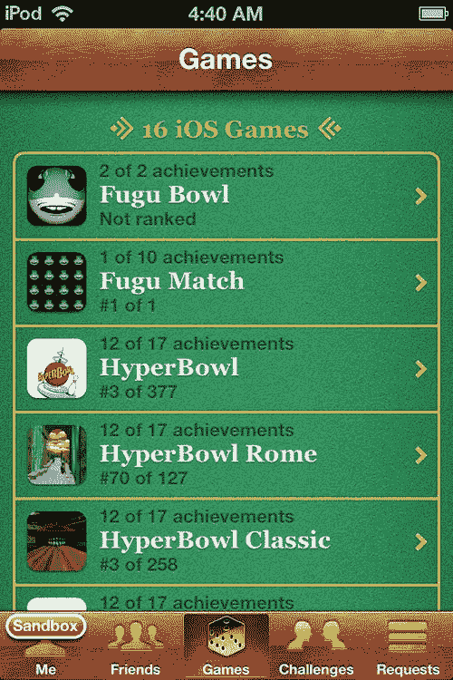

图 14-16 Fugu Bowl 在 Game Center 沙箱版本中列出

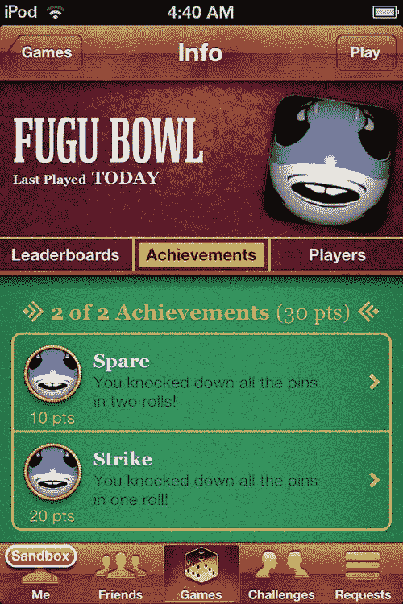

图 14-17 Game Center 沙箱中的测试结果

分数和成就并不总是能可靠或及时地在 Game Center 中显示，尤其是在沙箱中测试时，因此请检查 Xcode 的调试区域，确认 Game Center 操作是否成功（记住，我们在所有 `FuguGameCenter` 函数中都添加了日志功能）。

### 在游戏内显示 Game Center

尽管 Game Center 应用的成就和排行榜界面看起来相当不错，但保龄球游戏的玩家可能不会费心去查看 Game Center 应用，甚至可能根本不知道它的存在。理想情况下，玩家应该能够直接在游戏内查看排行榜和成就。因此，让我们在 `FuguPause` 脚本的主暂停菜单中添加几个按钮来实现此目的（代码清单 14-6）。

代码清单 14-6 在 `FuguPause.js` 中添加显示成就和最高分的按钮

```javascript
function ShowPauseMenu() {
       BeginPage(150,300);
       if (GUILayout.Button ("Play")) {
               UnPauseGame();
       }
        if (GUILayout.Button ("Options")) {
               currentPage = Page.Options;
       }
        if (GUILayout.Button ("Credits")) {
               currentPage = Page.Credits;
       }
#if UNITY_IPHONE
       if (GUILayout.Button ("High Scores")) {
               Social.ShowLeaderboardUI();
       }
       if (GUILayout.Button ("Achievements")) {
               Social.ShowAchievementsUI();
       }
#endif
#if !UNITY_IPHONE && !UNITY_WEBPLAYER
        if (GUILayout.Button ("Quit")) {
               Application.Quit();
       }
#endif
        EndPage();
}
```

这两个按钮的代码被包裹在 `#if UNITY_IPHONE` 中，因此它们只会在 iOS 构建版本中显示。按钮标签分别为“最高分”和“成就”（图 14-18）。

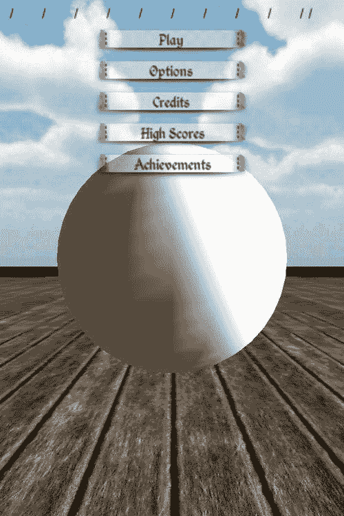

图 14-18


带有排行榜和成就按钮的暂停菜单

`Social` 类提供了查询 Game Center 排行榜和成就信息的功能，可用于构建自定义显示界面。但更简单的方法是直接调用 `Social.ShowLeaderboardUI` 和 `Social.ShowAchievementsUI` 函数，分别调出标准的 Game Center 排行榜和成就展示界面。因此，高分按钮调用 `Social.ShowLeaderboardUI`，而 `成就` 按钮调用 `Social.ShowAchievementsUI`。

当你运行 Fugu Bowl 并成功连接到 Game Center，然后点击新的 Game Center 按钮之一时，会显示标准的 Game Center 界面。图 14-19 展示了点击“成就”按钮后的结果。

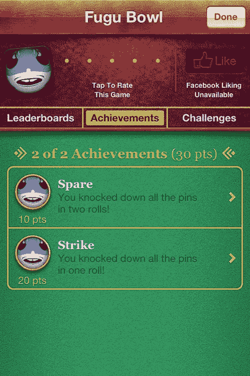

图 14-19. 使用 `Social.ShowAchievementsUI` 显示的游戏内成就

其显示效果与 Game Center 应用类似，但更为简单。例如，游戏内显示不需要那些将视图切换到 Game Center 应用其他部分的所有导航按钮。此外，iPad 版本的显示效果差异很大，因为 iPad 拥有更大的屏幕空间。

你可能认为我们应该在 `FuguGameCenter` 中为这两个调用添加封装函数，但这些函数非常简单，没有必要这么做。它们不接受成功回调函数作为参数，并且事先检查 `Social.localUser.authenticated` 也非必要。事实上，最好不要检查，因为如果当前没有 Game Center 登录状态，`Social.ShowLeaderboardUI` 和 `Social.ShowAchievementsUI` 都会向玩家发出用户友好的提示。

与游戏控制器代码的更改一样，增强后的暂停菜单只需增加几行代码，因此这里不完整重列 `FuguPause.js` 的代码。修改后的脚本位于本章的项目文件中，可从 `http://learnunity4.com/` 获取。

## 进一步探索

这是效率较高的脚本编写章节之一。只需几行代码，我们的游戏就能连接到 Game Center、提交成就和分数、并通过暂停菜单展示成就和排行榜！

大部分工作都花在了 iTunes Connect 上的 Game Center 设置上。即便如此，为保龄球游戏设计排行榜和成就集也相当直接，因为其规则和传统定义得非常明确。如果你设计一款新游戏，很可能会需要思考游戏中需要哪些排行榜和成就，并且可能应该在设计过程的早期就考虑这个问题。

#### 脚本参考

本章几乎专门使用了“Social”类来访问本章所用的 Game Center 功能。该类的“脚本参考”页面解释了它在封装对 Game Center 以及其他潜在社交游戏平台（尽管目前 Game Center 是唯一的一个）的访问中所扮演的角色。

我们只使用了报告分数和成就以及显示结果所需的最少函数集：访问 `Social.localUser` 以连接到 Game Center，调用 `Social.ReportProgress` 和 `Social.ReportScore` 分别提交成就和分数，以及调用 `Social.ShowAchievementsUI` 和 `Social.ShowLeaderboardUI` 以调出 Game Center 展示玩家成就和游戏排行榜的界面。`Social` 类的文档列出了其他几个函数，这些函数允许更精细的控制，例如，从 Game Center 检索信息以填充自定义的排行榜显示。

我们绕过了 `Social`，直接访问了 `GameCenterPlatform` 类来调用其 `showDefaultAchievementsCompletionBanner` 函数，从而启用了 iOS 5 风格的成就横幅。

`GameCenterPlatform` 类的页面说明了它所在的命名空间，并包含一些关于 Game Center 沙箱的说明。

#### iOS 开发者库

iTunes Connect 开发者指南中的 Game Center 章节是设置成就和排行榜的权威来源。该指南可在 iOS 开发者库（可在 `http://developer.apple.com/library/ios` 或 Xcode Organizer 中找到）中找到。

Game Center 的内部工作原理在 iOS 开发者库中“网络与互联网”主题下的“Game Center 编程指南”中有详细说明。Game Center 中可以集成到应用程序中的部分（与 Apple 运营的服务器部分相对）实际上被称为 Game Kit，并且还支持网络多人游戏。

#### 资源商店

Game Center 并非 iOS 上唯一可用的社交游戏平台。许多平台都来了又走（如 OpenFeint、Agon Online），但仍有一些其他选择。在其“服务”类别下，资源商店提供了 PlayHaven (`http://playhaven.com/`) 和 Swarm (`http://swarmconnect.com/`) 的插件，两者都提供排行榜、成就和其他社交游戏功能。另一个来自 Hippo Games 的 Game Center 插件，列在“脚本/集成”类别下。

在 Unity 内置 Game Center 支持之前，Prime31 Studios 提供了一个 Game Center 插件，该插件在 `http://prime31.com/` 上仍然可用（但不在资源商店中），对于需要 Unity 未提供某些功能的开发者来说，这是一个选择。例如，Prime31 插件包含一个发布成就挑战的功能（这是 iOS 6 的一项功能）。Prime31 还提供了一个用于多人游戏支持的 Game Kit 插件，该插件可在资源商店中找到。

## 第 15 章：iAd：横幅广告和插页广告

坦率地说，在如今这个免费增值的时代，让很多人为应用付费并不容易。因此，一种替代方案是整合广告。iAd 并非唯一可用的移动广告产品，但它是 iOS 官方的广告服务，向开发者支付 70% 的收入，这与付费应用销售的份额相同。而且，方便的是，Unity 为 iAd 提供了脚本支持。在本章中，我们将把 iAd 提供的两种广告类型——横幅广告和插页式（全屏）广告——整合到我们的保龄球游戏中。

`http://learnunity4.com/` 上本章的项目文件包含了本章开发的 iAd 脚本，足以演示 iAd 功能。但是，即使你从该项目开始以避免手动添加脚本，你仍然需要在 iTunes Connect 中启用 iAd。

### iTunes Connect

与 Game Center 类似，除了在脚本中调用 Unity 的 iAd 函数外，你还需要在 iTunes Connect 上为我们的应用启用 iAd。除了“管理应用”页面外，iTunes Connect 还有另外两个与 iAd 相关的页面：“合同、银行和税务”页面以及“iAd 网络”页面（图 15-1）。

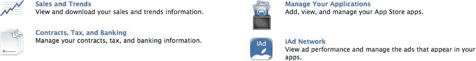

图 15-1. iTunes Connect 上与 iAd 相关的页面

#### 签署合同

你需要访问的第一个页面是“合同、银行和税务”页面，以便同意 Apple 的 iAd 合同，就像你必须同意付费销售合同才能开始对应用收费一样。

一旦 iAd 合同处理完毕，如 图 15-2 所示，你就可以为各个应用启用 iAd 了。

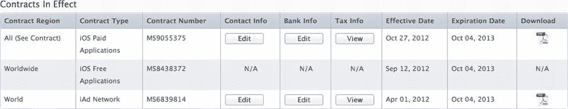

图 15-2. 在 iTunes Connect 上列出的已完成的 iAd 网络合同

#### 启用 iAd

就像你对 Game Center 所做的那样，通过进入 iTunes Connect 的“管理应用”页面，选择 Fugu Bowl，并访问其“应用信息”页面，为 Fugu Bowl 启用 iAd。


在右上角，与 Game Center 按钮同一区域，是管理 iAd Network 按钮（图 15-3）。  
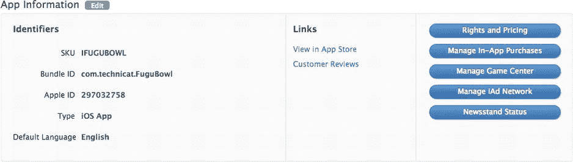  
图 15-3。iTunes Connect 中应用信息页面的顶部区域

点击管理 iAd Network 按钮，开始启用 iAd 的流程。这比启用 Game Center 简单得多。无需设置排行榜或成就，只需点击启用 iAd Network 按钮即可（图 15-4）。  
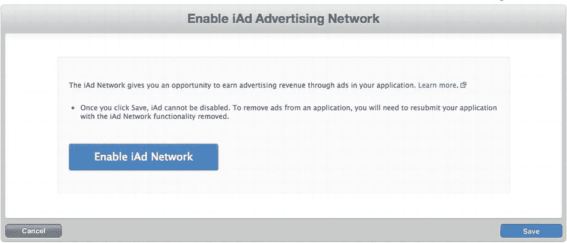  
图 15-4。在 iTunes Connect 上启用 iAd

与 Game Center 一样，iAd 只能在应用的**新版本**被添加到 iTunes Connect 之后、且在该版本被批准和发布之前，才能启用或禁用。iAd 的更改将影响即将发布的版本，并且无法更改已在 App Store 上的应用的 iAd 状态。

**提示**  
我曾有应用因截图包含测试广告而被拒绝，因此你可能需要在启用 iAd 之前为你的应用截图。

现在，我们的应用在服务器端已启用了 iAd，你只需将 iAd 代码添加到应用本身即可。

### 添加横幅广告

让我们先为保龄球游戏添加一个横幅广告。与仅适用于 iPad 的插页式广告不同，横幅广告适用于所有设备。坦率地说，横幅广告更容易集成到游戏中。你只需要在屏幕顶部或底部预留一些空间。

**提示**  
在设计应用时就应考虑将广告置于何处，而不是事后才考虑。

### 创建脚本

类似于上一章我们为初始化 Game Center 创建脚本的方式，让我们编写一个脚本来实例化并放置一个横幅广告。在项目视图中创建一个新的 JavaScript 文件，将其放在 Scripts 文件夹中，并命名为 `FuguAdBanner`（图 15-5）。  
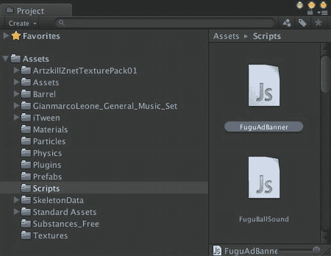  
图 15-5。创建 FuguAdBanner 脚本

然后编辑该脚本，并将代码清单 15-1 的内容添加到其中。

代码清单 15-1。FuguAdBanner.js 的完整代码清单

```
#pragma strict

public var showOnTop:boolean = true; // 横幅在屏幕顶部或底部
public var dontDestroy:boolean = false; // 为下一个场景保留此游戏对象

#if UNITY_IPHONE

// 不要将其设为局部变量，否则它会被垃圾回收
private var banner:ADBannerView;

function Start () {
        if (dontDestroy) {
                GameObject.DontDestroyOnLoad(gameObject); // 跨场景保持广告存活
        }
        Debug.Log("正在创建 iAd 横幅");
        banner = new ADBannerView();
        banner.autoSize = true;
        banner.autoPosition = showOnTop ? ADPosition.Top : ADPosition.Bottom;
        while (!banner.loaded && banner.error == null) {
                yield;
        }
        if (banner.error == null) {
                Debug.Log("iAd 横幅已显示");
                banner.Show();
        } else {
                Debug.Log("iAd 横幅错误: "+banner.error.description);
                banner = null;
        }
}
#endif
```

`FuguAdBanner` 中的代码与 `AdBannerView` 的脚本参考示例类似。`Start` 回调会创建一个 `AdBannerView` 实例，并在 `while` 循环中等待，要么等待横幅加载完成（由 `AdBannerView` 的 `loaded` 变量指示），要么等待错误发生（由 `AdBannerView` 中的 `error` 变量指示）。`while` 循环调用 `yield` 以避免阻塞游戏的其余部分运行。

如果发生错误，错误消息会通过 `Debug.Log` 记录下来。

如果横幅加载成功，则会立即通过调用 `AdBannerView` 的 `Show` 函数显示广告。你可以随时调用广告的 `Show` 和 `Hide` 方法，但对于横幅广告，最简单的方式是让它一直显示。

#### 变量

为了给脚本提供一定的灵活性和可复用性，让我们添加几个公共布尔变量，它们将在检视视图中显示为复选框。`ShowOnTop` 变量通过相应地传递枚举值 `AdPosition.Top` 或 `AdPosition.Bottom`，来决定横幅是显示在屏幕顶部还是底部（仅有的两个选项）。iAd 横幅会自动调整大小以横跨屏幕。

如果另一个变量 `DontDestroy` 为 `true`，则我们调用静态函数 `GameObject.DontDestroyOnLoad`，并传入脚本所附加的游戏对象。这样做可以在加载另一个关卡时保持该游戏对象存活，因此如果你有多个场景，则无需在每个场景中都添加一个 `AdBanner` 游戏对象。

**注意**  
在稍后会被再次加载的场景中调用 `GameObject.DontDestroyOnLoad` 可能会导致重复的游戏对象。

例如，如果你将 `AdBanner` 游戏对象放在启动场景中而不是保龄球场景中，将 `dontDestroy` 设置为 `true` 将使横幅广告在加载保龄球场景时持续存在，而不会被销毁。

#### 垃圾回收

谈到销毁的对象，请注意我们在 `Start` 函数外部声明了 `banner` 变量，虽然看起来它本可以在内部声明。通常，最好在尽可能小的作用域内声明变量，但在这种情况下，你需要 `ADBannerView` 的生命周期与该游戏对象的生命周期一致。如果你在 `Start` 函数内部将 `banner` 声明为变量，那么当 `Start` 函数返回后，就不会再有任何对 `ADBannerView` 对象的引用，该对象可能会随时被销毁以释放其占用的内存，并且广告也会随之消失。

这种回收过程被称为*垃圾回收*（GC），因为那些无法被代码访问到的对象实际上就是垃圾。对于场景中的对象（基本上所有类继承自 `UnityEngine.Object` 的对象）来说，GC 不是问题，因为只要它们在场景中，就存在一个对它们的隐式引用。通常，这些对象必须通过调用 `UnityEngine.Object` 类的静态 `Destroy` 函数来显式清理。

### 附加脚本

要将 `FuguAdBanner` 脚本添加到保龄球场景，请确保该场景已打开，在层次视图中创建一个新的游戏对象，将其命名为 `AdBanner`，然后将 `FuguAdBanner` 脚本拖到它上面（图 15-6）。  
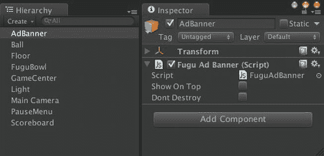  
图 15-6。已添加到场景中的 FuguAdBanner 脚本

因为我们的记分板在屏幕顶部，横幅广告最好放在底部，所以取消勾选 `Show On Top`。并且由于 `AdBanner` 游戏对象放置在保龄球场景中，而该场景不会加载任何其他场景，因此是否调用 `DontDestroyOnLoad` 实际上无关紧要，但我们也保持 `DontDestroy` 为未勾选状态。

### 测试脚本

在编辑器中运行游戏时，iAd 不会显示，但你可以通过在 iOS 模拟器或设备上运行游戏来测试它。在应用未被批准之前，它只会显示测试广告，如图 15-7 所示。  
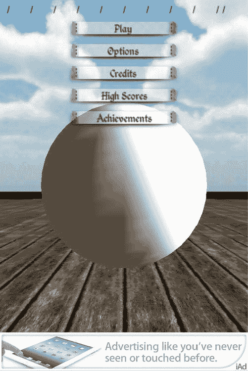  
图 15-7。一个测试 iAd 横幅

如果广告没有出现，请检查 Xcode 调试区域，查看 `FuguAdBanner` 脚本输出的 `Debug.Log` 错误消息。但如果没有错误消息，则无需担心。


有时广告需要一段时间才会显示，有时 iAd 服务器未能提供广告，此时调试区域会显示*无库存*消息。即使应用已通过审核，通常也会延迟一段时间后 iAd 才会真正激活。在此期间，用户会看到测试广告，但同样不必惊慌！

### 添加插屏广告

现在我们准备尝试插屏广告。由于插屏广告是全屏广告，因此处理方式必须与横幅广告不同。当插屏广告出现时，必须先将其关闭才能继续游戏，就像关闭模态对话框一样。因此，插屏广告通常策略性地放置在游戏的过渡节点（interstitial 意为“间隙之间”）。没人希望游戏正酣时突然弹出全屏广告！为此，我们将插屏广告放在初始场景中，这样它就会（如果出现的话）在保龄球场景加载之前显示。

同样，我们首先创建一个名为 `FuguAdInterstitial`（图 15-8）的新 JavaScript 文件。添加代码清单 15-2 的内容。

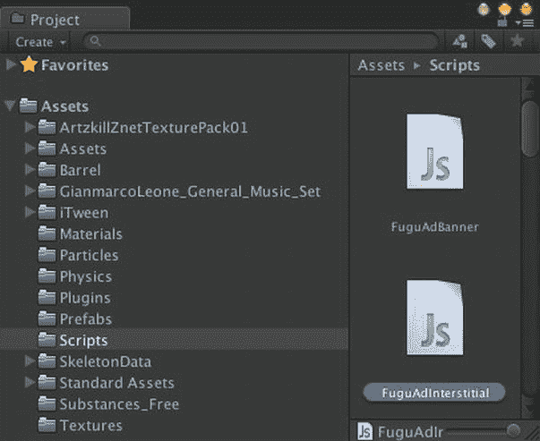

图 15-8. 创建 `FuguAdInterstitial` 脚本

代码清单 15-2.  `FuguAdInterstitial.js` 的完整代码

```
#pragma strict

var waitTime:float = 2.0;

#if UNITY_IPHONE
private var ad:ADInterstitialAd = null;

function Start() {
        if (iPhone.generation == iPhoneGeneration.iPad1Gen ||
                iPhone.generation == iPhoneGeneration.iPad2Gen ||
                iPhone.generation == iPhoneGeneration.iPad3Gen ||
                iPhone.generation == iPhoneGeneration.iPad4Gen ||
                iPhone.generation == iPhoneGeneration.iPadMini1Gen ||
                iPhone.generation == iPhoneGeneration.iPadUnknown) {
                ad = new ADInterstitialAd();
                var startTime = Time.time;
                while (!ad.loaded && ad.error == null && Time.time-startTime<waitTime) {
                        yield;
                }
                if (ad.loaded && ad.error == null) {
                        Debug.Log("iAd page shown");
                        ad.Present();
                }  else {
                        if (ad.error != null) {
                                Debug.Log("iAd page error: "+ad.error.description);
                        }  else {
                                Debug.Log("iAd page timed out");
                        }
                        ad = null;
                }
        }
}
#endif
```

由于插屏广告仅在 iPad 上可用，因此 `Start` 函数要做的第一件事就是检查当前是否运行在 iPad 上。遗憾的是，没有简洁的测试方法，但你可以检查 `iPhone.generation` 的静态变量，看其值是否与某个 iPad 型号匹配，每个型号都在 `iPhoneGeneration` 枚举中定义了对应的值。

测试 `iPhone.generation` 的方式展示了 `iPhoneGeneration` 枚举中的 iPad 值，但它的缺点在于，当未来版本的 Unity 为新 iPad 型号添加新值时，需要同步更新。另一种方法（根据你的观点，可能更健壮也可能更取巧）是将 `enum` 值转换为字符串，并检查其是否以“iPad”开头，如下所示：`if(iPhone.generation.ToString().StartsWith("iPad"))`。

在完成 iPad 检查后，代码与 `FuguAdBanner` 脚本类似。这里我们使用的是 Unity 的 `ADInterstitialAd` 类，而不是 `ADBannerView` 类。如同 `FuguAdBanner` 处理 `ADBannerView` 一样，代码实例化了一个 `ADInterstitialAd`，并在一个 `while-yield` 循环中等待 `ADInterstitialAd` 加载成功或加载失败并报错。

但我们不希望无限期等待，尤其是当这可能会延迟游戏开始时，因此我们还设置了在特定时间 `waitTime` 过后停止等待。

`waitTime` 以秒为单位，并被声明为公共变量，以便在检视面板中调整。在循环开始前，将当前游戏时间（可通过静态变量 `Time.time` 获取，同样以秒为单位）保存到局部变量 `startTime` 中。该循环除了检查广告是否加载成功或报错外，还会检查 `Time.time` 减去 `startTime` 是否仍然小于 `waitTime`。

当 `while` 循环终止时，如果广告已成功加载，则使用 `ADInterstitialAd.Present` 函数（本质上与 `ADBannerView` 使用的 `Show` 函数相同）显示广告。如果加载失败，则通过 `Debug.Log` 记录一条“iAd page has timed out”消息。

### 附加脚本

有了 `FuguAdInterstitial` 脚本，我们就可以将其添加到场景中了。如前所述，我们将把它添加到初始场景中，因此让我们切换到该场景（在项目视图中双击初始场景文件）。然后创建一个空的 `GameObject` 并命名为 `AdPage`（你也可以命名为 `AdInterstitial`，但何不取个更容易输入的名字）。将 `FuguAdInterstitial` 脚本拖拽到 `AdPage` `GameObject` 上（图 15-9）。

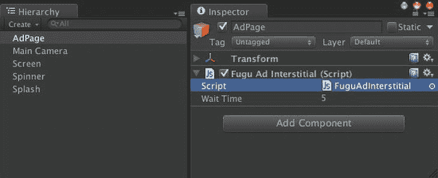

图 15-9. 将 `FuguAdInterstitial` 脚本添加到初始场景

### 测试脚本

现在可以运行了。与横幅广告一样，在编辑器中运行时不会看到任何广告，但在 iOS 模拟器或设备上测试时，应该会在初始画面显示期间看到全屏广告（图 15-10）。与横幅广告类似，不能保证 iAd 服务器一定会发送广告，但如果发送了，在应用发布到 App Store 之前，它将是一个测试广告。

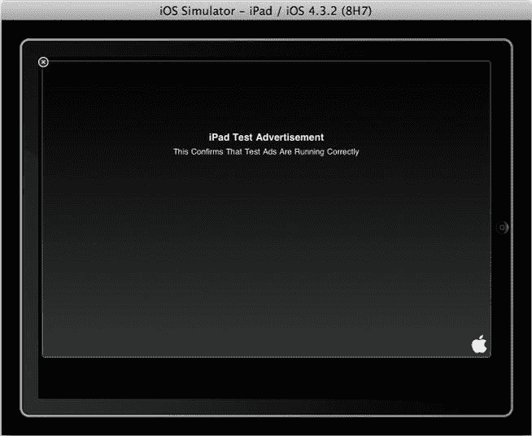

图 15-10. 在 iOS 模拟器上测试插屏 iAd

### 跟踪广告收入

与应用销售收入一样，iAd 收入也通过 iTunes Connect 报告，具体在 iAd 网络页面链接下，如图 15-1 所示。iAd 网络页面顶部以图表形式显示所有应用的 iAd 收入（图 15-11）。

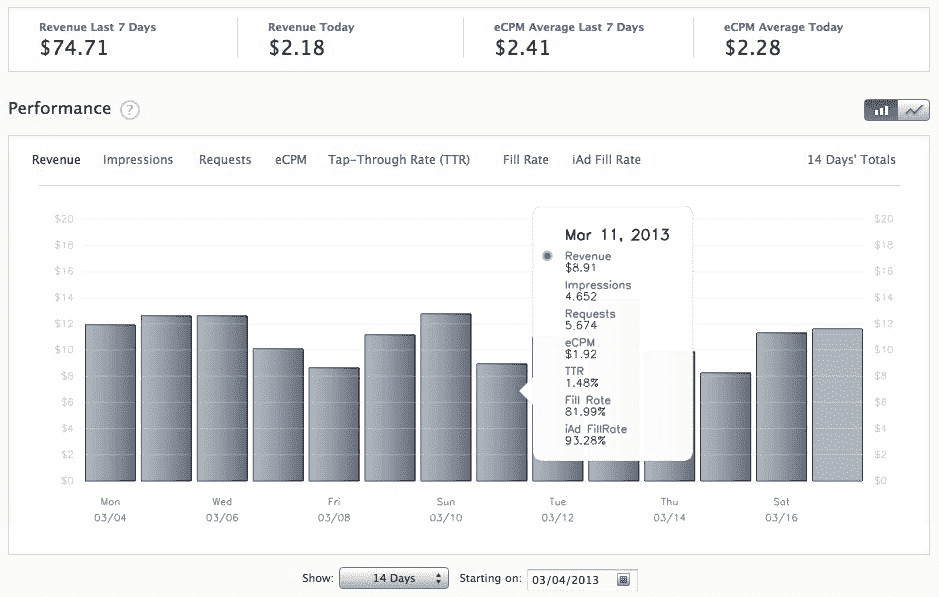

图 15-11. iAd 收入

收入图表下方是一个启用 iAd 的应用列表，包括已上线和仍处于测试广告状态的应用（图 15-12）。

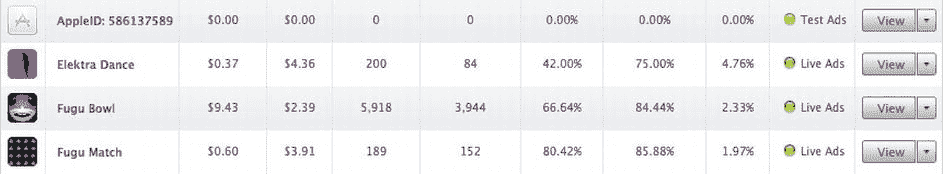

图 15-12. iAd 收入页面上的应用列表

点击列表中的某个应用会进入一个类似页面，仅显示该应用的收入。该页面还按国家/地区细分广告收入，并提供编辑应用描述（广告商所见）以及指定不希望出现在自身广告中的竞争对手公司和应用的选项。

## 延伸探索

本章是迄今为止最短的一章，这是一件好事。这意味着我们的游戏功能已经完备，并且添加广告非常简单。即使是在 iTunes Connect 上的设置也并不复杂！但在实践中，你可能需要考虑在何处以及何时放置广告，尤其是插屏广告，并且越早设计越好。

#### 脚本参考

本章中我们仅用少量代码就实现了许多功能。使用 iAds 只需要两个类：`ADBannerView` 和 `ADInterstitialAd`，而在典型的应用中，你通常只会使用其中一个类（同时使用横幅广告和插屏广告就太多了！）。


好的，作为一名高级文档工程师和翻译员，我将遵循您提供的注意事项和示例，将给定的英文文本翻译成中文。


这两个类的页面都包含脚本示例。`iPhone` 类包含所有 iOS 特有的内容（许多以前 iOS 特有的内容现在也适用于 Android，并且已归入 `Handheld` 类）。例如，我们检查静态变量 `iPhone.generation` 来确定我们是否在 iPad 上运行。查看 `iPhoneGeneration` 枚举的页面以了解 Unity 能够识别的 iOS 硬件集是很有必要的。

#### iOS 开发者库

Unity 的 `ADBannerView` 和 `ADInterstitialAd` 类对应于 Objective-C 中的同名类。iOS 开发者库中的 iAd 编程指南描述了这些类，并提供了大量关于如何有效部署横幅广告和插屏广告的细节。

面向开发者和广告商的 iAd 通用信息可在 `http://developer.apple.com/iad` 上找到。

#### 资源商店

iAd 并非您应用内广告的唯一选择。一旦您开始发布应用，您很可能会开始收到来自众多移动广告商客户经理的电子邮件。事实上，iAd 最初是 Quattro Wireless 的产品，之后苹果收购了该公司以获取其广告产品。第三方广告商通常拥有自己的 iOS SDK，因此需要 Unity 插件才能访问该 SDK。其中一些 SDK 可在资源商店的“服务”类别下找到，包括 PlayHaven 和 Inneractive。

## 资源商店之外

与他们的 Game Center 插件一样，Prime31 Studios 在 Unity 引入其 iAd 脚本支持之前就提供了一个 iAd 插件。Prime31 为许多其他广告服务提供插件，包括 AdMob、AdWhirl、MobClix 等等，可在 `http://prime31.com/` 上找到。

Kiip (`http://kiip.com/`) 为广告提供了一种有趣的变体。启用了 Kiip 的应用会提供类似横幅广告但以成就形式呈现的优惠券。他们的 Unity 插件可在 GitHub 上找到，地址是 `http://github.com/kiip`。

# 第 16 章

## 优化

与 Donald Knuth 那句广为引用的名言“过早优化是万恶之源”一致，我将优化这一主题留到了本书的末尾。在本章中，我们将优化我们的保龄球应用，并介绍该过程的前置步骤：设定性能目标并测量当前性能。本章节的项目文件位于 `http://learnunity4.com/`，其中包含本章开发的优化脚本和优化辅助脚本。

### 选择你的目标

有句老话说：“快、好、或便宜，三选二。”这通常是优化中的情况。在质量、空间和速度之间，你通常最多只能以牺牲第三者为代价，实现其中两者。

#### 帧率

在开始优化之前，你应该先设定目标帧率。iOS 设备每秒刷新屏幕 60 次，但默认情况下，Unity iOS 构建尝试达到每秒 30 帧（fps）。将目标帧率设为设备刷新率的一半对设备电池的要求较低，并且 30 fps 比 60 fps 容易实现得多。我们的保龄球游戏很简单，所以如果你愿意做出一些妥协，应该能够达到 60 fps。

始终追求最高可能的帧率似乎是显而易见的事，但如果游戏频繁地在 30 fps 和 60 fps 之间切换，这种不连续性可能比稳定在 30 fps 运行更让人分心。不过，在性能分析之前，以 60 fps 为目标（开始）是合理的，这样你可以看到峰值性能，然后如果需要的话再降低它。

### 创建脚本

在 Unity 编辑器中无法设置目标帧率，但幸运的是，你可以通过在脚本中设置静态变量 `Application.targetFrameRate` 来调整目标帧率。因此，让我们创建一个新的 JavaScript 脚本，将其放入 Scripts 文件夹，并命名为 `FuguFrameRate`（图 16-1）。

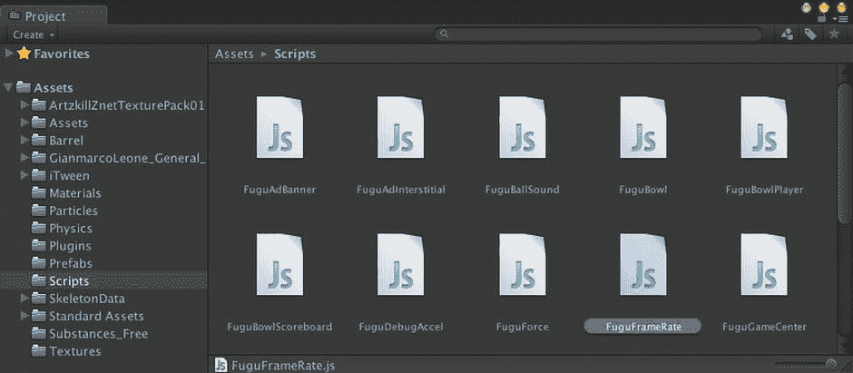

图 16-1. 在 Scripts 文件夹中添加脚本

这将是一个非常简短的脚本，包含一个公共变量和一个仅有一行代码的 `Start` 回调（代码清单 16-1）。

代码清单 16-1.  `FuguFrameRate.js`的完整脚本

```
#pragma strict

public var frameRate:int = 60;

function Start() {
        Application.targetFrameRate = frameRate;
}
```

该脚本通过将静态变量 `Application.targetFrameRate` 的值更改为 `frameRate` 的值来设置目标帧率，`frameRate` 是一个公共变量，因此可以在检视视图中进行调整。由于 iOS 设备的屏幕刷新率均为 60 fps，这是您能达到的最佳帧率，因此也是 `frameRate` 的合理默认值。

### 挂载脚本

要使用 `FuguFrameRate` 脚本，必须将其添加到一个场景中，以便在游戏启动时执行其 `Start` 回调。因此，让我们在保龄球场景中创建一个空的游戏对象，将其命名为 `FrameRate`，然后将 `FuguFrameRate` 脚本拖拽到它上面（图 16-2）。

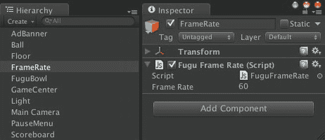

图 16-2. 保龄球场景中包含帧率脚本

这个脚本被添加到了我们的保龄球场景中，但你完全可以将它添加到我们的启动画面场景中，因为 `Application.targetFrameRate` 只需要设置一次，并且即使在加载新场景时，它也会保持该值。我们当前的启动画面场景实际上什么都没做，所以使用 Unity 默认的 30 fps 运行就可以了。

然而，如果启动画面场景要显示很酷的动画，你可能希望将其设置为 60 fps，在这种情况下，你还需要将帧率脚本添加到该场景中。实际上，如果启动画面场景在 60 fps 下效果最佳，而保龄球场景在 30 fps 下运行更流畅（而不是在 30 fps 和 60 fps 之间抖动），那么你需要将帧率脚本添加到两个场景中，在启动画面场景中将目标帧率设为 60 fps，在保龄球场景中设为 30 fps。

### 空间目标

除了帧率，你还应该为应用大小设定一个目标。你必须与用户安装的歌曲、照片、视频以及所有其他应用竞争 iOS 设备上的空间。更小的占用空间使用户更容易决定保留你的应用。

更小的应用下载时间也更短，加载速度更快（包括应用加载和关卡加载）。尤其重要的是，App Store 限制通过蜂窝网络下载的应用大小不得超过 50MB。你不想错过冲动购买的机会，所以 50MB 是一个不错的应用大小目标。这个限制比 App Store 原先的 20MB 限制容易达到得多，但任何包含大量内容的应用仍然很容易超过这个大小（有六个球道的 HyperBowl 大约是 40MB）。

### 性能分析

在开始优化之前，你需要知道要优化什么。这就是性能分析的用武之地，即获取关于游戏性能的信息。你可以选择从编辑器中显示的统计信息，到对应用本身进行性能分析，甚至编写一些你自己的性能测量代码。

#### 游戏视图统计信息

在编辑器中，你可以使用游戏视图中的统计信息覆盖层（图 16-3）立即访问场景的性能相关信息。

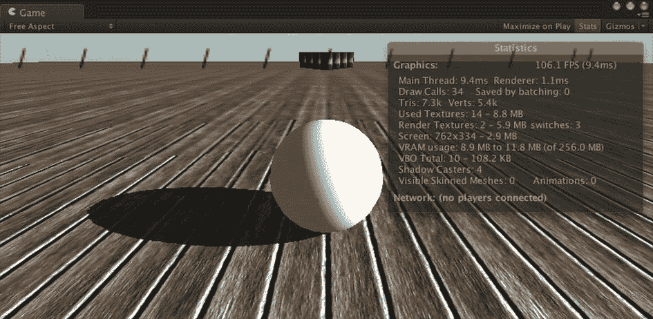

图 16-3. 游戏视图统计信息覆盖层

当你点击“播放”时，你会看到这些统计信息在游戏运行期间实时更新。这些信息很方便，但它不能替代对实际应用进行性能分析。

### 构建日志

最小化应用尺寸已不像过去那么重要，那时超过 20MB 意味着应用只能通过 Wi-Fi 下载到设备上，而不能通过 3G 无线网络。


现在的限制放宽到了 50MB，但这对于大型游戏来说依然很容易达到。更小的体积意味着更快的下载速度，并且能让更多用户将你的应用安装到剩余存储空间有限的设备上（我自己的 iPad 总是很快就装满了）。你可以在构建后查看 `Editor` 日志，来了解应用中各类资源的占用情况，如代码清单 16-2 所示。

代码清单 16-2. `Editor Log` 中的构建信息

```
Textures      5.2 mb      16.9%
Meshes        17.4 kb     0.1%
Animations    0.0 kb      0.0%
Sounds        21.2 mb     69.1%
Shaders       0.0 kb      0.0%
Other Assets  19.1 kb     0.1%
Levels        10.7 kb     0.0%
Scripts       175.2 kb    0.6%
Included DLLs 4.1 mb      13.3%
File headers  16.6 kb     0.1%
Complete size 30.6 mb     100.0%
Used Assets, sorted by uncompressed size:
 21.1 mb         69.0% Assets/Assets/Free/Assets/Sci-Fi_Ambiences/Sci-fi_AmbienceLoop1.wav
 4.0 mb          13.1% Assets/Textures/LearnUnityCover.jpg
 170.8 kb        0.5% Assets/Standard Assets/Skyboxes/Textures/Sunny3/Sunny3_up.tif
 170.8 kb        0.5% Assets/Standard Assets/Skyboxes/Textures/Sunny3/Sunny3_right.tif
 170.8 kb        0.5% Assets/Standard Assets/Skyboxes/Textures/Sunny3/Sunny3_left.tif
 170.8 kb        0.5% Assets/Standard Assets/Skyboxes/Textures/Sunny3/Sunny3_front.tif
 170.8 kb        0.5% Assets/Standard Assets/Skyboxes/Textures/Sunny3/Sunny3_back.tif
 170.8 kb        0.5% Assets/Standard Assets/Light Flares/Sources/Textures/50mmflare.psd
 170.8 kb        0.5% Assets/Barrel/Barrel_D.tga
 31.2 kb         0.1% Assets/Assets/Free/Assets/8Bit/Coin_Pick_Up_03.wav
 17.4 kb         0.1% Assets/Barrel/Barrel.fbx
 17.3 kb         0.1% Assets/Substances_Free/Wood_Planks_01.sbsar
 10.8 kb         0.0% Assets/Standard Assets/Skyboxes/Textures/Sunny3/Sunny3_down.tif
 1.0 kb          0.0% Assets/Prefabs/BarrelPin.prefab
 0.6 kb          0.0% Assets/Standard Assets/Light Flares/50mm Zoom.flare
 0.3 kb          0.0% Assets/Standard Assets/Skyboxes/Sunny3 Skybox.mat
```

该日志按资源类型（纹理、音频、网格、脚本）列出了应用大小的细分情况，并且包含了构建中使用的各个资源列表。遗憾的是，其大小贡献是基于未压缩尺寸，而非最终的压缩后资源大小，但它仍然能让你了解哪些资源占据了最多空间。

该日志还提供了一种方法，可以通过 `Console` 应用中便捷的搜索字段来找出项目中哪些资源被使用、哪些未被使用。例如，Fugu Bowl 的所有纹理都在 `Textures` 文件夹中，因此要检查这些纹理中哪些被使用、哪些可以从项目中移除，请选择 `Console View` 菜单中的 `Editor Log`，这会启动 `Console` 应用并选中 `Editor` 日志（图 16-4）。

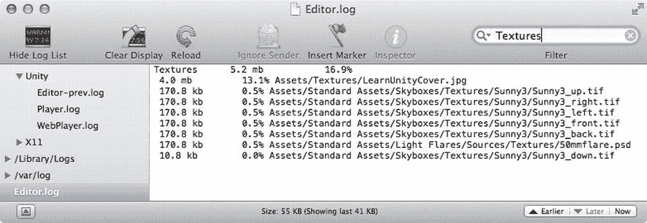

图 16-4. 使用 `Console` 应用的搜索字段过滤构建日志

在搜索框中输入 `Textures` 来过滤显示内容。然后你可以将结果列表与 `Project View` 中的 `Textures` 文件夹进行比较，看看 `Project View` 中是否有任何内容没有出现在构建中。

### 运行内置分析器

在 Unity iOS 构建生成其 Xcode 项目后，你可以选择激活内置分析器，它会报告类似于 `Game View` 中 `Stats` 覆盖层的信息。要激活内置分析器（在 Unity 文档中也称为内部分析器），请在 Xcode 项目中找到 `Classes` 文件夹下列出的头文件 `iPhone_Profiler.h`，并将 `ENABLE_INTERNAL_PROFILER` 的值从 `0` 改为 `1`（图 16-5）。

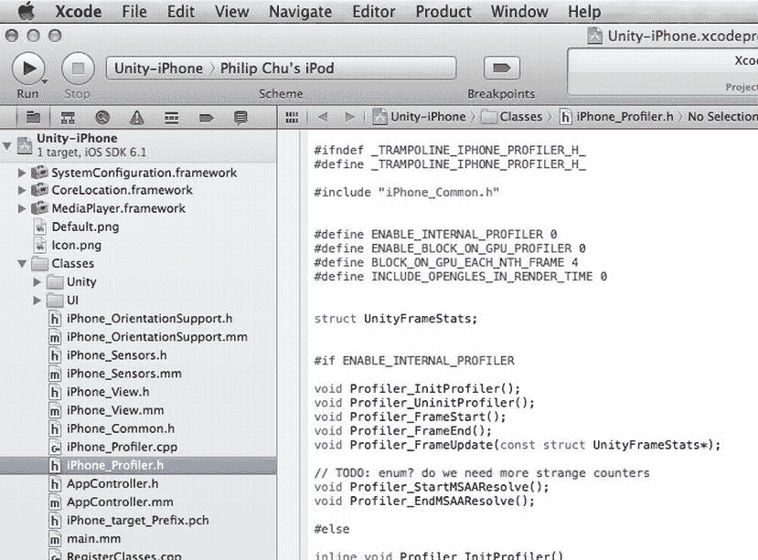

图 16-5. Unity Xcode 项目中的内置分析器开关

现在，当你点击 `Play` 时，应用将重新编译并启用内置分析器，游戏运行时，Xcode 的调试区域将每 30 帧显示一次统计数据，如代码清单 16-3 所示。

代码清单 16-3. 第四代 iPod Touch 上的内置分析器输出

```
iPhone Unity internal profiler stats:
cpu-player>    min: 39.8   max: 63.2   avg: 58.0
cpu-ogles-drv> min:  2.1   max:  3.7   avg:  2.4
cpu-present>   min:  0.7   max:  6.6   avg:  1.8
frametime>     min: 47.7   max: 72.2   avg: 64.5
draw-call #>   min:  40    max:  40    avg:  40     | batched:     0
tris #>        min:  5544  max:  5544  avg:  5544   | batched:     0
verts #>       min:  4358  max:  4358  avg:  4358   | batched:     0
player-detail> physx:  0.0 animation:  0.0 culling  0.0 skinning:  0.0 batching:  0.0 render: 58.0 fixed-update-count: 0 .. 0
mono-scripts>  update:  0.2   fixedUpdate:  0.0 coroutines:  0.1
mono-memory>   used heap: 405504 allocated heap: 524288  max number of collections: 0 collection total duration:  0.0
```

首先需要关注的数字是 `frametime`，它表示一帧的总耗时，单位是毫秒。如果你在 60 fps 下运行，那么 `frametime` 的平均值应该在 16.7 ms 左右。如果 `frametime` 高于 34，那么你甚至达不到 30 fps。`frametime` 下面的那一行也非常重要，因为它往往对 `frametime` 有重大影响。绘制调用是不同的绘图操作。通常，每个渲染的网格都会产生一个绘制调用，而在此基础上添加的灯光和阴影可能会增加更多的绘制调用。

`player-detail` 对顶部 `cpu-player` 行所列的时间进行了细分。`player-detail` 的时间分配在 `physx`（物理）、`animation`（动画）、`culling`（剔除不需要渲染的对象）、`skinning`（更新动画角色的蒙皮位置）、`batching`（合并具有相同材质的网格，以便通过一次绘制调用进行渲染）、`rendering`（渲染）和固定更新计数之间。

代码清单 16-3 中的分析结果来自第四代 iPod touch，显示 `frametime` 远未达到 30 fps，更不用说 16 fps 了，并且 `player-detail` 中渲染时间占据了主导地位。众所周知，对性能影响很大的一个因素是动态阴影，因此让我们在灯光中禁用阴影（图 16-6）。

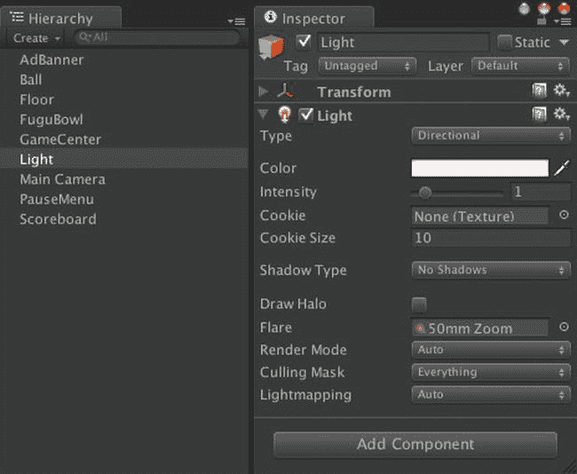

图 16-6. 从保龄球场景灯光中禁用阴影

然后再次 `Build and Run`，开始一个新的分析会话（代码清单 16-4）。

代码清单 16-4. 移除阴影后的内置分析器输出

```
iPhone Unity internal profiler stats:
cpu-player>    min:  5.0   max:  7.6   avg:  5.7
cpu-ogles-drv> min:  3.1   max:  7.0   avg:  3.7
cpu-present>   min: 14.4   max: 42.9   avg: 28.1
cpu-waits-gpu> min: 14.4   max: 42.9   avg: 28.1
msaa-resolve>  min:  0.0   max:  0.0   avg:  0.0
frametime>     min: 28.5   max: 55.5   avg: 39.5
draw-call #>   min:  29    max:  29    avg:  29     | batched:    10
tris #>        min:  4584  max:  4584  avg:  4584   | batched:  3420
verts #>       min:  3712  max:  3712  avg:  3712   | batched:  2750
player-detail> physx:  0.0 animation:  0.0 culling  0.0 skinning:  0.0 batching:  1.9 render:  3.1 fixed-update-count: 0 .. 0
mono-scripts>  update:  0.2   fixedUpdate:  0.0 coroutines:  0.1
mono-memory>   used heap: 401408 allocated heap: 524288  max number of collections: 0 collection total duration:  0.0
```

如果你没有运行 Unity iOS Pro，或者出于性能原因早些时候关闭了阴影，那么你已经达到了这个状态。无论如何，结果是显著的。


关闭阴影能显著减少绘制调用，帧时间和渲染时间也有所降低，尽管帧率仍低于 30 FPS。

运行编辑器分析器（专业版）

内置分析器能让您大致了解游戏性能的瓶颈所在（例如，是绘制调用、物理计算还是脚本执行）。但要精确找出占用帧时间的具体原因，仍然有些像猜谜。Unity Pro 用户可以使用 Unity 编辑器自带的 `Profiler`。分析器可以记录在编辑器中运行游戏的性能，或者远程分析，从测试设备捕获性能数据。要分析在测试设备上运行的保龄球游戏，您需要在构建设置中勾选`Development Build`选项，这将启用`Autoconnect Profiler`选项（图 16-7）。

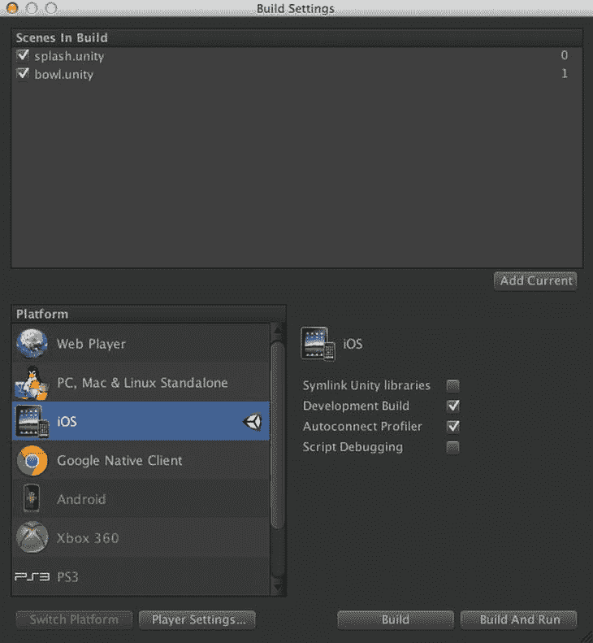

图 16-7。启用自动连接分析器进行构建

执行构建并运行，分析器窗口应该会自动出现，并对设备上运行的游戏进行一次分析会话（图 16-8）。

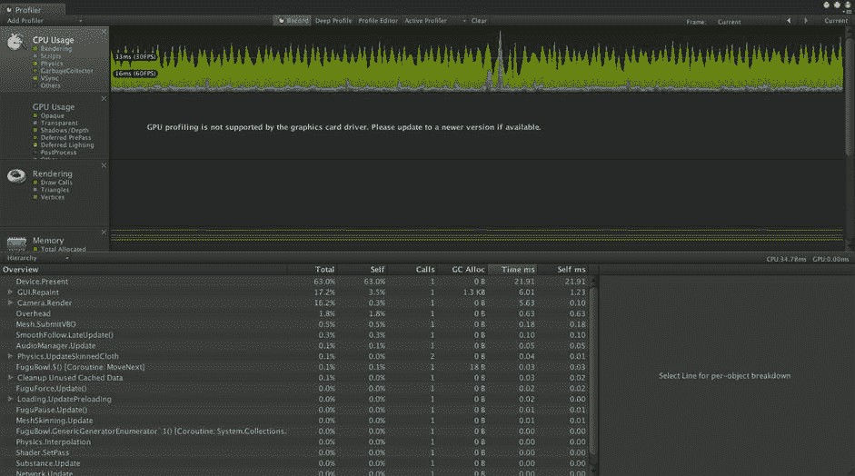

图 16-8。分析器窗口

最顶部的栏显示中央处理器（CPU）使用率。这个特定的分析资料显示我们徘徊在 30 FPS 左右。下方的区域显示了按函数调用划分的 CPU 使用情况细分（图 16-9）。

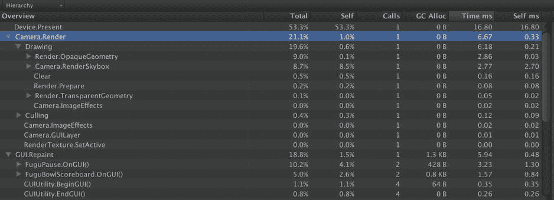

图 16-9。CPU 使用率的分析器细分

您可以展开这些项目以查看嵌套的函数调用。图 16-9 表明我们在 UnityGUI 函数上花费了大量时间，包括记分板和暂停菜单（此分析资料是在显示暂停菜单时截取的）。

手动连接分析器

如果由于某种原因分析器没有自动启动，可以通过窗口菜单调出分析器（图 16-10）。

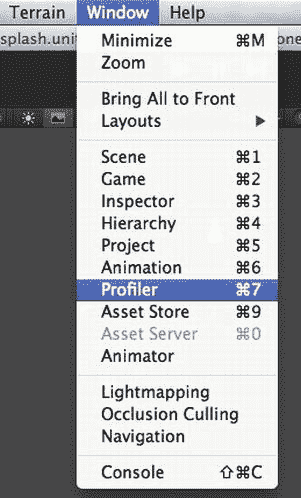

图 16-10。用于显示分析器的窗口菜单项

分析器实际上是一个视图，这就是为什么它列在窗口菜单的其他视图中。但是，就像资源商店一样，分析器占用了太多屏幕空间，最好让它单独显示在浮动窗口中。

一旦分析器窗口弹出，它将自动开始记录编辑器中的游戏（即使游戏并未实际运行），因此请点击记录按钮停止它。然后在活跃分析器窗口中选择您的 iOS 测试设备（图 16-11），再次点击记录按钮开始分析。

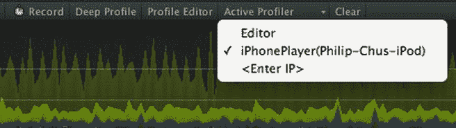

图 16-11。选择 iOS 设备作为活跃分析器

添加帧率显示

仅为了查看帧率而启用内置分析器或通过网络连接到编辑器分析器并不方便。这时，屏幕上显示的帧率显示就派上用场了。您可以躺在沙发上看电视并测试游戏时（至少我是这么做的）切换它。

对于屏幕上的帧率显示，您可以使用像保龄球记分板那样的 UnityGUI 标签。然而，还有另一种在屏幕上显示 2D 文本的方法，即使用`GUIText`组件。您可以通过菜单栏的游戏对象菜单，或层级视图中的创建菜单，创建一个已附加`GUIText`组件的游戏对象（图 16-12）。

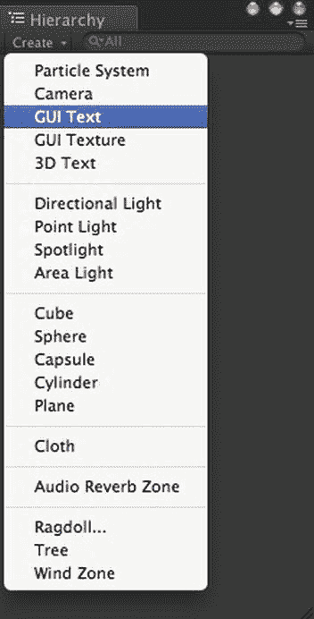

图 16-12。创建一个 GUIText 游戏对象

让我们继续创建那个`GUIText`游戏对象，并将其命名为 FPS（图 16-13）。

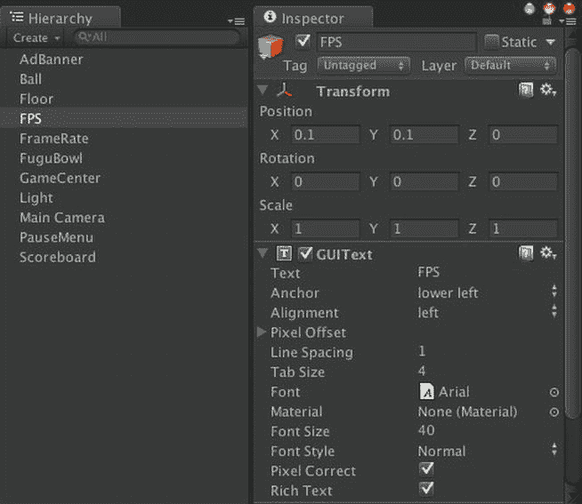

图 16-13。带 GUIText 组件的 FPS 游戏对象

与我们用于次要启动画面的`GUITexture`类似，`GUIText`在屏幕上的位置由归一化坐标定义，其中左下角为 (0,0)，右上角为 (1,1)，通过游戏对象的变换组件的 x 和 y 值指定。将我们帧率显示的 x 和 y 位置分别设为-0.1，使其靠近左下角，并将文本值从`GUIText`改为 FPS。

无需自定义字体，因为帧率显示仅用于开发，并且您不会在发布的应用程序中激活它（尽管在 HyperBowl 中，用户可以激活帧率显示，以便他们报告性能问题）。默认大小值为 0，表示使用字体导入设置中指定的字号，但这太小了，让我们将其设置为一个合理的大尺寸，比如 40。在此期间，`GUIText`在游戏视图中是可见的，因此您可以看到大小变化的效果（图 16-14）。

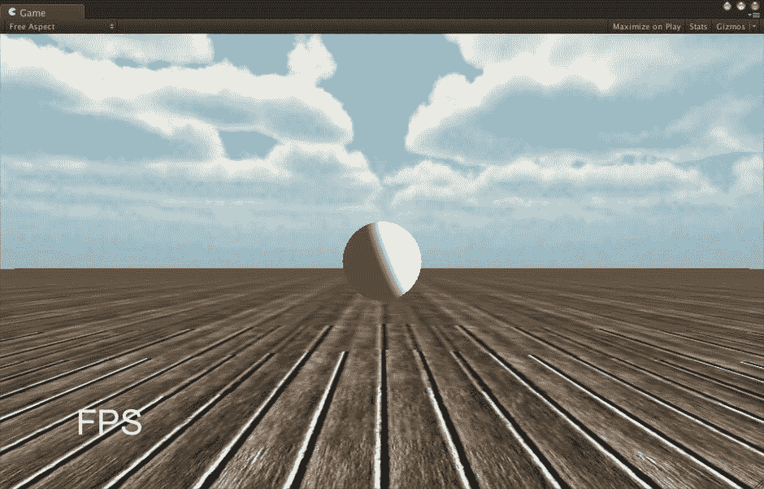

图 16-14。带有 GUIText 的游戏视图

正如`GUITexture`比 UnityGUI 更便于显示静态纹理（无需编写脚本），`GUIText`是比 UnityGUI 更直接的显示静态文本的方式。但是，帧率显示确实需要通过设置`GUIText`实例的`text`变量来更改文本。现在让我们实现帧率显示脚本。创建一个新脚本，将其放置在`Scripts`文件夹中，并命名为`FuguFPS`（图 16-15）。

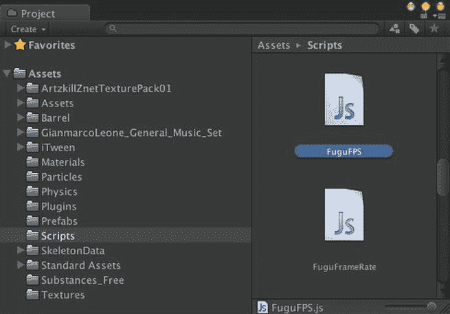

图 16-15。创建一个新的 FuguFPS.js 脚本

然后将代码清单 16-5 中的`Update`函数添加到脚本中。脚本的`Update`回调函数使用计算出的帧率设置`GUIText`的`text`变量。计算很简单，基于`Time.deltaTime`（最近的帧时间）。通常，每秒帧数会计算为 `1 / Time.deltaTime`，但由于`Time.deltaTime`被`Time.timeScale`缩放，您可以通过使用`Time.timeScale / Time.deltaTime`来轻松考虑这一点。

`GUIText`中的`text`变量是一个`String`变量，因此您需要通过调用数字的`ToString`函数将帧值转换为`String`（每个内置类型都有`ToString`函数）。然后附加“`FPS`”，这样您就不会疑惑屏幕上的两个数字是什么了！

代码清单 16-5。完整的帧率显示脚本 FuguFPS.js

```javascript
#pragma strict

function Update() {
    if (Time.deltaTime > 0) {
        var fps : float = Time.timeScale / Time.deltaTime;
        guiText.text  = fps.ToString("f0") + "FPS";
    }
}
```

现在将脚本附加到 FPS 游戏对象。当您在编辑器中点击播放时，您应该会看到帧率显示在不同数字之间闪烁。当您执行构建并运行到测试设备时，您应该会看到帧率显示与在内置分析器和专业版分析器中获取的数字相对应（图 16-16）。

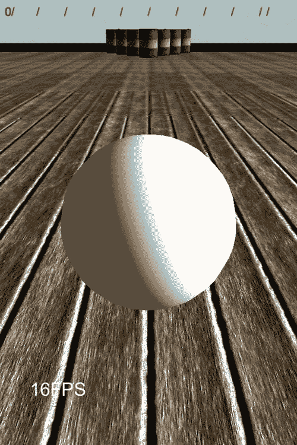

图 16-16。在测试设备上运行的帧率显示

请记住，在发布此应用程序之前，您应该停用 FPS 游戏对象！


### 优化设置

正确的优化方式是系统性地从最大的瓶颈入手，在每一阶段对改进进行性能分析，直至达成目标。但为了在本章中介绍多种优化步骤，我们将快速依次执行一系列操作。

#### 质量设置

首先，我们来调整与优化工作相关的全局设置。最可能影响性能的设置是**质量设置**，它控制着游戏的视觉质量（图 16-17）。

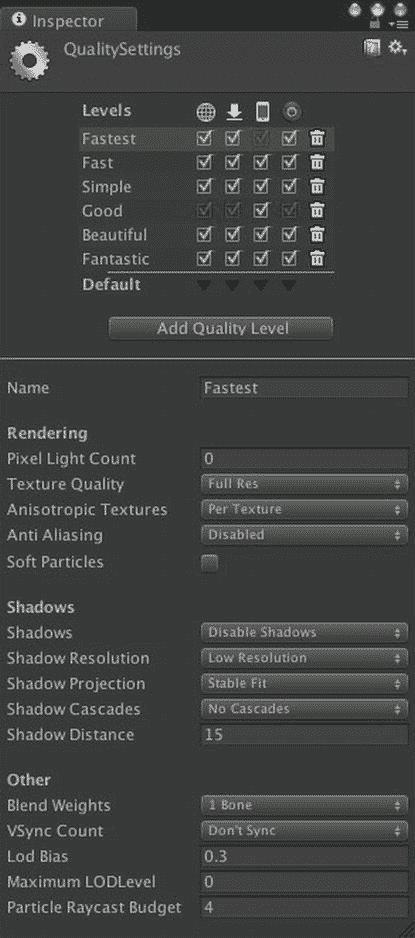

图 16-17. 优化质量设置

我们追求的是速度，因此将当前的 iOS 质量设置为**最快**，然后在此基础上进行调整。对于当前的灯光设置，零像素光源是可以接受的。如果你使用了聚光灯，那么缺乏像素光的问题会很明显。

你并不想强制所有纹理都使用半分辨率。依靠纹理导入设置来逐例限制分辨率，能带来更大的灵活性。因此，我们将纹理质量设置为**全分辨率**。

同样，你还需要将各向异性纹理的设置从**无**改为**逐纹理**。各向异性纹理可以补偿因倾斜视角观看而导致的失真，例如，这对于赛车游戏中道路纹理来说就很合适。与纹理分辨率类似，各向异性也可以在纹理的导入设置中进行调整。

多重采样抗锯齿（全屏平滑）是一项耗资源的操作，因为你完全可以预料到，全屏逐像素运算本身就很昂贵。

你的游戏中没有粒子系统，因此**柔和粒子**设置无关紧要，但它同样是一项逐像素运算（这类特性通常被称为**受限于填充率**）。

阴影功能已禁用，因此其下方的所有阴影参数均不相关。但如果启用了阴影，两个关键属性是**阴影分辨率**和**阴影距离**。这两个属性都会影响阴影的解析度；提高阴影分辨率自然能获得更清晰的阴影，但代价是消耗更多内存来存储更大的阴影贴图；缩短相机视锥体可以提升深度缓冲精度，类似地，缩短阴影距离也能减少对大型阴影贴图纹理的需求。降低阴影分辨率可以节省空间，但会导致阴影更加锯齿化；而缩短阴影距离则可能减少阴影中涉及的物体数量。

#### 物理管理器

刚体在静止时会进入休眠状态，以避免不必要的物理计算。“静止”意味着刚体的运动和旋转都已停止。你可以在**物理管理器**（图 16-18）中指定**休眠速度**和**休眠角速度**的阈值，该管理器位于**编辑**菜单的**设置**部分下。

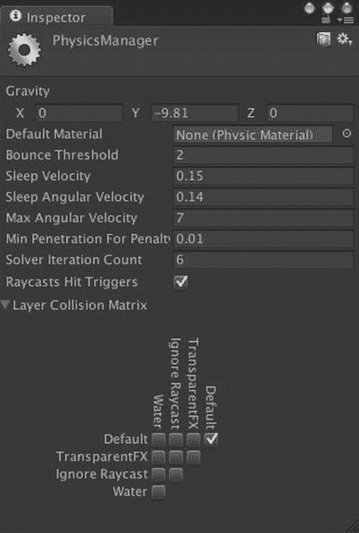

图 16-18. 优化物理管理器

在物理管理器的底部，你还可以指定哪些层级的游戏对象可以相互碰撞。这在我们的保龄球游戏中没有影响，因为所有碰撞对象都位于**默认**层级。但为了演示这一点，我们修改碰撞表格，只允许**默认**层级中的游戏对象与同一层级中的其他游戏对象碰撞。

#### 时间管理器

由于物理更新以固定时间间隔进行，你可以通过增加**时间管理器**（图 16-19）中的**固定时间步长**来减少物理计算时间。理想情况下，应在不降低物理模拟精度的前提下，将固定时间步长尽可能设置得高一些。现在，我们将固定时间步长从 0.02 增加到 0.03。

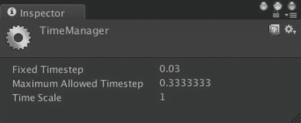

图 16-19. 优化时间管理器

紧邻**固定时间步长**下方的属性也与物理更新相关：**最大允许时间步长**。该值限制了每帧可用于物理更新的时间上限。这可以防止出现失控情况：固定更新占用大量时间，导致帧时间增加，进而在下一帧中引发更多固定更新，如此恶性循环。降低**最大允许时间步长**可以最小化 `FixedUpdate` 对帧时间的影响，但存在降低物理模拟精度风险。

#### 音频管理器

音频的播放方式也涉及优化权衡。在**音频管理器**（图 16-20）中，你可以指定音频延迟，即声音播放前允许的延迟时间。

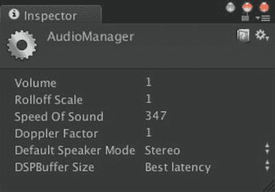

图 16-20. 优化音频管理器

对于需要声音快速响应的游戏（例如我们保龄球游戏中的碰撞音效），选择**最佳延迟**（即最低延迟）是合适的。

#### 玩家设置

**玩家设置**对优化效果有很大影响。在**分辨率与显示设置**中，我们选择了最高的原生屏幕分辨率，并且为**显示缓冲区**选择了最高的每像素 32 位色彩分辨率（图 16-21）。如果取消勾选此框，显示缓冲区将使用每像素 16 位，这可能会导致一些颜色条带现象。因此，我们选择以占用更多内存为代价来换取更高的视觉保真度。

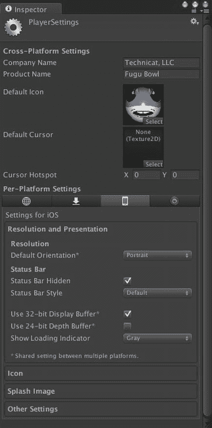

图 16-21. 优化玩家设置中的分辨率和显示

我们将**深度缓冲区**保留为默认的每像素 16 位，但如果该精度不足以防止深度冲突（即一个紧贴另一个物体的对象穿透显现的情况），你可以将其提高到每像素 24 位，这同样能提升视觉质量，但会使用更多内存。

**其他设置**部分充满了优化选项，且并非只限于标记为“优化”的区域内（图 16-22）。

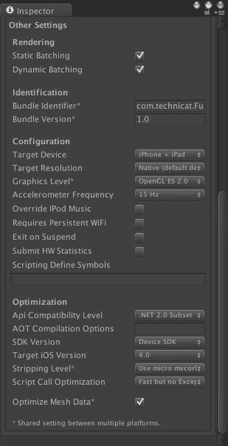

图 16-22. 优化玩家设置中的其他设置

#### 静态批处理（专业版）

正如我在首次性能分析环节中指出的，绘制调用通常对性能有很大影响。**静态批处理**（仅 Unity iOS 专业版用户可用）通过在构建时合并可以在同一次绘制调用中一起渲染的网格，来减少绘制调用。要合并网格，其游戏对象必须在检视面板中标记为**静态**，并且它们必须共享相同的材质或材质集。

静态批处理是一个非常灵活的系统；它会记住每个游戏对象的独立身份，因此一个拥有静态批处理网格的游戏对象仍然可以随意被停用，并且仍然会接受剔除处理。

我们的保龄球游戏只有一个静态网格——地面，因此启用静态批处理在这里不会产生任何效果。总的来说，静态批处理能显著提升性能，但代价是消耗更多内存，因为它实质上会复制每个被批处理的网格。

#### 动态批处理

下一个选项，**动态批处理**，对专业版和非专业版用户都可用，并且在运行时进行。与静态批处理类似，它要求网格在合并前共享材质，但动态批处理可以处理移动中的对象，因为它每帧都会检查是否需要重新批处理对象。例如，我们游戏中的保龄球瓶可以被批处理，因为它们显然都使用了相同的材质。毕竟，它们都是由同一个预制件实例化而来的。


然而，保龄球无法与任何球瓶或球道表面进行批处理。批处理确实需要一些时间，这也是它会出现在内置性能分析器中的原因，但就像静态批处理一样，它通常能显著提升性能。

#### 加速计频率
`加速计频率`默认设置为每秒 60 个样本。你可以将该频率降低到 15 来节省一些处理时间，这对于我们的摇动检测代码来说已经足够了。如果在应用中根本不使用加速计，请将其设置为 0。

#### 剥离级别 (Pro)
Unity Pro 用户可以选择应用 iOS 剥离。有三个循序渐进的级别可供选择：`字符串程序集`、`剥离字节码`和`使用微型 mscorlib`。我们选择最后一项，这是最积极的优化方案，并且包含了前两项。`微型 mscorlib` 是核心 Mono 库的一个自定义精简版本，可能与您导入的其他 .NET 库不兼容，但对于这个游戏来说这不是问题。

#### 脚本调用优化
`脚本调用优化`级别决定了如何执行对本机代码的调用。默认设置`慢速且安全`会产生额外开销，因此我们将其设置为`快速但无异常`。正如标签所示，此设置速度更快，但如果本机代码抛出异常（本质上是一个期望由调用代码处理的错误），则会失败。

#### 优化网格数据
`优化网格数据`选项会在构建时移除任何不必要的每个顶点网格信息。如果网格未使用凹凸贴图着色器，则可以移除切线；如果网格使用了无光照着色器，则可以移除法线。这能节省空间并有利于批处理，因为批处理会复制所有这些网格数据。当然，如果您打算在运行时通过脚本将网格的着色器更改为需要比原始着色器更多顶点信息的着色器，则不应使用此选项。

### 优化游戏对象
在调整了`质量设置`、`物理管理器`和`时间管理器`之后，我们准备调整单个游戏对象。

#### 摄像机（Camera）
摄像机是优化的焦点（无意冒犯），因为它们决定了渲染什么以及如何渲染。摄像机视锥体自动提供了一种优化来源。任何完全位于视锥体之外的游戏对象对摄像机来说都是不可见的，因此不会尝试渲染该游戏对象。这种优化被称为*视锥体剔除*，并且同样有利于动画和粒子系统。当没有人能看到动画或粒子时，系统就无需播放动画或模拟粒子。

**提示** 渲染一个游戏对象最快的方式就是完全不渲染它。

因此，调整摄像机的视锥体使其包含场景中更少的对象是一种优化方法。你可以通过降低视野来缩小视锥体，也可以通过减小远距离值来缩短视锥体，使远平面更靠近摄像机（图 16-23）。

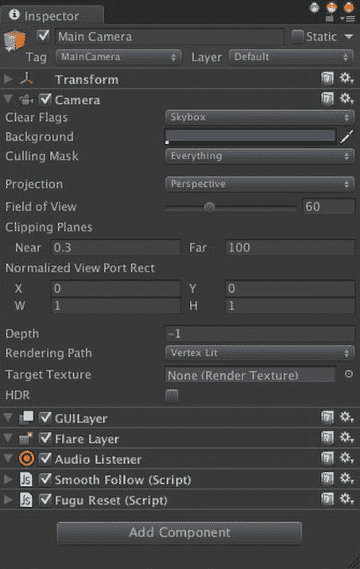

图 16-23. 优化主摄像机

例如，考虑到保龄球地面要小得多，主摄像机中远平面值的默认值 1000 就有些过度了。将远距离值设置为 100 仍然可以使所有物体可见（Unity 的天空盒方便地独立于视锥体可见）。

最小化远平面值的另一个好处是，在渲染时可以在深度缓冲区中存储一个更小范围的值。这避免了 Z 轴冲突的问题，即由于深度缓冲区数值精度有限，一个几乎位于另一个物体后面的物体似乎会穿透前面的物体。

另一种从摄像机渲染中剔除游戏对象的方法是，指定其只渲染位于其剔除遮罩中某些特定层级集合内的游戏对象。

这实际上是一个正确性的问题——你需要确保摄像机只渲染它应该渲染的内容，而不是，比如说，已经由单独的 HUD 摄像机渲染的 HUD 元素。但这确实会影响性能。我曾经遇到过一个 bug，主摄像机无意中渲染了 GUI 元素，但由于它们距离较远，我并没有注意到。

每个摄像机还有一个 `eventMask` 变量，类似于它的剔除遮罩（或者等价地，它的 `cullingMask` 变量），但与指定摄像机渲染哪些层级不同，`eventMask` 决定了哪些层级接收来自摄像机的 `onMouse` 事件。最小化 `eventMask` 中存在的层级可以减少 `onMouse` 处理的额外开销，但由于它在检视面板中不可见，因此必须通过脚本来设置该变量。

最后一个摄像机优化是指定渲染路径。iOS 上有两种可用的渲染路径：顶点光照和前向渲染（延迟渲染不适用于移动平台）。前向渲染比顶点光照更灵活、更强大。例如，顶点光照路径无法显示凹凸贴图。但在本章中，我们积极追求高帧率，所以我们将渲染路径设置为顶点光照。

#### 灯光（Lights）
我们已经禁用了光照上的阴影（除了那些本来就没有阴影的非 Pro 用户），这是一个巨大的性能改进，因为它减少了绘制调用。光照也已经受到了质量设置的影响，该设置指定了无像素灯光并禁用了阴影（图 16-24）。

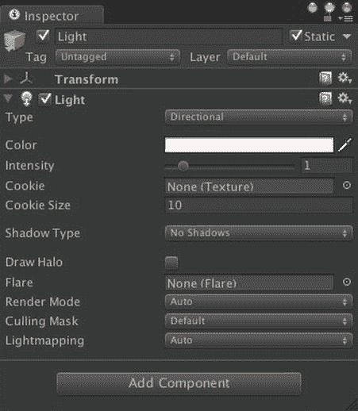

图 16-24. 优化光照

但我们还可以对光照进行一些类似于摄像机 tweaks 的额外调整。与摄像机一样，光照有一个指定的范围，我们可以将其最小化以减少被照亮的游戏对象数量。光照也有一个剔除遮罩，与主摄像机的情况一样，可以将其设置为默认层级，但通过明智地分配层级，你可以减少不必要被照亮的游戏对象。

#### 球瓶
为了追求速度，我们选择了最简单的光照和最简单的渲染路径。你也可以简化你为每个网格使用的着色器。保龄球瓶构成了我们场景中的大部分物体，所以我们首先修改 BarrelPin 预制体（图 16-25）。

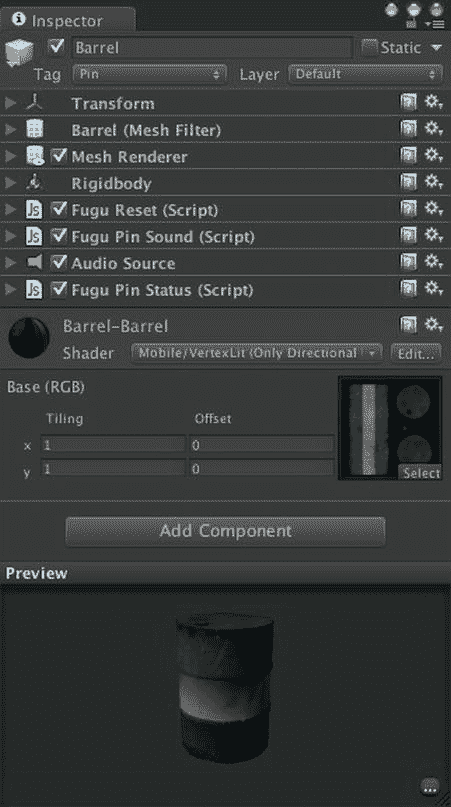

图 16-25. 优化 BarrelPin 预制体

在项目视图中，选择预制体中的 Barrel 游戏对象，然后在检视面板中点击着色器选择器。有很多比 Bumped Specular 更简单的着色器；使用少于两种材质的着色器通常更快，而顶点光照将比任何像素着色器更高效。甚至有一组专门为移动设备实现的着色器，包括 `Mobile/Vertex Lit`。但有一种着色器更适合我们的情况，即专门为仅与方向光一起使用而实现的 `Mobile/Vertex Lit` 着色器。所以我们选择那个，`Mobile/Vertex Lit (Only Directional Light)`。

#### 地面
地面游戏对象有一些组件属性可以进行优化调整（图 16-26）。从 MeshRenderer 组件开始，我们启用了`投射阴影`和`接收阴影`选项。虽然我们在光照和质量设置中禁用了阴影，但你应该留意每个对象的设置，以防将来启用阴影。如果启用了阴影，你会希望在地面上投射阴影，所以`接收阴影`应该启用。但是因为我们不期望地面投射阴影（至少不会投射到我们能看到的东西上），所以让我们禁用`投射阴影`选项。就性能而言，投射阴影的对象越少越好。


`9781430248750_Fig16-26.jpg` 图 16-26. 优化地板

现在转向物理方面，这里还有另一个优化机会。虽然我们已经为保龄球瓶和保龄球使用了基本碰撞体，但我们的地板仍在使用`MeshCollider`组件。由于地板是一个平坦的方形表面，你可以改用`BoxCollider`。替换过程很简单：当你为地板添加`BoxCollider`组件时（无论是通过检视器视图中的“添加组件”按钮，还是菜单栏上的“组件”菜单），Unity 会询问你是否要替换现有的`MeshCollider`（选择“是”），新的`BoxCollider`组件将自动调整大小以适配地板网格。

与保龄球瓶一样，你也可以将着色器从相对复杂的 Bumped Specular 着色器更改为`Mobile/VertexLit (Only Directional Lights)`，就像我们对保龄球瓶预制体所做的那样。但地板是个特例，因为它很平坦。其表面的光照是均匀的。因此，你可以使用`Unlit Texture`着色器，完全避免任何光照计算。

#### 球体

我们将优化的最后一个游戏对象是球体。它已经在使用`SphereCollider`组件，所以我们要更改的只有着色器。和保龄球瓶一样，球体也会移动，因此我们使用一个光照着色器，具体来说，就选用我们为保龄球瓶选择的同一个`Mobile/VertexLit (Only Directional Light)`着色器。但是，球体当前使用的是创建时自动分配的默认漫反射材质，而你无法更改该材质的着色器。因此，你需要为球体分配一个不同的材质。

你可以用创建其他类型资源相同的方式来创建新材质。在项目视图中，调出创建菜单并选择“材质”（图 16-27）。

``

图 16-27. 创建新材质

将新材质放入 Materials 文件夹中，并将其命名为 Ball。选中它（图 16-28），然后在检视器视图中调整其着色器，选择`Mobile/VertexLit (Directional Light)`。

``

图 16-28. 为新材质设置着色器

接着将 Ball 材质拖拽到 Ball 游戏对象上，这样就好了（图 16-29）。

``

图 16-29. 优化球体

如果没有提供纹理，上述两个`Mobile/VertexLit`着色器都会显示白色。如果你希望球体具有白色以外的颜色，则应使用标准的 Vertex Lit 着色器，该着色器允许你指定主颜色和高光（光泽）颜色。

### 优化资源

人们很容易忽略一点：在导入资源时可以完成大量优化工作，并且你可以通过每个资源的导入设置来控制这一点。

#### 纹理

我们的纹理已经以合理的默认设置导入了，但让我们看看几个纹理，以便理解这些设置。在项目视图中，我们查看 Textures 文件夹，比较一下我们在第 3 章示例场景中使用的猫纹理（图 16-30）和我们在第 12 章中用于次级启动画面的纹理（图 16-31）。猫纹理使用了对应“纹理”预设的导入设置，而启动画面纹理则使用了“GUI”预设的导入设置。在这两种情况下，从预设切换到“高级”都会显示该预设的具体设置。

``

图 16-30. 纹理的导入设置

``

图 16-31. GUITexture 的导入设置

“纹理”和“GUI”预设之间有两个主要区别：“纹理”启用了 Mip Mapping（多级渐远纹理映射），而“GUI”启用了 sRGB 旁路选项。mipmapping 中的 *mip* 代表短语 *multim in parvo*，意为“小中见大”。Mipmap 是纹理预先计算好的较小版本，当纹理相对于摄像机靠近或远离时，可以提供更平滑的视觉质量和过渡效果。

滤镜类型决定了如何从纹理中的像素（或 *texel*）进行计算以用于渲染。对于点过滤，从最接近所需尺寸的 mip 级别中选择纹素。双线性过滤从最接近的较小 mip 级别中对其周围的纹素进行平均，而三线性过滤则结合了最接近的较大 mip 级别和最接近的较小 mip 级别的双线性过滤结果。点采样是最简单、最快的滤镜，而三线性过滤则是最消耗资源的。双线性过滤是折中方案，也是合理的默认选项。

尽管会增加内存使用量，但 Mipmapping 通常是合适的。除了改善纹理显示效果外，mipmapping 还允许图形处理器使用较小版本的纹理，这有助于提升性能。对于在 GUI（例如 UnityGUI 或 GUITexture）中使用的纹理，通常只在一种尺寸下查看，理想情况下是纹理的原始尺寸，因此 mipmapping 是不必要的。对于启动画面来说尤其如此，特别是当它甚至没有被加载到场景中时。

**提示** 对于具有锐利细节的纹理（例如用作街道标志的纹理），最好使用点采样，甚至完全禁用 mipmapping，以避免纹理模糊。

各向异性（方向依赖）过滤级别用于补偿纹理相对于摄像机倾斜的情况，例如赛车游戏中的路面。在这些情况下，在两个方向上均匀地对纹理进行过滤看起来可能不正确。对于场景中的常规纹理，应根据具体情况选择各向异性级别。对于 GUI 纹理（从摄像机正面观看），不需要各向异性过滤。

通常，纹理在导入时会考虑伽马空间，即屏幕的非线性色彩空间。一般来说，这对于 GUI 纹理来说并非必需，因此在这些情况下，会选中“旁路 sRGB”选项。如果效果不太对劲，可以尝试两个选项。

对于 mipmapping，纹理必须是正方形，且边长是 2 的幂（POT），因为 mip 级别是通过连续对半缩小生成的。例如，一个 256 × 256 的纹理将拥有 128 × 128、64 × 64 等 mip 级别。即使是不使用 mipmapping 的纹理，使用 POT 尺寸也是有益的，因为图形硬件最终使用这种尺寸。大多数为游戏设计的纹理都采用 POT 尺寸，但如果不是，纹理导入设置可以自动将纹理缩放至最接近的 POT 尺寸。

对于 GUI 纹理，通常不希望这样。我们的启动画面将其 POT 缩放设置为“无”，生成的预览显示其原始尺寸和 NPOT（非 2 的幂）。如果你尝试将其用作场景中的常规纹理，Unity 会在控制台视图中发出警告，指出你以非 GUI 方式使用了 NPOT 纹理，并会导致性能损失。

纹理的最大尺寸和压缩级别列在预设设置中，并且独立于预设进行指定。对于常规纹理，默认的 1024 最大尺寸是合理的（2048 × 2048 是所有设备支持的最大尺寸），但应根据具体情况选择。例如，如果一个大纹理只有一种颜色，你最好将其做成一个 2 × 2 的纹理。


如果一个纹理仅用于屏幕上较小或较远的网格，那么就没有必要将其设为大型纹理。对于启动画面，我们将最大尺寸设置为`2048`，这样就不会将纹理缩放至小于 iPad Retina 屏幕的尺寸。

**提示**：将最大缩放设置为最大允许值，并将压缩级别设置为`TrueColor`，可以在导入设置的预览区域中查看纹理的原始格式。

对于常规纹理，默认的压缩级别`4-bit PVRTC`（PowerVR 纹理压缩）是合理的。细节较少的纹理可以使用更高效的`2-bit PVRTC`。与`mipmapping`一样，纹理压缩可以减少纹理映射占用的内存，而图形处理器对`PVRTC`的支持则能提供额外的性能优势。同样与`mipmapping`类似的是，细节特别丰富的纹理可能会因压缩而质量严重下降，在这种情况下，保留未压缩的`16-bit`或未压缩的`TrueColor`（`24-bit`）纹理可能效果更好。对于`GUI`纹理，出于这个原因，你可能不希望压缩纹理；或者对于在玩家设置中指定的启动画面，应保持其原始格式不变。

#### 音频

我们在`Audio Manager`中调整了`DSP Buffer Size`，以使碰撞音效响应更快，这虽然会增加一些处理开销，但能降低延迟。与纹理类似，你也可以调整`AudioClips`的导入设置。与纹理使用分为`3D`和`GUI`两大类类似，声音也分为`2D`和`3D`两种：`3D`声音与`GameObjects`（或至少是`3D`世界中的位置）关联，而`2D`声音则用于环境音或音乐（例如我们在第 5 章舞蹈场景中添加的歌曲）。

我们来比较一下保龄球音效中的两个例子：保龄球瓶碰撞音效（图 16-32）和保龄球滚动音效（图 16-33）。这两种声音都源自世界中的某个位置，并且会相对于主摄像机移动（更准确地说，是相对于附加在主摄像机上的`AudioListener`组件移动）。因此，它们在导入设置中都被标记为`3D`声音。`3D`声音应为单声道，而非立体声。幸运的是，这两个声音的原始音频文件都是单声道的，因此你无需选择`Force to mono`。

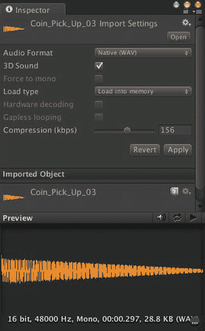

图 16-32

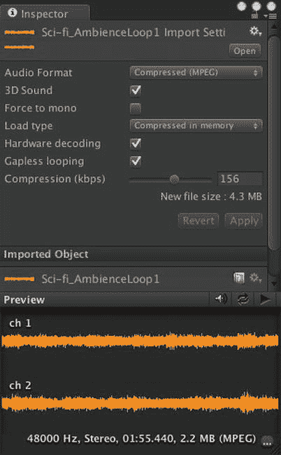

图 16-33

碰撞音效文件较小，因此我们将其保持未压缩状态，以避免解压缩处理，并最大化播放质量。滚动音效文件较大，因此对其进行压缩并保留在内存中。由于这是唯一的压缩音效，并且`iOS`硬件支持随时解码一个压缩音效，因此不会产生任何软件解码开销。不过，如果场景中还播放环境音或音乐，这些文件可能会大得多，你应该优先压缩它们。

**提示**：导入未压缩的音效，以便在编辑器中灵活决定压缩哪些音效。除非你找到了比`Unity`压缩工具质量更高的压缩工具，否则没有必要导入压缩音频。

选择压缩后，无间隙循环选项会变为可用。这会强制压缩程序处理音频片段的结尾，使其能够无缝循环，这正是你需要的，因为你希望以循环方式播放此声音。

对于压缩音频，除了`Uncompress on load`和`Compressed in memory`之外，还有另一个加载选项：`Stream from disc`。

从磁盘流式传输会有一些额外开销，但对于连续播放多首歌曲的场景来说，这是一个不错的选择，因为将所有歌曲都保存在内存中往往代价高昂。

#### 网格

大多数影响优化的`Mesh Import Settings`（图 16-34）主要影响内存使用。

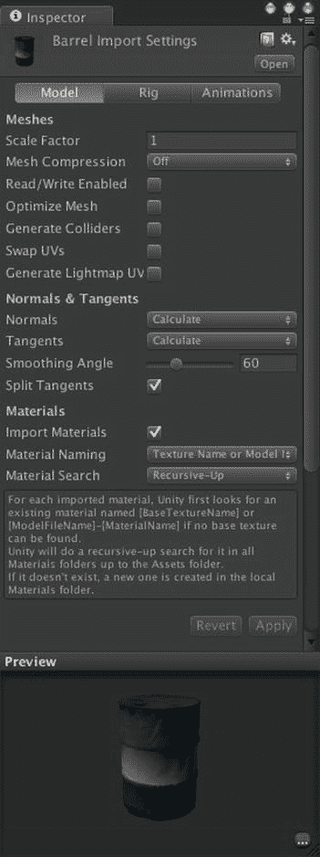

图 16-34

首先是`Mesh Compression`，它通过降低数值精度（即用于表示顶点、法线、纹理坐标和切线的位数）来减少网格占用的空间和内存。这也会降低视觉质量，因此最好进行试验，找到不会影响外观的最大压缩级别。可用的压缩级别有低、中、高和无。默认设置为无。

在`Mesh Compression`下方是`Read/Write Enabled`。该选项默认开启，会创建一份可修改的网格副本。但如果你没有任何读取或写入网格变量（如顶点和法线）的脚本（通常你并不需要），则可以关闭此选项。

`Optimize Mesh`（不要与`Player Settings`中的`Mesh Optimization`选项混淆）通过优化网格三角形列表的排列方式来提升性能。

如果你不打算使用`Mesh Collider`，请关闭`Generate Colliders`。事实上，作为一条规则，最好保持此选项关闭，因为需要时可以手动添加`Mesh Collider`，但通常更倾向于添加一个或多个原始碰撞体。

如果你知道该网格的着色器不需要法线或切线，可以分别将`Normals`和`Tangents`选项设置为`none`。但如果在`Player Settings`中选择了`Mesh Optimization`，未使用的顶点数据会在构建时自动移除。

### 优化脚本

常规的代码优化技巧同样适用于`Unity`脚本。例如，我们之前提到过，应调用`Vector3`的`magnitudeSquared`函数而不是`magnitude`，以避免其内部的平方根运算。但在以下章节中，我将介绍一些不太明显的优化脚本性能的方法，或使用脚本来提升整体性能。

### 缓存`GetComponent`

通常情况下，如果你要多次计算某个值（无论是数学表达式、函数调用的结果，还是访问某个实例或静态变量的值，该变量内部可能实际上在执行函数调用），最好将该值赋给一个变量。

我们在脚本中访问的`Component`快捷变量（如`transform`、`audio`和`rigidbody`）就是这样的例子。每次访问这些变量时，都会调用`GetComponent`，在附加到`GameObject`的所有`Component`中搜索匹配类型的组件。

因此，任何时候你需要在脚本中多次引用一个`Component`快捷变量时，无论是多次列出，还是在`Update`等回调函数中重复引用，尤其是在一个迭代次数很多的循环中引用该变量时，都应该提前将`Component`赋给一个变量。清单 16-6 展示了如何将此优化应用于我们的`FuguReset`脚本。

清单 16-6. 在`FuguReset.js`中缓存`Component`快捷变量

```javascript
#pragma strict

private var startPos:Vector3;
private var startRot:Vector3;

// 为了性能
private var trans:Transform = null;
private var body:Rigidbody = null;

function Awake() {
        // 缓存 Transform 引用
        trans = transform;
        body = rigidbody;
        // 保存此 GameObject 的初始位置和旋转
        startPos = trans.
```


`localPosition`；`startRot = trans.localEulerAngles; }`
```
function ResetPosition() { 
    // 恢复到初始位置
    trans.localPosition = startPos; 
    trans.localEulerAngles = startRot; 
    // 确保停止所有物理运动
    if (body != null) { 
        body.velocity = Vector3.zero; 
        body.angularVelocity = Vector3.zero; 
    } 
}
```

原始版本的 `FuguReset.js` 引用了两个组件快捷变量：`transform` 和 `rigidbody`。因此，我们添加了两个私有变量 `trans` 和 `body` 来引用这些组件，并在 `Awake` 回调中初始化 `trans` 和 `body`。

这种清理方法适用于我们很多脚本，因为我们会经常引用 `transform`、`rigidbody` 和 `audio`。我不会列出所有修改后的代码，但更新后的脚本已包含在 `http://learnunity4.com/` 上本章的项目文件中。

#### UnityGUI

详细的分析结果显示，UnityGUI 占用了我们帧时间的很大一部分。UnityGUI 中一个性能瓶颈是使用 `GUILayout` 自动布局 GUI 元素所带来的开销。我们在记分板中没有使用 `GUILayout`，因此可以在 `FuguBowlScoreboard` 脚本中（清单 16-7）添加一个 `Awake` 回调，将 `useGUILayout` 设置为 false。

清单 16-7。在 `FuguBowlScoreboard.js` 中将 `useGUILayout` 设置为 false

```
function Awake() { 
    useGUILayout = false; 
}
```

暂停菜单仍然使用了 `GUILayout`，但由于菜单只在游戏暂停时出现，不会影响游戏玩法，因此其性能问题不那么重要。

#### 运行时静态批处理（专业版）

动态批处理可以合并那些在构建时因移动或恰好是在游戏运行时创建而不适合静态批处理的相似网格。但动态批处理需要不断更新批处理信息，这就是分析结果中显示批处理时间的原因。如果被批处理的对象是一起移动的，或者它们没有移动但是在运行时实例化的，那么这种重新批处理似乎是一种浪费。此外，由于批处理会占用内存，因此动态批处理的数量有上限（Unity 文档目前说明是 30000 个顶点，但这个数字可能会变化）。

幸运的是，有一个名为 `StaticBatchingUtility` 的类（在 Unity 专业版和 Unity iOS 专业版中可用），它允许你通过调用 `Combine` 函数在运行时执行静态批处理。清单 16-8 展示了一个非常简单的脚本，它只是在脚本的 `GameObject` 上调用了 `StaticBatchingUtility.Combine`。

清单 16-8。用于对对象层次结构进行静态批处理的脚本

```
#pragma strict 

function Start() { 
    StaticBatchingUtility.Combine(gameObject); 
}
```

虽然简单，但这个脚本功能完整。例如，在旋转立方体场景中，如果我们将此脚本拖拽到带有两个子立方体的主旋转立方体上（并禁用了子立方体的单独旋转脚本），那么当场景开始播放时，所有三个立方体将被静态批处理在一起。被批处理的 `GameObjects` 不必处于同一个层次结构中。`StaticBatchingUtility.Combine` 是一个重载函数，另一个版本接受两个参数：一个要批处理在一起的 `GameObjects` 数组，以及一个被指定为父对象的 `GameObject`。

#### 共享材质

要进行批处理——无论是静态、动态还是通过调用 `StaticBatchingUtility.Combine`——被批处理的网格必须共享相同的材质或材质集合。但特别是在动态批处理中，你需要小心，如果修改材质，不要破坏这种共享。

例如，清单 16-9 中的脚本通过不断改变材质的纹理偏移量来动画其纹理。

这会产生一个滚动纹理的效果；在 HyperBowl 中，此脚本用于为滚动霓虹灯招牌、天空中飘移的云朵以及流动的水体制作纹理动画。然而，当脚本通过调用其 `SetTextureOffset` 函数修改材质时，如果原始材质恰好是共享的，则会创建一个新的材质。

清单 16-9。用于动画材质纹理坐标偏移量的脚本

```
#pragma strict 

var speed:Vector2; 
var materialIndex:int=0; 

private var offset:Vector2; 
private var material:Material; 

function Start() { 
    offset=new Vector2(0,0); 
    material = renderer.materials[materialIndex]; 
} 

function Update () { 
    var dtime:float = Time.deltaTime; 
    offset.x=(offset.x+speed.x*dtime)%1.0f; 
    offset.y=(offset.y+speed.y*dtime)%1.0f; 
    material.SetTextureOffset("_MainTex",offset); 
}
```

当然，这是有道理的。如果你使用相同的材质创建了两个 `GameObjects`，并且决定通过修改其中一个的材质来改变其外观，你通常不希望对另一个 `GameObject` 也做同样的修改。

然而，如果你要对所有共享该材质的 `GameObjects` 应用相同的一致的动画，那么就没有理由停止共享该材质。因此，你可以修改脚本，使其访问 `MeshRenderer` 的 `sharedMaterials` 变量，而不是 `materials` 变量。访问 `sharedMaterials`（或者如果假设 `GameObject` 上只有一个材质，则访问 `sharedMaterial`）意味着你真的想要更改共享材质并避免创建新的材质，从而保持批处理的资格。为了处理共享和非共享材质两种情况，我们添加一个公共变量，允许你指定动画是否会破坏材质共享，并用该值来决定是修改 `renderer.materials` 还是 `renderer.sharedMaterials`（清单 16-10）。

清单 16-10。带有共享材质选项的纹理动画脚本

```
#pragma strict 

var speed:Vector2; 
var materialIndex:int=0; 

var shared:boolean = true; 

private var offset:Vector2; 
private var material:Material; 

function Start() { 
    offset=new Vector2(0,0); 
    if (shared) { 
        material = renderer.sharedMaterials[materialIndex]; 
    } else { 
        material = renderer.materials[materialIndex]; 
    } 
} 

function Update () { 
    var dtime:float = Time.deltaTime; 
    offset.x=(offset.x+speed.x*dtime)%1.0f; 
    offset.y=(offset.y+speed.y*dtime)%1.0f; 
    material.SetTextureOffset("_MainTex",offset); 
}
```

此外，在使用此脚本对共享材质进行动画时，还有一个虽然不是那么重要但可用的优化。每个使用相同材质的 `GameObject` 都运行相同的纹理动画脚本是多余的；只需要一个脚本实例就足以驱动所有人的动画。

#### 最小化垃圾回收

在上一章开发 iAd 横幅脚本时，我提到了自动内存管理，指出你必须保持对广告对象的引用以防止它被垃圾回收，并且应该移除引用以允许垃圾回收器回收该对象使用的空间。在最坏的情况下，如果你不断地创建对象且从不允许它们被垃圾回收（假设你将对象添加到一个 `Array` 中但从不移除，因此它们始终被引用），最终你会耗尽内存。

垃圾回收会在游戏中引入明显的停顿。最小化这些停顿的最有效方法是最小化垃圾回收的需求，这可以通过最小化最终被回收器回收的对象数量来实现。


一种技巧是将对象保存在 *`pool`* 中以便重用，而不是让它们被垃圾回收。你也可以通过调用`System.GC.Collect`来显式地调用收集器。例如，你可以在保龄球游戏控制器的`Awake`回调中添加该调用，以确保在游戏开始前进行一次垃圾回收，这将立即清理上一个场景留下的所有未使用对象（清单 16-11）。

清单 16-11. 在`FuguBowl.js`中添加对垃圾回收器的调用

```
function Awake() {
        player = new FuguBowlPlayer();
        CreatePins();
        System.GC.Collect();
}
```

**离线优化**

到目前为止，我们所做的所有更改都是快速优化，你可以立即通过测试运行和分析来查看它们的效果。Unity 还集成了一些商业场景预处理工具，可以极大提升性能：`Beast` 和 `Umbra`。这些工具在本章中不会使用，因为它们的设置和运行可能需要相当长的时间，而且坦率地说，它们对我们简单的场景作用不大。但我将在以下小节中简要介绍它们。

**Beast**

在不产生严重性能损失的情况下添加高质量实时照明是很困难的。每个额外的逐像素光源都会产生更多的绘制调用，阴影代价高昂，且最终的视觉质量不如桌面端，更不用说离线渲染的计算机生成场景了。`Beast` 通过生成光照贴图（一种预计算并“烘焙”到纹理中的照明）解决了这两个问题。当然，一切都是有代价的——除了设置和烘焙时间外，光照贴图场景最终会产生额外的大纹理，占用更多内存，增加应用程序大小，并延长场景加载时间。

要为当前场景生成光照贴图，你首先必须将所有不移动的游戏对象（包括灯光）标记为静态，因为你只能为固定的灯光和表面预计算照明。光照贴图作为第二层纹理叠加在网格上，因此你很可能需要重新导入静态网格，并选中“`Generate Lightmap UVs`”选项以创建第二组纹理坐标。然后，从编辑器菜单栏的“`Window`”菜单中调出“`Lightmapping`”窗口（图 16-35）。

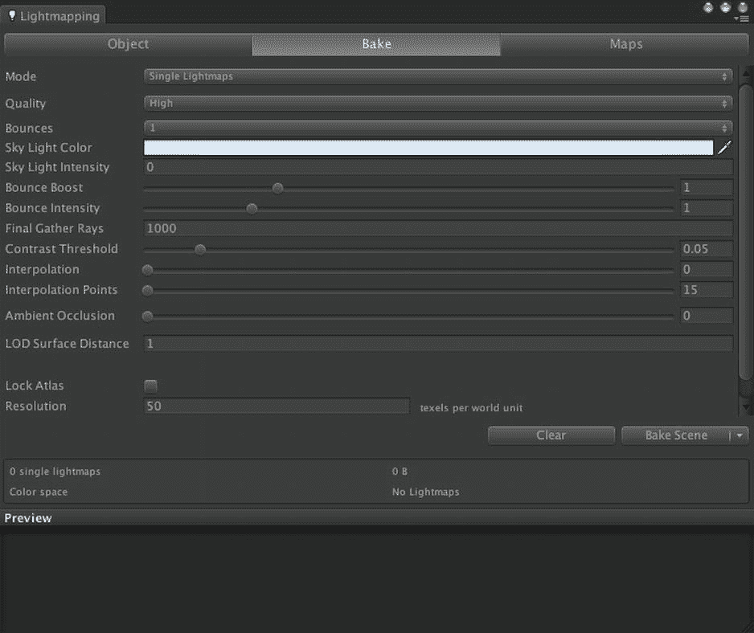

图 16-35. 光照贴图窗口

在该窗口中，你可以在“`Object`”面板中调整每个对象的光照贴图属性，然后切换到“`Bake`”面板以设置光照贴图属性并启动光照贴图烘焙。

请注意，Unity iOS 上不支持双光照贴图，因为该功能需要延迟光照，因此单光照贴图是唯一选项，动态和静态照明将无法很好地混合，尤其是在阴影方面。

**Umbra (Pro)**

我之前提到过，每个摄像机都会执行视锥体剔除，忽略任何位于摄像机视锥体之外的游戏对象。不熟悉实时计算机图形学的人可能会认为被遮挡的对象（即被其他对象挡住视线的对象）也会被剔除，但事实并非如此。视锥体内的所有对象都会被渲染，深度缓冲用于逐像素确定哪个对象在另一个对象的前面。确定一个对象是否位于视锥体之外是一个相对直接的计算，但确定哪些对象被遮挡则需要一些预处理。这正是 Unity 集成 `Umbra` 作为遮挡剔除工具的作用所在。

为场景添加遮挡剔除的过程与光照贴图类似。你需要将不移动的对象标记为静态，然后从 Unity 编辑器菜单栏的“`Window`”菜单中调出“`Occlusion Culling`”窗口（图 16-36）。

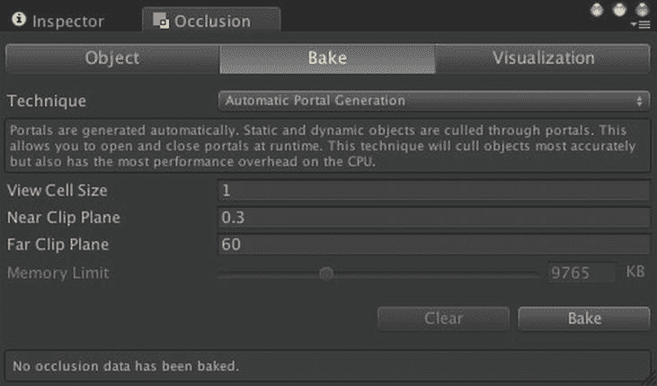

图 16-36. 遮挡剔除窗口

在那里，你可以在“`Object`”选项卡中调整每个对象的遮挡剔除设置，然后在“`Bake`”选项卡中指定遮挡剔除设置并烘焙遮挡剔除数据。

**最终分析结果**

现在你已经完成了对项目的优化，是时候再次分析游戏了（清单 16-12），尽管如果你想有条不紊地进行，应该在每次更改后都运行一次分析以查看其效果。

清单 16-12. 优化后的内置分析结果

```
iPhone Unity internal profiler stats: cpu-player>    min:  5.0   max:  9.7   avg:  6.1 cpu-ogles-drv> min:  3.4   max:  7.4   avg:  4.2 cpu-present>   min:  0.9   max: 10.5   avg:  4.2 cpu-waits-gpu> min:  0.9   max: 10.5   avg:  4.2  msaa-resolve> min:  0.0   max:  0.0   avg:  0.0 frametime>     min: 13.5   max: 22.1   avg: 16.6 draw-call #>   min:  30    max:  30    avg:  30     | batched:    10 tris #>        min:  4592  max:  4592  avg:  4592   | batched:  3420 verts #>       min:  3728  max:  3728  avg:  3728   | batched:  2750 player-detail> physx:  0.0 animation:  0.0 culling  0.0 skinning:  0.0 batching:  2.2 render:  3.4 fixed-update-count: 0 .. 0 mono-scripts>  update:  0.1   fixedUpdate:  0.0 coroutines:  0.0 mono-memory>   used heap: 389120 allocated heap: 524288  max number of collections: 0 collection total duration:  0.0
```

分析结果显示平均帧时长为 16.6 毫秒，刚刚好是 60 fps。目标达成！此分析结果是在第四代 iPod touch（相当于 iPhone 4）上运行的，因此根据你的设备，结果可能会有所不同。

`player-detail` 一行表明帧时长主要由批处理和渲染主导，因此图形是剩余的瓶颈，再在脚本优化上花费更多时间并不明智。如果你认为 30 fps 也不错，那么你处于一个可以添加更多内容和功能的良好状态。

**进一步探索**

在本章开头，我引用了过早优化的风险，即在让程序运行之前就使事情复杂化。但是，你应该从开发之初就牢记性能目标。从简单开始（Unity 文档建议在 iPhone 3GS 上渲染不超过 40000 个顶点），让程序运行起来，优化到满足性能目标，继续添加内容和功能，并在游戏性能低于目标时停下来优化。并且要记住分析并优化瓶颈。优化只占你帧时长 10% 的部分，而忽略占 50% 的部分，是毫无益处的。

**Unity 手册**

在 Unity 手册中，“`Getting Started with iOS Development`”部分有多个关于“`Optimizing Performance in iOS`”的页面，涵盖了为优化构建而调整的“`Player Settings`”、内置分析器的描述以及优化构建大小。

“`Advanced`”部分记录了 Unity Pro 附带的 `Profiler`，以及前面提到的离线优化功能：光照贴图和遮挡剔除。“`Advanced`”部分还包括许多其他与优化相关的页面：“`Optimizing Graphics Performance`”、“`Reducing File Size`”、“`Automatic Memory Management`”（垃圾回收）和“`Shadows`”（特别是“`Shadow Performance`”）。关于“`Asset Bundles`”和“`Loading Resources`”的页面解释了资产如何被下载并按需加载到场景中，这是一种可用于管理安装后应用程序大小的技术。

**参考手册**

参考手册描述了我们优化过的所有组件和资源类型。


# 排版后的内容

在这些组件中，我们调整了`Camera`的视锥体和平截头体可视掩码（visibility mask），也调整了 Light 的剔除掩码和剔除距离，同时禁用了它的阴影；最小化了每个`MeshFilter`的阴影投射和接收者数量，简化了每个`MeshRenderer`的着色器，并将一个`MeshCollider`替换为`BoxCollider`。我们检查了组件引用的各种资源类型的导入设置：`Texture2D`、`AudioClip`和`Mesh`。参考手册也记录了我们自定义的设置管理器，包括`QualitySettings`、`PhysicsManager`、`TimeManager`和`AudioManager`。我们还使用了`GUIText`组件（它是我们用于启动画面的`GUITexture`的同类组件）来显示帧率。

#### 脚本参考

脚本参考中的`Scripting Overview`部分有一个`Performance Optimization`页面，提供了一些关于如何编写更快脚本的技巧。本章学到的一个新函数是`StaticBatchingUtility`类中的静态函数`Combine`（`Combine`是该类中唯一的函数），我们调用它来在运行时批量处理一组游戏对象的层次结构。本章学到的一个新变量是`MonoBehaviour`类中的`useGUILayout`变量，当设置为 true 时，它通过告诉 UnityGUI 系统当前的`OnGUI`回调不会使用`GUILayout`函数执行任何自动布局，从而提升性能。

所有设置管理器都有对应的类，因此可以通过脚本查询和设置其配置。尽管除渲染设置外的所有设置管理器在整个游戏过程中（而非按场景）处于活动状态，但脚本访问允许我们为每个场景调整设置。例如，我们可以为每个场景定义一个质量级别，并为每个场景添加一个脚本来加载相应的质量级别。本章讨论的设置管理器对应的类包括`QualitySettings`、`AudioSettings`、`PhysicsManager`和`Timemanager`。

我们还使用了`Time`类，评估了其`timeScale`和`deltaTime`变量，并设置了`GUIText`的`text`变量，以便进行基本的帧率显示。

#### 资源商店

资源商店列出了一些性能分析系统（搜索`profiler`）和一些对象池系统（搜索`pool`），例如 PoolManager、Smart Pool 和 Pooling Manager。最后一个来自 DFT Games，是免费的。

#### 网络资源

Unity 维基百科位于`http://wiki.unity3d.com/`，其`Tips, Tricks and Tools`部分提供了一些性能技巧，以及几个与性能相关的脚本。特别是，`FramesPerSecond`页面列出了一些比我们在本章创建的更复杂的帧率显示脚本（例如，它们通过一系列帧计算帧率以获得更稳定的显示）。

Umbra 遮挡剔除系统由 Umbra Software 开发，网址为`http://umbrasoftware.com/`。Beast 光照贴图系统是 Autodesk 的产品，产品页面位于`http://gameware.autodesk.com/beast`。

#### 书籍

我已经多次提到《实时渲染》（`http://realtimerendering.com`），但它与本章的图形优化确实非常相关。仅关于 Mipmap 的处理就值得一读。

## 第 17 章：接下来去哪里？

现在，您已经完成了对 Unity 和 Unity iOS 开发的介绍——从下载和安装 Unity，到在 Unity 编辑器中开发一个简单的保龄球游戏，再到让它在 iOS 上运行，最后优化它以获得不错的性能。虽然并未涵盖每一个 Unity 功能或游戏开发主题（这本书可能会变成一套多卷百科全书！），但我将以一章的“进一步探索”作为结尾。

### 更多脚本知识

我们只是浅尝了 Unity 脚本的皮毛，不仅涉及提供的各种脚本语言和广泛的 Unity 类集，还包括可以编写脚本的内容。

#### 编辑器脚本

如果您觉得 Unity 编辑器中缺少某些功能，很有可能可以通过编写编辑器脚本来添加该功能。这些脚本同样使用 JavaScript、C#或 Boo 编写，但它们位于项目视图的 Editor 文件夹中。编辑器脚本通过一组编辑器类（在脚本参考的`Editor Classes`部分有文档说明）可以访问编辑器 GUI、项目设置和项目资源。

例如，让我们在 Unity 编辑器菜单栏上创建一个菜单，其中包含用于激活和停用整个游戏对象层次结构的命令。换句话说，这些命令会调用层次结构中每个游戏对象的`SetActive`，相当于在检视面板中点击每个游戏对象的复选框。

在 Unity 4 之前，每个游戏对象只有一个`active`状态，由检视面板中的活动复选框和游戏对象变量`active`表示。但从 Unity 4 开始，检视面板中的复选框代表游戏对象的**本地活动状态**，可通过脚本调用`SetActive`设置，并从游戏对象变量`activeSelf`读取。而全局或“真正”的活动状态则取决于其所有父对象是否也处于本地活动状态。因此，确保层次结构中的所有游戏对象都处于本地活动状态后，就可以通过切换根游戏对象的活动状态来停用整个组。手动点击所有这些复选框既繁琐又容易出错，因此一个执行此操作的单一命令将非常有用，尤其是对于将项目升级到 Unity 4 的开发者而言。

创建编辑器脚本的过程与创建用于场景的脚本相同，只是编辑器脚本必须放置在 Editor 文件夹中。因此，让我们在项目视图中创建一个新的 JavaScript，命名为`FuguEditor`，并将其放置在 Editor 文件夹中（图 17-1）。

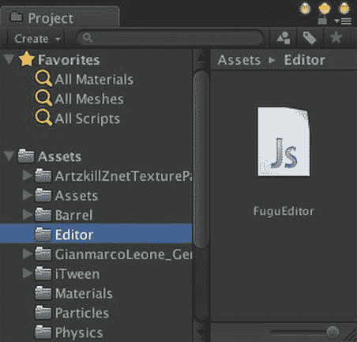

图 17-1. 创建新的编辑器脚本

现在，将清单 17-1 中的代码添加到脚本中。

清单 17-1. FuguEditor.js 的完整代码清单

```
#pragma strict

@MenuItem ("FuguGames/ActivateRecursively")
static function ActivateRecursively() {
        if (Selection.activeGameObject !=null) {
                SetActiveRecursively(Selection.activeGameObject,true);
        }
}

@MenuItem ("FuguGames/DeactivateRecursively")
static function DeactivateRecursively() {
        if (Selection.activeGameObject !=null) {
                SetActiveRecursively(Selection.activeGameObject,false);
        }
}

static function SetActiveRecursively(obj:GameObject,val:boolean) {
        obj.SetActive(val);
        for (var i:int=0; i<obj.transform.GetChildCount(); ++i) {
                SetActiveRecursively(obj.transform.GetChild(i).gameObject,val);
        }
}

@MenuItem ("FuguGames/ActivateRecursively", true)
@MenuItem ("FuguGames/DeactivateRecursively", true)
static function ValidateGameObject() {
        return (Selection.activeGameObject !=null);
}
```

代码行`@MenuItem ("FuguGames/ActivateRecursively")`向编辑器菜单栏的 FuguGames 菜单添加了一个`ActivateRecursively`项，如果菜单尚未创建，则会创建该菜单。`@MenuItem`行后面的函数会在选择该菜单项时被调用。`ActivateRecursively`检查编辑器中是否已选中一个游戏对象，如果选中，则将游戏对象和值`true`传递给函数`SetActiveRecursively`。而`SetActiveRecursively`会为层次结构中的每个游戏对象调用`SetActive`，并传入值 true。

之后，一个类似的代码块向菜单添加了`DeactivateRecursively`项，区别仅在于名称不同，以及在传递给`SetActiveRecursively`时传入 false 而不是 true。


尽管你可以在调用 `SetActiveRecursively` 之前检查某个对象是否被选中，但从用户界面设计的角度来看，更好的做法是在菜单项不会产生任何效果时将其禁用。你可以通过再次列出 `MenuItem` 属性来实现这一点，但这次需要额外添加一个 `true` 参数，该参数表示下一个函数是一个静态函数，只有当菜单项应处于激活状态时才会返回 `true`。`ActivateRecursively` 和 `DeactivateRecursively` 都使用 `ValidateGameObject`（该函数仅检查编辑器中是否选中了某个 `GameObject`）来决定菜单项是应可用还是应置灰。

一旦此脚本编译完成，新菜单应如图 Figure 17-2 所示（可能会有延迟）。

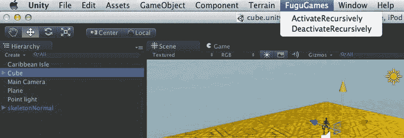

Figure 17-2. 使用编辑器脚本添加到菜单栏的菜单

这个示例只具有极少的用户界面，仅包含一些菜单项，但编辑器脚本可以使用 UnityGUI 函数创建新的窗口和用户界面（实际上，编辑器本身就是用 UnityGUI 实现的，这就是为什么偶尔的编辑器错误会在控制台视图中显示为 UnityGUI 错误）。编辑器脚本还可用于批处理、导入后的资源后期处理，或者构建前的场景预处理。我有一些简单的编辑器脚本，它们可以删除构建文件、显示 `GameObject` 统计信息，甚至调用 macOS 的 `say` 命令，这样我就能和自己对话了。

## C\#

本书中我一直专注于使用 Unity 的 JavaScript 作为脚本语言，因为，嗯，我必须选一个。但说真的，JavaScript 在 Unity 文档中的示例代码确实更多（尽管差距正在缩小），并且对于 JavaScript 和 Flash 开发者来说可能更熟悉。JavaScript 也比 C# 更简洁，至少对于小型脚本来说是这样。只需比较一下在项目视图中通过“创建”菜单生成的空 JavaScript 脚本 (Listing 17-2) 和 C# 脚本 (Listing 17-3) 即可。

Listing 17-2. 新创建的 JavaScript 脚本

```javascript
#pragma strict

function Start () {

}

function Update () {

}
```

Listing 17-3. 新创建的 C# 脚本

```csharp
using UnityEngine;
using System.Collections;

public class NewBehaviourScript : MonoBehaviour {

        // Use this for initialization
        void Start () {

        }

        // Update is called once per frame
        void Update () {

        }
}
```

在 C# 脚本中，类声明是显式的，你必须确保类名与脚本名匹配。在 C# 脚本顶部，显式导入了 Unity 脚本中常用的两个命名空间：`UnityEngine` 和 `System.Collections`——而在 JavaScript 中，它们是隐式导入的。

很多 JavaScript 代码只需少量修改即可在 C# 中运行，但二者存在一些语法差异：变量声明以 `<type> <name>` 开头，而不是 `var <name>:<type>`。函数的定义方式相同，但以返回类型和名称开头，而不是以 `function` 开头。没有必要在 C# 文件中添加 `#pragma strict`，因为 C# 本身就是强类型语言。

对于小型脚本来说，JavaScript 更为便捷，但对于大规模的 Unity 开发而言，C# 可以说是更实用的选择，因为它是一种文档更完善的语言，并作为最流行的 Mono 或 .NET 语言经过了工业级的测试。此外，许多 Unity 扩展包都是用 C# 编写的（其中包括 Prime31 插件、EZGUI 和 NGUI），而在 Unity 中混用 JavaScript 和 C# 会很不方便；如果你的 JavaScript 代码引用了 C# 脚本，这些脚本必须放在 Plugins 或 Standard Assets 文件夹中，以便它们更早地加载。

使用 C# 的另一个原因是 Unity 4 中对 C# 增加了命名空间支持。这一特性使你可以省去为类名添加前缀以避免冲突的做法。例如，Listing 17-4 展示了 `FuguFrameRate` 脚本的 C# 版本，其中类是在命名空间声明中定义的。

Listing 17-4. `FuguFrameRate` 脚本的 C# 版本

```csharp
using UnityEngine;
using System.Collections;

namespace Fugu {

   sealed public class FrameRate : MonoBehaviour {

        public int frameRate = 60;

        void Awake () {
               Application.targetFrameRate = frameRate;
        }

   }

} // 结束命名空间
```

由于该类位于命名空间 `Fugu` 内部，你可以安全地将该类简称为 `FrameRate`，并将脚本命名为 `FrameRate` 以匹配。如果你需要从另一个脚本中引用此类，则必须使用完全限定名 `Fugu.FrameRate`，除非你在脚本顶部添加了 `using Fugu;` 语句。C# 允许你选择性地在类定义前加上 `sealed`，这表示该类不打算被继承。如果你试图定义 `FrameRate` 的子类，将会产生编译器错误。Java 程序员会识别出这与 Java 中的 `final` 声明相同。

在 C# 中，协程必须显式地返回 `IEnumerator` 类型（该类型位于 `System.Collections` 命名空间中，这也是始终导入该命名空间很方便的原因）。尽管 Unity 会在新创建的 C# 脚本中自动添加一个返回 `void` 的 `Start` 回调，但可以通过将返回类型从 `void` 改为 `IEnumerator`，将这个 `Start` 回调变成一个协程。但改变回调的返回类型似乎有点奇怪，因此我更喜欢将协程移出 `Start` 回调，并使用 `StartCoroutine` 来调用协程，就像我在 `FuguAdBanner` 脚本的 C# 版本中所做的那样 (Listing 17-5)。

`StartCoroutine` 可以从任何回调中调用，因此这种技术的优势在于提供了一种统一的调用协程的方式，使得无需直接使用回调作为协程（也无需记住哪些回调可以用作协程）。这种实践在 JavaScript 中同样适用。

Listing 17-5. `FuguAdBanner` 脚本的 C# 版本

```csharp
using UnityEngine;
using System.Collections;

namespace Fugu {
public class AdBanner : MonoBehaviour {

        public bool showOnTop = true;
        public bool dontDestroy = true;

        private ADBannerView banner = null;

        void Start() {
               StartCoroutine (StartBanner());
        }

        private IEnumerator StartBanner () {
               if (dontDestroy) {
                       GameObject.DontDestroyOnLoad(gameObject);
               }
               banner = new ADBannerView();
               banner.autoSize = true;
               banner.autoPosition = showOnTop ? ADPosition.Top : ADPosition.Bottom;
               while (!banner.loaded && banner.error == null) {
                       yield return null;
               }
               if (banner.error == null) {
                       banner.Show();
               } else {
                       banner = null;
               }
        }
}
} // 结束命名空间
```

你也不能像在 JavaScript 中那样在协程内直接调用 `yield`。在 C# 中，你需要调用 `yield return null` 来实现与一帧等效的暂停。

另一个区别是匿名函数的语法。在我们的 `FuguGameCenter` 脚本中，我以 `function(success:boolean) {...}` 的形式传递了未命名的成功或失败函数，但在 C# 中，匿名函数被称为 *lambda 函数*（这一术语源自 Lisp 语言，它使用 `(lambda (success) ...)`），并以 `(bool success) => {` 的形式指定。


[内容]
清单 17-6 展示了`FuguGameCenter`脚本的 C#版本。

**清单 17-6. `FuguGameCenter`的 C#版本**

```
using UnityEngine;
using System.Collections;

using UnityEngine.SocialPlatforms.GameCenter;

namespace Fugu {
         
   sealed public class GameCenter : MonoBehaviour {

        public bool showAchievementBanners = true;

        // 初始化时使用
        void Start () {
#if UNITY_IPHONE
        Social.localUser.Authenticate ( (bool success) => {
        if (success && showAchievementBanners) {
                GameCenterPlatform.ShowDefaultAchievementCompletionBanner(showAchievementBanners);
                        Debug.Log ("认证成功 "+Social.localUser.userName);
        }
                else {
                        Debug.Log ("认证失败 "+Social.localUser.userName);
                }
        }
    );
#endif
        }
                
        
        static public void Achievement(string name,double score) {
#if UNITY_IPHONE
        if (Social.localUser.authenticated) {
                Social.ReportProgress(name,score, (bool success) => {
                        if (success) {
                                Debug.Log("成就 "+name+" 报告成功");
                        }  else {
                                Debug.Log("报告成就失败 "+name);
                        }
                } );
        }
#endif
}

        static public void Score(string name,long score) {
#if UNITY_IPHONE
        if (Social.localUser.authenticated) {
                 Social.ReportScore (score, name, (bool success) => {
                        if (success) {
                                Debug.Log("在排行榜 "+name+" 上发布了 "+score);
                        }  else {
                                Debug.Log("在排行榜 "+name+" 上发布 "+score+" 失败");
                        }
                } );
        }
#endif
}
        
   }
}
```

最后，你可能最怀念 JavaScript 的一点是，可以轻松修改 Transform 组件中的`Vector3`值。清单 17-7 展示了一行简单的 JavaScript 代码，用于修改 Transform 组件位置中的`x`分量。

**清单 17-7. 在 JavaScript 中修改 Transform 的`Vector3`**

```
function Start () {
        transform.position.x=0;
}
```

这行代码在 C#中会产生编译器错误（图 17-3），因为`Vector3`是一个结构体（struct），而不是类（class），因此是值类型，而非引用类型。它在 JavaScript 中能正常运行是一种便利（尽管会带来误导，因为它会让`Vector3`看起来像一个类，而不是结构体）。

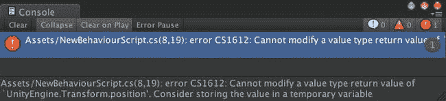

**图 17-3. 在 C#中修改 Transform 的`Vector3`时出现的错误信息**

由于`Vector3`是结构体，你不必担心垃圾回收器需要清理大量未使用的`Vector3`实例，因为实际上并不存在这些实例。但这意味着在 C#中，如果你想修改 Transform 组件的位置，就必须创建一个新的`Vector3`，如清单 17-8 所示。

**清单 17-8. 在 C#中修改 Transform 的有效方法**

```
void Start () {
        transform.position = new Vector3(0,transform.position.y,transform.position.z);
}
```

注意，在 C#中，你必须在`Vector3`构造函数前指定`new`，而在 JavaScript 中则是可选的。这是 JavaScript 的一个小便利（这类便利通常被称为*语法糖*），但 C#的优势在于允许你以类似于定义类的方式来定义自己的结构体。在 JavaScript 中，你可以使用结构体，但无法定义新的结构体。

Andrew Stellman 和 Jennifer Greene 的《Head First C#》（O'Reilly）是一本很好的 C#入门书籍，但有经验的程序员可以通过《C# in a Nutshell》系列（同样由 O'Reilly 出版）快速上手 C#。特别是 Java 程序员会发现 C#很熟悉（尽管名称如此，C#与 C 或 C++并无关联，除非算上远亲关系）。

### 脚本执行顺序

在结束脚本主题之前，还有一个问题值得提及：指定脚本之间的执行顺序。如果你查看保龄球游戏中用于控制主摄像头的`SmoothFollow`脚本，会发现摄像头位置不是在`Update`回调中更新，而是在`LateUpdate`回调中更新。`LateUpdate`与`Update`一样在每一帧被调用，但一帧中所有的`LateUpdate`调用都在所有`Update`调用完成后进行。`SmoothFollow`在`LateUpdate`中计算摄像头位置，以便考虑其目标在`Update`回调中发生的任何位置变化。

在游戏引擎中同时使用`Update`和`LateUpdate`回调是一种常见技术，但它的作用有限。如果你希望一个游戏对象在另一个游戏对象的`LateUpdate`之后更新怎么办？抱歉，没有`LateLateUpdate`回调！但 Unity 确实有一个更通用的解决方案，即**脚本执行顺序设置**，可以通过“编辑”菜单的“项目设置”子菜单打开（图 17-4）。

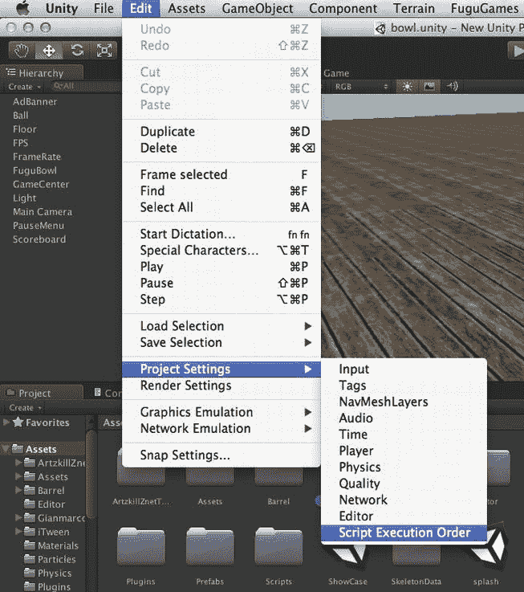

**图 17-4. 打开脚本执行顺序设置**

脚本执行顺序设置也可以通过在选择脚本时，单击检查器视图中显示的“执行顺序”按钮来打开。无论哪种方式，脚本执行顺序设置都会在检查器视图中显示为一个 MonoManager（图 17-5），其列表中最初仅包含一项“默认时间”。

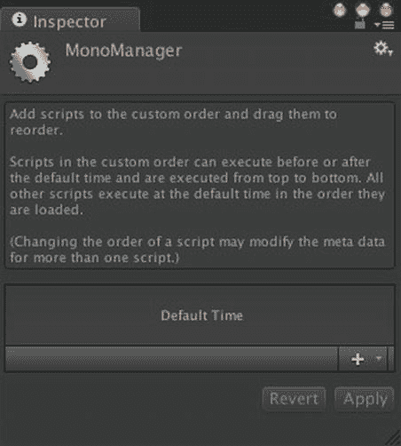

**图 17-5. 检查器视图中的脚本执行顺序设置**

由于`SmoothFollow`使用了`LateUpdate`，你无需进行任何更改，但假设你想确保`SmoothFollow`脚本在所有其他脚本之后运行其`Update`回调。你需要点击脚本执行顺序设置右下角的加号（`+`）按钮，并从弹出的菜单中选择`SmoothFollow`脚本。默认情况下，`SmoothFollow`脚本会出现在脚本执行顺序设置中“默认时间”的下方，这意味着`SmoothFollow`将在所有其他脚本之后运行。

然后，你可能决定让游戏控制器脚本`FuguBowl`在除`SmoothFollow`之外的所有其他脚本之后运行（例如，因为它会持续检查保龄球的位置）。那么，再次点击`+`按钮添加`FuguBowl`脚本，然后使用左侧的拖动手柄，将`FuguBowl`拖动到`SmoothFollow`上方但位于“默认时间”下方，最终列表如图 17-6 所示。任何拖动到“默认时间”上方的脚本都会在所有其他脚本之前执行。

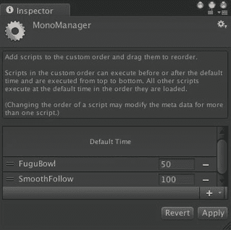

**图 17-6. 指定`FuguBowl.js`和`SmoothFollow.js`的执行顺序**

点击脚本右侧的减号（`-`）按钮，可以将该脚本从脚本执行顺序设置中移除。

### 插件

前面多次提到第三方插件，有些可在资源商店中找到，还有许多来自 Prime31 Studios。但如果你恰好熟悉 C、C++或 Objective-C，你可以编写自己的插件，无论是为了访问更多设备功能，还是为了利用用 C、C++或 Objective-C 编写的库。除了包含原生库外，插件还需要额外的 Unity 包装脚本。
[/内容]


# 该过程记录在 Unity 手册的“高级”部分中的“插件”页面上。

### 跟踪应用

尽管 iTunes Connect 提供了下载和销售数据（而且图表比曾经唯一的 `.csv` 报告更容易阅读），但仍有几个第三方产品可以跟踪应用销售情况以及其他数据，如应用排名和评论。

`App Annie`（`http://appannie.com/`）和 `AppFigures`（`http://appfigures.com/`）是两款较流行的基于网络的产品，它们都能在账户设置时你提供 iTunes Connect 登录信息后，自动每日从 iTunes Connect 下载应用数据。两者都提供漂亮的销售数据图表展示，并发送每日应用统计摘要邮件。`App Annie` 目前免费（技术上处于测试阶段），而 `AppFigures` 则收取费用。

图 17-7 显示了 `App Annie` 一个月内 Fugu Bowl 下载量的图表。更新下载量叠加在销售下载量之上。更新线会出现峰值，与 FuguBowl 的更新发布相对应。

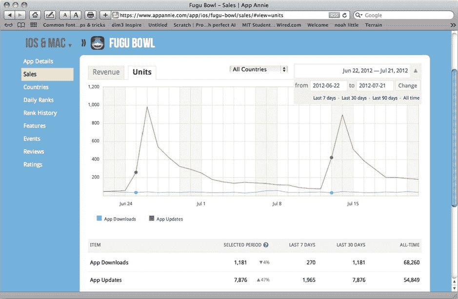

图 17-7。`App Annie` 销售图表

`AppViz`（`http://appviz.com/`）是一款 OS X 应用程序，它实现相同的功能，但会将数据下载到你的 Mac 上，并提供多种图表，包括按地域划分的销售额（图 17-8）。`AppViz` 并非免费，但价格不高，我认为它物有所值。

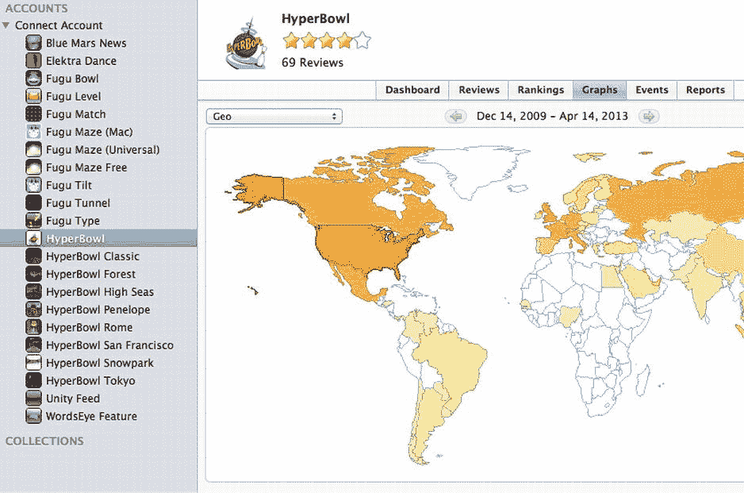

图 17-8。`AppViz` 地域视图

你无需拘泥于只使用这些产品中的一种。我使用 `AppViz` 来确保本地保存了所有应用销售数据，并且我喜欢它多样的图表和 App Store 评论下载功能。我使用 `AppAnnie` 是因为它能自动发送包含每日销售数据、排名显示（在 `AppViz` 中下载所有排名数据需要很长时间）的电子邮件报告，而且 `App Annie` 支持一些 Android 应用商店。此外，它还是免费的！

**提示** 从 `AppViz`，你可以导出所有已下载的数据，然后将这些数据导入到其他产品中，比如 `App Annie`。由于苹果只在 iTunes Connect 上提供一年的应用销售数据，这是确保你始终可以将应用完整销售历史导入到销售跟踪产品中的一种方法。

### 促销代码

我已经描述了如何在应用在 App Store 获批后下载促销代码，但我没有解释如何使用它们。其实有很多选择。几乎每个应用评测网站都会接受促销代码与评测请求。`Touch Arcade`（`http://toucharcade.com/`）就是这样一个网站，但它也有一个非常活跃的论坛，供开发者发放促销代码。而 `AppGiveaway`（`http://appgiveaway.com/`）会开展促销活动，在设定时间段内发放促销代码。这比自己亲手发放要方便得多，尽管你也应该自己发放。保存促销代码清单也是推动应用更新的一个充分理由，因为每次更新你都能获得 50 个全新的代码。

### 更多变现方式

考虑到每年需要支付苹果开发者费用和 Unity 许可证费用（如果你决定使用 Pro 许可证），你很可能希望至少能赚回这笔钱。除了 iAd 和第三方移动广告服务外，还有其他变现策略。

#### 应用内购买

除了应用销售和 iAd 之外，苹果还为 iOS 提供了另一条收入渠道：一个名为 `Storekit` 的应用内购买（IAP）系统。Unity iOS 没有为 IAP 提供脚本接口，但 Prime31 Studios 在其产品中提供了一个 `Storekit` 插件。

Unity 手册提供了一些关于如何下载和激活通过 IAP 购买的额外内容的提示，而 iTunes Connect 文档则解释了如何设置应用内购买。

#### 资源商店

我在我的应用中使用了几十个免费和付费的资源商店包，你肯定会发现资源商店对你的项目很有用。但资源商店也是另一个自助发布产品和创收的地方（Unity 会抽取 30% 的佣金，和苹果在 App Store 上一样）。你也可以在资源商店上免费发布资源包，以获得认可或作为对社区的贡献（在本书的例子中，我当然也利用了这种慷慨）。

方便的是，资源商店的提交是在 Unity 编辑器内，使用从资源商店（名称很贴切）下载的“资源商店工具”完成的。你可以提交项目中任何资源的集合——音频、纹理、模型、脚本、插件，甚至整个项目本身。

**提示** 使用预处理器指令确保在切换构建目标时不会出现编译器错误，如果你使用了 Unity Pro 功能，请添加一个自定义的 `UNITY_PRO` 预处理器指令，这样 Unity Basic 用户就不会出现问题。

与向 App Store 提交类似，向资源商店提交的大部分工作涉及创建截图、图标、应用描述和商店艺术作品。关于如何成为资源商店卖家的说明，请访问 `http://unity3d.com/asset-store`。

### 为 Android 开发

Unity Android 需要额外的许可证，其 Indie 和 Pro 结构与 Unity iOS 相同。好消息是，本书中几乎所有为 Unity iOS 开发的内容都可以很好地用于 Unity Android。不出所料，`iPhone` 类中的任何内容在 Android 上也不可用（例如，我们用来检查设备类型的变量 `iPhone.generation`），但 `Input` 类中适用于 iOS 的所有内容在 Android 上的工作方式也相同，包括触摸屏和加速度计功能。

`Game Center` 和 iAd 是苹果的技术，因此这些功能在 Android 上不可用，但未来 `Social`、`ADBanner` 和 `ADInterstialAd` 类可能会在 Android 上支持等效的功能。Prime31 Studio 和其他供应商提供了 Unity Android 插件，以提供对设备功能和移动服务的更多访问，例如 `AdMob` 移动广告服务。

Android 的构建和提交流程也有所不同。Android 不需要 Xcode，而是需要安装 Android SDK。你仍然可以从 Unity 编辑器调用“构建并运行”，但 Unity Android 不是为应用构建 Xcode 项目，而是直接构建可执行的应用（一个 `APK` 文件）。与 iOS 开发不同，Android 开发可以针对多个应用商店。特别是 Google Play，它没有审批流程，因此是快速自助发布的好途径，也是被苹果拒绝的应用的一个有用后备渠道。

### 合同工作

在开发下一个热门应用的同时，独立开发者通常会通过接合同工作来支付日常开销。潜在客户可以在 Unity 论坛的“付费工作”主题、`http://unity3dwork.com/` 甚至像 `http://odesk.com/` 这样的通用承包商网站上找到。一些市场专门从事移动应用开发，例如 `http://apptank.com/` 和 `http://theymakeapps.com/`。

如果你正在寻找全职游戏开发工作，无论是否涉及 Unity，使用 Unity 开发游戏的经验，更不用说拥有自助发布游戏的 portfolios，都会对你有所帮助。

### 结语

现在我已经写到了最后，希望你已经准备好并兴奋地开始制作你自己的 Unity iOS 应用。如果说我希望你能从本书中学到一点，那就是你可以从简单的东西开始，并不断在上面构建，直到它变得有趣。不要成为那种想把一个大型多人在线（MMO）游戏作为第一个项目的人！


请记得持续学习并参与 Unity 社区，在 Unity 论坛和 Unity 问答网站上贡献与求助，同时别忘了查阅 Unity 维基。向社区推广你的作品是没问题的（Unity 论坛中有“展示”版块），也可以请他人帮忙宣传，但切记要礼尚往来！

在我用 Unity iOS 开发自己项目的过程中，意外结识了一群开发者。我们能够互相安慰、庆祝并分享宝贵的技巧。我不打算一一列举他们的名字，但你可以在我推特关注列表中找到他们：`@fugugames`。顺便说一句，Twitter 是与 Unity 开发者进行更私人层面交流的另一个好途径。我也通过 Twitter 与许多客户沟通，并且成功为我的游戏设置了 Facebook 产品页面（尤其是 `HyperBowl`）。虽然应用客户有时以毒舌著称，但我发现他们大多数人都很支持并同情我们独立开发者，而且如果我们允许他们参与，他们也会很热情地成为这个过程的一部分。事实上，我从中受益良多：得到了大量免费的 QA 测试和一些本地化（翻译）帮助，更不用说许多反馈了。所以，快设置好你的 Twitter 和 Facebook 粉丝专页，开始交流吧！

最重要的是，享受乐趣。其他任何回报都是额外的奖励！

### 索引

`` A

- 高级物理
    - 桶，碗形
        - 在资源商店上
        - `BarrelPin` 预设体
        - Box (盒子)
        - `BoxCollider` (盒碰撞器)
        - `CapsuleCollider` (胶囊碰撞器)
        - 组件复制
        - 复合碰撞器
        - 子`GameObjects`
        - `HyperBowl`
        - 粘贴组件
        - 选择一种
        - 预设体
        - 项目视图
        - 刚体和 `FuguReset` 脚本
        - 更新预设体
    - 球道加长
    - 球瓶
        - 分配预设体
        - `awake` 函数
        - 配合保龄球使用
        - 胶囊体创建
        - 碰撞
        - 编译器错误
        - 游戏控制器
        - `GameObject` 创建
        - `Instantiate` 函数
        - 命名空间
        - 球瓶实例化代码
        - 预设体
        - 刚体，碗形
    - 游戏过程
        - `BroadcastMessage` 函数
        - `FuguReset` 脚本
        - 落沟球
        - 清单
        - `ResetPosition` 消息传递
        - 可重置
        - `SendMessage` 函数
    - 资源
        - 资源包
        - 脚本参考
    - 添加声音
        - `AudioClip`
        - `AudioSource`
        - 获取声音
        - `OnCollision` 回调
        - 球瓶碰撞
        - 滚动声
- 动画
    - `AnimationClip` 循环
    - `AudioClips`
        - Gianmarco Leone 通用音乐集
        - 检查器视图
        - 音乐集
        - 在场景中
    - 舞池
        - 层级视图
        - 平面位置
        - 场景视图
    - 跳舞骷髅
        - 资源商店
        - `AudioClip`
        - 计算机图形学
        - 参考
        - 实用工具
    - 隐藏立方体
    - `MouseOrbit` 脚本
    - 阴影
        - 方向光
        - 贴图
        - 点光源
        - `QualitySettings`
        - 旋转方向光
        - 骷髅，游戏视图
        - 软阴影
    - 骷髅舞蹈
    - `SkeletonNormal`
    - `Skeletons Pack` 骷髅包
        - 舞池
        - 检查器视图
        - 粒子效果
        - 项目视图搜索结果
        - 蒙皮
        - 剑与盾
- `` B
- 横幅广告和插页广告。*参见* iAd
- 保龄球
    - 球体控制
    - 碰撞器组件
        - `MeshCollider` (网格碰撞器)
        - `PhysicMaterial` (物理材质) (*参见* `PhysicMaterials`)
    - `HyperBowl`
        - 球体控制器脚本
        - `FixedUpdate` 回调
        - `FuguForce` 脚本
        - `OnCollisionEnter` 回调
        - 脚本创建
        - 速度检查
        - `TagManager`
        - `update` 回调
    - `Rigidbody` 组件
        - [碰撞检测属性](#9781430248750_Ch06.xhtml#cXXX.


### 索引

#### C

- C# 脚本
    - 类声明
    - 错误消息
    - FuguAdBanner
    - FuguFrameRate
    - FuguGameCenter
    - 新脚本
    - 有效修改
    - 向量变换
- Constraints 属性
- Cube 游戏对象
    - 与视图对齐
    - 结构分析
    - BoxCollider 组件
    - 画面构图
    - 创建
    - MeshFilter 组件
    - MeshRenderer 组件
    - 移动
    - Transform 组件

#### D, E

- 设备输入
    - 加速度计
        - 调试
        - 检视面板，摇动暂停
        - 日志输出，记录
        - 打印输出数值
        - 摇动检测
    - 摄像头
        - 资源商店
        - 游戏对象
        - iCade 附加功能
        - iOS 开发者库
        - Prime31 Etcetra 插件照片
        - 脚本参考
        - WebCam
        - WebCamTexture
    - 触摸屏
        - 调整变量
        - 球体滑动
        - 球体点击
        - 控制调整
        - FuguDebugOnMouse
        - FuguOnTap
        - 输入
        - OnMouseDown
        - 射线投射
        - 滑动检测
        - TouchPhase.Began
- DUNS（数据通用编号系统）

#### F

- 视野 (FOV)
- FuguAdBanner.js
- FuguBowl
    - 清空函数
    - 继承
    - 玩家
    - 分数
    - 结构体定义
- FuguBowlPlayer 的创建

#### G

- 游戏对象
    - 通过脚本移动（*见* 脚本）
- 游戏脚本
    - 资源商店
    - FungBowlPlayer
    - 逻辑
        - 控制台视图，状态机
        - 有限状态机设计
        - 代码清单
        - 状态机，保龄球
        - 状态机初始化
        - 状态（*见* 状态协程）
        - 追踪
        - yield 函数
    - 球瓶状态
        - awake 回调
        - 桶形球瓶
        - FuguPinStatus
        - GetPinsDown 函数
        - pinBodies 变量
        - RemovePins 函数
        - ResetPins 函数
    - 参考
    - 规则
    - 分数
        - 清空函数
        - clearScore 函数
        - 构造函数
        - 轮次
        - FungBowlPlayer
        - FungBowlScore
        - GetScore 函数
        - HyperBowl 记分板
        - 代码清单
        - MonoBehavior
        - 玩家分数
        - 递归函数
        - SetBallScore
        - SetSpareScore
        - SetStrike 函数
        - 设置
    - 网上商店
    - 工具手册
- 图形用户界面 (GUI)，游戏
    - 资源商店
    - 音频面板
    - 致谢页面
    - 图形面板
    - 主页面
        - 显示
        - 菜单
    - 选项页面
    - 暂停菜单
        - 当前页面
        - 显示，菜单
        - 除零错误
        - 枚举
        - 退出键
- 重力属性

#### I

- 检视面板
- 插值属性
- 运动学属性

## P

- PhysicsManager

#### S

- SmoothFollow 脚本
- 球体
    - 检视面板
    - MeshFilter 组件


### 索引

#### G
- `GUILayout functions`
- `layout`, automatic
- `OnGUI callback`
- `PauseGame function`
- 脚本创建
- 状态图
- `Time.DeltaTime`
- 取消暂停
- 参考手册
- 记分板
  - 保龄球
  - `FuguBowlScoreboard`
  - `GUIStyle`
  - 脚本编写
  - 样式设计
  - UnityGUI 代码
- 脚本参考
- 系统面板
  - 颜色自定义
  - `GUISkin`，暂停菜单
  - 在暂停菜单中
  - Necromancer GUI
  - 脚本
  - 选择，颜色
  - 皮肤自定义
- 工具手册

#### H
- 高动态范围（HDR）

#### I
- iAd
  - 资源商店
  - 横幅广告
    - 附加，脚本
    - `FuguAdBanner`
    - 垃圾回收（GC）
    - 列表
    - 脚本创建
    - 脚本测试
    - 变量
  - 插屏广告
    - 附加脚本
    - `iPhoneGeneration`
    - 列表
    - 脚本测试
  - iOS 开发者库
  - iTunes Connect
    - 应用信息
    - 合同签署
    - 启用 iAd
  - 脚本
  - 追踪广告收入
- iOS 开发者计划
  - App Store 图形
    - 应用图标
    - 屏幕截图
  - 构建并运行
  - iTunes Connect（*参见* iTunes Connect）
  - Provisioning Portal
    - 应用标识符
    - 开发配置文件
    - 设备测试
    - 分发配置文件
    - 文档
  - 注册
  - Xcode Organizer
    - iOS Team Provisioning Profile
    - La Petite Baguette Distribution
    - 配置描述文件
    - techdev
    - techdist
- iOS Team Provisioning Profile
- iTunes Connect
  - 添加/管理应用
    - 应用信息
    - 应用类型
    - 上架与定价
    - 图标和屏幕截图，上传
    - 元数据部分
    - 推广码
    - 评级部分
    - 被拒流程
    - 销售追踪
    - 提交流程
    - 更新
    - 上传准备
    - 版本、类别和版权信息
- iTween
  - Inspector 视图
  - 在资源商店中
  - Project 视图

#### J, K
- 即时（JIT）编译器

#### L
- La Petite Baguette Distribution
- 排行榜与成就
  - 资源商店
  - 在 iTunes Connect 上设置中心
    - 成就设置
    - 启用
    - 添加语言
    - 排行榜
    - 本地化
    - 单个排行榜
  - Game Center 集成
    - 附加脚本
    - `Debug.Log`
    - 初始化
    - 提交分数
    - 脚本编写
    - 提交
  - 游戏集成
    - 分数提交
    - 提交成就
  - iOS 开发者库
  - 脚本编写
  - 测试，游戏
    - Game Center
    - 暂停菜单
    - 结果
    - 沙盒版本
    - `Social.ShowAchievementsUI`

#### M, N
- 主摄像机
  - 解析
  - `AudioListener` 组件
  - 组件
    - Clear Flags 属性


### 索引

#### C
- 剔除遮罩
- 深度
- 高动态范围（HDR）
- 透视投影
- 渲染路径
- 纹理
- 视口
- FlareLayer 组件
- GUILayer 组件
- 多摄像机
- Transform 组件
- MouseOrbit 脚本
  - 摄像机游戏对象
  - 导入包
  - 检视面板
  - 标准资源脚本

#### O
- 优化
  - 资源
    - 音频
    - 碰撞音效
    - 网格压缩
    - GUI 纹理
    - 导入设置
    - 网格
    - Mipmap 贴图
    - 纹理
  - 资源商店
  - 游戏对象
    - 球
    - BArrelPin 预制件
    - 摄像机
    - 地板
    - 视锥体裁剪
    - 灯光
    - 主摄像机
    - 球瓶 (pins)
    - 着色器设置
  - 离线处理
    - Beast 烘焙器
    - Lightmapping 窗口
    - 遮挡剔除
    - Umbra（专业版）
  - 性能分析
    - 自动连接分析器
    - 构建日志
    - 内置分析
    - 内置分析器
    - 控制台应用搜索文件夹
    - 分析器的 CPU 使用率
    - 帧率显示
    - 编辑器分析器（专业版）
    - 第四代 iPod Touch
    - FPS 游戏对象
    - 帧时间
    - FuguFPS
    - 游戏视图统计信息
    - GUIText 游戏对象
    - GUI 纹理
    - 手动连接
    - 分析器
    - 禁用阴影
  - 参考手册
  - 脚本参考
  - 脚本
    - 缓存 GetComponent
    - 最小化垃圾回收
    - 运行时静态批处理（专业版）
    - 共享材质
    - System.GC.Collect
    - 纹理动画
    - UnityGUI
  - 设置
    - 加速度计频率
    - 音频管理器
    - 动态批处理
    - 网格数据
    - 多重采样抗锯齿
    - 物理管理器
    - 玩家设置
    - 质量设置
    - 分辨率和显示
    - 脚本调用优化
    - 静态批处理（专业版）
    - 剥离级别（专业版）
    - 时间管理器
  - 目标选择
    - 帧率
    - 脚本挂载
    - 脚本创建
    - 空间瞄准
  - Unity 手册
  - 在网页上

#### P, Q
- 物理材质
  - 调整后的值
  - 结构剖析
  - 弹力材质 vs. 冰面材质
  - 创建
  - 材质字段中的应用
  - 项目视图
  - 标准资源
- 物理与控制
  - 保龄球 (见 保龄球)
  - 保龄球场景
    - 资源组织系统
    - 删除游戏对象
    - 重新铺装地板
    - 检视面板
    - 灯光调整
    - 主摄像机
    - 点光源
    - 场景另存为
    - Substance 资源包
    - 木地板程序化材质
- 点光源游戏对象
  - 调整
  - 颜色属性
  - Cookie 纹理
  - 创建
  - 剔除遮罩属性
  - 绘制光晕属性
  - 耀斑属性
  - 光晕属性
  - 检视面板
  - 强度
  - 灯光，结构剖析
  - 光照贴图属性


#### R

- 范围属性
- 渲染模式
- 阴影类型属性
- 类型

#### S

- 刚体模拟

# S（续）

- 屏幕与图标
    - 活动指示器显示
        - `PlayerSettings`
    - 资源商店
    - GUI 缩放
        - `BeginPage` 函数
        - 高分辨率屏幕
        - 暂停菜单
        - 退出按钮
        - 记分板
        - `ScreenWidth`
        - 变换矩阵
    - iOS 保龄球游戏
        - FuguBowl 玩家设置
        - 方向，自动旋转
    - iOS 开发者库
    - 参考手册
    - 脚本，活动指示器
        - 第二屏幕
        - 启动与停止
    - 脚本参考
    - 设置
        - 默认图标
        - 导入，纹理
        - 预渲染图标
        - 项目视图
        - 播放器中尺寸设置
    - 启动画面（专业版）
        - `ApplicationLoadLevel`
        - 构建设置
        - 创建
        - 默认工具
        - FuguSplash 脚本
        - `GUITexture`
        - 加载场景
        - 方向
        - 场景创建
        - 屏幕分辨率
        - 第二屏幕
        - 等待与加载
        - 实现 `WaitForSeconds`
    - 纹理

# 脚本

- 调试
    - 编译错误
    - 使用 MonoDevelop
    - 运行时错误
- 文件夹创建
    - 结构解析
    - 附加，FuguRotate 脚本
    - 回调函数
    - 执行
    - 检视面板
    - 方法
    - MonoDevelop 编辑器
    - 命名
    - 脚本参考
- 组织资源
- 预设体
    - 将更改应用至预设体
    - 断开预设体实例
    - 子立方体，编辑
    - 克隆游戏对象
    - 项目视图
- 旋转立方体
    - 变换组件
    - `Transform.Rotate`
    - 补间旋转
    - 在世界空间中
- 脚本参考

# Smultron

# 状态协程

- HyperBowl，洗沟球
- `ResetCamera` 与 `ResetBall` 函数
- SmoothFollow 脚本
- `StartGameOver`
- `StateBall1`
- `StateBall2`
- `StateBall3`
- `StateGutterBall`
- `StateNewGame`
- `StateNextBall`
- `StateRolledPast`
- `StateRolling`
- `StateRollOver`
- `StateSpare`、`StateStrike` 与 `StateKnockedSomeDown`

#### T

- 技术开发

# U、V、W、X、Y、Z

- 唯一设备标识符 (UDID)
- Unitron 应用

# Unity 编辑器

- 变现
    - 应用商店
    - 外包工作
    - 针对 Android 开发
    - 应用内购买
- 促销代码
- 相关脚本
    - C#
    - 编辑器脚本
    - 执行顺序
    - JavaScript 脚本
    - 列出，FuguEditor
    - 菜单添加
    - 插件
    - `SetActive`
    - `SetActiveRecursively`
    - 设置，执行顺序
- 追踪
    - App Annie 销售图表
    - AppViz

# Unity 编辑器

- 默认布局
- 游戏视图
- 预设布局
    - 2x3 视图
    - 4 分割视图
    - 菜单
    - 高视图
    - 宽视图


### 索引

- 场景视图
- 工作区自定义
    - 添加视图
    - 可用布局
    - 删除菜单
    - 分离视图
    - 移动视图
    - 新建布局
    - 移除视图
    - 调整区域大小
    - 恢复设置、布局
    - 窗口菜单中的视图
- Unity iOS
    - Angry Bots
        - iOS 构建设置
        - iOS 版本
        - 打开项目
        - 运行、虚拟摇杆
        - 进度条、游戏
        - 项目
        - 项目视图、场景文件
        - 屏幕分辨率
        - 设置、平台
        - Unity 编辑器窗口
    - 应用商店中的应用
    - 游戏
        - iOS 开发者库
        - 参考手册
        - 实用手册
    - 玩家设置
        - 其他设置
        - 自定义
        - 针对 iOS
        - 即时编译器
        - 优化技术
        - 分辨率和显示
        - 选择
        - 提交警告
        - 目标分辨率选项
    - 移植
    - 测试，iOS 模拟器
        - Angry Bots
        - 追加或替换
        - 构建提示，位置和名称
        - 退出
        - 使用 Xcode 的 iOS 项目
        - 选项
        - 进度指示器
        - 保存截图命令
        - 选择，iPad 或 iPhone
        - Xcode 项目文件夹
    - 测试，远程
        - 设备分辨率，最小化
        - 远程应用
        - 选择计算机
    - Xcode 安装
- Unity 项目
    - 资源商店
    - 计算机图形学
    - 立方体（*参见* 立方体游戏对象）
    - 光晕
        - 游戏视图
        - 导入包
        - 点光源
        - 在标准资源中
    - 主摄像机（*参见* 摄像机游戏对象）
    - MouseOrbit 脚本（*参见* MouseOrbit 脚本）
    - 创建新项目
        - 菜单项
        - 新场景
        - 项目向导
        - 保存场景选项
        - Unity 包
    - 点光源（*参见* 点光源游戏对象）
    - 参考手册
    - 天空盒
        - 结构
        - 导入包
        - 渲染设置
    - 纹理
        - 资源商店
        - 应用到立方体
        - 游戏视图
        - 导入资源命令
        - 导入窗口
    - Unity 手册
- Unity 系统
    - 社区
    - 用于游戏开发
        - iOS 开发者，注册为
        - Mac 准备
        - 页面下载
        - 版本
        - Xcode 下载
    - 安装
        - Bug 报告
        - 文档文件夹
        - 执行安装程序
        - 文件夹内容
        - 免费试用激活
        - Unity 帮助菜单
        - 安装程序文件
        - 许可证激活
        - 付费激活，许可证
        - 欢迎界面
    - iOS 开发需求
    - 管理
        - Bug 报告
        - Indie（亮色）
        - 许可证更新
        - 许可证窗口
        - 编辑器首选项
        - Pro（暗色）
        - 报告窗口
        - 皮肤切换
        - 更新检查
    - 手册
    - 参考资料
    - 网站
- Unity 漫游
    - Angry Bots
        - 应用程序加载关卡
        - 构建
        - [加载场景选择器](#9781430248750_Ch02.xhtml#cXXX.


### 索引

- `as Mac app`
- `Mac platform build settings`
- `new scene`
- `platform setup`
- `play`
- `play mode in editor`
- `project menu`
- `save Mac app`
- `scene`
- `scene menu items`
- `selection of, from project wizard`
- `settings window, build`
- `Unity Mac app`
- `Unity shared folder`

## `console view`

## `editor`

- `2-by-3 layout`
- `4-split layout`
- `default layout`
- `game view`
- `layouts menu`
- `preset layouts`
- `scene view, multitabbed area`
- `tall layout`
- `wide layout`
- `workspace customization`

## `game view`

- `Gizmos`
- `maximize on play`
- `stats`

## `hierarchy view`

- `child GameObjects`
- `inspect GameObject`
- `and inspector view`
- `parent GameObjects`
- `scene graph`

## `inspector view`

- `editor settings`
- `locking`
- `meta extension files`

## `Mac console app`

## `project view`

- `assets, inspector view`
- `assets search`
- `filtering asset search`
- `inspector view`
- `operations on asset`
- `scale icons`
- `switching (one and two column)`
- `top level of`

## `resources`

- `manual`
- `tutorials`
- `version controls`

## `scene view`

- `camera controls`
- `camera view`
- `GameObject selection`
- `Gizmos`
- `navigation of`
- `options`
- `tilted perspective`
- `tooltips`
- `top-down view`
- `Wireframe display`
