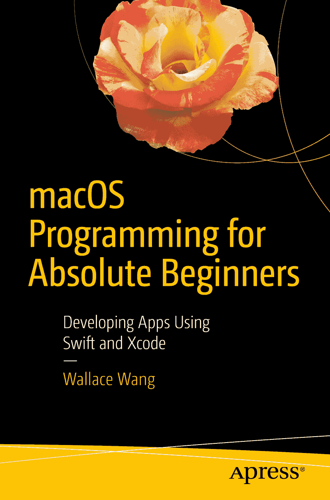

 **华莱士·王**（Wallace Wang）《macOS 编程入门：使用 Swift 和 Xcode 开发应用》

作者在本书中引用的任何源代码或其他补充材料，读者均可通过本书产品页面上的 GitHub 获取，网址为[`www.apress.com/9781484226612`](http://www.apress.com/9781484226612)。如需更详细信息，请访问[`www.apress.com/source-code`](http://www.apress.com/source-code)。

ISBN 978-1-4842-2661-2  电子版 ISBN 978-1-4842-2662-9  DOI 10.1007/978-1-4842-2662-9
美国国会图书馆控制号：2017935026
© 华莱士·王 2017

本作品受版权保护。出版商保留所有权利，无论涉及全部或部分材料，特别是翻译权、重印权、插图重用权、朗诵权、广播权、缩微胶片复制权或任何其他物理形式的复制权，以及信息存储和检索的传输权、电子改编权、计算机软件权，或使用现已知或未来开发的各种类似或不同方法的权利。

本书中可能出现的商标名称、标识和图像。对于商标名称、标识或图像，我们并非在每次出现时都使用商标符号，而是仅在编辑风格中使用，以利于商标所有者，无意侵犯商标权。在本出版物中使用商品名称、商标、服务标志及类似术语，即使未标明为商标，也不应被视作对其是否受所有权保护的立场表达。

尽管本书中的建议和信息在出版时被认为是真实准确的，但作者、编辑及出版商均不对可能存在的任何错误或遗漏承担法律责任。出版商对本书内容不作任何明示或暗示的担保。

本书采用无酸纸印刷。通过施普林格科学与商业媒体纽约公司向全球图书贸易分销，地址：233 Spring Street, 6th Floor, New York, NY 10013。电话：1-800-SPRINGER，传真：(201) 348-4505，电子邮件：`orders-ny@springer-sbm.com`，或访问`www.springeronline.com`。Apress Media, LLC 是加利福尼亚州的有限责任公司，其唯一成员（所有者）是施普林格科学+商业金融公司（SSBM Finance Inc）。SSBM Finance Inc 是一家特拉华州公司。

谨以此书献给所有梦想编写计算机程序的人。任何人都能学会编程。问题往往在于不知从何入手，并对整个过程感到畏惧。因此，这本书献给所有渴望获得一份针对 Macintosh 计算机编程的温和入门指南的人。欢迎来到未来，在这里，你的梦想只受限于你的想象力。

## 引言

如果你是一个完全的新手，希望开始学习编程；或者你已熟悉编程，但渴望了解更多；又或者你是一位经验丰富的程序员，熟悉其他编程语言，但对 Macintosh 编程不熟悉——这本书都适合你。无论你的技能水平如何，本书都将帮助每个人理解如何使用苹果最新的编程语言 Swift，为 Macintosh 创建 macOS 程序。

现在你可能在想，为什么学习 Swift？为什么为 Macintosh 编程？答案很简单。

首先，Swift 是苹果最新的编程语言，旨在比以前更快、更简单、更可靠地创建 macOS 和 iOS 程序。此前，你必须使用`Objective-C`来创建 macOS 和 iOS 应用。虽然`Objective-C`功能强大，但它更难学习，读写更复杂，并且由于其复杂性，更容易在程序中引入错误或缺陷。

Swift 与`Objective-C`同样强大（实际上，你很快就会看到，它更强大），但学习起来容易得多，读写也简单得多，并且它最大限度地减少了常见的编程错误。Swift 为你提供了`Objective-C`的所有优点，却没有其任何缺点。此外，Swift 还提供了`Objective-C`所不具备的功能，这使得 Swift 成为如今及未来更值得学习和使用的编程语言。由于 Swift 是苹果的官方编程语言，你可以确信，学习 Swift 将在现在和未来带来更多机遇。

但为什么你想要学习创建 Macintosh 程序呢？当前的热门趋势是学习为 iPhone、iPad 和 Apple Watch 创建 iOS 应用。如果你打算开发软件，你当然想用 Swift 来创建 iOS 应用。

然而，学习 Swift 意味着要理解以下几点：

- 编程原理，特别是面向对象编程
- Swift 编程语言的语法
- Xcode 的功能
- 苹果的软件开发框架（称为 Cocoa），它是每个 macOS 和 iOS 程序的基础
- 用户界面设计原则

听起来要学的东西很多？别担心。我会逐步讲解每个过程，让你不会感到迷茫。关键在于，要创建 macOS 程序和 iOS 应用，你需要学习多个主题，但创建 iOS 应用还会带来额外的挑战。

例如，一个 iOS 应用需要响应单指、双指的触摸手势、滑动、摇晃和动作，同时还要适应当用户将 iPhone 或 iPad 向左、向右、上下颠倒或正向翻转时的变化。

相比之下，一个 Macintosh 程序只需要响应键盘和鼠标输入。这意味着 macOS 程序创建和理解起来要简单得多，这也意味着学习 Swift 创建 macOS 程序比学习 Swift 创建 iOS 应用容易得多。

最重要的是，原理是完全相同的。你学习创建 macOS 程序所获得的技能，与创建 iOS 应用所需的技能完全一致。区别在于，创建 macOS 程序比创建 iOS 应用简单得多，不那么令人困惑，也远没有那么令人生畏。

从一开始就尝试创建 iOS 应用，就像还不知道如何在水中屏气就去尝试横渡英吉利海峡一样。

你不想无谓地让自己受挫。这就是为什么通过先学习 macOS 编程来学习 iOS 应用编程原理会容易得多。一旦你熟悉了 macOS 编程，你会发现将编程技能迁移到创建 iOS 应用是轻而易举的事。通过学习使用 Swift 创建 macOS 程序，你将学到最终使用 Swift 创建 iOS 应用所需的一切知识，此外，你还会知道如何创建 macOS 程序，从而也能打入不断增长的 Macintosh 市场。

## 追随高回报的编程潮流

每当新的计算机平台问世，总会为程序员带来一段高回报期。80 年代初，最热门的平台是 Apple II 电脑。如果你想靠写程序赚钱，就得开发面向 Apple II 电脑用户的应用——就像当时还在读 MBA 的丹·布里克林那样，他编写了第一款电子表格程序`VisiCalc`。

下一个重大计算平台转变发生在 80 年代中期，以 IBM PC 和`MS-DOS`为代表。许多人凭借 IBM PC 发了财，包括比尔·盖茨和微软公司——后者从一家小型初创企业成长为全球最具统治力的计算机公司。IBM PC 造就了数百位百万富翁，其中就包括宝洁公司前营销总监斯科特·库克，他开发了广受欢迎的个人理财软件`Quicken`。

微软推动了下一个计算机平台的到来：将 IBM PC 从`MS-DOS`系统升级到 Windows 系统，并为其配备了友好的图形用户界面。为 Windows 编程再次成为程序员乃至非程序员积累财富的首要途径——他们通过编写和销售自己的 Windows 程序获利。微软利用这次向 Windows 的转型，发布了多款仅适用于 Windows 的程序，这些程序后来成为商业世界的常青树，例如`Outlook`、`Access`和`Excel`。

如今，世界正转向以苹果产品为核心的新计算机平台——这些产品运行着`macOS`和`iOS`系统。成千上万像你一样的人正跃跃欲试，想通过编写程序来抓住 Macintosh 日益增长的市场份额，以及 iPhone、iPad 在智能手机和平板电脑领域的主导地位、Apple Watch 在可穿戴计算机市场的领先地位，还有 Apple TV 在电视市场的优势。

同样，经验丰富的开发者、业余爱好者、发烧友以及其他领域的专业人士，也热衷于编写针对自身特定领域的游戏、实用工具和商业软件。

许多程序员从对编程一无所知起步，最终通过开发 iPhone/iPad 应用或 Macintosh 程序，实现了日进斗金的收入。随着 Macintosh、iPhone、iPad、Apple Watch 和 Apple TV 在全球市场份额持续增长，更多人将使用其中一款或多款产品，这将为你拓展潜在市场。

所有这些都意味着，现在正是你开始学习如何为 Macintosh 编程的最佳时机——因为越早掌握 Macintosh 编程的基础知识，你就能越早开始创建自己的 Macintosh 程序，以及 iPhone/iPad/Apple Watch/Apple TV 应用。

## 本书能为你带来什么

无论你是完全的新手，还是来自其他编程环境的资深程序员，本书都将尽量减少技术术语，专注于帮助你理解该做什么以及为什么这样做。

如果你只是想快速入门，学习 Swift 编程的基础知识，那么这本书就是为你准备的。如果你已经是一位经验丰富的 Windows 程序员，并希望开始学习 Macintosh 编程，那么本书尤其能帮你迅速掌握基础要点。

如果你从未接触过编程，或者虽然熟悉编程但不熟悉 Macintosh 编程，那么这本书同样适合你。即使你已精通 Macintosh 编程，你仍会发现本书是一本便捷的参考手册，能帮你快速实现特定目标，而无需翻阅多本书籍寻找答案。

你无法从本书学到创建超级复杂程序所需的一切，但你会学到足够入门的知识，能够自如地使用`Xcode`，并且更有信心、理解更透彻地去攻克其他编程书籍。这个目标合理吗？如果合理，那么请翻到下一页，让我们开始吧。

## 致谢

感谢 Apress 出版社所有出色的人们，让我有机会撰写关于个人计算这个奇妙古怪又引人入胜的世界。

另外感谢戴恩·亨德森和伊丽莎白·李（[`www.echoludo.com`](http://www.echoludo.com)），他们与我在 KNSJ.​org（[KNSJ.​org](http://knsj.org)）的广播节目《地下笔记》中共享电波。还要感谢克里斯·克洛伯、黛安·吉恩和伊卡伊卡·帕特里亚，他们允许我每周在 KNSJ 的另一档广播节目《当面笑电台》（[`www.laughinyourfaceradio.com`](http://www.laughinyourfaceradio.com)）中分享友情与疯狂，我们在节目中将喜剧与政治行动和评论相结合。

特别要提到迈克尔·蒙蒂霍和他不屈不挠的精神，在过去的 20 年里，他每月至少从菲尼克斯开车到洛杉矶一次，与好莱坞高管会面。有一天当你听到他的动画系列《迈基的生活》和《帕丘科男孩》时，你就会知道它们是如何最终登上荧幕的——因为他尽管面临重重阻碍，却从未放弃自己的梦想。

还要感谢我的妻子卡桑德拉和儿子乔丹，他们容忍了一个堆满电子设备、活人反而更少的家。最后感谢我的猫咪奥斯卡和梅尔，它们总爱在最不凑巧的时候踩过键盘、踏上触控板和鼠标，甚至啃咬电源线。

