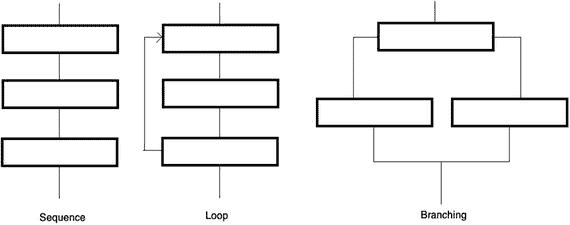
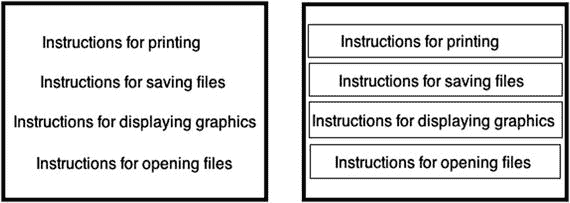
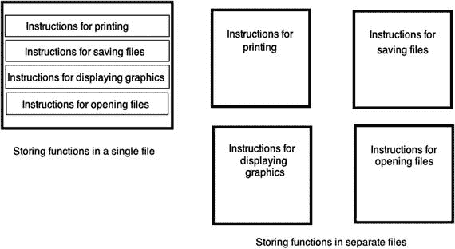
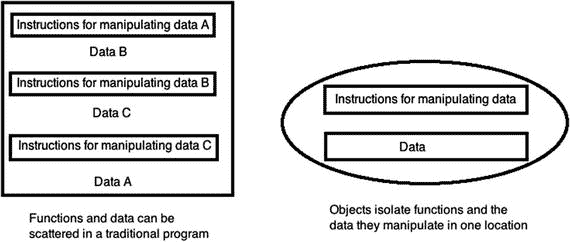
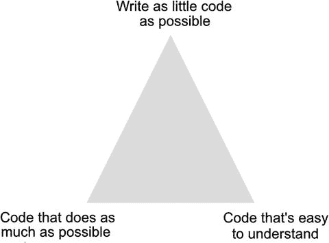
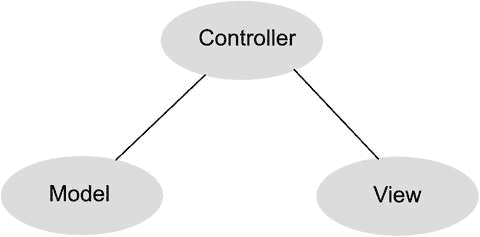

# 1. 理解编程

编程无非就是为计算机编写一步步的指令，让计算机遵循执行。如果你曾经写下做菜的步骤，或者为假期时照顾宠物草拟过注意事项，那么你已经走过了编写程序的基本步骤。关键在于：明确你想要实现的目标，然后确保写出正确的指令，告诉别人如何达成这个目标。

尽管编程在理论上很简单，但细节却可能让你栽跟头。首先，你需要确切知道自己想要什么。如果你想做的是鸡肉炒面菜谱，按照烤三文鱼的菜谱来操作可不会管用。

其次，你需要写下从起点到预期结果所需的每一条指令。如果你跳过一步或指令顺序写错，就无法得到相同的结果。试想一下，当驾车前往餐厅的路线说明遗漏了告诉你在哪条路转弯时，即使 99%的指令都是正确的，但只要有一条指令出错，你就无法到达目标。

目标越简单，就越容易实现。编写一个在屏幕上显示计算器的程序，远比编写一个监控核电站安全系统的程序简单得多。程序越复杂，你需要编写的指令就越多；需要编写的指令越多，遗漏指令、写错指令或指令顺序出错的概率就越大。

编程不过是一种控制计算机解决问题的方式，无论这台计算机是笔记本电脑、智能手机、平板电脑还是智能手表。在开始编写自己的程序之前，你需要理解编程的基本原理。

> **注意**
> 不要把学习编程和学习某种特定的编程语言搞混了。实际上，你甚至可以在完全不碰计算机的情况下学习编程的原理。一旦理解了编程原理，你就能轻松学会任何特定的编程语言，比如 Swift。

## 编程原理

要编写一个程序，你必须写出计算机能够执行的指令。无论程序做什么事，或者程序有多庞大，世界上的每一个程序都不过是由计算机一步步依次执行的指令组成的。最简单的程序可能只有一行，例如：

```
print ("Hello, world!")
```

显然，只有一行指令的程序做不了太多事，因此大多数程序都由多行指令（或代码）组成，例如：

```
print ("Hello, world!")
print ("Now the program is done.")
```

这个两行程序从第一行开始执行，接着执行第二行的指令，然后停止。当然，你可以不断向程序中添加指令，直到拥有上百万条指令，计算机可以依次一条一条地执行。

按顺序列出指令是编程的基础。不幸的是，这也有局限性。例如，如果你想把同一条消息打印五次，可以使用以下代码：

```
print ("Hello, world!")
print ("Hello, world!")
print ("Hello, world!")
print ("Hello, world!")
print ("Hello, world!")
```

重复写五条相同的指令既繁琐又冗余，但确实能行得通。如果你想把同一条消息打印一千次呢？你就得把同一条指令写上一千遍。

多次编写相同的指令显得很笨拙。为了让编程更轻松，目标是用最少的指令完成最多的工作。避免重复编写相同指令的一种方法是利用编程的另一个基本原——**循环**。

循环的思想是重复执行一条或多条指令多次，但只需要把这些指令写一次。典型的循环可能如下所示：

```
for i in 1...5 {
print ("Hello, world!")
}
```

第一行告诉计算机将循环重复五次。第二行告诉计算机在屏幕上打印消息“Hello, world”。第三行定义了循环的结束。

现在，如果你想让计算机把一条消息打印一千次，就不需要把同一条指令写一千遍了。相反，你只需修改循环的重复次数：

```
for I in 1...1000 {
println ("Hello, world!")
}
```

虽然循环在阅读和理解上比顺序指令稍微复杂一些，但它让你更容易重复执行指令，而无需反复编写相同的指令。

大多数程序并非纯粹地按顺序或循环列出指令，而是将两者结合使用，例如：

```
print ("Hello, world!")
print ("Now the program is starting.")
for I in 1...1000 {
print ("Hello, world!")
}
```

在这个例子中，计算机按顺序执行前两行，然后循环重复执行最后三行。通常，当你只需要计算机执行一次指令时，按顺序列出指令就足够了。当你需要计算机多次运行指令时，就需要使用循环。

计算机的强大之处不仅在于能按顺序或循环执行指令，更在于能做出决策。决策意味着计算机需要评估某个条件，然后根据该条件决定下一步该做什么。

例如，你可以编写一个程序，除非有人输入正确的密码，否则将其锁定在计算机之外。如果输入了正确的密码，程序就授予访问权限。但如果输入了错误的密码，程序就阻止访问计算机。以下是一个此类决策的示例：

```
if password == "secret" {
print ("Access granted!")
} else {
print ("Login denied!")
}
```


在这个例子中，计算机询问密码，当用户输入密码时，计算机会检查它是否与单词“secret”匹配。如果匹配，计算机就授予该用户访问权限。如果用户没有输入“secret”，则计算机拒绝访问。

做出决策是让编程变得灵活的原因。如果你编写一系列顺序指令，计算机会每次都完全相同地执行这些指令列表。然而，如果你加入决策指令（也称为分支指令），那么计算机就可以根据用户的操作做出响应。

以电子游戏为例。没有任何游戏可以完全由顺序组织的指令编写而成，因为那样游戏每次都会以完全相同的方式运行。相反，电子游戏需要随时根据玩家的行为进行调整。如果玩家将物体向左移动，游戏需要做出与向右移动或不移动不同的响应。使用分支指令赋予了计算机做出不同反应的能力，从而使程序永远不会有完全相同的运行方式。

要编写计算机程序，你需要以下列三种方式之一组织指令，如图 1-1 所示。



图 1-1. 编程的三种基本构建块

- **顺序执行**：计算机一条接一条地执行指令。
- **循环**：计算机重复执行一条或多条指令。
- **分支**：计算机根据外部数据选择执行一组或多组指令。

虽然简单的程序可能只以顺序方式组织指令，但每个大型程序都会以顺序、循环和分支的方式组织指令。使编程更像一门艺术而非科学的，正是没有唯一的“最佳”方式来编写程序。事实上，完全有可能编写出两个行为完全相同但代码不同的程序。

由于没有唯一的“正确”方式来编写程序，因此只有一些指导原则来帮助你轻松编写程序。最终，重要的是你编写出一个能正常工作的程序。

在编写任何程序时，通常存在两个往往相互排斥的目标。首先，程序员努力编写易于阅读、理解和修改的程序。这通常意味着要编写多条指令，清晰地定义解决特定问题所需的步骤。

其次，程序员试图编写能高效执行任务的程序，使程序尽可能快地运行。这通常意味着要使用技巧或利用鲜为人知的特性，尽可能压缩多条指令，即使这些特性难以理解，甚至会让经验丰富的程序员感到困惑。

在起步阶段，要努力让你的程序尽可能清晰、符合逻辑且易于理解，即使为此你不得不编写更多或更长的指令。之后，随着你积累更多的编程经验，你可以致力于创建最小、最快、最高效的程序，但请记住，你的最终目标是编写出能正常工作的程序。

## 结构化编程

小程序包含的指令较少，因此更容易阅读、理解和修改。不幸的是，小程序只能解决小问题。要解决复杂问题，你需要编写包含更多指令的更大程序。你输入的指令越多，出错（称为“bug”）的可能性就越大。更糟糕的是，程序越大，就越难理解其工作原理，以便日后进行修改。

为了避免编写一个庞大的单一程序，程序员只需将大型程序分解为更小的部分，称为子程序或函数。其思想是每个函数解决一个单一任务。这使得编写变得简单，并能确保它正常工作。

当所有独立函数都正常工作后，你可以将它们连接起来创建一个单一的大型程序，如图 1-2 所示。这就像用砖块建造房子，而不是试图从一块巨大的岩石中凿出一整栋房子。



图 1-2. 将大型程序划分为多个子程序或函数有助于使编程更可靠

将大型程序划分为较小的程序有几个好处。首先，编写较小的函数既快又容易，并且小型函数使得指令易于阅读、理解和修改。

其次，函数像构建块一样协同工作，因此多个程序员可以分别处理不同的函数，然后将这些独立的函数组合起来创建一个大型程序。

第三，如果你想修改一个大型程序，只需取出、重写并替换一个或多个函数即可。如果没有函数，修改大型程序就意味着要翻阅存储在大型程序中的所有指令，并试图找到需要更改的那些指令。

函数的第四个好处是，如果你编写了一个有用的函数，可以将该函数插入到其他程序中。通过创建一个经过测试的、有用的函数库，你可以通过重用现有代码快速轻松地创建其他程序，从而减少从头开始编写所有内容的需要。

当你将一个大型程序划分为多个函数时，你可以选择：将所有函数存储在一个文件中，或者将每个函数存储在单独的文件中，如图 1-3 所示。通过将函数存储在单独的文件中，多个程序员可以处理不同的文件而不会影响到他人。



图 1-3. 你可以将函数存储在一个文件或多个文件中

将所有函数存储在一个文件中，可以方便地查找和修改程序的任何部分。然而，程序越大，你需要编写的指令就越多，这会使在单个大文件中搜索变得笨拙，就像翻阅一本未按字母顺序排列的词典来查找特定单词一样。

此外，将所有函数存储在一个文件中会使得多个程序员无法分别处理程序的不同部分，因为每个程序员都需要使用同一个文件。

将所有函数存储在单独的文件中，意味着你需要跟踪哪个文件包含哪个函数。然而，这样做的好处是修改函数要容易得多，因为一旦你打开正确的文件，你只会看到单个函数的指令，而不是十几个或更多其他函数的指令。

由于当今的程序可能变得非常庞大，因此通常将函数存储在单独的文件中。


## 事件驱动编程

在计算机早期时代，大多数程序的工作方式是：从第一条指令开始，逐行执行，直到结束。这样的程序在任何时刻都严格地控制着计算机的行为。

当计算机开始显示带有窗口和下拉菜单的图形用户界面，以便用户能够在任何时刻自由选择操作时，这一切都发生了改变。突然间，每个程序都必须等待用户执行某个操作，比如选择菜单命令或点击按钮。现在，程序必须对用户的操作做出响应。

用户每次执行的操作都被视为一个**事件**。用户点击鼠标左键，与点击鼠标右键是完全不同的事件。程序不再规定用户在任何时刻能做什么，而是必须对用户触发的不同事件做出响应。使程序能够响应不同事件的方法，就称为**事件驱动编程**。

事件驱动编程将一个大型程序拆分为多个函数，每个函数负责响应一个特定的事件。如果用户点击了一个菜单命令，一个函数就会执行其指令；如果用户点击了一个按钮，另一个函数就会执行另一组指令。

事件驱动编程始终在等待并响应于用户的操作。

## 面向对象编程

将大型程序拆分为多个函数，使得创建和修改程序变得容易。然而，理解这样一个大型程序的工作原理常常令人困惑，因为没有简单的方法来确定哪些函数协同工作，或者它们可能需要从其他函数中获取哪些数据。

更糟糕的是，函数经常修改其他函数所使用的数据。这意味着有时一个函数会在另一个函数使用数据之前就修改了它。使用错误的数据会导致另一个函数运行失败，进而导致整个程序崩溃。这种情况不仅会降低软件的可靠性，还会使确定问题原因和修复位置变得更加困难。

为了解决这个问题，计算机科学家们创建了**面向对象编程**。其目标是将大型程序拆分为更小的函数，但将相关的函数组织在一起，形成称为**对象**的组。为了让面向对象程序更容易理解，对象也对现实世界中的物理实体进行建模。

假设你需要编写一个程序来控制机器人。按任务划分这个问题，你可能会创建一个函数来移动机器人，第二个函数让机器人感知附近的障碍物，第三个函数计算最佳的移动路径。如果机器人的移动出现问题，你将无法判断问题出在控制移动的函数，还是控制机器人感知障碍物的函数，抑或是计算最佳路径的函数。

如果将同样的机器人程序按对象划分，你可能会创建一个 `Legs` 对象（用于移动机器人），一个 `Eye` 对象（用于感知附近障碍物），以及一个 `Brain` 对象（用于计算避开障碍物的最佳路径）。现在，如果机器人的移动出现问题，你可以将问题隔离在 `Legs` 对象所包含的代码中。

除了在对象内部隔离数据，面向对象编程的第二个核心理念是让大型程序的复用和修改变得容易。假设你要将机器人的腿替换为履带。现在你必须修改用于移动机器人的函数，因为履带的行为与腿不同。接下来，你还必须修改计算障碍物最佳路径的函数，因为履带迫使机器人必须绕开障碍物，而腿则允许机器人跨越小障碍物并绕开较大的障碍物。

如果你想把机器人的腿换成履带，面向对象编程可以让你直接移除 `Legs` 对象，并用一个新的 `Treads` 对象替换它，而无需影响或修改组成程序其余部分的任何其他对象。

由于大多数程序会不断被修改，以修复错误（通常称为 bug）或添加新功能，面向对象编程允许你使用独立的功能模块（对象）来构建大型程序，并且只需修改单个对象就能修改整个程序。

面向对象编程的关键在于隔离程序的不同部分，并通过三个特性——**封装**、**继承**和**多态**来提升可复用性。

## 封装

封装的主要目的是保护并隔离程序的某一部分，使其不受程序其他部分的影响。为此，封装会隐藏数据，使其永远不会被程序的另一部分更改。此外，封装还会包含所有操作该对象内存储数据的函数。如果出现问题，封装可以轻松地将问题隔离在特定对象内。

每个对象都应该完全独立于程序的其他部分。对象将数据存储在**属性**中。操作这些属性的唯一方式是使用被称为**方法**的函数，这些方法也封装在同一个对象中。属性和方法组合在一起，并被隔离在对象内部，这使得使用对象作为构建块（building blocks）来快速、可靠地创建大型程序成为可能，如图 1-4 所示。



图 1-4. 对象将相关函数和数据封装在一起，对其他程序隐藏

## 继承

创建大型、复杂的程序很困难，而从零开始编写整个程序则让这项任务更加艰巨。这就是大多数程序员会重用现有程序部分代码的两个原因。首先，他们无需从头重写所需的功能。这意味着他们可以更快地创建大型程序。其次，他们可以使用已经过测试、证明能正确运行的代码。这意味着通过重用可靠的代码，他们可以更快地创建更可靠的软件。

代码重用的一个巨大问题在于，你绝不希望创建重复的副本。假设你复制了一个函数并将其粘贴到第二个位置。现在你在同一个程序的两个不同位置有了两份完全相同的代码。这不仅浪费空间，更重要的是，它可能在将来引发问题。

假设你发现某个函数中存在一个问题。要修复这个问题，你需要在你复制并粘贴了该代码的所有位置都进行修复。如果你将这段代码复制并粘贴到了程序中的另外两个位置，你就必须找到这两个位置并修复代码。如果你将这段代码复制并粘贴到了程序中的一千个位置，你就必须找到这一千个不同的位置并逐一修复。

这不仅不方便且耗时，还增加了忽略某些代码，从而在该代码中遗留问题的风险。这会导致程序的可靠性降低。

为了避免修复同一代码的多个副本的问题，面向对象编程使用了称为**继承**的机制。其核心理念是，一个对象可以使用存储在另一个对象中的所有代码，而无需物理地复制该代码。相反，一个对象从另一个对象**继承**代码，但该代码始终只存在一个副本。

现在你可以根据需要多次重用同一个代码副本。如果你需要修复一个问题，你只需要修复该代码一次，而这些更改会自动出现在任何通过继承重用该代码的对象中。

基本上，继承让你可以在不创建物理代码副本的情况下重用代码。这使得代码重用变得容易，并且将来修改起来也很方便。


### 多态性

每个对象都由数据（存储在属性中）和操作这些数据的函数（称为方法）组成。通过继承，一个对象可以使用另一个对象中定义的属性和方法。然而，当某个函数（方法）需要执行不同的代码时，继承可能会引发问题。

假设你正在开发一款电子游戏。你将汽车定义为一个对象，将怪物定义为第二个对象。如果怪物向汽车扔石头，那么石头就是第三个对象。为了让汽车、怪物和石头在屏幕上移动，你创建了一个名为 `Move` 的方法。

不幸的是，汽车在屏幕上的移动方式需要与怪物或扔出的石头不同。你可以创建三个函数，分别命名为 `MoveCar`、`MoveMonster` 和 `MoveRock`。然而，一个更简单的解决方案是让这三个函数都使用相同的名称，比如 `Move`。

在传统编程中，你绝不能给两个或更多的函数起相同的名称，因为计算机不知道你想运行哪个函数。但在面向对象编程中，由于多态性的存在，你可以使用重复的函数名。

多态性允许你使用相同的方法名，但用不同的代码来替代它。多态性之所以有效，是因为每个 `Move` 函数（方法）都存储在不同的对象中——一个代表汽车的对象，一个代表怪物的对象，还有一个代表扔出的石头的对象。要运行每个 `Move` 函数，你需要指明包含你想使用的 `Move` 函数的对象，例如：

```
Car.Move
Monster.Move
Rock.Move
```

通过同时指明你想要操作的对象以及你想要使用的函数，面向对象编程能够正确识别应运行哪一组指令，即使一个函数与另一个函数名称完全相同。

本质上，多态性让你能够创建描述性的函数名，并在使用继承时随意地重复使用这个描述性的名称。

封装、继承和多态性的结合构成了面向对象编程的基础。封装将程序的某一部分与另一部分隔离开来。继承允许你复用代码。多态性则允许你重用方法名称，但使用不同的代码。

## 理解编程语言

编程语言不过是一种表达思想的特定方式，就像西班牙语、阿拉伯语、中文或英语等人类语言一样。计算机科学家创造编程语言是为了解决特定类型的问题。这意味着一种编程语言可能非常适合解决某一类问题，但在解决另一类问题时可能表现极差。

最流行的编程语言是 C 语言，它被设计用于对计算机硬件进行底层访问。因此，C 语言非常适合创建操作系统、杀毒程序和硬盘加密程序。任何需要完全控制硬件的任务都是 C 语言的绝佳应用场景。

不幸的是，C 语言可能晦涩难懂且功能简练，因为它被设计为追求计算机的最大效率，而不考虑人类阅读、编写或修改 C 程序的效率。为了改进 C 语言，计算机科学家创建了 C 的面向对象版本，即 C++。不久之后，出现了一个更精致的 C++ 版本，称为 Objective-C，这是苹果公司为 macOS 和 iOS 编程所采用的语言。

由于 C 语言最初的设计目的是牺牲人类效率来换取计算机效率，因此包括 C++ 和 Objective-C 在内的所有 C 语言变体也可能难以学习、使用和理解。这就是为什么苹果公司创建了 Swift。Swift 的目的是在提供 Objective-C 强大功能的同时，使其更易于学习、使用和理解。Swift 基本上是 Objective-C 的改进版本，而 Objective-C 本身又是 C++ 的改进版本，C++ 则是 C 的改进版本。

计算机编程的每一次演进都建立在先前的编程标准之上。当你用 Swift 编写程序时，你可以使用 Swift 的独特功能，同时结合面向对象编程、事件驱动编程、结构化编程以及编程的三大基本构件（顺序、循环和分支）。

Swift 与所有计算机编程语言一样，包含一个固定的命令列表，称为关键字。为了告诉计算机做什么，你使用关键字来创建语句，这些语句使计算机执行单个任务。

你已经见过 `print` 关键字，它用于打印文本，例如：

```
print ("Hello, world!")
```

这个 Swift 关键字是 `print`（意为打印）；然后你必须在括号内告诉关键字你要打印什么。就像学习人类语言需要首先学习用于书写字母的基本符号（如字母表或其他符号）一样，学习编程语言也需要首先学习该特定编程语言的关键字。

尽管 Swift 包含数十个关键字，但你不必为了用 Swift 编写程序而一次性全部学会。你最初只需要学习少数几个关键字。随着你经验越来越丰富，你会逐渐需要学习更多的 Swift 关键字。

为了尽可能简化编程，Swift（像许多编程语言一样）使用看起来像普通英语单词的关键字，例如 `print` 或 `var`（variable 的缩写）。然而，许多编程语言也使用代表不同功能的符号。

常见的符号是数学符号，如加法（`+`）、减法（`-`）、乘法（`*`）和除法（`/`）。

为了标识协同工作的命令的起始和结束，Swift（像 C 语言一样）使用花括号将代码括起来，例如：

```
{
print ("This is a message");
}
```

与人类语言不同，你可能拼错单词或忘记在句子末尾加句号，而人们仍然能理解你的意思，但编程语言可没那么宽容。对于编程语言，每个关键字都必须拼写正确，每个符号都必须用在需要的地方。拼错一个关键字、用错符号或将正确的符号放在错误的位置，都会导致整个程序无法运行。

编程语言是精确的。编程的关键在于编写。


*   尽可能少的代码
*   功能尽可能强大的代码
*   尽可能易于理解的代码

你希望编写尽可能少的代码，因为代码越少，就越容易确保其正确运行。

你希望代码功能尽可能强大，因为这能让你的程序具备解决更大问题的能力。

你希望代码易于理解，因为这能让修复问题和添加功能变得容易。

不幸的是，这三个标准常常相互矛盾，如图 1-5 所示。



图 1-5.

编程中三个常常相互矛盾的目标

如果你编写的代码尽可能少，这通常意味着你的代码功能有限。这就是程序员经常借助捷径和编程技巧来压缩代码量的原因，但这会增加代码的复杂度，使其更难理解。

如果你编写的代码功能尽可能强大，这通常意味着要编写大量的命令，这会使代码更难理解。

如果你编写易于理解的代码，它通常功能有限。如果你编写更多代码来增强功能，这又会降低代码的可读性。

归根结底，计算机编程更像是一门艺术而非科学。通常，最好专注于让代码尽可能易于理解，因为这会使得修复问题和添加新功能更加容易。此外，易于理解的代码意味着，如果你无法亲自维护，其他程序员也能修复和修改你的程序。

这正是苹果公司创建 `Swift` 的原因：在不牺牲 `Objective-C` 强大功能的前提下，使代码比 `Objective-C` 更易于理解。尽管 `Swift` 比 `Objective-C` 更强大，但 `Swift` 代码通常可以比等效的 `Objective-C` 代码更短。因此，苹果未来的编程语言将是 `Swift`。

## Cocoa 框架

关键字（和符号）让你能够向计算机发出指令，但没有任何一种编程语言能提供创建所有类型程序所需的一切命令。为了提供额外的命令，程序员使用关键字来创建执行特定任务的函数。

当他们创建了一个有用的函数后，通常会将其保存在一个包含其他有用函数的库中。在编写程序时，你可以使用编程语言的关键字以及库中存储的任何函数。通过复用库中的函数，你可以创建更强大、更可靠的代码。

例如，一个库可能包含用于显示图形的函数。另一个库可能包含用于将数据保存到磁盘并重新读取数据的函数。还有的库可能包含用于计算数学公式的函数。为简化和 `macOS` 及 `iOS` 程序的编写，苹果公司创建了一个名为 `Cocoa` 框架的实用函数库。

复用现有框架有两个原因。首先，复用框架使你不必为完成别人已经解决的问题而编写自己的指令。框架不仅提供了现成的解决方案，而且已经过他人的测试，因此你可以直接使用框架，并确信它能正确运行。

使用现有框架的第二个原因是为了保持一致性。苹果提供了用于定义程序在屏幕上外观的框架，即用户界面。这定义了程序应如何运行，从在屏幕上显示窗口，到让你通过点击鼠标来调整窗口大小或关闭窗口。

你完全可以编写自己的指令来在屏幕上显示窗口，但编写自己的指令很可能需要耗费时间来创建和测试，最终得到的用户界面可能看起来或操作起来与其他 `macOS` 或 `iOS` 程序并不一致。

然而，通过复用现有框架，你可以快速创建自己的程序，并确保你的程序与其他程序的行为方式一致。虽然编程听起来可能很复杂，但苹果提供了数百个预先编写并经过测试的函数，可以帮助你快速、轻松地创建程序。你只需编写那些能让你的程序解决特定、独特问题的自定义指令即可。

要理解苹果的 `Cocoa` 框架是如何工作的，你需要了解面向对象编程，这有两个原因。首先，`Swift` 是一种面向对象的编程语言，因此要充分利用 `Swift` 的优势，你需要理解面向对象编程的好处。

其次，苹果的 `Cocoa` 框架基于面向对象编程。要理解如何使用 `Cocoa` 框架，你需要使用对象。

注意

`Cocoa` 框架是为创建 macOS 程序而设计的。一个名为 `Cocoa Touch` 的类似框架是为创建 iOS 应用而设计的。由于 `Cocoa Touch` 框架（iOS）基于 `Cocoa` 框架（macOS），它们的工作方式相似，但提供了不同的功能。

通过依赖 `Cocoa` 框架，你的程序在苹果每次更新和改进 `Cocoa` 框架时都能获得新功能。例如，拼写检查是 `Cocoa` 框架的一个内置功能。如果你使用 `Cocoa` 框架编写程序，你的程序会自动获得拼写检查能力，而无需你编写任何额外的代码。当苹果改进 `Cocoa` 框架中的拼写检查功能时，你的程序无需你付出任何额外努力就能自动获得这些改进。

`Cocoa` 框架是一个总称，描述了苹果所有预先编写并经过测试的代码库。`Cocoa` 框架的不同部分可以为你的程序提供音频播放能力、图形能力、联系人信息（如姓名和地址）存储能力以及互联网能力。

`Cocoa` 框架构建了典型 macOS 程序的基础。你只需编写使你的程序独一无二的 `Swift` 代码即可。


## 视图-模型-控制器设计

虽然可以编写一个大型程序并将所有代码存储在一个文件中，但这会让查找程序中的任何内容变得困难得多。更好的解决方案是将大型程序划分为多个部分，并将相关的部分存储在单独的文件中。这样，你就能快速找到需要修改的程序部分，并且便于多个程序员协作，因为一个程序员可以处理一个文件，而另一个程序员可以处理另一个文件。

将程序划分为多个文件时，最好保持条理清晰。就像你可能会把袜子放在一个抽屉里，把 T 恤放在另一个抽屉里，以便轻松找到所需衣物一样，你也应该将程序组织成多个文件，使每个文件只包含相关的数据。这样，你就能快速轻松地找到需要修改的文件。

文件中存储的数据类型通常归为三类，如图 1-6 所示：



图 1-6. 将程序划分为模型-视图-控制器设计

* 视图（用户界面）
* 模型
* 控制器

视图或用户界面是用户所看到的内容。每个用户界面的目的是显示信息、接收数据以及接受用户的命令。在过去，程序员通常通过编写代码来创建用户界面。虽然在`Swift`中仍可如此操作，但这样做既耗时、又容易出错，并且缺乏一致性，因为一个程序员的用户界面可能在视觉和行为上与另一个程序员的用户界面不完全相同。

更好的选择是以可视化的方式设计用户界面，而这正是`Xcode`的功能。只需在用户界面上绘制按钮、文本字段和菜单等对象，`Xcode`就会自动创建一个无错误、外观一致的用户界面，仅需几秒钟即可完成。当你使用`Xcode`创建用户界面时，实际上是在使用 Apple 的`Cocoa`框架来完成。

用户界面本身看起来不错，但没有任何功能。要使程序执行有用的操作，你需要编写解决特定问题的代码。例如，一个彩票选取程序可能会分析最近选出的号码，并确定下周最有可能被选中的号码。代码中计算有用结果的部分称为模型。

模型实际上与视图（用户界面）完全分离。这使得修改用户界面而不影响模型（反之亦然）变得容易。通过尽可能地将程序的不同部分相互隔离，可以减少修改程序时出现错误的几率。

由于模型始终与视图完全分离，因此需要控制器。当用户在用户界面中选择命令或输入数据时，控制器从视图中获取这些信息并将其传递给模型。

模型响应这些数据或命令，并计算出新的结果。然后，它将计算结果发送给控制器，再由控制器将其传回视图进行显示，供用户查看。视图和模型始终保持完全分离。

使用`Xcode`，这意味着你将大部分`Swift`代码编写并存储在定义程序模型的文件中。如果你正在计算中奖彩票号码，用于执行这些计算的`Swift`代码将存储在模型中。

你还需要在控制器文件中编写并存储`Swift`代码。在简单程序中，你可能只有一个视图。在更复杂的程序中，你可能有几个视图。每个视图通常需要一个控制器文件来控制该视图。因此，第二个编写和存储`Swift`代码的地方是控制器文件。

在简单程序中，常见做法是将模型与控制器合并到一个文件中。然而，对于更大、更复杂的程序，最好为模型创建一个（或多个）文件，并为每个控制器创建一个文件。控制器文件的数量通常等于构成用户界面的视图数量。

一旦你将程序清晰地划分为模型、视图和控制器，就可以通过用一个新文件替换另一个文件来快速、轻松地修改程序。例如，如果你想修改用户界面，只需设计一个不同的视图，将其连接到你的控制器，就大功告成了，无需触碰模型文件。

如果你想修改模型以添加新功能，只需更新模型文件并将其连接到控制器，无需触碰视图。

事实上，这正是程序员为`macOS`和`iOS`创建程序的方式。他们的模型保持不变。他们所做的只是为`macOS`编写一个控制器和视图，并为`iOS`编写一个控制器和视图。然后，他们就可以使用完全相同的模型创建`macOS`和`iOS`应用。


## 程序员是如何工作的

早期，一名程序员可以产生一个想法，然后直接编写代码让这个程序运行起来。如今，程序要复杂得多，用户期望也高得多，因此在编写任何代码之前，你需要先设计你的程序。事实上，大多数程序员实际上并不会花大量时间编写或编辑代码。相反，程序员的大部分时间都用于思考、规划、组织和设计程序。

当程序员有了一个程序构想时，第一步是判断这个想法是否真的有价值。程序必须解决特定类型的问题。例如，文字处理软件让编写、编辑和格式化文本变得容易。电子表格软件让输入数字并根据这些数字计算结果变得简单。演示文稿软件让输入文本和插入图形来创建幻灯片变得方便。甚至电子游戏也是通过提供具有挑战性的谜题或目标让玩家去达成，来解决缓解无聊的问题。

> **注意**  
> 软件开发最大的失败是未能定义要解决的具体问题。软件开发第二大的失败是确定了要解决的具体问题，但却低估了解决该问题所需步骤的复杂性。你必须知道要解决什么问题以及如何解决这个问题。如果你两者都不知道，就无法编写出有用的程序。

一旦你有了要解决的问题的想法，下一步就是定义如何解决这个问题。有些问题实在过于困难而无法解决。例如，你怎么写一个程序来写一本畅销小说？你也许可以写一个程序来帮助你写小说，但除非你确切知道如何可预测地创作出一本畅销小说，否则你根本无法写出这样的程序。

知道要解决的问题就是你的目标。一旦你清楚理解了你的问题，你需要找出解决该问题所需的所有步骤。如果你不知道如何解决某个特定问题，那么你也就无法告诉计算机如何解决这个问题。

在定义了解决问题所需的步骤之后，现在你终于可以编写程序了。通常，你会分部分编写程序，并在继续之前测试每个部分。通过这种方式，你逐步扩展程序的功能，同时确保每个部分都能正确工作。

使用 `Xcode` 时，你经历的主要步骤是：

- 编写代码和设计用户界面
- 编辑代码和用户界面
- 运行和测试你的程序

当你的程序终于完成时，猜猜看？它永远不会真正完成。总会有需要修复的错误，以及想要添加的新功能。程序员实际上花在编辑和修改现有程序上的时间，比他们创建新程序的时间还要多。

当你编写和编辑代码时，你会使用一个编辑器，这是一个类似于文字处理程序的程序，可以让你输入和编辑文本。当你设计和修改用户界面时，你会使用 `Xcode` 中一个名为 `Interface Builder` 的功能，它类似于一个绘图程序，可以让你在屏幕上拖拽、放置和调整对象大小。当你运行和测试程序时，你会使用编译器，它将你的 `Swift` 代码转换（或编译）成一个实际可运行的 `macOS` 程序。

要创建一个 `macOS` 程序，你只需要一份 `Xcode` 的副本，这是苹果公司提供的免费编程工具，你可以从 `Mac App Store` 下载。在 `Macintosh` 上安装了 `Xcode` 后，你只需学习 `Xcode` 和 `Swift`，就可以免费创建自己的程序。

### 总结

要学习如何为 `Macintosh` 编写程序，你需要学习几种不同的技能。首先，你需要理解编程的基本原理。这包括将指令组织成顺序、循环或分支结构，并理解结构化编程技术、事件驱动编程和面向对象编程。

其次，你需要学习一门特定的编程语言。对于 `Macintosh`，你将学习 `Swift`。这意味着你将学习 `Swift` 中使用的关键字，并学习如何在不同文件中编写和组织你的 `Swift` 代码。

第三，你需要知道如何使用 `Xcode`，这是苹果公司用于创建 `macOS` 和 `iOS` 应用的编程工具。`Xcode` 让你能够编写和编辑 `Swift` 代码，同时还能让你以可视化方式设计并修改用户界面。

第四，你需要学习如何使用苹果的 `Cocoa` 框架，这样你就可以专注于编写让程序实现独特功能的指令。

无论你是想编写自己的软件进行销售，还是想出售你的编程技能为他人创建定制软件，你都会发现编程是一项任何人都能学会的技能。

请记住，编程无非就是解决问题。通过了解如何使用 `Swift` 和 `Xcode` 来解决问题，你就能为自己创建 `Macintosh` 程序，而且会比想象中更容易也更快。


