# 2. 初识 Xcode 8

要在 Macintosh 上使用 Swift 编写程序，你需要用到 Xcode。Apple 将 Xcode 开发为一款专业的编程工具，并免费提供，以鼓励大家为 macOS 以及其他の操作系统（如 iOS、tvOS 和 watchOS）编写软件。尽管 Xcode 是免费程序，但它功能强大，被包括 Microsoft、Adobe、Google 乃至 Apple 在内的各大公司所使用。在 Macintosh 上安装了 Xcode，你就拥有了创建 macOS 程序以及 iOS、tvOS 和 watchOS 应用的最强大的编程工具之一。

虽然 Xcode 包含数十项专为专业程序员设计的功能，但任何人都可以学会使用它。Xcode 繁多的功能乍看之下可能令人困惑甚至望而生畏，但请放心。使用 Xcode，你无需学会所有功能。相反，你只需学会需要的那一小部分功能，并忽略其他所有功能。随着经验增长，你可以逐渐学习 Xcode 的其他功能。然而，你可能永远也用不上 Xcode 的全部功能。

Xcode 能让你从头到尾创建一个 macOS 程序或 iOS、tvOS、watchOS 应用，而无需使用其他任何程序。在 Xcode 中，你可以执行以下操作：

-   创建新项目。
-   编写和编辑 Swift 代码。
-   设计并修改用户界面。
-   管理组成单个项目的文件。
-   运行并测试你的项目。
-   调试你的 Swift 代码。

你可以通过 Mac App Store 免费下载并安装 Xcode。在你的 Macintosh 上，只需点击 Apple 菜单并选择 "App Store"。当 App Store 窗口出现后，点击右上角的搜索文本字段，输入 `Xcode`，然后按 Return 键。点击 Xcode 图标下方的按钮进行下载，如图 2-1 所示。由于 Xcode 是一个相当大的文件，你需要快速的网络连接和足够的磁盘空间才能将其安装到你的 Macintosh 上。

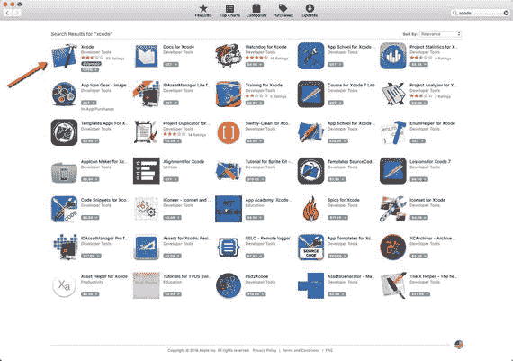

**图 2-1.** 当你搜索 Xcode 时，它通常出现在 App Store 窗口的左上角

你将经常使用的 Xcode 的四个最主要部分是：

-   项目管理器
-   编辑器
-   Interface Builder
-   编译器

一个项目代表一个单独的 macOS、iOS、tvOS 或 watchOS 程序。在过去程序简单的年代，你可以将代码存储在一个单独的文件中。如今程序变得庞大且复杂得多，将代码存储在单独的文件中更为普遍。协同工作的文件集合构成一个项目，因此 Xcode 项目管理器允许你在项目中创建、重新排列和删除文件。

每个项目都包含一个代码文件，以其 `.swift` 文件扩展名标识。代码文件是你存储、编辑和键入 Swift 代码的地方。通过使用 Xcode 的编辑器，你可以打开代码文件，复制和粘贴代码，删除代码，以及编写新代码并保存到该文件中。编辑器本质上就像一个简单的文字处理器，专门为帮助你用 Swift 编程语言编写代码而设计。

除了包含 Swift 代码的代码文件外，每个项目还包含一个用户界面，该界面存储在另一个以 `.xib` 或 `.storyboard` 文件扩展名标识的单独文件中。一个简单的程序可能只有一个包含其用户界面的文件，但一个更复杂的程序可能有几个包含用户界面不同部分的文件。Xcode 中让你设计、创建和修改用户界面的功能称为 Interface Builder。

在你编写了 Swift 代码并设计了用户界面之后，你需要将项目中的所有文件转换成一个实际可运行的程序。将 Swift 代码翻译成计算机能理解的语言（称为机器码）的过程称为编译，因此 Xcode 中执行此操作的部分被称为编译器。

你经常会以不同的顺序使用 Xcode 的这四个主要部分。例如，你可能使用项目管理器功能创建一个项目并修改其文件。然后，你可能使用编辑器编写 Swift 代码，并使用 Interface Builder 设计用户界面。最后，你将使用编译器测试你的程序。如果出现问题，你可能会多次回到编辑器或 Interface Builder，直到程序正常运行。你甚至可能创建新文件并在项目管理器中重新排列它们。

归根结底，使用 Xcode 没有唯一的“最佳”或“正确”方式。Xcode 提供了功能供你在需要时使用。

## 向 Xcode 下达指令

与许多程序一样，Xcode 提供多种方式来完成完全相同的任务。例如，要打开一个项目，你可以选择 "文件" ➤ "打开" 或按下 `Command + O`。通常，Xcode 提供三种方式来执行常见类型的命令：

-   使用屏幕顶部菜单栏中的下拉菜单。
-   按下独特的按键组合，如 `Command + O`。
-   点击代表某个命令的图标。

下拉菜单有助于你找到特定命令，但使用起来可能较慢且笨拙，因为你需要点击菜单标题拉出菜单，然后点击菜单上出现的命令。

按键组合更快更便捷，但它们迫使你记忆常用命令的晦涩按键组合。为了帮助你了解哪些命令有按键组合，查看每个下拉菜单，你会看到不同命令右侧显示的按键组合，如图 2-2 所示。（但并非所有命令都有按键组合。）

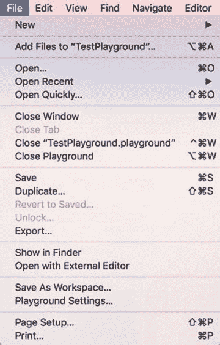

**图 2-2.** 按键组合显示在下拉菜单中命令的右侧

按键组合通常包括一个修饰键加一个字母或功能键。四个修饰键包括 Command、Control、Option 和 Shift，如图 2-3 所示。

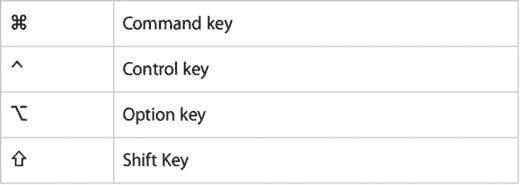

**图 2-3.** 用于表示常见修饰键的符号

点击图标选择命令可能是所有方法中最快的，但你必须知道每个图标所代表的命令。为了帮助你理解图标的作用，只需将鼠标指针移到图标上并等待几秒钟。会出现一个小窗口，简要描述该图标的用途，见图 2-4。

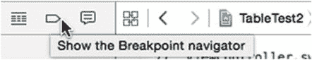

**图 2-4.** 将鼠标指针悬停在图标上会显示该图标功能的简要描述

有些人只使用下拉菜单，另一些人更依赖图标和按键快捷方式，还有一些人会混合使用这三种方法。通常，人们从下拉菜单开始，但当他们开始频繁使用相同命令时，会逐渐转向图标和按键快捷方式。

选择你喜欢的任何方法，但要意识到几乎总是有替代方案。重点是让你通过自己喜欢的方式熟练使用 Xcode，这样你就能花更多时间进行创造性工作，而减少寻找所需命令的时间。

## 修改 Xcode 窗口

由于 Xcode 提供了众多功能，其窗口有时会显得杂乱。为了简化 Xcode 的外观，你有以下几种选择：

-   调整 Xcode 窗口大小，使其变大（或变小）。
-   关闭面板以隐藏 Xcode 的某些部分。
-   打开面板以查看 Xcode 的某些部分。

与所有 Macintosh 窗口一样，调整 Xcode 窗口大小最直接的方式是将鼠标指针移到 Xcode 窗口的边缘或角落，直到鼠标指针变为双向箭头。然后拖动鼠标即可调整窗口大小。

调整 Xcode 窗口大小的第二种方法是点击 Xcode 窗口左上角的绿色圆点。这会将 Xcode 窗口扩展到全屏，同时隐藏 Xcode 菜单栏。要退出全屏模式，只需将鼠标指针移到屏幕顶部，使 Xcode 菜单栏再次出现，然后再次点击窗口左上角的绿色圆点即可。

调整 Xcode 窗口大小的第三种方法是选择 `窗口 ➤ 缩放`。这会在将 Xcode 窗口扩展至填满屏幕（同时仍显示 Xcode 菜单栏）和将 Xcode 窗口缩小回之前大小之间切换。

为了减少任何时刻显示的信息量，Xcode 提供了三个可以隐藏（或打开）的面板，如图 2-5 所示：

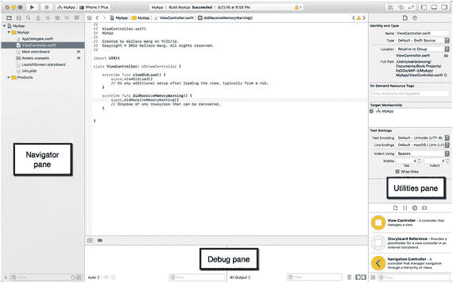

图 2-5. Xcode 的导航面板、调试面板和工具面板

-   **导航面板**：显示关于你项目的信息。
-   **调试区域**：允许你查找程序中的错误或缺陷。
-   **工具面板**：允许你自定义用户界面中的不同项目。

导航面板上显示多个图标，让你可以在不同类型的信息视图之间切换。导航面板最常见的用途是通过显示项目导航器，让你选择要打开的文件。要在隐藏和显示导航面板之间切换，你有三种选择：

-   选择 `视图 ➤ 导航器 ➤ 显示/隐藏导航器`。
-   按下 `Command + 0`（数字零）。
-   点击 Xcode 窗口右上角的“显示/隐藏导航面板”图标，如图 2-6 所示。

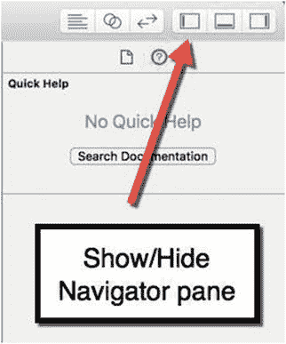

图 2-6. “显示/隐藏导航面板”图标

当你想要检查程序是否正常运行时会用到调试区域。当你设计用户界面或编写 Swift 代码时，你可能希望隐藏这个调试区域。要在隐藏和显示调试区域之间切换，你有三种选择：

-   选择 `视图 ➤ 调试区域 ➤ 显示/隐藏调试区域`。
-   按下 `Shift + Command + Y`。
-   点击 Xcode 窗口右上角的“显示/隐藏调试区域”图标，如图 2-7 所示。

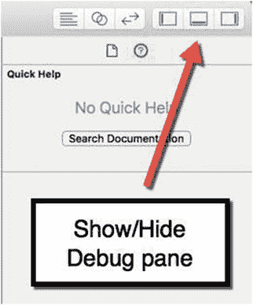

图 2-7. “显示/隐藏调试区域”图标

工具面板上显示多个图标，让你可以在显示不同类型的信息之间切换。工具面板最常见的用途是帮助你设计并修改用户界面。要在隐藏和显示工具面板之间切换，你有三种选择：

-   选择 `视图 ➤ 工具 ➤ 显示/隐藏工具`。
-   按下 `Option + Command + 0`（数字零）。
-   点击 Xcode 窗口右上角的“显示/隐藏工具”图标，如图 2-8 所示。

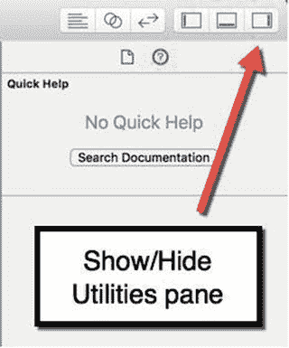

图 2-8. “显示/隐藏工具”图标

通过有选择地显示或隐藏导航面板、调试区域或工具面板，你可以让 Xcode 窗口看起来不那么杂乱，并为你想查看的 Xcode 部分提供更多空间。要快速打开或隐藏这三个面板，点击 Xcode 窗口右上角的“显示/隐藏导航器”、“调试区域”或“工具”图标通常是最快的方式。

## 创建与管理文件

当你需要创建项目（代表一个全新的程序）或文件（添加到现有项目中）时，有两种选择：

- 选择 **文件** ➤ **新建** 显示子菜单，如图 2-9 所示。

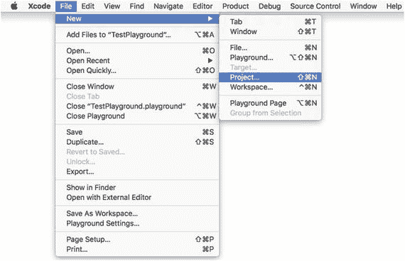

图 2-9. **文件** ➤ **新建**命令会显示一个子菜单，让你选择创建文件或项目

- 在导航器面板中右键点击任意文件，弹出上下文菜单，如图 2-10 所示。

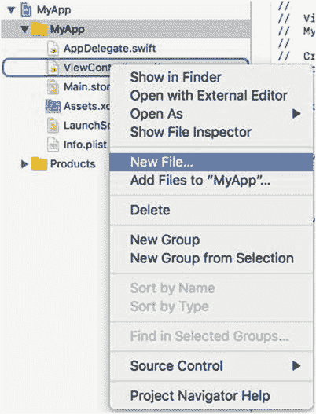

图 2-10. 在导航器面板中右键点击文件会弹出菜单，让你选择创建文件

> **注意**：部分 Macintosh 电脑可能禁用了右键点击功能。你可以按住 `Control` 键同时点击来模拟右键点击。要开启右键点击，请点击苹果菜单，选择系统偏好设置，然后点击鼠标或触控板图标。接着选中“辅助点按”复选框即可开启右键功能。

创建新文件时，你可以选择该文件适用于 macOS、iOS、tvOS 或 watchOS 项目。本书中，你将始终为 macOS 创建文件。

除了选择为 macOS 创建文件外，你还需要选择创建的文件类型。最常见的两种文件类型是：用于存放 Swift 代码的文件（归类在“源代码”类别下，如图 2-11 所示），以及用于存放用户界面的文件（归类在“用户界面”类别下，如图 2-12 所示）。

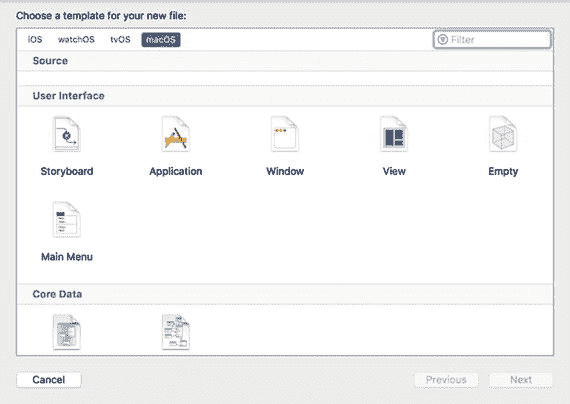

图 2-12. 你可以创建的第二种文件类型用于存放程序的部分用户界面

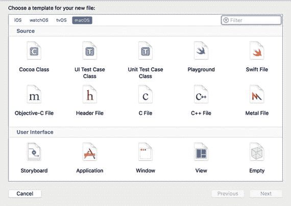

图 2-11. 你可以创建的一种文件类型用于存放 Swift 代码

当你创建文件后，该文件会出现在项目导航器中。导航器面板实际上可以显示多种不同类型的信息，但最常见的是项目导航器，它会列出组成项目的所有文件。要在导航器面板中打开项目导航器，你有三种选择：

- 选择 **视图** ➤ **导航器** ➤ **显示项目导航器**。
- 按下 `Command` + `1`。
- 点击 **显示项目导航器** 图标，如图 2-13 所示。

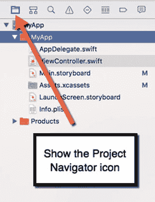

图 2-13. 项目导航器面板会列出组成项目的所有文件

项目导航器与访达非常相似，会显示文件和文件夹。要重命名文件或文件夹，只需选中它并按 `Return` 键即可编辑名称。

要移动文件或文件夹，只需用鼠标将其拖拽到新位置。

要选中一个或多个项目，请按住 `Command` 键并点击文件或文件夹。

与访达一样，项目导航器允许你将文件组织到文件夹中。这样可以让你将相关文件分组，并将其收纳到视线之外，以免杂乱地堆放在项目导航器中。要创建文件夹，请点击项目导航器中的文件或文件夹，然后执行以下任一操作：

- 选择 **文件** ➤ **新建** ➤ **组**（或选择**从所选内容创建组**，将选中的一个或多个文件存入文件夹）。
- 按下 `Option` + `Command` + `N`。
- 在项目导航器中右键点击任意文件或文件夹，在弹出的菜单中选择**新建组**（或选择**从所选内容创建组**，将选中的一个或多个文件存入文件夹）。

要删除文件或文件夹，请选中它并执行以下任一操作：

- 选择 **编辑** ➤ **删除**。
- 按下 `Delete` 键或 `Command` + `Backspace`。
- 在项目导航器中右键点击任意文件或文件夹，在弹出的菜单中选择**删除**。

> **注意**：删除文件或文件夹时，你有两个选项：**移除引用**（从项目中移除文件/文件夹，但不会从 Macintosh 中实际删除）或**移至废纸篓**（从项目中移除文件/文件夹，并从 Macintosh 中实际删除）。

项目导航器最重要的用途或许就是让你能够编辑项目中的文件。当你点击项目导航器中的某个文件时，Xcode 窗口的中间面板会显示所选文件的内容，这些内容要么是 Swift 代码，要么是你的用户界面（见图 2-14）。

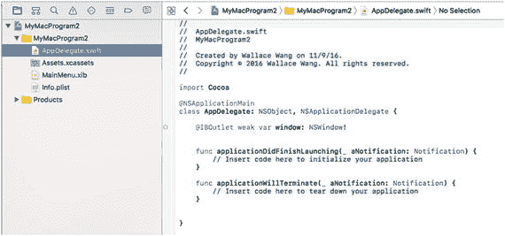

图 2-14. 在导航器面板中选择文件会显示该文件的内容

## 创建和自定义用户界面

`Utilities` 面板最常用于创建和自定义项目的用户界面。在 macOS 程序中，用户界面文件可以是以下两种类型之一：

- `.xib` 文件
- `.storyboard` 文件

创建项目时，你可以选择要使用的类型。通常，`.xib` 文件用于单窗口用户界面，而 `.storyboard` 文件用于按特定顺序链接显示的多个窗口。可以混合使用 `.xib` 和 `.storyboard` 文件来创建用户界面，或者只使用 `.xib` 或 `.storyboard` 文件。

无论你使用 `.xib` 还是 `.storyboard` 文件，你都需要使用 `Utilities` 面板来实现两个目的。首先，你需要将按钮、文本字段和图片等项拖放到用户界面上。其次，你需要通过更改这些用户界面项的名称、颜色或大小来自定义它们。

要设计用户界面，你首先需要使用 `Object Library`，它出现在 `Utilities` 面板的底部，如图 2-15 所示。要打开 `Object Library`，你可以执行以下操作：

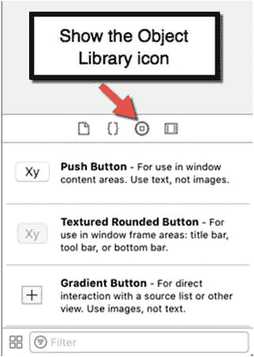

图 2-15. Object Library 包含不同的用户界面项

- 选择 `View` ➤ `Utilities` ➤ `Show Object Library`。
- 按下 `Control` + `Option` + `Command` + `3`。
- 点击 `Show Object Library` 图标。

要在 `Object Library` 中查找用户界面项，你可以简单地上下滚动列表。但是，如果你知道所需项的名称，更快的方法是在 `Object Library` 窗口底部的 `Search` 字段中点击，输入所需项的全部或部分名称，然后按 `Return`。`Object Library` 将仅显示与你输入内容匹配的项。因此，如果你输入了 `"Button"`，`Object Library` 将只显示你可以添加到用户界面的不同按钮。

在用户界面上放置了一个或多个项之后，第二步是使用 `Inspector` 面板自定义这些项。`Inspector` 面板可以显示多种类型的窗格，但你最常用于自定义用户界面项的两个是：

- `Attributes Inspector`
- `Size Inspector`

`Attributes Inspector` 允许你修改项的外观。`Size Inspector` 允许你修改项在用户界面中的大小和位置。

要打开 `Attributes Inspector`，你可以执行以下操作之一：

- 选择 `View` ➤ `Utilities` ➤ `Show Attributes Inspector`。
- 按下 `Option` + `Command` + `4`。
- 点击 `Show Attributes Inspector` 图标，如图 2-16 所示。

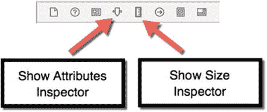

图 2-16. Show Attributes Inspector 和 Show Size Inspector 图标

要打开 `Size Inspector`，你可以执行以下操作之一：

- 选择 `View` ➤ `Utilities` ➤ `Show Size Inspector`。
- 按下 `Option` + `Command` + `5`。
- 点击 `Show Size Inspector` 图标，如图 2-16 所示。

打开 `Attributes` 或 `Size Inspectors` 后，你可以点击一个用户界面项（例如按钮或文本字段）来进行修改，然后输入或选择不同的选项来修改该项的外观。

## 标准编辑器和辅助编辑器

你将大部分时间花在使用编辑器或 `Interface Builder` 上。编辑器的功能类似于文字处理器，允许你输入和编辑 Swift 代码。`Interface Builder` 的功能类似于绘图程序，允许你在用户界面上拖放、调整大小和移动按钮、文本字段和图形等项。

要编辑 Swift 代码，只需在 `Project Navigator` 面板中点击任何包含 `.swift` 文件扩展名的文件。当你点击一个 `.swift` 文件时，该文件的内容会显示在 Xcode 窗口的中间窗格中，如图 2-17 所示。

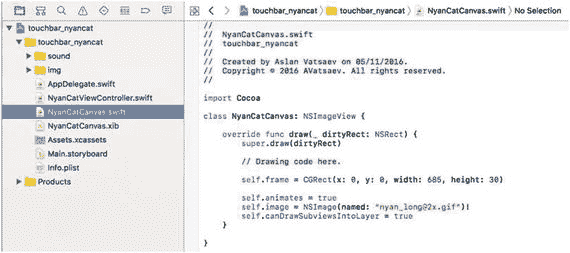

图 2-17. 点击一个 `.swift` 文件会显示该文件中存储的 Swift 代码

要编辑你的用户界面，只需在 `Project Navigator` 面板中点击任何包含 `.xib` 或 `.storyboard` 文件扩展名的文件。这会将该用户界面的内容显示在 Xcode 窗口的中间窗格中，如图 2-18 所示。

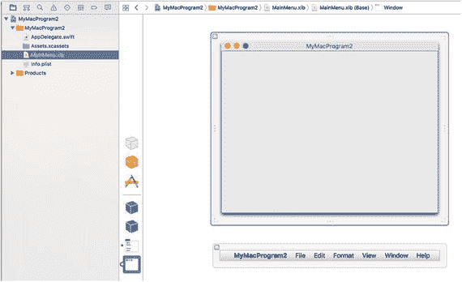

图 2-18. 点击一个 `.xib` 或 `.storyboard` 文件会显示该文件中存储的用户界面

每次你在 `Project Navigator` 面板中点击不同的文件时，Xcode 都会在 Xcode 窗口的中间窗格中显示该新文件的内容。

当 Xcode 在其中间窗格中显示单个文件的内容时，这被称为 `Standard Editor`。但是，并排查看两个文件的内容通常很有用。当 Xcode 并排显示两个文件内容时，第二个文件窗格被称为 `Assistant Editor`。

打开 `Assistant Editor` 最常见的原因是你将用户界面显示在左侧窗格中，将 Swift 文件显示在右侧窗格中，如图 2-19 所示。这样做的目的是让你将用户界面链接到 Swift 代码。

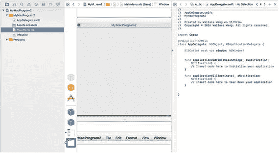

图 2-19. Assistant Editor 并排显示两个文件内容

当你创建用户界面时，它完全独立于你的 Swift 代码（反之亦然）。这让你可以自由地用新的用户界面替换旧用户界面，而不会影响 Swift 代码的行为方式。同样，这也允许你修改 Swift 代码，而无需担心影响用户界面。

在过去，程序员必须使用代码来创建用户界面，这意味着更改代码经常会影响用户界面，增加了程序出错或出现 bug 的可能性。通过将用户界面与代码分离，Xcode 消除了这个问题，并帮助你创建更可靠的软件。

当你最初创建用户界面时，它不会执行任何操作。这就是为什么你需要将一些用户界面项链接到使界面实际工作的 Swift 代码。例如，如果你的用户界面显示一个按钮，点击该按钮不会执行任何操作。你必须编写 Swift 代码来告诉该按钮要做什么。然后，你必须将你的按钮链接到你的 Swift 代码。

这就是 `Assistant Editor` 的目的。通过将你的用户界面显示在你的 Swift 代码文件旁边，`Assistant Editor` 使得从用户界面拖拽鼠标到 Swift 代码文件变得容易，从而在用户界面和 Swift 代码之间建立链接。

要打开 `Assistant Editor`，你可以选择以下方式之一：

- 选择 `View` ➤ `Assistant Editor` ➤ `Show Assistant Editor`。
- 按下 `Option` + `Command` + `Return`。
- 点击 `Assistant Editor` 图标，如图 2-20 所示。

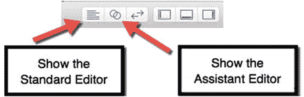

图 2-20. Standard 和 Assistant Editor 图标

要关闭 `Assistant Editor`，你必须通过以下方式之一打开 `Standard Editor`。

*   选择`View ➤ Standard Editor ➤ Show Standard Editor`。
*   按下`Command + Return`。
*   点击`Standard Editor`图标（如图 2-20 所示）。

使用 Assistant Editor 的一个问题是，Xcode 将两个文件的内容都显示在狭窄的窗格中。如果你希望以更宽的视图查看两个或多个文件，可以在单独的标签页中显示它们。这样你可以在 Xcode 的中间窗格中查看每个文件的内容，只需点击标签页即可查看不同文件的内容。

标签页的缺点是你一次只能看到一个文件的内容。第二个缺点是你无法在 Swift 代码旁边看到用户界面，因此无法将用户界面元素连接到你的 Swift 代码。

要创建一个标签页，请选择以下方式之一：

*   选择`File ➤ New ➤ Tab`。
*   按下`Command + T`。

现在你可以点击每个标签页来查看该文件的内容。要关闭一个标签页，将鼠标移到该标签页上，然后选择以下方式之一：

*   点击标签页左侧的关闭图标（看起来像一个大的`X`）。
*   右键点击标签页，在弹出的菜单中点击`Close Tab`，如图 2-21 所示。

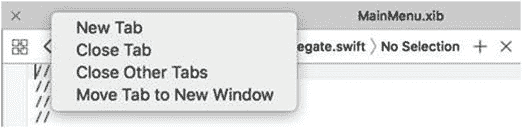

图 2-21。

右键点击标签页会显示一个弹出菜单

## 运行程序

通常你会多次运行程序来测试并确保它工作正常。当你运行程序时，Xcode 会将其编译成一个文件，如果你愿意，可以分发给其他人。运行程序让你可以直接在 Macintosh 上测试你的程序。

运行程序有三种方式：

*   选择`Product ➤ Run`。
*   按下`Command + R`。
*   点击`Run`图标，如图 2-22 所示。

    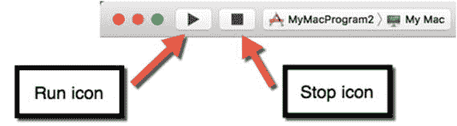

    图 2-22。

    `Run`和`Stop`图标让你可以测试你的 macOS 项目

程序运行后，你可以通过几种方式停止它：

*   选择`YourProgramName ➤ Quit`（其中“`YourProgramName`”是你的项目名称）。
*   点击 Dock 上代表你程序的图标，然后按下`Command + Q`。
*   点击 Xcode 中的`Stop`图标（见图 2-22）。

如果你的程序有严重错误，导致无法响应任何命令，你也可以使用`Force Quit`命令来关闭程序。要使用`Force Quit`，请点击 Apple 菜单并选择`Force Quit`。

当`Force Quit`窗口出现时，点击你的程序名称，然后点击`Force Quit`按钮将其关闭。

### 总结

本章向你介绍了 Xcode 的主要功能，并展示了选择常用命令的各种方式。暂时不必担心记住或完全理解本章的所有内容。将本章视为对 Xcode 的介绍，当你遇到问题时可以随时参考。

在下一章中，你将实际经历使用 Xcode 创建 macOS 程序的典型过程。这样你就可以看到本章所学各种 Xcode 功能的目的。

请记住，使用 Xcode 时，选择完全相同的命令通常有两种或更多方式，但你不必学会所有这些不同的方法。选择你最喜欢的方法，忽略其他方法。

正如你所看到的，Xcode 提供了将你的想法转变为完全功能化的 macOS 程序所需的一切，你可以将其出售并分发给他人。通过学习 Xcode，你将学会使用专业程序员用来创建 macOS、iOS、tvOS 或 watchOS 软件的编程工具。你使用 Xcode 越多，就会越得心应手，Xcode 用户界面的压迫感也会越少。很快你就会像专业人士一样使用 Xcode。

请记住，编程的真正关键不是拥有最好的编程工具，而是知道如何使用它们。你使用 Xcode 越多，就越能理解如何将你的好想法变成真正可运行的程序。学习 Xcode 是你为 Macintosh 和苹果众多其他设备（如 iPhone、iPad、Apple Watch 和 Apple TV）编写软件的途径。通过今天学习 Xcode，你可以抓住现在乃至未来许多有利可图的编程机会。

欢迎来到 Xcode 的世界！

