# 3. 创建 Mac 程序的基础

无论你想创建哪种类型的 macOS 程序，例如视频游戏或专为牙医或房地产经纪人定制的程序，你总是会经历相同的基本步骤。首先，你需要创建一个 macOS 项目。这会创建一个包含通用用户界面的基本 macOS 程序。

其次，你需要以两种方式定制这个通用的 macOS 程序：向用户界面添加元素，以及编写 Swift 代码使程序真正执行某些操作。

第三，你需要运行并测试你的程序。在运行和测试程序之后，你可能需要不断地返回并修改用户界面或 Swift 代码，以修复问题并添加新功能。最终你的程序会达到一个完整的阶段（暂时），然后你可以发布它。然后你会再次重复这些基本步骤，以添加更多新功能。

通常，你花在修改程序上的时间会比创建新程序的时间多。然而，创建小程序来测试不同的功能是很有用的。一旦这些较小的实验性程序能够运行，你就可以将它们添加到另一个程序中。通过这样做，你不会冒着破坏一个正在工作的程序的风险。


## 创建项目

创建程序的第一步是新建一个项目。创建项目时，Xcode 会提供多种模板供你选择，这些模板提供了基础功能，你只需对其进行个性化定制。macOS 模板分为三大类，如图 3-1 所示：

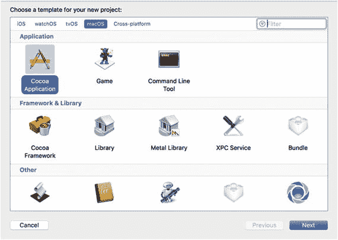

*图 3-1. 创建项目时可供选择的三种 macOS 模板类别*

- 应用程序 (Application)
- 框架与库 (Framework & Library)
- 其他 (Other)

大多数情况下，你会选择“应用程序”类别中的模板。其中最常用的模板是 **Cocoa 应用程序**，它可以创建一个带有下拉菜单和窗口的标准 macOS 程序。

其他两种应用程序模板是“游戏”（用于创建视频游戏）和“命令行工具”（用于创建无需传统图形用户界面的程序）。

“框架与库”类别用于创建可复用的软件库。“其他”类别则适用于创建插件或驱动程序等不属于前两类的程序。

在本书中，你将始终使用 macOS 应用程序类别下的 **Cocoa 应用程序**。其他 macOS 类别专为高级程序员设计，本书将不予涉及。

创建 Cocoa 应用程序项目时，你需要定义几个项目，如图 3-2 所示：

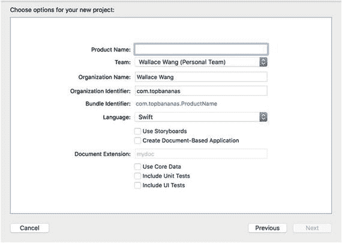

*图 3-2. 定义 Cocoa 应用程序项目*

- 产品名称
- 使用的编程语言（`Objective-C` 或 `Swift`）
- 是否为用户界面使用故事板
- 是否创建基于文档的应用程序
- 是否使用 Core Data

产品名称完全由你决定，但应具有描述性，因为 Xcode 会以你选择的名称命名文件夹来存储所有文件。

组织名称和标识符同样是自定义的，通常从你的 Apple 开发者账号中获取。如果你愿意，这两者也可以使用任意字符串，但如果你计划通过 Mac App Store 分发程序，则应将它们与你的 Apple 开发者账号关联。

“语言”弹出菜单允许你选择 `Objective-C` 或 `Swift`。在本书中，你将始终选择 `Swift`。`Objective-C` 是 Apple 仍在支持的一种更复杂的编程语言，但已不再是 Apple 的官方编程语言。

“使用故事板”复选框允许你创建包含单个窗口（如果取消勾选“使用故事板”，则为 `.xib` 文件）或一系列链接在一起的窗口（如果勾选“使用故事板”，则为 `.storyboard` 文件）的用户界面。我将在本书后面介绍创建用户界面的这两种方法。

“创建基于文档的应用程序”选项意味着 Xcode 会创建一个能打开和管理多个窗口的 Cocoa 应用程序，例如文字处理软件中的多个窗口。管理多个窗口更为复杂，因此除非你需要创建能够打开并在窗口中显示多个文档的程序，否则请保留“创建基于文档的应用程序”复选框为空。在本书中，请保持此复选框未选中。

“使用 Core Data”复选框用于存储数据，通常用于数据库应用程序，如姓名和地址列表。大多数情况下，除非你的程序需要存储数据，否则请保持此复选框未选中。在本书中，请保持此复选框未选中。

“包含单元测试”和“包含 UI 测试”复选框允许你对 Swift 代码和用户界面设计进行测试，以确保其正常工作。在本书中，请保持“包含单元测试”和“包含 UI 测试”复选框为空。

准备好创建你的第一个 macOS 程序了吗？请按照以下步骤操作：

1. 启动 Xcode。如果出现“欢迎使用 Xcode”屏幕（如图 3-3 所示），请点击“创建新的 Xcode 项目”。如果欢迎屏幕未出现，请选择“文件”➤“新建”➤“项目”，或选择“窗口”➤“欢迎使用 Xcode”以显示此屏幕，然后选择“创建新的 Xcode 项目”。Xcode 会显示项目模板列表（参见图 3-1）。

   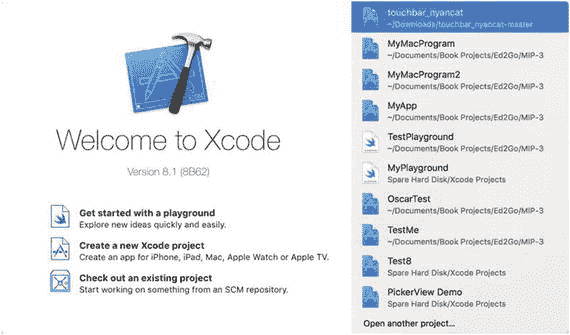

   *图 3-3. 欢迎使用 Xcode 的启动屏幕*

2. 在 macOS 类别下点击“应用程序”。将出现一个包含不同 macOS 应用程序模板的列表。

3. 点击“Cocoa 应用程序”，然后点击“下一步”按钮。Xcode 现在会询问你的项目名称（参见图 3-2）。

4. 点击“产品名称”文本框，并输入 `MyFirstProgram`。

5. 点击“语言”弹出菜单，确保显示的是 `Swift`。

6. 确保所有复选框都处于未选中状态，然后点击“下一步”按钮。Xcode 现在会询问你希望将项目存储在哪里。

7. 点击一个文件夹来存放你的 Xcode 项目，然后点击“创建”按钮。恭喜！你刚刚创建了你的第一个 macOS 程序。至此，Xcode 已经创建了一个通用的 Macintosh 程序，而你甚至还没有编写一行 `Swift` 代码或设计用户界面，就已经创建了一个可以实际运行的程序。

8. 选择“产品”➤“运行”，按下 `Command + R`，或点击“运行”图标。Xcode 会运行你命名为 `MyFirstProgram` 的程序，如图 3-4 所示。请注意，`MyFirstProgram` 显示了一个包含下拉菜单的菜单栏和一个你可以在屏幕上移动或调整大小的窗口。因为你使用了 Cocoa 应用程序模板，Xcode 自动创建了运行一个通用 Macintosh 程序所需的全部代码。

   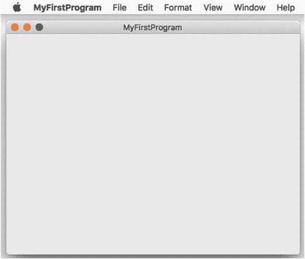

   *图 3-4. MyFirstProgram 运行中*

9. 选择 `MyFirstProgram` ➤ 退出 `MyFirstProgram`。Xcode 界面重新出现。请保持 `MyFirstProgram` 项目在 Xcode 中打开，以便进行下一节的操作。

你几乎无需动手，就成功创建了一个外观和行为都像典型 Macintosh 程序的程序。当然，这个极简的 Macintosh 程序还无法做任何有趣的事情，直到你自定义用户界面并编写 `Swift` 代码，让它真正发挥效用。


## 设计用户界面

在设计用户界面时，请牢记任何用户界面都具备的三个目的：

- 向用户显示信息
- 从用户处获取数据
- 让用户向程序下达命令

当你设计用户界面时，每个元素都必须满足这些标准之一。颜色和线条可能看起来只是装饰性的，但它们可以用来组织用户界面，使用户知道在哪里找到信息、如何输入数据，或如何向程序下达命令。

要在 Xcode 中创建用户界面，你需要遵循一个两步流程：

- 使用对象库将项目拖放到你的用户界面上。
- 使用检查器面板自定义每个用户界面项目。

为了了解如何使用对象库，让我们向 `MyFirstProgram` 用户界面添加一个标签、一个文本字段和一个按钮。标签将向用户显示文本，文本字段将允许用户输入数据，而按钮将使程序从文本字段中获取文本，将其修改为每个字符都大写，然后将修改后的大写文本放入标签中。

为此，请按照以下步骤操作：

1. 确保你的 `MyFirstProgram` 项目已加载到 Xcode 中。
2. 选择“显示”➤“导航器”➤“显示项目导航器”，或按 Command + 1 查看组成 `MyFirstProgram` 项目的所有文件列表。
3. 点击 `MainMenu.xib` 文件。Xcode 会显示用户界面。请注意，在点击 `MyFirstProgram` 图标之前，`MyFirstProgram` 的实际窗口是不可见的。
4. 点击出现在项目导航器与用户界面之间窗格中的窗口图标。这将显示 `MyFirstProgram` 用户界面的窗口，如图 3-5 所示。

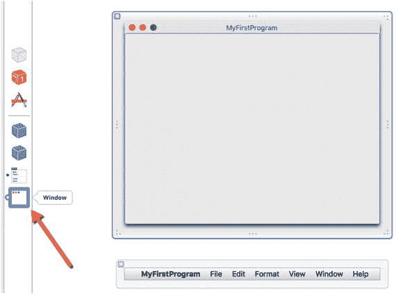

图 3-5. 窗口图标显示 `MyFirstProgram` 用户界面

5. 选择“显示”➤“实用工具”➤“显示对象库”。对象库出现在 Xcode 窗口的右下角。
6. 从对象库中拖出一个按钮，并将其拖放到 `MyFirstProgram` 窗口的底部附近。请注意，当你将按钮放在窗口中间且靠近底部时，会出现蓝色参考线以帮助你对齐用户界面项目，如图 3-6 所示。

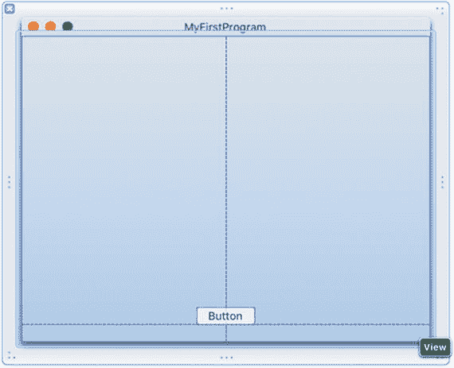

图 3-6. 使用蓝色参考线将按钮放置在 `MyFirstProgram` 窗口底部附近

7. 在对象库的搜索字段中点击，然后输入 `label`。请注意，对象库现在只显示标签用户界面项目，如图 3-7 所示。

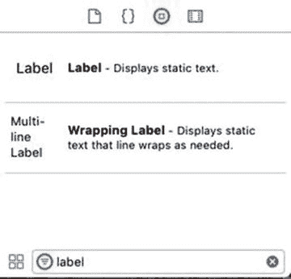

图 3-7. 在搜索字段中键入内容可帮助您轻松找到对象库中的项目

8. 从对象库中拖放一个标签到 `MyFirstProgram` 窗口的中间。
9. 点击出现在对象库底部搜索字段右侧的清除图标（灰色圆圈中的 X）。对象库现在显示所有可能的用户界面项目。
10. 滚动对象库，直到找到文本字段项目。
11. 将文本字段拖放到标签上方，使你的整个用户界面显示如图 3-8 所示。（不必担心每个用户界面项目的精确位置。）

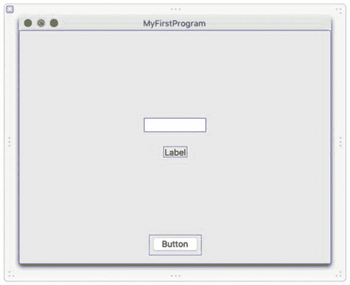

图 3-8. `MyFirstProgram` 用户界面上的一个标签、文本字段和按钮

此时，你已经自定义了通用用户界面。现在你必须使用检查器面板自定义每个用户界面项目。通过检查器面板，你可以为用户界面项目选择不同的选项，例如输入按钮的确切宽度或为文本字段选择背景颜色。

在调整用户界面上项目的大小或移动项目时，你可以在大小检查器面板中输入精确值，或者直接拖动鼠标来调整大小或移动项目。两种方法都可以接受，但大小检查器面板能让你对项目进行精确控制。让我们看看如何使用检查器面板自定义通用用户界面。

1. 点击 `MyFirstProgram` 窗口底部附近的按钮以选中它。
2. 选择“显示”➤“实用工具”➤“显示属性检查器”。属性检查器面板出现在 Xcode 窗口的右上角，如图 3-9 所示。

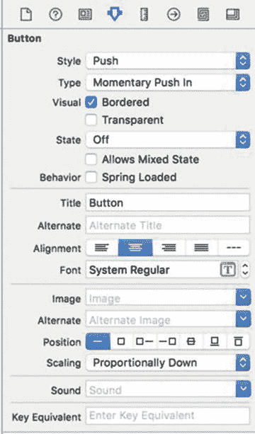

图 3-9. 属性检查器面板允许你自定义项目的外观

3. 在当前显示“Button”的标题文本字段中点击。删除标题文本字段中的任何现有文本，输入 `Change Case`，然后按回车键。按钮上的文本现在显示“Change Case”。但是，按钮的宽度太窄了。
4. 选择“显示”➤“实用工具”➤“显示大小检查器”。大小检查器面板出现在 Xcode 窗口的右上角。
5. 在宽度文本字段中点击，将值更改为 `120`（如图 3-10 所示），然后按回车键。Xcode 会更改按钮的宽度。

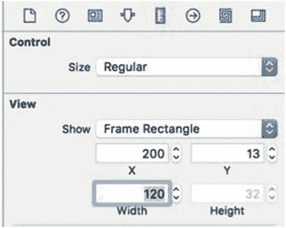

图 3-10. 大小检查器面板中的宽度文本字段

6. 点击标签以选中它。要修改标签的大小，你需要打开大小检查器面板，这可以通过选择“显示”➤“实用工具”➤“显示大小检查器”来完成，但有一种更快的方法，即使用按键快捷键或图标。
7. 按 Option + Command + 5，或直接点击“大小检查器”图标（看起来像一把垂直的尺子）。大小检查器面板出现在 Xcode 窗口的右上角。
8. 在宽度文本字段中点击，输入 `250`，然后按回车键。Xcode 会加宽你的标签的宽度。
9. 点击文本字段以选中它。
10. 按 Option + Command + 5，或直接点击“大小检查器”图标（看起来像一把垂直的尺子）。大小检查器面板出现在 Xcode 窗口的右上角。
11. 在宽度文本字段中点击，输入 `250`，然后按回车键。Xcode 会加宽你的文本字段的宽度。此时，所有用户界面项目都偏离了中心。
12. 拖动每个项目，直到出现蓝色参考线，表明你已将其在 `MyFirstProgram` 窗口中居中，如图 3-11 所示。

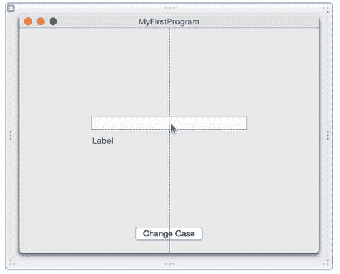

图 3-11. 使用蓝色参考线将项目在用户界面上居中

此时，你已经自定义了用户界面的外观。如果你运行此程序，用户界面看起来会不错，但它实际上不会执行任何操作。要使用户界面正常工作，你还需要完成两个步骤：

- 编写 Swift 代码。
- 将你的用户界面连接到你的 Swift 代码。

你需要编写 Swift 代码使你的程序计算一些有用的结果。你需要将你的用户界面连接到你的 Swift 代码，以便你可以从用户界面检索数据，并将信息显示回用户界面。

在此示例中，你将编写 Swift 代码，该代码从文本字段中检索文本，将其转换为大写，然后在用户点击 `Change Case` 按钮时，将大写文本显示回标签中。

因此，你需要编写将文本转换为大写的 Swift 代码。然后你需要连接文本字段和标签，以便 Swift 代码可以从文本字段检索数据并将新数据放入标签中。

要从用户界面项目发送或检索数据以便 Swift 代码可以访问它，你需要使用一种叫做 `IBOutlet` 的东西。一个 `IBOutlet` 本质上将用户界面项目（例如标签或文本字段）表示为 Swift 代码可以使用的变量。


为了帮助你创建一个`IBOutlet`，请使用助理编辑器。助理编辑器可以让你在左侧窗格中显示用户界面，在右侧窗格中显示你的 Swift 代码。然后，你可以使用鼠标从用户界面元素拖拽到你的 Swift 代码中，从而创建一个将标签或文本字段连接到`IBOutlet`的`IBOutlet`。让我们看看它是如何工作的：

1.  确保选中`MainMenu.xib`文件，以便在屏幕上显示 MyFirstProgram 用户界面窗口。（如果没有选中，请在项目导航器中点击`MainMenu.xib`文件，然后点击 MyFirstProgram 图标以显示用户界面窗口。）

2.  选择 View ➤ Assistant Editor ➤ Show Assistant Editor。助理编辑器会在`MainMenu.xib`文件的用户界面旁边显示`AppDelegate.swift`文件中的 Swift 代码，如图 3-12 所示。

    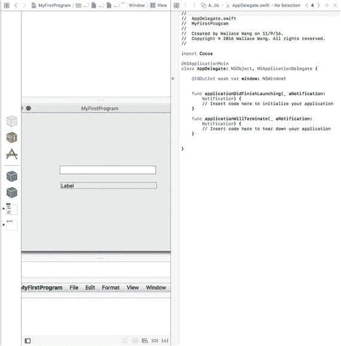

    图 3-12. 助理编辑器让你可以并排查看用户界面和 Swift 代码文件

3.  点击 MyFirstProgram 窗口上的标签。

4.  按住 Control 键，同时将鼠标从标签拖拽到`AppDelegate.swift`文件中`@IBOutlet`行的下方，直到你在 Swift 代码文件中看到一条水平线出现，如图 3-13 所示。

    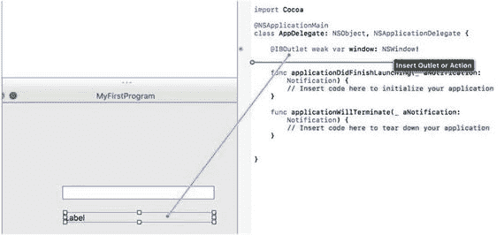

    图 3-13. Control-拖拽会在一个用户界面项和你的 Swift 代码之间创建一个连接

5.  松开 Control 键和鼠标。会弹出一个窗口，如图 3-14 所示。

    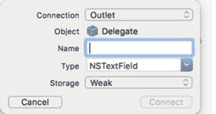

    图 3-14. 弹出窗口让你为你的`IBOutlet`定义一个名称

6.  点击 Name 文本字段，输入`labelText`，然后点击 Connect 按钮。（你选择的名称应该具有描述性，但可以是任何你想要的名称。）Xcode 会在你的 Swift 文件中创建一个如下所示的`IBOutlet`：

    ```
        @IBOutlet weak var labelText: NSTextField!
    ```

7.  点击文本字段以选中它。

8.  按住 Control 键，同时将鼠标从文本字段拖拽到你刚刚创建的`IBOutlet`下方，直到`AppDelegate.swift`文件中出现一条水平线。

9.  松开 Control 键和鼠标。会弹出一个窗口。

10. 点击 Name 文本字段，输入`messageText`，然后点击 Connect 按钮。Xcode 会在你的 Swift 文件中创建第二个如下所示的`IBOutlet`：

    ```
        @IBOutlet weak var messageText: NSTextField!
    ```

我们来回顾一下你刚才的操作。首先，你创建了一个`IBOutlet`来表示标签和文本字段。现在，标签由名称`labelText`表示，文本字段由名称`messageText`表示。当你的 Swift 代码需要从用户界面上的标签或文本字段存储或检索数据时，它可以直接通过名称`labelText`或`messageText`来引用它们。

其次，你在你的 Swift 代码和用户界面元素之间创建了一个链接。现在，你的 Swift 代码可以向你程序用户界面上的标签和文本字段发送数据，也可从中检索数据。

将你的用户界面连接到 Swift 代码是让用户界面真正工作的重要一步。但是，你需要让 Change Case 按钮在用户点击时执行某些操作。要做到这一点，你需要创建一个称为`IBAction`方法的东西。

`IBOutlet`允许 Swift 代码从用户界面元素发送或检索数据，而`IBAction`方法则允许用户界面元素运行执行某些操作的 Swift 代码。在这个例子中，你希望用户将文本输入到文本字段中。然后，程序将获取该文本，将其转换为大写，并将这个转换后的文本显示回标签中。

为此，你需要知道如何执行以下操作：

- 创建一个`IBAction`方法。
- 从文本字段检索文本。
- 将检索到的所有文本转换为大写。
- 将大写的文本存储在标签中。

从文本字段和标签中存储和检索文本是相似的，因为两者都由`IBOutlet`变量定义。让我们看看这些`IBOutlet`的含义：

```
@IBOutlet weak var labelText: NSTextField!
@IBOutlet weak var messageText: NSTextField!
```

对象库中的所有用户界面元素都基于构成 Cocoa 框架的类文件。在这个例子中，你创建了两个名为`labelText`和`messageText`的`IBOutlet`变量，它们都基于`NSTextField`类文件。

如果你在 Xcode 的文档中查找`NSTextField`类文件，你会看到一长串属性列表，任何基于`NSTextField`的对象都可以拥有这些属性。但是，你找不到任何描述用于保存文本的属性的内容。

但是，如果你还记得第 1 章的内容，面向对象编程意味着类文件可以继承自其他类文件。在这个例子中，`NSTextField`类继承自另一个名为`NSControl`的类。在 Xcode 文档中查找`NSControl`（你将在下一章学习如何操作），你可以看到`NSControl`有一个名为`stringValue`的属性用于保存文本，如图 3-15 所示。

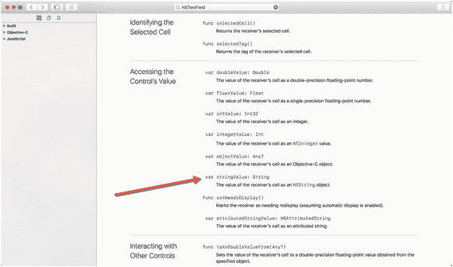

图 3-15. Xcode 的文档显示了 `NSControl` 用于保存文本的属性

要访问存储在文本字段中的文本，你需要通过名称（`messageText`）及其保存文本的属性（`stringValue`）来标识该文本字段，例如：

```
messageText.stringValue
```

要在标签中显示文本，你需要通过名称（`labelText`）及其保存文本的属性（`stringValue`）来标识该标签，例如：

```
labelText.stringValue
```

下一个问题是，如何将文本转换成大写？Swift 将文本存储在一个名为`String`的数据类型中，它具有一个名为`uppercased`的方法，如图 3-16 所示。

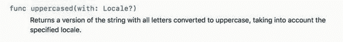

图 3-16. Xcode 的文档显示了 `NSString` 类有一个名为 `uppercaseString` 的方法用于将文本转换为大写

要转换存储在文本字段（由名为`messageText`的`IBOutlet`表示）中的文本，你只需在`IBOutlet`的`text`属性上应用`uppercaseString`方法，如下所示：

```
messageText.stringValue.uppercased
```

这个 Swift 代码的意思是：获取`messageText`对象（即用户界面上的文本字段），检索它包含的文本（在`stringValue`属性中），并对该文本应用`uppercased`方法。

现在你已经知道如何从文本字段检索文本、将其转换为大写以及将新文本存储回标签，最后一步是编写一个`IBAction`方法，在其中包含执行所有这些操作的代码。每当用户点击 Change Case 按钮时，都需要运行这个`IBAction`方法。因此，你需要创建一个`IBAction`方法并将其链接到 Change Case 按钮。

1.  确保助理编辑器仍然打开，并且并排显示用户界面和`AppDelegate.swift`文件。

2.  点击 MyFirstProgram 用户界面上的 Change Case 按钮以选中它。

3.  按住 Control 键，同时将鼠标拖拽到最后一个花括号上方，直到出现一条水平线，如图 3-17 所示。

    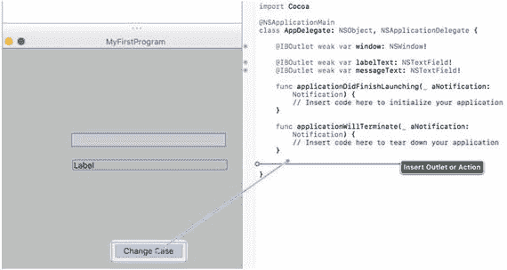

    图 3-17. 从按钮 Control-拖拽到 `AppDelegate.swift` 文件

4.  松开 Control 键和鼠标。会弹出一个窗口。

5.  点击 Connection 弹出菜单，然后选择 Action，如图 3-18 所示。

    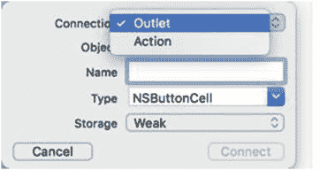

    图 3-18.


## 创建操作连接（Action connection）

6. 在名称（Name）文本栏中单击，然后键入 `changeCase`（您选择的名称应具有描述性，但可以是您想要的任何名称。）
7. 在类型（Type）弹出菜单中单击，然后选择 `NSButton`，如图 3-19 所示。接着点击连接（Connect）按钮。Xcode 会创建一个如下所示的 `IBAction` 方法：

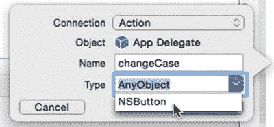

图 3-19. 为 `IBAction` 方法选择类型

```
@IBAction func changeCase(_ sender: NSButton) {
}
```

至此，您已经创建了一个 `IBAction` 方法，该方法会在用户每次单击“更改大小写”（Change Case）按钮时运行。当然，这个 `IBAction` 方法内部还没有 Swift 代码，因此现在您需要在定义 `IBAction` 方法起始和结束的花括号内键入 Swift 代码。

1. 确保 Xcode 仍然并排显示您的用户界面和 `AppDelegate.swift` 文件。
2. 选择 视图（View）➤ 标准编辑器（Standard Editor）➤ 显示标准编辑器（Show Standard Editor）。Xcode 现在只显示您的 MyFirstProgram 用户界面。
3. 在项目导航器（Project Navigator）中单击 `AppDelegate.swift` 文件。Xcode 会显示存储在 `AppDelegate.swift` 文件中的所有 Swift 代码。
4. 如下所示编辑 `IBAction` 的 `changeCase` 方法：

```
@IBAction func changeCase(_ sender: NSButton) {
    labelText.stringValue = messageText.stringValue.uppercased()
}
```

5. 选择 产品（Product）➤ 运行（Run）。您的 MyFirstProgram 程序开始运行。
6. 在 MyFirstProgram 用户界面的文本栏中单击，并键入 `hello, world`。
7. 单击“更改大小写”（Change Case）按钮。标签会显示 `HELLO, WORLD`，如图 3-20 所示。

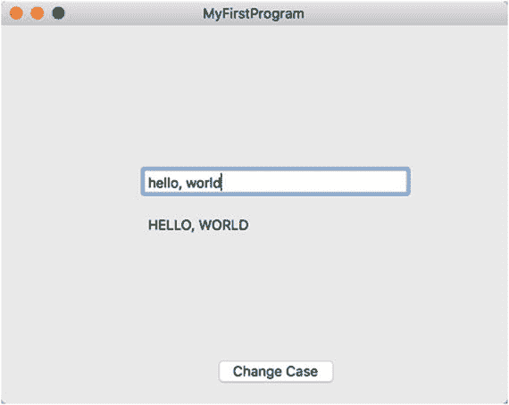

图 3-20. 运行 MyFirstProgram

8. 选择 MyFirstProgram ➤ 退出 MyFirstProgram（Quit MyFirstProgram）。Xcode 再次出现。

如您所见，您几乎没写多少 Swift 代码就创建了一个简单的 Macintosh 程序。您实际编写的 Swift 代码只是单行代码，它获取存储在文本栏中的文本，将其转换为大写，然后将这个大写的文本存储在标签中。

Swift 的强大之处很大程度上在于尽可能地依赖 Apple 的 Cocoa 框架，该框架会显示一个用户可以移动或调整大小的窗口。此外，Cocoa 框架还会创建您可以修改的下拉菜单。要理解 Cocoa 框架，您必须理解面向对象编程，以及类如何定义属性（用于存储数据）和方法（用于操作数据），并理解如何使用继承——这些内容将在下一章中进一步学习。

重点在于理解 Xcode 是如何创建通用的 macOS 程序，这样您只需要设计和定制用户界面，然后编写 Swift 代码让它全部运作起来。

### 使用文档大纲和连接检查器

在结束对创建第一个 Macintosh 程序的简短介绍之前，让我们看看另外两个将来使用 Xcode 时会有帮助的工具：文档大纲（Document Outline）和连接检查器（Connections Inspector）。

文档大纲列出了构成用户界面的所有项目。要打开或隐藏文档大纲，请单击用户界面文件（左窗格中的 `.xib` 或 `.storyboard` 文件），然后执行以下操作之一，如图 3-21 所示：

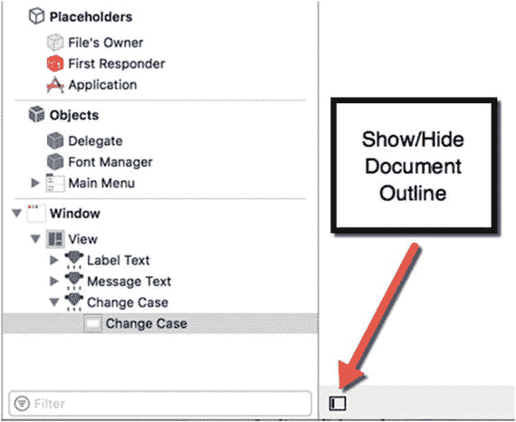

图 3-21. 文档大纲

- 选择 编辑器（Editor）➤ 显示/隐藏文档大纲（Show/Hide Document Outline）。
- 单击文档大纲图标。

文档大纲让您可以轻松选择用户界面上的不同项目。在您的 MyFirstProgram 中，只有三个项目（一个标签、一个文本栏和一个按钮），但在更复杂的用户界面中，可能会有更多项目，它们可能隐藏在其它项目后面，或者太小不易看清。

如果您在文档大纲中单击一个项目，Xcode 会在用户界面中选中该项目（反之亦然），如图 3-22 所示。

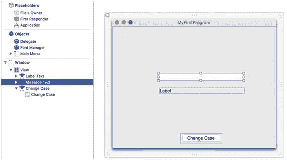

图 3-22. 在文档大纲窗口中单击一个项目会在用户界面上选中该项目

可以将文档大纲视为一种快速查看用户界面的所有部分并仅选择所需项目的方法。

一旦您开始通过 `IBOutlet` 和 `IBAction` 方法将用户界面项目连接到您的 Swift 代码，您可能会想知道哪些项目连接到了哪些 `IBOutlet` 和 `IBAction` 方法。要查看 `IBOutlet`/`IBAction` 方法与用户界面项目之间的连接，您有两种选择。

首先，您可以使用连接检查器。其次，您可以使用助理编辑器（Assistant Editor）。

要打开连接检查器，首先单击您想要检查的用户界面中的任意项目，然后执行以下操作之一，以显示位于 Xcode 窗口右上角的连接检查器，如图 3-23 所示：

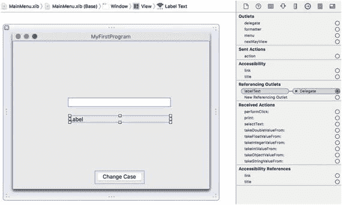

图 3-23. 连接检查器显示当前所选用户界面项目的所有连接

- 选择 视图（View）➤ 工具（Utilities）➤ 显示连接检查器（Show Connections Inspector）。
- 按下 Option + Command + 6 键。
- 单击显示连接检查器图标。

连接检查器会显示包含与所选用户界面项目相连的 `IBOutlet` 或 `IBAction` 方法的 Swift 文件。

注意：如果仔细查看，连接检查器会在链接到当前所选用户界面项目的 Swift 文件左侧显示一个 X。如果您单击这个 X，就可以断开用户界面项目与其 `IBOutlet` 或 `IBAction` 方法之间的链接。

查看哪些 `IBOutlet` 和 `IBAction` 方法连接到用户界面项目的另一种方法是打开用户界面（例如单击 `MainMenu.xib` 文件），然后打开助理编辑器。

在 Swift 文件中每个 `IBOutlet` 和 `IBAction` 方法的左侧，您会看到一个灰色圆圈。当您将鼠标指针移到灰色圆圈上时，Xcode 会高亮显示连接到该 `IBOutlet` 或 `IBAction` 方法的用户界面项目，如图 3-24 所示。

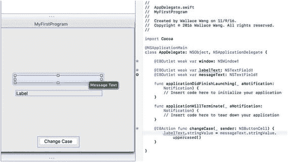

图 3-24. 助理编辑器允许您查看哪些 `IBOutlet` 和 `IBAction` 方法连接到了用户界面项目


### 摘要

Xcode 是你设计、编写和修改自己的 macOS 程序所需的唯一程序。当你想要创建一个 macOS 程序时，只需遵循以下基本步骤：

- 选择一个项目模板（通常为 **Cocoa Application**）。
- 设计并自定义用户界面。
- 将用户界面元素连接到 `IBOutlets` 和 `IBAction` 方法。
- 编写 Swift 代码使 `IBAction` 方法执行相应操作。
- 运行并测试你的程序。

要设计用户界面，你需要从对象库中拖放元素，然后使用属性检查器和尺寸检查器来自定义每个用户界面元素。为帮助你选择用户界面元素，你可以使用文稿大纲。

设计好用户界面后，你需要通过 `IBOutlets`（用于检索或显示数据）和 `IBAction` 方法（用于让用户界面执行操作），使用助理编辑器将用户界面连接到 Swift 代码。

要检查用户界面元素与 Swift 代码之间的连接，你可以使用连接检查器或助理编辑器。

你已经可以看到 Xcode 的不同部分如何协同工作来帮助你创建程序，而我们尚未探索 Xcode 的许多其他功能。创建 Macintosh 程序时最令人困惑的部分，或许在于编写 Swift 代码以及使用构成 Cocoa 框架的类文件中存储的方法，因此下一章将对此进行更详细的说明。

如你所见，只要专注于实际需要的功能并忽略其余部分，使用 Xcode 实际上相当简单。随着每一章的学习，你会逐渐了解更多关于 Xcode 和 Swift 编程的知识。

你已经学到了如此多关于 Xcode 的知识，而这仅仅是个开始。

