# 4. 获取帮助

学习任何新技能的最好方法是有人向你展示需要学习的内容。既然这并非总是可行，那么你会高兴地知道，Xcode 自带了很多内置帮助功能，让使用 Xcode 不再那么有压力，而是更加愉快。

要使用 Xcode 的帮助，你首先需要理解 Swift 程序如何工作，以及它们如何与 Cocoa 框架协同工作。一旦你理解了典型的 macOS 程序如何运作以及它如何依赖 Cocoa 框架，你就能更好地理解如何获取所需的帮助，以及如何理解你在 Xcode 中找到的帮助信息。

## 理解 Cocoa 框架

使用 Xcode 时，你必须理解你创建的每个程序都基于 Cocoa 框架，该框架包含各种属性和方法的类。通过使用这些现有的类，你可以节省时间，而无需自己编写和测试代码。相反，你可以直接使用 Cocoa 框架中已有的、已经过测试的代码。这让你能够腾出更多时间专注于编写特定于你程序的独特代码。

要使用 Cocoa 框架，你必须理解面向对象编程的原理以及对象如何工作。要创建一个对象，你首先必须定义一个类。类包含定义属性（用于保存数据）和方法（用于操作存储在其属性中的数据）的实际代码。定义好类之后，你可以基于该类定义一个或多个对象。

就像饼干模具定义了饼干的形状，但并非实际的饼干一样，类定义了对象，但并非实际的对象。

Cocoa 框架由多个类文件组成，其中许多类文件继承自其他类文件的属性和方法。当你创建 macOS 程序时，你通常会基于 Cocoa 框架的类文件创建对象。事实上，你从对象库中创建的每个用户界面元素都基于一个 Cocoa 框架的类。

为了查看每个用户界面元素基于哪个类文件，我们来检查你创建的三个用户界面元素：一个标签、一个文本字段和一个按钮。

1. 在 Xcode 中打开 `MyFirstProgram` 项目。
2. 点击 `MainMenu.xib` 文件。Xcode 会显示你的用户界面。
3. 选择 **View** ➤ **Utilities** ➤ **Show Object Library**。对象库会出现在 Xcode 窗口的右下角。
4. 点击 **Push Button** 元素。会出现一个弹出窗口，如图 4-1 所示。请注意，这个弹出窗口会告诉你类文件（`NSButton`），并描述 `NSButton` 类文件的功能。

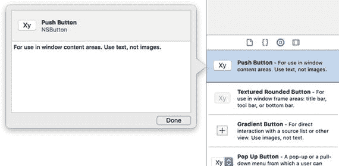

图 4-1 查找按钮的类文件

5. 点击 **Done** 按钮关闭弹出窗口。
6. 浏览对象库并点击 **Label** 元素。会出现一个弹出窗口，如图 4-2 所示。这个弹出窗口会告诉你类文件（`NSTextField`），描述 `NSTextField` 类文件的功能，并告诉你 `NSTextField` 类继承自（是...的子类）`NSControl` 类。

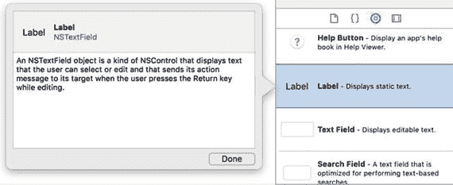

图 4-2 查找标签的类文件

7. 浏览对象库并点击 **Text Field** 元素。会出现一个弹出窗口，如图 4-3 所示。如果你到目前还没注意到，可以存储数据的用户界面元素通常继承自 `NSControl` 类文件的属性和方法。

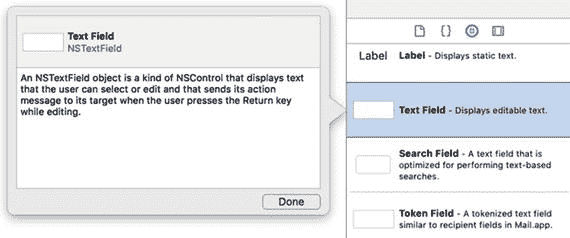

图 4-3 查找文本字段的类文件

通过使用 Xcode 针对对象库中每个元素提供的简单帮助弹出窗口，你了解了关于用户界面的以下信息：

- 按钮基于 `NSButton` 类文件。
- 标签基于 `NSTextField` 类文件。
- 文本字段也基于 `NSTextField` 类文件。
- `NSButton` 类和 `NSTextField` 类都继承自（是...的子类）`NSControl` 类。

任何时候你需要查找某个用户界面元素的类文件，只需在对象库窗口中点击该元素即可。要了解每个用户界面元素可用的属性和方法，你需要查找该特定类的所有属性和方法。例如，如果你想知道文本字段可以使用哪些属性和方法，你必须查找 `NSTextField` 类定义的属性和方法。

此外，由于 `NSTextField` 类继承自 `NSControl` 类，你还可以使用 `NSControl` 类定义的任何属性和方法。（如果 `NSControl` 类又继承自另一个类，你也可以使用那个类中存储的属性和方法。）

注意

每个类名称前的 `NS` 前缀代表 **NextStep**，这是最初创建 macOS 和 Cocoa 框架的公司。当 Apple 收购 NextStep 时，他们只是保留了 `NS` 前缀。

## 在类文件中查找属性和方法

一旦你知道了某个特定用户界面元素基于哪个类，你可以在 Xcode 文档中查找其属性和方法列表。有两种方法可以做到这一点：

- 选择 **Help** ➤ **Documentation and API Reference**。
- 按住 Option 键并点击 Swift 代码中的类名。

还记得你需要查找标签和文本字段中存储文本的属性吗？以下是查找此信息的步骤：

- 确定每个用户界面元素基于的类文件（`NSTextField`，这是你通过在对象库中点击该元素了解到的）。
- 在 Xcode 文档中查找关于 `NSTextField` 类文件的信息。
- 如果在 `NSTextField` 类文件中找不到所需的信息，请查找 `NSControl` 类文件，因为 `NSTextField` 类继承了 `NSControl` 类的所有属性和方法。


### 使用帮助菜单查找类文件

Xcode 的菜单栏和下拉菜单通常是查找任何命令最直接的方式。因此，第一步是打开 Xcode 的文档窗口，如图 4-4 所示，可通过以下两种方式之一打开：

1.  点击文档窗口顶部的“搜索文档”文本字段，输入 `NSTextField`，然后按 Return 键。文档窗口会显示关于 `NSTextField` 类的信息，如图 4-5 所示。

    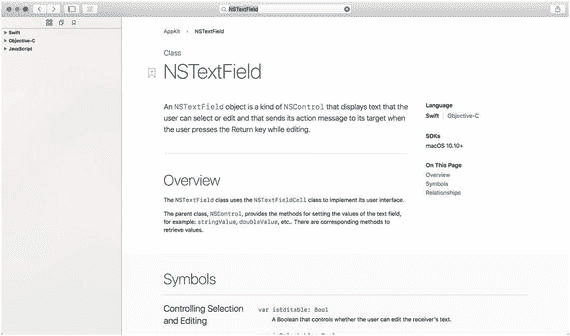

    图 4-5. 文档窗口显示了关于 `NSTextField` 类的信息

2.  滚动浏览关于 `NSTextField` 类的信息。然而，`NSTextField` 文档中并没有解释它是如何存储文本的。要找到答案，您需要接下来查看 `NSTextField` 的父类，即“概述”类别下的 `NSControl`。
3.  点击 `NSControl`（它显示为蓝色超链接）。
4.  向下滚动到“访问控件的值”部分，查看所有基于 `NSTextField` 类的对象中检索数据的不同方法，如图 4-6 所示。

    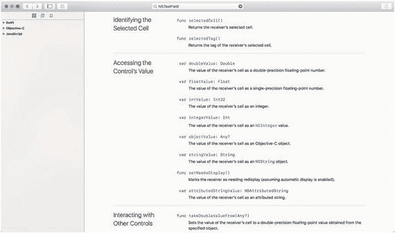

    图 4-6. 文档窗口列出了 `NSTextField` 中存储数据的所有属性

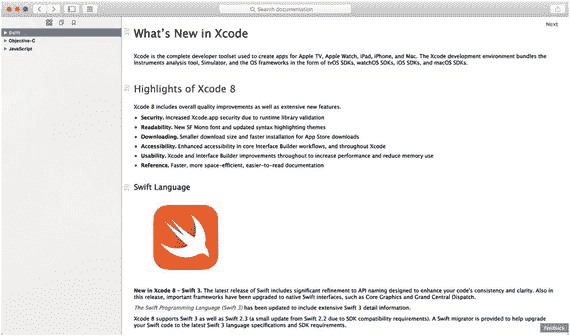

图 4-4. Xcode 文档窗口

*   选择 帮助 ➤ 文档和 API 参考。
*   按下 Shift + Command + 0（数字零）。

一旦您知道可以使用 `stringValue` 属性来保存任何基于 `NSTextField` 类的对象的文本数据，您就知道可以使用 `stringValue` 属性来访问标签和文本字段的文本数据。

## 使用快速帮助查找类文件

使用文档窗口查找类文件很方便，但 Xcode 还提供了另一种称为“快速帮助”的方法。要使用快速帮助，您可以将光标或鼠标指针移动到包含 Swift 代码文件中的类文件名上，然后选择以下方法之一：

*   选择 帮助 ➤ 所选项目的快速帮助。
*   按下 Control + Command + Shift + ?。
*   按住 Option 键并点击类文件名。

快速帮助随后会显示一个弹出窗口，其中包含所选类文件的简要描述，并提供选项让您可以选择在文档窗口中查看完整描述。要了解如何使用 Option 键和鼠标操作快速帮助，请按照以下步骤操作：

1.  确保 MyFirstProgram 已加载到 Xcode 中。
2.  在项目导航器中点击 `AppDelegate.swift` 文件。Xcode 会在中间窗格中显示 `AppDelegate.swift` 文件的内容。
3.  按住 Option 键，并将鼠标移动到 `IBOutlet` 中的 `NSTextField` 单词上。鼠标指针会变成一个问号，如图 4-7 所示。

    

    图 4-7. 当鼠标悬停在类文件名上时，按住 Option 键会使其指针变成问号

4.  在按住 Option 键且鼠标指针位于 `NSTextField` 上的同时，点击鼠标。Xcode 会显示一个弹出窗口，简要描述 `NSTextField` 类的功能，如图 4-8 所示。

    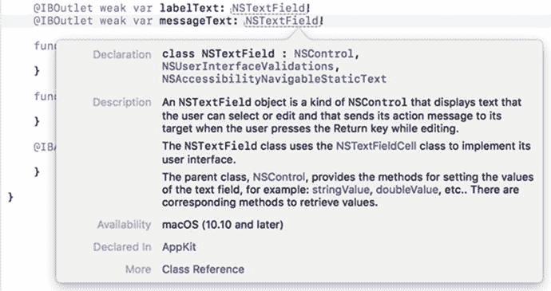

    图 4-8. Option + 点击类文件名会显示一个描述该类的弹出窗口

5.  点击弹出窗口底部“参考”标签旁的“类参考”。Xcode 会显示文档窗口，列出 `NSTextField` 类文件（见图 4-5）。

Option + 点击只是打开文档窗口的一种方式，无需通过“帮助 ➤ 文档和 API 参考”命令并输入类文件名。

## 浏览文档

快速帮助可以显示特定类文件的信息，但如果您知道自己需要信息却不知道在哪里找到它，该怎么办呢？这时您可以花时间浏览文档窗口，快速翻阅不同的帮助主题，直到找到所需内容。

即使您没有找到想要的内容，您也很有可能偶然发现一些关于 Xcode 或 macOS 的有趣信息，这些信息将来可能会派上用场。

如果您发现了有趣的信息，可以将其添加书签，以便日后快速再次找到。您还可以通过电子邮件或短信发送信息，因此请随时与他人分享有用的信息。

要浏览文档，请按照以下步骤操作：

1.  选择 帮助 ➤ 文档和 API 参考。文档窗口出现。
2.  点击“浏览 API 参考文档”图标。左窗格会显示一个列表，列出了创建 macOS 程序时可用的不同框架，如图 4-9 所示。

    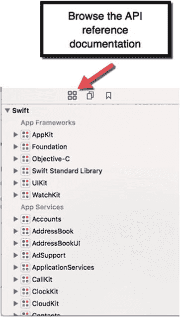

    图 4-9. 查看可用的框架

3.  点击类别（如 HealthKit 或 Core Data）左侧显示的灰色展开三角。一个附加主题列表（带有各自的灰色展开三角）会出现。通过继续点击主题的展开三角，您最终会找到可以点击查看信息的主题列表，如图 4-10 所示。

    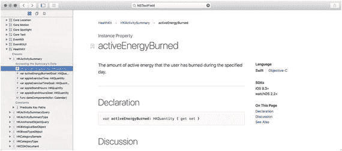

    图 4-10. 每个类别列出了几个其他不同主题的类别

4.  点击“浏览指南和示例代码”图标。会出现一个不同主题的列表，如图 4-11 所示。

    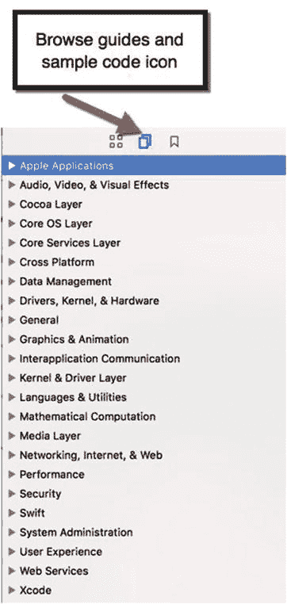

    图 4-11. “浏览指南和示例代码”图标显示了 macOS 编程的各种主题

5.  点击类别（如“安全”或“图形与动画”）左侧显示的灰色展开三角。一个附加主题列表（带有各自的灰色展开三角）会出现。通过继续点击主题的展开三角，您最终会找到可以点击查看信息的主题列表，如图 4-12 所示。

    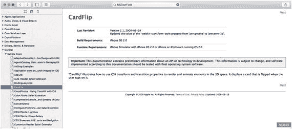

    图 4-12. 查看特定编程技术或示例代码的信息


## 搜索文档

快速帮助可以显示特定类文件的信息，而浏览文档则能帮助你探索有关 Cocoa 框架和 macOS 编程的海量信息。问题在于，快速帮助仅适用于查找类文件的信息，并且浏览文档可能非常耗时。如果你清楚自己想找什么，直接搜索会更高效。

在搜索信息时，请尽可能输入更多内容以缩小搜索范围。如果只输入单个字母或单词，Xcode 的文档会向你抛出大量不相关的结果。

要了解文档搜索窗口的工作原理，请尝试以下步骤：

1. 选择“帮助”➤“文档和 API 参考”。文档窗口随即出现。
2. 点击“搜索文档”文本字段并输入文本。此时会显示一个包含不同文本结果的菜单，你可以点击获取更多信息，如图 4-13 所示。

   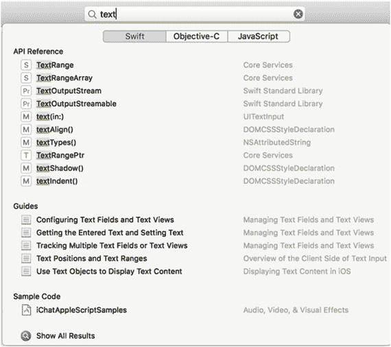

   图 4-13. 搜索“text”的结果菜单
3. 点击某个主题以查看该信息。

通过搜索 Xcode 的文档，你可以快速轻松地找到所需内容。

## 使用代码补全

在第 3 章中，当你开始输入 Swift 代码时，可能注意到了某些奇怪的现象。每次输入部分 Swift 命令时，Xcode 编辑器可能会显示灰色文本和一个包含与你已输入内容相匹配的可能命令的菜单；请参见图 4-14。

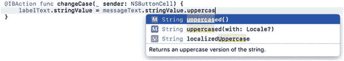

图 4-14. 代码补全提示你可能正在尝试输入的命令

此功能称为代码补全，是 Xcode 帮助你插入长命令的方式，而无需你亲自键入每个字符。当你看到灰色文本和菜单时，有三种选择：

* 按下 Tab 键，让 Xcode 自动键入部分灰色文本（你可能需要多次按 Tab 键才能完全选中所有灰色文本）。
* 双击弹出菜单中的某个命令以自动键入该命令。
* 继续手动输入。

如果你继续输入，Xcode 会持续显示新的灰色文本（它认为你可能正在尝试输入的内容），同时显示一个包含与你已输入内容匹配的不同命令的菜单。我们来看看代码补全是如何工作的。

要了解代码补全的工作原理，请尝试以下步骤：

1. 确保你的 `MyFirstProgram` 已在 Xcode 中加载。
2. 在项目导航器窗格中点击 `AppDelegate.swift`。`AppDelegate.swift` 文件的内容会显示在 Xcode 的中间窗格中。
3. 修改 `@IBAction changeCase (sender: NSButton)` 代码，删除花括号之间的那一行代码，使其现在显示如下：

   ```
   @IBAction func changeCase(_ sender: NSButton) {
   }
   ```

4. 将光标移动到此 `@IBAction` 方法的花括号之间，然后输入 `labelText.s`，此时会注意到灰色文本出现，并且一个包含可能命令的菜单也随之出现，如图 4-15 所示。

   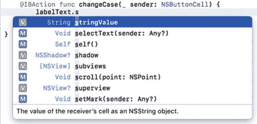

   图 4-15. 代码补全提示 `stringValue` 作为可能命令
5. 按下 Tab 键。第一次按 Tab 键时，Xcode 会键入 `"string"`。
6. 第二次按下 Tab 键，现在 Xcode 会键入完整的 `"stringValue"`。
7. 输入 `= messageText.stringValue.uppercased()`。请注意，在你输入时，代码补全会持续在弹出菜单中显示不同的灰色文本和命令。

通过使用代码补全，你可以更快、更准确地输入命令。如果你开始输入一个命令，但没有看到代码补全的灰色文本或菜单出现，这可能是一个信号，表示你输入的命令有误。代码补全只是 Xcode 让输入代码变得更简单的另一种方式。

## 理解 macOS 程序如何工作

为了帮助你更好地理解 Xcode 所有帮助文档的含义，你需要了解 macOS 程序是如何工作的。在过去程序规模较小的时候，程序员将所有程序命令存储在一个文件中。然后计算机从文件顶部的第一个命令开始，逐行执行，直到文件末尾才停止。

如今程序规模大得多，因此它们通常被分割成多个文件。无论你将程序分成多少个文件，Xcode 都会将它们视为存储在一个文件中。将程序分割成多个文件是为了方便你管理。

让我们逐行分析你的 `MyFirstProgram`，以便你理解发生了什么。当你在 Xcode 中查看 Swift 代码时，你会注意到 Xcode 编辑器用不同颜色标记不同的文本。这些颜色有助于你识别不同文本的用途，具体如下：

* 绿色：注释，Xcode 会完全忽略它们。注释用于解释附近代码的用途。
* 紫色：Swift 语言的关键字
* 红色：文本字符串
* 蓝色：类文件名
* 黑色：命令

第一行代码告诉 Xcode 导入或包含 Cocoa 框架中的所有代码作为程序的一部分。这行代码如下：

```
import Cocoa
```

下一行代码运行一个 Swift 函数，用于加载你的用户界面（`MainMenu.xib`），并从你的 `AppDelegate` 类创建一个对象。这基本上让你的整个程序作为一个通用的 Macintosh 程序运行。这行代码如下：

```
@NSApplicationMain
```

下一行代码定义了一个名为 `AppDelegate` 的类，它基于 `NSObject` 类，并使用了 `NSApplicationDelegate` 协议（稍后你将了解）。这行代码如下：

```
class AppDelegate: NSObject, NSApplicationDelegate {
```

接下来的三行代码定义了 IBOutlets，用于将此 Swift 代码连接到用户界面元素：用户界面的窗口以及标签和文本字段。窗口基于 `NSWindow` 类（定义在 Cocoa 框架中），而标签和文本字段基于 `NSTextField` 类。这些行代码如下：

```
@IBOutlet weak var window: NSWindow!
@IBOutlet weak var labelText: NSTextField!
@IBOutlet weak var messageText: NSTextField!
```

每次 Xcode 创建一个新的 macOS Cocoa 应用程序项目时，你都会看到两个不执行任何操作的空函数。如果你在这些函数内输入代码，代码会在程序启动后立即运行（`applicationDidFinishLaunching`），或者在程序结束时立即运行（`applicationWillTerminate`）。目前，请将这些函数保留原样，不必理会。

接下来的三行代码定义了一个 IBAction 方法，它连接到用户界面上的推送按钮。该代码获取存储在 `messageText`（文本字段）中的文本，并将其转换为大写。然后将大写文本存储到 `labelText`（标签）中。标签和文本字段都基于 `NSTextField` 类（定义在 Cocoa 框架中）。这些行代码如下：

```
@IBAction func changeCase(_ sender: NSButton) {
labelText.stringValue = messageText.stringValue.uppercased()
}
```

当 `MyFirstProgram` 运行时，它会导入 Cocoa 框架并运行，在屏幕上显示一个包含你用户界面的通用 Macintosh 程序。`applicationDidFinishLaunching` 函数会运行，但由于它不包含任何代码，因此什么也不会发生。之后程序停止并等待某些事件发生。

如果用户退出程序，`applicationWillTerminate` 函数将运行，但由于它不包含任何代码，因此什么也不会发生。


当用户点击 Change Case 按钮时，会运行 IBAction 方法`changeCase`。该 IBAction 方法中唯一的 Swift 命令会获取文本字段中的文本（存储在`messageText`的`stringValue`属性中），将其转换为大写，并将转换后的文本存储在标签中（由`labelText`的`stringValue`属性显示）。

了解了 MyFirstProgram 的工作原理后，让我们从更理论化的角度来看 macOS 编程。首先，创建程序需要用到 Cocoa 框架定义的类文件。当你在用户界面上放置元素时，你使用的正是 Cocoa 框架的类文件（例如`NSTextField`和`NSButton`）。

当你在`AppDelegate.swift`文件中定义类时，你使用的也是 Cocoa 框架文件中的类（`NSObject`）。

一个典型的 macOS 程序会从 Cocoa 框架的类文件以及你在 Swift 文件中可能定义的任何类文件创建对象。对象之间通过以下两种方式之一进行通信：

-   从其他对象存储的属性中存储或检索数据
-   调用其他对象中的方法

要在对象的属性中存储数据，你需要在等号左侧指定对象名称及其属性，在等号右侧指定值，如下所示：

```
labelText.stringValue = "Hello, world!"
```

要从对象的属性中检索数据，你需要在等号左侧指定一个变量来保存数据，在等号右侧指定对象名称及其属性，如下所示：

```
let warning = labelText.stringValue
```

要调用另一个对象中的方法，你需要指定对象的名称和要使用的方法，如下所示：

```
messageText.stringValue.uppercased()
```

此命令告诉 Xcode 对`messageText`对象中存储的`stringValue`属性运行`uppercased()`方法。

设置属性值、检索属性值和调用方法是对象之间相互通信的三种方式。

当你创建一个类时，必须指定要使用的类文件，例如：

```
class AppDelegate: NSObject
```

这一行代码告诉 Xcode 定义一个名为`AppDelegate`的类，并将其基于名为`NSObject`的类文件（定义在 Cocoa 框架中）。

当你基于现有类创建一个新类时，该类会自动包含该现有类定义的所有属性和方法。因此，在上面的定义了`AppDelegate`类的代码行中，任何从`AppDelegate`类创建的对象都会自动拥有`NSObject`类定义的所有属性和方法。

有时一个类文件可能没有你需要的所有方法。为了解决这个问题，你可以继承一个现有的类，然后在你的类中定义一个新方法。然而，如果你创建了一个希望其他类也能使用的方法名，第二种替代方案是定义一个所谓的协议。

协议不过是一系列相关方法名的列表，但并不包含任何让这些方法实际执行操作的 Swift 代码。在下面的代码中，`AppDelegate`类不仅基于`NSObject`类文件，而且还使用了由`NSApplicationDelegate`协议定义的方法。

如果你打开文档窗口并搜索`NSApplicationDelegate`协议，你会看到`NSApplicationDelegate`协议定义的一系列方法名，例如`applicationDidFinishLaunching`或`applicationWillTerminate`，如图 4-16 所示。

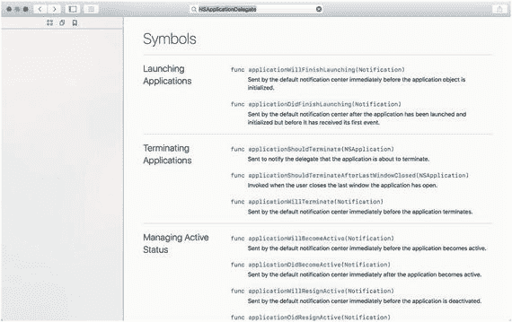

图 4-16. 文档窗口中的 NSApplicationDelegate 协议

`AppDelegate`类继承了`NSObject`类的属性和方法，同时也使用了由`NSApplicationDelegate`协议定义的方法名。任何基于某个协议的类都必须编写 Swift 代码，使这些协议方法实际完成某些操作。用技术术语来说，这被称为“实现或遵循协议”。

因此，Cocoa 框架实际上由类和协议组成。类定义对象，而协议定义不同类可能需要的通用方法名。

当你编写 macOS 程序时，经常需要同时使用 Cocoa 框架的类和协议。当你使用 Cocoa 框架的类时，你可以直接使用那些已有的功能方法，例如能够将文本转换为大写的`uppercased()`方法。

当你使用 Cocoa 框架的协议时，你需要编写 Swift 代码来让该方法实际工作。在浏览 Xcode 文档时，请留意类和协议之间的这种区别。

让我们在 Xcode 文档窗口中看一个同时涉及类和协议的示例：

1.  确保你的 MyFirstProgram 项目已加载到 Xcode 中。
2.  点击项目导航器中的`AppDelegate.swift`文件。Xcode 的中间窗格会显示该`.swift`文件的内容。
3.  将光标移至`NSApplicationDelegate`上。
4.  选择“帮助” ➤ “快速帮助”，或按住 Option 键并点击`NSApplicationDelegate`。一个快速帮助弹窗会出现，如图 4-17 所示，解释`NSApplicationDelegate`是一个协议。

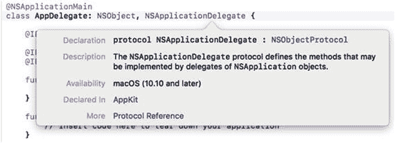

图 4-17. NSApplicationDelegate 快速帮助弹窗

5.  点击此窗口底部的“Protocol Reference”（协议参考）。`NSApplicationDelegate`协议参考页面会出现在文档窗口中（参见图 4-16）。

协议可以在不创建新类的情况下为现有类添加方法，但你并不一定非要使用协议。在 Xcode 中编写程序时，你会用到 Cocoa 框架的类和协议。出于程序的特定目的，你也可能创建自己的类和协议。

在浏览 Xcode 文档时，在编写自己的代码之前，先在类中查找属性和方法。如果在一个类中找不到所需的方法和属性，可以去查找其父类。

例如，在 MyFirstProgram 项目中，你本可以编写 Swift 代码来将文本字段中输入的文字转换为大写。然而，直接使用现有的`uppercased()`方法要简单得多。这节省了你编写代码和调试代码所需的时间，而你本可以直接使用 Cocoa 框架中经过验证的代码。

你对 Cocoa 框架了解得越多，编写自己程序时需要做的工作就越少。利用 Xcode 的文档来帮助你更好地理解构成整个 Cocoa 框架的所有类和协议。

由于 Cocoa 框架非常庞大，不必试图一次性学习所有内容。只学习你需要的部分，忽略其余部分。你使用 Xcode 和编写程序越多，你就越有可能需要并学习 Cocoa 框架的其他部分。

总体思路是尽可能依赖 Cocoa 框架，仅在必要时编写 Swift 代码。这样可以更轻松、省力地快速编写出可靠的软件。


### 摘要

学习 Xcode 可能令人望而生畏，因此请循序渐进，依靠 Xcode 的文档来学习。如果你急需帮助，可以使用“快速帮助”查找关于 Cocoa 框架类的信息。如果你需要某个特定主题的帮助，可以搜索文档。

当你只是出于好奇时，可以浏览 Xcode 的文档，探索其海量的可用功能。通过随机浏览，你常常能学到关于 Xcode 或为 macOS 编写程序的有趣知识。

如你所见，学习编写程序涉及学习 Xcode、Cocoa 框架以及 Swift 编程语言。慢慢来，只学你需要知道的内容，并逐步扩展你的知识。通过稳步前进，你会学到越来越多，直到有一天你会发现自己实际上已经掌握了这么多知识。

用 Xcode 学习编写 macOS 程序不会一蹴而就，但你会惊讶于通过持续稳步的进步能学到多少东西。只需练习编写程序，并依靠“帮助”菜单中提供的 Xcode 文档。不知不觉中，你就能自信地编写小程序，然后逐步挑战更大、更复杂的程序。

