# 5. 使用 Playgrounds 学习 Swift

要编写任何程序，你都需要选择一种编程语言。编程语言让你能够定义计算机要执行的命令。没有所谓“最好”的编程语言，因为每种编程语言都是为了解决特定问题而设计的。这意味着某种编程语言可能非常擅长解决某些类型的问题，但在解决其他类型的问题时却表现糟糕。

对于大多数编程语言而言，易用性和效率之间需要做出权衡。例如，BASIC 编程语言旨在易于学习和使用，而 C 编程语言则旨在让你完全控制计算机。通过最大化计算机效率，C 语言非常适合创建像操作系统或硬盘实用程序这样的复杂程序。

由于 BASIC 从未被设计为能够最大程度地控制计算机，因此它永远不会被用来创建操作系统或硬盘实用程序。而 C 语言被设计为追求最大的计算机效率，因此对于新手来说难以学习，甚至对于经验丰富的程序员来说也难以使用。许多程序中的大多数错误或漏洞，完全归咎于 C 编程语言的复杂性，这甚至会让拥有数十年经验的专业程序员感到困惑。

苹果公司官方编程语言曾经是 Objective-C，它是 C 编程语言的超集，也是面向对象语言 C++ 的替代方案。遗憾的是，Objective-C 难以学习，更难以掌握。Objective-C 让编程变得比实际需要更困难，使得新手和经验丰富的程序员都难以创建 macOS 和 iOS 软件。

这就是为什么在 2014 年，苹果推出了一门名为 Swift 的新编程语言。Swift 旨在与 Objective-C 同样强大，同时又更易于学习。由于苹果将在 macOS、iOS、tvOS 和 watchOS 编程中使用 Swift，Swift 现在已成为 Macintosh、iPhone、iPad、Apple Watch、Apple TV、CarPlay 以及苹果未来任何其他产品的编程语言。

由于太多人使用 Objective-C 编写程序，因此始终需要程序员来修改现有的 Objective-C 程序。但是，你可以在一个程序中混合使用 Objective-C 和 Swift。这意味着随着时间的推移，对 Objective-C 程序员的需求会减少，而对 Swift 程序员的需求会增加。如果你想学习编写 macOS 和 iOS 程序最强大的编程语言，那么你就要学习 Swift。

注意

如果你已经熟悉 Objective-C，你会注意到 Swift 在多个方面让编码变得更容易得多。首先，Swift 不需要每行结尾加分号。其次，Swift 不需要用星号表示指针，也不需要方括号来表示对对象的方法调用。第三，Swift 将所有内容存储在一个单独的 `.swift` 文件中，而 Objective-C 则需要创建一个 `.h` 头文件和一个 `.m` 实现文件。如果你对 Objective-C 一无所知，只需看看任何用 Objective-C 编写的程序，就能看到代码是多么令人困惑。一看到 Objective-C 代码，你就会意识到学习和使用 Swift 要容易得多。


## 使用 Playground

在过去，程序员有两种工具来帮助他们学习编程。第一种叫作解释器。解释器允许你输入一条命令，并立即显示结果。这样你就能准确地知道自己哪里做对了或做错了。

解释器的缺点是运行速度慢，而且无法用它们创建可销售的程序。要在解释器中运行程序，你既需要解释器本身，也需要包含所有用特定编程语言编写的命令的文件（称为源代码）。由于在解释器中运行程序时必须提供源代码，其他人可以轻易复制并窃取你的程序。因此，解释器虽然不适合销售软件，但非常适合学习编程语言。

程序员用来学习编程的第二种工具叫作编译器。编译器会获取存储在文件中的一系列命令，并将其转换为计算机能理解的机器语言。编译器的优点是能防止他人看到你程序的源代码。

使用编译器的问题是，你必须编写一个完整的程序并编译它，才能判断命令是否生效。如果命令不生效，你还得回头去修复问题。与解释器的交互式特性不同，编译器会使学习编程语言的过程变得更加缓慢和笨拙。

使用解释器时，你可以编写一条命令，然后立即看到它是否生效。而使用编译器时，你必须编写命令、编译程序，然后再运行程序才能判断是否生效。

解释器更有利于学习，而编译器更适用于创建可以在不泄露源代码的情况下分发给他人的软件。幸运的是，`Xcode` 为你提供了两全其美的方案。

当你运行程序时，你使用的是 `Xcode` 的编译器。然而，如果你只想试验一些命令，可以使用 `Xcode` 的解释器，它被称为 Playground。

Playground 让你可以试验 `Swift` 代码，看看它是否生效。当代码生效后，你可以将其复制粘贴到项目文件中，并进行编译，从而创建一个可以运行的程序。通过让你同时拥有解释器和编译器的能力，`Xcode` 让学习 `Swift` 变得轻松，同时也让创建可销售或分发给他人的程序变得实用。

要创建一个 Playground，请按照以下步骤操作：

1. 启动 `Xcode`。
2. 选择 `文件 ➤ 新建 ➤ Playground`。（如果你看到了 `Xcode` 欢迎屏幕，也可以点击 `从 Playground 开始`。）`Xcode` 会要求你输入 Playground 名称和平台，如图 5-1 所示。

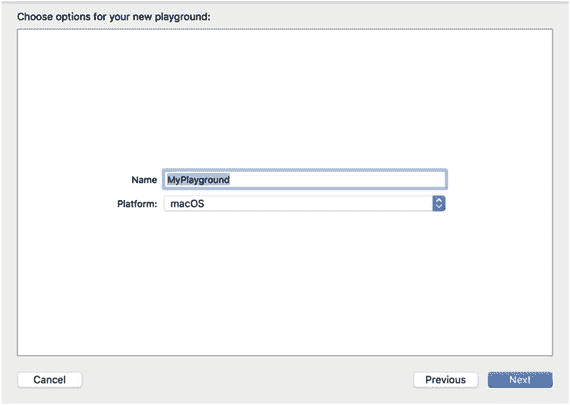

图 5-1. 创建 Playground 文件

3. 在 `名称` 文本字段中点击，输入 `IntroductoryPlayground`。
4. 在 `平台` 弹出菜单中点击，选择 `macOS`。`Xcode` 会询问你希望将 Playground 文件保存到何处。
5. 点击你想要保存 Playground 文件的文件夹，然后点击 `创建` 按钮。`Xcode` 会显示 Playground 文件，如图 5-2 所示。

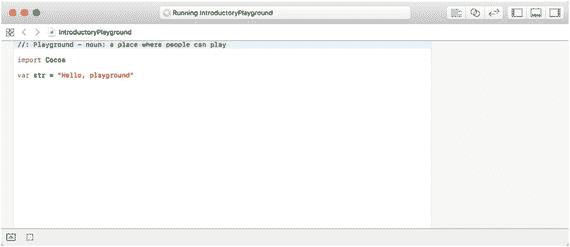

图 5-2. Playground 窗口

6. 按如下方式编辑第二行：

```
    var str = "这是 Swift 解释器"
```

请注意，Playground 窗口会立即在右侧边距中显示你代码更改的结果，如图 5-3 所示。

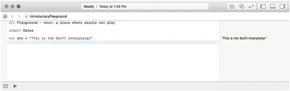

图 5-3. Playground 窗口即时显示代码更改

Playground 让你可以自由地试验 `Swift`，并访问 `Cocoa` 框架中的每一个类，而无需担心让你的 `Swift` 代码与用户界面协同工作。

当你输入 `Swift` 代码时，`Xcode` 可能会以不同颜色显示某些文本。请注意，你的 Playground 中的第一行文本以绿色显示。在 `Swift` 中，这被称为注释，这意味着任何以 `//` 符号开头的文本都会被 `Xcode` 忽略，仅用于供人阅读。任何时候你在某行代码前输入 `//`，`Xcode` 都会将该文本变为绿色并忽略它。

> **提示**：与其删除一行代码，不如在该行前输入`//` 符号。这将把代码变成 `Xcode` 会忽略的注释。当你希望 `Xcode` 再次运行那段代码时，只需删除该行前的 `//` 符号即可。

如果你想将多行代码变成注释，可以在每一行前输入 `//` 符号，但这既耗时又繁琐。一个简单得多的解决方案是在要变成注释的代码开头输入 `/*`，然后在要变成注释的代码结尾输入 `*/`。


### 在 Swift 中存储数据

每个程序都需要接收数据，以某种方式处理数据，然后将结果展示给用户。为了接收数据，程序需要将数据临时存储在内存中。从技术上讲，计算机会将数据存储在内存地址中，记住这些地址可能会令人困惑。为了更容易知道数据存储在哪里，编程语言允许你给这些内存地址起个描述性的名字。在 Swift 中，这两种选择被称为：

*   变量
*   常量

变量和常量的核心思想都是定义一个描述性的名称，并将其赋值以保存数据，例如：

```
str = "This is the Swift interpreter"
```

在上述例子中，`str` 是描述性的名称，而 `"This is the Swift interpreter"` 是被存储的数据。数据可以是文本字符串，也可以是数字，例如整数（`3`、`12`、`-9` 等）或小数（也称为浮点数，如 `12.84`、`-0.83`、`8.02` 等）。在任何给定时间，你可以在一个描述性名称中存储一份数据，这个名称可以被定义为变量或常量。

变量和常量的主要区别在于，你可以根据需要多次重用一个变量来存储新数据（因此得名“变量”）。常量则只允许你向其存储一次数据。

要定义一个变量，你必须使用 `var` 关键字，像这样：

```
var str = "This is the Swift interpreter"
```

要定义一个常量，你必须使用 `let` 关键字，像这样：

```
let str = "This is the Swift interpreter"
```

当你第一次向变量或常量存储数据时，Swift 会推断其数据类型，可能是以下之一：

*   文本字符串（定义为 `String`）
*   整数（定义为 `Int`）
*   小数（定义为 `Double`）

知道变量或常量可以保存哪些数据类型至关重要，因为它只能保存一种数据类型，不能保存其他类型。所以，如果你创建了一个变量并向其中存储了一个字符串，那么这个变量从此以后就只能存储字符串了。

**注意：** Swift 被称为类型安全的编程语言，因为它强制你显式地定义每个变量或常量可以存储的数据类型。这可以防止你的程序试图处理不正确的数据，例如试图将数字添加到诸如 `"John"` 这样的文本字符串中。

为了明确变量或常量可以保存的数据类型，你可以显式地定义四种常见数据类型之一，例如：

```
var cat: String
var dog: Int
var fish: Float
var snake: Double
```

`String` 数据类型只能包含由双引号括起来的字符，例如 `"This is a string"` 和 `"15"`。任何在双引号内的内容都被视为字符串。

`Int`（整数）数据类型只能保存整数，例如 `-25`、`4` 和 `3928`。如果你需要保存 `-2,147,483,648` 到 `2,147,483,647` 之间的任何整数，请使用 `Int` 数据类型。

`Float` 和 `Double` 数据类型可以保存小数，例如 `2.01`、`-0.577` 和 `51.634`。两者之间的主要区别在于，`Float` 数据类型可以保存小数点后的七位数字，而 `Double` 数据类型可以保存小数点后两倍于 `Float` 的数字位数。

例如，假设你想将数字 `0.123456789123456789` 存储在一个变量中。如果你将其存储在一个仅能保存 `Float` 值的变量中，Swift 实际上会存储值 `0.1234568`（对最后一位进行四舍五入）。

```
var floatVar: Float = 0.123456789123456789
// 0.1234568
```

然而，如果你将完全相同的数字存储在一个仅能保存 `Double` 值的变量中，Swift 将存储小数点后多达十四位的所有数字，例如：

```
var doubleVar: Double = 0.123456789123456789
// 0.12345671234568
```

因为 Swift 是一种类型安全的语言，你不能将 `Float` 和 `Double` 数据类型一起处理。作为一般规则，要存储小数请使用 `Double` 数据类型，除非你特别有理由使用 `Float` 数据类型。

如果你试图向变量或常量中存储错误类型的数据，Swift 不会允许。这是为了防止程序在使用错误数据类型时出现问题。例如，如果一个程序询问用户要订购多少件物品，而用户输入了 `"five"` 而不是数字 `5`，程序将不知道如何对 `"five"` 进行数学计算，这会导致程序崩溃或运行异常。

Swift 提供了三种定义变量或常量的方式：

*   `let cat = "Oscar" // 推断为 String 数据类型`
*   `let cat: String = "Oscar"`
*   `let cat: String`
    *   `cat = "Oscar"`

第一种方法允许你将数据直接存入变量或常量。基于你首次存储的数据类型，Swift 将数据类型推断为 `String`、`Int` 或 `Double`（而不是 `Float`，因为 `Float` 存储的小数精度低于 `Double`，并且 Swift 默认你想要精确的精度）。

第二种方法允许你显式声明数据类型并将数据存入该变量或常量。虽然这可能更冗长，但能明确知道你想要存储的数据类型。

第三种方法需要两行代码。第一行定义数据类型。第二行实际存储数据。这对于可能在程序的不同部分被赋予不同数据的变量来说非常方便。你可以将变量声明放在文件顶部附近以便查找，然后在需要时再向它赋值。

当创建多个相同数据类型的变量时，你可以将每个变量声明放在不同的行上，像这样：

```
var cat : Int
var dog : Int
```

作为快捷方式，你可以在单行上声明相同数据类型的变量，像这样：

```
var cat, dog : Int
```

上面这一行声明了 `cat` 和 `dog` 为可以保存 `Int` 数据类型的变量，这与声明 `cat` 为 `Int` 数据类型然后 `dog` 为另一个 `Int` 数据类型的两行代码是相同的。通过将所有相同数据类型的变量声明放在一行上，你可以轻松地看出哪些变量使用相同的数据类型。

要了解如何在 Swift 中声明变量和常量，请按以下步骤操作：

1.  确保你的 `IntroductoryPlayground` 文件已加载到 Xcode 中。
2.  按如下方式修改 playground 文件中的 Swift 代码：

```
import Cocoa
let cat: String
cat = "Oscar"
cat = "Bo"
```

请注意，当你试图向已保存数据的常量赋值新数据时，你会收到一条警告。点击左侧边距中的警告图标会显示一条错误消息，如图 5-4 所示。

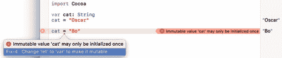

图 5-4。一条错误消息警告你不能多次向常量中存储数据。

**注意：** 常量也被称为“不可变的”，因为一旦你向其中存储了数据，它们就不能被更改。变量被称为“可变的”，因为你可以不断更改它们存储的数据。只需要记住变量一次只能保存一份数据。当你向变量中存储新数据的那一刻，该变量中任何已有的数据都会被清除。

3.  按如下方式修改 playground 文件中的 Swift 代码，将常量更改为变量（将 `let` 替换为 `var`）：

```
import Cocoa
var cat: String
cat = "Oscar"
cat = 42.7
```

请注意，当你试图向一个仅能保存字符串的变量中赋值数字时，你会收到一条警告。点击左侧边距中的警告图标会显示一条错误消息，如图 5-5 所示。

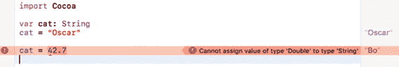

图 5-5。一条错误消息警告你不能存储错误类型的数据。

4.  按如下方式修改 playground 文件中的 Swift 代码：

```
import Cocoa
var cat: String
cat = "Oscar"
var greeting = "Hello, "
var period : String = "."
print (greeting + cat + period)
```


在图 5-6 中，您可以在右侧边栏看到 Playground 显示 Swift 代码的结果。

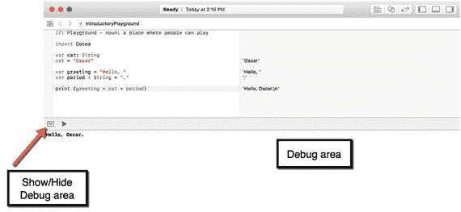

**图 5-6** Playground 窗口的右侧边栏持续显示代码结果

当您使用`print`命令时，Swift 的 Playground 会在右侧边栏和 Playground 窗口底部的调试区同时显示结果。要切换显示或隐藏调试区，请点击“显示/隐藏调试区”图标（见图 5-6）。

隐藏调试区可以让您看到更多 Playground 的 Swift 代码，而显示调试区则可以查看 Swift 代码中`print`命令的结果。

## 使用 Unicode 字符作为名称

在大多数编程语言中，变量和常量的命名仅限于特定范围的字符集，通常排除外语字符。为了使 Swift 对熟悉其他语言的程序员更友好，Swift 允许使用 Unicode 字符作为变量和常量名。

Unicode 是一种代表不同字符的新通用标准。如果选择“编辑”➤“表情与符号”，您可以从有限字符集中选择字符，作为普通字母和数字的替代或补充，如图 5-7 所示。

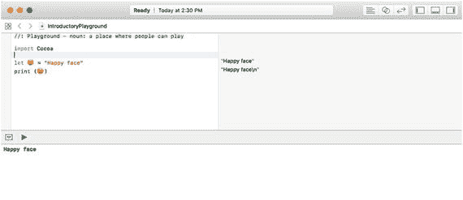

**图 5-7** Xcode 允许您使用特殊字符作为变量或常量名

要了解如何在变量名中使用特殊字符，请遵循以下步骤：

1. 确保您的`IntroductoryPlayground`文件已在 Xcode 中打开。
2. 删除 Playground 中除`import Cocoa`行以外的所有代码。
3. 在`import Cocoa`行下方，输入`let`然后按空格键。
4. 选择“编辑”➤“表情与符号”。弹出窗口如图 5-8 所示。

   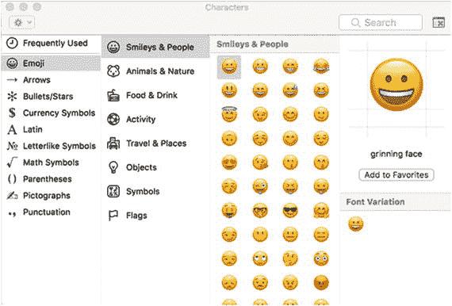

   **图 5-8** 包含不同类别特殊字符的弹出窗口

5. 双击任何您感兴趣的字符。Xcode 会将该字符作为常量名输入。
6. 输入`= "Funny symbol here"`并按回车键。
7. 复制该字符，并将其粘贴到`print`命令的括号内。注意，Playground 窗口的右侧边栏会显示常量变量的内容，如图 5-9 所示。

   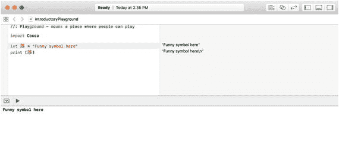

   **图 5-9** 在 Swift 代码中使用特殊字符作为常量名

特殊字符在显示实际数学符号（而非拼写单词）或以外语输入变量及常量名时非常有用。通过使变量和常量名更灵活，Swift 让更多人能够理解编程。

## 转换数据类型

如果您有一个整数类型的数字需要转换为小数，或者有一个小数需要转换为整数，该怎么办？答案是只需指定目标数据类型即可转换，例如：

```
Int(decimal)
```

前面的`Int`数据类型告诉 Swift 将括号内的数字转换为整数。如果该数字是小数，转换为整数通常意味着舍弃小数点后的所有数字，因此像`4.9`这样的数会变成整数`4`。

当 Swift 将整数转换为小数时，它仅在小数点后补零。例如，将整数`75`转换为浮点数后，Swift 会将其存储为`75.0`。要了解如何将整数转换为小数（以及反之），请遵循以下步骤：

1. 确保您的`IntroductoryPlayground`文件已在 Xcode 中打开。
2. 将 Playground 文件中的代码修改如下：

   ```
   import Cocoa
   var whole : Int = 4
   var decimal : Double = 4.902
   print (Int(decimal))
   print (Double(whole))
   ```

注意 Swift 如何将整数转换为小数（将`4`变为`4.0`），以及如何通过舍弃小数点右侧的所有值将小数转换为整数（将`4.902`变为`4`），如图 5-10 所示。

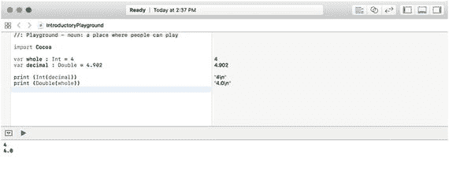

**图 5-10** 整数与小数的相互转换


## 计算属性

到目前为止，声明变量和常量，然后将数据赋值给这些变量或常量，与其他编程语言相比并无太大区别。如果你有一个变量与另一个变量相关，可以这样操作：

```
var cats = 4
var dogs: Int
dogs = cats + 2
print(dogs)
```

不幸的是，这样将`dogs`的变量声明与`dogs`变量的实际赋值分开了。为了保持变量声明与其定义代码的关联性，Swift 提供了一种称为计算属性的功能。

使用计算属性时，你不会直接将数据存储到变量中。相反，你定义变量可以保存的数据类型，然后使用其他变量或常量来计算一个新值，再存储到该变量中。这种计算称为 getter（获取器），其代码如下所示：

```
var dogs : Int {
get {
return cats + 2 // 用于计算值的代码
}
}
```

上述代码声明了一个名为`dogs`的变量，该变量只能保存整数（`Int`）数据类型。然后，它将代码包含在由关键字`get`定义的 getter 花括号中。

实际上，你可以在 getter 的花括号内编写任意数量的 Swift 代码，但此示例只包含了最重要的一行，即使用`return`关键字返回一个值，该值会被存储到`dogs`变量中。

在本例中，它获取`cats`变量中存储的值，将该值加 2，然后将新值存储到`dogs`变量中。更改 getter 中的代码，就会改变存储在`dogs`变量中的计算值。

让我们通过以下步骤来看看这是如何工作的：

1.  确保你的`IntroductoryPlayground`文件已在 Xcode 中加载。
2.  将 playground 文件中的代码修改如下：

```
import Cocoa
var cats = 4
var dogs : Int {
get {
return cats + 2 // 用于计算值的代码
}
}
print(dogs)
```

请注意，playground 窗口的右侧边距显示了`dogs`的值，如图 5-11 所示。

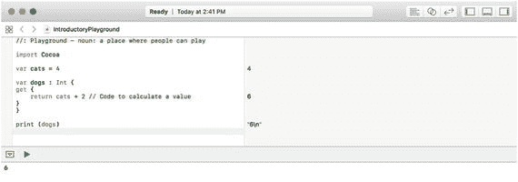

图 5-11.

playground 窗口的右侧边距显示了 getter 部分的工作方式

Getter 使用代码来计算变量的值。第二种类型的计算属性称为 setter（设置器），它运行用于计算不同变量值的代码。

每当其变量被赋值时，setter 就会运行。要了解 getter 和 setter 是如何工作的，请按照以下步骤操作：

1.  确保你的`IntroductoryPlayground`文件已在 Xcode 中加载。
2.  将 playground 文件中的代码修改如下：

```
import Cocoa
var cats = 4
var dogs : Int {
get {
return cats + 2 // 用于计算值的代码
}
set(newValue) {
cats = 3 * newValue
}
}
print(dogs)
print(cats)
dogs = 5
print(dogs)
print(cats)
```

注意当你为`dogs`变量赋一个不同的值时，`cats`和`dogs`变量的值是如何变化的，如图 5-12 所示。

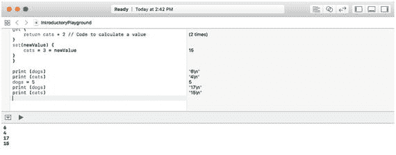

图 5-12.

playground 窗口的右侧边距显示了 getter 和 setter 代码的工作方式

让我们逐行分析这段代码。首先，数字 4 被存储到`cats`变量中。在 getter 中使用`cats`变量（4）返回`cats` + 2，即 4 + 2（6）。所以第一个`print(dogs)`命令打印出 6。

第二个`print(cats)`打印`cats`变量的值，该值仍然是 4。

当`dogs`变量被赋值为数字 5 时，setter 会运行。临时变量`newValue`被赋值为数字 5，从而为`cats`计算出一个新值：3 * `newValue`，即 3 * 5 或 15。现在`cats`变量的值被设置为 15。

接下来运行`print(dogs)`命令，使用由 getter 计算出的`dogs`的值。由于`cats`的值是 15，getter 计算出`cats` + 2，即 15 + 2，结果为 17。因此下一个`print(dogs)`命令打印出 17，最后一个`print(cats)`命令打印出 15。

**注意**  
计算属性可以在给变量赋值时运行代码。但是，请谨慎使用计算属性，因为它们可能会使你的代码更难理解。计算属性最常用于面向对象编程中的类属性。例如，如果一个对象代表屏幕上绘制的一个正方形，改变正方形的宽度必须同时改变该正方形的高度（反之亦然）。


## 使用可选变量

声明变量时最大的缺陷在于，在向变量中存入数据之前，你无法使用该变量。如果在变量存储任何数据之前就试图使用它，程序将会运行失败并崩溃。为避免此问题，许多程序员会先在变量中存储“占位”数据。不幸的是，这种“占位”数据仍可能被程序使用并导致错误。

为解决此问题，Swift 提供了一种称为“可选变量”的机制。可选变量既可以存储数据，也可以什么也不存储。如果可选变量中不包含任何内容，则被视为持有名为 `nil` 的值。通过使用可选变量，即使变量不包含数据，你也能避免程序崩溃。

要创建可选变量，只需在声明变量及其数据类型时加上问号，如下所示：

```
var fish : String?
```

问号将变量标识为可选类型。你可以像使用普通变量一样使用可选变量来存储数据，例如：

```
fish = "goldfish"
```

虽然向可选变量存储数据与向普通变量存储数据并无不同，但从可选变量中取回数据则需要额外的步骤。首先，你必须检查可选变量中是否包含数据。一旦确认可选变量包含数据，你就需要用感叹号来解包该可选变量以获取实际数据，例如：

```
print (fish!)
```

要了解可选变量如何工作，请尝试以下操作：

1.  确保你的 `IntroductoryPlayground` 文件已在 Xcode 中加载。
2.  按如下方式修改代码：

```
    import Cocoa
    var fish : String?
    fish = "goldfish"
    print (fish)
    print (fish!)
```

请注意，`fish` 本身实际上是一个可选变量，但当你使用感叹号解包它时，就能访问到可选变量内部的实际数据，如图 5-13 所示。

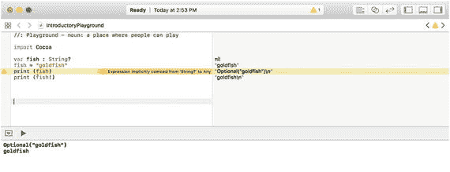

图 5-13. 查看可选变量与其内部解包后数据的区别

3.  在下方再输入两行代码：

```
    var str : String
    str = fish
```

请注意，你不能将可选变量 `fish` 赋值给 `str`，因为 `str` 只能持有 `String` 数据类型。相反，你必须解包可选变量 `fish`，并使用感叹号取出其实际的字符串内容，如下所示：

```
var str : String
str = fish!
```

在解包可选变量以获取其数据之前，务必先检查该可选变量包含的是 `nil` 值还是实际变量。如果你在可选变量包含 `nil` 值时尝试使用它，程序可能会崩溃。

要检查可选变量是否持有 `nil` 值，你有两种选择。首先，你可以显式检查 `nil` 值，如下所示：

```
if fish != nil {
print ("该可选变量不是 nil")
}
```

这段代码检查 `fish` 可选变量是否不等于（`!=`）`nil`。如果可选变量不是 `nil`，那么它一定持有某个值，因此可以安全地取出。

检查可选变量是否有值的第二种方法是将其赋值给一个常量，如下所示：

```
if let food = fish {
print ("该可选变量有值")
print (food)
}
```

如果可选变量有值，它会将该值存储在常量中。现在你就通过该常量来访问这个值了。要观察其工作原理，请按以下步骤操作：

1.  确保你的 `IntroductoryPlayground` 文件已在 Xcode 中加载。
2.  按如下方式修改代码：

```
    import Cocoa
    var fish : String?
    fish = "goldfish"
    if fish != nil {
    print ("该可选变量不是 nil")
    var str : String
    str = fish!
    print (str)
    }
    if let food = fish {
    print ("该可选变量有值")
    print (food)
    }
```

请注意，你可以通过使用感叹号解包可选变量，或将其存储在常量中再使用该常量，这两种方式来取出可选变量中的值，如图 5-14 所示。

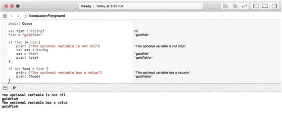

图 5-14. 访问可选变量中存储的值的两种方式


## 将 Swift 代码与用户界面链接

每个程序都需要存储数据，而将数据存入变量最常见的方式之一就是从用户界面中获取数据。要将用户界面元素与 Swift 代码链接起来，你需要创建一个 `IBOutlet` 变量。

如果有一个文本字段连接到了 `IBOutlet` 变量，用户在文本字段中输入的任何内容都会自动存储到该 `IBOutlet` 变量中。同样，你存储在 `IBOutlet` 变量中的任何内容也会立即显示在文本字段中。`IBOutlet` 变量就像 Swift 代码和用户界面之间的纽带，如图 5-15 所示。

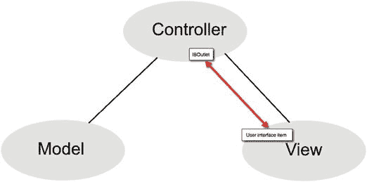

图 5-15. `IBOutlet` 变量将用户界面元素与 Swift 代码链接起来

由于文本字段等用户界面元素初始时可能为空，`IBOutlet` 变量被定义为隐式解包的可选变量，用感叹号声明，如下所示：

```
@IBOutlet weak var labelText: NSTextField!
```

如果 `IBOutlet` 是一个普通变量，并且连接到了一个空文本字段，那么当 `IBOutlet` 变量中没有任何数据时，程序可能会崩溃。

如果 `IBOutlet` 是一个可选变量，你可以用问号来定义它，如下所示：

```
@IBOutlet weak var labelText: NSTextField?
```

不幸的是，每次你想访问存储在这个可选变量中的数据时，都必须输入一个感叹号。如果你多次访问这个 `IBOutlet` 变量，每次都需要输入感叹号，这既麻烦又会让代码变得难以阅读。

为了让你无需每次都输入感叹号就能访问 `IBOutlet` 变量，更简单的方式是将 `IBOutlet` 变量创建为隐式解包的可选变量，这意味着如果它包含值，你无需输入解包感叹号即可访问它。

要了解 Xcode 如何将 `IBOutlet` 创建为隐式解包的可选变量，请打开你之前创建的 `MyFirstProgram` 项目。

1.  确保你的 `MyFirstProgram` 已加载到 Xcode 中。
2.  在项目导航器中点击 `AppDelegate.swift` 文件。Xcode 的中间面板会显示该 `.swift` 文件的内容。注意，所有的 `IBOutlet` 变量都是用感叹号声明的，这意味着它们是隐式解包的可选变量：

```
    @IBOutlet weak var labelText: NSTextField!
    @IBOutlet weak var messageText: NSTextField!
```

同时请注意，`IBAction changeCase` 方法允许你无需使用感叹号就能访问这些隐式解包可选变量的内容。

```
    @IBOutlet weak var labelText: NSTextField!
    @IBOutlet weak var messageText: NSTextField!
    @IBAction func changeCase(_ sender: NSButton) {
    labelText.stringValue = messageText.stringValue.uppercased()
    let warning = labelText.stringValue
    }
```

3.  将每个 `IBOutlet` 变量末尾的感叹号替换为问号，如下所示：

```
    @IBOutlet weak var labelText: NSTextField?
    @IBOutlet weak var messageText: NSTextField?
```

注意，现在每次使用 `IBOutlet` 变量时，Xcode 都会显示错误信息。这是因为你需要用感叹号解包每个可选变量，如下所示：

```
@IBAction func changeCase(_ sender: NSButton) {
labelText!.stringValue = messageText!.stringValue.uppercased()
let warning = labelText!.stringValue
}
```

如果你将 `IBOutlet` 定义为普通的可选变量（用问号定义），那么为了访问其值，你必须用感叹号解包每个可选变量。

如果你简单地将 `IBOutlet` 定义为隐式解包的可选变量（Xcode 会为你这样做），那么你就不需要输入感叹号来解包这些可选变量了。

基本上，让 Xcode 将你的 `IBOutlet` 创建为隐式解包的变量（带感叹号）能让编写 Swift 代码更轻松。

那么，什么时候该使用可选变量（用 `?` 定义），什么时候该使用隐式解包的可选变量（用 `!` 定义）呢？

一般来说，对于 `IBOutlet`，使用隐式解包的可选变量可以让你更轻松地编写 Swift 代码，无需到处输入感叹号。如果在其他场合使用隐式解包的可选变量，你的变量可能包含 `nil` 值，而当你尝试使用它时，Xcode 不会捕获任何潜在错误。

要了解使用隐式解包可选变量的危险性，请遵循以下步骤：

1.  确保你的 `IntroductoryPlayground` 文件已加载到 Xcode 中。
2.  修改代码如下：

```
    import Cocoa
    var safe : Int?  // 可选变量
    var danger : Int!// 隐式解包的可选变量
    print (danger * 2)
    print (safe * 2)
```

请注意，这两个整数变量都没有值，但 Xcode 却允许你使用隐式解包可选变量中的 `nil` 值进行计算，而对于普通可选变量，则会标记一个可能的错误，如图 5-16 所示。

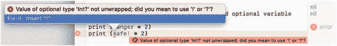

图 5-16. Xcode 可以识别未定义可选变量可能存在的问题，但无法识别未定义隐式解包可选变量的问题

通过要求你用感叹号（`!`）解包可选变量，Xcode 强制你承认正在使用可选变量，这样你就能记得检查它是否包含 `nil` 值。

由于隐式解包的可选变量允许你直接输入变量名而无需附加符号，因此更容易忘记自己正在处理可选变量，并且在尝试使用之前检查可能的 `nil` 值。可选变量无法防止问题，但能强制你记住自己正在处理可能为 `nil` 的值。

### 总结

如果你来自其他编程环境，你已经看到 Swift 与其他语言的诸多不同之处。Swift 的 Playground 解释器让你在将代码复制粘贴到实际程序之前，可以先在安全环境中测试代码。Playground 让你可以自由地实验 Swift 命令。

三种最常见的数据类型是整数（`Int`）、小数（`Float` 或 `Double`）和文本字符串（`String`）。为了避免在存储小数时混用数据类型，除非你有特定原因要使用 `Float` 数据类型，否则请使用 `Double` 数据类型。

为了更灵活地命名变量，你可以使用能够表示符号或外语字符的 Unicode 字符。

将数据存储到变量中，可以简单到直接为其赋值。Swift 还提供了计算属性，允许你在为新值赋值时修改变量或其他变量。计算属性在处理类和面向对象编程时更为有用。

更重要的是可选变量，它允许你处理 `nil` 值而不会导致程序崩溃。在使用 `IBOutlet` 将 Swift 代码连接到标签和文本字段等用户界面元素时，可选变量尤其重要。

当你创建一个可选变量（用问号）时，你需要解包它（用感叹号）才能访问其实际数据。

变量对于临时存储数据至关重要，因此你会经常使用它们。当你开始学习类和面向对象编程时，你会使用变量来定义属性。本质上，任何时候你需要存储一块数据，你都会声明一个变量来保存它。


