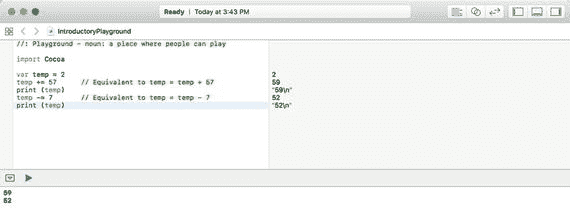
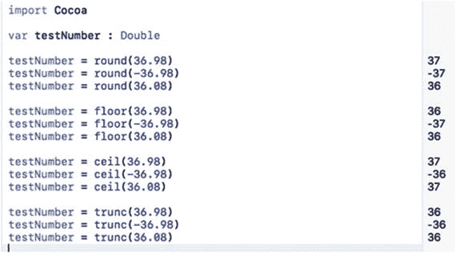
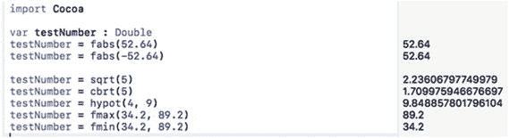
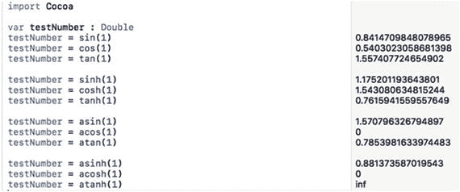
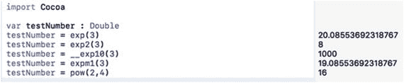
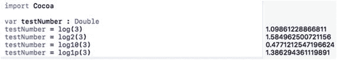
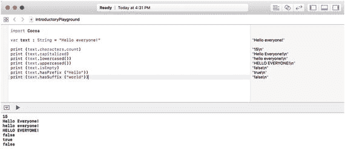

# 6. 操作数字和字符串

每个程序都需要将数据临时存储在变量中。然而，要使程序真正有用，它还必须以某种方式操作这些数据，以计算出有用的结果。电子表格可以让你对数字进行加、减、乘、除运算。文字处理器则操作文本以纠正拼写错误并设置文本格式。即使是电子游戏，也会响应摇杆的移动，为玩家的角色（如卡通人物、飞机或汽车）计算新的位置。利用数据计算出新的结果，正是每个程序存在的全部意义。

为了操作数字，Swift 提供了四个基本的数学运算符：加法（`+`）、减法（`-`）、乘法（`*`）、除法（`/`）以及一个取余运算符（`%`）。当你想要将两个字符串合并为一个时，你甚至可以使用加法运算符（`+`）来操作字符串。

尽管 Swift 包含了多种用于操作数字和文本的运算符，但 Cocoa 框架提供了更多强大的函数来操作数字和字符串。如果这些函数都不适用，你始终可以创建自己的函数来操作文本和数字数据。通过创建名为函数的迷你程序，你可以按任意方式操作数据，并可根据需要重复使用你的函数。

## 使用数学运算符

操作数字最简单的方法是执行加法、减法、除法或乘法。在操作数字时，首先确保所有数字都是相同的数据类型，例如全部是整数，或者全部是 `Float` 或 `Double` 类型的小数。由于将整数与小数混合可能导致计算错误，因此 Swift 会强制你在计算中使用相同的数据类型。如果你的数据并非全是相同的数据类型，则需要转换一个或多个数据类型，例如：

```
var cats = 4
var dogs = 5.4
dogs = Double(cats) * dogs
```

在这个例子中，Swift 推断 `cats` 是 `Int` 数据类型，`dogs` 是 `Double` 数据类型。要相乘 `cats` 和 `dogs`，它们必须是相同的数据类型（`Double`），因此你必须先将 `cats` 的值转换为 `Double` 数据类型，然后计算才能安全地进行。

当使用多个数学运算符时，请使用括号来定义哪些计算应该优先执行。Swift 通常从左到右计算数学运算符，但乘法和除法的优先级高于加法和减法。如果你输入以下 Swift 代码，仅因数学计算的顺序不同，就会得到两个不同的结果：

```
var cats, dogs : Double
dogs = 5 *  9 - 3  /  2 + 4     // 47.5
cats = 5 * (9 - 3) / (2 + 4)    // 5.0
```

为了清晰起见，始终使用括号对数学运算符进行分组。最常见的数学运算符被称为二元运算符，因为它们需要两个数字才能计算出结果，如表 6-1 所示。

**表 6-1.** Swift 中的常见数学运算符

| 数学运算符 | 用途 | 示例 |
| --- | --- | --- |
| `+` | 加法 | `5 + 9 = 14` |
| `-` | 减法 | `5 - 4 = 1` |
| `*` | 乘法 | `5 * 9 = 45` |
| `/` | 除法 | `45 / 9 = 5` |
| `%` | 取余 | `5 % 9 = 5` |

在所有数学运算符中，取余运算符可能需要额外的解释。本质上，取余运算符是将一个数除以另一个数，然后只返回该除法的余数。所以 5 除以 9 结果是 0 余 5，而 26 除以 5 的余数是 1。

### 复合赋值运算符

如果你想给一个变量增加或减少某个数字，你可以使用如下 Swift 代码：

```
temp = temp + 5
```

这个命令告诉 Swift 将 5 加到 `temp` 变量中存储的当前值上。虽然这种代码可以工作，但重复键入相同的变量名可能会显得笨拙。

作为一种快捷方式，Swift 提供了看起来像（`+=`）或（`-=`）的复合赋值运算符。要使用复合赋值运算符，你需要指定一个变量、要使用的复合赋值运算符，然后是你要增加或减少的值，例如：

```
temp += 5
```

这相当于：

```
temp = temp + 5
```

要了解复合赋值运算符是如何工作的，请按照以下步骤操作：

1. 在 Xcode 中打开 `IntroductoryPlayground` 文件。
2. 将代码编辑如下：

    ```
    import Cocoa
    var temp = 2
    temp += 57                // 相当于 temp = temp + 57
    print (temp)
    temp -= 7                 // 相当于 temp = temp - 7
    print (temp)
    ```

如图 6-1 所示，`+=` 复合赋值运算符将 57 加到 `temp` 的当前值上。然后 `-=` 复合赋值运算符从 `temp` 的当前值中减去 7。



**图 6-1.** 观察复合赋值运算符如何工作

通过组合数学运算符，你可以创建任何类型的计算。然而，如果你需要执行常见的数学运算，例如求一个数的平方根或对数，使用 Cocoa 框架中内置的数学函数会更简单、更可靠。

## 使用数学函数

Cocoa 框架提供了数十个你可以使用的数学函数。一些更常见的数学函数包括：

- 取整函数
- 计算函数（`sqrt`， `cbrt`， `min`/`max` 等）
- 三角函数（`sin`，`cos`，`tan` 等）
- 指数函数
- 对数函数

### 取整函数

当你处理小数时，可能希望将它们四舍五入到最接近的位。然而，在 Swift 中有多种取整数字的方法，例如：

- `round`：0.5 及以上舍入，0.49 及以下舍去
- `floor`：向下取整到最接近的整数
- `ceil`：向上取整到最接近的整数
- `trunc`：直接舍弃小数部分

要了解这些不同的取整函数如何工作，请按照以下步骤创建一个新的 playground：

1. 确保 `IntroductoryPlayground` 文件已在 Xcode 中加载。
2. 将代码编辑如下：

    ```
    import Cocoa
    var testNumber : Double
    testNumber = round(36.98)
    testNumber = round(-36.98)
    testNumber = round(36.08)
    testNumber = floor(36.98)
    testNumber = floor(-36.98)
    testNumber = floor(36.08)
    testNumber = ceil(36.98)
    testNumber = ceil(-36.98)
    testNumber = ceil(36.08)
    testNumber = trunc(36.98)
    testNumber = trunc(-36.98)
    testNumber = trunc(36.08)
    ```

图 6-2 展示了每种取整函数在处理负数和正数时的不同之处，以及每个函数是向上取整还是向下取整。



**图 6-2.** 观察不同的取整函数如何工作


### 计算函数

你可以组合使用 Swift 的四种基本数学运算（加、减、除、乘）来创建任意类型的复杂计算。不过，Cocoa 框架包含了常见类型的数学函数，你可以直接使用，而无需自行创建。一些常见的计算函数包括：

- `fabs`：计算一个数字的绝对值
- `sqrt`：计算一个正数的平方根
- `cbrt`：计算一个正数的立方根
- `hypot`：计算（`x*x + y*y`）的平方根
- `fmax`：找出两个数字中的最大值或最大数
- `fmin`：找出两个数字中的最小值或最小数

要了解这些不同计算函数的工作方式，请按以下步骤操作：

1.  确保你的 `IntroductoryPlayground` 已在 Xcode 中加载。
2.  按如下所示编辑代码：

```
import Cocoa
var testNumber : Double
testNumber = fabs(52.64)
testNumber = fabs(-52.64)
testNumber = sqrt(5)
testNumber = cbrt(5)
testNumber = hypot(4, 9)
testNumber = fmax(34.2, 89.2)
testNumber = fmin(34.2, 89.2)
```

图 6-3 展示了每种计算函数的不同工作方式。



图 6-3. 查看不同计算函数的工作方式

## 三角函数

如果你还记得学校学过的知识（即使不记得也没关系），三角学是一个涉及相交线之间夹角的数学领域。由于三角函数在实际应用中确实很方便，Cocoa 框架提供了大量函数用于计算余弦、双曲正弦、反正切和反双曲余弦。一些常见的三角函数包括：

- `sin`：计算以弧度为单位的角度正弦值
- `cos`：计算以弧度为单位的角度余弦值
- `tan`：计算以弧度为单位的角度正切值
- `sinh`：计算以弧度为单位的角度双曲正弦值
- `cosh`：计算以弧度为单位的角度双曲余弦值
- `tanh`：计算以弧度为单位的角度双曲正切值
- `asin`：计算以弧度为单位的角度反正弦值
- `acos`：计算以弧度为单位的角度反余弦值
- `atan`：计算以弧度为单位的角度反正切值
- `asinh`：计算以弧度为单位的角度反双曲正弦值
- `acosh`：计算以弧度为单位的角度反双曲余弦值
- `atanh`：计算以弧度为单位的角度反双曲正切值

要了解这些不同三角函数的工作方式，请按以下步骤操作：

1.  确保你的 `IntroductoryPlayground` 已在 Xcode 中加载。
2.  按如下所示编辑代码：

```
import Cocoa
var testNumber : Double
testNumber = sin(1)
testNumber = cos(1)
testNumber = tan(1)
testNumber = sinh(1)
testNumber = cosh(1)
testNumber = tanh(1)
testNumber = asin(1)
testNumber = acos(1)
testNumber = atan(1)
testNumber = asinh(1)
testNumber = acosh(1)
testNumber = atanh(1)
```

图 6-4 展示了每种三角函数的不同工作方式。



图 6-4. 查看不同三角函数的工作方式

### 指数函数

指数函数涉及乘法运算，例如将数字 2 自身相乘固定次数。一些常见的指数函数包括：

- `exp`：计算 e**x，其中 x 是一个整数
- `exp2`：计算 2**x，其中 x 是一个整数
- `__exp10`：计算 10**x，其中 x 是一个整数
- `expm1`：计算 e**x - 1，其中 x 是一个整数
- `pow`：计算 x 的 y 次幂

要了解这些不同指数函数的工作方式，请按以下步骤操作：

1.  确保你的 `IntroductoryPlayground` 文件已在 Xcode 中加载。
2.  按如下所示编辑代码：

```
import Cocoa
var testNumber : Double
testNumber = exp(3)
testNumber = exp2(3)
testNumber = __exp10(3)
testNumber = expm1(3)
testNumber = pow(2,4)
```

图 6-5 展示了每种指数函数的不同工作方式。



图 6-5. 查看不同指数函数的工作方式

### 对数函数

对数函数允许在计算中使用大数的乘法、除法和加法，与指数函数类似。一些常见的对数函数包括：

- `log`：计算一个数字的自然对数
- `log2`：计算一个数字以 2 为底的对数
- `log10`：计算一个数字以 10 为底的对数
- `log1p`：计算 1 + x 的自然对数

要了解这些不同对数函数的工作方式，请按以下步骤操作：

1.  确保你的 `IntroductoryPlayground` 文件已在 Xcode 中加载。
2.  按如下所示编辑代码：

```
import Cocoa
var testNumber : Double
testNumber = log(3)
testNumber = log2(3)
testNumber = log10(3)
testNumber = log1p(3)
```

图 6-6 展示了每种对数函数的不同工作方式。



图 6-6. 查看不同对数函数的工作方式

## 使用字符串函数

正如 Cocoa 框架提供了数十种数学函数一样，它也包含了一些字符串操作函数。一些常见的字符串函数包括：

- `+`：将两个字符串连接或组合在一起，例如 "Hello " + "world"，会创建字符串 "Hello world"
- `characters.count`：返回字符串的长度
- `capitalized`：将每个单词的首字母大写
- `lowercased()`：将整个字符串转换为小写字母
- `uppercased()`：将整个字符串转换为大写字母
- `isEmpty`：检查一个字符串是否为空或至少包含一个字符
- `hasPrefix`：检查特定文本是否出现在字符串的开头
- `hasSuffix`：检查特定文本是否出现在字符串的结尾

使用 `+` 运算符追加或组合字符串时，请注意空格。如果省略空格，可能会得到不期望的结果。例如，`"Hello" + "world"` 会创建不带任何空格的字符串 `"Helloworld"`。这就是为什么你需要确保在单词之间加上空格，例如 `"Hello " + "world"` 来创建 `"Hello world"`。

要了解这些不同字符串函数的工作方式，请按以下步骤操作：

1.  确保 `IntroductoryPlayground` 已在 Xcode 中加载。
2.  按如下所示编辑代码：

```
import Cocoa
var text : String = "Hello everyone!"
print (text.characters.count)
print (text.capitalized)
print (text.lowercased())
print (text.uppercased())
print (text.isEmpty)
print (text.hasPrefix ("Hello"))
print (text.hasSuffix ("world"))
```

图 6-7 展示了每种对数函数的不同工作方式。



图 6-7. 查看不同字符串函数的工作方式


### 摘要

任何程序的核心都是能够接受数据、操作数据并返回有用结果的能力。操作数值数据最简单的方法是通过常见的数学运算符，例如 `+`（加法）、`-`（减法）、`/`（除法）、`*`（乘法）和 `%`（取余）。操作字符串的常见方法是通过 `+` 运算符进行拼接，它将两个字符串组合在一起。

作为快捷方式，你可以使用递增和递减运算符来给变量加 1 或减 1。如果需要增减的值不是 1，你可以改用复合赋值运算符。

除了这些基本运算符，你还可以通过 Cocoa 框架定义的函数来操作数据。你不需要了解这些函数的工作原理；你只需要知道它们存在，以便在自己的程序中通过调用这些函数名称来使用它们。

