# 7. 使用分支做出决策

程序接收数据后，需要以某种方式操作这些数据以返回有用的结果。简单的程序以相同的方式操作数据，但更复杂的程序需要就如何操作这些数据做出决策。

例如，程序可能要求用户输入密码。如果用户输入了有效的密码，那么程序就允许用户访问。如果用户没有输入有效的密码，那么程序必须显示错误消息并阻止访问。

当程序分析数据并根据数据做出决策时，它会使用布尔值和分支语句。布尔值表示 `true` 或 `false` 值。分支语句让你的程序可以选择执行两个或多个不同的指令集。布尔值与分支语句相结合，使程序能够对不同的数据做出响应。

## 理解比较运算符

之前你了解了常见的数据类型，例如 `Int`、`Double` 和 `String`。Swift 还包含一种布尔数据类型，它可以保存 `true` 或 `false` 值。你可以通过声明 `Bool` 数据类型来创建布尔变量，例如：

```
var flag : Bool
```

`Bool` 代表布尔数据类型。任何定义为 `Bool` 数据类型的变量只能保存两个值之一，例如：

```
flag = true
flag = false
```

虽然你可以直接将 `true` 和 `false` 赋值给代表布尔数据类型的变量，但更常见的是使用比较运算符来计算布尔值。表 7-1 展示了一些常见的比较运算符。

**表 7-1.** Swift 中的常见比较运算符

| 比较运算符 | 作用         | 示例       | 布尔值  |
|------------|--------------|------------|---------|
| `==`       | 等于         | `5 == 14`  | False   |
| `<`        | 小于         | `5 < 14`   | True    |
| `>`        | 大于         | `5 > 14`   | False   |
| `<=`       | 小于或等于   | `5 <= 14`  | True    |
| `>=`       | 大于或等于   | `5 >= 14`  | False   |
| `!=`       | 不等于       | `5 != 14`  | True    |

**注意：** 等于（`==`）比较运算符是唯一也可以比较字符串的比较运算符，例如 `"Joe" == "Fred"`（计算结果为 `false`）或 `"Joe" == "Joe"`（计算结果为 `true`）。

比较运算符比较两个值，例如 `38 == 8` 或 `29.04 > 12`。任何比较的结果总是 `true` 或 `false`。由于使用实际值与比较运算符总是返回相同的 `true` 或 `false` 值，因此更常见的是使用比较运算符将一个固定值与一个变量进行比较，或者比较两个变量，例如：

```
let myValue = 45
myValue > 38            // 计算结果为 true
let yourValue = 39
myValue < yourValue     // 计算结果为 false
```

当你比较一个或多个变量时，结果会根据这些变量的当前值而变化。但是，在使用等于（`==`）比较运算符时，处理小数值时要小心。这是因为 `45.0` 与 `45.0000001` 不是同一个数字。在处理小数值时，最好使用大于或小于比较运算符。

要了解比较运算符如何生成 `true` 或 `false` 值，请按照以下步骤操作：

1. 在 Xcode 中打开 `IntroductoryPlayground` 文件。
2. 按如下方式编辑代码：

```
import Cocoa
4 > 9
23 >= 12
3.4 < 8.5
73 <= 29
3.0 == 3.01
3.0 != 3.01
```

注意右边距显示了每个比较运算符的布尔值，如图 7-1 所示。

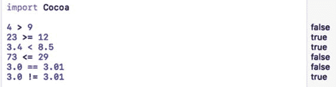

**图 7-1.** 比较运算符总是计算为 true 或 false 布尔值

## 理解逻辑运算符

任何比较运算符，例如 `78 > 9`，都会计算出一个 `true` 或 `false` 值。然而，Swift 提供了专门用于处理两个或多个布尔值的逻辑运算符，如表 7-2 所示。

**表 7-2.** Swift 中的常见逻辑运算符

| 逻辑运算符 | 作用 |
|------------|------|
| `&&`       | 与   |
| `\|\|`       | 或   |
| `!`        | 非   |

与（`&&`）和或（`||`）逻辑运算符都接受两个布尔值并将它们转换为单个布尔值。非（`!`）逻辑运算符接受一个布尔值并将其转换为相反的值。表 7-3 展示了非（`!`）逻辑运算符的工作方式。

**表 7-3.** 非（`!`）逻辑运算符

| 示例      | 值    |
|------------|-------|
| `!true`  | False |
| `!false` | True  |

与（`&&`）运算符接受两个布尔值，并根据表 7-4 计算出一个单独的布尔值。

**表 7-4.** Swift 中的与（`&&`）逻辑运算符

| 第一个布尔值 | 第二个布尔值 | 结果  |
|--------------|--------------|-------|
| True         | `&&` True    | True  |
| True         | `&&` False   | False |
| False        | `&&` True    | False |
| False        | `&&` False   | False |

或（`||`）运算符接受两个布尔值，并根据表 7-5 计算出一个单独的布尔值。

**表 7-5.** Swift 中的或（`||`）逻辑运算符

| 第一个布尔值 | 第二个布尔值 | 结果  |
|--------------|--------------|-------|
| True         | `\|\|` True  | True  |
| True         | `\|\|` False | True  |
| False        | `\|\|` True  | True  |
| False        | `\|\|` False | False |

要了解布尔值如何与比较运算符和逻辑运算符一起工作，请按照以下步骤创建一个新的 playground：

1. 在 Xcode 中打开 `IntroductoryPlayground` 文件。
2. 按如下方式编辑代码：

```
import Cocoa
var x, y, z : Int
x = 35
y = 120
z = -48
x == y
x < z
y != z
z > -48
// 与 && 运算符
(y != z) && (x > z)
(y != z) && (x == y)
(x == y) && (x < z)
(z > -48) && (x == y)
// 或 || 运算符
(y != z) || (x > z)
(y != z) || (x == y)
(x == y) || (x < z)
(z > -48) || (x == y)
```

图 7-2 显示了比较运算符如何计算为 `true` 或 `false`，以及逻辑运算符（与和或）如何接受两个布尔值并返回单个 `true` 或 `false` 值。

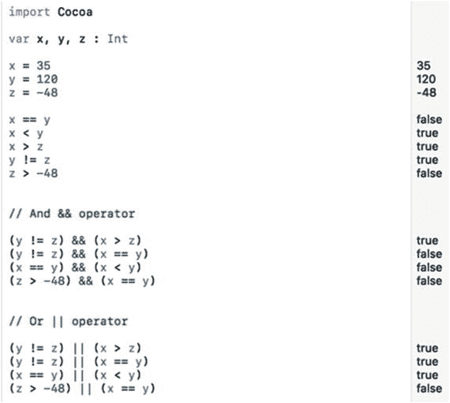

**图 7-2.** 使用比较运算符和逻辑运算符计算布尔值

最终，每个布尔值必须是：

- 一个 `true` 或 `false` 值
- 一个结果为 `true` 或 `false` 的两个值的比较
- 使用逻辑运算符组合成的、计算结果为 `true` 或 `false` 的布尔值组合


## `if` 语句

布尔值对于程序做出选择至关重要。如果有人输入密码，程序会检查该密码是否有效。如果为 `true`（密码有效），那么程序就授予访问权限。如果为 `false`（密码无效），那么程序就阻止访问。

为了决定下一步做什么，每个程序都需要评估一个布尔值。只有这样，它才能基于该布尔值来决定下一步的行动。

Swift 中最简单的分支语句类型是 `if` 语句，它看起来像这样：

```
if BooleanValue == true {
}
```

为了简化这个 `if` 语句，你可以省略 `“== true”` 部分，使 `if` 语句变成这样：

```
if BooleanValue {
}
```

这个简化版本的意思是：“如果 `BooleanValue` 为 `true`，则运行花括号内的代码。如果 `BooleanValue` 为 `false`，则跳过花括号内的所有代码，不运行它们。”

要了解布尔值如何与 `if` 语句配合使用，请按照以下步骤操作：

1.  在 Xcode 中打开 `IntroductoryPlayground` 文件。
2.  按如下方式编辑代码：

    ```
    import Cocoa
    var BooleanValue = true
    if BooleanValue {
    print ("The BooleanValue is true")
    }
    ```

图 7-3 显示了 `if` 语句运行的结果。将 `BooleanValue` 的值改为 `false`，你会看到 `if` 语句不再打印字符串 `“The BooleanValue is true”`。

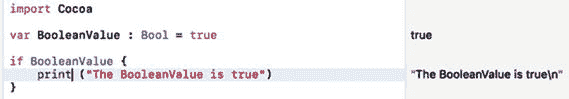

图 7-3. 运行 `if` 语句

## `if-else` 语句

`if` 语句的主要限制是它要么运行代码，要么什么都不运行。如果你希望在一组布尔值为 `true` 时运行一组代码，在布尔值为 `false` 时运行另一组代码，你可以编写两个独立的 `if` 语句，如下所示：

```
if BooleanValue {
}
if !BooleanValue {
}
```

第一个 `if` 语句在 `BooleanValue` 为 `true` 时运行。如果不是，则什么都不做。

第二个 `if` 语句在 `BooleanValue` 为 `false` 时运行。如果不是，则什么都不做。

编写两个独立 `if` 语句的问题在于程序的逻辑不够清晰。为了解决这个问题，Swift 提供了 `if-else` 语句，如下所示：

```
if BooleanValue {
// 第一组代码：布尔值为 true 时运行
} else {
// 第二组代码：布尔值为 false 时运行
}
```

`if-else` 语句正好提供两个不同的分支。如果布尔值为 `true`，则运行第一组代码。如果布尔值为 `false`，则运行第二组代码。在任何情况下，`if-else` 语句中的两组代码都不可能同时运行。

要了解布尔值如何与 `if-else` 语句配合使用，请按照以下步骤操作：

1.  在 Xcode 中打开 `IntroductoryPlayground` 文件。
2.  按如下方式编辑代码：

    ```
    import Cocoa
    var BooleanValue = true
    if BooleanValue {
    print ("The BooleanValue is true")
    } else {
    print ("The BooleanValue is false")
    }
    ```

图 7-4 显示了当 `BooleanValue` 为 `true` 时 `if-else` 语句的工作方式。将 `BooleanValue` 改为 `false`，看看 `if-else` 语句如何运行第二组代码。

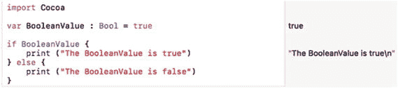

图 7-4. 运行 `if-else` 语句

## `if-else-if` 语句

`if` 语句要么运行一组代码，要么什么都不运行。`if-else` 语句总是运行一组代码或另一组代码。但是，如果你希望在两组或多组可能的代码之间进行选择怎么办？在这种情况下，你需要使用 `if-else-if` 语句。

与 `if` 语句一样，`if-else-if` 语句可能根本不运行任何代码。最简单的 `if-else-if` 语句如下所示：

```
if BooleanValue {
// 第一组代码：布尔值为 true 时运行
} else if BooleanValue2 {
// 第二组代码：布尔值为 true 时运行
}
```

使用 `if-else-if` 语句，必须有一个布尔值为 `true` 才能运行代码。如果没有布尔值为 `true`，那么可能根本不会运行任何代码。`if-else-if` 语句等效于多个 `if` 语句，如下所示：

```
if BooleanValue {
// 第一组代码：布尔值为 true 时运行
}
if BooleanValue2 {
// 第二组代码：布尔值为 true 时运行
}
```

使用 `if-else-if` 语句，你可以根据需要检查任意数量的布尔值，例如：

```
if BooleanValue {
// 第一组代码：布尔值为 true 时运行
} else if BooleanValue2 {
// 第二组代码：布尔值为 true 时运行
} else if BooleanValue3 {
// 第三组代码：布尔值为 true 时运行
} else if BooleanValue4 {
// 第四组代码：布尔值为 true 时运行
} else if BooleanValue5 {
// 第五组代码：布尔值为 true 时运行
}
```

一旦 `if-else-if` 语句找到一个为 `true` 的布尔值，它就会运行花括号内附带的代码。但是，有可能所有布尔值都不为 `true`，在这种情况下，`if-else-if` 语句内的所有代码都不会运行。

如果你想确保至少有一组代码会运行，那么你需要在 `if-else-if` 语句的末尾添加一个最终的 `else` 子句，例如：

```
if BooleanValue {
// 第一组代码：布尔值为 true 时运行
} else if BooleanValue2 {
// 第二组代码：布尔值为 true 时运行
} else if BooleanValue3 {
// 第三组代码：布尔值为 true 时运行
} else if BooleanValue4 {
// 第四组代码：布尔值为 true 时运行
} else if BooleanValue5 {
// 第五组代码：布尔值为 true 时运行
} else {
// 如果其他所有布尔值都为 false，则运行此代码
}
```

要了解布尔值如何与 `if-else-if` 语句配合使用，请按照以下步骤操作：

1.  在 Xcode 中打开 `IntroductoryPlayground` 文件。
2.  按如下方式编辑代码：

    ```
    import Cocoa
    var BooleanValue = false
    var BooleanValue2 = false
    var BooleanValue3 = false
    if BooleanValue {
    print ("BooleanValue is true")
    } else if BooleanValue2 {
    print ("BooleanValue2 is true")
    } else if BooleanValue3 {
    print ("BooleanValue3 is true")
    } else {
    print ("This prints if everything else is false")
    }
    ```

注意，因为每个布尔值都是 `false`，唯一运行的代码发生在 `if-else-if` 语句最终的 `else` 部分，如图 7-5 所示。

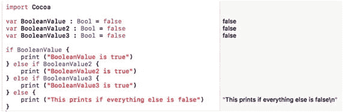

图 7-5. 运行包含多个布尔值的 `if-else-if` 语句

如果你将不同的布尔值更改为 `true`，你可以通过运行不同的代码集来观察 `if-else-if` 语句如何表现不同。

关于 `if-else-if` 语句：

*   除非最后一部分只是一个普通的 `else` 语句，否则可能不会运行任何代码。
*   程序可以在两组或多组代码之间进行选择。
*   可选选项的数量不限于像 `if-else` 语句那样只有两个选项。

由于 `if-else-if` 语句会检查多个布尔值，那么如果两个或更多布尔值为 `true` 会发生什么？在这种情况下，`if-else-if` 语句仅运行与第一个为 `true` 的布尔值关联的代码集，并忽略所有其余代码，如图 7-6 所示。

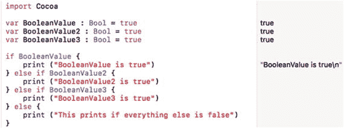

图 7-6. 运行包含多个布尔值为 true 的 `if-else-if` 语句


## `switch` 语句

`if-else-if` 语句可以让你创建两套或多套可能运行的代码。遗憾的是，当需要检查的布尔值过多时，`if-else-if` 语句会变得难以理解。为了解决这个问题，Swift 提供了 `switch` 语句。

`switch` 语句的工作方式与 `if-else-if` 语句非常相似，但它的可读性和可写性更强。主要区别在于，`switch` 语句不是检查多个布尔值，而是检查单个变量的值。基于这个单一变量的值，`switch` 语句可以选择运行不同的代码块。

最简单的 `switch` 语句会检查一个变量是否精确等于不同的值，例如：

```
switch 值/变量/表达式 {
case 值 1: // 如果变量等于值 1，则运行的第一套代码
case 值 2: // 如果变量等于值 2，则运行的第二套代码
case 值 3: // 如果变量等于值 3，则运行的第三套代码
default: // 如果其他条件都不匹配，则运行的第四套代码
}
```

`switch` 语句首先会检查一个固定值（如 38 或 "Bob"）、一个变量（代表数据）或一个表达式（如 `3 * age`，其中 `age` 是一个变量）。最终，`switch` 语句需要确定一个单一值，并将其与它找到的第一个 `case` 语句进行匹配。一旦找到完全匹配，它就会运行与该 `case` 语句关联的一行或多行代码。

要了解布尔值如何与 `case` 语句配合使用，请按照以下步骤操作：

1. 在 Xcode 中打开 `IntroductoryPlayground` 文件。
2. 按如下所示编辑代码：

```
    import Cocoa
    var whatNumber = 3
    switch whatNumber {
    case 1: print ("数字是 1")
    case 2: print ("数字是 2")
    case 3: print ("数字是 3")
    print ("这难道不神奇吗？")
    case 4: print ("数字是 4")
    case 5: print ("数字是 5")
    default: print ("数字未定义")
    }
```

由于 `whatNumber` 变量的值是 3，`switch` 语句会将其与 `case 3:` 匹配，然后运行冒号后面的 Swift 代码，如图 7-7 所示。请注意，你可以在冒号后面存放多行代码，并且无需用花括号将这些代码括起来。改变 `whatNumber` 变量的值，观察它如何影响 `switch` 语句的行为。

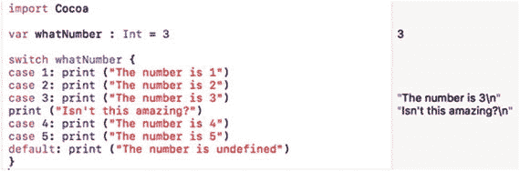

图 7-7. 运行 `switch` 语句以匹配精确值

注意：与 Objective-C 等其他编程语言不同，你不需要使用 `break` 命令来分隔 `switch` 语句中不同 `case` 里存储的代码。

上述 `switch` 语句等价于：

```
if whatNumber == 1 {
    print ("数字是 1")
} else if whatNumber == 2 {
    print ("数字是 2")
} else if whatNumber == 3 {
    print ("数字是 3")
    print ("这难道不神奇吗？")
} else if whatNumber == 4 {
    print ("数字是 4")
} else if whatNumber == 5 {
    print ("数字是 5")
} else {
    print ("数字未定义")
}
```

如你所见，`switch` 语句更简洁，更易于阅读和理解。

创建 `switch` 语句时，必须处理所有可能性。在上述 `switch` 语句中，`whatNumber` 变量可以是任何整数，因此 `switch` 语句可以显式处理从 1 到 5 的任何值。如果值不在 1 到 5 的范围内，那么 `switch` 语句的 `default` 部分会处理任何其他值。如果你未能包含 `default`，Xcode 会将你的 `switch` 语句标记为可能的错误。这是为了保护你的代码，防止因 `switch` 语句接收到它不知道如何处理的数据而崩溃。

这个 `switch` 语句的例子试图将 `值/变量/表达式` 精确匹配一个值。然而，`switch` 语句可以尝试匹配多个值。`switch` 语句有三种方式可以检查值的范围：

- 显式列出所有可能的值，用逗号分隔
- 用三个点（`...`）定义数字的起始和结束范围
- 用两个点和一个小于号（`..<`）定义起始数字和结束范围

当一个 `case` 语句列出所有用逗号分隔的值时，只有当 `switch` 的 `值/变量/表达式` 精确匹配这些值之一时，其代码才会运行。例如，考虑以下 `case` 语句：

```
switch whatNumber {
case 1, 2, 3: print ("数字是 1、2 或 3")
default: print ("数字未定义")
}
```

只有当 `whatNumber` 的值是 1、2 或 3 时，其代码才会打印 "数字是 1、2 或 3"。

显式列出所有可能的值对于少量数字来说没问题，但对于多个数字，写出每个可能的数字可能会很繁琐。作为快捷方式，Swift 允许你指定一个范围。如果你想匹配 4 到 20 之间的数字，`switch` 语句的 `case` 部分可能如下所示：

```
switch whatNumber {
case 4...20: print ("数字在 4 到 20 之间")
default: print ("数字未定义")
}
```

在这种情况下，`whatNumber` 可以是 4、20 或介于两者之间的任何数字。三个点表示一个包含起始和结束数字（4 和 20）的范围。

Swift 还可以检查一个半开范围，由两个点和一个小于号组成，例如：

```
switch whatNumber {
case 20..<49: print ("数字在 20 到 48 之间")
default: print ("数字未定义")
}
```

只有当 `whatNumber` 是 20、48 或介于两者之间的任何数字时，这个 `20..<49` 半开范围才会匹配。请注意，如果 `whatNumber` 是 49，它将不会匹配这个半开范围，但如果 `whatNumber` 是 20，它就会匹配。

要了解这三种多值变体是如何工作的，请按照以下步骤操作：

1. 在 Xcode 中打开 `IntroductoryPlayground` 文件。
2. 按如下所示编辑代码：

```
    import Cocoa
    var whatNumber = 49
    switch whatNumber {
    case 1, 2, 3: print ("数字是 1")
    println ("这难道不神奇吗？")
    case 4...20: print ("数字在 4 到 20 之间")
    case 20..<49: print ("数字在 20 到 48 之间")
    default: print ("数字未定义")
    }
```

当值为 49 时，`switch` 语句没有匹配到任何内容，因此它使用 `switch` 语句的 `default` 部分，如图 7-8 所示。

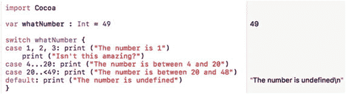

图 7-8. 运行检查多个值的 `switch` 语句

将 `whatNumber` 变量的值改为 2、12 和 48，观察 `switch` 语句如何匹配不同的值。

在前面的例子中，`switch` 语句可以检查多个值（1, 2, 3）或值的范围（`4...20`）和（`20..<49`）。然而，有时你可能想要检查一个值是小于、小于等于、大于还是大于等于。要在 `switch` 语句中检查 `<`、`<=`、`>` 或 `>=`，你必须使用以下语法：

```
case _ where 变量名 < 值:
```

`_ where` 代码告诉 Swift，如果特定变量与某个值满足 `<`、`<=`、`>` 或 `>=` 关系，则匹配此 `case`。要了解如何在 `switch` 语句中检查 `<`、`<=`、`>` 或 `>=`，请按照以下步骤操作：

1. 在 Xcode 中打开 `IntroductoryPlayground` 文件。
2. 按如下所示编辑代码：

```
    import Cocoa
    var whatNumber = 49
    switch whatNumber {
    case _ where whatNumber = 11 : print ("数字大于或等于 11")
    default: print ("数字未定义")
    }
```

当值为 49 时，`switch` 语句匹配了 `>= 11` 这个 `case` 语句，因此它打印出 "数字大于或等于 11"；见图 7-9。

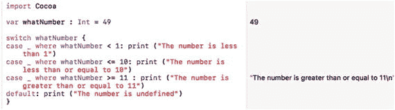

图 7-9. 运行检查多个值的 `switch` 语句


## 在 macOS 程序中做出决策

使用 playground 文件来测试 `Swift` 代码既有趣又简单，因为你可以专注于学习 `Swift` 的工作原理，而不会被编写程序的其他部分所干扰。然而，你最终还需要了解 `Swift` 代码在 playground 文件之外是如何运行的。

在这个示例程序中，用户需要输入员工 ID 号和密码。有效的员工 ID 号必须在 100 到 150 的范围内。密码必须与字符串 `"password"` 完全匹配（虽然这并非一个非常安全的密码）。

这意味着你将使用两个比较运算符来检查名字和密码是否有效。然后，你将使用一个逻辑运算符来确保两者都有效。

按照以下步骤创建一个新的 macOS 项目：

1.  在 `Xcode` 中，选择 **文件** ➤ **新建** ➤ **项目**。
2.  在 `macOS` 类别下，单击 **应用程序**。
3.  单击 **Cocoa 应用程序**，然后单击 **下一步** 按钮。`Xcode` 会询问产品名称。
4.  单击 **产品名称** 文本框并输入 `BranchingProgram`。
5.  确保 **语言** 弹出菜单显示为 `Swift`，且未选中任何复选框。
6.  单击 **下一步** 按钮。`Xcode` 会询问你希望将项目存储在哪里。
7.  选择一个文件夹来存储你的项目，然后单击 **创建** 按钮。
8.  在 **项目导航器** 中单击 `MainMenu.xib` 文件。
9.  单击 **窗口** 图标以显示用户界面的窗口，如图 7-10 所示。

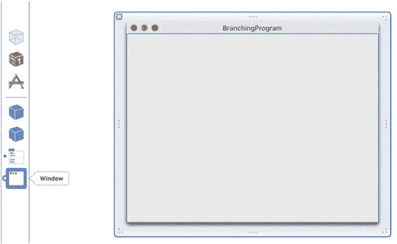

图 7-10. 显示用户界面窗口

10. 选择 **视图** ➤ **实用工具** ➤ **显示对象库**，使对象库出现在 `Xcode` 窗口的右下角。
11. 在用户界面上拖放两个标签、两个文本字段和一个按钮，使其看起来类似于图 7-11。

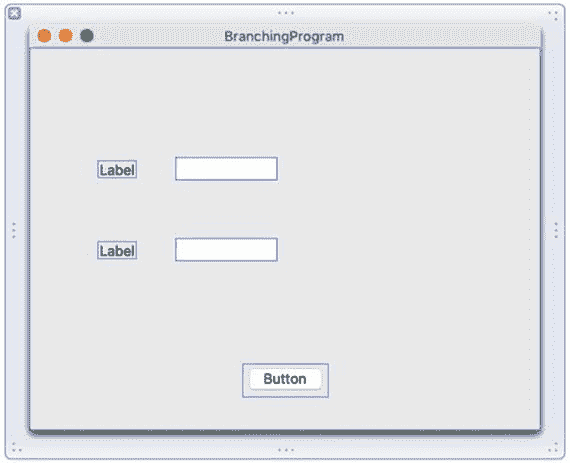

图 7-11. 使用标签、文本字段和按钮创建基本用户界面

12. 单击顶部标签以选中它。然后选择 **视图** ➤ **实用工具** ➤ **显示属性检查器**。属性检查器面板会出现在 `Xcode` 窗口的右上角，如图 7-12 所示。

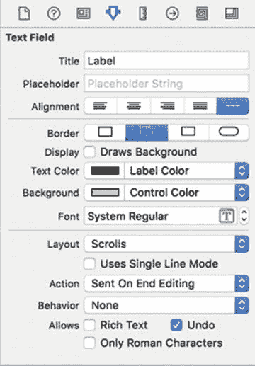

图 7-12. 标签的属性检查器面板

13. 单击 **标题** 文本框，将 `Label` 替换为 `ID`。按下 **Return** 键。注意顶部标签现在显示为 `ID`。当你更改标签的 **标题** 属性时，也就更改了该标签上显示的文本。接下来看看更改标签文本的第二种更快的方法。
14. 双击第二个标签。`Xcode` 会高亮显示你选中的标签，如图 7-13 所示。

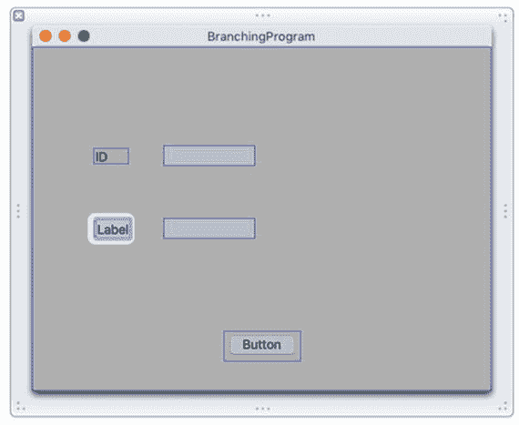

图 7-13. 双击标签即可更改文本，无需使用属性检查器面板

15. 输入 `Password` 并按下 **Return** 键。注意第二个标签现在显示为 `Password`。通过双击标签，你可以更改标签上的文本，而无需打开属性检查器面板。
16. 单击顶部文本字段，然后选择 **视图** ➤ **实用工具** ➤ **显示大小检查器**。大小检查器面板会出现在 `Xcode` 窗口的右上角，如图 7-14 所示。

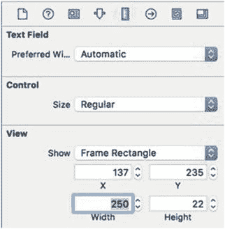

图 7-14. 大小检查器面板

17. 单击 **宽度** 文本框并输入 `250`。然后按下 **Return** 键。`Xcode` 会扩展该文本字段的宽度。
18. 单击第二个文本字段，使其周围出现操作柄。然后将最右侧的操作柄向右拖动，直到它与顶部文本字段对齐，如图 7-15 所示。

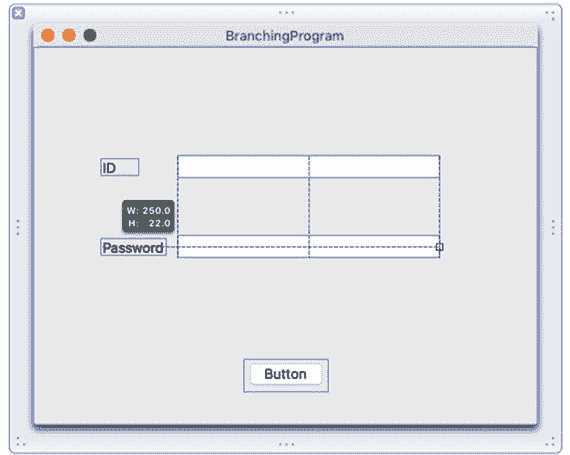

图 7-15.


## 使用鼠标对齐文本字段

19. 松开鼠标按钮。就像你可以通过属性检查器面板或直接双击标签来修改标签上的文本一样，你也可以通过大小检查器面板或使用鼠标调整项目大小来修改项目的大小。

20. 双击该按钮以选中它，然后输入 `Check Password`。接着按下 Return 键。你完成的界面应类似于图 7-16。

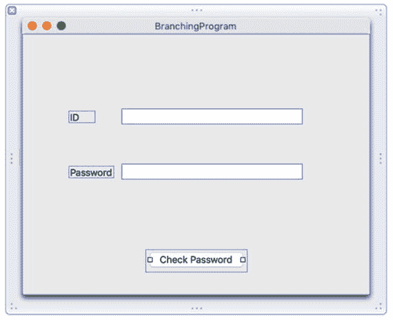

**图 7-16.** 完成的用户界面

通过这个用户界面，用户将在 ID 文本字段中输入一个 ID（整数），在密码文本字段中输入密码（字符串），然后点击`Check Password`按钮来查看 ID 和密码是否有效。一旦你拥有了用户界面，下一步就是使用 `IBOutlets` 和 `IBAction` 方法将用户界面连接到 Swift 代码。

请记住，`IBOutlets` 让你能够从用户界面检索信息或向用户界面显示信息。`IBAction` 方法则让用户界面能够促使你的程序执行某些操作。

在这个示例中，你需要两个 `IBOutlet` 变量来连接每个文本字段，以便你能够检索用户输入的数据。然后，你需要一个 `IBAction` 方法来连接到 `Check Password` 按钮。这样，当用户点击 `Check Password` 按钮时，这个 `IBAction` 方法就能验证 ID 和密码。

要将 Swift 代码连接到用户界面，请遵循以下步骤：

1. 在 Xcode 窗口中用户界面仍然可见的情况下，选择 **View ➤ Assistant Editor ➤ Show Assistant Editor**。`AppDelegate.swift` 文件会显示在用户界面旁边，如图 7-17 所示。

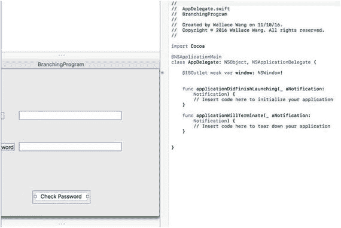

**图 7-17.** 助理编辑器将用户界面显示在 `AppDelegate.swift` 文件旁边

2. 将鼠标移到顶部的文本字段上，按住 **Control** 键，然后从顶部文本字段拖拽到 `AppDelegate.swift` 文件中现有 `@IBOutlet` 行的下方，如图 7-18 所示。

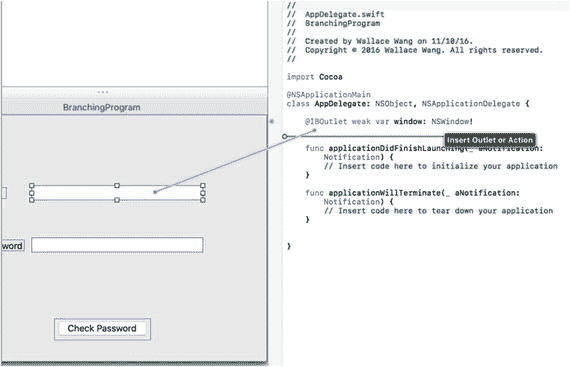

**图 7-18.** 从顶部文本字段按住 Control 键拖拽到 `AppDelegate.swift` 文件

3. 松开鼠标和 **Control** 键。会弹出一个窗口，如图 7-19 所示。

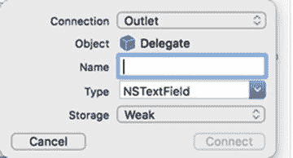

**图 7-19.** 用于定义 `IBOutlet` 的弹出窗口

4. 点击 **Name** 文本字段，输入 `IDField`，然后点击 **Connect** 按钮。Xcode 会创建一个 `IBOutlet`。

5. 将鼠标移到底部的文本字段上，按住 **Control** 键，将鼠标拖拽到 `AppDelegate.swift` 文件中 `@IBOutlet` 行的下方。

6. 松开鼠标和 **Control** 键。会弹出一个窗口。

7. 点击 **Name** 文本字段，输入 `PasswordField`，然后点击 **Connect** 按钮。Xcode 会创建另一个 `IBOutlet`。你现在应该有两个 `IBOutlets`，分别代表你用户界面上的两个文本字段：

```swift
@IBOutlet weak var IDField: NSTextField!
@IBOutlet weak var PasswordField: NSTextField!
```

8. 将鼠标移到 **Check Password** 按钮上，按住 **Control** 键，然后将鼠标拖拽到 `AppDelegate.swift` 文件中最后一个大括号的上方，如图 7-20 所示。

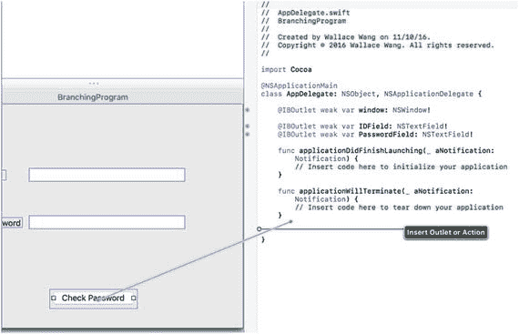

**图 7-20.** 从按钮按住 Control 键拖拽到 `AppDelegate.swift` 文件

9. 松开鼠标和 **Control** 键。会弹出一个窗口。

10. 点击 **Connection** 弹出菜单，选择 **Action** 以创建一个 `IBAction` 方法。

11. 点击 **Name** 文本字段，输入 `checkPassword`。

12. 点击 **Type** 弹出菜单，选择 `NSButton`，如图 7-21 所示。

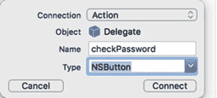

**图 7-21.** 定义一个 `IBAction` 方法

13. 点击 **Connect** 按钮。Xcode 会创建一个空的 `IBAction` 方法。

14. 按如下方式修改 `IBAction` `checkPassword` 方法：

```swift
@IBAction func checkPassword(sender: NSButton) {
    let validPassword = "password"
    var ID : Int
    ID = IDField.integerValue
    let myAlert = NSAlert()
    switch ID {
    case 100...150: if (PasswordField.stringValue == validPassword) {
        myAlert.messageText = "Access granted"
    } else {
        myAlert.messageText = "No access"
    }
    default:
        myAlert.messageText = "No access"
    }
    myAlert.runModal()
}
```

这个 `IBAction` 方法使用一个 `switch` 语句来检查用户输入的 ID 是否在 `100...150` 范围内。如果是，接着检查用户在密码文本字段中是否输入了 “password”。如果这也是真的，那么 `switch` 语句会在一个警报对话框中显示 “Access granted”。如果 ID 不在 `100...150` 范围内，或者密码文本字段中没有包含 “password”，那么警报对话框会显示 “No access。”。在上述 `IBAction` 代码中，你也可以将这两行代码：

```swift
var ID : Int
ID = IDField.integerValue
```

替换为使用类型推断的一行代码，如下所示：

```swift
var ID = IDField.integerValue
```

**注意：** 你可能想知道上述代码中的 `stringValue` 和 `integerValue` 是从哪里来的。如果你查看你的 `IBOutlets`，你会发现每个文本字段的 `IBOutlet` 都基于 `NSTextField` 类。在 Xcode 的文档中查找 `NSTextField`，你会发现 `NSTextField` 基于 `NSControl` 类。`NSControl` 类包含像 `stringValue` 和 `integerValue` 这样的属性，这意味着任何基于 `NSTextField` 的对象（例如代表你用户界面上文本字段的 `IBOutlets`）也可以使用这些 `stringValue` 和 `integerValue` 属性。

15. 选择 **Product ➤ Run**。Xcode 会运行你的 `BranchingProgram` 项目。

16. 点击你的 `BranchingProgram` 用户界面的 **ID** 文本字段，输入 `120`。

17. 点击你的 `BranchingProgram` 用户界面的 **Password** 文本字段，输入 `password`。

18. 点击 **Check Password** 按钮。会弹出一个警报对话框，如图 7-22 所示。

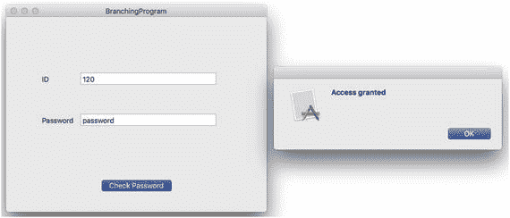

**图 7-22.** 显示一个警报对话框

19. 点击警报对话框中的 **OK** 按钮使其消失。

20. 点击你的 `BranchingProgram` 用户界面的 **ID** 文本字段，输入 `1`。

21. 点击 **Check Password** 按钮。注意，现在警报对话框显示的是 “No access。”

22. 点击警报对话框中的 **OK** 按钮使其消失。

23. 选择 **BranchingProgram ➤ Quit BranchingProgram**。


### 总结

为了智能地响应用户，每个程序都需要一种做出决策的方式。做出决策的第一步是定义一个布尔值，它要么是`true`，要么是`false`。布尔值可以通过比较运算符或逻辑运算符计算得出。

一旦你能确定一个布尔值，就可以在分支语句中使用该布尔值来决定执行哪段代码。最简单的分支是`if`语句，它要么执行一组代码，要么什么也不做。

另一种分支是`if-else`语句，它恰好提供两组待执行的代码。如果布尔值为`true`，则执行第一组代码；否则，执行第二组代码。

如果你需要在三组或更多组代码之间进行选择，可以使用`if-else-if`语句。不过，使用`switch`语句通常更简单。当使用`switch`语句时，你必须预判所有可能的值。

`switch`语句可以让你匹配精确值、一组值、一个范围（包含起始和结束数值）、半个范围（仅包含起始数值，不包含结束数值），或者使用 `<`、`<=`、`>` 和 `>=` 进行比较。

分支语句与布尔值相结合，使你的程序能够根据接收到的数据做出决策并运行不同的代码。本质上，分支语句能让你的程序智能地响应外部数据。

