# 8. 使用循环重复执行代码

编程的基本目标是编写尽可能少的代码，同时做尽可能多的事情。你写的代码越少，程序日后就越容易理解和修改。你的代码能做的事情越多，程序就越强大。

减少代码编写量的一种方法是在函数中复用代码。第二种复用代码的方法是使用循环。循环可以多次运行一行或多行代码，从而无需编写多条冗余代码。

例如，如果你想打印一条消息五次，可以编写如下代码：

```
print ("Hello")
print ("Hello")
print ("Hello")
print ("Hello")
print ("Hello")
```

这样做虽然繁琐，但可以正常工作。然而，如果你突然决定需要将一条消息打印一千次，那么你现在必须书写那个命令一千次。不仅反复输入相同的命令很繁琐，而且还会增加其中某条命令出错的概率。

更简单的方法是使用循环。循环允许你编写一次一个或多个命令，然后按照你需要运行的次数来执行这些命令，例如：

```
var counter = 1
while counter <= 5 {
    print ("Hello")
    counter = counter + 1
}
```

上述循环运行了五次，并打印了五次"Hello"。如果你想打印一千次"Hello"，只需将数字 5 替换为 1000 即可。循环让代码更容易编写和修改，同时完成更多工作。

## `while` 循环

Swift 中最简单的循环称为 `while` 循环，其结构如下：

```
while 布尔值 {
}
```

在 `while` 循环执行任何操作之前，它首先检查布尔值是 `true` 还是 `false`。如果是 `true`，则运行其花括号内的代码一次。然后它会再次检查其布尔值，看它是否变为 `false` 还是仍为 `true`。一旦这个布尔值变为 `false`，`while` 循环就会停止。

由于 `while` 循环在执行任何操作之前会检查布尔值，因此 `while` 循环有可能永远不会执行其任何代码。更重要的是，只有当其布尔值为 `true` 时，`while` 循环才会运行。这意味着在 `while` 循环的花括号内，必须存在最终将布尔值变为 `false` 的代码。

如果 `while` 循环未能将其布尔值从 `true` 变为 `false`，那么循环将永远运行，这被称为无限循环。无限循环可能导致程序崩溃或无响应，从而无法再与用户交互。

在最简单的层面上，`while` 循环的布尔值可以只是 `true` 或 `false`，例如：

```
while true {
}
```

更常见的是，`while` 循环使用比较运算符来确定布尔值，例如：

```
while counter <= 5 {
}
```

只要 `counter <= 5` 保持为 `true`，`while` 循环就会运行。当 `counter <= 5` 不再为 `true` 时，`while` 循环将停止。

使用 `while` 循环时，你需要在循环开始前定义布尔值（确保它是 `true` 或 `false`），然后在 `while` 循环内部的某处更改该布尔值（以确保 `while` 循环最终停止）。

要了解布尔值如何与 `while` 循环协同工作，请按照以下步骤创建一个新的 playground：

1. 在 Xcode 中打开 Introductory Playground 文件。
2. 按如下方式编辑代码：

    ```
    import Cocoa
    var counter = 1
    while counter <= 10 {
        print ("Hello")
        counter = counter + 1
    }
    ```

请注意，`var counter = 1` 这一行定义了 `while` 循环用来确定布尔值（`true` 或 `false`）的变量。同时也要注意 `while` 循环内部的 `counter = counter + 1` 这一行。它不断地改变 `while` 循环用来决定何时停止的变量。通过更改布尔比较条件（`counter <= 10`），你可以改变 `while` 循环的运行次数。

为了确保你能看到 `print` 命令的作用，点击左下角的“显示调试区域”图标，使调试区域显示出来，如图 8-1 所示。

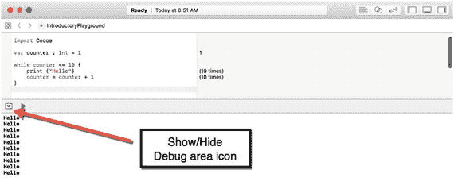

**图 8-1.** 在 playground 中运行 `while` 循环

使用 `while` 循环时，请记住以下几点：

- 在 `while` 循环之前，确保定义 `while` 循环布尔值所使用的任何变量（例如 `var counter = 1` 这一行）。
- `while` 循环可能会运行零次或多次。
- 在 `while` 循环内部，确保循环所使用的布尔值最终能变为 `false`，以避免创建无限循环（例如 `counter = counter + 1` 这一行）。

## `repeat-while` 循环

作为 `while` 循环的替代方案，Swift 还提供了 `repeat-while` 循环，其工作方式完全相同。唯一的区别是，`repeat-while` 循环不是在运行前检查布尔值，而是在运行之后才检查。

这意味着 `repeat-while` 循环至少会运行一次。`repeat-while` 循环的结构如下：

```
repeat {
} while 布尔值
```

与 `while` 循环一样，`repeat-while` 循环也需要在其循环内部包含能够将其布尔值从 `true` 变为 `false` 的代码，并且还需要在 `repeat-while` 循环之前初始化用于计算该循环布尔值的任何变量。

要了解布尔值如何与 `repeat-while` 循环协同工作，请按照以下步骤操作：

1. 确保在 Xcode 中加载了 IntroductoryPlayground 文件。
2. 按如下方式编辑代码：

    ```
    import Cocoa
    var counter = 1
    repeat {
        print ("Goodbye")
        counter = counter + 1
    } while counter <= 10
    ```

请注意，布尔值（`counter <= 10`）决定了 `repeat-while` 循环运行的次数，如图 8-2 所示。

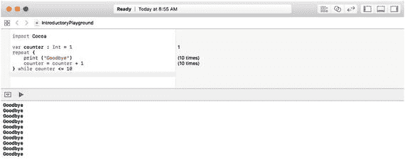

**图 8-2.** 在 playground 中运行 `repeat-while` 循环

请记住，`while` 循环和 `repeat-while` 循环的主要区别在于：`repeat-while` 循环至少会运行一次，而 `while` 循环如果其布尔值初始为 `false`，则可能一次都不运行。


## for-in 循环

`while` 或 `repeat-while` 循环会重复多少次？这完全取决于其布尔值。如果你希望循环运行固定的次数，你可以使用 `while` 或 `repeat-while` 循环进行简单的计数，例如：

```
var counter = 1
while counter <= 5 {
    print ("while 循环 \(counter)")
    counter = counter + 1
}
counter = 1
repeat {
    print ("repeat 循环 \(counter)")
    counter = counter + 1
} while counter <= 5
```

这两个循环都恰好运行五次，如图 8-3 所示。

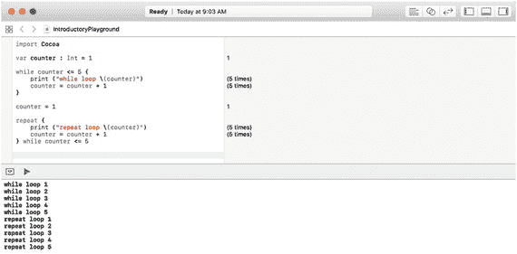

图 8-3. `while` 和 `repeat-while` 循环可以运行固定的次数

请注意，`print` 命令只能打印字符串。任何时候你想在 `print` 命令中使用非字符串的值，可以将其放在括号内，并在前面加上一个 `\` 符号，例如 `\(counter)`。

使用 `while` 或 `repeat-while` 循环进行计数可能比较笨拙，因为你必须确保创建一个计数变量，并在 `while` 或 `repeat-while` 循环内持续更新该计数变量，以避免无限循环。

当你希望循环运行固定次数时，使用 `for-in` 循环要好得多。其主要优势在于，`for-in` 循环自动知道如何计数，因此你不必指定何时停止。

要使用 `for-in` 循环，你需要指定以下内容：

- 起始值
- 结束值
- 起始值和结束值之间的范围，例如 `...` 或 `..<`

`for-in` 循环的结构如下所示：

```
for 计数变量 in 起始值...结束值 {
}
```

这告诉 Swift 从 `起始值` 开始按 1 递增计数，并在达到 `结束值` 时停止，例如：

```
for i in 1...5 {
    print ("循环 \(i)")
}
```

上面的 `for-in` 循环从 1, 2, 3, 4 计数，并在 5 之后停止。下面类似的 `for-in` 循环使用了不同的范围，告诉 Swift 在 `结束值` 之前停止计数：

```
for i in 1..<5 {
    print ("第二个循环 \(i)")
}
```

与前一个 `for-in` 循环不同，此 `for-in` 循环从 1, 2, 3 计数，并在 4 之后停止，如图 8-4 所示。

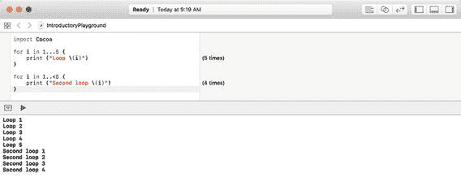

图 8-4. 比较 `for-in` 循环中的不同范围

请注意，`for-in` 循环远比比 `while` 或 `repeat-while` 循环简单，后者需要初始化一个计数变量，然后在循环内更新该计数变量以防止无限循环。

默认情况下，`for-in` 循环总是按 1 递增计数。如果你希望按 1 以外的值计数，可以按如下方式指定增量值：

```
for i in 起始值...结束值 where i%增量值 == 0 {
}
```

此 `for-in` 循环使用余数运算符（`%`）来确定要计数的值。因此，如果你想按 3 增量计数，可以使用以下 `for-in` 循环：

```
for i in 1...20 where i%3 == 0 {
}
```

此 `for-in` 循环从 1 开始计数，但在运行花括号内的任何代码之前，它会将计数变量（`i`）除以 3，以确定它是否能被 3 整除（如 Swift 代码 `== 0` 所示，等于 0）。如果计数变量（`i`）能被 3 整除，则运行循环内的代码。

要查看 `for-in` 循环是否按增量计数运行，请按照以下步骤创建一个新的 playground：

1. 在 Xcode 中打开 Introductory Playground 文件。
2. 按如下方式编辑代码：

```
for i in 1...20 where i%3 == 0 {
    print ("循环 \(i)")
}
```

此 `for-in` 循环从 1 开始，但 `1%3` 不等于 0，因此跳到 2。然而，`2%3` 也不等于 0，因此跳到 3。由于 `3%3` 等于 0，它运行花括号内的代码并打印“循环 3”。此后继续，直到计数变量（`i`）达到 20，如图 8-5 所示。

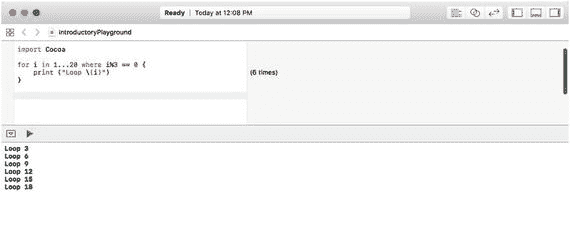

图 8-5. `for-in` 循环可以按增量计数

如果你将 `i%3` 替换为 `i%4`，`for-in` 循环将按 4 增量计数。只需更改这个值，你就可以定义 `for-in` 循环如何以 1 以外的增量进行计数。

### 使用 for-in 循环遍历数组

使用 `for-in` 语句最直接的方式是指定起始值和结束值，从 1 数到 10 或从 0 数到 34。然而，`for-in` 循环在遍历存储在数组（一种数据结构）中的数据列表时也特别方便。`for-in` 循环自动知道从哪里开始和结束，因此你永远不必担心自己数出有多少项。

用于遍历数据列表的 `for-in` 循环结构如下所示：

```
for 计数变量 in 项目列表 {
}
```

`计数变量` 对某种列表中的每一项进行计数，而 `项目列表` 代表某种列表，例如数组（由数据列表组成）。要了解 `for-in` 循环如何工作，请执行以下步骤：

1. 确保在 Xcode 中加载了 `IntroductoryPlayground` 文件。
2. 按如下方式编辑代码：

```
import Cocoa
let names = ["Oscar", "Sally", "Marty", "Louis"]
for person in names {
    print (person)
}
```

图 8-6 显示了 `for-in` 循环如何运行四次，因为 `names` 数组包含四个项目。如果你向此数组添加或删除一个名称，`for-in` 循环会自动计数数组中项目的新数量。

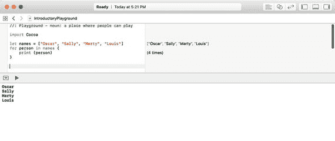

图 8-6. 使用 `for-in` 循环遍历数组

## 提前退出循环

通常，循环会一直运行直到布尔值改变。然而，你可以通过使用 `break` 命令提前退出循环。通常此循环会运行四次：

```
let names = ["Oscar", "Sally", "Marty", "Louis"]
for person in names {
    print (person)
}
```

如果你插入一个 `break` 命令，可以使此循环仅运行一次后退出，如下所示：

```
let names = ["Oscar", "Sally", "Marty", "Louis"]
for person in names {
    print (person)
    break
}
```

此 `for-in` 循环将运行一次，打印名称“Oscar”，遇到 `break` 命令，然后退出 `for-in` 循环。当然，在 `for-in` 循环中一直放置 `break` 命令来提前停止它相当没有意义，因此更常见的是将 `break` 命令与分支语句一起使用。这样，如果某个布尔值为真，循环就会提前退出。否则，循环将继续运行。

要了解如何提前退出循环，请执行以下步骤：

1. 确保在 Xcode 中加载了 `IntroductoryPlayground` 文件。
2. 按如下方式编辑代码：

```
import Cocoa
let employees = ["Fred", "Jane", "Sam", "Kelly"]
for person in employees {
    if person == "Sam" {
        print ("Break 命令")
        break
    }
    print (person)
}
```

此 `for-in` 循环通常运行四次，因为 `employees` 数组包含四个名称。然而，一旦 `for-in` 循环找到名称“Sam”，它就会打印该名称，遇到 `break` 命令，然后提前退出 `for-in` 循环，因此它只运行了三次，如图 8-7 所示。

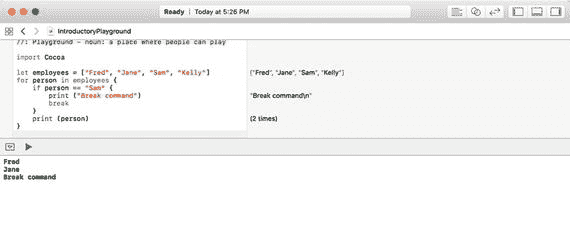

图 8-7. 使用 `break` 命令提前退出循环


## 在 macOS 程序中使用循环

在下面的示例程序中，计算机会随机生成一个 1 到 10 之间的数字。用户必须猜出这个数字。为防止用户猜测超出 1 到 10 的范围，用户界面允许用户通过滑块选择数值。

每次用户猜错时，标签会显示提示信息，说明猜测的数字过高或过低。当用户猜对数字时，循环会打印出每次猜测的列表，并在警告对话框中显示。

请按照以下步骤创建一个新的 macOS 项目：

1. 在 Xcode 中，选择 **文件** ➤ **新建** ➤ **项目**。
2. 在 macOS 类别下点击 **应用程序**。
3. 点击 **Cocoa 应用程序**，然后点击 **下一步** 按钮。Xcode 会要求输入产品名称。
4. 点击 **产品名称** 文本框，输入 `LoopingProgram`。
5. 确保 **语言** 弹出菜单显示为 **Swift**，且未选中任何复选框。
6. 点击 **下一步** 按钮。Xcode 会询问项目存储位置。
7. 选择一个文件夹来存储项目，然后点击 **创建** 按钮。
8. 在项目导航器中点击 `MainMenu.xib` 文件。
9. 点击 **窗口** 图标以显示用户界面窗口，如图 8-8 所示。

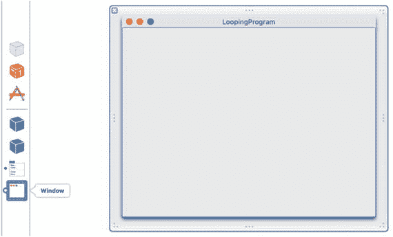

图 8-8. 显示用户界面窗口

10. 选择 **视图** ➤ **工具** ➤ **显示对象库**，在 Xcode 窗口右下角显示对象库。
11. 在用户界面上拖入一个水平滑块、两个标签和一个按钮，并调整其大小，使其外观类似于图 8-9。

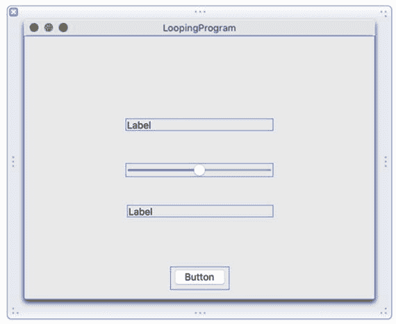

图 8-9. 创建包含两个标签、一个水平滑块和一个按钮的基本用户界面

12. 双击顶部的标签进行选中。然后选择 **视图** ➤ **工具** ➤ **显示属性检查器**。属性检查器面板会出现在 Xcode 窗口右上角。
13. 点击 **标题** 文本框，输入 `Guess a number`。
14. 点击居中对齐图标，如图 8-10 所示。

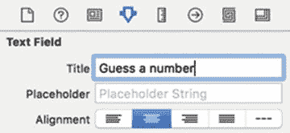

图 8-10. 标签的属性检查器面板

15. 双击底部的标签，输入 `Your guesses =`，然后按回车键。
16. 双击按钮，输入 `Guess`，然后按回车键。用户界面应如图 8-11 所示。

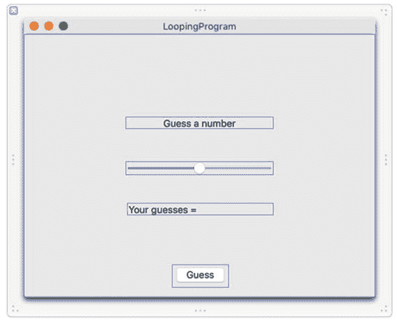

图 8-11. 完成后的用户界面

17. 点击水平滑块进行选中，然后选择 **视图** ➤ **工具** ➤ **显示属性检查器**。属性检查器面板会出现在 Xcode 窗口右上角。
18. 选中 **仅在刻度线上停止** 复选框。
19. 点击 **仅在刻度线上停止** 复选框正上方的文本框，输入 `10`。
20. 点击 **最小值** 文本框，输入 `1`。
21. 点击 **最大值** 文本框，输入 `10`。
22. 点击 **当前** 文本框，输入 `5`，如图 8-12 所示。

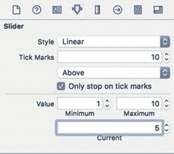

图 8-12. 修改水平滑块属性

通过此用户界面，用户将使用水平滑块在 1 到 10 之间选择一个数字。如果用户猜的数字过高，标签会显示 "Too High"。如果用户猜的数字过低，标签会显示 "Too Low"。

每次用户猜错时，底部标签会显示错误的猜测。当用户猜对数字时，顶部标签会显示 "You got it!"。

在此示例中，你需要两个`IBOutlet`变量来连接每个标签，以便在每个标签上显示信息。然后，你需要一个`IBAction`方法来连接 Guess 按钮。这样，当用户点击 Guess 按钮时，`IBAction`方法可以通过水平滑块检查用户是否选对了数字。

你需要编写 Swift 代码，在 1 到 10 之间随机选择一个数字。然后使用循环列出用户的所有猜测，并在警告对话框中显示结果。

如果你不完全理解示例中的所有 Swift 代码，不必担心。只要确保你理解代码的功能即可，不必纠结于代码具体是如何工作的。在现阶段，重要的是看到更复杂的程序实际运行起来。

要将 Swift 代码连接到用户界面，请按照以下步骤操作：

1. 在 Xcode 窗口中用户界面仍然显示的情况下，选择 **视图** ➤ **辅助编辑器** ➤ **显示辅助编辑器**。`AppDelegate.swift` 文件会出现在用户界面旁边。
2. 将鼠标移动到顶部标签上，按住 Control 键，从顶部文本框拖拽到 `AppDelegate.swift` 文件中现有的 `@IBOutlet` 行下方，如图 8-13 所示。

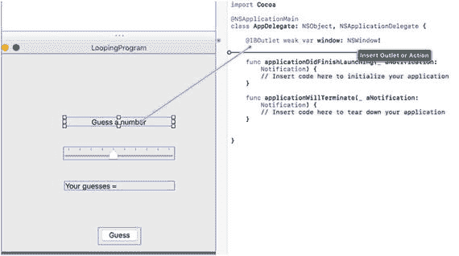

图 8-13. 从顶部标签按住 Control 键拖拽到 AppDelegate.swift 文件

3. 松开鼠标和 Control 键。会弹出一个窗口，如图 8-14 所示。

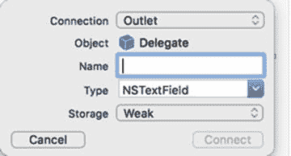

图 8-14. 用于定义 IBOutlet 的弹出窗口

4. 点击 **名称** 文本框，输入 `messageLabel`，然后点击 **连接** 按钮。Xcode 会创建一个 `IBOutlet`。
5. 将鼠标移动到底部标签上，按住 Control 键，拖拽到 `AppDelegate.swift` 文件的 `@IBOutlet` 行下方。
6. 松开鼠标和 Control 键。会弹出一个窗口。
7. 点击 **名称** 文本框，输入 `guessLabel`，然后点击 **连接** 按钮。Xcode 会创建另一个 `IBOutlet`。
8. 将鼠标移动到水平滑块上，按住 Control 键，拖拽到 `AppDelegate.swift` 文件的 `@IBOutlet` 行下方。
9. 松开鼠标和 Control 键。会弹出一个窗口。
10. 点击 **名称** 文本框，输入 `guessSlider`，然后点击 **连接** 按钮。Xcode 会创建又一个 `IBOutlet`。
11. 现在你应该有三个 `IBOutlet`，分别代表用户界面中的两个文本框：

```swift
@IBOutlet weak var messageLabel: NSTextField!
@IBOutlet weak var guessLabel: NSTextField!
@IBOutlet weak var guessSlider: NSSlider!
```

12. 将鼠标移动到 Guess 按钮上，按住 Control 键，拖拽到 `AppDelegate.swift` 文件中的最后一个花括号上方。
13. 松开鼠标和 Control 键。会弹出一个窗口。
14. 点击 **连接** 弹出菜单，选择 **操作** 以创建一个 `IBAction` 方法。
15. 点击 **名称** 文本框，输入 `checkGuess`。
16. 点击 **类型** 弹出菜单，选择 `NSButton`，如图 8-15 所示。

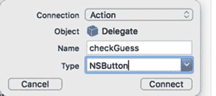

图 8-15. 定义 IBAction 方法

17. 点击 **连接** 按钮。Xcode 会创建一个空白的 `IBAction` 方法。
18. 按如下方式修改 `IBAction checkGuess` 方法：


```
@IBAction func checkGuess (_ sender: NSButton) {
    var userGuess = 0
    // 从水平滑块获取猜测值
    userGuess = guessSlider.integerValue
    // 将猜测值存入 guessArray
    guessArray.append(userGuess)
    if userGuess < randomNumber {
        messageLabel.stringValue = "太低"
    } else if userGuess > randomNumber {
        messageLabel.stringValue = "太高"
    } else {
        messageLabel.stringValue = "猜对了！"
        arrayTotal = guessArray.count
        for i in 0..<arrayTotal {
            guessHistory += "第 \(i+1) 次猜测 = \(guessArray[i])" + "\r\n"
        }
        let myAlert = NSAlert()
        myAlert.messageText = guessHistory
        myAlert.runModal()
    }
    guessLabel.stringValue = guessLabel.stringValue + " \(userGuess)"
}
```

让我们仔细分析这个 `IBAction` 方法，以便准确理解其执行过程。首先，用户需要使用水平滑块选择一个数字进行猜测。选定数字后，用户需要点击“猜测”按钮，该按钮会触发名为 `checkGuess` 的 `IBAction` 方法。下面这行代码声明了一个名为 `userGuess` 的整型变量并将其初始化为 0。这行代码并非绝对必要，但它确保了 `userGuess` 变量有一个初始值。

```
var userGuess = 0
```

下一行代码从水平滑块中获取数值，该滑块由名为 `guessSlider` 的 `IBOutlet` 变量表示。要获取水平滑块代表的整数值，需要使用 `integerValue` 属性。该属性将水平滑块的值存入刚刚声明为整型变量的 `userGuess` 中。

```
userGuess = guessSlider.integerValue
```

下一行代码将 `userGuess` 变量中存储的值添加到名为 `guessArray` 的数组中。该数组必须事先在程序中定义。

```
guessArray.append(userGuess)
```

这个 if-else if 语句创建了三个分支。第一个分支在 `userGuess` 变量小于 `randomNumber` 变量时执行，`randomNumber` 变量必须事先在程序中定义。该分支会在 `messageLabel` IBOutlet 表示的标签中显示“太低”文本。

```
if userGuess < randomNumber {
    messageLabel.stringValue = "太低"
```

第二个分支在 `userGuess` 变量大于 `randomNumber` 变量时执行。该分支会在 `messageLabel` IBOutlet 表示的标签中显示“太高”文本。

```
} else if userGuess > randomNumber {
    messageLabel.stringValue = "太高"
```

第三个分支在 `userGuess` 变量既不小于也不大于 `randomNumber` 变量时执行，这意味着它必须与 `randomNumber` 完全相等。该分支会在 `messageLabel` IBOutlet 表示的标签中显示“猜对了！”文本。

```
} else {
    messageLabel.stringValue = "猜对了！"
```

然后它统计 `guessArray` 中存储的元素总数，并将该值存入 `arrayTotal` 变量，该变量必须事先在程序中定义。

```
arrayTotal = guessArray.count
```

现在，它使用一个 for 循环从 0 遍历到 `arrayTotal – 1 (i < arrayTotal)`，并每次递增 1 (`i++`)。该循环创建一个字符串，存储猜测序号（例如`第 1 次猜测`）以及用户选择的猜测值，存入名为 `guessHistory` 的字符串变量中，该变量必须事先在程序中定义。请注意，通过在括号内的非字符串值两侧使用 `\()` 符号，可以将数字打印到字符串中。这使得无需先将非字符串值转换为字符串数据类型即可将其存储在字符串中。另请注意，如果直接键入 `第 \(i) 次猜测`，则第一个字符串将会存储值 `第 0 次猜测` 作为首次猜测。为避免这种情况，需要在当前 `i` 值的基础上加 1。注意，字符串末尾还包含 `\r\n` 字符。这些符号分别代表回车符和换行符。这些是不可见字符，用于告诉 Xcode，如果添加更多文本，它将显示在下一行。

```
for var i in 0..<arrayTotal {
    guessHistory += "第 \(i+1) 次猜测 = \(guessArray[i])" + "\r\n"
}
```

for 循环内部的代码使用复合赋值运算符 (`+=`) 将此字符串添加到 `guessHistory` 变量中已存储的任何字符串中。由于 `\r\n` 字符会产生回车和换行，任何新添加的字符串都会出现在下一行。接下来的三行代码创建了一个警报对话框 (`NSAlert`)，将 `guessHistory` 变量中的字符串存储到警报对话框的 `messageText` 属性中，然后显示该对话框，展示猜测次数以及每次猜测所选数字，如图 8-16 所示。

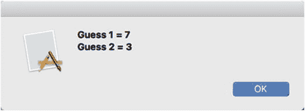

图 8-16. 警报对话框中显示的典型结果

```
var myAlert = NSAlert()
myAlert.messageText = guessHistory
myAlert.runModal()
```

`IBAction` 方法的最后一行将用户的猜测值存储到 `guessLabel` IBOutlet 中，这使得文本显示在底部标签中。

```
guessLabel.stringValue = guessLabel.stringValue + " \(userGuess)"
```

19. 编辑 IBAction 方法上方的代码，使其如下所示：

```
import Cocoa
@NSApplicationMain
class AppDelegate: NSObject, NSApplicationDelegate {
    @IBOutlet weak var window: NSWindow!
    @IBOutlet weak var messageLabel: NSTextField!
    @IBOutlet weak var guessLabel: NSTextField!
    @IBOutlet weak var guessSlider: NSSlider!
    var randomNumber : Int
    var guessHistory : String
    var guessNumber : Int
    var guessArray = [Int]()
    var arrayTotal : Int
    override init () {
        self.guessHistory = ""
        self.guessNumber = 0
        self.guessArray = []
        self.arrayTotal = 0
        self.randomNumber = 1 + Int(arc4random_uniform(10))
        // Int(arc4random_uniform(10)) 会选择一个介于 0 和 9 之间的随机数，因此需要加 1，使其选择一个介于 1 和 10 之间的随机数
    }
    func applicationDidFinishLaunching(aNotification: NSNotification) {
        // 在此处插入代码以初始化应用程序
    }
    func applicationWillTerminate(aNotification: NSNotification) {
        // 在此处插入代码以销毁应用程序
    }
}
```

`IBOutlet` 变量连接到用户界面上的控件：

```
@IBOutlet weak var window: NSWindow!
@IBOutlet weak var messageLabel: NSTextField!
@IBOutlet weak var guessLabel: NSTextField!
@IBOutlet weak var guessSlider: NSSlider!
```

接下来的五行代码声明了整个 `AppDelegate` 类可以使用的变量：

```
var guessHistory : String
var guessNumber : Int
var guessArray = [Int]()
var arrayTotal : Int
var randomNumber : Int
```

当你在类内部定义变量（称为属性）时，需要为它们赋予初始值。这就是 `override init` 方法的作用。


```swift
override init () {
    self.guessHistory = ""
    self.guessNumber = 0
    self.guessArray = []
    self.arrayTotal = 0
    self.randomNumber = 1 + Int(arc4random_uniform(10))
    // Int(arc4random_uniform(10)) 会在 0 到 9 之间随机选取一个整数，因此需要加 1，使其在 1 到 10 之间选取随机数
}
```

`self`关键字告诉 Xcode 所有这些变量都定义在同一个类（`AppDelegate`类）中。最后一行代码生成一个介于 1 和 10 之间的随机数。整个程序的工作方式是：首先创建所有变量，然后运行`override init`方法为这些变量存储初始值。此时，程序等待用户在水平滑动条中选择一个值并点击 Guess 按钮。

20. 选择 Product ➤ Run。Xcode 会运行你的 LoopingProgram 项目。
21. 在水平滑动条中点击一个值来猜测数字。
22. 点击 Guess 按钮。如果你猜得太低或太高，将出现"Too Low"或"Too High"信息。最终当你猜中正确数字时，会出现一个警告对话框，如图 8-17 所示。

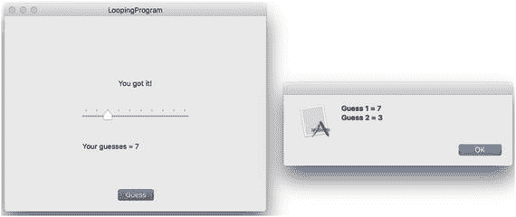

图 8-17 显示警告对话框

23. 点击警告对话框中的 OK 按钮以关闭它。
24. 选择 LoopingProgram ➤ Quit LoopingProgram。

### 小结

循环通过运行代码直到布尔值变为`false`来重复执行一行或多行代码。`while`循环首先检查布尔值，这意味着它可以运行零次或多次。`repeat-while`循环最后检查布尔值，这意味着它可以运行一次或多次。

创建`while`或`repeat-while`循环时，始终确保循环有结束的方法。如果循环永不结束，就会变成无限循环，导致程序假死且无响应。

`for-in`循环允许你根据起始值和结束值指定循环运行的次数。要使`for-in`循环以非 1 的增量计数，可以使用取余运算符（`%`）配合`where`命令。除了遍历一系列值外，`for-in`循环还可以自动计算列表中的项数。

每种循环都有其优缺点，但你可以使每种循环实现其他循环的功能。如果需要提前退出循环，可以结合`if`语句使用`break`命令。

循环让你的程序能够执行重复性任务，而无需编写重复的命令。只需确保循环最终会结束，并且在停止前运行了正确的次数。

