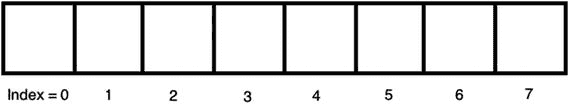
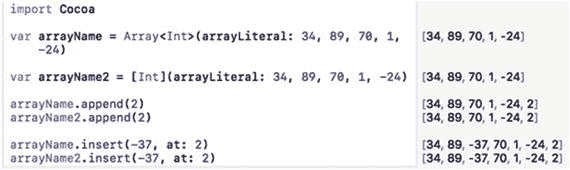
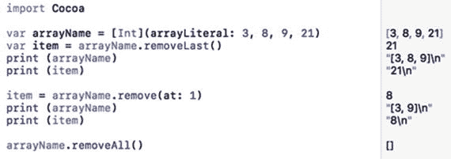
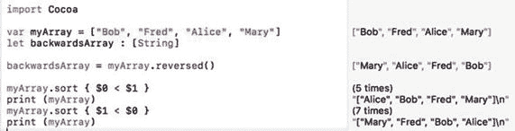
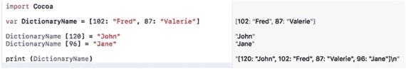
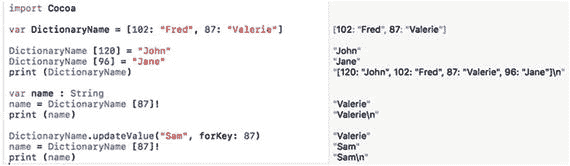
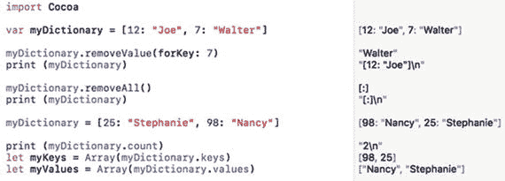
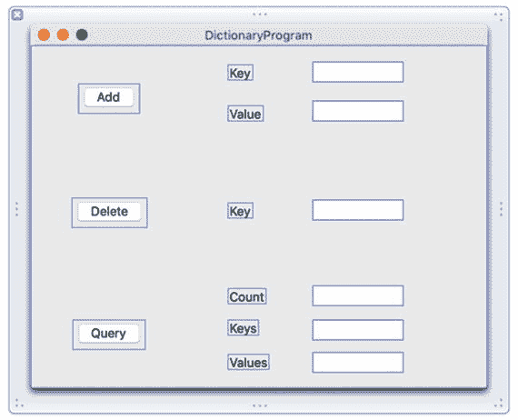
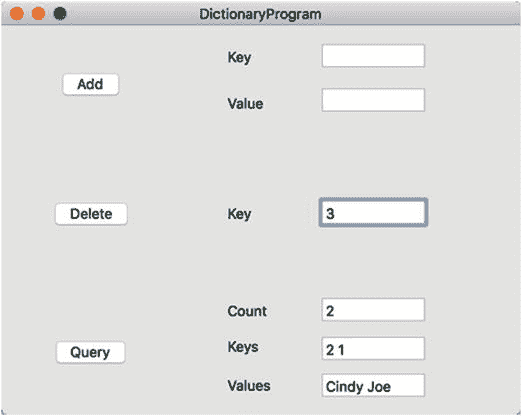

# 9. 数组与字典

几乎每个程序都需要接收数据，以便处理数据并计算出有用的结果。存储数据最简单的方式是通过变量来存储数字或文本字符串。然而，如果需要存储多个数据块（如姓名列表或产品编号列表）该怎么办？你可以创建多个变量，如下所示：

```swift
var employee001, employee002, employee003 : String
```

不幸的是，为存储相关数据而创建单独的变量可能很笨拙。如果你不知道需要存储多少项数据会怎样？那么你可能会创建过多或过少的变量。更糟糕的是，将相关数据存储在单独的变量中意味着很容易忽略数据之间的关系。

例如，如果你将三名员工的名字存储在不同的变量中，如何知道是否还有第四、第五或第六个变量包含其他员工姓名？除非你将变量在代码中保持在一起，否则很容易丢失散落在不同变量中的相关数据。

因此，Swift 提供了两种额外的数据存储方式：数组和字典。这两种数据结构的核心思想是，创建一个可以容纳多个项的单一变量。现在你可以将相关数据存储在一个位置，并轻松地查找和检索它们。

数组和字典都设计用于存储多个相似数据的副本，例如姓名列表或数字列表。在大多数情况下，你会在数组或字典中存储相同数据类型的列表。但是，你也可以通过声明数组或字典可以存储任意类型的数据（使用`Any`数据类型，例如整数和字符串）来存放不同数据类型，如下所示：

```swift
var mixedArray: [Any] = [1, "Temp", 2.6]
```

通常，最好在数组或字典中存储相同类型的数据，这样你始终知道期望的数据类型。

## 使用数组

你可以将数组想象为一系列无限的桶，每个桶恰好可以存储一份数据。为了帮助你找到数组中存储的数据，每个数组元素（桶）都由一个称为索引的数字标识。数组中的第一个项定义在索引 0 处，第二个项定义在索引 1 处，第三个项定义在索引 2 处，以此类推，如图 9-1 所示。



图 9-1 数组的结构

要创建数组，你可以定义数组的名称和数组可以保存的数据类型。创建数组的一种方式如下：

```swift
var arrayName : [DataType] = []
```

一旦你创建了数组并定义了它可以保存的数据类型，就可以像这样向数组存储数据：

```swift
var arrayName : [Int] = []
arrayName = [34, 89, 70, 1, -24]
```

比起先定义一个空数组及其数据类型，然后再给数组赋值，更简单的方法是直接在一行内定义数组名称并将其设置为相同数据类型的项列表，如下所示：

```swift
var myArrray = [34, 89, -2, 84]
```

Swift 会根据数据推断数组的数据类型。只需确保数组中的所有数据都是相同的数据类型，例如`Int`、`Float`、`Double`或`String`。

注意：当你使用`var`关键字声明数组时，可以添加和删除数组中的项。如果你不希望数组发生变化，请使用`let`关键字声明数组，如下所示：`let arrayName = [34, 89, 70, 1, -24]`。使用`let`关键字声明的数组永远不能被修改。

当你向数组存储数据时，数组中的每个项都位于固定的位置。在前面的整数数组示例中，第一个数字（34）位于索引 0，第二个数字（89）位于索引 1，第三个数字（70）位于索引 2，第四个数字（1）位于索引 3，第五个数字（-24）位于索引 4。由于 Swift 数组从 0 开始计数索引，因此它们被称为零基数组。（某些编程语言从 1 开始计数数组索引，因此它们被称为一基数组。）

如果你想检索数组中的第二个项（位于索引 1），可以像这样检索该项并将其存储在变量中：

```swift
var arrayName = [4, 5, 9, -3]
var number : Int
number = arrayName[1]
```

上述 Swift 代码创建了一个包含四个整数（4, 5, 9, -3）的数组，然后创建了一个名为`number`且可以保存整数数据类型的变量。第三行代码检索存储在`arrayName`索引 1 位置的项。在本例中，`number`变量现在持有值 5。


### 向数组添加元素

无论数组是空的还是已经存有数据，你都可以通过 `append` 命令向数组中添加更多元素，如下所示：

```
arrayName.append(data)
```

你必须指定要添加数据的数组名称，并将实际数据放在括号内。确保你添加的数据类型正确。因此，如果你要向一个只能存储整数的数组添加数据，则只能向该数组添加另一个整数。

除了使用 `append` 命令，你还可以使用加法复合赋值运算符向数组末尾添加元素，如下所示：

```
arrayName3 += [data1, data2, data3, ... dataN]
```

`+=` 复合赋值运算符可以向数组末尾添加多个元素，而 `append` 命令每次只能向数组末尾添加一个元素。

`append` 命令总是将新元素添加到数组末尾。如果你想在数组的特定位置添加新元素，可以使用 `insert` 和 `at` 命令，如下所示：

```
arrayName.insert(data, at: index)
```

使用 `insert` 命令时，你必须添加与该数组数据类型一致的数据。然后，你还必须指定索引编号。如果你选择的索引编号大于数组大小，`insert` 命令将不会生效。

要了解如何创建数组并添加数据，请按照以下步骤操作：

1.  在 Xcode 中打开 IntroductoryPlayground 文件。
2.  按如下方式编辑代码：

    ```
    import Cocoa
    var arrayName = Array(arrayLiteral: 34, 89, 70, 1, -24)
    var arrayName2 = Int
    arrayName.append(2)
    arrayName2.append(2)
    arrayName.insert(-37, at: 2)
    arrayName2.insert(-37, at: 2)
    ```

请注意，`append` 命令如何将数据添加到数组末尾，而 `insert` 命令则可以将数据添加到数组中的特定位置，如图 9-2 所示。



图 9-2. 向数组添加数据的两种方式

### 从数组中删除元素

正如你可以向数组添加元素一样，你也可以从数组中删除元素。要删除数组中的最后一个元素，你可以使用 `removeLast` 命令，如下所示：

```
arrayName.removeLast()
```

这不仅能删除数组中的最后一个元素，还会返回该值。如果你想将数组的最后一个元素保存到变量中，可以这样做：

```
var item = arrayName.removeLast()
```

如果你想从数组中删除一个特定元素，可以使用 `remove(at:)` 命令并指定该元素的索引编号，如下所示：

```
arrayName.remove(at: number)
```

因此，如果你想删除数组中的第二个元素，需要指定索引为 1。与 `removeLast` 命令一样，`remove(at:)` 命令也会返回一个值，你可以将其存储在变量中，如下所示：

```
var item = arrayName.remove(at: 1)
```

如果你想删除数组中的所有元素，可以使用 `removeAll` 命令，如下所示：

```
arrayName.removeAll()
```

要了解如何从数组中删除元素，请按照以下步骤操作：

1.  确保 IntroductoryPlayground 文件已在 Xcode 中加载。
2.  按如下方式编辑代码：

    ```
    import Cocoa
    var arrayName = Int
    var item = arrayName.removeLast()
    print (arrayName)
    print (item)
    item = arrayName.remove(at: 1)
    print (arrayName)
    print (item)
    arrayName.removeAll()
    ```

请注意在从数组中删除元素时不同命令的工作方式，如图 9-3 所示。在指定索引值时，你必须确保索引编号存在。这意味着，如果一个数组包含三个元素，第一个元素的索引为 0，第二个为 1，第三个为 2。因此，你只能从该数组中删除索引为 0、1 或 2 的元素，任何其他索引编号都将无效。



图 9-3. 从数组中删除元素

从数组中删除元素会将这些元素从数组中物理移除。除了删除数组中的元素，你也可以用新值替换现有元素。你只需指定要替换的数组元素的索引值，并为其分配新数据即可，如下所示：

```
arrayName[index] = newData
```

因此，如果你想替换数组中的第二个元素（索引值为 1），可以执行以下操作：

```
arrayName[1] = 91
```

存储在数组索引 1 处的任何现有值都会被数字 `91` 替换。替换数据时，新数据的数据类型必须与数组中的其他元素相同，例如整数或字符串。

### 查询数组

当你拥有一个数组时，你可能想知道该数组是否为空（其中存储了零个元素），或者如果数组不为空，它包含多少个元素。要确定数组是否为空，可以使用返回布尔值的 `isEmpty` 命令，如下所示：

```
arrayName.isEmpty
```

如果你想将此布尔值存储在变量中，可以这样做：

```
var flag = arrayName.isEmpty
```

如果你想知道数组中存储了多少个元素，可以使用 `count` 命令，如下所示：

```
arrayName.count
```

如果你想将此整数值存储在变量中，可以这样做：

```
var total = arrayName.count
```

### 操作数组

操作数组的两种常见方法是反转所有元素的顺序，或者按升序或降序重新排列元素。这仅仅是反转数组中所有元素的顺序，而不考虑它们的实际值，例如：

```
arrayName.reversed()
```

当你按升序对数组进行排序时，最小值存储在数组的第一个元素中，最大值存储在数组的最后一个元素中。当你对字符串进行排序时，Swift 会按字母顺序排序。要按升序对数组排序，请使用：

```
myArray.sort { $0 < $1 }
```

当你按降序对数组进行排序时，最大值存储在数组的第一个元素中，最小值存储在数组的最后一个元素中。当你对字符串进行排序时，Swift 会按反向字母顺序排序。要按降序对数组排序，请使用：

```
myArray.sort { $1 < $0 }
```

要了解反转和排序数组的工作原理，请按照以下步骤操作：

1.  确保 IntroductoryPlayground 文件已在 Xcode 中加载。
2.  按如下方式编辑代码：

    ```
    import Cocoa
    var myArray = ["Bob", "Fred", "Alice", "Mary"]
    let backwardsArray : [String]
    backwardsArray = myArray.reversed()
    myArray.sort { $0 < $1 }
    print (myArray)
    myArray.sort { $1 < $0 }
    print (myArray)
    ```

请注意，反转数组仅仅是重新排列元素，而排序数组则是根据元素内容实际改变其位置，如图 9-4 所示。



图 9-4. 对数组进行排序和反转


## 使用字典

数组适用于存储相关数据的列表。当你想要检索特定数据时，数组的最大缺点就暴露出来了。除非你知道数组中某个条目的确切索引号，否则检索数据会十分繁琐。

这正是字典的用途所在。与仅存储数据的数组不同，字典存储两段数据，称为键值对。`值`（value）代表你想要保存的数据，而`键`（key）代表一种快速检索数据的方式。

例如，考虑一个电话号码列表。如果你将电话号码存储在数组中，就必须知道确切的索引值才能检索到特定的电话号码。然而，如果你将电话号码存储在字典中，就可以将每个电话号码（值）与一个姓名（键）一起存储。现在，如果你想检索某个特定的电话号码，只需查找键（该人的姓名）即可。

无论数据在字典中存储于何处，你都可以使用键快速检索到值。这使得从字典中检索数据比从数组中检索类似数据要容易得多。

你可以把字典想象成数组，但它不是存储一段数据，而是存储一对数据（一个键和一个值）。键和值可以是不同的数据类型，但字典中的所有键和所有值必须分别是同一种数据类型。

要创建一个字典，你需要定义字典本身及其键和关联值的数据类型。一种定义字典的方式如下：

```
var DictionaryName = [keyDataType: valueDatatype]()
```

这定义了一个空字典，但指定了键和值的数据类型。

第二种定义字典的方式是创建一个键值对列表，如下所示：

```
var DictionaryName = [102: "Fred", 87: "Valerie"]
```

当你直接赋值键值对时，Swift 会推断键和值的数据类型。在这个例子中，键的数据类型是整数（`Int`），值的数据类型是字符串（`String`）。

### 向字典添加条目

无论字典是空的还是已有数据，你都可以通过指定字典名称及其键，然后赋值来向字典添加更多条目，例如：

```
DictionaryName[key] = value
```

要了解如何创建字典并向其中添加数据，请按照以下步骤创建一个新的 playground：

1. 在 Xcode 中打开 `IntroductoryPlayground` 文件。
2. 如下编辑代码：

    ```
    import Cocoa
    var DictionaryName = [102: "Fred", 87: "Valerie"]
    DictionaryName[120] = "John"
    DictionaryName[96] = "Jane"
    print(DictionaryName)
    ```

这段 Swift 代码定义了一个键值数据类型为 `Int:String` 的字典，该类型由 Swift 根据字典中初始存储的数据类型推断得出。

接下来的两行定义了一个键（`120`）和一个值（`"John"`），该键值对被存入字典。然后另一行定义了一个键（`96`）和一个值（`"Jane"`），也同样存入字典。最后的 `print` 命令让你看到字典的变化，如图 9-5 所示。



**图 9-5.** 创建一个字典并添加新的键值对数据

### 检索和更新字典中的数据

一旦字典包含键值对，你就可以使用键来检索值。具体做法是指定字典名称和一个键，然后将此值赋给一个变量，例如：

```
variable = DictionaryName[key]!
```

该变量的数据类型必须与字典中存储的值的数据类型相同。同时请注意感叹号，它定义了一个隐式解包变量。这个感叹号确保如果字典中不存在该键，不存在的值不会导致程序崩溃。

下面的示例在字典中定义了两个键值对数据。然后它使用键 `87` 从字典中检索值，即字符串 `"Valeria"`，如图 9-6 所示。



**图 9-6.** 使用键检索值并使用新数据更新现有键

```
var DictionaryName = [102: "Fred", 87: "Valerie"]
var name: String
name = DictionaryName[87]!
print(name)
```

一旦你在字典中存储了一个键值对，就可以使用 `updateValue` 命令为现有键分配新值，如下所示：

```
DictionaryName.updateValue(value, forKey: key)
```

因此，如果你想更新与键 `87` 关联的值，可以这样做：

```
DictionaryName.updateValue("Sam", forKey: 87)
```

要了解如何从字典中使用键检索值，然后更新现有键的值，请遵循以下步骤：

1. 确保 `IntroductoryPlayground` 文件已在 Xcode 中加载。
2. 如下编辑代码：

    ```
    import Cocoa
    var DictionaryName = [102: "Fred", 87: "Valerie"]
    DictionaryName[120] = "John"
    DictionaryName[96] = "Jane"
    print(DictionaryName)
    var name: String
    name = DictionaryName[87]!
    print(name)
    DictionaryName.updateValue("Sam", forKey: 87)
    name = DictionaryName[87]!
    print(name)
    ```

请注意，第一次字典检索与键 `87` 关联的值时，返回字符串 `"Valerie"`。然后 `updateValue` 命令用 `"Sam"` 替换了 `"Valerie"`，所以下次字典检索与键 `87` 关联的值时，将返回字符串 `"Sam"`，如图 9-6 所示。

### 删除字典中的数据

一旦字典包含键值对，你可以使用 `removeValue(forKey:key)` 命令删除与特定键关联的值，如下所示：

```
DictionaryName.removeValue(forKey: key)
```

`removeValue(forKey:key)` 命令会同时移除键及其关联的值。请注意，如果你指定的键在字典中不存在，`removeValue(forKey:key)` 命令不会执行任何操作。

如果你想删除字典中的所有键值对，可以直接使用 `removeAll` 命令，如下所示：

```
DictionaryName.removeAll()
```


#### 查询字典

在字典中存储键值对后，你可以使用以下命令获取字典的相关信息：

- `count`：统计字典中存储的键值对数量
- `keys`：检索字典中存储的所有键的列表
- `values`：检索字典中存储的所有值的列表

`count` 命令只需提供字典名称，并返回一个整数值，你可以将其赋值给变量，例如：

```
var total = DictionaryName.count
```

`keys` 和 `values` 命令需要提供字典名称，并返回一个项目列表，你可以将其存储在数组中，例如：

```
let myKeys = Array(DictionaryName.keys)
```

要了解如何从字典中统计和检索键与值，请按以下步骤操作：

1.  确保 `IntroductoryPlayground` 文件已在 Xcode 中加载。
2.  按如下方式编辑代码：

    ```
    import Cocoa
    var myDictionary = [12: "Joe", 7: "Walter"]
    myDictionary.removeValue(forKey: 7)
    print (myDictionary)
    myDictionary.removeAll()
    print (myDictionary)
    myDictionary = [25: "Stephanie", 98: "Nancy"]
    print (myDictionary.count)
    let myKeys = Array(myDictionary.keys)
    let myValues = Array(myDictionary.values)
    ```

注意，`removeValueForKey` 命令用于移除一个已有的键值对，而 `removeAll` 命令则清空整个字典。另外，`count` 命令统计所有键值对的数量，而 `keys` 和 `values` 命令分别返回键和值的列表，如图 9-7 所示。



图 9-7.

删除字典数据、统计以及检索键和值

## 在 macOS 程序中使用字典

在下面的示例程序中，计算机会创建一个存储在字典中的数据列表。然后通过用户界面，用户可以添加新数据到字典、删除已有数据或获取字典信息。

请按以下步骤创建一个新的 macOS 项目：

1.  在 Xcode 中选择 "File" ➤ "New" ➤ "Project"。
2.  在 macOS 类别下点击 "Application"。
3.  点击 "Cocoa Application"，然后点击 "Next" 按钮。Xcode 会要求输入产品名称。
4.  点击 "Product Name" 文本字段，输入 `DictionaryProgram`。
5.  确保 "Language" 下拉菜单显示 "Swift"，并且没有勾选任何复选框。
6.  点击 "Next" 按钮。Xcode 会询问你项目的存储位置。
7.  选择一个文件夹来存储你的项目，然后点击 "Create" 按钮。
8.  在 Project Navigator 中点击 `MainMenu.xib` 文件。
9.  点击 `DictionaryProgram` 图标以显示用户界面窗口。
10. 选择 "View" ➤ "Utilities" ➤ "Show Object Library"，使 Object Library 出现在 Xcode 窗口的右下角。
11. 将三个按钮、六个标签和六个文本字段拖拽到用户界面上，然后双击这些按钮和标签来修改其上显示的文本，使其看起来类似于图 9-8。



图 9-8.

`DictionaryProgram` 的用户界面

"Add" 按钮将允许你在右侧的文本字段中输入键和值。"Delete" 按钮将允许你指定一个键，以从字典中删除其关联的值。"Query" 按钮将显示字典中当前存储的项目总数，以及键和值的列表。

每个文本字段都需要一个独立的 `IBOutlet`，每个按钮都需要一个独立的 `IBAction` 方法，你可以通过从用户界面按住 Control 键拖拽到你的 `AppDelegate.swift` 文件中来创建它们。

1.  在 Xcode 窗口中用户界面仍可见的情况下，选择 "View" ➤ "Assistant Editor" ➤ "Show Assistant Editor"。`AppDelegate.swift` 文件会出现在用户界面旁边。
2.  将鼠标移到 "Add" 按钮上，按住 Control 键，拖拽至 `AppDelegate.swift` 文件底部最后一个花括号的上方。
3.  松开鼠标和 Control 键。会弹出一个窗口。
4.  点击 "Connection" 弹出菜单，选择 "Action"。
5.  点击 "Name" 文本字段，输入 `addButton`。
6.  点击 "Type" 弹出菜单，选择 `NSButton`。然后点击 "Connect" 按钮。
7.  将鼠标移到 "Delete" 按钮上，按住 Control 键，拖拽至 `AppDelegate.swift` 文件底部最后一个花括号的上方。
8.  松开鼠标和 Control 键。会弹出一个窗口。
9.  点击 "Connection" 弹出菜单，选择 "Action"。
10. 点击 "Name" 文本字段，输入 `deleteButton`。
11. 点击 "Type" 弹出菜单，选择 `NSButton`。然后点击 "Connect" 按钮。
12. 将鼠标移到 "Query" 按钮上，按住 Control 键，拖拽至 `AppDelegate.swift` 文件底部最后一个花括号的上方。
13. 松开鼠标和 Control 键。会弹出一个窗口。
14. 点击 "Connection" 弹出菜单，选择 "Action"。
15. 点击 "Name" 文本字段，输入 `queryButton`。
16. 点击 "Type" 弹出菜单，选择 `NSButton`。然后点击 "Connect" 按钮。`AppDelegate.swift` 文件的底部应如下所示：

```
@IBAction func addButton(_ sender: NSButton) {
}
@IBAction func deleteButton(_ sender: NSButton) {
}
@IBAction func queryButton(_ sender: NSButton) {
}
```


17.  将鼠标移到**Add**按钮右侧出现的**Key**文本字段上，按住**Control**键，拖拽到`AppDelegate.swift`文件中`@IBOutlet`行下方。
18.  松开鼠标和**Control**键，会出现一个弹出窗口。
19.  点击**Name**文本字段，输入`addKeyField`，然后点击**Connect**按钮。
20.  将鼠标移到**Add**按钮右侧出现的**Value**文本字段上，按住**Control**键，拖拽到`AppDelegate.swift`文件中`@IBOutlet`行下方。
21.  松开鼠标和**Control**键，会出现一个弹出窗口。
22.  点击**Name**文本字段，输入`addValueField`，然后点击**Connect**按钮。
23.  将鼠标移到**Delete**按钮右侧出现的**Key**文本字段上，按住**Control**键，拖拽到`AppDelegate.swift`文件中`@IBOutlet`行下方。
24.  松开鼠标和**Control**键，会出现一个弹出窗口。
25.  点击**Name**文本字段，输入`deleteKeyField`，然后点击**Connect**按钮。
26.  将鼠标移到**Query**按钮右侧出现的**Count**文本字段上，按住**Control**键，拖拽到`AppDelegate.swift`文件中`@IBOutlet`行下方。
27.  松开鼠标和**Control**键，会出现一个弹出窗口。
28.  点击**Name**文本字段，输入`queryCountField`，然后点击**Connect**按钮。
29.  将鼠标移到**Query**按钮右侧出现的**Keys**文本字段上，按住**Control**键，拖拽到`AppDelegate.swift`文件中`@IBOutlet`行下方。
30.  松开鼠标和**Control**键，会出现一个弹出窗口。
31.  点击**Name**文本字段，输入`queryKeysField`，然后点击**Connect**按钮。
32.  将鼠标移到**Query**按钮右侧出现的**Values**文本字段上，按住**Control**键，拖拽到`AppDelegate.swift`文件中`@IBOutlet`行下方。
33.  松开鼠标和**Control**键，会出现一个弹出窗口。
34.  点击**Name**文本字段，输入`queryValuesField`，然后点击**Connect**按钮。
35.  现在你应该拥有以下代表用户界面上所有文本字段的`IBOutlet`：

```
    @IBOutlet weak var window: NSWindow!
    @IBOutlet weak var addKeyField: NSTextField!
    @IBOutlet weak var addValueField: NSTextField!
    @IBOutlet weak var deleteKeyField: NSTextField!
    @IBOutlet weak var queryCountField: NSTextField!
    @IBOutlet weak var queryKeysField: NSTextField!
    @IBOutlet weak var queryValuesField: NSTextField!
```

至此，你已经将用户界面连接到 Swift 代码中，因此可以使用`IBOutlet`来检索和显示用户界面上的数据。你还创建了`IBAction`方法，使得用户界面上的按钮能够让程序实际运行。现在你只需要编写 Swift 代码来创建一个初始字典，然后在每个`IBAction`方法中编写更多 Swift 代码来添加、删除或查询字典。

1.  在`AppDelegate.swift`文件的`IBOutlet`列表下方，输入以下代码来创建一个键为整数、值为字符串的字典：

```
    var myDictionary = [1:"Joe", 2:"Cindy", 3:"Frank"]
```

2.  修改`addButton`的`IBAction`方法，使其从 Key 和 Value 文本字段获取值，并将它们添加到字典中，如下所示：

```
    @IBAction func addButton(_ sender: NSButton) {
        myDictionary.updateValue(addValueField.stringValue, forKey: addKeyField.integerValue)
    }
```

3.  修改`deleteButton`的`IBAction`方法，使其从 Key 文本字段获取值，并从字典中删除关联的值，如下所示：

```
    @IBAction func deleteButton(_ sender: NSButton) {
        myDictionary.removeValue(forKey: deleteKeyField.integerValue)
    }
```

4.  修改`queryButton`的`IBAction`方法，如下所示：

```
    @IBAction func queryButton(_ sender: NSButton) {
        queryCountField.integerValue = myDictionary.count
        var keyList : String = ""
        for key in myDictionary.keys {
            keyList = keyList + "\(key)" + " "
        }
        queryKeysField.stringValue = keyList
        var valueList : String = ""
        for value in myDictionary.values {
            valueList = valueList + "\(value)" + " "
        }
        queryValuesField.stringValue = valueList
    }
```

`myDictionary.count`命令会统计字典中键值对的数量，并将该数字显示在`queryCountField`这个`IBOutlet`中。

第一个`for-in`循环遍历字典中的每个键，并将其存储到一个名为`keyList`的字符串中，然后将此文本字符串显示在`queryKeysField`这个`IBOutlet`中。

最后一个`for`循环遍历字典中的每个值，并将其存储到一个名为`valueList`的字符串中，然后将此文本字符串显示在`queryValuesField`这个`IBOutlet`中。

`AppDelegate.swift`文件的完整内容应如下所示：

```
import Cocoa
@NSApplicationMain
class AppDelegate: NSObject, NSApplicationDelegate {
    @IBOutlet weak var window: NSWindow!
    @IBOutlet weak var addKeyField: NSTextField!
    @IBOutlet weak var addValueField: NSTextField!
    @IBOutlet weak var deleteKeyField: NSTextField!
    @IBOutlet weak var queryCountField: NSTextField!
    @IBOutlet weak var queryKeysField: NSTextField!
    @IBOutlet weak var queryValuesField: NSTextField!
    var myDictionary = [1:"Joe", 2:"Cindy", 3:"Frank"]
    func applicationDidFinishLaunching(_ aNotification: Notification) {
        // Insert code here to initialize your application
    }
    func applicationWillTerminate(_ aNotification: Notification) {
        // Insert code here to tear down your application
    }
    @IBAction func addButton(_ sender: NSButton) {
        myDictionary.updateValue(addValueField.stringValue, forKey: addKeyField.integerValue)
    }
    @IBAction func deleteButton(_ sender: NSButton) {
        myDictionary.removeValue(forKey: deleteKeyField.integerValue)
    }
    @IBAction func queryButton(_ sender: NSButton) {
        queryCountField.integerValue = myDictionary.count
        var keyList : String = ""
        for key in myDictionary.keys {
            keyList = keyList + "\(key)" + " "
        }
        queryKeysField.stringValue = keyList
        var valueList : String = ""
        for value in myDictionary.values {
            valueList = valueList + "\(value)" + " "
        }
        queryValuesField.stringValue = valueList
    }
}
```

**Query**按钮的作用是，只需点击它即可显示当前字典内容的相关信息。

**Add**按钮的作用是，用户在 Key 和 Value 文本字段中输入一个键（整数）和一个名称（字符串），然后点击**Add**按钮。

**Delete**按钮的作用是，用户在 Key 文本字段中输入一个键（整数），然后点击**Delete**按钮。

点击**Add**或**Delete**按钮后，再次点击**Query**按钮即可查看更改。要了解此程序的工作方式，请按照以下步骤操作：

1.  选择**Product ➤ Run**。Xcode 会运行你的 DictionaryProgram 项目。
2.  点击**Query**按钮。程序将显示字典中的项数（3）、键列表（数字 1、2 和 3）以及值列表（“Joe”、“Cindy”和“Frank”）。不必担心键和值的顺序。重点是检查每个键的顺序是否与正确的值匹配，例如 1 对应“Joe”，2 对应“Cindy”，3 对应“Frank”。
3.  在**Delete**按钮右侧的 Key 字段中输入 3，然后点击**Delete**按钮。
4.  点击**Query**按钮。注意，现在字典中只包含两个项：键 1 和 2，以及值“Joe”和“Cindy”，如图 9-9 所示。



Figure 9-9.


5.  单击`Add`按钮右侧的`Key`文本字段，然后输入`5`。
6.  单击`Add`按钮右侧的`Value`文本字段，然后输入`Felicia`。
7.  单击`Add`按钮。
8.  单击`Query`按钮。请注意，计数现在恢复为`3`，键为`1`、`2`和`5`，对应的值为`"Joe"`、`"Cindy"`和`"Felicia"`。
9.  选择`DictionaryProgram` ➤ `Quit DictionaryProgram`。

### 总结

数组和字典是将相关数据列表存储到单个变量中的两种方式。数组便于存储数据，但检索数据可能较为繁琐，因为必须知道待检索数据的确切索引值。

字典强制你通过键来存储数据，但该键使得后续无需知道数据在字典中的确切存储位置即可轻松检索。

在你创建的示例 macOS 程序中，你还学习了`for-in`循环如何自动遍历字典。现在，你应该对创建用户界面以及判断哪些项需要`IBOutlet`、哪些项需要`IBAction`方法更加得心应手。

程序设计可分为三个清晰的步骤。首先，创建并自定义用户界面。其次，将用户界面连接到你的 Swift 文件。最后，编写 Swift 代码使你的`IBAction`方法生效。

将数组和字典视为超级变量，它们可以在单个变量名下存储多个数据。如果仅需保存单个值，请使用变量。如果需要存储相关数据的列表，则使用数组或字典。

