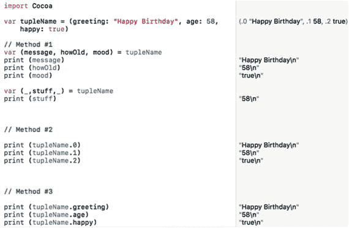
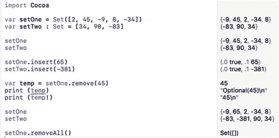
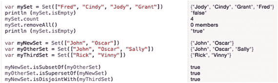

# 10. 元组和集合

变量适合存储单个数据块，而数组和字典适合存储相关数据的列表。为了更高的灵活性，Swift 还提供了称为元组和集合的附加数据结构。

元组允许你将可能包含不同数据类型（如字符串和整数，可表示人的姓名和员工 ID 编号）的相关数据存储在一个地方。集合与数组或字典类似，允许你存储两个或多个相关数据块，例如字符串或整数。

元组和结构体最大的优势或许在于将它们与其他数据结构结合使用时。你可以创建元组数组或结构体数组，而不是创建整数数组。这使你能够灵活地将不同的数据类型存储在一起，并存储多个相似数据的副本。

## 使用元组

假设你想存储某人的姓名和年龄。你可以创建两个独立的变量，如下所示：

```
var name : String
var age : Int
name = "Janice Parker"
age = 47
```

创建两个或多个独立的变量来存储相关数据可能会很麻烦，因为这两个变量之间没有任何关联来表明关系。为了解决这个问题，Swift 提供了一种独特的数据结构，称为元组。

元组可以存储两个或多个数据块到单个变量中，这些分离的数据块甚至可以是完全不同的数据类型，例如字符串和整数。声明元组就像声明变量一样。主要区别在于，不是定义单一数据类型，而是可以在圆括号内定义多种数据类型，如下所示：

```
var tupleName : (DataType1, DataType2)
```

就像声明变量一样，你必须为元组声明一个唯一的名称。然后，你需要定义要存储的不同数据块的数量及其数据类型。元组可以容纳两个或多个数据块，但元组持有的数据越多，理解和检索数据就越笨拙。

创建元组的一种方法是声明元组名称及其可以容纳的数据类型。列出的数据类型数量也定义了元组可以存储的数据块数量。因此，如果你想在元组中存储一个字符串和一个整数，可以使用以下 Swift 代码：

```
var person : (String, Int)
```

然后，你可以像这样在该元组中存储数据：

```
person = ("Janice Parker", 47)
```

在向元组赋值时，请确保数据块的数据类型和数量都正确。因此，以下操作会失败，因为`person`元组期望先有字符串，然后是整数，而不是先有整数再有字符串：

```
person = (47, "Janice Parker")
```

定义元组的第二种方法是直接为其提供数据并让 Swift 推断数据类型，例如：

```
var person = ("Janice Parker", 47)
```

如果你通过列出数据类型来定义元组，或者让 Swift 通过你存储的数据类型来推断数据类型，那么每个数据块代表什么并不总是很清楚。为了更容易地识别不同的数据块，Swift 还允许你为数据类型命名，例如：

```
var person : (name: String, age: Int)
```

如果你希望 Swift 通过直接向元组分配数据来推断数据类型，可以这样做：

```
var person = (name: "Janice Parker", age: 47)
```

命名元组有助于阐明每个数据块代表什么。在此示例中，字符串代表姓名，整数代表年龄。


### 访问元组中的数据

创建元组并在其中存储数据后，最终需要检索这些数据。由于元组包含两个或多个数据块，Swift 提供了三种方式来检索所需数据。

首先，你可以创建多个变量来访问元组数据，如下所示：

```
var petInfo = ("Rover", 38, true)
var (dog, number, yesValue) = petInfo
print (dog)
print (number)
print (yesValue)
```

在第一行代码中，`petInfo` 是一个包含三个数据块的元组：一个字符串（`"Rover"`）、一个整数（`38`）和一个布尔值（`true`）。

第二行代码创建了三个变量（`dog`、`number`、`yesValue`），并将它们的值分别赋给 `petInfo` 元组中存储的对应数据。这意味着 `dog` 存储了 `"Rover"`，`number` 存储了 `38`，`yesValue` 存储了 `true`。`print` 命令只是将这些数据打印出来，以验证它从元组中检索到了信息。

要从元组访问数据，你必须知道元组存储数据的顺序。因此，如果你想从 `petInfo` 元组中检索一个字符串，你必须知道 `petInfo` 元组将名称（字符串）作为第一个数据块存储，数字作为第二个数据块，布尔值作为第三个数据块。

如果你不想检索元组中存储的所有值，你可以只创建一个变量来存储你想要的数据，并使用下划线字符（`_`）作为占位符，代表你想要忽略的元组中的其他每个值。

这意味着你仍然需要知道元组包含的数据块数量，以便识别出你想要检索的那一个数据块。例如，如果一个元组包含三项，你可以像这样检索第一项：

```
var petInfo = ("Rover", 38, true)
var (pet,_,_) = petInfo
print (pet)
```

这会将 `"Rover"` 存储到 `pet` 变量中，因此 `println` 命令会打印出 `"Rover"`。

如果你只想检索中间的值，可以输入以下代码：

```
var petInfo = ("Rover", 38, true)
var (_,aValue,_) = petInfo
print (aValue)
```

这会将数字 `38` 存储到 `aValue` 变量中，然后 `println` 命令会打印出 `38`。

下划线字符充当占位符，用于标识元组中你想要忽略的数据。如果省略下划线字符，Swift 将不知道你想要元组中的哪个特定数据。要从元组中检索数据，你必须知道元组存储的条目数量和顺序。

从元组中检索值的第二种方法是使用索引编号，其中第一个元素被分配索引编号 `0`，第二个元素被分配索引编号 `1`，以此类推。例如，你可以像这样将数据存储在元组中：

```
var petInfo = ("Rover", 38, true)
print (petInfo.0)
print (petInfo.1)
print (petInfo.2)
```

元组中的第一项被分配索引编号 `0`，因此元组名称（例如 `petInfo`）后跟索引编号的组合，让你可以直接检索特定的元组值。因此，`petInfo.0` 检索 `"Rover"`，`petInfo.1` 检索 `38`，`petInfo.2` 检索 `true`。

请确保，当你通过索引编号访问元组数据时，使用了有效的索引编号。在上面的例子中，`petInfo` 元组在索引 `0`、`1` 和 `2` 处包含数据，但如果你试图访问不同的索引（例如索引编号 `3`），那里没有数据，所以你的程序将无法工作。

访问元组数据的第三种方法涉及使用名称。要使用这种方法，你必须先为每个元组数据分配名称。例如，以下 Swift 代码定义了两个名称：`"name"` 和 `"age"`：

```
var tupleName = (name: "Bridget", age: 31)
```

现在，你可以通过引用元组名称后跟每个数据的标识名称来访问元组数据，如下所示：

```
print (tupleName.name)   // 打印 "Bridget"
print (tupleName.age)    // 打印 31
```

这三种方法为你提供了不同的访问元组中存储数据的方式，因此只需使用你最喜欢的方法即可。为了清晰起见，为元组的特定元素命名会使你的代码更易于理解，但这会牺牲一点灵活性，迫使你为元组数据命名。索引编号方法和多变量方法可能更简单，但清晰度较差，并且需要你知道想要检索的数据的确切顺序。

要了解如何使用元组，请按照以下步骤创建一个新的 playground：

1.  在 Xcode 中打开 IntroductoryPlayground 文件。
2.  按如下方式编辑代码：

```
    import Cocoa
    var tupleName = (greeting: "Happy Birthday", age: 58, happy: true)
    // 方法 #1
    var (message, howOld, mood) = tupleName
    print (message)
    print (howOld)
    print (mood)
    var (_,stuff,_) = tupleName
    print (stuff)
    // 方法 #2
    print (tupleName.0)
    print (tupleName.1)
    print (tupleName.2)
    // 方法 #3
    print (tupleName.greeting)
    print (tupleName.age)
    print (tupleName.happy)
```

当你尝试所有三种从元组访问值的方法时，你会看到它们的工作原理相似。元组可以轻松地将相关数据分组到单个变量中，这样你就可以轻松地保持相关信息的条理性。然后，你可以选择使用三种不同方法之一从元组中检索数据，如图 10-1 所示。



图 10-1.

从元组检索数据的三种不同方式

## 使用集合

数组和字典可以存储相同数据类型的列表，例如字符串列表或整数列表。数组和字典之间的区别在于你如何检索数据。数组强制你使用索引值按位置检索数据。字典允许你使用键来检索数据，但你必须为你存储的每个数据块定义一个唯一的键。

集合代表了另一种存储相同数据类型（例如字符串或十进制数字）列表的方式。集合的一个速度优势是判断某个元素是否被存储。如果你将数据存储在数组中，你必须彻底搜索整个数组才能确定数组是否存储了特定项。如果你将数据存储在字典中，你必须知道与该值一起存储的键，否则你必须彻底搜索字典的值列表。

集合允许你比数组或字典快得多地确定以下内容：

-   一个元素是否存储在集合中
-   一个集合是否包含与另一个集合完全相同的元素
-   一个集合是否是另一个集合的子集（包含与更大集合相同的元素）
-   一个集合是否是另一个集合的超集（包含与更小集合相同的元素以及更多元素）
-   两个集合是否包含相同的元素

集合使得比较两组不同的数据变得容易，而数组和字典则无法轻易做到这一点。

### 创建集合

要创建集合，你可以定义一个空集合及其可以保存的数据类型，如下所示：

```
var setName = Set()
```

如果你想同时创建一个集合并用数据填充它，请将集合内容列在方括号内，并让 Swift 推断数据类型（所有数据必须为相同数据类型），例如：

```
var setName = Set([Data1, Data2, Data2 ... DataN])
```

创建集合的第三种方法是定义一个集合名称，使用 `Set` 关键字，然后列出集合中的数据，如下所示：

```
var setName: Set = [Data1, Data2, Data2 ... DataN]
```


#### 向集合中添加和删除元素

使用集合时，你可以随时添加新元素，只要新元素与现有元素的数据类型相同即可。要向集合中添加一个元素，只需指定集合名称、`insert` 命令以及要添加的数据（放在括号内），如下所示：

```
setName.insert(data)
```

你必须指定要添加数据的数组名称，并将实际数据放在括号中。确保你添加的数据是适当的数据类型。因此，如果你想向一个当前只包含整数的集合添加数据，你只能向该集合添加另一个整数。

如果你尝试添加集合中已存在的数据，则不会发生任何操作。这意味着如果一个集合包含数字 53，你就无法再向该集合添加另一个 53 的副本。

要从集合中删除数据，只需指定集合名称、`remove` 命令以及要删除的数据（放在括号内），如下所示：

```
setName.remove(data)
```

如果你尝试删除集合中不存在的数据，`remove` 命令会返回一个 nil 值。但是，如果 `remove` 命令成功地从集合中删除了数据，它会返回一个可选变量。这意味着如果你将删除的数据存储在一个变量中，例如

```
var variableName = setName.remove(data)
```

则可以通过使用感叹号来访问存储在变量中的值，例如

```
print(variableName!)
```

如果你想删除集合中的所有项目，请指定集合名称和 `removeAll` 命令，如下所示：

```
setName.removeAll()
```

要了解如何创建集合以及如何向其中添加和删除数据，请按照以下步骤创建一个新的 playground：

1. 在 Xcode 中打开 `IntroductoryPlayground` 文件。
2. 输入如下代码：

    ```
    import Cocoa
    var setOne = Set([2, 45, -9, 8, -34])
    var setTwo : Set = [34, 90, -83]
    setOne
    setTwo
    setOne.insert(65)
    setTwo.insert(-381)
    var temp = setOne.remove(45)
    print(temp)
    print(temp!)
    setOne
    setTwo
    setOne.removeAll()
    ```

这段 Swift 代码通过直接存储数据并让 Swift 推断数据类型（即整数）来创建一个名为 `setOne` 的集合。然后它创建第二个名为 `setTwo` 的集合，该集合也只包含整数。

创建 `setTwo` 之后，两个 `insert` 命令将不同的整数存储到 `setOne` 和 `setTwo` 中。当代码从 `setOne` 中删除数字 45 时，它会将 45 作为可选变量存储在 `temp` 变量中。要访问实际值，你必须使用感叹号 (!) 解包可选变量。

最后，`removeAll` 命令清空了 `setOne`，使其不包含任何内容，如图 10-2 所示。



图 10-2. 创建集合、向集合中插入数据以及从集合中删除数据

请注意，Xcode 会在 `print(temp)` 行的左侧显示一条警告。这是因为 `temp` 表示一个可选变量，你需要解包（使用 ! 符号）才能获取实际值。

## 查询集合

一旦你拥有一个集合，就可以使用以下命令来获取关于该集合的信息：

* `count`：统计集合中的项目数量
* `isEmpty`：检查集合是否为空（包含 0 个项目）
* `isSubset(of:)`：检查一个集合是否完全包含在另一个集合中
* `isSuperset(of:)`：检查一个集合是否包含另一个集合的所有项目
* `isDisjoint(with:)`：检查两个集合是否有共同的元素

无论这些命令的结果如何，它们都不会影响集合中存储的数据。

`count` 命令返回一个整数值，只需要指定集合名称和 `count` 命令即可，如下所示：

```
setName.count
```

你也可以将此值赋值给一个变量，例如

```
var total = setName.count
```

如果集合中项目数为零，`isEmpty` 命令返回布尔值 true，否则返回 false。只需指定集合名称，后跟 `isEmpty` 命令，如下所示：

```
setOne.isEmpty
```

`isSubset(of:)` 命令检查一个集合是否包含第二个集合中也包含的元素。只有当第二个集合包含了第一个集合中的每一个元素时，才认为第一个集合是子集。

`isSuperset(of:)` 命令检查一个集合是否更大，并且包含另一个较小集合中的所有相同元素。只有当第一个集合更大且其所有元素都存储在第二个集合中时，才认为它是超集。

`isDisjoint(with:)` 命令比较两个集合。如果它们没有共同元素，则此命令返回 true，否则返回 false。

要了解如何查询集合，请按照以下步骤操作：

1. 确保在 Xcode 中加载了 `IntroductoryPlayground` 文件。
2. 按如下方式编辑代码：

    ```
    import Cocoa
    var mySet = Set(["Fred", "Cindy", "Jody", "Grant"])
    print(mySet.isEmpty)
    mySet.count
    mySet.removeAll()
    print(mySet.isEmpty)
    var myNewSet = Set(["John", "Oscar"])
    var myOtherSet = Set(["John", "Oscar", "Sally"])
    var myThirdSet = Set(["Rick", "Vinny"])
    myNewSet.isSubset(of: myOtherSet)
    myOtherSet.isSuperset(of: myNewSet)
    myNewSet.isDisjoint(with: myThirdSet)
    ```

这段代码创建了一个包含四个字符串的集合。它使用 `isEmpty` 命令检查集合是否为空（结果为 false）。然后它统计集合中的元素数量（有四个元素）。最后，它从集合中删除所有元素，并再次使用 `isEmpty` 命令检查集合是否为空（结果为 true）。

下一批代码创建了三个不同的集合，分别命名为 `myNewSet`、`myOtherSet` 和 `myThirdSet`，并用不同的名称填充它们。然后 `isSubset(of:)` 命令检查 `myNewSet` ["John", "Oscar"] 中的所有元素是否也都存在于 `myOtherSet` ["John", "Oscar", "Sally"] 中，结果为 true。

`isSuperset(of:)` 命令检查 `myOtherSet` ["John", "Oscar", "Sally"] 是否包含更多元素并且还包含 `myNewSet` ["John", "Oscar"] 中存储的所有元素，结果也为 true。

最后，`isDisjoint(with:)` 命令检查 `myNewSet` ["John", "Oscar"] 与 `myThirdSet` ["Rick", "Vinny"] 是否没有共同元素，结果同样为 true，如图 10-3 所示。



图 10-3. 查询集合


