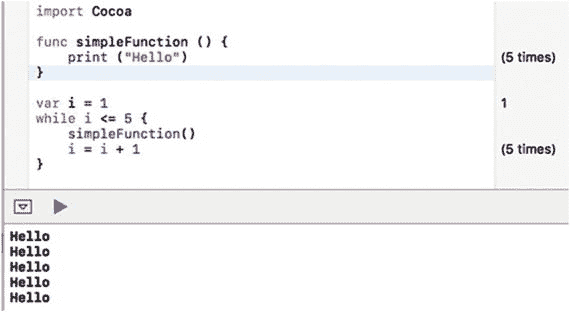
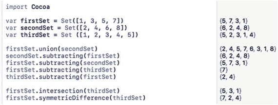
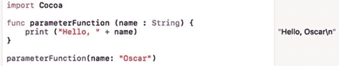
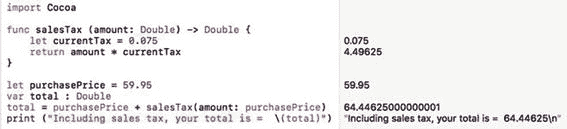
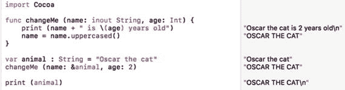
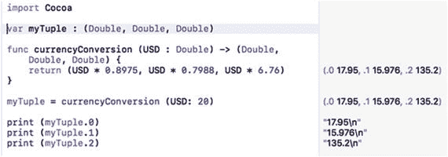

# 11. 将代码存储在函数中

每个程序都会存储数据（存储在变量或诸如数组、集合或字典等数据结构中），然后以某种方式对这些数据进行操作。操作数据的代码被称为**算法**。

如果希望在程序中的多个位置使用同一个算法，你可以复制那段代码并将其粘贴到不同的地方。然而，如果你之后想要修改代码，这可能会带来问题。如果你复制了 20 份相同的算法，那么你就必须修改程序中所有这 20 份副本。这不仅耗时，而且容易出错。

更好的解决方案是将算法存储在程序中称为**函数**的独立部分。第 6 章向你介绍了数学函数，但你也可以创建自己的函数。与其复制算法并将其存储在多个位置，不如将算法只存储在一个函数中。函数有几个用途：

-   在程序的不同部分重用代码
-   将相关算法分组到一个地方
-   使程序中的问题易于隔离

把函数看作是构建模块。就像用砖块盖房子比用一整块岩石雕刻更容易一样，当你能够将大型程序分解为多个函数时，永远不应该尝试将其编写成一个命令列表。

Cocoa 框架包含了许多你可以在自己的程序中使用的函数。函数背后的基本思想是，你可以在不了解其工作原理的情况下使用它。要让函数内部的代码运行，你只需按名称“调用”该函数即可。

你应该始终尽可能地使用 Cocoa 框架的内置函数，因为这能让你使用经过预测试的、可靠的代码来创建程序。当然，Cocoa 框架无法提供你可能会需要的每一个函数，所以你最终需要创建自己的函数。

函数的目的是简化代码。函数基本上用一行称为函数调用的代码替换了多行代码。

你可以创建三种类型的函数：

-   不接受任何数据、执行相同操作的函数
-   接受数据的函数
-   返回值的函数

记住，接受数据的函数也可以返回值。

## 无参数且无返回值的简单函数

最简单的函数只包含一个名称，如下所示：

```
func functionName () {

}
```

通过在大括号之间插入一行或多行代码，你可以让函数执行某些操作，例如：

```
func simpleFunction () {
    print ("Hello")
    print ("there")
}
```

要运行函数内部的代码，你只需按名称调用该函数，例如：

```
simpleFunction()
```

要了解这个函数是如何工作的，请遵循以下步骤：

1.  在 Xcode 中打开 `IntroductoryPlayground` 文件。
2.  按如下方式编辑代码：

```
import Cocoa
func simpleFunction () {
    print ("Hello")
}
var i = 1
while i <= 5 {
    simpleFunction()
    i = i + 1
}
```

这段代码定义了一个简单的函数，它只打印 "Hello" 和 "there"。然后它使用一个 `while` 循环运行五次，并运行或调用了 `simpleFunction` 五次，如图 11-1 所示。



图 11-1. 定义和调用一个简单函数

---

## 操作集合

当你拥有两个或更多集合时，你可以对这两个集合执行操作以创建第三个集合。一些常见的集合操作包括：

-   `union`：将两个集合中的所有项目合并到一个新集合中
-   `subtracting`：从第一个集合中移除第二个集合中的项目，以形成一个新集合
-   `intersection`：找出两个集合中共有的项目，并将其存储在一个新集合中
-   `symmetricDifference`：找出只存在于其中一个集合中，而非两个集合中都存在的项目

可以将 `union` 命令视为将两个集合相加，而 `subtract` 命令视为从一个集合中减去另一个集合。`union` 命令指定两个集合名称，如下所示：

```
firstSet.union(secondSet)
```

可以将其视为等同于 `firstSet` + `secondSet`，其中两个集合中的所有项目都被合并到第三个集合中。

`subtracting` 命令指定两个集合名称，但顺序会影响结果，例如：

```
thirdSet.subtracting(firstSet)
firstSet.subtracting(thirdSet)
```

根据每个集合的内容，这两个命令可能会产生不同的结果。假设 `thirdSet` 包含 `[1, 2, 3, 4, 5]`，并且 `firstSet` 包含 `[1, 3, 5, 7]`。`thirdSet.subtracting(firstSet)` 命令的工作原理如下：

```
[1, 2, 3, 4, 5] thirdSet
[1, 3, 5, 7] firstSet
```

两个集合都包含 1、3 和 5，因此这些数字被消除。从 `thirdSet` 中移除 1、3 和 5，你将剩下 `[2, 4]`。

`firstSet.subtracting(thirdSet)` 命令的工作原理如下：

```
[1, 3, 5, 7] firstSet
[1, 2, 3, 4, 5] thirdSet
```

两个集合都包含 1、3 和 5，因此这些数字被消除。从 `firstSet` 中移除 1、3 和 5，你将剩下 `{7}`。

`intersecting` 命令找出两个集合中共有的项目。`symmetricDifference` 命令找出不在两个集合中都存在的项目。可以将 `symmetricDifference` 命令视为 `intersect` 命令的相反操作。

要了解这四种操作集合的不同方式是如何工作的，请遵循以下步骤：

1.  确保在 Xcode 中加载了 `IntroductoryPlayground` 文件。
2.  按如下方式输入代码：

```
import Cocoa
var firstSet = Set([1, 3, 5, 7])
var secondSet = Set([2, 4, 6, 8])
var thirdSet = Set ([1, 2, 3, 4, 5])
firstSet.union(secondSet)
secondSet.subtracting(firstSet)
firstSet.subtracting(secondSet)
firstSet.subtracting(thirdSet)
thirdSet.subtracting(firstSet)
firstSet.intersection(thirdSet)
firstSet.symmetricDifference(thirdSet)
```

请注意 `subtracting` 命令根据列出两个集合的顺序而工作方式不同，如图 10-4 所示。



图 10-4. 操作集合

### 总结

元组是一种在单个变量中存储不同数据类型的方式。与数组和字典一样，集合可以存储相同数据类型的列表。虽然数组最适合存储有序信息，字典最适合快速检索数据，但集合最适合检查项目是否属于某个集合，以及便于操作两个或多个集合。

如果你需要存储大量相关的数据，可以使用元组，但元组在处理大量数据时会变得笨拙。通过元组、集合、数组和字典，你可以根据特定需求以最灵活的方式存储数据。


## 带参数的简单函数

简单函数无论情况如何变化，都只能重复执行相同的操作。为了让函数更灵活，通常允许函数接收数据作为输入。这些数据被称为参数。

`参数`让函数能够接收数据，并利用这些数据计算出不同的结果。要定义参数，你必须：

*   列出一个描述性的参数名称。
*   指定一个数据类型，例如 `Int` 或 `Double`。

一个接受单个参数的函数如下所示：

```
func functionName (parameterName: dataType) {
}
```

要调用一个定义了参数的函数，你必须指定参数名称，后跟你要赋予或传递给函数的数据，例如：

```
functionName (parameterName: inputData)
```

当调用带参数的函数时，你需要确保传递正确数量的参数，列出每个参数的名称，并为每个参数提供正确的数据类型。因此，如果你有一个接受一个字符串参数的函数，比如：

```
func parameterFunction (name : String) {
}
```

你可以通过其名称并在括号内传入一个（且仅一个）字符串来调用这个参数，例如：

```
parameterFunction (name : “Oscar”)
```

函数调用失败的方式有以下几种：

*   函数名输入错误。
*   没有包含参数名称。
*   传递的参数数量不正确。
*   没有列出或传递正确数据类型的参数。

在这个例子中，`parameterFunction` 期望一个必须是 `String` 数据类型的参数。以下是调用此函数可能失败的所有情况：

*   拼写错误函数名（`parameterFunction`）。
*   未能包含或拼写错误参数名称（`name:`）。
*   没有传递正确数量的参数（单个 `String` 数据类型）。
*   没有列出或传递正确数据类型的参数（一个 `String` 数据类型）。

要了解带参数的函数如何工作，请按照以下步骤操作：

1.  确保你的 `IntroductoryPlayground` 文件已在 Xcode 中加载。
2.  按如下所示编辑代码：

    ```
    import Cocoa
    func parameterFunction (name : String) {
        print ("Hello, " + name)
    }
    parameterFunction(name: "Oscar")
    ```

这个 Swift 程序调用了 `parameterFunction` 并向其传递了一个字符串参数（`"Oscar"`）。当 `parameterFunction` 接收到这个参数（`"Oscar"`）时，它会将其存储在其 `name` 变量中。然后它会打印出 `"Hello, Oscar"`，如图 11-2 所示。



**图 11-2.** 向函数传递字符串参数

尽管这个例子只使用了一个参数，但一个函数可以接受的参数数量没有限制。要接受更多参数，你只需要定义额外的变量名称和数据类型，像这样：

```
func functionName (parameter: dataType, parameter2 : dataType) {
}
```

每个参数可以接受不同的数据类型，因此你可以向函数传递一个字符串和一个整数，例如：

```
func functionName (parameter: String, parameter2 : Int) {
}
```

要调用此函数，你需要指定函数名称及其两个具有正确数据类型的参数：

```
functionName (parameter: "Hello", parameter2: 48)
```

如果你传递参数的顺序错误，函数调用将无法工作：

```
functionName (parameter: 48, parameter2: "Hello")
```

传递参数时，务必确保传递正确数量的参数、每个参数的名称以及正确数据类型，并且顺序也要正确。

## 带参数并返回值的函数

最通用的函数是那些使用参数接收数据，然后基于该数据返回值的函数。一个返回值函数的基本结构如下所示：

```
func functionName (parameter: ParameterDataType) -> DataType {
    return someValue
}
```

函数名称可以是任意你想使用的名称。理想情况下，函数名称应能描述其用途。

参数很像声明一个变量，通过指定参数名称及其可以接受的数据类型来实现。参数是可选的，但没有参数的函数通常不大有用，因为它们会重复执行相同的任务。

`->` 符号定义了函数名称所代表的数据类型。

`return` 关键字后面必须跟一个值或计算该值的命令。这个值的数据类型必须与 `->` 符号后面的数据类型一致。任何返回值的函数都可以存储在一个相同数据类型的变量中。

假设你定义了一个如下所示的函数：

```
func salesTax (amount: Double) -> Double {
    let currentTax = 0.075 // 7.5% 销售税
    return amount * currentTax
}
```

这个函数的名称为 `salesTax`，它接受一个名为 `amount` 的参数，该参数可以存储 `Double` 数据类型。当它计算结果时，该结果也是一个 `Double` 数据类型，如 `->` 符号后的 `Double` 所标识。`return` 关键字指明了函数如何计算要返回的值。

由于此函数返回一个 `Double` 数据类型，你可以将结果存储在一个同样是 `Double` 数据类型的变量中。

要了解此函数如何工作，请按照以下步骤操作：

1.  确保你的 `IntroductoryPlayground` 文件已在 Xcode 中加载。
2.  按如下所示编辑代码：

    ```
    import Cocoa
    func salesTax (amount: Double) -> Double {
        let currentTax = 0.075
        return amount * currentTax
    }
    let purchasePrice = 59.95
    var total : Double
    total = purchasePrice + salesTax(amount:purchasePrice)
    print ("包括销售税，您的总金额为 = \(total)")
    ```

请注意，此代码通过将 `purchasePrice` 中存储的值传递给 `salesTax` 函数来调用它。当你在 Playground 中输入此代码时，你会在右侧边栏看到显示的结果，如图 11-3 所示。更改 `purchasePrice` 和 `currentTax` 中存储的值，以查看它如何影响此 Swift 代码计算出的结果。



**图 11-3.** 定义和调用函数

当一个函数返回值时，请确保指定：

*   函数所代表的数据类型（`-> dataType`）
*   函数名称所代表的值（`return`）
*   将返回的函数值存储在一个能够容纳该返回数据类型的变量中

在调用一个返回值的函数时，请确保数据类型匹配。在上述示例中，`salesTax` 函数返回一个 `Double` 数据类型，因此在 Swift 代码中，这个 `salesTax` 函数的值被存储在 `total` 变量中，该变量也是 `Double` 数据类型。


## 使用变量参数

当函数接受参数时，会将该参数视为常量。这意味着在函数内部，Swift 代码无法修改该参数。如果你想在函数内部修改参数，则需要使用 `var` 关键字将该参数标识为变量参数，如下所示：

```
func functionName (parameter: dataType) {
var parameter = parameter
}
```

要了解变量参数如何工作，请按照以下步骤操作：

1.  确保你的 `IntroductoryPlayground` 文件已在 Xcode 中加载。
2.  按如下方式编辑代码：

```
import Cocoa
func internalChange (name : String) {
var name = name
name = name.uppercased()
print ("Hello " + name)
}
internalChange (name : "Tasha")
```

在 `internalChange` 函数内部，`name` 参数会发生改变，因为该参数被声明为变量（`var name = name`）。`internalChange` 函数中的第二行将 `name` 参数转换为大写。然而，`internalChange` 函数对 `name` 参数所做的任何更改都不会影响程序的其他部分。所有更改都仅限于 `internalChange` 函数内部。

如果你想更改参数并使这些更改在函数外部生效，那么你需要改用 `inout` 参数。

## 使用 Inout 参数

向函数传递数据有两种方法。一种是传递固定值，例如

```
sqrt(5)
```

第二种方法是传递一个代表值的变量，例如

```
var z : Double = 45.0
var answer : Double
answer = sqrt(z)
```

在这段 Swift 代码中，`z` 的值为 45.0，并被传递给 `sqrt` 函数。无论 `sqrt` 函数做什么，`z` 的值仍然保持为 45.0。

如果你希望函数更改其参数的值，你可以创建所谓的 `inout` 参数。这意味着当你将一个变量传递给函数时，该函数会更改那个变量。

要定义一个函数可以更改的参数，你只需使用 `inout` 关键字标识该参数，例如

```
func functionName (parameter: inout dataType) {
}
```

如果一个函数有两个或更多参数，你可以将其中一个或多个参数指定为 `inout` 参数。当你将一个参数标识为 `inout` 参数时，该函数必须更改这个 `inout` 参数。当你调用函数并传递 `inout` 参数时，必须使用 `&` 符号来标识 `inout` 参数，例如

```
functionName (parameter: &variable)
```

要了解 `inout` 参数如何工作，请按照以下步骤操作：

1.  确保你的 `IntroductoryPlayground` 文件已在 Xcode 中加载。
2.  按如下方式编辑代码：

```
import Cocoa
func changeMe (name: inout String, age: Int) {
print (name + " is \(age) years old")
name = name.uppercased()
}
var animal : String = "Oscar the cat"
changeMe (name: &animal, age: 2)
print (animal)
```

`changeMe` 函数定义了两个参数：

*   一个名为 `name` 的字符串参数，被标识为 `inout` 参数
*   一个名为 `age` 的整数参数

`changeMe` 函数必须以某种方式修改 `inout` 参数，它通过将 `name` 参数改为大写来实现这一点，如图 11-4 所示。



图 11-4. 使用 inout 参数

调用 `changeMe` 函数时，会向其传递一个名为 `animal` 的 `String` 变量，该变量包含字符串 `"Oscar the cat"`。`changeMe` 函数期望两个参数，其中第一个是 `inout` 参数。这意味着调用 `changeMe` 函数必须满足以下条件：

*   `changeMe` 函数期望两个参数：一个字符串和一个整数，顺序如此。
*   由于字符串参数是 `inout` 参数，因此第一个参数必须是一个使用 `&` 符号标识的变量。

在调用 `changeMe` 函数之前，`animal` 变量包含字符串 `"Oscar the cat"`。调用 `changeMe` 函数之后，`animal` 变量现在包含字符串 `"OSCAR THE CAT"`。这是因为 `changeMe` 函数中的 `inout` 参数修改了它。

## 返回多个值

要使函数返回一个值，你必须指定两个项目：

*   函数返回的数据类型，使用 `->` 符号标识，例如 `-> Double`
*   函数末尾的 `return` 关键字，用于标识单个值

以下函数返回一个 `Int` 值：

```
func add2Numbers (first : Int, second : Int) -> Int {
return first + second
}
add2Numbers (first: 5, second: 17)
```

在大多数情况下，你可能希望函数只返回一个值，但函数也可以返回两个或更多值。如果你希望函数返回两个或更多值，你需要执行以下操作：

*   在 `->` 符号之后，用括号指定所有你希望函数返回的数据类型。
*   使用 `return` 关键字，并按正确的顺序和数据类型（放在括号内）列出所有数据。
*   将返回的多个值存储在一个元组中。

请记住，元组（第 10 章）是一种可以容纳两个或更多值的变量，其中每个值可以是不同的数据类型，例如

```
var myTuple : (Double, Double, Double)
```

要创建一个返回多个值的函数，你只需将一种或多种数据类型括在括号中。因此，如果你希望一个函数返回三个 `Double` 值，你可以像这样定义一个返回三个 `Double` 值的函数：

```
func currencyConversion (USD : Double) -> (Double, Double, Double) {
}
```

在这个函数内部，你需要返回三个 `Double` 数据类型的值，例如

```
return (USD * 0.8975, USD * 0.7988, USD * 6.76)
```

要了解如何使用返回多个值的函数，请按照以下步骤操作：

1.  确保你的 `IntroductoryPlayground` 文件已在 Xcode 中加载。
2.  按如下方式编辑代码：

```
import Cocoa
var myTuple : (Double, Double, Double)
func currencyConversion (USD : Double) -> (Double, Double, Double) {
return (USD * 0.8975, USD * 0.7988, USD * 6.76)
}
myTuple = currencyConversion (USD: 20)
print (myTuple.0)
print (myTuple.1)
print (myTuple.2)
```

要检索存储在元组中的各个项目，你可以使用索引号，其中元组中的第一项位于索引 0，第二项位于索引 1，依此类推。图 11-5 展示了如何创建一个返回多个值的函数，将多个值存储在元组中，并访问元组中的每个项目。



图 11-5. 从函数返回多个值并在元组中访问它们


## 理解 `IBAction` 方法

如果你还记得第 3 章的内容，当时你将用户界面的按钮连接到了 Swift 代码，创建了一个 `IBAction` 方法，它本质上就是一个看起来像这样的函数：

```
@IBAction func changeCase(_ sender: NSButton) {
labelText.stringValue = messageText.stringValue.uppercased()
}
```

既然你已经了解了函数的工作方式，让我们逐行分析这段代码。首先，`@IBAction` 标识了一个函数，该函数仅在用户操作某个界面元素时运行。查看参数列表，你会看到 `(sender: NSButton)`，这表明当用户点击按钮时，`changeCase` 函数将运行花括号内的 Swift 代码。

任何 `IBAction` 方法中存储的 Swift 代码通常都会以某种方式处理数据。在目前的例子中，它获取文本字段中的文本（由 `IBOutlet` 变量 `messageText` 表示），将其转换为大写，然后将大写的文本显示在标签中（由 `IBOutlet` 变量 `labelText` 表示）。

由于有可能两个或更多界面元素连接到同一个 `IBAction` 方法，因此 `sender` 参数用于标识用户点击的是哪个按钮。由于这个 `IBAction` 方法只连接到一个按钮，所以 `sender` 参数会被忽略。

`IBAction` 方法不过是一些与界面元素相关联的特殊函数。在任何程序中，你很可能会有多个 `IBAction` 方法（函数），同时还有许多你自定义的其他函数。

此外，即使你从未见过那些函数运行的源代码，也可能会用到 Cocoa 框架中定义的函数。在创建任何程序时，你都会以这种或那种形式使用函数。

### 小结

函数是执行单一任务的迷你程序。与其试图编写一个庞大的程序，不如编写多个较小的程序（函数），然后将它们拼接在一起组成一个更大的程序。函数就像构建模块一样。

最简单的函数会反复执行相同的操作，但更灵活的函数能够接收输入，从而利用这些输入来计算结果。当函数接收一个或多个数据块时，它会将其存储在参数中，参数类似于变量。

有些函数不仅可以接收数据，还能返回一个值。要创建一个返回值的函数，你必须指定返回的数据类型（使用 `->` 符号），并在函数内部使用 `return` 关键字来指定要返回的具体数据。

如果函数返回单个值，你可以将该值存储在变量中。函数也可以返回多个值，你可以将这些值存储在元组中。

当你将界面元素（如按钮）连接到 Swift 代码时，会创建称为 `IBAction` 方法的特殊函数。这些 `IBAction` 方法是在用户点击或操作界面元素时运行的程序。

每次用 Swift 编写程序时，你都需要使用函数。你可以使用 Cocoa 框架中已有的函数，但你很可能也需要创建自己的函数。

