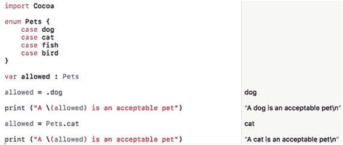
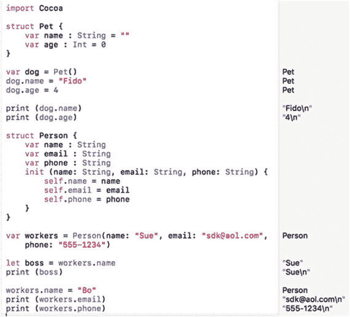
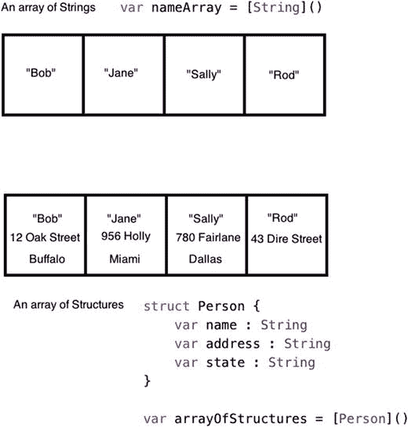
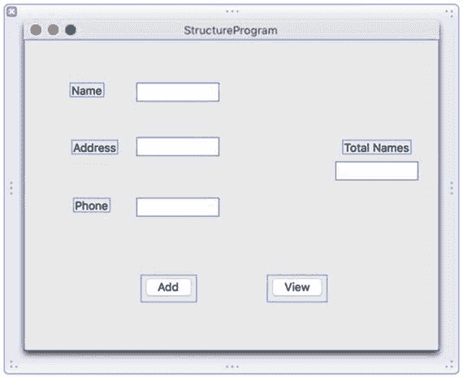
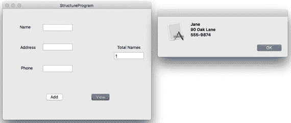

# 12. 定义自定义数据类型

为了存储数据，Swift 提供了常见的数据类型，如整数（`Int`）、小数（`Float` 或 `Double`）和文本（`String`）。此外，Swift 还提供了布尔数据类型（`Bool`）来存储 `true` 或 `false` 值。

尽管几乎每个程序都需要使用这些 Swift 数据类型中的一种或多种，但你可能会发现它们过于局限。因此，Swift 提供了多种基于基本 Swift 数据类型创建自定义数据类型的方法。此外，Swift 还提供了几种以独特的方式组织基本数据类型（`Int`、`String`、`Double` 等）的方法。定义不同的数据类型组织方式称为数据结构。

本质上，程序由算法和数据结构组成。算法定义了程序如何处理数据，而数据结构定义了程序如何存储和组织数据。

程序存储数据的方式能极大地决定程序的速度和效率。如果程序组织数据的方式不佳，可能就需要很长时间才能找到所需的数据。组织数据没有绝对的正确或错误之分，因为每个程序的需求都不同。

创建自定义数据类型能使程序更易于理解。Swift 提供了以下几种创建自定义数据类型的方式：

- 类型别名
- 枚举
- 结构体
- 不同数据类型的组合

## 类型别名

将变量声明为 `Int`、`Double` 或 `String` 等数据类型，只能告诉你该变量可以存储什么类型的数据，但不能说明这些数据的含义。例如，如果你声明两个变量为 `Int` 数据类型，每个变量都可以存储整数，但一个变量可能表示年龄，而另一个变量可能表示员工 ID 编号。

为了使数据类型的用途更清晰，Swift 允许你使用一种叫做类型别名的特性。类型别名让你能为泛型数据类型名称赋予一个描述性的名称，例如：

```
typealias EmployeeID = Int
```

现在，你不再需要将变量声明为整数（`Int`）数据类型，而可以将其声明为 `EmployeeID` 数据类型，例如：

```
typealias EmployeeID = Int
var employee : EmployeeID
employee = 192
```

这等同于：

```
var employee : Int
employee = 192
```


## 使用枚举

Swift 中基础数据类型的一大问题是，它们告诉你数据包含什么（整数、字符串等），但没有告诉你数据代表什么。`类型别名` 有助于为数据类型赋予有意义的名称，但这只是解决方案之一。另一种解决方案就是枚举。

枚举的核心思想在于，让你创建自己的数据类型，并列举该数据类型的可用选项。当你将变量声明为 `Int` 数据类型时，本质上允许该变量保存众多可能的整数值之一，而这很可能远超你的实际需求。

枚举允许你使用描述性名称定义自己的数据类型，并定义可存储的选项列表。要创建枚举，需要定义一个枚举名称，例如：

```
enum 枚举名称 {
// 此处为枚举定义
}
```

枚举名称通常首字母大写。创建枚举名称后，需要列出该枚举可以保存的可用选项。你创建的选项列表不必是任何数据类型，可以是任何你想要的描述性名称。

假设你想创建一个代表允许饲养的宠物的数据类型。可以像这样创建一个枚举：

```
enum 宠物 {
case 狗
case 猫
case 鱼
case 鸟
}
```

这定义了该枚举只保存 `狗`、`猫`、`鱼` 或 `鸟` 这些值。由于你可以任意命名枚举的数据类型，因此可以使这些选项具有描述性和实际意义。

创建枚举后，需要声明一个变量来表示该枚举，例如：

```
var 允许的宠物 : 宠物
```

如果要给这个变量（声明为 `宠物` 数据类型）赋值，需要指定枚举定义的一个选项，例如：

```
允许的宠物 = 宠物.猫
```

或者使用快捷方式：

```
允许的宠物 = .猫
```

由于 `允许的宠物` 变量已被声明为 `宠物` 数据类型，因此在赋值允许的选项时，无需再次键入 “宠物”（使用 `.猫` 代替 `宠物.猫`）。

要了解具有参数的函数如何工作，请按照以下步骤操作：

1.  确保你的 `IntroductoryPlayground` 文件已在 Xcode 中加载。
2.  按如下方式编辑代码：

    ```
    enum 宠物 {
    case 狗
    case 猫
    case 鱼
    case 鸟
    }
    var 允许的宠物 : 宠物
    允许的宠物 = .狗
    print ("一只 \(允许的宠物) 是可接受的宠物")
    允许的宠物 = 宠物.猫
    print ("一只 \(允许的宠物) 是可接受的宠物")
    ```

`宠物` 枚举定义了 `宠物` 可以保存 `狗`、`猫`、`鱼` 或 `鸟` 这些值。

`允许的宠物` 变量被声明为 `宠物` 数据类型，因此它只能保存这四个值（`狗`、`猫`、`鱼` 或 `鸟`）之一。

给 `允许的宠物` 变量赋值时，既可以列出 `宠物` 枚举名称，也可以省略它。然后 `print` 命令将 `宠物` 数据打印在字符串中，如图 12-1 所示。



图 12-1.
使用枚举定义描述性数据

如果给变量赋予枚举未定义的数据会发生什么？Swift 会捕获错误并阻止你的程序运行。因此，如果你尝试

```
允许的宠物 = .仓鼠
```

它将无法运行，因为 `仓鼠` 未被定义为 `宠物` 枚举中的可用选项。正如 Swift 不允许你将整数存储到 `String` 变量中一样，它也不允许你在枚举中存储任何未明确定义的数据。

## 使用结构体

假设你想存储几百人的姓名、街道地址、员工 ID 号和年薪金额列表。你将如何存储所有这些数据？

要存储一个人的信息，你可以创建几个变量，例如：

```
var 姓名 : String
var 街道 : String
var ID : Int
var 薪资 : Double
```

不幸的是，创建单独的变量并不能明确标识每个人的姓名必须同时包含街道地址、员工 ID 和薪资。为了解决这个问题，你可以将相关变量分组到称为结构体的同一位置。

结构体将不同类型的数据存储在一个单独的位置。使用传统变量，你一次只能存储一块数据。使用结构体，你可以定义两块或更多数据存储在一个变量中。在结构体内部声明的变量称为属性。

一个存储两块数据的结构体可以如下所示：

```
struct 结构体名称 {
var 变量名 1 : 数据类型
var 变量名 2 : 数据类型
}
```

请记住，每个变量的数据类型可以是像 `Int`、`String` 或 `Double` 这样的简单数据类型，也可以是像数组、元组、集合、枚举或字典这样更复杂的数据类型。

你可以在结构体内部定义两个或更多变量，每个变量可以包含不同的数据类型，例如字符串或整数。无论结构体包含多少个属性，在存储数据之前，都必须先初始化这些属性。

Swift 提供了三种初始化属性的方法。首先，你可以为每个属性定义初始值，如下所示：

```
struct 结构体名称 {
var 变量名 1 : 数据类型 = 初始值
var 变量名 2 : 数据类型 = 初始值
}
```

为了简化属性声明，第二种方法是省略数据类型，让 Swift 推断数据类型，如下所示：

```
struct 结构体名称 {
var 变量名 1 = 初始值
var 变量名 2 = 初始值
}
```

当你为属性分配初始值时，可以创建一个变量来表示该结构体，如下所示：

```
var 变量名 = 结构体名称()
```

初始化结构体属性的第三种方法是创建一个 `init` 函数。这意味着你必须创建一个属性名称及其数据类型的列表。然后，在创建表示该结构体的变量时，为这些属性赋值。

例如，假设你想存储一个人的信息，如姓名、电子邮件地址和电话号码。你可以创建三个单独的变量，而是创建一个单独的结构体，如下所示：

```
struct 人员 {
var 姓名 : String
var 电子邮件 : String
var 电话 : String
}
```

如果你只是定义了每个属性的数据类型，则需要创建一个名为 `init` 的初始化器，如下所示：

```
struct 人员 {
var 姓名 : String
var 电子邮件 : String
var 电话 : String
init (姓名: String, 电子邮件: String, 电话: String) {
self.姓名 = 姓名
self.电子邮件 = 电子邮件
self.电话 = 电话
}
}
```

当你基于此结构体创建一个变量时，需要包含初始值，例如：

```
var 员工 = 人员(姓名: "苏", 电子邮件: "sdk@aol.com", 电话: "555-1234")
```

创建结构体包含三个部分：

*   创建一个包含两个或更多变量（属性）的结构体。
*   通过为每个属性赋值或创建 `init` 函数来初始化所有结构体属性。
*   创建一个表示该结构体的变量。


### 在结构中存储和检索项目

结构体让你能定义要存储的相关数据的类型。然后你需要创建一个变量名来代表该结构体。要使用结构体存储数据，你需要指定用句点分隔的结构体名称和变量名，如下所示：

```
结构体变量.变量名 = 值
```

要从结构体中检索数据，你可以将一个变量赋值给结构体的变量，如下所示：

```
var 变量名 = 结构体变量.变量名
```

要了解如何创建结构体、初始化其属性、以及添加和检索数据，请按照以下步骤创建一个新的 Playground：

1.  确保你的 `IntroductoryPlayground` 文件已在 Xcode 中加载。
2.  按如下方式编辑代码：

    ```
    import Cocoa
    struct Pet {
    var name : String = ""
    var age : Int = 0
    }
    var dog = Pet()
    dog.name = "Fido"
    dog.age = 4
    print (dog.name)
    print (dog.age)
    struct Person {
    var name : String
    var email : String
    var phone : String
    init (name: String, email: String, phone: String) {
    self.name = name
    self.email = email
    self.phone = phone
    }
    }
    var workers = Person(name: "Sue", email: "sdk@aol.com", phone: "555-1234")
    let boss = workers.name
    print (boss)
    workers.name = "Bo"
    print (workers.email)
    print (workers.phone)
    ```

第一个结构体为其属性定义了初始值，因此不需要 `init` 函数。这就是为什么你可以用空括号创建一个变量，如下所示：

```
var dog = pet()
```

第二个结构体没有为其属性定义初始值，因此当你创建一个变量来表示该结构体时，你必须定义初始值：

```
var workers = person(name: "Sue", email: "sdk@aol.com", phone: "555-1234")
```

要在结构体中存储数据，你需要指定代表该结构体的变量名，后跟属性名，如图 12-2 所示。



图 12-2. 创建结构体并检索数据

## 组合数据结构

在最简单的层面上，你可以使用可用的基本数据类型（`Int`、`Float`、`Double`、`String`）。为了获得更大的灵活性，你可以组合数据结构。例如，数组通常包含单一值的列表，如整数或字符串。一种常见的组合是创建一个结构体数组，它可以包含相关的信息列表，如姓名和地址，如图 12-3 所示。



图 12-3. 结构体数组可以保存相关数据

通过组合不同的数据结构，你可以创建独特的方式来组织数据，例如集合的数组、包含数组的字典，或元组结构体。任何你可以使用 `Int` 或 `String` 等数据类型的地方，你也可以使用数组、集合或字典等数据结构。

一种常见的组合是包含结构体的数组。单独使用时，结构体只能保存有限数量的数据。而结构体数组则像一个简单的数据库。结构体定义了要存储的关于一个人的信息类型，例如姓名、地址和年龄，而数组则保存了这些数据的多个副本。

为了演示如何创建结构体数组，你将创建一个程序，允许你输入多个姓名、地址和电话号码，并且还能删除数据。

1.  在 Xcode 中选择“文件” ➤ “新建” ➤ “项目”。
2.  在 macOS 类别下，点击“应用程序”。
3.  点击“Cocoa 应用程序”，然后点击“下一步”按钮。Xcode 现在会要求输入产品名称。
4.  在“产品名称”文本字段中点击，并输入 `StructureProgram`。
5.  确保“语言”弹出菜单显示 Swift，并且没有勾选任何复选框。
6.  点击“下一步”按钮。Xcode 会询问你想在哪里存储项目。
7.  选择一个文件夹来存储你的项目，然后点击“创建”按钮。
8.  在项目导航器中点击 `MainMenu.xib` 文件。
9.  点击 `StructureProgram` 图标，使用户界面窗口显示出来。
10.  选择“视图” ➤ “工具” ➤ “显示对象库”，让对象库出现在 Xcode 窗口的右下角。
11.  将两个按钮、四个标签和四个文本字段拖到用户界面上，然后双击按钮和标签更改其上显示的文本，使其看起来类似于图 12-4。



图 12-4. `StructureProgram` 的用户界面

在适当的文本字段中输入姓名、地址和电话号码后，“添加”按钮会将此信息存储到一个结构体中，然后将该结构体存储到一个数组中。每次你添加另一个姓名、地址和电话号码时，都会向数组添加另一个结构体，同时“姓名总数”文本字段会持续更新显示数组中存储的结构体总数。

“视图”按钮会从数组中移除最后一项，并在一个警告对话框中显示其内容，以便你验证其内容。然后它会显示数组中新的结构体总数。

每个文本字段都需要一个单独的 `IBOutlet`，每个按钮都需要一个单独的 `IBAction` 方法。你可以通过从用户界面按住 Control 键拖动每个项目到你的 `AppDelegate.swift` 文件中来创建这些。


1.  在你的用户界面仍然显示在 Xcode 窗口中的情况下，选择 View ➤ Assistant Editor ➤ Show Assistant Editor。`AppDelegate.swift` 文件会出现在用户界面旁边。
2.  将鼠标移到 Add 按钮上，按住 Control 键，然后向下拖动到 `AppDelegate.swift` 文件底部最后一个右花括号的正上方。
3.  松开鼠标和 Control 键。会弹出一个窗口。
4.  点击 Connection 弹出菜单，然后选择 Action。
5.  点击 Name 文本字段，输入 `addData`。
6.  点击 Type 弹出菜单，然后选择 NSButton。接着点击 Connect 按钮。
7.  将鼠标移到 View 按钮上，按住 Control 键，然后向下拖动到 `AppDelegate.swift` 文件底部最后一个右花括号的正上方。
8.  松开鼠标和 Control 键。会弹出一个窗口。
9.  点击 Connection 弹出菜单，然后选择 Action。
10. 点击 Name 文本字段，输入 `viewButton`。
11. 点击 Type 弹出菜单，然后选择 NSButton。接着点击 Connect 按钮。`AppDelegate.swift` 文件的底部应该看起来像这样：

```
    @IBAction func addData(_ sender: NSButton) {
    }
    @IBAction func viewData(_ sender: NSButton) {
    }
    ```

12. 将鼠标移到 Add 按钮右侧的 Name 文本字段上，按住 Control 键，然后向下拖动到 `AppDelegate.swift` 文件中 `@IBOutlet` 行的下方。
13. 松开鼠标和 Control 键。会弹出一个窗口。
14. 点击 Name 文本字段，输入 `nameField`，然后点击 Connect 按钮。
15. 将鼠标移到 Add 按钮右侧的 Address 文本字段上，按住 Control 键，然后向下拖动到 `AppDelegate.swift` 文件中 `@IBOutlet` 行的下方。
16. 松开鼠标和 Control 键。会弹出一个窗口。
17. 点击 Name 文本字段，输入 `addressField`，然后点击 Connect 按钮。
18. 将鼠标移到 Delete 按钮右侧的 Phone 文本字段上，按住 Control 键，然后向下拖动到 `AppDelegate.swift` 文件中 `@IBOutlet` 行的下方。
19. 松开鼠标和 Control 键。会弹出一个窗口。
20. 点击 Name 文本字段，输入 `phoneField`，然后点击 Connect 按钮。
21. 将鼠标移到 Query 按钮右侧的 Total Names 文本字段上，按住 Control 键，然后向下拖动到 `AppDelegate.swift` 文件中 `@IBOutlet` 行的下方。
22. 松开鼠标和 Control 键。会弹出一个窗口。
23. 点击 Name 文本字段，输入 `totalField`，然后点击 Connect 按钮。现在你应该拥有代表用户界面上所有文本字段的以下 IBOutlets：

```
    @IBOutlet weak var window: NSWindow!
    @IBOutlet weak var nameField: NSTextField!
    @IBOutlet weak var addressField: NSTextField!
    @IBOutlet weak var phoneField: NSTextField!
    @IBOutlet weak var totalField: NSTextField!
    ```

至此，你已经将用户界面连接到 Swift 代码，这样你就可以使用 IBOutlets 来检索和显示用户界面上的数据。你还创建了 IBAction 方法，以便用户界面上的按钮能真正使程序工作。现在你只需要编写 Swift 代码来创建一个初始结构，然后再编写更多 Swift 代码来创建一个包含该结构的数组。
24. 在 `AppDelegate.swift` 文件中 `@IBOutlet` 列表的下方，输入以下内容来创建一个能包含三个字符串（name、address 和 phone）的结构、一个代表该结构的变量以及一个结构数组：

```
    struct Person {
    var name : String = ""
    var address : String = ""
    var phone : String = ""
    }
    var employee = Person()
    var arrayOfStructures = [Person] ()
    ```

25. 修改 `addData` IBAction 方法，使其从 Name、Address 和 Phone 文本字段获取值，并将它们存储在 `employee` 结构中。然后将该结构存储到数组中，在 Total Names 文本字段中显示数组项的总数，并清空 Name、Address 和 Phone 文本字段：

```
    @IBAction func addData(_ sender: NSButton) {
    employee.name = nameField.stringValue
    employee.address = addressField.stringValue
    employee.phone = phoneField.stringValue
    arrayOfStructures.append(employee)
    totalField.integerValue = arrayOfStructures.count
    nameField.stringValue = ""
    addressField.stringValue = ""
    phoneField.stringValue = ""
    }
    ```

26. 修改 `viewData` IBAction 方法，使其从 Key 文本字段获取一个值，并从字典中删除关联的值，如下所示：

```
    @IBAction func viewData(_ sender: NSButton) {
    let myAlert = NSAlert()
    if arrayOfStructures.isEmpty {
    myAlert.messageText = "Array is empty"
    myAlert.runModal()
    } else {
    var personData = Person()
    personData = (arrayOfStructures.removeLast())
    totalField.integerValue = arrayOfStructures.count
    myAlert.messageText = personData.name + "\r\n" + personData.address + "\r\n" + personData.phone
    myAlert.runModal()
    }
    }
    ```

`viewData` IBAction 方法中的代码创建了一个警报对话框。然后它检查数组是否为空。如果是，它会在警报对话框中显示 "Array is empty"。

如果数组不为空，则移除数组中存储的最后一个结构，在 Total Names 文本字段中显示数组项的新总数，并在警报对话框中显示被移除的结构数据。

`AppDelegate.swift` 文件的完整内容应该看起来像这样：

```
import Cocoa
@NSApplicationMain
class AppDelegate: NSObject, NSApplicationDelegate {
@IBOutlet weak var window: NSWindow!
@IBOutlet weak var nameField: NSTextField!
@IBOutlet weak var addressField: NSTextField!
@IBOutlet weak var phoneField: NSTextField!
@IBOutlet weak var totalField: NSTextField!
struct Person {
var name : String = ""
var address : String = ""
var phone : String = ""
}
var employee = Person()
var arrayOfStructures = [Person] ()
func applicationDidFinishLaunching(_ aNotification: Notification) {
// Insert code here to initialize your application
}
func applicationWillTerminate(_ aNotification: Notification) {
// Insert code here to tear down your application
}
@IBAction func addData (_ sender: NSButton) {
employee.name = nameField.stringValue
employee.address = addressField.stringValue
employee.phone = phoneField.stringValue
arrayOfStructures.append(employee)
totalField.integerValue = arrayOfStructures.count
nameField.stringValue = ""
addressField.stringValue = ""
phoneField.stringValue = ""
}
@IBAction func viewData(_ sender: NSButton) {
let myAlert = NSAlert()
if arrayOfStructures.isEmpty {
myAlert.messageText = "Array is empty"
myAlert.runModal()
} else {
var personData = Person()
personData = (arrayOfStructures.removeLast())
totalField.integerValue = arrayOfStructures.count
myAlert.messageText = personData.name + "\r\n" + personData.address + "\r\n" + personData.phone
myAlert.runModal()
}
}
}
```

要查看这个程序如何工作，请遵循以下步骤：

1.  选择 Product ➤ Run。Xcode 运行你的 StructureProgram 项目。
2.  点击 Name 文本字段，输入 Bob。
3.  点击 Address 文本字段，输入 123 Main。
4.  点击 Phone 文本字段，输入 555-1234。
5.  点击 Add 按钮。程序在 Total Names 文本字段中显示数组中的项目数量（1）。
6.  重复步骤 2–5，但输入名字 Jane、地址 90 Oak Lane 和电话号码 555-9874。Total Names 文本字段中会显示数字 2。
7.  点击 View 按钮。会出现一个警报对话框，显示 Jane、90 Oak Lane 和 555-9874，如图 12-5 所示。




**图 12-5.**  
一个显示最后添加到数组中的结构的提醒对话框

8.  点击“确定”关闭提醒对话框。
9.  选择 StructureProgram ➤ 退出 StructureProgram。

### 摘要

每个程序都需要存储和操作数据。在最简单的层面，你可以将数据存储在 Swift 的基本数据类型（`Int`、`Double`、`Float`、`String`）之一中。为了让这些基本数据类型更具描述性，你可以使用 `typealiases`，它能让你选择一个更有意义的名字来表示一个基本数据类型，例如 `String` 或 `Double`。

要创建你自己的数据类型并限制其能保存的值，你可以使用枚举。枚举让你列出该枚举所能包含的所有可能选项，从而可以创建更具描述性的名称。

如果你想将相关的数据分组在一起，无论其数据类型如何，都可以使用结构体。通过将结构体与数组等其他数据结构结合，你可以创建相关数据的列表。组合数据结构可以让你以对程序最高效的方式来组织数据。

