# 13. 创建类与对象

使用 Xcode 在 Swift 中编程的核心是面向对象编程。其主要思想是将一个大型程序划分为独立的对象，其中每个对象理想地代表一个物理实体。例如，如果你正在创建一个控制汽车的程序，一个对象可能代表汽车的引擎，第二个对象代表汽车的娱乐系统，第三个对象代表汽车的加热和冷却系统。

现在，如果你想要更新程序中控制汽车引擎的部分，你只需修改或替换控制该引擎的对象。对象不仅帮助你更好地理解程序的不同部分如何协同工作，还能隔离代码，这样你就可以创建构建块，以组合出更大、更复杂的程序。

对象帮助你像看待彼此独立的构建块一样来审视你的程序。在面向对象编程出现之前，程序员将程序划分为函数，这些函数也类似于微型的构建块。函数和对象之间的主要区别在于，函数可以访问其他函数使用的数据。这意味着如果你修改了一个函数，常常会在无意中影响到程序的其他部分。这不仅使得修复错误或缺陷变得困难，也让修改程序变得棘手。

而对于对象，其主要思想是创建独立、自足的构建块，它们协同工作且互不影响彼此的数据。为了保持数据隔离，对象使用了封装。这意味着一个对象拥有自己的变量（称为属性）和函数（称为方法）。

修改对象中数据的唯一方法是使用该对象的方法。这样，如果出现问题，你可以将问题定位到该对象的方法上。没有对象，程序的任何部分都可能干扰另一部分所使用的数据，这使得查找和修复问题几乎不可能。

对象可以通过两种方式相互通信：

*   在另一个对象的属性中存储新值
*   调用另一个对象的方法

理想情况下，一个程序应由完全独立执行任务的对象组成。这使得通过用一个对象的改进版本来替换它，来修改程序变得简单。

## 创建类

创建对象有两个步骤。首先，你必须创建一个类。其次，基于该类创建一个对象。

一个类的外观和工作方式与结构体非常相似（参见第 12 章）。主要区别在于，结构体只包含数据，而类可以包含数据以及操作这些数据的函数。

一旦定义了类，你就可以基于该类创建一个或多个对象。可以把类看作是定义饼干形状的模具，而对象则是你可以根据该类定义的不同类型的面团。

你可以定义的最简单的类如下所示：

```
class ClassName {
}
```

要从此类创建对象，你只需声明一个变量，但不是定义像 `Int` 或 `String` 这样的数据类型，而是定义类的名称，例如：

```
var myObject = ClassName()
```

当然，一个不含任何代码的类是无用的，因此你可以在类中包含的两种代码是变量（称为属性）和用于操作数据的函数（称为方法）。在类中创建属性涉及创建一个或多个变量，并定义数据类型和初始值，例如：

```
class ClassName {
var name : String = ""
var ID : Int = 0
var salary : Double = 0
}
```

初始值很重要，因为当你在类的基础上创建对象时，你不希望存在未初始化的值，这些值在你尝试使用它们时可能会引发问题。

要定义属性，你需要声明一个变量名、数据类型和初始值。由于 Swift 可以推断数据类型，你可以省略数据类型声明，只分配初始值，像这样：

```
class ClassName {
var name = ""
var ID  = 0
var salary = 0
}
```

如果你不确定要存储何种类型的初始值，你可以直接使用可选变量，例如：

```
class ClassName {
var name : String?
var ID : Int?
var salary : Double?
}
```

可选变量的初始值为 `nil`，因此你最终很可能需要存储实际的值。

无论你是用初始值定义类的属性，还是用可选变量将其定义为 `nil` 值，你都可以通过创建一个变量名，将其赋值为类名，并在其后跟一对空括号来从该类创建对象，如下所示：

```
var myObject = ClassName()
```

以上两种方法都会为类的属性创建相同的初始值。为了更灵活，你可以创建一个名为 `init` 的初始化方法。它允许你在每次从类创建对象时定义初始值。类中的初始化器可能如下所示：

```
class SecondClass {
var name : String
var ID : Int
var salary : Double
init (name: String, ID: Int, salary: Double) {
self.name = name
self.ID = ID
self.salary = salary
}
}
```

这个初始化方法 (`init`) 定义了一个接受三个参数（一个字符串、一个整数和一个双精度浮点值）的参数列表。然后它将这些信息分别存储在 `name`、`ID` 和 `salary` 属性中。当一个类具有初始化器时，你必须通过包含与初始化器参数列表匹配的正确数量和数据类型来创建该类的对象。

这意味着在括号中包含一个字符串、一个整数和一个双精度浮点值来创建对象，像这样：

```
var secondObject = SecondClass (name: "Joe", ID: 102, salary: 120000)
```

请注意，当你在参数列表中包含数据时，必须使用初始化器参数列表中定义的变量名来标记每个数据块。在这个例子中，三个参数名是 `name`、`ID` 和 `salary`，因此创建对象意味着使用相同的这些参数名来标识数据。


好的，作为一名高级文档工程师和翻译员，我将严格遵循您的注意事项和示例，将给定的英文文本翻译成中文。


### 访问对象中的属性

要访问对象的属性，您必须指定对象名称，后跟一个句点和属性名称，例如：

```
objectName.propertyName = data
```

您也可以将对象的属性值赋给一个变量，如下所示：

```
var person = myObject.name
```

要访问属性，您需要指定对象名称、一个句点以及您想要访问的属性名称，例如：

```
print (person.name)
```

**注意**  
访问存储在属性中的值时，请确保指定的是对象名称，而不是类名。如果您从 `ClassName` 类创建了一个 `person` 对象，则应通过指定对象名称 (`person`) 和属性名称 (`name`、`ID`、`salary`) 来访问属性，例如 `person.name` 或 `person.ID`。您不能通过使用类名（如 `ClassName.name` 或 `className.ID`）来访问属性值。如果您尝试这样做，代码将无法运行。

与普通变量一样，对象的属性每次只能保存一个数据块。一旦您在属性中存储了新数据，就会覆盖之前的数据。

要了解如何创建类并使用对象的属性，请遵循以下步骤：

1.  确保 `IntroductoryPlayground` 文件已在 Xcode 中加载。
2.  按如下方式编辑代码：

```
import Cocoa
class ClassName {
var name = ""
var ID  = 0
var salary = 0
}
var worker = ClassName()
worker.name = "Bob"
worker.ID = 102
worker.salary = 10
class SecondClass {
var name : String
var ID : Int
var salary : Double
init (name: String, ID: Int, salary: Double) {
self.name = name
self.ID = ID
self.salary = salary
}
}
var executive = SecondClass (name: "Joe", ID: 17, salary: 50000)
print (worker.name)
print (worker.ID)
print (worker.salary)
print (executive.name)
print (executive.ID)
print (executive.salary)
```

第一个类在声明其属性时对其进行了初始化。然后，它基于该类 (`ClassName`) 创建了一个对象 (`worker`)。为了在 `worker` 对象中存储数据，代码指定了对象名称 (`worker`) 和属性名称，并为其赋值。

第二个类示例使用初始化器来定义属性值。`init` 方法按顺序接受三个数据块：一个字符串、一个整数和一个十进制 (`Double`) 值。

要从第二个类 (`SecondClass`) 创建一个对象 (`executive`)，括号中需要包含正确数量和顺序的数据，以及正确的数据类型，此外还要显示一个标签来标识数据的含义，如图 13-1 所示。

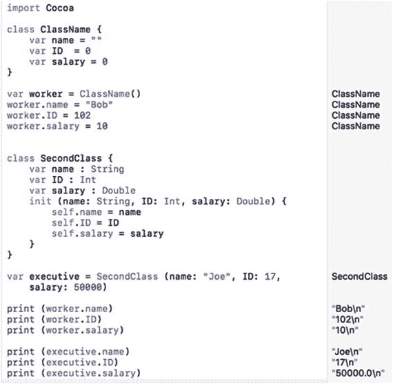

**图 13-1.** 创建类文件并访问属性

### 对象中的计算属性

作为为属性定义固定值的一种替代方案，您还可以使用计算属性，其中一个属性的初始值取决于另一个属性的值。创建计算属性的最简单方法是定义一个属性名称、数据类型，然后在大括号中编写计算值的代码。最后，使用 `return` 关键字定义要存储在该属性中的值。

这个计算属性只是获取存储在 `height` 属性中的值，将其乘以 2，然后将结果存储在 `width` 属性中。当您基于 `shape` 类创建对象时，初始值 5 会存储在 `height` 属性中，计算属性会将 `height` 值 (5) 乘以 2 得到 10，并将其存储在 `width` 属性中，如图 13-2 所示。

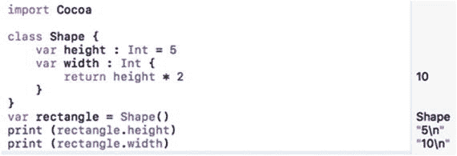

**图 13-2.** 使用计算属性来确定属性的初始值

在这个计算属性的示例中，一个属性 (`width`) 的值是通过获取另一个属性 (`height`) 的值来确定其自身值的。在技术术语中，这被称为 getter。

### 设置其他属性

另一种在属性中存储值的选项是使用所谓的 setter。使用 setter，定义一个属性会设置另一个属性的值。由于 getter 和 setter 非常相似，它们通常在同一属性中使用。这样，一个属性使用 getter 从另一个属性计算其值，因此如果您为该属性设置一个值，它可以更改另一个属性。定义 getter 和 setter 如下所示：

```
class Blob {
var property1 : dataType = value
var property2 : dataType {
get {
return valueHere
}
set {
property1 = valueHere
}
}
}
```

在 getter 中，您始终需要一个 `return` 关键字来将值返回给拥有该 getter 的属性。在 setter 中，您必须将一个属性赋值给一个值。这个值可以是一个固定值，也可以是一个返回值的计算结果。

**注意**  
您不需要同时拥有 getter 和 setter。您可以只使用 getter，通过省略 `get` 关键字并将代码仅用大括号括起来来简化它，就像本节开头 `shape` 类示例中那样。您也可以只使用 setter，但需要使用 `set` 关键字。

在上面的示例中，每当 `property2` 被赋予一个新值时，它都会使用其 setter 为 `property1` 定义一个新值。

Setter 还可以接受一个值，并使用该值为不同的属性计算新结果。要接受一个 setter 的值，您只需要创建一个用括号括起来的变量，并使用该值为另一个属性计算结果，例如：

```
class Blob {
var property1 : dataType = value
var property2 : dataType {
get {
return valueHere
}
set (newValue) {
property1 = valueHere based on newValue
}
}
}
```

要了解 getter 和 setter 如何工作，请遵循以下步骤：

1.  确保您的 `IntroductoryPlayground` 文件已加载到 Xcode 中。
2.  按如下方式编辑代码：

```
import Cocoa
class Shape {
var height : Int = 5
var width : Int {
return height * 2
}
}
var rectangle = Shape()
print (rectangle.height)
print (rectangle.width)
rectangle.height = 20
print (rectangle.width)
class Blob {
var height : Int = 5
var width : Int = 10
var area : Int {
get {
return height * width
}
set (newValue) {
height = newValue + 10
width = newValue - 5
}
}
}
var CEO = Blob()
print (CEO.area)
CEO.area = 247
print (CEO.height)
print (CEO.width)
```

您可以将 getter 和 setter 视为改变其他属性的函数。不过，在使用 getter 和 setter 时要小心，因为如果您不了解它们的存在或工作原理，它们可能会导致意外行为。图 13-3 显示了上述代码的结果，以便您了解 getter 和 setter 如何影响属性。

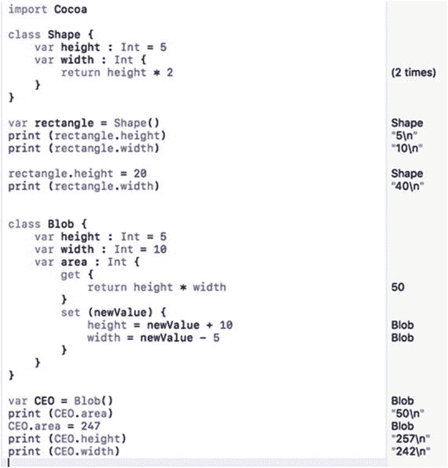

**图 13-3.** 使用 getter 和 setter 修改属性


### 使用属性观察器

Swift 提供了两个名为 `willSet` 和 `didSet` 的属性观察器。`willSet` 属性观察器在属性接收新值之前运行代码。`didSet` 属性观察器在属性接收新值之后运行代码。

与 getter 和 setter 类似，属性观察器本质上是在属性获得新值时运行的函数。`willSet` 和 `didSet` 属性观察器的基本结构与 getter 和 setter 的结构相同：

```
var property : dataType = initialValue {
willSet {
}
didSet {
}
}
```

`willSet` 属性观察器在属性获得新值之前运行代码。`didSet` 属性观察器在属性获得新值之后运行代码。要了解属性观察器的工作原理，请按照以下步骤操作：

1.  确保你的 `IntroductoryPlayground` 文件已加载到 Xcode 中。  
2.  按如下方式编辑代码：

    ```
    import Cocoa
    class Animal {
    var IQ : Int = 0
    var legs : Int = 0 {
    willSet {
    IQ += 10
    }
    didSet {
    IQ -= 3
    }
    }
    }
    var pet = Animal()
    print (pet.IQ)
    pet.legs = 4
    print (pet.IQ)
    ```

在这个例子中，`IQ` 属性的初始值为 0。请注意，当你将 `legs` 属性设置为 4 时，它会立即运行 `willSet` 属性观察器中的代码，该代码将 `IQ` 属性增加 10。然后它会立即运行 `didSet` 属性观察器中的代码，该代码减去 3，如图 13-4 所示。

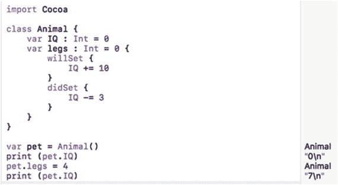

图 13-4。

使用属性观察器

## 创建方法

一个仅仅存储一个或多个属性的类可以方便地将相关数据分组在一起。然而，使面向对象编程更有用的是，对象也可以操作自己的数据。要为对象创建要运行的小程序，你需要在类内部定义函数（称为方法）。

当你从用户界面连接按钮以在 Swift 代码文件中创建 IBAction 方法时，你已经见过方法了。类内部最简单的方法执行完全相同的功能：

```
class CountDown {
var counter = 10
func decrement() {
counter = counter - 1
}
}
```

这个 `decrement` 方法简单地从 `counter` 属性中减去 1，该属性的初始值为 10。要使此方法运行，你必须指定对象名称、一个点和方法名称，如下所示：

```
var myObject = CountDown ()
myObject.decrement()
```

这个 `decrement` 方法每次做的事情完全相同，即从 `counter` 属性中减去 1。一个更有趣且灵活的方法会接受数据（一个或多个参数）来修改方法中代码的工作方式，例如：

```
class CountDown {
var counter = 10
func decrement() {
counter = counter - 1
}
func decrementByValue (step : Int) {
counter -= step
}
}
```

第二个方法 `decrementByValue` 接受一个整数，该整数存储在一个名为 `step` 的变量中。然后它从 `counter` 属性中减去 `step` 的值，如图 13-5 所示。

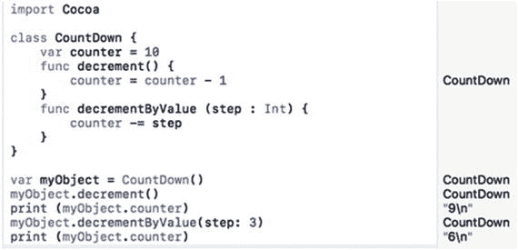

图 13-5。

运行一个接受值的方法

当一个方法接受数据时，它也可以返回一个特定的值。要创建这样的方法，你需要标识该方法返回的数据类型（使用 `➤` 符号）以及定义要返回的具体值的 `return` 关键字。

因此，如果你想创建一个返回 `Float` 数据类型的方法，你可以定义一个如下所示的方法：

```
class MathBrain {
var tempValue: Float = 0
func average (first : Float, second : Float) -> Float {
return (first + second) / 2
}
}
```

此方法接受两个 `Float` 数字（存储在名为 `first` 和 `second` 的变量中）并返回一个 `Float` 值。要调用此方法，你需要指定一个对象名称、一个点、方法名称以及两个 `Float` 数据类型的数字。

请注意，此方法有两个名为 `first` 和 `second` 的参数。传递参数时，你必须指定参数名称（`first` 和 `second`），例如：

```
var math = MathBrain()
var temp : Float = math.average(first: 4.0, second: 9.0)
print (temp)
```

要了解如何创建一个集合，并向其中添加和删除数据，请按照以下步骤创建一个新的 playground：

1.  确保你的 `IntroductoryPlayground` 文件已加载到 Xcode 中。  
2.  按如下方式编辑代码：

    ```
    import Cocoa
    class MathBrain {
    var tempValue: Float = 0
    func average (first : Float, second : Float) -> Float {
    return (first + second) / 2
    }
    }
    var math = MathBrain()
    var temp : Float = math.average(first: 4.0, second: 9.0)
    print (temp)
    ```

`average` 方法接受两个参数，将它们相加，然后除以 2。然后它使用 `return` 关键字返回此值。

当给 `average` 方法传递数字 4.0 和 9.0 时，它返回 6.5 的值，该值存储在一个名为 `temp` 的变量中，如图 13-6 所示。

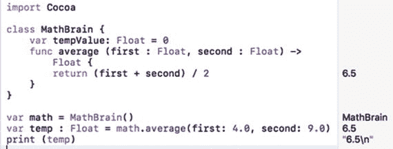

图 13-6。

向对象中的方法传递参数


## 在 macOS 程序中使用对象

对象可以包含任意数量的属性，这些属性可以保存整数或字符串等简单数据类型，也可以保存元组、集合或数组等更复杂的数据类型。一个对象还可以包含一个或多个方法，这些方法通常用于操作该对象的属性。

在这个示例程序中，你将定义一个类，并基于该类创建两个对象。你还将了解如何将类存储在单独的文件中。与其将所有内容塞进一个文件，不如将代码分别存储在多个文件中，这样更便于管理。

这两个对象将会运行存储在另一个对象中的方法。用户界面也会从两个对象的属性中检索值，并将其显示在用户界面的文本字段中。

为了进一步了解用户界面，你还将学习如何将两个按钮连接到同一个 `IBAction` 方法，并确定用户点击了哪个按钮。和往常一样，你将了解如何通过 `IBOutlet` 在用户界面元素中显示数据。要创建这个示例程序，请按照以下步骤操作：

1.  在 Xcode 中选择“文件”➤“新建”➤“项目”。
2.  点击 macOS 类别下的“应用”。
3.  点击“Cocoa 应用”，然后点击“下一步”按钮。Xcode 现在会要求输入产品名称。
4.  点击“产品名称”文本字段，然后输入 `ObjectProgram`。
5.  确保“语言”弹出菜单显示为 Swift，并且没有选中任何复选框。
6.  点击“下一步”按钮。Xcode 会询问你想将项目存储在何处。
7.  选择一个文件夹来存储你的项目，然后点击“创建”按钮。
8.  在项目导航器中点击 `MainMenu.xib` 文件。
9.  点击 ObjectProgram 图标以显示用户界面窗口。
10. 选择“视图”➤“工具”➤“显示对象库”，使对象库出现在 Xcode 窗口的右下角。
11. 将两个按钮、两个标签和两个文本字段拖到用户界面上，然后双击按钮和标签，更改其上显示的文本，使其看起来类似于图 13-7。

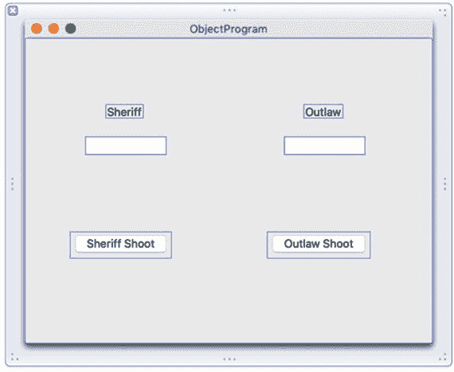

**图 13-7.** ObjectProgram 的用户界面

该用户界面将显示两个角色（警长和歹徒）的生命值点数。每次你点击“警长射击”或“歹徒射击”按钮时，一个 `IBAction` 方法会随机判断另一个角色是否被击中。如果被击中，它还会判断射击造成了多少伤害，伤害范围为 1 到 3。任何变化都会显示在“警长”或“歹徒”标签下方的文本字段中。

“警长射击”和“歹徒射击”按钮运行一个 `IBAction` 方法，该方法首先判断用户点击的是哪个按钮，是“警长射击”按钮还是“歹徒射击”按钮。为了识别用户点击了哪个按钮，你需要修改每个按钮的 `Tag` 属性，使“警长射击”按钮的 `Tag` 值为 0，“歹徒射击”按钮的 `Tag` 值为 1。

在确定是警长还是歹徒在射击之后，`IBAction` 方法会运行 `shoot` 方法，该方法随机判断射击是否命中以及造成的伤害，伤害值会从每个对象的 `hitPoints` 属性中减去。

生命值点总数会显示在“警长”和“歹徒”标签下方的文本字段中。一旦警长或歹徒的生命值点总数降至 0 或以下，就会弹出一个警告对话框，告知你警长或歹徒是否死亡。要将你的用户界面连接到 Swift 代码，请按照以下步骤操作：

1.  在 Xcode 窗口中用户界面仍然可见的情况下，选择“视图”➤“辅助编辑器”➤“显示辅助编辑器”。`AppDelegate.swift` 文件会出现在用户界面旁边。
2.  将鼠标移到“警长射击”按钮上，按住 Control 键，然后拖拽到 `AppDelegate.swift` 文件底部最后一个大括号的上方。
3.  松开鼠标和 Control 键。会弹出一个弹出窗口。
4.  在“连接”弹出菜单中点击，然后选择“操作”。
5.  在“名称”文本字段中点击，然后输入 `shootButton`。
6.  在“类型”弹出菜单中点击，然后选择 NSButton。接着点击“连接”按钮。
7.  将鼠标移到“歹徒射击”按钮上，按住 Control 键，然后拖拽到你刚刚创建的现有 `IBAction` `shootButton` 方法上，直到整个方法高亮显示，如图 13-8 所示。

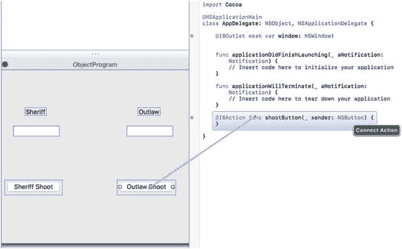

**图 13-8.** 将“歹徒射击”按钮连接到现有的 `IBAction` 方法

8.  松开鼠标和 Control 键，将“歹徒射击”按钮连接到现有的 `IBAction` `shootButton` 方法。
9.  将鼠标移到“警长”文本字段上，按住 Control 键，然后拖拽到 `AppDelegate.swift` 文件中 `@IBOutlet` 行的下方。
10. 松开鼠标和 Control 键。会弹出一个弹出窗口。
11. 在“名称”文本字段中点击，然后输入 `sheriffHitPoints`，并点击“连接”按钮。
12. 将鼠标移到出现在“添加”按钮右侧的“歹徒”文本字段上，按住 Control 键，然后拖拽到 `AppDelegate.swift` 文件中 `@IBOutlet` 行的下方。
13. 松开鼠标和 Control 键。会弹出一个弹出窗口。
14. 在“名称”文本字段中点击，然后输入 `outlawHitPoints`，并点击“连接”按钮。现在，你应该拥有以下这些 `IBOutlet`，它们代表了你用户界面上的所有文本字段：

```
@IBOutlet weak var window: NSWindow!
@IBOutlet weak var sheriffHitPoints: NSTextField!
@IBOutlet weak var outlawHitPoints: NSTextField!
```

此时，你已经将用户界面连接到了 Swift 代码，因此你可以使用 `IBOutlet` 在用户界面上显示数据。你还创建了一个单一的 `IBAction` 方法，当用户点击两个按钮中的任意一个时，该方法会运行。现在你需要更改“歹徒射击”按钮的 `Tag` 属性。

1.  点击“歹徒射击”按钮以选中它。
2.  选择“视图”➤“工具”➤“显示属性检查器”。“属性检查器”面板会出现在 Xcode 窗口的右上角。
3.  向下滚动到“视图”类别，然后将 `Tag` 属性更改为 1，如图 13-9 所示。

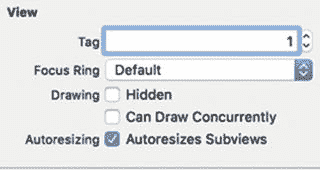

**图 13-9.** “属性检查器”面板底部的 `Tag` 属性

既然你已经定义好了用户界面，下一步就是创建一个单独的 Swift 文件来存放你的类，你可以按照以下步骤进行操作：

1.  选择“文件”➤“新建”➤“文件”。会出现一个对话框，要求你选择要使用的模板。
2.  点击 macOS 类别下的“源”，然后点击“Swift 文件”，如图 13-10 所示。

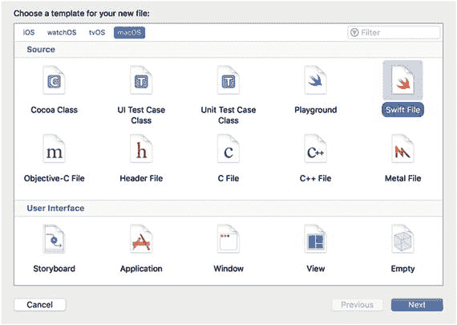

**图 13-10.** 选择用于存放类定义代码的文件

3.  点击“下一步”按钮。Xcode 会询问你想将这个文件存储在哪里，以及你想给它起什么名字。
4.  在“保存为”文本字段中点击，然后输入 `personClass`。接着点击“创建”按钮。Xcode 会在“项目导航器”面板中显示 `personClass.swift` 文件。
5.  在“项目导航器”面板中点击 `personClass.swift` 文件。Xcode 会显示该文件的内容。
6.  按如下方式编辑 `personClass.swift` 文件：


```swift
import Foundation
class Person {
var hitPoints = 10
func shoot () -> Int {
let odds = 1 + Int(arc4random_uniform(3))
if odds == 3 {
// 命中，随机在 1 到 3 之间决定伤害值
return 1 + Int(arc4random_uniform(3))
} else {
return 0 // 未命中
}
}
}
```

这个类定义了一个名为 `hitPoints` 的属性，并将它初始化为 10。它还定义了一个名为 `shoot` 的方法，这个方法不接受任何参数，但返回一个整型值。在 `shoot` 方法内部，它会计算一个 1 到 3 之间的随机数，并将这个值存储在 `odds` 变量中。

接下来，它会检查 `odds` 的值是否正好等于 3。如果是，则再计算一个 1 到 3 之间的随机数并返回该值；如果 `odds` 的值不是 3，则方法返回 0。

现在你已经在单独的 Swift 文件中定义了一个类，是时候使用这个类来创建对象了。你可以按照以下步骤操作：

1. 在项目导航面板中点击 `AppDelegate.swift` 文件。Xcode 会显示 `AppDelegate.swift` 文件的内容。
2. 在 `AppDelegate.swift` 文件的 IBOutlet 列表下方，输入以下代码，基于 `personClass.swift` 文件中定义的 person 类创建两个对象：

```swift
@IBOutlet weak var window: NSWindow!
@IBOutlet weak var sheriffHitPoints: NSTextField!
@IBOutlet weak var outlawHitPoints: NSTextField!
var sheriff = Person ()
var outlaw = Person ()
```

3. 修改 `applicationDidFinishLaunching` 方法，使其在用户界面的文本字段中显示警官和罪犯对象的 `hitPoints` 属性的初始值。这两个文本字段分别对应名为 `sheriffHitPoints` 和 `outlawHitPoints` 的 IBOutlet：

```swift
func applicationDidFinishLaunching(aNotification: NSNotification) {
// 在此处插入代码以初始化应用
sheriffHitPoints.integerValue = sheriff.hitPoints
outlawHitPoints.integerValue = outlaw.hitPoints
}
```

4. 按如下方式修改 `shootButton` IBAction 方法：

```swift
@IBAction func shootButton(_ sender: NSButton) {
if sender.tag == 0 {    // 警官射击
outlaw.hitPoints -= sheriff.shoot()
} else {    // 罪犯射击
sheriff.hitPoints -= outlaw.shoot()
}
sheriffHitPoints.integerValue = sheriff.hitPoints
outlawHitPoints.integerValue = outlaw.hitPoints
if sheriffHitPoints.integerValue <= 0 {
let myAlert = NSAlert()
myAlert.messageText = "警官阵亡。"
myAlert.runModal()
} else if outlawHitPoints.integerValue <= 0 {
let myAlert = NSAlert()
myAlert.messageText = "罪犯阵亡。"
myAlert.runModal()
}
}
```

这段代码会检查 `sender` 变量的 `Tag` 属性，该属性用于判断用户点击了哪个按钮。如果 `Tag` 属性为 0，则表示用户点击了“警官射击”按钮，因此它会执行警官对象的 `shoot` 方法，并从 `outlaw.hitPoints` 属性中减去其结果（0 到 3 之间的值）。

如果用户点击了“罪犯射击”按钮，则 `shoot` 方法会执行 `outlaw` 对象中的 `shoot` 方法，并从 `sheriff.hitPoints` 属性中减去其结果（0 到 3 之间的值）。

无论结果如何，它都会将警官和罪犯最新的 `hitPoints` 属性值更新显示在用户界面上的两个文本字段中，这两个字段由 `sheriffHitPoints` 和 `outlawHitPoints` IBOutlet 标识。

最后，如果警官或罪犯中任意一方的 `hitPoints` 属性降到 0 或以下，则会弹出一个警告对话框，显示警官或罪犯阵亡的消息。`AppDelegate.swift` 文件的完整内容如下：

```swift
import Cocoa
@NSApplicationMain
class AppDelegate: NSObject, NSApplicationDelegate {
@IBOutlet weak var window: NSWindow!
@IBOutlet weak var sheriffHitPoints: NSTextField!
@IBOutlet weak var outlawHitPoints: NSTextField!
var sheriff = Person ()
var outlaw = Person ()
func applicationDidFinishLaunching(_ aNotification: Notification) {
// 在此处插入代码以初始化应用
sheriffHitPoints.integerValue = sheriff.hitPoints
outlawHitPoints.integerValue = outlaw.hitPoints
}
func applicationWillTerminate(_ aNotification: Notification) {
// 在此处插入代码以清理应用
}
@IBAction func shootButton(_ sender: NSButton) {
if sender.tag == 0 {    // 警官射击
outlaw.hitPoints -= sheriff.shoot()
} else {    // 罪犯射击
sheriff.hitPoints -= outlaw.shoot()
}
sheriffHitPoints.integerValue = sheriff.hitPoints
outlawHitPoints.integerValue = outlaw.hitPoints
if sheriffHitPoints.integerValue <= 0 {
let myAlert = NSAlert()
myAlert.messageText = "警官阵亡。"
myAlert.runModal()
} else if outlawHitPoints.integerValue <= 0 {
let myAlert = NSAlert()
myAlert.messageText = "罪犯阵亡。"
myAlert.runModal()
}
}
}
```

要查看这个程序的运行效果，请按照以下步骤操作：

1. 选择“产品” ➤ “运行”。Xcode 会运行你的 ObjectProgram 项目。注意警官和罪犯标签下方的文本字段都显示 10，代表他们的总生命值。每被击中一次，生命值就会下降。生命值降到 0 或以下的角色即为失败者。
2. 点击“警官射击”按钮。如果警官击中了罪犯，你会看到罪犯标签下方的数值从 10 降到更小的值，例如 8。如果警官未命中，那么罪犯下方的数字将保持不变。
3. 点击“罪犯射击”按钮。
4. 重复步骤 2 和 3，交替点击“警官射击”和“罪犯射击”按钮，直到其中一个角色的生命值降到 0 或以下。此时会弹出一个警告对话框，如图 13-11 所示。

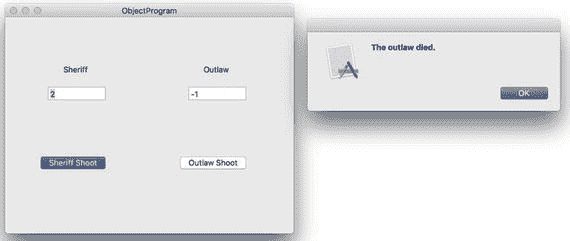

图 13-11. 当某个角色的总生命值降到 0 或以下时，会弹出警告对话框

5. 点击“确定”关闭警告对话框。
6. 选择“ObjectProgram” ➤ “退出 ObjectProgram”。

### 总结

Swift 编程完全依赖于对象和面向对象编程的原则。要创建对象，必须先定义类。一个类通常包含一个或多个变量（称为属性）以及一个或多个函数（称为方法）。一旦定义了类，就可以创建该类的对象。

类中的属性始终需要被初始化。你可以在定义属性的同时为每个属性设置初始值，也可以创建一个特殊的初始化方法，通过接收数据来为对象定义初始值。

属性可以用固定值进行初始化，也可以基于其他属性的值进行计算。一个属性的值可以改变另一个不同属性的值。

你可以从一个类中创建任意数量的对象。通常最好将类定义放在单独的文件中，以保持代码的组织性。面向对象程序通过对象向其他对象的属性发送数据，或调用其他对象中存储的方法来工作。通过协同工作且保持独立性，对象使得创建可靠且复杂的程序比以往更快更容易。


