# 14. 继承、多态与类的扩展

在第 13 章中，你已经学习了如何通过类创建对象，以及类如何定义属性和方法。为了保护其数据和方法不被程序的其他部分访问，对象会隔离或封装其代码。封装是面向对象编程的一大优势，因为它创建了自包含的代码，你可以轻松修改或替换这些代码，而不会影响程序的任何其他部分。

通过尽可能保持代码独立于程序的其他部分，对象提高了可靠性。想象一下用扑克牌搭建的房子。移除一张牌，整个房子就会倒塌——这正是面向对象编程出现之前大多数软件的运作方式。

对象就像扑克牌一样，你可以移除或替换其中一张，而不会影响其他任何牌。除了封装之外，面向对象编程还包含另外两个特性，称为继承和多态。

继承背后的理念是重用现有代码，而无需实际制作该代码的另一份副本。多态背后的理念是你可以替换继承的代码，而无需修改原始代码。通过继承和多态，即使不了解原始代码的工作原理，你也可以重用现有代码。

事实上，每次你在 Xcode 中创建一个项目时，查看你的 Swift 文件顶部，应该会看到类似这样的一行代码：

```
import Cocoa
```

这行代码告诉 Xcode 使用 Apple 为你创建并存储在 Cocoa 框架中的所有类。在之前的示例程序中，你使用了 Cocoa 框架来操作数组、集合和字典。如果没有 Cocoa 框架，你就必须自己编写 Swift 代码来实现这些通用功能。这不仅耗时，而且容易出错，因为你需要编写代码并进行测试以确保其正常工作。

只需依赖 Cocoa 框架中的类，你就可以在不编写大量代码的情况下为程序添加功能。随着你编写自己类的经验越来越丰富，你可以创建自己的实用库，并轻松地将其插入到其他项目中，从而重用你所有的辛勤成果。

## 理解继承

继承的主要目的是让代码重用变得简单。在过去，人们通过简单地复制代码副本来实现代码重用。但是，如果你在代码中发现了一个错误（bug），会发生什么呢？你需要在代码的每个副本中修复这个 bug。遗漏一个出错代码的副本，你的程序就无法运行。

创建同一代码的多个副本会导致两个问题。首先，它浪费空间。其次，它使修改代码变得更加困难，因为代码的多个副本散布在整个程序中。继承解决了这两个问题。

首先，继承从不制作代码的副本，因此它从不浪费空间。其次，由于继承只保留一份代码副本，你只需修改一份代码，你的修改就会自动影响依赖于该代码的程序的所有部分。

继承本质上不是物理复制代码，而是创建指向一份代码副本的指针或引用。当你创建一个类时，你可以简单地声明它的名称，如下所示：

```
class ClassName {
}
```

要从另一个类继承代码，请命名另一个类，如下所示：

```
class ClassName : SuperClass {
}
```

这段代码定义了一个名为 `ClassName` 的类，它从另一个名为 `SuperClass` 的类中继承代码。这意味着在 `Superclass` 中定义的任何属性和方法都会自动在 `ClassName` 中生效，即使 `ClassName` 类完全是空的。

如果你查看之前章节中创建的任何 macOS 示例程序，你可能会看到类似这样的代码：

```
class AppDelegate: NSObject, NSApplicationDelegate {
```

这定义了一个名为 `AppDelegate` 的类，它从另一个名为 `NSObject` 的类继承代码。（这段代码还通过另一个名为 `NSApplicationDelegate` 的文件向 `AppDelegate` 类添加了额外的代码，关于这个文件，你将在本章后面部分了解更多。）

要了解如何对类使用继承，请按照以下步骤创建一个新的 playground：

1.  在 Xcode 中打开 `IntroductoryPlayground` 文件。
2.  按如下方式编辑代码：

```
    import Cocoa
    class FirstClass {
    var speed : Int = 0
    var locationX : Int = 3
    var locationY : Int = 5
    func move (X: Int, Y: Int) {
    locationX += X
    locationY += Y
    }
    }
    class CopyCat : FirstClass {
    }
    var kitten = CopyCat ()
    print (kitten.locationX)
    print (kitten.locationY)
    kitten.speed = 4
    kitten.move(X: 4, Y: 8)
    print (kitten.locationX)
    print (kitten.locationY)
    ```

这段 Swift 代码定义了两个类。首先，它定义了一个类（名为 `FirstClass`），该类具有三个属性（`speed`、`locationX` 和 `locationY`）和一个方法（`move`）。然后，它定义了第二个类（名为 `CopyCat`），这个类完全是空的，但它从 `FirstClass` 继承了所有代码。

为了证明 `CopyCat` 类从 `FirstClass` 继承了代码，Swift 代码接下来创建了一个名为 `kitten` 的对象，该对象基于 `CopyCat` 类。`kitten` 对象可以将数据存储在 `speed` 属性中，并使用 `move` 方法更改其 `locationX` 和 `locationY` 属性，尽管 `CopyCat` 类完全是空的。图 14-1 显示了在 playground 中运行这段 Swift 代码的结果。

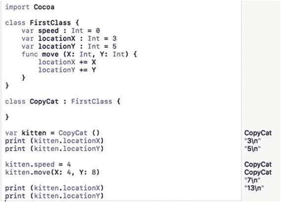

**图 14-1.** 展示继承的工作原理

注意

某些编程语言（如 C++）允许一个类从两个或多个类继承，这称为多重继承。然而在 Swift 中，一个类只能从一个其他类继承，这称为单继承。

在上述示例中，`CopyCat` 类从 `FirstClass` 继承了三个属性（`speed`、`locationX` 和 `locationY`）和一个方法（`move`）。由于 `CopyCat` 类没有定义自己的任何属性或方法，`CopyCat` 类基本上与 `FirstClass` 相同。


在实际使用中，一个类完全没有理由原封不动地继承另一个类。更常见的情况是，一个类（称为子类）继承自另一个类（称为超类或父类），然后添加自己额外的属性和方法。

这样一来，子类只需包含这些新属性和方法的代码，同时仍然能够访问超类的所有属性和方法。例如，考虑以下类：

```
class CopyDog : CopyCat {
var name : String = ""
}
```

这个类继承了 `CopyCat` 类的所有代码，并添加了一个名为 `name` 的新属性，该属性可以存储一个字符串。上述定义了 `name` 属性并继承 `CopyCat` 类代码的类定义，等价于以下代码：

```
class CopyDog {
var speed : Int = 0
var locationX : Int = 3
var locationY : Int = 5
func move (X: Int, Y: Int) {
locationX += X
locationY += Y
}
var name : String = ""
}
```

请记住，`CopyCat` 类继承了 `FirstClass` 的所有内容，而 `FirstClass` 定义了 `speed`、`locationX` 和 `locationY` 属性以及 `move` 方法。相比之下，从 `CopyCat` 类继承代码的 `CopyDog` 类要简短得多且更简单。

继承就像一条链式结构。如果类 A 继承自类 B，但类 B 继承自类 C 的所有内容，那么类 A 就同时继承了类 B 和类 C 的所有内容。例如，`CopyDog` 类继承自 `CopyCat` 类的所有内容，而 `CopyCat` 类又继承自 `FirstClass` 的所有内容。这意味着 `CopyDog` 类最终同时继承了 `CopyCat` 类和 `FirstClass` 的所有内容，如图 14-2 所示。

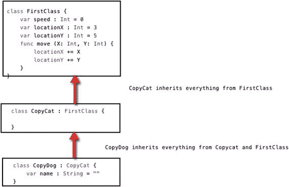

图 14-2. 类继承前面所有类的所有内容

这种继承的链式结构正是 Cocoa 框架的设计方式。在最基础的层级，有一个名为 `NSObject` 的基本类。另一个名为 `NSControl` 的类继承自 `NSObject` 的所有内容，并添加了自己的新属性和方法。当你为用户界面创建一个文本字段时，该文本字段基于一个名为 `NSTextField` 的类，该类继承自 `NSControl` 的所有内容。如果你在对象库中点击一个用户界面对象，Xcode 会列出该用户界面对象基于哪个类，如图 14-3 所示。

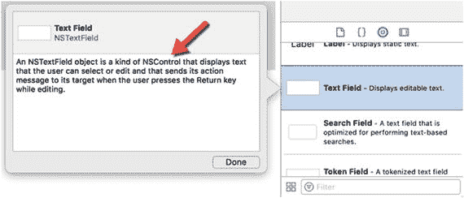

图 14-3. 在对象库中点击一个项目可以识别该用户界面对象的父类

要了解继承如何在多个类之间工作，请按照以下步骤操作：

1. 确保 `IntroductoryPlayground` 文件已在 Xcode 中加载。
2. 将代码编辑如下：

```
    import Cocoa
    class Animal {
    var legs : Int = 0
    }
    class PackAnimal : Animal {
    var strength : Int = 100
    }
    class Biped : PackAnimal {
    var IQ : Int = 75
    }
    var snake = Animal()
    print (snake.legs)
    var mule = PackAnimal()
    mule.legs = 4
    mule.strength = 120
    print (mule.legs)
    print (mule.strength)
    var relative = Biped()
    relative.legs = 2
    relative.strength = 55
    relative.IQ = 10
    print (relative.legs)
    print (relative.strength)
    print (relative.IQ)
```

这段代码创建了三个类：`Animal`（`legs` 属性）、`PackAnimal`（`strength` 属性）和 `Biped`（`IQ` 属性）。然后，它基于这些类创建了三个对象。第一个对象 `snake` 基于 `Animal` 类。第二个对象 `mule` 基于 `PackAnimal` 类。第三个对象 `relative` 基于 `Biped` 类。

最终，`relative` 对象包含来自所有三个类的属性，`mule` 对象只包含来自 `Animal` 和 `PackAnimal` 类的属性，而 `snake` 对象只包含来自 `Animal` 类的属性，如下所示：

| 对象 | 基于以下类 | 包含这些属性 |
| --- | --- | --- |
| snake | Animal | legs |
| mule | PackAnimal、Animal | legs、strength |
| relative | Biped、PackAnimal、Animal | legs、strength、IQ |

`snake`、`mule` 和 `relative` 对象基于它们不同的类以及它们所继承的类，包含不同的属性，如图 14-4 所示。

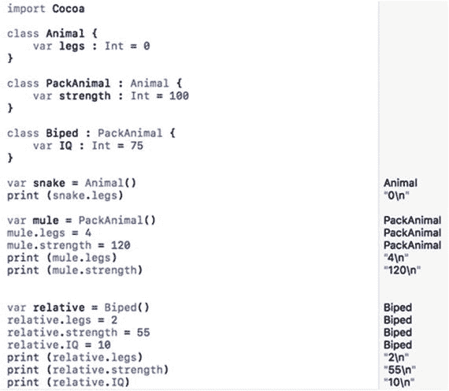

图 14-4. 观察继承如何作用于存储在不同类中的属性

### 理解多态

当一个类（子类）继承自另一个类（超类）时，它包含了超类中存储的所有属性和方法。尽管子类继承了超类的所有属性和方法，但这些属性和方法并不会在子类中显示出来。每个类中出现的代码，都是该类的独特属性和方法。

从另一个类继承的属性会保留相同的名称和数据类型。从另一个类继承的方法会保留相同的方法名称以及使其执行有用功能的代码。

继承方法的一个问题是，你可能想要修改继承方法中的代码。例如，假设你有一个视频游戏，其中有狗在地上跑，鸟在天上飞。你可以创建一个像这样的基本类：

```
class GameObject {
var speed : Int = 0
var locationX : Int = 3
var locationY : Int = 3
func move (X: Int, Y: Int) {
locationX += X + speed
locationY += Y + speed
}
}
var dog = GameObject()
```

现在，从 `GameObject` 类创建的 `dog` 对象有三个属性（`speed`、`locationX` 和 `locationY`）和一个方法（`move`），该方法会更改 `locationX` 和 `locationY` 属性。

狗只能在地上跑，但鸟可以在二维空间中移动，因此它需要一个额外的 `height` 属性。要移动一个飞行对象，`move` 方法需要更改 `height` 属性。这意味着 `move` 方法需要有所不同。

解决这个问题的一个笨拙方法是给 move 方法起一个不同的名称，例如将其名称从 “move” 改为 “fly”：

```
class FlyingObject : GameObject {
var height : Int = 0
func fly (X: Int, Y: Int) {
locationX += X + speed
locationY += Y + speed
height += (X + Y) / 2
}
}
var bird = FlyingObject()
```

这种解决方案的问题是，从 `FlyingObject` 类创建的 `bird` 对象现在有两个方法：从 `GameObject` 继承的 `move` 方法，以及在 `FlyingObject` 中定义的新 `fly` 方法。

你可以简单地忽略 `move` 方法并使用 `fly` 方法，但这存在风险：如果你不小心使用了 `move` 方法来改变鸟的位置，而不是使用正确的、能在二维空间中移动鸟的 `fly` 方法，就可能导致错误。

这就是多态存在的原因。多态基本上允许你重用方法名称（例如 `move`），但用完全不同的代码替换它以实现功能。为了标识你正在使用多态来重用方法名称但修改其代码，必须在你要更改的方法前面使用 `override` 关键字，例如：

```
override func move (X: Int, Y: Int) {
locationX += X + speed
locationY += Y + speed
height += (X + Y) / 2
}
```

当你覆盖一个方法（使用多态）时，你实际上拥有了两个名称相同的方法，但一个版本定义在一个类中，第二个版本定义在另一个类中。计算机永远不会混淆，因为你只能通过指定对象名称和方法名称来运行每个方法。尽管方法名称相同，但对象名称是不同的。

要了解多态如何工作，请按照以下步骤操作：

1. 确保你的 `IntroductoryPlayground` 文件已加载到 Xcode 中。
2. 将代码编辑如下：


```swift
import Cocoa
class GameObject {
    var speed : Int = 0
    var locationX : Int = 3
    var locationY : Int = 3
    func move (X: Int, Y: Int) {
        locationX += X + speed
        locationY += Y + speed
    }
}
var dog = GameObject()
class FlyingObject : GameObject {
    var height : Int = 0
    override func move (X: Int, Y: Int) {
        locationX += X + speed
        locationY += Y + speed
        height += (X + Y) / 2
    }
}
var bird = FlyingObject()
dog.speed = 1
dog.move (X: 4, Y: 7)
bird.speed = 3
bird.move (X: 4, Y: 7)
print (dog.locationX)
print (dog.locationY)
print (dog.speed)
print (bird.locationX)
print (bird.locationY)
print (bird.height)
print (bird.speed)
```

要重写方法，`FlyingObject` 类必须首先继承自另一个类。在这个例子中，`FlyingObject` 继承了 `GameObject`。现在，`FlyingObject` 类可以使用 `override` 关键字来指定它要修改实现 `move` 方法的代码。在这个例子中，唯一的修改是添加了更新 `height` 属性的代码，但你完全可以在重写的 `move` 方法中添加完全不同的代码。

请注意，当你对 `dog` 对象（`dog.move`）执行 `move` 方法时，该方法仅更改 `locationX` 和 `locationY` 的值；但当你对 `bird` 对象（`bird.move`）执行 `move` 方法时，运行的是重写后的方法，它还会修改 `height` 属性，如图 14-5 所示。

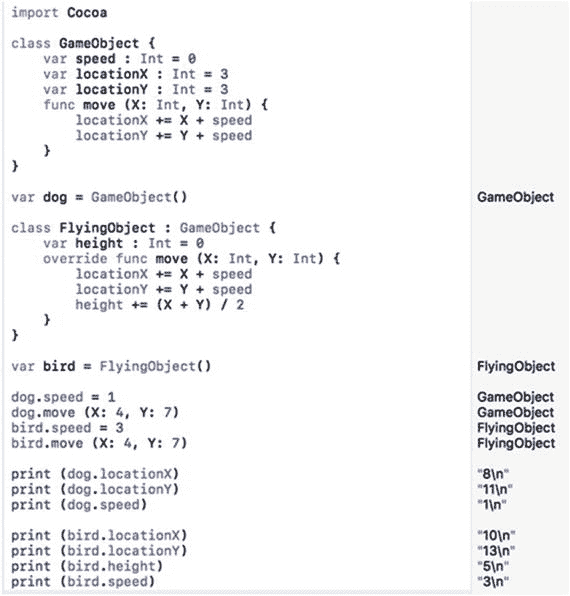

**图 14-5.** 重写的方法可以有不同的行为

重写方法时，你只能更改方法内部的代码。不能更改方法的参数列表。例如，考虑以下类：

```swift
class BasicDesign {
    var location : Int = 0
    func moveMe (X : Int) {
        location += X
    }
}
```

要重写 `moveMe` 方法，下一个类需要继承 `BasicDesign` 类，并且只更改重写方法内部的代码。下面的做法是行不通的：

```swift
class NewDesign : BasicDesign {
    override moveMe (X: Int, Y: Int) { // 无效
    }
}
```

注意，原始的 `moveMe` 方法只有一个参数（`X : Int`），但 `NewDesign` 类中的 `moveMe` 方法有两个参数（`X: Int`，`Y: Int`）。尽管方法名相同，但这个方法的参数列表不同，所以它不会生效。重写方法时，你只能更改代码，不能更改参数列表。

## 重写属性

除了重写方法，Swift 还允许你重写属性。重写属性时，你必须保持相同的属性名和数据类型。你可以更改的是 getter、setter 以及变量的属性观察器。

在最简单的层面上，getter 只是返回一个变量的值。在更复杂的层面上，getter 可以计算出一个值。考虑以下示例：

```swift
class BasicDesign {
    var location: Int {
        get {
            return 4
        }
    }
}
```

这个 `BasicDesign` 类定义了一个名为 `location` 的属性，其 getter 返回 `location` 属性的值 4。要重写这个属性，你需要保留变量名和数据类型（`Int`），但你可以更改 getter 代码，例如：

```swift
class NewDesign : BasicDesign {
    override var location: Int {
        get {
            return 7
        }
    }
}
```

这个 `NewDesign` 类从 `BasicDesign` 类继承了 `location` 属性。然而，它用一个新的 getter 重写了 `location` 属性，该 getter 返回值为 7。

若要查看重写属性的实际效果，请执行以下步骤：

1.  确保你的 `IntroductoryPlayground` 文件已加载到 Xcode 中。
2.  按如下方式编辑代码：

    ```swift
    import Cocoa
    class BasicDesign {
        var location: Int {
            get {
                return 4
            }
        }
    }
    class NewDesign : BasicDesign {
        override var location: Int {
            get {
                return 7
            }
        }
    }
    var ant = BasicDesign()
    var fly = NewDesign()
    ant.location
    fly.location
    ```

在这个例子中，`ant` 对象基于 `BasicDesign` 类，该类将 `location` 属性定义为值为 4。`fly` 对象基于 `NewDesign` 类，该类继承了 `location` 属性。然而，`NewDesign` 类重写了 `location` 属性的 getter 代码，因此 `location` 属性中存储的值不再是 4，而是 7，如图 14-6 所示。

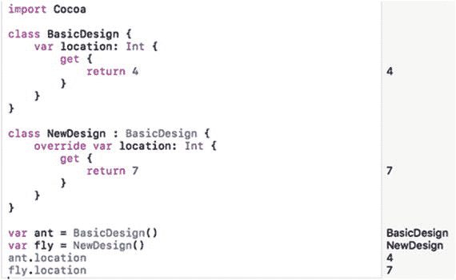

**图 14-6.** 使用新的 getter 代码重写属性

请记住，重写方法和属性时，你只能更改：

- 方法中的代码
- 属性的 getter/setter 或属性观察器中的代码

你永远不能更改：

- 方法名
- 方法的参数列表
- 属性名
- 属性数据类型

## 防止多态

在某些情况下，你可能希望防止某个方法、属性甚至整个类被多态修改。要实现这一点，你只需插入 `final` 关键字。如果你想防止整个类被继承，只需将 `final` 关键字放在类名前面，如下所示：

```swift
final class ClassName {
    var propertyName = initialValue
    func methodName() {
    }
}
```

> **注意：** 如果将 `final` 放在类名前面，它会自动阻止该类的属性和方法被重写，因此你无需在每个属性或方法名前放置 `final`。

如果你只想阻止某个特定的属性或方法被重写，只需将 `final` 关键字放在该属性或方法前面，如下所示：

```swift
class ClassName {
    final var propertyName = initialValue
    func methodName() {
    }
}
```

上例中的 `final` 关键字阻止了属性被重写，同时允许方法被重写。如果你希望允许属性被重写而阻止方法被重写，则将 `final` 关键字放在方法前面，如下所示：

```swift
class ClassName {
    var propertyName = initialValue
    final func methodName() {
    }
}
```


## 使用扩展

如果某个类包含你需要的属性和方法，面向对象的方法是继承该类（创建子类）。不断创建子类的问题在于，从略有不同的类文件中创建对象可能会变得很麻烦。

当你想要扩展属于 Cocoa 框架的类功能时尤其如此。例如，如果你正在处理 `String` 数据类型，你可能不想创建 `String` 数据类型的子类，然后基于这个新的子类创建对象。理想情况下，你希望继续使用 `String` 数据类型，但同时也增加一些功能。

这就是 Swift 提供扩展的原因。扩展本质上允许你向现有类添加代码，而无需创建子类。这样你仍然可以使用原始类，同时无需通过继承、多态或子类就能为该类添加新功能。扩展的结构如下所示：

```
extension ClassName {
}
```

扩展除了可以定义方法，还可以定义包含如下代码的属性：

- 获取器和设置器
- 构造器
- 属性观察器

虽然扩展无需继承就能向类添加新的属性和方法，但扩展不能覆盖类中已有的方法或属性。扩展也不能创建被赋予初始值的属性，例如：

```
var temperature : Int = 100    // 不能在扩展中使用
```

要了解扩展如何向类添加属性和方法，请按照以下步骤创建一个新的 playground：

1.  确保你的 `IntroductoryPlayground` 文件已加载到 Xcode 中。
2.  按如下所示编辑代码：

```
import Cocoa
class EmptyClass {
}
extension EmptyClass {
var age : Int {
get {
return 50
}
}
func retire (testAge : Int) -> String {
if testAge < 62 {
return "Keep working"
} else {
return "Time to retire"
}
}
}
var aWorker = EmptyClass ()
aWorker.retire(testAge: 65)
aWorker.age
```

这段代码创建了一个完全空的类，然后创建了一个扩展，向这个空类添加了一个 `age` 属性和一个 `retire` 方法。最后，它从这个空类创建了一个对象，调用了 `retire` 方法（在扩展中定义的），并显示了存储在 `age` 属性中的值，如图 14-7 所示。

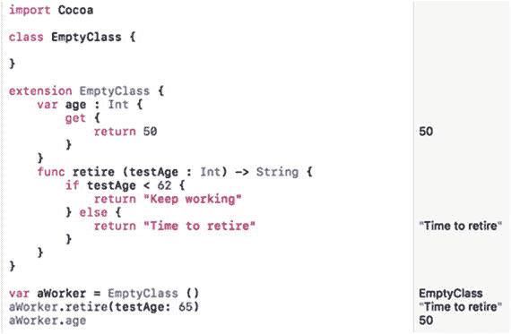

图 14-7. 使用扩展向空类添加属性和方法

你可以看到这个类本身什么也没做，但通过扩展，这个类现在拥有了它之前没有的新功能。

## 使用协议

在本章的开头，你第一次接触到了出现在 `AppDelegate.swift` 类文件中的内容，这个文件是你为了学习每章基本原理而创建的。这个 `AppDelegate` 类的声明如下所示：

```
class AppDelegate: NSObject, NSApplicationDelegate {
```

这行代码创建了一个名为 `AppDelegate` 的类，它继承了 Cocoa 框架中 `NSObject` 类的属性和方法。然而，`NSApplicationDelegate` 是另一个用于扩展类而无需通过继承或子类的文件名。

`NSApplicationDelegate` 文件是一个协议文件。上面的 Swift 代码创建了一个名为 `AppDelegate` 的类，它继承了 `NSObject` 类的属性和方法，同时也继承了 `NSApplicationDelegate` 文件中的代码。（你可以通过在 Xcode 文档窗口中查看，来了解关于 `NSApplicationDelegate` 协议的更多细节。）

类（例如 `NSObject`）和协议（例如 `NSApplicationDelegate`）之间的主要区别在于，类定义了属性和方法，而协议只定义了属性和方法的名称，没有任何实际实现它们的代码。协议有时被称为空类，因为它从不定义任何实际使功能生效的 Swift 代码。

协议定义了一组用于解决特定类型问题的属性和方法名称。现在，由采用或遵循此协议的类来提供实现每个方法或属性声明的实际 Swift 代码。

协议声明看起来与类或结构体声明相同。唯一的区别是协议声明使用 `protocol` 关键字：

```
protocol ProtocolName {
}
```

在这个协议声明中，你可以定义属性和方法而不实现任何 Swift 代码，如下所示：

```
protocol ProtocolName {
var property1 : datatype { get }        // 只读
var property2 : datatype { get set }    // 读写
func methodName (parameters) -> datatype
}
```

当协议定义了属性或方法时，任何采用该协议的类都必须完全按照协议中的定义来实现该属性或方法。在上面的例子中，`property1` 被定义为拥有一个获取器，`property2` 被定义为拥有一个获取器和一个设置器。

这意味着当一个类实现这两个属性时，它必须只为 `property1` 定义一个获取器，而为 `property2` 定义获取器和设置器两者。

类似地，协议中定义的方法在被类文件采用时必须是精确的。这意味着如果方法在协议中定义为带有两个整数参数，那么该方法的实现也必须带有完全相同的两个整数参数。

协议通常用于处理常见的用户界面元素，这些元素需要特定类型的方法来操作它们，但又不能精确定义如何操作它们，因为数据可能因程序而异。

例如，表格视图是一种以行列表形式显示数据的用户界面元素。表格视图需要知道要容纳多少行数据以及每行显示什么类型的数据。由于每个表格视图都需要知道这些信息，因此创建标准方法来执行此操作是合理的，但由于每个表格视图需要包含不同的信息，因此避免编写实际的 Swift 代码来填充表格视图数据也是合理的。

任何包含表格视图的程序都可以利用存储在协议中的预定义方法名来操作数据。你只需要添加 Swift 代码来用数据填充表格视图。


通过使用协议，你可以用相同的方法名在不同程序中操作表格视图。如果没有表格视图协议，你就只能自己创建用于在表格视图中添加和显示数据的方法名。因此，Cocoa 框架通常使用协议来提供一套一致的方法列表，用于执行常见任务。

要了解协议的工作原理，请遵循以下步骤：

1. 确保`IntroductoryPlayground`文件已加载到 Xcode 中。
2. 按如下方式编辑代码：

```
import Cocoa
protocol TestMe {
    var cash : Int { get }
    var creditCheck : Int { get set }
    func purchase (price : Int) -> String
}
class WindowShopper : TestMe {
    var tempValue : Int = 0
    var cash : Int = 0
    var creditCheck : Int {
        get {
            return tempValue
        }
        set (newValue) {
            tempValue = newValue
            cash -= 10
        }
    }
    func purchase (price : Int) -> String {
        cash -= price
        return "Bought something!"
    }
}
var shopper = WindowShopper ()
shopper.cash = 450
shopper.purchase (price: 129)
shopper.cash
```

注意，`TestMe`协议定义了两个属性和一个方法。`cash`属性仅定义了 getter。`creditCheck`属性同时定义了 getter 和 setter。`purchase`方法仅列出了其参数（`price`为整数）及其返回值（类型为`String`）。请注意，该协议实际上并没有实现任何必要的 Swift 代码。

当创建`WindowShopper`类时，它采用或遵守了`TestMe`协议。这意味着它必须提供 Swift 代码来定义`cash`属性的 getter，以及`creditCheck`属性的 getter 和 setter。它还需要为`purchase`方法实现 Swift 代码。

如果你未能为`TestMe`协议中定义的所有属性和方法编写 Swift 代码，Xcode 会报错，提示`WindowShopper`类未能遵守协议。在采用协议时，请确保实现了所有必要的属性和方法。

运行上述代码会显示如图 14-8 所示的结果。

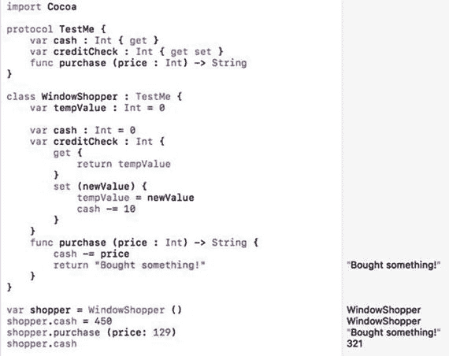

图 14-8.

遵守协议的类

### 在协议中定义可选方法和属性

当你创建一个协议时，你定义的每个属性和方法都必须被采用该协议的类实现。然而，你也可以将一个或多个属性和方法设为可选，以便它们可以被忽略。要定义可选的属性或方法，你需要使用`@objc`关键字标识该协议，并使用`optional`关键字标识各个属性或方法，例如：

```
@objc protocol ProtocolName {
    var requiredProperty : dataType { get }
    @objc optional var optionalProperty : dataType { get }
    @objc optional func optionalMethod ()
}
```

要采用或遵守此协议，类只需要实现未被`optional`关键字标识的任何属性或方法。要实现必需的属性或方法，你需要使用`@objc`关键字标识它们，例如：

```
class ClassName : ProtocolName {
    @objc var requiredProperty : dataType = initialValue
}
```

然而，如果你想要实现一个可选的属性或方法，你可以省略`@objc`关键字，像这样：

```
class ClassName : ProtocolName {
    @objc var requiredProperty : dataType = initialValue
    var optionalProperty : dataType = initialValue
}
```

要了解如何在协议中创建可选的属性和方法，请遵循以下步骤：

1. 确保`IntroductoryPlayground`文件已加载到 Xcode 中。
2. 按如下方式编辑代码：

```
import Cocoa
@objc protocol Person {
    var name : String { get }
    @objc optional var age : Int { get }
    @objc optional func move (X: Int) -> Int
}
class Politician : Person {
    @objc var name : String = ""
}
var candidate = Politician ()
candidate.name = "John Doe"
```

注意，上面定义的`Person`协议中唯一必需的项目是`name`属性。这就是为什么`Politician`类只需要实现`name`属性，但它必须使用`@objc`关键字标识它。

尝试将不同的属性和方法设为可选，以便观察它们如何影响你在类中的实现方式。

### 将继承与协议一起使用

协议甚至可以从其他协议继承属性和方法。这使得一个协议可以从多个协议继承属性和方法。此时，一个类必须采用或遵守所有协议中定义的所有属性和方法。

要了解如何从多个协议继承属性和方法，请遵循以下步骤：

1. 确保`IntroductoryPlayground`文件已加载到 Xcode 中。
2. 按如下方式编辑代码：

```
import Cocoa
protocol First {
    var name : String { get }
}
protocol Second {
    var ID : Int { get }
}
protocol Third: First, Second {
    var email : String { get }
}
class InheritProtocols : Third {
    var name : String = ""
    var ID : Int = 0
    var email : String = ""
}
var friend = InheritProtocols()
friend.name = "Cindy Smith"
friend.ID = 12
friend.email = cindysmith@isp.com
print (friend.name)
print (friend.ID)
print (friend.email)
```

在这个例子中，`name`、`ID`和`email`属性在三个不同的协议中被定义。第三个协议继承了第一个和第二个协议。

现在，当一个类采用最后一个协议时，它必须实现在所有协议中存储的属性和方法。尽管`name`、`ID`和`email`属性都是在不同的协议中声明的，但`InheritProtocols`类可以访问它们全部，如图 14-9 所示。

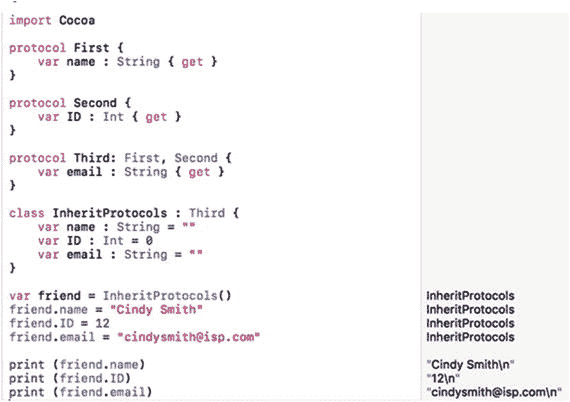

图 14-9.

从多个协议继承属性和方法


## 使用委托

协议与委托密切相关。委托的核心思想是让一个类将责任移交给另一个类中存储的代码。因此，与其创建新的子类来添加新功能，不如使用一个包含额外功能的委托。

使用委托的一种常见方式是让视图（用户界面）与控制器进行通信。通常，控制器通过 `IBOutlet` 与视图通信，这使得控制器能够在用户界面上显示数据或从用户界面检索数据。

然而，视图也可以通过协议与控制器进行通信。协议文件定义了方法，并将实现这些方法的责任委托给控制器。控制器实现的最常见方法类型包括名称中包含 "will"、"should" 和 "did" 的方法，例如 `applicationDidFinishLaunching` 或 `applicationWillTerminate`。

图 14-10 展示了控制器如何通过 `IBOutlet` 与视图通信，视图如何通过协议与控制器通信。

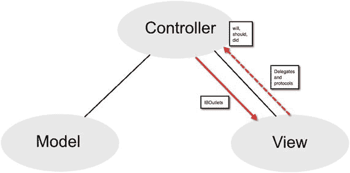

图 14-10. 视图可以通过协议与控制器通信。

要了解视图如何使用委托与控制器通信，请按照以下步骤操作：

1. 在 Xcode 中选择“文件” ➤ “新建” ➤ “项目”。
2. 在 macOS 类别下点击“应用程序”。
3. 点击“Cocoa 应用程序”，然后点击“下一步”按钮。Xcode 会要求输入产品名称。
4. 点击“产品名称”文本字段，输入 `DelegateProgram`。
5. 确保“语言”弹出菜单显示为 Swift，并且未选中任何复选框。
6. 点击“下一步”按钮。Xcode 会询问项目存储位置。
7. 选择一个文件夹来存储项目，然后点击“创建”按钮。
8. 在项目导航器中点击 `AppDelegate.swift` 文件。`AppDelegate.swift` 文件的内容会显示在 Xcode 窗口的中间区域。找到以下代码行：
   ```
   class AppDelegate: NSObject, NSApplicationDelegate {
   ```
   这行代码定义了一个名为 `AppDelegate` 的类，它继承了 `NSObject` 类的属性和方法。此外，它还采用了 `NSApplicationDelegate` 文件定义的所有属性和方法。
9. 按住 Option 键，将鼠标悬停在 `NSObject` 上。当鼠标指针变成问号时，点击 `NSObject` 会弹出一个窗口，如图 14-11 所示。
   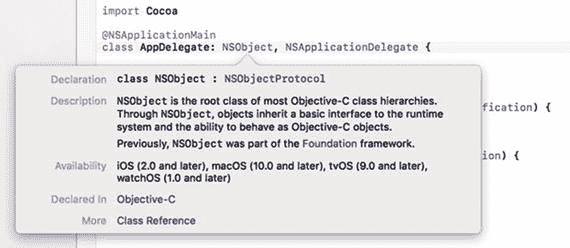
   图 14-11. 按住 Option 键点击类名会显示该类的信息
10. 松开 Option 键，点击弹出窗口底部的“类参考”超链接。文档窗口会打开，显示 `NSObject` 类中可用的不同属性和方法的详细信息，如图 14-12 所示。所有这些属性和方法在你的 `AppDelegate` 类中也可用。
    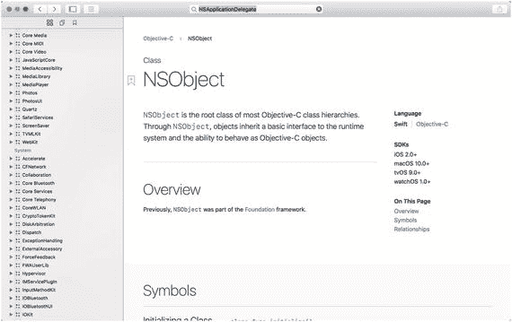
    图 14-12. 文档窗口显示关于 `NSObject` 类的信息
11. 点击文档窗口左上角的关闭按钮（红点）以关闭它。
12. 按住 Option 键，将鼠标悬停在 `NSApplicationDelegate` 上。当鼠标指针变成问号时，点击 `NSApplicationDelegate` 会弹出一个窗口，如图 14-13 所示。
    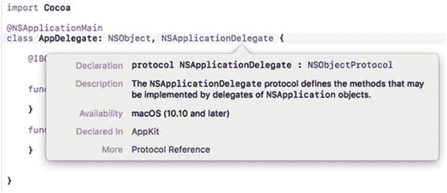
    图 14-13. 按住 Option 键点击会显示关于 `NSApplication` 协议的信息
13. 松开 Option 键，点击弹出窗口底部的“协议参考”超链接。文档窗口会打开，显示 `NSApplicationDelegate` 协议的详细信息，如图 14-14 所示。注意 `NSApplicationDelegate` 协议定义了两个方法，分别叫做 `applicationDidFinishLaunching` 和 `applicationWillTerminate`。
    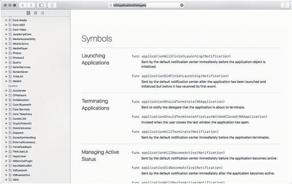
    图 14-14. 在文档窗口中查看 `NSApplicationDelegate` 协议
14. 点击文档窗口左上角的关闭按钮（红点）以关闭它。Xcode 窗口再次出现。注意 `AppDelegate.swift` 文件包含两个空函数，分别名为 `applicationDidFinishLaunching` 和 `applicationWillTerminate`。这些函数由 `NSApplicationDelegate` 协议文件定义，但在 `AppDelegate.swift` 文件中实现。
15. 将这两个函数修改如下：
    ```
    func applicationDidFinishLaunching(aNotification: NSNotification) {
    print ("这行文字应该会在程序运行后打印")
    }
    func applicationWillTerminate(aNotification: NSNotification) {
    print ("这行文字应该会在程序停止前打印")
    }
    ```
16. 选择“产品” ➤ “运行”。Xcode 会运行你的 `DelegateProgram` 项目并显示一个空白的用户界面。
17. 选择“DelegateProgram” ➤ “退出 DelegateProgram”。Xcode 窗口会出现。
18. 选择“视图” ➤ “调试区域” ➤ “显示调试区域”。调试区域出现在 Xcode 窗口底部，并显示两个 `print` 命令打印的文本。注意，`applicationDidFinishLaunching` 函数中的 print 命令首先运行，如图 14-15 所示。
    
    图 14-15. `NSApplicationDelegate` 文件定义的方法会告知程序用户界面的状态


## 在 macOS 程序中使用继承

继承允许你创建在两个类之间底层代码变化时保持相同的方法名。在下面的示例程序中，你将定义一个类，然后为第二个类继承其属性和方法。第二个类还将重写一个方法，并添加代码使该重写方法的行为略有不同。

要创建展示继承工作原理的示例程序，请按以下步骤操作：

1. 在 Xcode 中选择 **文件** ➤ **新建** ➤ **项目**。
2. 在 macOS 类别下点击 **应用程序**。
3. 点击 **Cocoa 应用程序**，然后点击 **下一步** 按钮。Xcode 现在会要求你输入产品名称。
4. 点击 **产品名称** 文本字段，输入 `InheritProgram`。
5. 确保 **语言** 弹出菜单显示为 **Swift**，且未选中任何复选框。
6. 点击 **下一步** 按钮。Xcode 会询问你希望将项目存储在何处。
7. 选择一个文件夹存储项目，点击 **创建** 按钮。
8. 在项目导航器中点击 `MainMenu.xib` 文件。
9. 点击 **窗口** 图标，使用户界面窗口显示出来。
10. 选择 **视图** ➤ **工具** ➤ **显示对象库**，使对象库显示在 Xcode 窗口的右下角。
11. 在用户界面上拖放一个按钮和两个标签，然后双击按钮和标签以更改上面显示的文本，使其看起来类似于图 14-16。

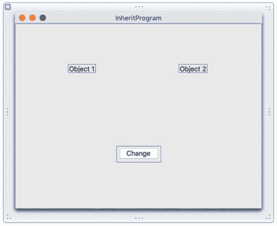

**图 14-16.** `InheritProgram` 的用户界面

该用户界面显示了代表两个不同对象的标签。`Object 1` 只包含一个属性和一个修改该属性的方法。`Object 2` 继承自 `Object 1`，包含一个额外的属性，并重写了在 `Object 1` 中定义的方法。

当你点击 **更改** 按钮时，两个标签都会根据每个对象定义的属性和方法更改其外观。要将用户界面连接到 Swift 代码，请按以下步骤操作：

1. 在 Xcode 窗口中保持用户界面可见，选择 **视图** ➤ **助理编辑器** ➤ **显示助理编辑器**。`AppDelegate.swift` 文件会出现在用户界面旁边。
2. 将鼠标移到 **更改** 按钮上，按住 **Control** 键，拖拽到 `AppDelegate.swift` 文件底部最后一个花括号的上方。
3. 松开鼠标和 **Control** 键。会弹出一个窗口。
4. 点击 **连接** 弹出菜单，选择 **操作**。
5. 点击 **名称** 文本字段，输入 `changeButton`。
6. 点击 **类型** 弹出菜单，选择 `NSButton`。然后点击 **连接** 按钮。Xcode 会创建一个名为 `changeButton` 的空 `IBAction` 方法。
7. 将鼠标移到 `Object 1` 标签上，按住 **Control** 键，拖拽到 `AppDelegate.swift` 文件中 `@IBOutlet` 行的下方。
8. 松开鼠标和 **Control** 键。会弹出一个窗口。
9. 点击 **名称** 文本字段，输入 `ObjectOne`，然后点击 **连接** 按钮。
10. 将鼠标移到 `Object 2` 标签上，按住 **Control** 键，拖拽到 `AppDelegate.swift` 文件中 `@IBOutlet` 行的下方。
11. 松开鼠标和 **Control** 键。会弹出一个窗口。
12. 点击 **名称** 文本字段，输入 `ObjectTwo`，然后点击 **连接** 按钮。现在你应该拥有以下表示用户界面上所有标签的 `IBOutlet`：

```
@IBOutlet weak var window: NSWindow!
@IBOutlet weak var ObjectOne: NSTextField!
@IBOutlet weak var ObjectTwo: NSTextField!
```

13. 直接在 `IBOutlet` 代码行下方输入以下内容：

```
class One {
    var myColor : NSColor = NSColor.black
    func change () {
        myColor = NSColor.red
    }
}
class Two : One {
    var myBackground : NSColor = NSColor.white
    override func change() {
        myColor = NSColor.blue
        myBackground = NSColor.green
    }
}
var ThingOne = One()
var ThingTwo = Two()
```

14. 按如下方式修改 `IBAction` `changeButton` 方法：

```
@IBAction func changeButton(_ sender: NSButton) {
    ThingOne.change()
    ThingTwo.change()
    ObjectOne.textColor = ThingOne.myColor
    ObjectTwo.textColor = ThingTwo.myColor
    ObjectTwo.drawsBackground = true
    ObjectTwo.backgroundColor = ThingTwo.myBackground
}
```

这个 `IBAction` 方法对 `ThingOne` 和 `ThingTwo` 对象（分别基于 `One` 和 `Two` 类）都运行了 `change()` 方法。`Two` 类继承自 `One` 类，但重写了 `change()` 方法以额外修改一个名为 `myBackground` 的属性。

在 `ThingOne` 和 `ThingTwo` 都更改其属性后，第一个标签（由 `ObjectOne` 表示）将其文本颜色设置为 `ThingOne` 对象中的 `myColor` 属性。第二个标签（由 `ObjectTwo` 表示）更改了其 `myColor` 和 `myBackground` 属性，因此将这些属性设置到标签上。

`AppDelegate.swift` 文件的完整内容应如下所示：

```
import Cocoa
@NSApplicationMain
class AppDelegate: NSObject, NSApplicationDelegate {
    @IBOutlet weak var window: NSWindow!
    @IBOutlet weak var ObjectOne: NSTextField!
    @IBOutlet weak var ObjectTwo: NSTextField!
    
    class One {
        var myColor : NSColor = NSColor.black
        func change () {
            myColor = NSColor.red
        }
    }
    class Two : One {
        var myBackground : NSColor = NSColor.white
        override func change() {
            myColor = NSColor.blue
            myBackground = NSColor.green
        }
    }
    var ThingOne = One()
    var ThingTwo = Two()
    
    func applicationDidFinishLaunching(_ aNotification: Notification) {
        // 在此处插入代码以初始化应用程序
    }
    func applicationWillTerminate(_ aNotification: Notification) {
        // 在此处插入代码以拆除应用程序
    }
    
    @IBAction func changeButton(_ sender: NSButton) {
        ThingOne.change()
        ThingTwo.change()
        ObjectOne.textColor = ThingOne.myColor
        ObjectTwo.textColor = ThingTwo.myColor
        ObjectTwo.drawsBackground = true
        ObjectTwo.backgroundColor = ThingTwo.myBackground
    }
}
```

要查看此程序的工作原理，请按以下步骤操作：

1. 选择 **产品** ➤ **运行**。Xcode 会运行你的 `InheritProgram` 项目。注意两个标签看起来完全相同。
2. 点击 **更改** 按钮。`Object 1` 标签仅更改其文本颜色，因为它代表了一个只有一个属性（`myColor`）的类。`Object 2` 标签同时更改其文本颜色和背景颜色，因为它有两个属性（`myColor` 和 `myBackground`），如图 14-17 所示。尽管两个类中的 `change()` 方法名称完全相同，但它在第二个类中被重写以修改 `myBackground` 属性。

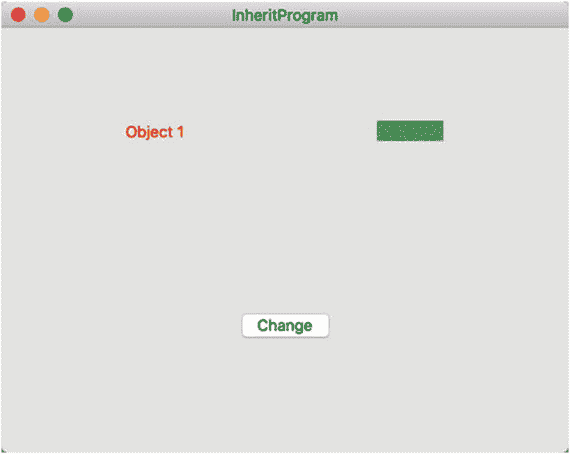

**图 14-17.** 点击 **更改** 按钮会使用相同的方法名修改两个不同的对象

3. 选择 **InheritProgram** ➤ **退出 InheritProgram**。


### 摘要

类（Class）让你可以将相关的代码组织在一起，使数据（属性）和操作这些数据的函数（方法）存储在同一个地方。扩展类功能最直接的方式是通过继承（inheritance）来创建子类（subclass）。

继承允许你继承另一个类的所有属性和方法。一个类只能继承自另一个类，但这个被继承的类也可以继承自其他类，从而形成一个类之间相互继承的链条（daisy-chain）效应。Cocoa 框架正是基于这种类的链条式继承思想构建的。

要阻止继承，可以使用 `final` 关键字。当你重写某个属性或方法时，需要使用 `override` 关键字。

除了继承，你还可以通过扩展（extensions）和协议（protocols）来扩展类的功能。协议在 Cocoa 框架中常被用来扩展类的功能。通过继承、扩展和协议，你可以扩展任何类的功能，从而轻松复用现有代码。

