# 15. 创建用户界面

虽然可以创建完全不与用户交互的程序（例如控制交通灯的程序），但更常见的是创建显示某种用户界面的程序。通常，这意味着显示一个包含各种不同项目的窗口，例如用于显示文本的标签（label）、允许用户输入内容的文本字段（text field），以及让用户控制程序的按钮或下拉菜单（pull-down menu）。

创建有效的用户界面完全取决于程序的目的。商业程序通常遵循带有下拉菜单和按钮的标准惯例，而视频游戏则可能创建自定义界面，看起来与标准的 macOS 程序完全不同。归根结底，用户界面需要满足用户的需求。如果在遵循标准的用户界面设计惯例和让用户界面更易于使用之间做选择，请始终以用户为中心。

为了帮助你更好地理解用户界面设计，Apple 提供了一份名为《macOS 人机界面指南》（The macOS Human Interface Guidelines）的免费文档。该文档简要概述了如何让典型的 macOS 用户界面高效工作，并特别强调了利用 macOS 最新特性。遵循这些指南，你的 macOS 程序将显得现代且与时俱进。如果未能利用 macOS 的最新特性，即使你的程序是全新的，也可能看起来过时。

在前面的章节中，你使用 Xcode 设计了简单的用户界面。在本章中，你将更深入地了解 Xcode 中专注于帮助你设计用户界面的不同部分。

请记住，用户界面不存在“完美”的设计。所谓“完美”的用户界面，是能让任务尽量简单、省力，以至于用户甚至没有意识到自己在与任何用户界面进行交互。用户界面充当了你与程序之间的中间人或翻译者。任何用户界面的目标都是让用户感觉他们正在直接与程序进行沟通和操作。

## 理解用户界面文件

Cocoa 框架定义了用于创建各种用户界面项目的类，从按钮（`NSButton` 类）、文本字段（`NSTextField`）到滑块（`NSSlider`）或日期选择器（`NSDatePicker`）。理论上，完全可以使用 Swift 代码来创建整个用户界面。但这样做可能很繁琐，因为除非实际运行程序，否则无法看到用户界面的样子。这就好比试图通过描述画笔需要精确放在画布的哪个位置，以及手移动的具体角度和方向来画一幅画，显得非常笨拙。

Xcode 并没有强迫你编写 Swift 代码来定义用户界面，而是提供了一个名为 Interface Builder 的功能。Interface Builder 的设计理念是，你可以通过将项目拖放到窗口中来设计用户界面。

通过拖放项目来创建用户界面的优点是，你可以实时看到用户界面的样子，从而快速进行调整和修改。此外，通过将用户界面的设计与 Swift 代码分离，你现在可以在不影响 Swift 代码的情况下更改用户界面，反之亦然。

在过去，程序员必须通过编写代码来创建用户界面时，修改用户界面代码可能会影响程序运行的核心代码（反之亦然）。因此，修改程序的速度很慢，因为你需要不断测试以确保你的更改不会影响程序的其他部分。

通过将用户界面与 Swift 代码隔离，Xcode 让你能够比以前更快地创建可靠的程序。现在，你可以替换一个用户界面并换上另一个，而不影响代码；或者修改代码而不影响用户界面。

Xcode 为你提供了两种存储用户界面的选择：

*   存储在 `.xib` 文件中
*   存储在 `.storyboard` 文件中

一个 `.xib` 文件（代表 Xcode Interface Builder）通常包含用户界面的单个窗口或视图。一个简单的程序可能只需一个 `.xib` 文件来存储其用户界面，但更复杂的程序可能需要多个 `.xib` 文件来存储不同的窗口。

一个 `.storyboard` 文件由一个或多个视图（view）和转场（segue，即视图之间的过渡）组成，其中视图通常代表屏幕上出现的窗口，而转场定义了从一个视图到下一个视图的过渡。

实际上，你可以将 `.xib` 和 `.storyboard` 文件组合在同一个项目中，来创建程序的用户界面。由于 `.storyboard` 文件常用于创建 iOS 应用，现在它也越来越多地被用于创建 macOS 用户界面。（第 16 章会进一步介绍故事板（storyboards）和转场（segues）。）

用户界面的基本组件是视图（view），它在屏幕上显示信息。一个视图可以是一个完整的窗口，也可以只是一个能够显示信息的方框，例如表格、可滚动的文本列表或图片。无论你使用 `.xib` 文件还是 `.storyboard` 文件，用户界面总是由一个或多个包含其他用户界面项目（如按钮和文本字段）的视图组成。

## 搜索对象库

要显示程序的用户界面，需要在项目导航窗格中点击 `.xib` 或 `.storyboard` 文件。选定要修改的用户界面文件后，就可以从对象库（位于 Xcode 窗口右下角）中拖拽项目，并将其放置在用户界面的任意位置。若要查看对象库，请选择“显示”➤“工具”➤“显示对象库”。

搜索对象库有两种方法。一种方法是直接上下滚动，直到找到所需项目。由于对象库列出了所有可用的用户界面项目，滚动浏览可能会显得笨拙且缓慢。

更快的方法是使用对象库窗格底部的搜索字段，如图 15-1 所示。只需输入要使用的用户界面项目名称的一部分，对象库就会过滤掉所有不匹配的项目。

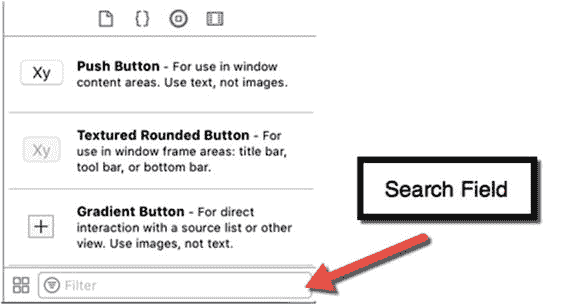

图 15-1. 搜索字段让您能快速在对象库中找到用户界面项目

要学习如何搜索对象库，请遵循以下步骤：

1.  在 Xcode 中选择“文件”➤“新建”➤“项目”。
2.  在 macOS 类别下点击“应用程序”。
3.  点击“Cocoa 应用程序”，然后点击“下一步”按钮。Xcode 现在会要求输入产品名称。
4.  点击“产品名称”文本字段，输入 `UIProgram`。
5.  确保“语言”弹出菜单显示为 Swift，并且没有选中任何复选框。请注意，此时您可以通过选中“使用故事板”复选框来选择使用故事板，如图 15-2 所示。暂时保持“使用故事板”复选框为未选中状态。

    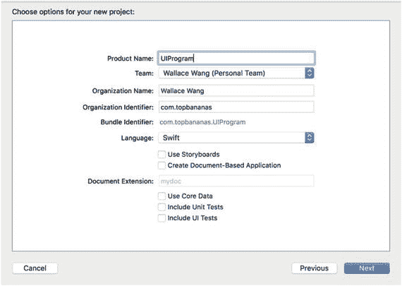

    图 15-2. 创建新项目时，您可以选择为界面使用故事板
6.  点击“下一步”按钮。Xcode 会询问您希望将项目存储在何处。
7.  选择一个文件夹来存储项目，然后点击“创建”按钮。
8.  在项目导航器中点击 `MainMenu.xib` 文件。程序的用户界面将会显示出来。
9.  点击“窗口”图标，如图 15-3 所示，以显示程序用户界面的窗口。

    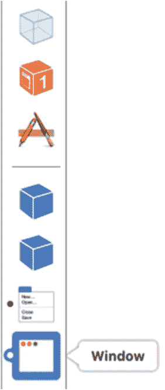

    图 15-3. “窗口”图标代表您的用户界面窗口
10. 点击“窗口”图标，如图 15-3 所示，以显示程序用户界面的窗口。
11. 选择“显示”➤“工具”➤“显示对象库”。对象库会出现在 Xcode 窗口的右下角。
12. 上下滚动浏览对象库。注意您可以添加到用户界面中的不同项目的名称和种类。
13. 点击对象库底部的搜索字段，输入 `text`。请注意，对象库现在只显示名称或描述中包含“text”的项目，如图 15-4 所示。

    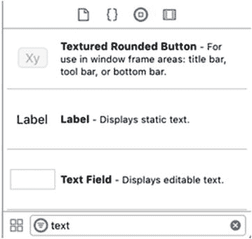

    图 15-4. 在对象库中搜索“text”
14. 点击对象库底部的搜索字段，点击关闭图标（搜索字段最右侧灰色圆圈内的 X）以清空搜索字段。
15. 输入 `button`。请注意，对象库现在只显示名称或描述中包含“button”的项目。如果您知道所需项目的全部或部分名称或用途，那么在对象库中搜索要比在冗长的所有可用用户界面项目列表中滚动浏览快得多。

## 显示和接受文本的用户界面项目

尽管对象库包含大量可放置在用户界面上的可用项目，但大多数项目可以按功能分组归类。请记住，用户界面具有三种功能：

*   向用户显示信息
*   接收用户输入的数据
*   允许用户控制程序

在用户界面上显示信息的最简单方法是通过标签。在 Cocoa 框架中，标签基于 `NSTextField` 类。本质上，标签是一种不可编辑的文本字段。要识别对象库中任何项目的类，只需点击它，就会弹出一个窗口，描述该项目的用途及其基于的类（见图 15-5）。

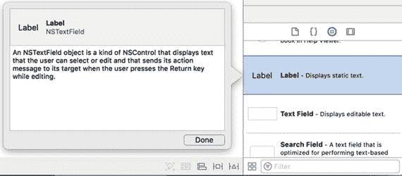

图 15-5. 识别对象库中用户界面项目的类

任何基于 `NSTextField` 的用户界面项目都可用于显示和接受文本，尽管更常见的做法是使用标签来显示文本，并使用其他类型的文本字段让用户输入文本。基于 `NSTextField` 的用户界面项目列表如图 15-6 所示：

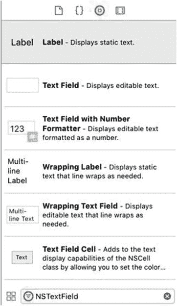

图 15-6. 基于 `NSTextField` 类的用户界面项目

*   标签：显示文本，但不允许用户输入或编辑文本
*   文本字段：允许用户输入和编辑文本
*   带数字格式器的文本字段：允许用户轻松输入和编辑格式化的数字
*   自动换行标签：在多行上显示文本
*   自动换行文本字段：允许用户输入和编辑显示在多行上的文本
*   文本字段单元格：允许您在表格等单元格中以彩色显示文本

## 限制选择的用户界面项目

让用户在文本字段中输入数据提供了最大的灵活性。然而，这种灵活性也意味着您的程序无法知道用户可能输入哪种类型的数据。如果程序期望用户输入年龄的数字，但用户却输入了“forty-nine”，那么程序很可能会崩溃，因为它期望的是数字，但收到的却是单词。

更糟糕的是，程序可能会询问某人的年龄，而用户可能输入一个负数或一个高得离谱的数字（如 239），这显然不可能是某人的年龄。为了确保用户输入正确的数据，您可以使用各种不同的用户界面项目，让用户从一系列有效选项中进行选择。显示文本（包括数字）选项的用户界面项目包括：

*   弹出按钮 (`NSPopUpButton`)：显示一个有效选项的菜单
*   单选组 (`NSButton`)：显示一组单选按钮，一次只能选择一个
*   复选框 (`NSButton`)：显示一个或多个复选框，让用户选择多个选项
*   组合框 (`NSComboBox`)：兼具文本字段和弹出按钮的功能，用户既可以输入文本，也可以从有效选项列表中选择

允许用户选择一系列有效数值选项的用户界面项目包括：

*   日期选取器 (`NSDatePicker`)：让用户选择包含日、月、年的日期
*   水平/垂直/圆形滑块 (`NSSlider`)：让用户移动滑块以选择固定范围内的有效数值
*   步进器 (`NSStepper`)：以固定增量增加或减少数值

对于文本选项，您需要列出用户可以选择的所有有效选项。对于数值选项，您只需列出一个所有有效选项的范围，例如让用户选择 1 到 100 之间的数字。

### 可接收命令的用户界面元素

最常见的用户界面元素是那些能接收命令，以便用户控制程序的元素。其中最常见的两类可接收命令的界面元素是**按钮**和**菜单**。每个按钮或菜单项都代表一条单一命令，因此当用户点击按钮或菜单项时，该命令便会指示程序执行相应操作。

按钮和菜单都允许视图使用一种称为“目标-动作”（target-action）的机制与控制器通信，如图 15-7 所示。目标是触发控制器中某个动作（例如运行一个 `IBAction` 方法）的按钮或菜单项。

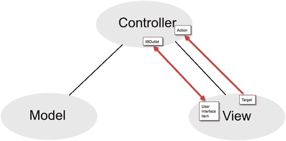

**图 15-7.** 按钮和菜单让视图能够与控制器通信

用户界面按钮基于 `NSButton` 类。菜单项基于 `NSMenuItem` 类。对象库中显示了多种不同类型的按钮和菜单项，但它们的工作原理相同，即按钮或菜单项代表一条命令。要使该命令生效，需要将界面上的按钮连接到 Swift 文件中的 `IBAction` 方法。

### 用于分组元素的用户界面元素

有一类用户界面元素只负责对界面上的其他元素进行分组和组织，例如在相关按钮或文本周围显示一个边框。这些界面元素更具装饰性，因此通常不需要使用 `IBOutlet` 或 `IBAction` 方法将其连接到 Swift 代码。一些用于分组和组织其他界面元素的示例如下：

-   **表格视图** (`NSTableView`)：以行形式显示数据
-   **集合视图** (`NSCollectionView`)：以行和列形式显示数据
-   **盒视图** (`NSBox`)：显示一个在相关元素周围绘制边框的盒子
-   **标签视图** (`NSTabView`)：显示两个或多个标签页，可更改盒子内显示的数据，如图 15-8 所示

    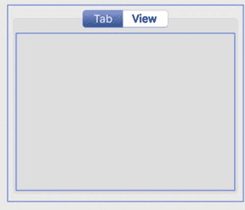

    **图 15-8.** 标签视图可以在同一个盒子内对两组或多组相关元素进行分组。

-   **窗口** (`NSWindow`)：显示一个可容纳其他界面元素的窗口
-   **工具栏** (`NSToolbar`)：显示代表命令的图标

尽管对象库中包含许多其他元素，但它们通常可分为以下四类：

-   显示或接收文本的元素
-   允许用户从有限的合法选项中进行选择的元素
-   允许用户选择命令来控制程序的元素
-   对其它界面元素进行分组或组织的元素

## 在自动布局中使用约束

无论您在界面上放置何种元素，都需要考虑用户调整窗口大小时会发生什么。窗口太大可能会在界面上留下过多空白空间；窗口太小则可能裁剪掉部分元素，如图 15-9 所示。

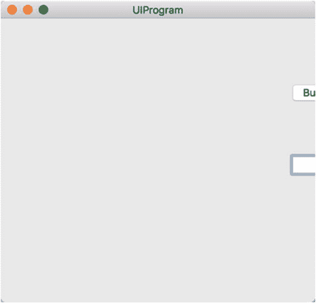

**图 15-9.** 当用户调整窗口大小时，若界面不能自适应，就可能裁剪掉部分元素

有两种方法可以确保用户调整窗口大小时界面仍保持可用。首先，可以为窗口定义最小和最大尺寸，以防止其过度缩小或放大。其次，可以为单个元素设置约束，定义相邻元素之间以及元素与窗口边缘之间的距离。

在大多数情况下，您可以同时使用这两种方法。这样，您既可以为窗口定义最小和最大尺寸，也可以定义界面元素应如何适应窗口大小的变化。

### 定义窗口尺寸

窗口用于在屏幕上显示程序的用户界面。Xcode 允许您为窗口定义以下内容（如图 15-10 所示）：

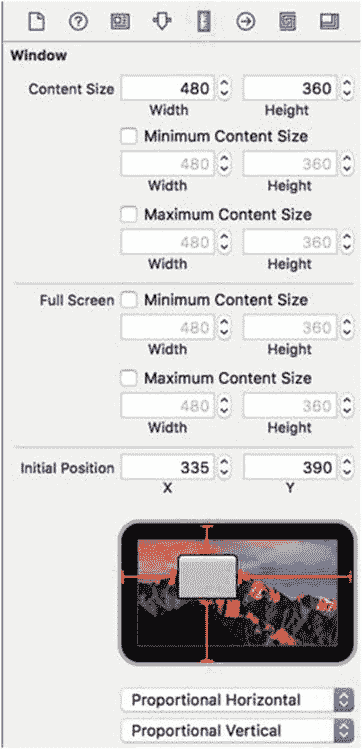

**图 15-10.** 尺寸检查器允许您定义窗口大小

-   窗口的初始尺寸
-   窗口的最小尺寸
-   窗口的最大尺寸
-   窗口在屏幕上的初始位置

要在 Xcode 中定义 `.xib` 文件的窗口尺寸，请按照以下步骤操作：

1.  在项目导航窗格中点击 `.xib` 文件。Xcode 将显示存储在 `.xib` 文件中的用户界面。
2.  如有必要，点击左下角的“隐藏文档大纲”图标，如图 15-11 所示。

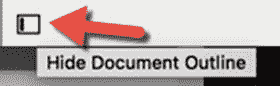

**图 15-11.** “隐藏文档大纲”图标

3.  点击代表您用户界面窗口的底部图标，如图 15-12 所示。

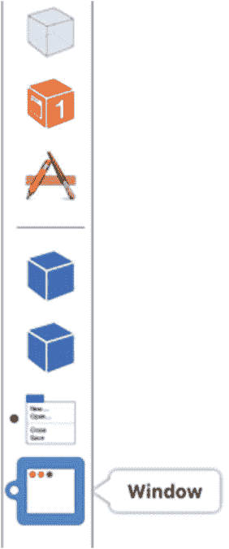

**图 15-12.** 底部图标代表您的用户界面窗口

4.  选择“视图”➤“实用工具”➤“显示尺寸检查器”。尺寸检查器窗格将出现（参见图 15-10）。

存储在 `.storyboard` 文件中的窗口与 `.xib` 文件的处理方式略有不同。创建 macOS 项目时，您可以选择使用 `.xib` 文件或 `.storyboard` 文件。如果您创建的是使用 `.storyboard` 文件的项目，可以通过以下步骤在 Xcode 中定义 `.storyboard` 文件的窗口尺寸：

1.  在项目导航窗格中点击 `.storyboard` 文件。Xcode 将显示存储在 `.storyboard` 文件中的用户界面。
2.  点击要修改窗口的视图控制器，如图 15-13 所示。

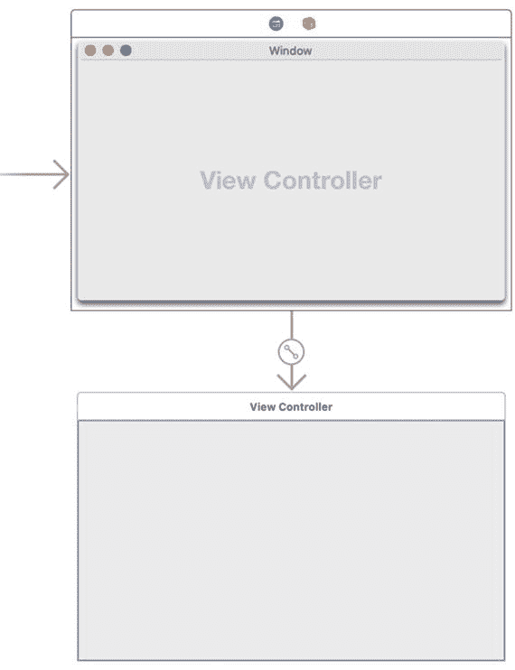

**图 15-13.** 视图控制器定义您的用户界面窗口

3.  选择“视图”➤“实用工具”➤“显示尺寸检查器”。尺寸检查器窗格将出现（参见图 15-10）。

无论您使用 `.xib` 文件还是 `.storyboard` 文件创建用户界面，Xcode 都提供两种更改任何窗口尺寸的方法。首先，您可以使用鼠标拖动窗口（或视图控制器）的边或角。其次，您可以点击“尺寸”标签旁边的“宽度”和“高度”文本框，为窗口的宽度和高度选择精确值，如图 15-14 所示。

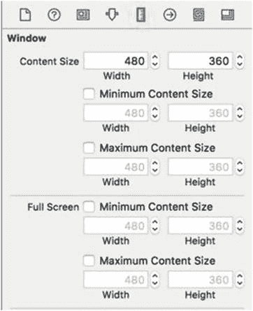

**图 15-14.** 定义窗口的宽度和高度

定义窗口的最小和/或最大尺寸需要两步操作。首先，您需要选中**最小尺寸**和/或**最大尺寸**复选框。其次，您需要输入或选择宽度和高度，以定义窗口的最小或最大尺寸。

最后，您还可以定义窗口首次出现时的初始位置。为此，您可以在模拟屏幕上拖动窗口图标，或者在**初始位置**文本框中输入 X 和 Y 值，如图 15-15 所示。

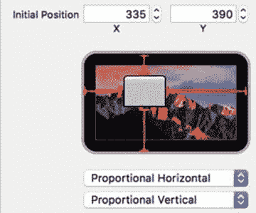

**图 15-15.** 定义窗口的初始位置

模拟屏幕下方的两个弹出菜单允许您定义如何确定窗口的初始位置：

-   **从左侧/右侧固定**：定义窗口边缘与屏幕边缘之间的固定值
-   **水平/垂直比例**：根据屏幕尺寸，定义窗口边缘与屏幕边缘之间的比例值
-   **水平/垂直居中**：定义窗口显示在屏幕中央

### 为用户界面项添加约束

为窗口定义最小尺寸可以防止用户将窗口缩得太小，以致于裁剪掉用户界面上显示的项目。但是，如果用户放大了窗口会发生什么？此时，窗口中的项目理想情况下应调整其位置，以适应放大的窗口尺寸。

约束定义了两个项目之间的距离，例如按钮与窗口边缘之间，或两个按钮之间的距离。Xcode 提供了三种方式来为用户界面项添加约束：

- 从某个用户界面项按住 Control 键拖动鼠标到另一个项目或窗口边缘
- 选择 `Editor ➤ Resolve Auto Layout Issues`（编辑器 ➤ 解决自动布局问题）
- 点击右下角的 `Add New Constraints`（添加新约束）或 `Resolve Auto Layout Issues`（解决自动布局问题）图标，如图 15-16 所示

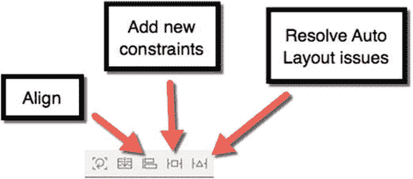

图 15-16. `Align`（对齐）、`Pin`（固定）和 `Resolve Auto Layout Issues`（解决自动布局问题）图标

要使用 Control-拖拽方法添加约束，请遵循以下步骤：

1. 将鼠标指针移动到您想要添加约束的用户界面项上。
2. 按住 `Control` 键，并将鼠标拖向另一个用户界面项或窗口边缘。
3. 当鼠标指针出现在另一个用户界面项或窗口边缘附近时，松开 `Control` 键和鼠标按钮。此时会弹出一个窗口，类似于图 15-17 所示。

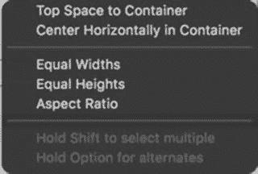

图 15-17. 松开 `Control` 键和鼠标会显示一个弹出窗口

根据您 `Control`-拖拽鼠标的方向，弹出窗口中会显示不同的选项，如表 15-1 所示。

表 15-1. 弹出窗口选项

| 拖拽方向 (至窗口边缘) | 约束选项 |
| --- | --- |
| 向上 | `Top space to container`（到容器顶部间距） |
| 向下 | `Bottom space to container`（到容器底部间距） |
| 向右 | `Trailing space to container`（到容器尾部间距） |
| 向左 | `Leading space to container`（到容器首部间距） |

除了拖拽到窗口边缘，您还可以从一个用户界面项 `Control`-拖拽到另一个用户界面项上。这样做可以定义用户界面上两个项目之间的距离，例如两个按钮之间或一个按钮与一个文本字段之间的距离。

当您 `Control`-拖拽鼠标到另一个用户界面项上时，会弹出一个窗口。如果您正在定义两个并排项目之间的距离，弹出窗口将显示 `Horizontal Spacing`（水平间距）选项。如果您正在定义两个上下堆叠项目之间的距离，弹出窗口将显示 `Vertical Spacing`（垂直间距）选项，如表 15-2 所示。

表 15-2. 间距选项

| 拖拽方向 (至另一项目) | 约束选项 |
| --- | --- |
| 左/右 | `Horizontal spacing`（水平间距） |
| 上/下 | `Vertical spacing`（垂直间距） |

`Control`-拖拽方法让您可以直观地约束不同的用户界面项。定义约束的另一种方法是点击您想要约束的用户界面项，然后点击 `Pin`（固定）图标以显示弹出窗口。要通过 `Pin`（固定）图标定义约束，请遵循以下步骤：

1. 点击您想要约束的用户界面项。
2. 点击 `Add New Constraints`（添加新约束）图标。此时会弹出一个窗口，显示四个方向的约束：左、右、上、下。在图 15-18 中，距窗口顶部的距离为 139，距窗口左侧的距离为 145，距窗口右侧的距离为 239，距窗口底部的距离为 199。

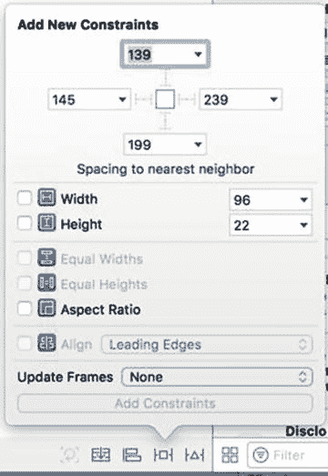

图 15-18. `Add New Constraints`（添加新约束）图标显示一个约束弹出窗口

3. 点击某个约束以将其选中。当您点击一个约束时，它会显示为红色。如果约束显示为虚线，则表示该约束尚未被选中。
4. 点击任意其他复选框。
5. 点击弹出窗口底部的 `Add Constraints`（添加约束）按钮来定义一个或多个约束。

`Add New Constraints`（添加新约束）弹出窗口允许您为所选用户界面项定义其他类型的约束：

- `Width`（宽度）或 `Height`（高度）：将所选用户界面项的大小保持在固定尺寸
- `Equal Widths`（等宽）或 `Heights`（等高）：将两个或多个选定的用户界面项保持为相同的固定尺寸
- `Aspect Ratio`（宽高比）：如果调整大小，则保持所选用户界面项的宽高比适当
- `Align`（对齐）：将两个或多个选定的用户界面项对齐

定义约束的第三种方法是让 Xcode 为您选择约束。这可以让您快速添加约束，但风险是 Xcode 可能无法正确定义约束。幸运的是，您之后始终可以编辑约束。

要让 Xcode 选择约束，请遵循以下步骤：

1. 点击您想要约束的用户界面项。
2. 点击 `Resolve Auto Layout Issues`（解决自动布局问题）图标以显示一个弹出窗口，如图 15-19 所示（或选择 `Editor ➤ Resolve Auto Layout Issues`（编辑器 ➤ 解决自动布局问题））。

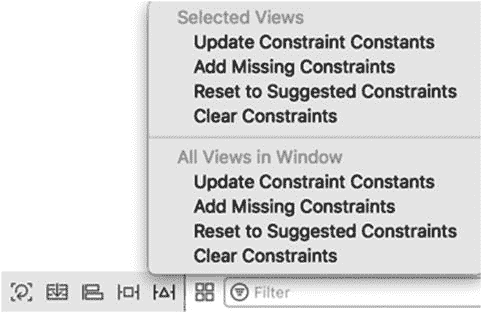

图 15-19. `Resolve Auto Layout Issues`（解决自动布局问题）弹出窗口

3. 选择 `Add Missing Constraints`（添加缺失约束）或 `Reset to Suggested Constraints`（重置为建议约束）选项。

如果您选择窗口上半部分的选项，则只会影响所选定的用户界面项。如果您选择窗口下半部分的选项，则无论是否选中，都会影响所有用户界面项。

请记住，添加约束可能是一个反复试验的过程：定义一个约束，观察其效果，然后再修改或完全删除它。在您添加约束时，Xcode 会在您的用户界面项周围显示约束线。如果 Xcode 认为您的约束不足，该项上的所有约束将显示为橙色。一旦 Xcode 认为您对某个项添加了足够的约束，这些约束将显示为蓝色。

### 编辑约束

定义了一个或多个约束后，你随时可以删除或编辑现有约束。要删除约束，有几种方法：

- 点击该约束，然后按下 `Delete` 或 `Backspace` 键
- 点击包含该约束的用户界面元素，打开“`大小检查器`”面板，然后点击该约束并按下 `Delete` 或 `Backspace` 键

你还可以从单个用户界面元素或当前显示的用户界面的所有元素中删除或清除所有约束。为此，你有两种选择：

- 选择 `Editor` ➤ `Resolve Auto Layout Issues`
- 点击窗口右下角的 `Resolve Auto Layout Issues` 图标

选择任一选项后，你都会看到一个分为上半部分和下半部分的菜单（见图 15-20）。点击上半部分的 `Clear Constraints` 选项，只会清除当前选中元素的约束。点击下半部分的 `Clear Constraints` 选项，则会清除当前显示的用户界面中所有元素的约束，无论你是否选中它们。

除了删除约束，你还可以编辑它。编辑可以让你修改约束的行为方式。关于约束，你可以修改三个值：

- `Constant`（常量）：一个固定值，用于定义约束的值
- `Priority`（优先级）：一个数值，决定哪些约束必须优先遵循
- `Modifier`（修正符）：一个数值，用于定义影响两个值的比率，例如元素高度与宽度的比率，或一个元素宽度与另一个元素宽度的比率

要编辑约束，请按以下步骤操作：

1.  点击包含你想要编辑的约束的用户界面元素。
2.  选择 `View` ➤ `Utilities` ➤ `Show Size Inspector`。“`大小检查器`”面板会列出所有已定义的约束，如图 15-21 所示。

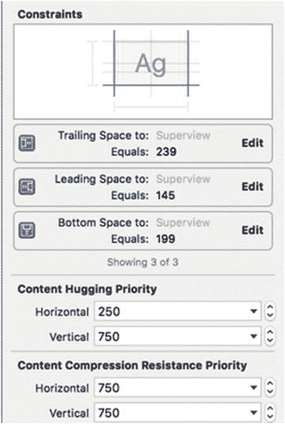

图 15-20. 在“`大小检查器`”面板中查看已定义约束的列表

3.  点击你想要修改的约束最右侧的 `Edit` 按钮。此时会出现一个弹出窗口，如图 15-22 所示。

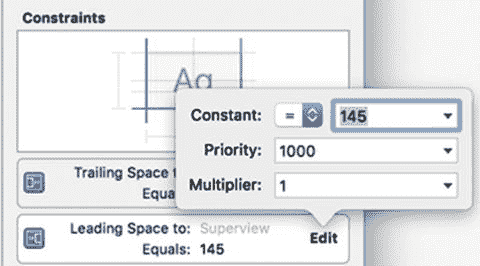

图 15-21. 弹出窗口允许你修改约束

请注意，在 `Constant:` 标签的右侧，有一个显示等号（`=`）的弹出菜单。如果你点击此弹出菜单，可以选择大于或等于、小于或等于，或等于。

在 `Constant` 标签的更右侧是一个显示数字的下拉字段。如果你点击向下的箭头，你将能够在三个选项中进行选择：

- 一个可以输入或编辑的数值
- `Use Standard Value`（使用标准值）：让 Xcode 决定最佳值
- `Use Canvas Value`（使用画布值）：使用屏幕上的当前距离来定义固定值

请记住，固定值或画布值在不同尺寸的显示器上表现可能不同。你可能需要反复试验，直到找到适合你特定用户界面的正确值。

优先级用于解决两个或多个可能相互矛盾的约束之间的冲突，例如，一个约束将按钮固定在窗口的右边缘，第二个约束将同一个按钮固定在窗口的左边缘，而第三个约束则固定按钮的宽度。通过修改优先级，你可以确保约束之间不会冲突。

找到正确的约束组合有时既繁琐又令人沮丧。为了简化设置约束的过程，Xcode 提供了两种为你定义约束的方法：

- `Add Missing Constraints`（添加缺失的约束）：保留你已定义的任何现有约束，并添加 Xcode 认为你缺失的新约束
- `Reset to Suggested Constraints`（重置为建议的约束）：删除你可能为某个元素设置的所有约束，并用其自身的约束替换它们

当你初次定义约束时，Xcode 会用红色或橙色显示它们，以提示你现有的约束不足以定义用户界面中元素的位置。一旦你定义了足够多的约束来指定位置，Xcode 就会用蓝色显示这些约束。

## 在 macOS 程序中定义约束

要完全理解约束，你需要了解它们在实际程序中是如何运作的。然后你就能看到每次调整窗口大小时，用户界面是如何随之调整的。在接下来的示例程序中，你将为一个按钮和一个文本字段定义关系约束，同时还会为一个图像定义宽高比约束。

本章前面你已经创建了一个名为 `UIProgram` 的 macOS 项目，现在我们用它来看看约束是如何工作的：

1.  确保你的 `UIProgram` 项目已在 Xcode 中加载。
2.  在项目导航器中点击 `MainMenu.xib` 文件。
3.  点击 `UIProgram` 图标，使用户界面窗口显示出来。
4.  选择 View ➤ Utilities ➤ Show Object Library，使对象库显示在 Xcode 窗口的右下角。
5.  将按钮、文本字段和文本视图各拖一个到用户界面上，使其看起来类似于图 15-22。

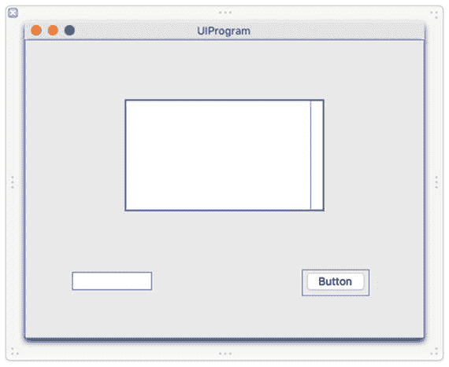

图 15-22.

`UIProgram` 的用户界面

虽然这个用户界面目前看起来还行，但一旦用户调整窗口大小，它就会变得很难看。选择 Product ➤ Run，然后调整窗口大小，看看缩小窗口是如何裁剪或隐藏用户界面上的元素的。现在再放大窗口，注意观察放大后窗口中出现的所有空白区域。通过选择 UIProgram ➤ Quit `UIProgram` 退出程序。

首先，我们按照以下步骤来定义窗口的最小尺寸：

1.  在项目导航器中点击 `Main.xib` 文件。
2.  点击左侧窗格中的“窗口”图标以选中整个窗口。
3.  选择 View ➤ Utilities ➤ Show Size Inspector 以显示窗口约束（见图 15-14）。
4.  点击选中顶部的“最小尺寸”复选框，将当前窗口尺寸定义为其最小尺寸。
5.  选择 Product ➤ Run。调整用户界面窗口的大小。注意，你只能将窗口缩小到特定尺寸。
6.  选择 UIProgram ➤ Quit `UIProgram`。

通过定义最小窗口尺寸，你已防止了用户将窗口缩得过小时用户界面被裁剪或元素消失。现在我们添加约束，使用户界面在窗口放大时也能自适应。

1.  将鼠标指针移到按钮上，按住 Control 键，向右拖动鼠标，在到达窗口右边缘前停止，如图 15-23 所示。

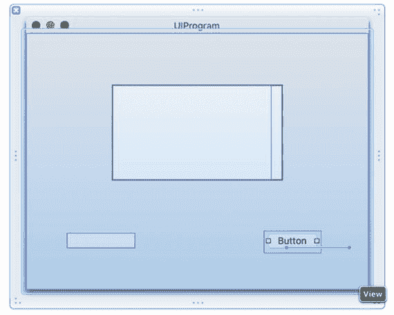

图 15-23.

调整用户界面窗口的大小
2.  松开 Control 键和鼠标。此时会弹出一个窗口。
3.  选择“距容器的尾部间距”。注意，按钮显示为红色，说明你对该按钮的约束还不够。
4.  将鼠标指针移到按钮上，按住 Control 键，向下拖动鼠标，在到达窗口底部边缘前停止。
5.  松开 Control 键和鼠标。此时会弹出一个窗口。
6.  选择“距容器的底部间距”。注意，按钮现在显示为蓝色，说明约束已足够。
7.  点击文本字段以选中它。
8.  选择 Editor ➤ Resolve Auto Layout Issues ➤ Add Missing Constraints。Xcode 会自动添加约束，如图 15-24 所示。

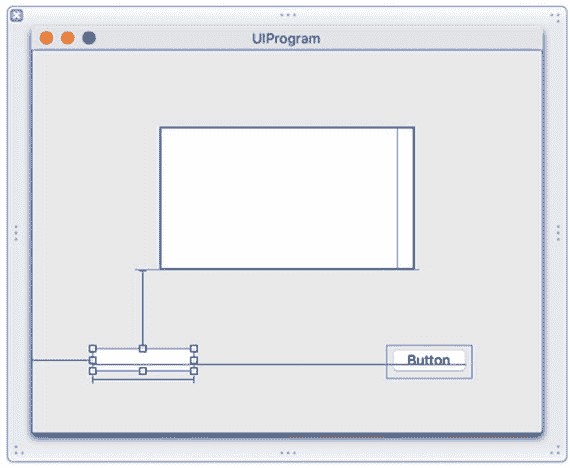

图 15-24.

文本字段上的约束
9.  选择 Product ➤ Run。
10.  调整窗口大小。注意观察放大窗口时用户界面元素是如何调整的。如你所见，无论用户如何调整窗口大小，约束都能让用户界面元素保持在适当的位置和尺寸。你可以自由尝试编辑约束，看看它们是如何工作的。
11.  选择 UIProgram ➤ Quit `UIProgram`。

### 总结

程序中的用户界面决定了用户如何与你的程序交互。每个用户界面都需要显示信息、从用户处获取信息，并允许用户选择命令。理想情况下，用户应更专注于使用你的程序，而不是花心思去弄明白用户界面是如何运作的。

无论你使用 `.xib` 文件还是 `.storyboard` 文件，对象库都会显示所有可以添加到用户界面的元素。为了帮助你快速找到所需元素，你可以在对象库底部的搜索框中输入完整或部分单词进行搜索。

约束能帮助你的用户界面在任何窗口大小调整下都保持美观。两种基本的约束类型包括：

*   **关系约束**：定义相邻元素之间的距离，例如两个按钮之间，或按钮与窗口边缘之间的距离。
*   **尺寸约束**：定义元素的高度、宽度或宽高比。

你可以自己定义约束，让 Xcode 自动定义约束，或者两者结合使用。定义约束可能需要反复尝试，直到你的用户界面能完全按照你的期望适应窗口大小的变化。

