# 16. 使用故事板

每个程序用户界面中最常见的部分就是用来显示按钮和文本字段等项目的窗口。在 Xcode 中，窗口被称为视图。除了最简单的程序之外，大多数程序的用户界面都可能包含两个或更多的窗口或视图。这意味着你的程序需要知道如何打开额外的窗口，以及如何再次关闭它们。

创建和存储视图的两种方式是用 ` .xib` 文件和 ` .storyboard` 文件。一个 ` .xib` 文件只保存一个视图，因此如果你需要显示多个视图，就需要创建多个 ` .xib` 文件。而一个 ` .storyboard` 文件可以保存一个或多个视图。

你可以使用 ` .xib` 文件或 ` .storyboard` 文件，或者两者的组合来创建用户界面。最初，你可以使用 ` .xib` 或 ` .storyboard` 文件来创建 iOS 应用，但 Xcode 8 现在只为 iOS 应用创建 ` .storyboard` 文件。对于创建 macOS 程序，你仍然可以使用 ` .xib` 或 ` .storyboard` 文件，但由于 iOS 应用主要依赖 ` .storyboard` 文件，苹果也很可能将 macOS 编程迁移到 ` .storyboard` 文件。因此，你应该更多地学习如何使用 ` .storyboard` 来创建用户界面。

最终，无论你是使用 ` .xib` 还是 ` .storyboard` 文件，都不及学会如何设计一个良好的用户界面来得重要，这个界面的目标是让用户能尽可能轻松地完成任务。

每次创建新项目时，Xcode 都会让你选择是否使用故事板，如图 16-1 所示。如果你选择不使用故事板，那么 Xcode 会将你的用户界面创建并存储在一个 ` .xib` 文件中。如果你选择使用故事板，那么 Xcode 会将你的用户界面存储在一个 ` .storyboard` 文件中。

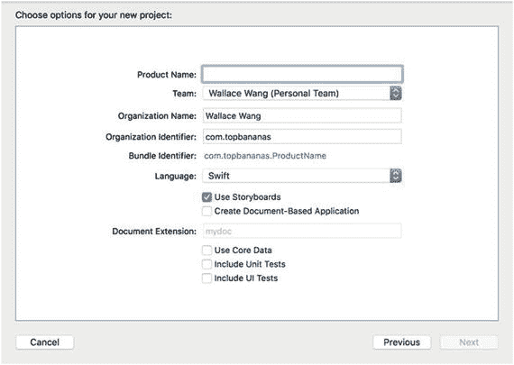

图 16-1. 创建 macOS 项目时，Xcode 会给你选择是否使用故事板

要尝试使用故事板，你需要按照以下步骤创建一个使用故事板的项目：

1. 在 Xcode 中选择 文件 ➤ 新建 ➤ 项目。
2. 单击 macOS 类别下的“应用”。
3. 单击“Cocoa 应用”，然后单击“下一步”按钮。Xcode 会要求你输入产品名称。
4. 单击“产品名称”文本字段，输入 `StoryProgram`。
5. 确保“语言”弹出菜单显示为 Swift，并且只选中了“使用故事板”复选框（见图 16-1）。
6. 单击“下一步”按钮。Xcode 会询问你希望将项目存储在哪里。
7. 选择一个文件夹来存储你的项目，然后单击“创建”按钮。
8. 在项目导航窗格中单击 `Main.storyboard` 文件。` .storyboard` 用户界面就会出现，如图 16-2 所示。

   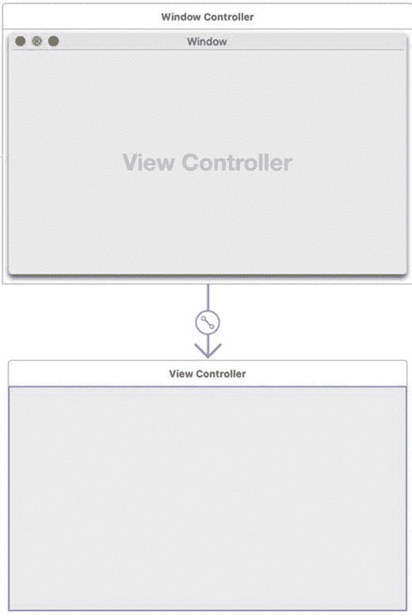

   图 16-2. 一个 ` .storyboard` 文件显示了一个窗口控制器和一个视图控制器。与只显示一个窗口来布局按钮、文本字段和标签等用户界面项目的 ` .xib` 文件不同，` .storyboard` 文件显示两个窗口。上面的窗口（顶部标有“窗口控制器”）定义了窗口在屏幕上的外观。下面的窗口（顶部标有“视图控制器”）定义了该窗口上显示的内容。当你从对象库拖拽用户界面项目时，需要将它们放置在视图控制器（下面的窗口）上。

9. 选择 产品 ➤ 运行。注意，你的程序用户界面会作为一个单独的窗口出现，这与之前使用 ` .xib` 文件创建的项目完全相同。
10. 选择 StoryProgram ➤ 退出 StoryProgram 来退出你的程序并返回 Xcode。

## 使用故事板

就其本身而言，` .storyboard` 文件与 ` .xib` 文件差别不大。` .storyboard` 文件的主要优势在于，它们能让你轻松地创建和链接多个视图（窗口）。例如，一个程序可能会显示一个登录屏幕，要求用户输入用户名和密码。一旦用户正确输入这些信息，第二个屏幕就可能出现。

这些屏幕中的每一个都代表了程序的一个不同视图或窗口。第一个视图显示登录屏幕，第二个视图显示不同的屏幕。` .storyboard` 文件不仅清晰地定义了不同视图之间是如何连接的，而且还清楚地展示了用户将按怎样的顺序看到每个视图。

故事板由两部分组成，如图 16-3 所示：

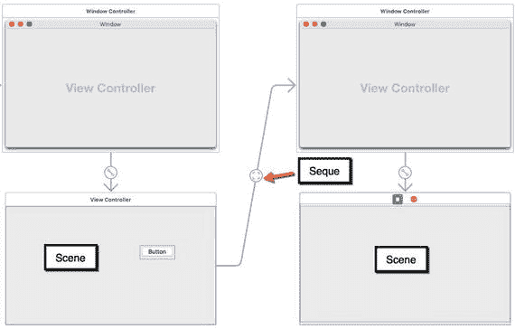

图 16-3. 故事板将用户界面组织成场景和 segue。

- **场景**：显示用户界面的窗口
- **Segue**：定义场景之间的连接

场景包含诸如按钮和文本字段之类的用户界面项目。Segue 则显示用户将按什么顺序查看用户界面。

当你首次使用故事板创建一个新项目时，Xcode 会包含一个用于控制单个视图的窗口控制器，你可以在该视图上放置按钮或文本字段等用户界面项目。要向故事板添加额外的视图，你必须使用对象库并添加额外的控制器。

除了显示用户界面项目外，对象库还包含用于故事板的控制器，如图 16-4 所示。

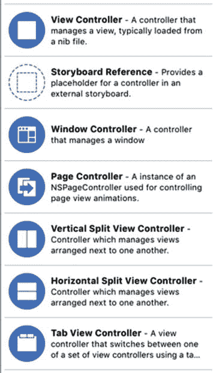

图 16-4. 对象库中可以添加到故事板的控制器

你可以放置在故事板上的五种控制器类型包括：

- **视图控制器**：控制一个 ` .xib` 文件，以便你可以将其包含在故事板中
- **窗口控制器**：控制单个窗口或视图
- **页面控制器**：定义视图之间的动画效果
- **垂直/水平拆分视图控制器**：并排或堆叠显示两个视图
- **标签视图控制器**：显示一个带标签的界面，用于控制两个或更多视图

窗口控制器不过是一个包含视图的窗口。窗口中显示的视图由从窗口控制器指向视图的箭头标识（见图 16-2）。

页面控制器显示一个允许多个页面出现或消失的视图，从而产生动画效果。这让你可以隐藏视图上的用户界面项目，以便它们稍后出现（和消失）。

垂直/水平拆分视图控制器像一个包含两个视图的窗口，它们要么并排放置，要么上下堆叠，如图 16-5 所示。

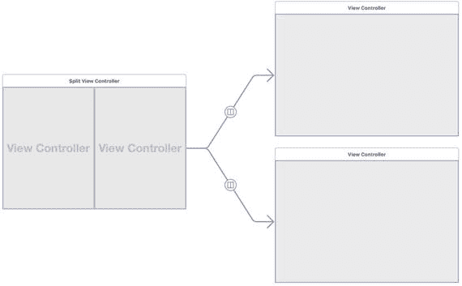

图 16-5. 拆分视图控制器包含两个视图。

标签视图控制器也由一个可以包含两个或更多视图的单一窗口组成。区别在于它可以显示标签，每个标签代表一个不同的视图，如图 16-6 所示。你也可以向标签视图控制器添加两个以上的视图。

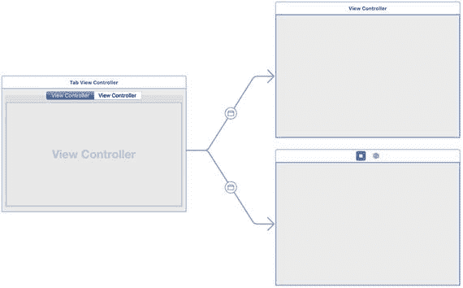

图 16-6. 标签视图控制器在单个窗口中显示两个或多个视图，并由标签标识。


### 向故事板添加场景

要向故事板添加场景，必须添加额外的控制器。要了解如何在故事板上创建新场景，请按照以下步骤操作：

1.  确保你的`StoryProgram`项目已加载到 Xcode 中。
2.  在项目导航器窗格中点击`Main.storyboard`文件。
3.  选择“视图”➤“实用工具”➤“显示对象库”。
4.  从对象库中拖出一个蓝色窗口控制器（见图 16-4），并将其放置在故事板中现有窗口控制器的旁边。
5.  拖动窗口控制器及其附带的视图控制器，使其如图 16-7 所示。

    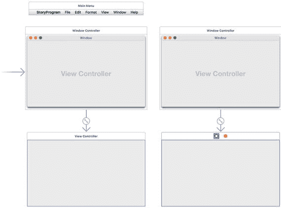

    图 16-7. 在故事板中放置第二个窗口控制器

当你开始向故事板添加更多场景时，这些场景不会显示在屏幕上。要使场景显示，你必须使用**转场**将该场景连接到现有场景，或者将该新场景定义为初始场景。

### 定义故事板中的初始场景

在每个故事板中，必须将一个场景定义为初始场景，即程序运行时所显示的第一个窗口或视图。Xcode 使用一个指向右侧的箭头来标识初始场景。

另一种标识初始场景的方法是，点击控制器顶部中间的蓝色图标，并打开“显示属性检查器”窗格。如果`"Is Initial Controller"`复选框被选中，则当前选中的窗口即为初始场景，如图 16-8 所示。

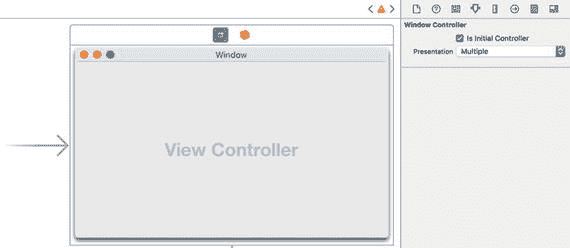

图 16-8. 初始屏幕由箭头和`"Is Initial Controller"`复选框标识。

若要更改初始场景，你可以拖动初始场景箭头，使其指向另一个场景。要使用`"Is Initial Controller"`复选框定义初始场景，请按照以下步骤操作：

1.  在项目导航器窗格中点击`.storyboard`文件。
2.  点击你想要设为初始场景的场景。
3.  点击场景顶部的蓝色控制器图标，如图 16-9 所示。

    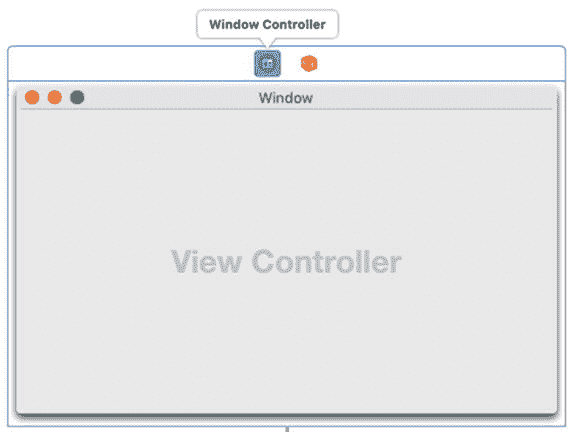

    图 16-9. 选择场景的控制器图标

4.  选择“视图”➤“实用工具”➤“显示属性检查器”。右侧窗格的属性检查器窗口中会出现“窗口控制器”类别（见图 16-8）。
5.  选中`"Is Initial Controller"`复选框。

请注意，一次只能有一个初始场景。一旦你为一个场景选中了`"Is Initial Controller"`复选框，如果另一个场景也选中了该复选框，Xcode 会自动清除该场景中的`"Is Initial Controller"`复选框。

### 使用转场连接场景

当故事板包含两个或更多场景时，如果运行程序，只会显示初始场景。要显示故事板中的其他场景，你需要创建场景之间的转场。转场在两个场景之间建立链接，以便用户能够依次查看场景。

要了解如何在场景之间创建转场，请按照以下步骤操作：

1.  确保你的`StoryProgram`项目已加载到 Xcode 中，并在项目导航器窗格中点击`Main.storyboard`文件。
2.  从对象库窗口中拖出一个按钮，并将其放置在第一个场景上。
3.  将鼠标指针移到该按钮上，按住 Control 键，然后从该按钮向第二个场景拖动鼠标。Xcode 会高亮显示第二个场景，如图 16-10 所示。

    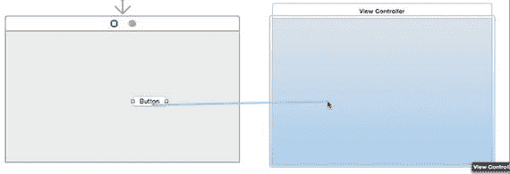

    图 16-10. 按住 Control 键从按钮拖动到另一个场景可创建转场。

4.  松开 Control 键和鼠标。Xcode 会显示一个弹出菜单，如图 16-11 所示。

    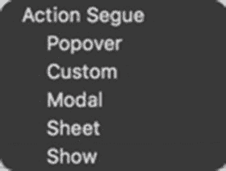

    图 16-11. 弹出菜单让你定义如何显示场景。

5.  选择“Show”。Xcode 会在两个场景之间创建一个转场。
6.  在第二个场景上拖放一个标签，并将其文本更改为“Second scene here”。
7.  选择“产品”➤“运行”。Xcode 运行你的程序，并显示带有按钮的窗口。
8.  点击按钮。第二个窗口出现，其中包含标签“Second scene here”，如图 16-12 所示。

    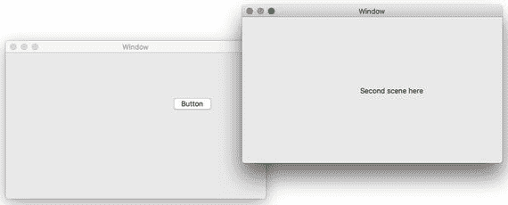

    图 16-12. 转场打开第二个视图。

### 显示转场中的场景

转场有两个用途。第一，转场将一个场景连接到另一个场景。第二，转场定义了第二个场景的显示方式。创建转场时，你有五种选择：

*   **Show**：将场景显示为一个单独的窗口，该窗口可以移动和调整大小。
*   **Custom**：允许你为场景创建自定义外观。
*   **Modal**：将场景显示为一个对话框，用户在关闭此对话框之前无法执行其他任何操作。
*   **Popover**：显示一个场景，并带有一个指向某个对象的箭头，如图 16-13 所示。

    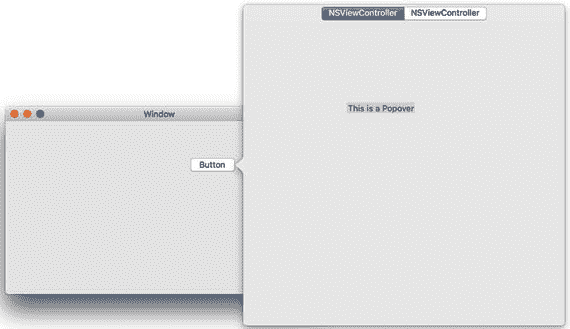

    图 16-13. 弹出的 Popover 指向用户点击的对象。

*   **Sheet**：将场景显示为一个从窗口标题栏下拉并覆盖窗口的 Sheet，如图 16-14 所示。

    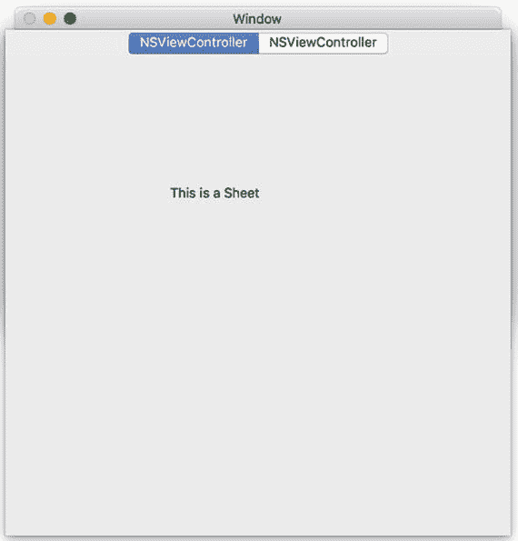

    图 16-14. 一个 Sheet 从窗口标题栏下拉。

首次创建转场时，你可以定义转场应如何显示场景。但是，你随时可以通过以下步骤更改此设置：

1.  确保你的`StoryProgram`项目已加载到 Xcode 中，并在项目导航器窗格中点击`Main.storyboard`文件。
2.  点击你想要修改的转场。Xcode 会高亮显示你选择的转场。
3.  选择“视图”➤“实用工具”➤“显示属性检查器”。属性检查器窗格会显示`Kind`属性弹出菜单。
4.  点击`Kind`弹出菜单，并选择不同的样式，例如`modal`或`custom`，如图 16-15 所示。

    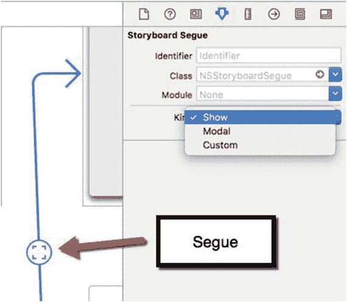

    图 16-15. 你可以更改转场显示场景的方式。


### 为场景添加控制器文件

每次向故事板添加不同的场景时，实际上都是在为程序的用户界面添加另一个窗口。然而，每个场景也需要其专属的 Swift 文件来进行控制。这样一来，如果添加了按钮或其他用户界面元素，就可以编写 Swift 代码来在该场景上显示数据，或处理用户可能选择的任何命令（例如点击按钮）。

首先，必须为添加到故事板的每个额外场景创建一个 Swift 文件。其次，必须将这个 Swift 文件链接到该场景，以便场景能够使用它。

要了解如何创建用于控制场景的 Swift 文件，请遵循以下步骤：

1.  确保你的 `StoryProgram` 项目已在 Xcode 中加载，并在项目导航器窗格中点击 `Main.storyboard` 文件。
2.  选择“文件” ➤ “新建” ➤ “文件”。Xcode 会显示不同的可用模板。
3.  在“macOS”下选择“源”，然后点击“Cocoa Class”图标，如图 16-16 所示。然后点击“下一步”按钮。会出现另一个对话框，要求输入名称和父类。

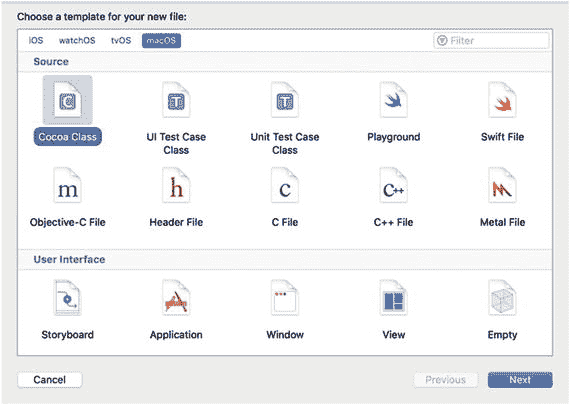

图 16-16. 创建用于存储视图控制器 Swift 代码的 Cocoa 类文件

4.  点击“名称”文本框，为你用来控制场景的类输入一个描述性名称，例如 `SecondController`。
5.  点击“父类”弹出菜单，并选择 `NSViewController`。（如果你正在为其他类型的控制器创建 Swift 文件，例如页面控制器或标签视图控制器，请选择不同的父类，例如 `NSPageController` 或 `NSTabView`。）
6.  清除“同时为用户界面创建 XIB 文件”复选框。
7.  确保“语言”弹出菜单显示为 Swift，如图 16-17 所示。点击“下一步”按钮。Xcode 会询问你想将新的 Swift 类保存在何处。

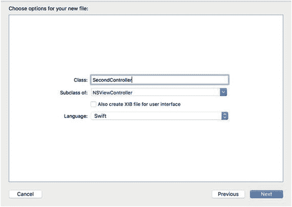

图 16-17. 创建用于控制故事板场景的 Swift 类

8.  选择一个文件夹，然后点击“创建”按钮。Xcode 会在项目导航器窗格中显示你的 Swift 类。此时，Swift 类和场景尚未连接，因此你必须将场景的视图控制器设置为你刚刚创建的 Swift 文件的类。
9.  点击 `Main.storyboard` 文件以显示你的用户界面。
10. 点击场景上带有“Second scene here”标签的蓝色视图控制器图标。
11. 选择“视图” ➤ “实用工具” ➤ “显示身份检查器”。
12. 点击“类”弹出菜单，并选择 `SecondController`，即你之前创建的视图控制器，如图 16-18 所示。

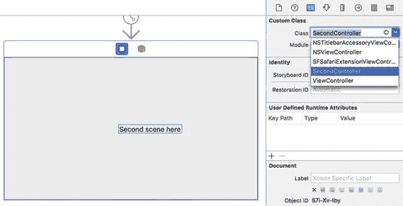

图 16-18. 将场景连接到 Swift 视图控制器文件

13. 将一个按钮拖放到这个第二个场景上。
14. 选择“视图” ➤ “助理编辑器” ➤ “显示助理编辑器”。助理编辑器会显示你刚刚创建的 `SecondController.swift` 文件。
15. 将鼠标指针移到第二个场景的标签上，按住 Control 键，然后将鼠标拖放到 `class SecondController` 行下方。会出现一个弹出窗口。
16. 在“名称”字段中输入 `labelName`，然后点击“连接”按钮。你的代码中应该会出现下面这一行：

```
@IBOutlet weak var labelName: NSTextField!
```

17. 将鼠标指针移到第二个场景的按钮上，按住 Control 键，然后将鼠标拖放到 `SecondController.swift` 文件底部最后一个大括号的上方，如图 16-19 所示。会出现一个弹出窗口。

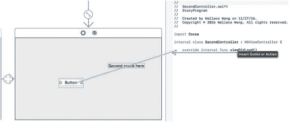

图 16-19. 为按钮创建 IBAction 方法

18. 点击“连接”弹出菜单并选择“Action”。
19. 点击“名称”文本框并输入 `changeLabel`。
20. 点击“类型”弹出菜单并选择 `NSButton`。然后点击“连接”按钮。Xcode 会显示一个空的 IBAction 方法。
21. 按如下方式修改 IBAction 方法：

```
@IBAction func changeLabel(_ sender: NSButton) {
    labelName.stringValue = "Button clicked"
}
```

22. 选择“产品” ➤ “运行”。程序的初始场景会随按钮一起出现。
23. 点击这个第一个场景上的按钮。你的第二个场景会作为另一个窗口出现。
24. 点击第二个场景上的按钮。第二个场景上的标签会从“Second scene here”变为“Button clicked”。
25. 选择“StoryProgram” ➤ “退出 StoryProgram”。

本练习展示了如何创建一个作为 Cocoa Class 文件的 Swift 文件。然后展示了如何将此 Swift 文件链接到第二个视图控制器。一旦将 Swift 文件连接到视图控制器，就可以编写 Swift 代码，使任何用户界面元素实际响应 Swift 代码。

### 总结

你可以创建用户界面并将其存储在多个 `.xib` 文件或一个包含多个场景的 `.storyboard` 文件中。故事板文件用于创建 iOS 应用，因此最好也将故事板文件用于 macOS 程序，因为故事板文件很可能成为创建用户界面的标准方式。

故事板允许你定义构成程序用户界面的场景出现的顺序。当你向故事板添加额外场景时，需要创建控制这些场景的 Swift 文件。这些 Swift 文件需要属于 `NSViewController` 类，然后必须将你的场景连接到该 Swift 文件。

设计程序的用户界面涉及使用 `.xib` 或 `.storyboard` 文件，或两者的组合。故事板减少了编写 Swift 代码的需求，但无论使用哪种类型的文件，你仍然需要编写一些 Swift 代码来让你的用户界面完全工作。


