# 17. 使用按钮选择命令

每个程序都需要为用户提供一种控制计算机的方式。在过去，这意味着要知道如何键入正确的命令来使程序运行，但在如今的图形用户界面时代，更简单的程序控制方式是从可用命令列表中进行选择。向程序下达命令的最简单方法是通过按钮。

通过在屏幕上显示多个按钮，用户界面随时为用户提供多种选择。用户无需记忆晦涩难懂的命令，只需用鼠标指向命令并点击选择即可。

Xcode 提供了多种不同类型的按钮，你可以将它们放置在用户界面上，但它们的运作方式都相同。一个按钮代表一个单一命令，点击该按钮会执行存储在 `IBAction` 方法中的 Swift 代码。

要使用按钮，只需将它们放置在用户界面（无论是 `.xib` 文件还是 `.storyboard` 文件）上，修改标签以显示你希望该按钮代表的命令，然后通过 `IBAction` 方法将按钮连接到 Swift 代码。

所有按钮都基于 Cocoa 框架中定义的 `NSButton` 类。虽然大多数按钮显示可包含其代表命令的文本，但有些按钮根本不显示文本。尽管外观不同，所有按钮的运作方式都相同，并且可以随时更改成另一种按钮类型。可用的不同按钮类型如图 17-1 所示：

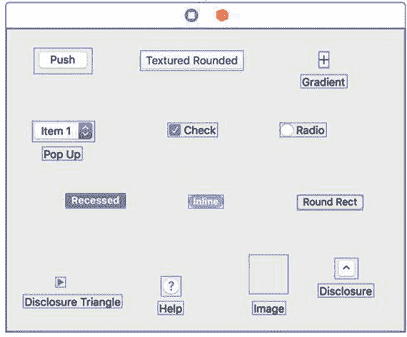

图 17-1. 可以放置在用户界面上的不同类型按钮

- 推送按钮 (Push Button)
- 纹理圆角按钮 (Textured Rounded Button)
- 渐变按钮 (Gradient Button)（不显示文本）
- 弹出按钮 (Pop-Up Button)
- 复选框按钮 (Checkbox Button)
- 单选按钮 (Radio Button)
- 凹陷按钮 (Recessed Button)
- 内嵌按钮 (Inline Button)
- 圆角矩形按钮 (Rounded Rectangle Button)
- 展开三角形 (Disclosure Triangle)（不显示文本）
- 帮助按钮 (Help Button)（不显示文本）
- 图像按钮 (Image Button)（不显示文本）
- 展开按钮 (Disclosure Button)（不显示文本）

没有文本标题的按钮占用的空间更少，但可能看起来晦涩难懂，因为用户不知道那个按钮是做什么的。图像按钮通常用于显示代表命令的图标。

## 修改按钮上的文本

对于显示文本的按钮，Xcode 提供了两种修改按钮文本的方式：

- 直接双击按钮上的文本进行编辑。
- 点击按钮将其选中，选择“视图”➤“工具”➤“显示属性检查器”，然后编辑“标题 (Title)”属性，如图 17-2 所示。

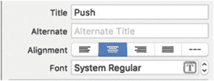

图 17-2. “显示属性检查器”面板允许你编辑按钮的标题

“属性检查器”允许你在程序运行时定义按钮上的文本。但是，如果你以后想要更改该文本，则需要使用 Swift 代码修改按钮的文本。为此，你首先必须创建一个代表按钮的 `IBOutlet`。其次，你必须使用类似下面的代码在 Swift 中修改该按钮的“标题 (Title)”属性：

```
@IBOutlet weak var myButton: NSButton!
myButton.title = "新文本 (New Text)"
```

“标题 (Title)”属性定义了显示在按钮上的文本，但许多按钮还提供了“备用标题 (Alternate)”属性。“备用标题”属性的目的是，当一个按钮的“类型 (Type)”属性设置为 `toggle` 或 `switch` 时，允许该按钮显示文本，如图 17-3 所示。

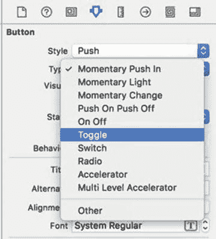

图 17-3. 更改按钮的“类型 (Type)”属性

当一个按钮的“备用标题 (Alternate Title)”文本非空，且该按钮的“类型 (Type)”属性为 `toggle` 或 `switch` 时，点击这个切换按钮会在显示“标题 (Title)”文本和“备用标题”文本之间交替切换。要了解按钮的“标题 (Title)”和“备用标题 (Alternate Title)”属性是如何工作的，请按照以下步骤操作：

1. 在 Xcode 中，选择“文件”➤“新建”➤“项目”。
2. 在 macOS 类别下点击“应用程序 (Application)”。
3. 点击“Cocoa 应用程序 (Cocoa Application)”，然后点击“下一步 (Next)”按钮。Xcode 现在会询问产品名称。
4. 点击“产品名称 (Product Name)”文本字段，输入 `ButtonProgram`。
5. 确保“语言 (Language)”弹出菜单显示 Swift，并且勾选了“使用 Storyboard (Use Storyboards)”复选框。
6. 点击“下一步 (Next)”按钮。Xcode 会询问你想要在哪里存储项目。
7. 选择一个文件夹来存储你的项目，然后点击“创建 (Create)”按钮。
8. 在项目导航器中点击 `Main.storyboard` 文件。你的程序用户界面将会出现。
9. 选择“视图”➤“工具”➤“显示对象库 (Show Object Library)”。对象库会出现在 Xcode 窗口的右下角。
10. 将一个推送按钮和一个文本字段拖曳到视图控制器窗口上，调整这两个项目的大小，使其看起来像图 17-4。

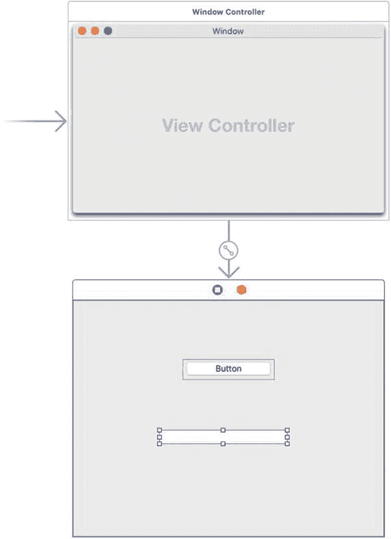

图 17-4. ButtonProgram 的用户界面

11. 点击推送按钮，然后选择“视图”➤“工具”➤“显示属性检查器”。“显示属性检查器”面板会出现在 Xcode 窗口的右上角。
12. 点击“类型 (Type)”弹出菜单，然后选择“切换 (Toggle)”。
13. 点击“标题 (Title)”文本字段，输入 `Change Me` 并按下回车键。
14. 点击“备用标题 (Alternate)”文本字段，输入 `Alternate Text`。
15. 选择“产品”➤“运行 (Run)”。你的用户界面会出现。
16. 点击 `Change Me` 按钮。注意，按钮上的文本现在显示为“Alternate Text”。
17. 再次点击同一个按钮。注意，文本会在 `Change Me` 和 `Alternate Text` 之间交替切换。
18. 选择“ButtonProgram”➤“退出 ButtonProgram (Quit ButtonProgram)”。

现在让我们看看如何通过从文本字段获取文本并将其存储到按钮的“标题 (Title)”属性中来修改按钮的标题，请按照以下步骤操作：

1. 在项目导航器窗格中点击 `Main.storyboard` 文件。
2. 点击当前显示文本“Change Me”的推送按钮。
3. 选择“视图”➤“助理编辑器”➤“显示助理编辑器 (Show Assistant Editor)”。`ViewController.swift` 文件会出现在 `Main.storyboard` 文件旁边。
4. 将鼠标指针移到推送按钮上，按住 Control 键，然后拖曳鼠标到 `ViewController.swift` 文件中 `@IBOutlet` 行下方。
5. 松开 Control 键和鼠标。会弹出一个菜单。
6. 点击“名称 (Name)”文本字段，输入 `myButton`。
7. 将鼠标指针移到文本字段上，按住 Control 键，然后拖曳鼠标到 `AppDelegate.swift` 文件中 `@IBOutlet` 行下方。
8. 松开 Control 键和鼠标。会弹出一个菜单。
9. 点击“名称 (Name)”文本字段，输入 `changeText`。你现在应该已经创建了两个 `IBOutlet`，看起来像这样：

```
    @IBOutlet weak var myButton: NSButton!
    @IBOutlet weak var changeText: NSTextField!
```

10. 将鼠标指针移到推送按钮上，按住 Control 键，然后拖曳鼠标到 `AppDelegate.swift` 文件底部最后一个花括号的上方。
11. 松开 Control 键和鼠标。会弹出一个菜单。
12. 点击“连接 (Connection)”弹出菜单，选择“动作 (Action)”。
13. 点击“名称 (Name)”文本字段，输入 `changeTitle`。
14. 点击“类型 (Type)”弹出菜单，选择 `NSButton`，然后点击“连接 (Connect)”按钮。Xcode 会创建一个空的 `IBAction` 方法。
15. 按如下方式修改这个 `IBAction` 方法：

```
    @IBAction func changeTitle(_ sender: NSButton) {
    myButton.title = changeText.stringValue
    }
```

这段 Swift 代码会检索文本字段（`IBOutlet changeText`）中的文本，并将其存储到按钮（`IBOutlet myButton`）的“标题 (Title)”属性中。
16. 选择“产品”➤“运行 (Run)”。你的用户界面会出现。
17. 点击文本字段，输入 `Hello there!`。
18. 点击 `Change Me` 按钮。备用文本会出现在按钮上。
19. 再次点击按钮。文本字段中的文本现在会出现。
20. 选择“ButtonProgram”➤“退出 ButtonProgram (Quit ButtonProgram)”。


## 为按钮添加图像和声音

按钮通常显示文本，列出按钮所代表的命令，例如“确定”或“取消”。不过，你也可以在按钮上显示图像。这对于创建工具栏图标非常有用，可以显示描述性图标来表示命令（例如，显示打印机来表示“打印”命令）。图像可以单独显示在按钮上，也可以与描述性文本一起显示。

除了显示图像，按钮还可以播放声音，为用户提供音频反馈。虽然大多数人使用鼠标（或触控板）点击按钮，但有些人更喜欢使用按键快捷键，因此你还可以将按键快捷键分配给连接到特定按钮的`IBAction`方法。

要添加图像到按钮，只需在属性检查器中修改“图像”属性和“图像”属性正下方的“备用”属性，如图 17-5 所示。

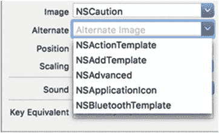

**图 17-5**  
“图像”和“备用”弹出菜单允许你从预定义图像列表中进行选择。

你还可以使用`NSButton`的`Image`和`alternateImage`属性来定义按钮上显示的图像。定义按钮上显示的图像时，你还可以选择该图像相对于按钮上任何文本的位置。

“位置”属性定义了图像与文本的显示方式，其中文本用水平线表示，图像用正方形表示，如图 17-6 所示。

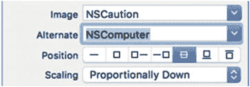

**图 17-6**  
“位置”属性允许你对齐按钮上的文本和图像。

从左到右的七种不同位置分别是：

*   仅文本
*   仅图像
*   图像在左，文本在右
*   文本在左，图像在右
*   文本覆盖在图像中间
*   文本在图像下方
*   文本在图像上方

要定义用户点击按钮时播放的声音，可以修改“声音”属性，如图 17-7 所示。（你可能需要调整电脑音量才能听到点击按钮时播放的声音。）

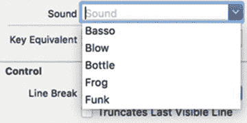

**图 17-7**  
“声音”属性允许你选择要播放的声音。

要了解如何向按钮添加图像和声音，请确保你的`ButtonProgram`项目已在 Xcode 中加载，然后按照以下步骤操作：

1.  在项目导航器中点击`Main.storyboard`文件。
2.  点击用户界面上的按钮以选中它。
3.  选择“视图”>“工具”>“显示属性检查器”。“显示属性检查器”窗格会出现在 Xcode 窗口的右上角。
4.  点击“图像”弹出菜单，选择`NSCaution`。
5.  点击“备用”弹出菜单，选择`NSComputer`（参见图 17-5）。
6.  点击“位置”属性，选择第三个（从左起）图标，该图标将图像显示在左侧，文本显示在右侧（参见图 17-6）。
7.  点击“声音”弹出菜单，选择一种声音，例如`Frog`。
8.  选择“产品”>“运行”。你的程序会启动。注意，按钮上会出现警告图标。
9.  点击文本字段，输入`Hello there!`。
10. 点击该按钮。按钮上的文本会显示备用文本，并播放你选择的声音。每次点击按钮时，它都会在“标题”和“图像”属性与“备用”（文本和图像）属性之间交替显示。
11. 选择`ButtonProgram`>“退出 ButtonProgram”。

## 将多个用户界面项连接到 IBAction 方法

通常，你会将一个`IBAction`方法链接到一个用户界面项（例如按钮）。但是，也可以将多个项连接到同一个`IBAction`方法。当这样做时，`IBAction`方法需要知道是哪个用户界面项调用了它。

要标识特定的用户界面项，你需要更改链接到同一个`IBAction`方法的每个项的“标签”属性。“标签”属性可以保存一个整数值，因此你可以使用不同的`Tag`值来标识不同的用户界面项。

一旦为每个用户界面项分配了不同的`Tag`值，你就可以正常创建一个`IBAction`方法，方法是从一个用户界面项按住 Control 键拖拽到你的 Swift 文件中。然后，使用相同的 Control 键拖拽方法将其余的用户界面项连接到那个已有的`IBAction`方法。

只要使用`Tag`属性来标识是哪个用户界面项调用了`IBAction`方法，可以链接到同一个`IBAction`方法的项数量就没有限制。

要了解如何将多个项连接到单个`IBAction`方法，请按照以下步骤操作：

1.  在 Xcode 中，选择“文件”>“新建”>“项目”。
2.  在 macOS 类别下点击“应用程序”。
3.  点击“Cocoa 应用”，然后点击“下一步”按钮。Xcode 现在要求输入产品名称。
4.  在“产品名称”文本字段中点击并输入`MultipleButtons`。
5.  确保“语言”弹出菜单显示为`Swift`，并且“使用故事板”复选框已选中。
6.  点击“下一步”按钮。Xcode 会询问你要将项目存储在何处。
7.  选择一个文件夹来存储项目，然后点击“创建”按钮。
8.  在项目导航器中点击`Main.storyboard`文件。
9.  将一个“按钮”、“凹进按钮”、“内联按钮”和“标签”拖拽到用户界面上，并调整标签的宽度，如图 17-8 所示。

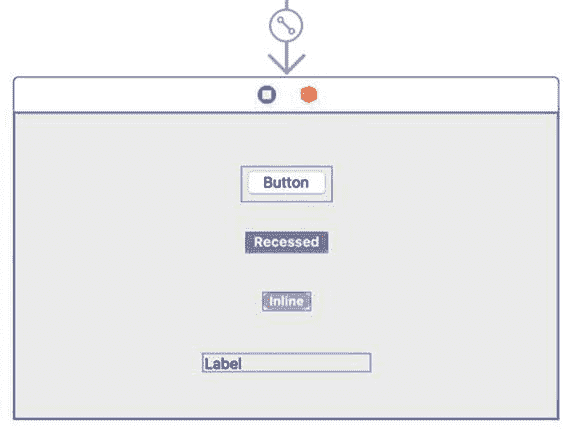

**图 17-8**  
`MultipleButtons`程序的用户界面

此时，窗口上有三种不同类型的按钮和一个标签。你将创建一个所有三个按钮都可以运行的`IBAction`方法。当你点击一个按钮时，标签将显示该按钮的标题，以显示你刚刚点击了哪个按钮。

首先，你需要修改每个按钮的“标签”属性。顶部按钮的`Tag`值为 0，中间按钮的`Tag`值为 1，最下面的按钮的`Tag`值为 2。

然后，创建一个`IBAction`方法，该方法识别`Tag`属性并在标签中显示按钮的标题。为此，请遵循以下步骤：

1.  在项目导航器中点击`Main.storyboard`文件。
2.  选择“视图”>“辅助编辑器”>“显示辅助编辑器”。Xcode 会在用户界面旁边显示`ViewController.swift`文件。
3.  将鼠标指针移到标签上，按住 Control 键，然后拖拽到`AppDelegate.swift`文件中`IBOutlet`行下方。
4.  松开 Control 键和鼠标按钮。会弹出一个窗口。
5.  在“名称”文本字段中点击，输入`displayLabel`，然后点击“连接”按钮。你应该得到一个类似于以下的`IBOutlet`：

```
    @IBOutlet weak var displayLabel: NSTextField!
```


6.  将鼠标指针移到按钮上，按住 `Control` 键，将鼠标拖到 `AppDelegate.swift` 文件底部最后一个花括号上方。
7.  松开 `Control` 键和鼠标按钮。系统会弹出一个窗口。
8.  点击“Connection”弹出菜单，选择“Action”。
9.  点击“Name”文本框，输入`displayButton`。
10.  确保“Type”弹出菜单显示为`NSButton`，这样其他按钮也能连接到这个`IBAction`方法。
11.  点击“Connect”按钮。Xcode 会显示一个空的`IBAction`方法。
12.  将鼠标指针移到“Recessed Button”上，按住 `Control` 键，将鼠标拖到`IBAction`方法中的`func`关键字上，直到 Xcode 高亮显示整个方法，如图 17-9 所示。

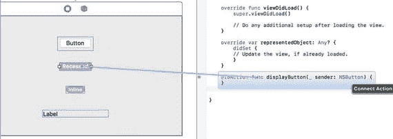

图 17-9. 将现有`IBAction`方法连接到另一个用户界面元素

13.  松开 `Control` 键和鼠标按钮。Xcode 会将`IBAction`方法连接到凹陷按钮。
14.  将鼠标指针移到内联按钮上，按住 `Control` 键，将鼠标拖到`IBAction`方法中的`func`关键字上，直到 Xcode 高亮显示整个`IBAction`方法。
15.  松开 `Control` 键和鼠标按钮。Xcode 会将内联按钮连接到`IBAction`方法。
16.  点击凹陷按钮以选中它，然后选择“View ➤ Utilities ➤ Show Attributes Inspector”。“属性检查器”面板会出现在 Xcode 窗口的右上角。
17.  向下滚动到“View”类别（最初可能隐藏不可见），点击“Tag”文本框并输入`1`。（按钮的默认`Tag`值为`0`，凹陷按钮的`Tag`值为`1`，内联按钮的`Tag`值为`2`。）
18.  点击内联按钮以选中它。
19.  向下滚动到“View”类别，点击“Tag”文本框并输入`2`。
20.  按如下方式修改`IBAction`方法：

```
    @IBAction func displayButton(_ sender: NSButton) {
    switch sender.tag {
    case 0:
    displayLabel.stringValue = "Clicked Push Button"
    case 1:
    displayLabel.stringValue = "Clicked Recessed Button"
    case 2:
    displayLabel.stringValue = "Clicked Inline Button"
    default:
    displayLabel.stringValue = "Unknown"
    }
    }
```

`sender: NSButton`表示`IBAction`方法可以连接到任何属于`NSButton`类型的用户界面元素。首先，你通过`switch`语句使用`sender`（`NSButton`）的`Tag`属性来判断用户点击了哪个按钮。然后，根据用户点击的按钮，在标签中显示相应的消息。

21.  选择“Product ➤ Run”。你的程序用户界面会显示出来。
22.  点击三个不同的按钮，观察标签中是否显示正确的消息。
23.  选择“MultipleButtons ➤ Quit MultipleButtons”。

## 使用弹出按钮

按钮可以方便地在屏幕上显示命令，但如果你需要提供多个选项，那么让每个按钮代表一个命令会显得繁琐且拥挤。一种解决方案是将多个选项浓缩到一个弹出按钮中。弹出按钮占用的空间更少，并且可以为用户提供大量选项。

当用户在弹出按钮中选择一个选项时，该选中项会存储在弹出按钮的`titleOfSelectedItem`属性中。

要了解弹出按钮的工作原理，请按照以下步骤操作：

1.  在 Xcode 中选择“File ➤ New ➤ Project”。
2.  在“macOS”类别下点击“Application”。
3.  点击“Cocoa Application”，然后点击“Next”按钮。Xcode 会要求输入产品名称。
4.  点击“Product Name”文本框，输入`PopupProgram`。
5.  确保“Language”弹出菜单显示为“Swift”，并且“Use Storyboards”复选框已被选中。
6.  点击“Next”按钮。Xcode 会询问项目存储位置。
7.  选择一个文件夹来存储项目，然后点击“Create”按钮。
8.  在项目导航器中点击`Main.storyboard`文件。你的程序用户界面会显示出来。
9.  选择“View ➤ Utilities ➤ Show Object Library”。对象库会出现在 Xcode 窗口的右下角。
10.  将一个弹出按钮和一个标签拖到用户界面窗口上，并调整标签的宽度，使其看起来像图 17-10。

    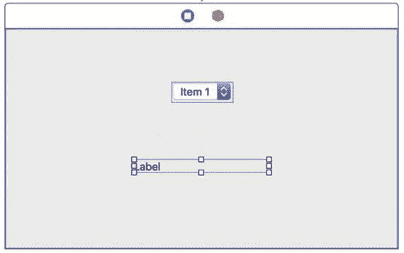

    图 17-10. PopupProgram 的用户界面

11.  选择“View ➤ Assistant Editor ➤ Show Assistant Editor”。Xcode 会将`ViewController.swift`文件显示在你的用户界面旁边。
12.  将鼠标指针移到标签上，按住 `Control` 键，将其拖到`ViewController.swift`文件中`IBOutlet`行的下方。
13.  松开 `Control` 键和鼠标。系统会弹出一个窗口。
14.  点击“Name”文本框，输入`labelChoice`，然后点击“Connect”按钮。Xcode 会创建一个`IBOutlet`，如下所示：

```
    @IBOutlet weak var labelChoice: NSTextField!
```

15.  将鼠标指针移到弹出按钮上，按住 `Control` 键，将其拖到`AppDelegate.swift`文件底部最后一个花括号的上方。
16.  松开 `Control` 键和鼠标。系统会弹出一个窗口。
17.  点击“Connection”弹出菜单，选择“Action”。
18.  点击“Name”文本框，输入`showChoice`。
19.  点击“Type”弹出菜单，选择`NSPopUpButton`。然后点击“Connect”按钮。Xcode 会显示一个空的`IBAction`方法。
20.  按如下方式修改`IBAction`方法：

```
    @IBAction func showChoice(_ sender: NSPopUpButton) {
    labelChoice.stringValue =
    sender.titleOfSelectedItem!
    }
```

21.  选择“Product ➤ Run”。你的用户界面窗口会显示出来。
22.  点击弹出按钮。请注意，默认情况下，弹出按钮包含三个通用项，分别标记为`Item 1`、`Item 2`和`Item 3`。
23.  点击一个选项。你选择的选项会出现在标签中。
24.  选择“PopupProgram ➤ Quit PopupProgram”。


### 以可视化方式修改弹出按钮菜单项

弹出按钮默认包含三个菜单项的列表。不过，你随时可以对此列表中的项目进行添加、编辑或删除。要编辑弹出菜单列表，请遵循以下步骤：

1.  双击用户界面上的弹出按钮。当前菜单项列表即会显示，如图 17-11 所示。

    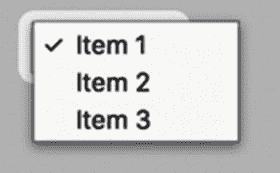

    图 17-11. 双击弹出按钮会显示其菜单项列表

2.  双击你想要编辑的菜单项。Xcode 会高亮所选菜单项的文本，如图 17-12 所示。

    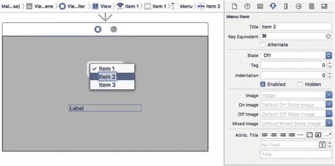

    图 17-12. 双击菜单项可编辑其文本。注意：你也可以选择“视图”>“工具”>“显示属性检查器”，然后通过编辑所选菜单项的 `Title` 属性来修改菜单项文本。

3.  使用方向键、`Backspace` 或 `Delete` 键来编辑文本，并输入任何新文本。
4.  按下 `Return` 键。Xcode 便会保存你对该菜单项编辑后的文本。

要从弹出按钮中删除菜单项，请遵循以下步骤：

1.  双击用户界面上的弹出按钮。当前菜单项列表即会显示（见图 17-11）。
2.  单击你想要删除的菜单项。Xcode 会高亮你所选的菜单项。
3.  按下 `Backspace` 或 `Delete` 键。你所选的菜单项便会消失。

注意：如果你误删了某菜单项，只需按下 `Command + Z` 或选择“编辑”>“撤销”来撤销删除操作。

要向弹出按钮添加一个菜单项，请遵循以下步骤：

1.  双击用户界面上的弹出按钮。当前菜单项列表即会显示（见图 17-11）。
2.  选择“视图”>“工具”>“显示对象库”。对象库随即显示在 Xcode 窗口的右下角。
3.  在对象库底部的搜索字段中输入 `menu item` 并按下 `Return` 键。对象库会显示一个菜单项列表，如图 17-13 所示。

    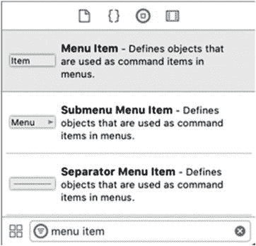

    图 17-13. 对象库中的菜单项列表

4.  将菜单项从对象库拖到用户界面弹出按钮中存储的菜单项列表上。一条水平的蓝色线条会指示新菜单项在弹出按钮列表中出现的位置。
5.  松开鼠标按钮。Xcode 便会向弹出按钮列表添加一个菜单项。

### 使用 Swift 代码添加弹出菜单项

除了以可视化方式修改弹出按钮中的菜单项外，你也可以使用 Swift 代码来添加、删除或更改菜单项。弹出按钮的菜单项基于 `NSMenuItem` 类，但你可以在 `NSMenu` 类中找到操作弹出按钮菜单项列表所需的方法。

如果你想为弹出按钮仅添加一个新的菜单项，可以使用 `addItemWithTitle` 方法并指定一个字符串，例如：

```
myPopUp.addItem(withTitle: "New Item")
```

你也可以通过将新菜单项存储在一个数组中，并使用 `addItemsWithTitles` 方法来添加多个菜单项，例如：

```
myPopUp.addItems(withTitles: ["Cat", "Dog", "Bird", "Fish", "Reptile"])
```

你可以使用 `removeItem` 方法移除单个菜单项，该方法需要一个 `Int` 值来指定要移除的项目。弹出按钮列表中的第一个项目索引为 0，第二个为 1，以此类推。要从弹出按钮列表中移除第一个项目，你使用索引值 0，如下所示：

```
myPopUp.removeItem(at: 0)
```

要移除弹出按钮菜单列表中的所有项目，只需使用 `removeAllItems()` 方法，它会清空整个列表，无论该列表中当前存储了多少项目。

要了解如何使用 Swift 代码在弹出按钮菜单列表中添加和删除项目，请遵循以下步骤：

1.  在 Xcode 中，选择“文件”>“新建”>“项目”。
2.  在 macOS 类别下单击“应用程序”。
3.  单击“Cocoa 应用程序”，然后单击“下一步”按钮。Xcode 会要求输入产品名称。
4.  在“产品名称”文本字段中单击并输入 `EditPopProgram`。
5.  确保“语言”弹出菜单显示为 Swift，并且“使用故事板”复选框已被选中。
6.  单击“下一步”按钮。Xcode 会询问你想要存储项目的位置。
7.  选择一个文件夹来存储你的项目，然后单击“创建”按钮。
8.  在项目导航器中单击 `Main.storyboard` 文件。你的程序的用户界面随即显示。
9.  选择“视图”>“工具”>“显示对象库”。对象库随即显示在 Xcode 窗口的右下角。
10. 将一个弹出按钮、三个“推送按钮”和一个文本字段拖到用户界面窗口上，并编辑两个“推送按钮”的标题，使其看起来如图 17-14 所示。

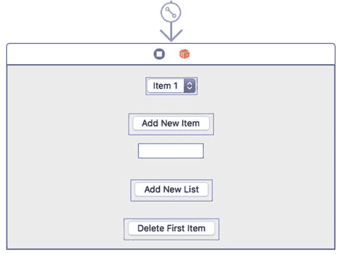

图 17-14. EditPopProgram 的用户界面

11. 选择“视图”>“助手编辑器”>“显示助手编辑器”。Xcode 会在你的用户界面旁边显示 `ViewController.swift` 文件。
12. 将鼠标指针移到弹出按钮上，按住 Control 键，然后将鼠标拖到 `ViewController.swift` 文件顶部附近的 `IBOutlet` 行下方。
13. 松开 Control 键和鼠标。一个弹出窗口会出现。
14. 在“名称”文本字段中单击并输入 `myPopUp`。然后单击“连接”按钮。Xcode 会创建一个 `IBOutlet`。
15. 将鼠标指针移到文本字段上，按住 Control 键，然后将鼠标拖到 `ViewController.swift` 文件顶部附近的 `IBOutlet` 行下方。
16. 松开 Control 键和鼠标。一个弹出窗口会出现。
17. 在“名称”文本字段中单击并输入 `newItem`。然后单击“连接”按钮。Xcode 会创建另一个 `IBOutlet`，因此你应该有两个 `IBOutlet`，看起来像这样：

```
@IBOutlet weak var myPopUp: NSPopUpButton!
@IBOutlet weak var newItem: NSTextField!
```


18.  将鼠标指针移到`Add New Item`按钮上，按住`Control`键，然后将鼠标拖拽到`ViewController.swift`文件底部最后一个花括号的上方。
19.  松开`Control`键和鼠标。将出现一个弹出窗口。
20.  单击`Connection`弹出菜单并选择`Action`。
21.  单击`Name`文本字段并键入`addNewItem`。
22.  单击`Type`弹出菜单并选择`NSButton`，然后单击`Connect`按钮。Xcode 会创建一个空的`IBAction`方法。
23.  将鼠标指针移到`Delete First Item`按钮上，按住`Control`键，然后将鼠标拖拽到`ViewController.swift`文件底部最后一个花括号的上方。
24.  松开`Control`键和鼠标。将出现一个弹出窗口。
25.  单击`Connection`弹出菜单并选择`Action`。
26.  单击`Name`文本字段并键入`deleteFirstItem`。
27.  单击`Type`弹出菜单并选择`NSButton`，然后单击`Connect`按钮。Xcode 会创建一个空的`IBAction`方法。
28.  将鼠标指针移到`Add New List`按钮上，按住`Control`键，然后将鼠标拖拽到`ViewController.swift`文件底部最后一个花括号的上方。
29.  松开`Control`键和鼠标。将出现一个弹出窗口。
30.  单击`Connection`弹出菜单并选择`Action`。
31.  单击`Name`文本字段并键入`addList`。
32.  单击`Type`弹出菜单并选择`NSButton`，然后单击`Connect`按钮。Xcode 会创建另一个空的`IBAction`方法。
33.  按如下所示修改所有三个`IBAction`方法：

```
@IBAction func addNewItem(_ sender: NSButton) {
myPopUp.addItem(withTitle: newItem.stringValue)
}
@IBAction func addList(_ sender: NSButton) {
myPopUp.removeAllItems()
myPopUp.addItems(withTitles: ["Cat", "Dog", "Bird", "Fish", "Reptile"])
}
@IBAction func deleteFirstItem(_ sender: NSButton) {
myPopUp.removeItem(at: 0)
}
```

`addNewItem` `IBAction`方法从文本字段获取文本，并使用`addItem`方法将该文本作为新的菜单项添加到弹出按钮的列表中。`deleteFirstItem` `IBAction`方法使用`removeItem`方法删除弹出按钮列表中的第一个菜单项。`addList` `IBAction`方法使用`removeAllItems`方法清除弹出按钮中的当前列表，然后将其替换为一个新的字符串数组。
34.  选择“产品” ➤ “运行”。你的用户界面将会出现。
35.  单击弹出按钮。请注意，菜单项列表显示三个项目，分别标记为`Item 1`、`Item 2`和`Item 3`。
36.  单击弹出按钮以外的区域，使菜单项列表不再显示。
37.  单击`Delete First Item`按钮。
38.  单击弹出按钮。请注意，菜单项列表现在只显示两个项目，分别标记为`Item 2`和`Item 3`。
39.  单击文本字段并输入`My Item`。
40.  单击`Add New Item`按钮。
41.  单击弹出按钮。请注意，现在菜单项列表显示三个项目，分别标记为`Item 2`、`Item 3`和`My Item`。
42.  单击`Add New List`按钮。
43.  单击弹出按钮。请注意，现在菜单项列表显示在`addList` `IBAction`方法内部定义的字符串数组。
44.  选择`EditPopProgram` ➤ 退出`EditPopProgram`。

### 总结

按钮代表用户可以单击以选择某个选项的命令。Xcode 提供了几种不同类型的按钮，可以放置在用户界面上，但它们都基于 Cocoa 框架中定义的同一个`NSButton`类。

并非所有按钮都显示文本，但那些显示文本的按钮使用`Title`属性来保存文本。如果你想在按钮上显示图像，可以使用`Image`属性来定义图像。如果你将按钮的`Type`属性更改为开关或切换按钮，那么你可以让按钮显示存储在`Title`属性中的文本，以及显示在`Alternate Text`属性和/或`Alternate Image`属性中的文本。

如果你需要向用户提供多个选项，在用户界面上放置多个按钮可能会显得杂乱无章。一个更简单的替代方案是使用弹出按钮，它可以显示一个选项列表，你可以通过可视化方式或 Swift 代码对其进行修改。

按钮通常连接到单个`IBAction`方法，但你可以将多个按钮链接到同一个`IBAction`方法。当将多个用户界面项连接到一个`IBAction`方法时，你需要使用 Swift 代码，通过唯一标识每个按钮的`Tag`属性来识别调用该`IBAction`方法的用户界面项。按钮是向用户提供可选择选项最直接的方式。

