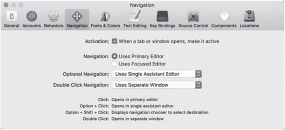
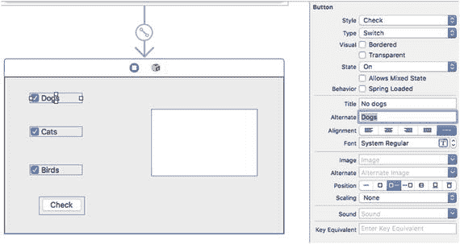
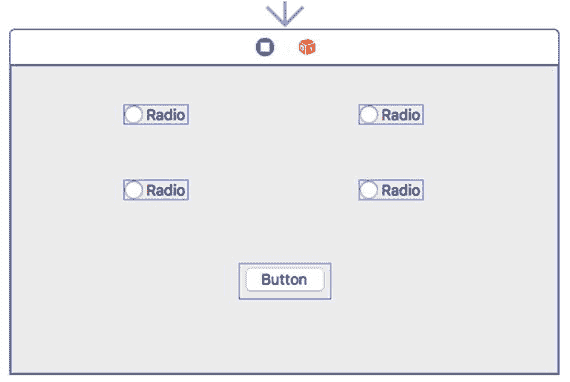
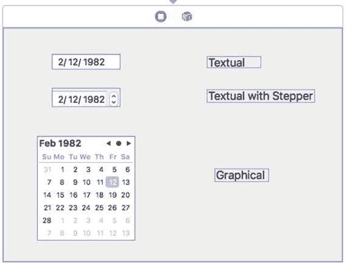
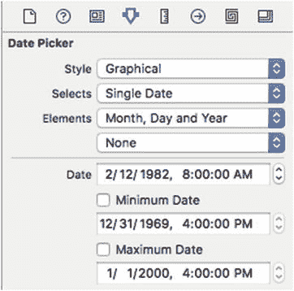
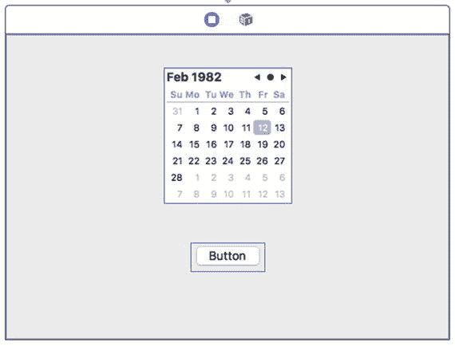
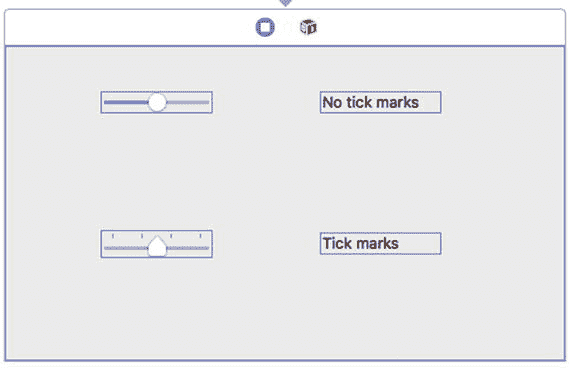
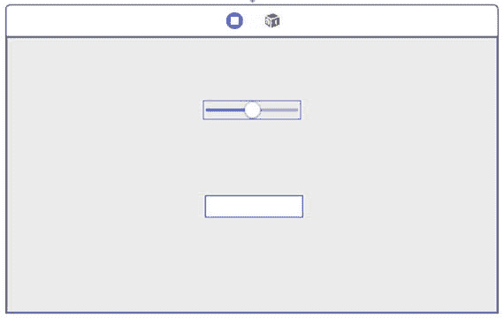

# 18. 使用单选按钮、复选框、日期选择器和滑块做出选择

用户界面通常不会让用户通过按钮选择特定命令，而是提供选择项供用户挑选。这些选择项允许用户选择一个或多个选项，例如自定义程序的工作方式。当用户界面需要提供多个选项时，最常见的两种提供选项的方式是通过单选按钮和复选框。

单选按钮的名称来源于汽车收音机，它允许你按下一个按钮来切换到不同的广播电台。由于一次只能收听一个广播电台，因此单选按钮为你提供了多个选项，但限制你只能选择一个按钮。一旦你选择了另一个按钮，你之前的选择就不再被选中。对于单选按钮，你可以选择零个按钮，或者一次只选择一个按钮。

复选框的工作方式略有不同。与单选按钮类似，复选框也提供多个选择。主要区别在于，对于一组复选框，你可以同时选择零个或多个复选框，因此可以一次选择多个选项。

当需要将用户限制为零个或一个选择时，请使用单选按钮。当需要让用户选择零个或多个选项时，请使用复选框。图 18-1 显示了 Xcode 偏好设置对话框，该对话框同时使用单选按钮和复选框让用户自定义 Xcode 的行为。



图 18-1.

Xcode 偏好设置对话框同时使用单选按钮和复选框让用户选择选项。

虽然单选按钮和复选框通常用于显示以文本形式呈现的选择项，但日期选择器会显示不同类型的日期供用户选择。然后日期选择器会将用户的选择存储为一种特殊的日期格式（而不是表示月份的单独文本或表示日期的数字）。

通过以特殊格式存储日期，你的程序可以根据用户在其计算机上的设置正确地显示日期。例如，在世界某些地方，他们按 `mm/dd/yyyy` 格式显示日期。而在世界其他地方，他们则按 `dd/mm/yyyy` 格式显示日期。

日期选择器使用一种特殊的日期格式，这样计算机就可以根据用户当前的设置正确地显示格式，而无需担心每台用户电脑上的特定日期格式设置。

与单选按钮和复选框一样，日期选择器为用户提供一组固定但有限的、有效的选项以供选择。这确保了无论用户做出何种选择，该选择对你的程序来说都是可接受的。

复选框和单选按钮适合为用户提供有限范围的选项，这些选项通常是文本形式。如果要为用户提供一系列数值选项，则可以使用滑块。滑块让用户可以直观地选择有效的数值范围。


## 使用复选框

你可以单独使用一个复选框，也可以将多个复选框组合使用。复选框实际上基于`NSButton`类，尽管它的外观和行为与典型按钮大不相同。对于复选框而言，最重要的三个属性是：

*   **标题**：显示在复选框旁边，描述供用户选择的选项的文本。
*   **状态**：确定复选框是选中（1）还是未选中（0）。
*   **替代文本**：复选框未选中时显示的文本。（复选框选中时显示标题文本。）

要了解复选框的工作原理，请按照以下步骤操作：

1.  在 Xcode 中选择“文件”➤“新建”➤“项目”。
2.  在 macOS 类别下点击“应用程序”。
3.  点击“Cocoa 应用程序”，然后点击“下一步”按钮。Xcode 现在会要求您输入产品名称。
4.  点击“产品名称”文本字段，输入 `CheckProgram`。
5.  确保“语言”弹出菜单显示“Swift”，并且“使用故事板”复选框已选中。
6.  点击“下一步”按钮。Xcode 会询问您希望将项目存储在哪里。
7.  选择一个文件夹来存储项目，然后点击“创建”按钮。
8.  在项目导航器中点击 `MainMenu.xib` 文件。您的程序用户界面将会出现。
9.  选择“视图”➤“实用工具”➤“显示对象库”。对象库会出现在 Xcode 窗口的右下角。
10. 将一个推送按钮、三个复选框和一个可换行的文本字段拖到用户界面窗口中。请确保调整可换行文本字段和所有复选框的宽度，使其看起来像图 18-2。



图 18-2. CheckProgram 的用户界面

11. 选择“视图”➤“实用工具”➤“显示属性检查器”。“显示属性检查器”面板会出现在 Xcode 窗口的右上角。
12. 点击顶部的复选框，在“显示属性检查器”面板中，将其标题改为“无狗”，替代文本改为“狗”。
13. 点击中间的复选框，在“显示属性检查器”面板中，将其标题改为“无猫”，替代文本改为“猫”。
14. 点击顶部的复选框，在“显示属性检查器”面板中，将其标题改为“无鸟”，替代文本改为“鸟”。
15. 双击推送按钮，将其标题改为“检查”。
16. 选择“视图”➤“助理编辑器”➤“显示助理编辑器”。Xcode 会在用户界面旁边显示 `ViewController.swift` 文件。
17. 将鼠标指针移到“狗”复选框上，按住 Control 键，将鼠标拖到 `ViewController.swift` 文件中 `IBOutlet` 行下方。
18. 松开 Control 键和鼠标。会弹出一个窗口。
19. 点击“名称”文本字段，输入 `dogBox`，然后点击“连接”按钮。
20. 将鼠标指针移到“猫”复选框上，按住 Control 键，将鼠标拖到 `ViewController.swift` 文件中 `IBOutlet` 行下方。
21. 松开 Control 键和鼠标。会弹出一个窗口。
22. 点击“名称”文本字段，输入 `catBox`，然后点击“连接”按钮。
23. 将鼠标指针移到“鸟”复选框上，按住 Control 键，将鼠标拖到 `ViewController.swift` 文件中 `IBOutlet` 行下方。
24. 松开 Control 键和鼠标。会弹出一个窗口。
25. 点击“名称”文本字段，输入 `birdBox`，然后点击“连接”按钮。
26. 将鼠标指针移到可换行文本字段上，按住 Control 键，将鼠标拖到 `ViewController.swift` 文件中 `IBOutlet` 行下方。
27. 松开 Control 键和鼠标。会弹出一个窗口。
28. 点击“名称”文本字段，输入 `messageBox`，然后点击“连接”按钮。您现在应该拥有了四个新的 `IBOutlet`，如下所示：

```
@IBOutlet weak var dogBox: NSButton!
@IBOutlet weak var catBox: NSButton!
@IBOutlet weak var birdBox: NSButton!
@IBOutlet weak var messageBox: NSTextField!
```

29. 将鼠标指针移到“检查”推送按钮上，按住 Control 键，将鼠标拖到 `ViewController.swift` 文件底部最后一个花括号上方。
30. 松开 Control 键和鼠标。会弹出一个窗口。
31. 点击“连接”弹出菜单，选择“动作”。
32. 点击“名称”文本字段，输入 `checkBoxes`。
33. 点击“类型”弹出菜单，选择 `NSButton`。
34. 点击“连接”按钮。Xcode 会创建一个空的 `IBAction` 方法。
35. 按如下方式修改此 `checkBoxes` `IBAction` 方法：

```
@IBAction func checkBoxes(_ sender: NSButton) {
    let nextLine = "\r\n"
    var message : String = ""
    if dogBox.state == 1 {
        message = "狗复选框已选中" + nextLine
    } else {
        message = "狗复选框未选中" + nextLine
    }
    if catBox.state == 1 {
        message = message + "猫复选框已选中" + nextLine
    } else {
        message = message + "猫复选框未选中" + nextLine
    }
    if birdBox.state == 1 {
        message = message + "鸟复选框已选中" + nextLine
    } else {
        message = message + "鸟复选框未选中" + nextLine
    }
    messageBox.stringValue = message
}
```

此代码创建了一个常量（`nextLine`），它代表一个回车符（`\r`）和一个换行符（`\n`）。它声明了一个可以保存 `String` 数据类型的消息变量，并且初始包含 `""`，一个空字符串。多个 `if`-`else` 语句检查每个复选框的 `State` 属性，以确定它是选中（`state = 1`）还是未选中（`state = 0`）。然后，它会将结果显示在可换行文本字段中，该字段由一个名为 `messageBox` 的 `IBOutlet` 变量表示。

36. 选择“产品”➤“运行”。您的用户界面将会出现。
37. 点击不同的复选框。注意，每次选择或取消选择复选框时，标题或替代文本都会出现。
38. 点击“检查”推送按钮。可换行文本字段会识别出您选中了哪些复选框以及哪些复选框是未选中的。
39. 选择“CheckProgram”➤“退出 CheckProgram”。


## 使用单选按钮

与允许用户选择多个选项的复选框不同，单选按钮会显示多个选项，但每次只允许用户选择一个。当用户选择另一个单选按钮时，当前选中的单选按钮会自动取消选中。

要识别用户选择了哪个单选按钮，你需要更改每个单选按钮的 `Tag` 属性。然后，你可以使用 `selectedTag()` 方法来获取选中的单选按钮。

若要了解如何使用单选按钮，请按照以下步骤操作：

1.  在 Xcode 中，选择“文件”>“新建”>“项目”。
2.  在 macOS 类别下，点击“应用程序”。
3.  点击“Cocoa 应用程序”，然后点击“下一步”按钮。Xcode 现在会要求输入产品名称。
4.  点击“产品名称”文本字段，然后输入 `RadioProgram`。
5.  确保“语言”弹出菜单显示为 Swift，并且勾选了“使用故事板”复选框。
6.  点击“下一步”按钮。Xcode 会询问你要将项目存储在哪里。
7.  选择一个文件夹来存储你的项目，然后点击“创建”按钮。
8.  在项目导航器中点击 `Main.storyboard` 文件。你的程序用户界面会显示出来。
9.  点击 `RadioProgram` 图标以显示程序用户界面的窗口。
10. 选择“视图”>“工具”>“显示对象库”。对象库会出现在 Xcode 窗口的右下角。
11. 将一个按钮和四个单选按钮拖到用户界面窗口上，使其看起来像图 18-3 所示。



图 18-3. `RadioProgram` 的用户界面

12. 点击左上角的单选按钮，并确保在“属性检查器”面板的“视图”类别中，其 `Tag` 属性设置为 `0`。
13. 点击右上列的单选按钮，并确保其 `Tag` 属性设置为 `1`。
14. 点击左下角的单选按钮，并确保其 `Tag` 属性设置为 `2`。
15. 点击右下角的单选按钮，并确保在“显示属性检查器”面板中，其 `Tag` 属性设置为 `3`。
16. 选择“视图”>“辅助编辑器”>“显示辅助编辑器”。`ViewController.swift` 文件会出现在用户界面旁边。
17. 将鼠标指针移到左上角的单选按钮上，按住 Control 键，然后拖拽到 `IBOutlet` 代码行下方。
18. 松开 Control 键和鼠标。此时会出现一个弹出窗口。
19. 点击“名称”文本字段，然后输入 `radioZero`。一个 `IBOutlet` 出现，如下所示：

```
@IBOutlet weak var radioZero: NSButton!
```

20. 选择“视图”>“工具”>“显示属性检查器”。
21. 向下滚动“属性检查器”面板，确保 `Tab` 属性为 `0`。
22. 将鼠标指针移到右上角的单选按钮上，按住 Control 键，然后拖拽到 `IBOutlet` 代码行下方。
23. 松开 Control 键和鼠标。此时会出现一个弹出窗口。
24. 点击“名称”文本字段，然后输入 `radioOne`。
25. 选择“视图”>“工具”>“显示属性检查器”。
26. 向下滚动“属性检查器”面板，并将 `Tab` 属性更改为 `1`。
27. 将鼠标指针移到左下角的单选按钮上，按住 Control 键，然后拖拽到 `IBOutlet` 代码行下方。
28. 松开 Control 键和鼠标。此时会出现一个弹出窗口。
29. 点击“名称”文本字段，然后输入 `radioTwo`。
30. 选择“视图”>“工具”>“显示属性检查器”。
31. 向下滚动“属性检查器”面板，并将 `Tab` 属性更改为 `2`。
32. 将鼠标指针移到右下角的单选按钮上，按住 Control 键，然后拖拽到 `IBOutlet` 代码行下方。
33. 松开 Control 键和鼠标。此时会出现一个弹出窗口。
34. 点击“名称”文本字段，然后输入 `radioThree`。你应该拥有如下四个 `IBOutlet`：

```
@IBOutlet weak var radioZero: NSButton!
@IBOutlet weak var radioOne: NSButton!
@IBOutlet weak var radioTwo: NSButton!
@IBOutlet weak var radioThree: NSButton!
```

35. 选择“视图”>“工具”>“显示属性检查器”。
36. 向下滚动“属性检查器”面板，并将 `Tab` 属性更改为 `3`。
37. 在四个 `IBOutlet` 下方输入以下内容：

```
var radioButtonSelected : String?
```

38. 将鼠标指针移到按钮上，按住 Control 键，然后将鼠标拖拽到 `ViewController.swift` 文件底部最后一个大括号上方。
39. 松开 Control 键和鼠标。此时会出现一个弹出窗口。
40. 点击“连接”弹出菜单并选择“动作”。
41. 点击“名称”文本字段，然后输入 `displayButton`。
42. 点击“类型”弹出菜单并选择 `NSButton`。
43. 点击“连接”按钮。Xcode 会创建一个空的 `IBAction` 方法。
44. 按如下方式修改 `IBAction` 方法：

```
@IBAction func displayButton(_ sender: NSButton) {
    let myAlert = NSAlert()
    if radioButtonSelected != nil {
        myAlert.messageText = "你点击了位于 " + radioButtonSelected! + " 的单选按钮"
    } else {
        myAlert.messageText = "未选择任何单选按钮"
    }
    myAlert.runModal()
}
```

45. 将鼠标指针移到左上角的单选按钮上，按住 Control 键，然后将鼠标拖拽到 `ViewController.swift` 文件底部最后一个大括号上方。
46. 松开 Control 键和鼠标。此时会出现一个弹出窗口。
47. 点击“连接”弹出菜单并选择“动作”。
48. 点击“名称”文本字段，然后输入 `whichRadioButton`。
49. 点击“类型”弹出菜单并选择 `NSButton`。
50. 点击“连接”按钮。Xcode 会创建一个空的 `IBAction` 方法。
51. 按如下方式修改 `IBAction` 方法：

```
@IBAction func whichRadioButton(_ sender: NSButton) {
    switch sender.tag {
    case 0 :
        radioOne.state = 0
        radioTwo.state = 0
        radioThree.state = 0
        radioButtonSelected = "左上角"
    case 1 :
        radioZero.state = 0
        radioTwo.state = 0
        radioThree.state = 0
        radioButtonSelected = "右上角"
    case 2 :
        radioZero.state = 0
        radioOne.state = 0
        radioThree.state = 0
        radioButtonSelected = "左下角"
    case 3 :
        radioZero.state = 0
        radioOne.state = 0
        radioTwo.state = 0
        radioButtonSelected = "右下角"
    default:
        radioButtonSelected = "未选择任何单选按钮"
    }
}
```

52. 将鼠标指针移到右上角的单选按钮上，按住 Control 键，然后将鼠标拖拽到 `ViewController.swift` 文件中 `whichRadioButton` 这个 `IBAction` 函数的 `func` 关键字上，直到整个函数高亮显示。
53. 松开鼠标和 Control 键。
54. 将鼠标指针移到左下角的单选按钮上，按住 Control 键，然后将鼠标拖拽到 `ViewController.swift` 文件中 `whichRadioButton` 这个 `IBAction` 函数的 `func` 关键字上，直到整个函数高亮显示。
55. 松开鼠标和 Control 键。
56. 将鼠标指针移到右下角的单选按钮上，按住 Control 键，然后将鼠标拖拽到 `ViewController.swift` 文件中 `whichRadioButton` 这个 `IBAction` 函数的 `func` 关键字上，直到整个函数高亮显示。
57. 松开鼠标和 Control 键。现在所有四个单选按钮都应该连接到 `whichRadioButton` 这个 `IBAction` 函数上。
58. 选择“产品”>“运行”。你的用户界面会出现。
59. 点击一个单选按钮，然后点击按钮。会出现一个提醒对话框，显示你选择的单选按钮。
60. 点击“确定”按钮关闭提醒对话框。
61. 选择 `RadioProgram` > “退出 RadioProgram”。


`radioButtonSelected`变量的目的是保存一个字符串，用于标识用户选择了哪个单选按钮。最初，没有选中任何单选按钮，因此`radioButtonSelected`变量是一个可选变量。

`displayButton` IBAction 函数会创建一个警告对话框，并检查`radioButtonSelected`变量中是否有值。如果有，则显示该值；如果没有，则显示“No radio button selected”。

`whichRadioButton` IBAction 函数通过单选按钮的 Tag 属性来识别用户点击了哪个单选按钮。此外，点击任何单选按钮都会取消选择所有其他单选按钮，因此一次只能选中一个单选按钮。

请注意，您已将四个单选按钮全部连接到了 IBAction `whichRadioButton`函数。这意味着无论何时点击其中任何一个单选按钮，`whichRadioButton`函数都会运行。

## 使用日期选择器

日期选择器使用户能够以正确的格式轻松选择日期和/或时间。日期选择器的三种外观类型如图 18-4 所示：



图 18-4. 日期选择器的三种变体

*   **文本型**：在文本字段中显示日期，要求用户键入正确的日期
*   **带步进器的文本型**：在文本字段中显示日期，用户可以通过单击步进器来修改当前选中的日期部分
*   **图形型**：显示一个日历，用户可以直接点击选择日期

日期选择器中可修改的一些属性如图 18-5 所示：



图 18-5. 属性检查器窗格中的日期选择器属性

*   **Style**：决定日期选择器的外观
*   **Selects**：决定用户是选择单个日期还是一个日期范围
*   **Elements**：决定显示哪些日期和时间元素，例如月、日、年、时、分和秒
*   **Minimum Date**：定义可能的最早日期
*   **Maximum Date**：定义可能的最晚日期
*   **Date**：定义当前显示的日期和/或时间

若要从日期选择器中检索用户选择的日期，您需要访问`dateValue`属性，该属性表示`NSDate`类型。

要了解如何使用日期选择器，请按以下步骤操作：

1.  在 Xcode 中，选择 **File** ➤ **New** ➤ **Project**。
2.  在 **macOS** 类别下点击 **Application**。
3.  点击 **Cocoa Application**，然后点击 **Next** 按钮。Xcode 现在会要求输入产品名称。
4.  点击 **Product Name** 文本字段，输入`DateProgram`。
5.  确保 **Language** 弹出菜单显示为 **Swift**，并且所有复选框都为清除且未选中状态。
6.  点击 **Next** 按钮。Xcode 会询问您要存储项目的位置。
7.  选择一个文件夹来存储您的项目，然后点击 **Create** 按钮。
8.  在项目导航器窗格中点击`Main.storyboard`文件。
9.  将一个**推送按钮**和一个**日期选择器**拖到用户界面上。
10. 点击日期选择器，然后选择 **View** ➤ **Utilities** ➤ **Show Attributes Inspector**。
11. 点击 **Style** 弹出菜单，选择 **Graphical**，使日期选择器看起来像月历，如图 18-6 所示。



图 18-6. DateProgram 的用户界面
12. 选择 **View** ➤ **Assistant Editor** ➤ **Show Assistant Editor**。Xcode 会在用户界面旁边显示`ViewController.swift`文件。
13. 将鼠标指针移到日期选择器上，按住 **Control** 键，然后将其拖到`ViewController.swift`文件中的`IBOutlet`行下方。
14. 松开 **Control** 键和鼠标按钮。此时会出现一个弹出窗口。
15. 点击 **Name** 文本字段，输入`chooseDate`，然后点击 **Connect** 按钮。Xcode 会创建一个类似这样的 IBOutlet：

```
@IBOutlet weak var chooseDate: NSDatePicker!
```

16. 将鼠标指针移到推送按钮上，按住 **Control** 键，然后将其拖到`ViewController.swift`文件底部最后一个花括号上方。
17. 松开 **Control** 键和鼠标。此时会出现一个弹出窗口。
18. 点击 **Connect** 弹出菜单，选择 **Action**。
19. 点击 **Name** 文本字段，输入`showDate`。
20. 点击 **Type** 弹出菜单，选择 **NSButton**。然后点击 **Connect** 按钮。Xcode 会创建一个 IBAction 方法。
21. 按如下方式修改此 IBAction 方法：

```
@IBAction func showDate(_ sender: NSButton) {
    let myAlert = NSAlert()
    myAlert.messageText = "You chose this date =  \(chooseDate.dateValue)"
    myAlert.runModal()
}
```

22. 选择 **Product** ➤ **Run**。您的用户界面会出现。
23. 在日期选择器上选择一个日期，然后点击推送按钮。会弹出一个警告对话框，显示您选择的日期。
24. 点击 **OK** 按钮关闭此警告对话框。
25. 选择 **DateProgram** ➤ **Quit DateProgram**。


## 使用滑块

滑块可以垂直或水平显示。滑块直观地表示一系列数值范围，用户可以通过前后（或上下）拖动滑块进行选择。一端代表最小值（左侧或底部），另一端代表最大值（右侧或顶部）。为了帮助用户理解滑块表示的不同数值，您还可以选择显示刻度线，如图 18-7 所示。



图 18-7. 带有和不带刻度线的滑块外观

在滑块上定义的一些比较重要的属性包括：

- **刻度线（Tick Marks）**：定义刻度线的位置以及要显示的刻度线数量
- **最小值（Minimum）**：定义可能的最小值
- **最大值（Maximum）**：定义可能的最大值
- **当前值（Current）**：标识滑块首次出现在用户界面时的初始值

您可以使用 `integerValue` 属性来检索滑块的当前值，并将该值显示在另一个用户界面项（如文本字段）中。要了解如何操作，请按照以下步骤进行：

1. 在 `Xcode` 中，选择 **文件** ➤ **新建** ➤ **项目**。
2. 点击 `macOS` 类别下的 **应用程序**。
3. 点击 **Cocoa 应用程序**，然后点击 **下一步** 按钮。`Xcode` 现在会要求您输入产品名称。
4. 点击 **产品名称** 文本字段，然后输入 `SliderProgram`。
5. 确保 **语言** 弹出菜单显示为 `Swift`，并且 **“使用故事板”** 复选框处于选中状态。
6. 点击 **下一步** 按钮。`Xcode` 会询问您希望将项目存储在哪里。
7. 选择一个文件夹来存储您的项目，然后点击 **创建** 按钮。
8. 在 **项目导航器** 窗格中点击 `Main.storyboard` 文件。
9. 点击 `SliderProgram` 图标，使用户界面窗口显示出来。
10. 将一个水平滑块和一个文本字段拖到用户界面上，使其看起来如图 18-8 所示。

    

    图 18-8. `SliderProgram` 的用户界面

11. 选择 **视图** ➤ **助理编辑器** ➤ **显示助理编辑器**。`Xcode` 会在用户界面旁边显示 `ViewController.swift` 文件。
12. 将鼠标指针移到水平滑块上，按住 **Control** 键，然后将鼠标拖到 `ViewController.swift` 文件中 `IBOutlet` 行的下方。
13. 松开 **Control** 键和鼠标。会弹出一个窗口。
14. 点击 **名称** 文本字段，输入 `mySlider`，然后点击 **连接** 按钮。
15. 将鼠标指针移到文本字段上，按住 **Control** 键，然后将鼠标拖到 `ViewController.swift` 文件中 `IBOutlet` 行的下方。
16. 松开 **Control** 键和鼠标。会弹出一个窗口。
17. 点击 **名称** 文本字段，输入 `sliderValue`，然后点击 **连接** 按钮。您现在应该拥有这两个 `IBOutlet`：

    ```swift
    @IBOutlet weak var mySlider: NSSlider!
    @IBOutlet weak var sliderValue: NSTextField!
    ```

18. 将鼠标指针移到水平滑块上，按住 **Control** 键，然后将鼠标拖到 `AppDelegate.swift` 文件底部最后一个花括号的上方。
19. 松开 **Control** 键和鼠标。会弹出一个窗口。
20. 点击 **连接** 弹出菜单，然后选择 **动作**。
21. 点击 **名称** 文本字段，然后输入 `getValue`。
22. 点击 **类型** 弹出菜单，然后选择 `NSSlider`。接着点击 **连接** 按钮。`Xcode` 会创建一个空的 `IBAction` 方法。
23. 按如下方式修改此 `IBAction` 方法：

    ```swift
    @IBAction func getValue(_ sender: NSSlider) {
        sliderValue.integerValue = mySlider.integerValue
    }
    ```

24. 选择 **产品** ➤ **运行**。您的用户界面将会显示。
25. 左右拖动滑块。请注意，每次拖动滑块并松开鼠标按钮时，滑块的当前值都会出现在文本框中。
26. 选择 **SliderProgram** ➤ **退出 SliderProgram**。

### 摘要

复选框、单选按钮和日期选择器允许您向用户提供一系列有效的选项供其选择。这确保了用户不会意外地（或故意地）向程序提供无效数据。

复选框允许用户选择零个或多个选项。一组单选按钮只允许用户选择一个选项。日期选择器允许用户选择格式正确的日期。

要识别用户选择了哪些复选框，请检查每个复选框的 `State` 属性。如果 `State` 值为 1，则表示该复选框被选中。如果 `State` 值为 0，则表示该复选框未被选中。

可以在复选框和单选按钮上显示备选文本。这样，当复选框或单选按钮被选中时，会显示一种文本；当复选框或单选按钮未被选中时，则会显示另一种不同的文本。

要识别用户可能选择了哪个单选按钮，需要使用 `Tag` 属性。每个单选按钮需要一个唯一的 `Tag` 值，该值可以是整数。通过识别 `Tag` 值，就可以确定用户选择了哪个单选按钮。

日期选择器使用户可以轻松选择日期和/或时间。日期选择器将以特殊的 `NSDate` 格式存储所选日期/时间，您可以通过日期选择器的 `dateValue` 属性来访问该格式。

滑块允许用户从一系列有效的数值中进行选择。通过使用复选框、单选按钮、日期选择器和滑块，程序可以确保用户只能从一系列有效选项中进行选择。

