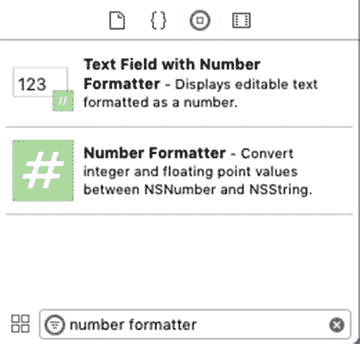
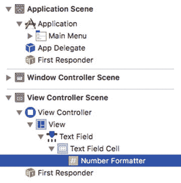
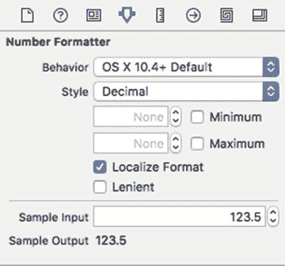
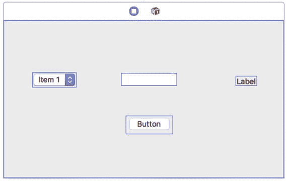
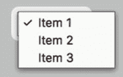
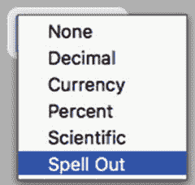
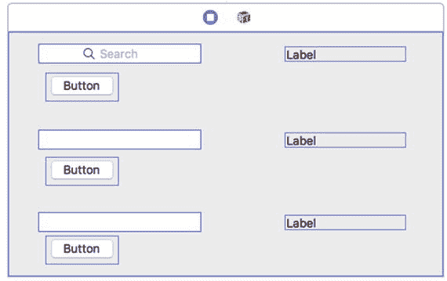
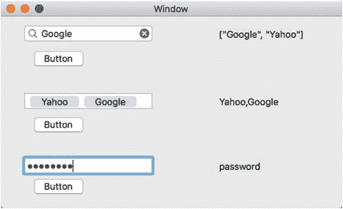
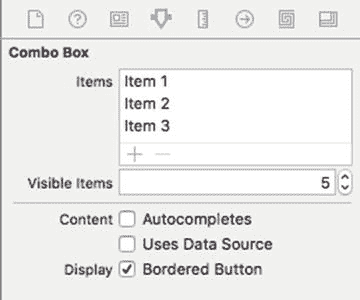
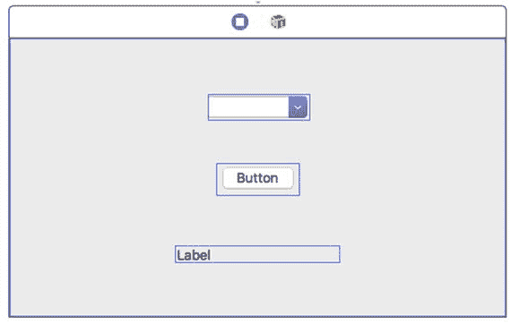

# 19. 将文本与标签、文本字段和组合框配合使用

当程序需要向用户提供有限范围的有效选项时，您会想要使用复选框、单选按钮、日期选择器或滑块。然而，有时程序需要允许用户输入永远无法提前预测的数据，例如人名。当程序需要允许用户输入数据时，您就需要使用文本字段或组合框。

文本字段允许用户输入数字、特殊字符或普通字母。这意味着程序可能需要验证用户输入的数据是否有效。

有时，程序可以为用户提供从有限的有效选项中进行选择，或者自行输入数据的选项。例如，程序可能要求用户选择一个国家。然后，程序可以提供一系列有限的可能选项，或者允许用户自由地输入其他内容。

这种既可以从有限的选项中进行选择，又可以自行输入内容的能力是组合框的主要优势。组合框之所以得名，是因为它结合了弹出按钮（显示有效选项列表）的功能和可以自由输入任何内容（如文本字段）的灵活性。

虽然文本字段和组合框用于接收用户输入的数据，但标签用于向用户显示信息。当您只需要显示信息时，例如显示说明或标识文本字段的用途（如提示用户输入姓名或地址），您会想要使用标签。标签、文本字段和组合框协同工作，在用户界面上接收和显示文本。


## 使用文本字段

由于用户可以在文本字段中输入任何内容，文本字段会以字符串形式存储数据，你可以通过 `stringValue` 属性获取该数据。不过，由于用户也可以输入整数或小数，文本字段足够灵活以识别这些数字。

如果用户输入整数，你可以通过访问 `intValue` 属性来获取该值。如果用户输入小数，你可以通过访问 `floatValue` 或 `doubleValue` 属性来获取该值。

无论用户在文本字段中输入什么，你都能获取到正确的值。由于文本字段可以接受字符串或数字，你的程序可以通过访问以下任一属性来获取正确的值：

- `intValue`：获取整数值。如果用户输入字符串，该属性存储 0。如果用户输入小数（例如 10.9），它只存储整数值（例如 10）。
- `floatValue` 或 `doubleValue`：获取浮点值或双精度值。如果用户输入字符串，该属性存储 0.0。如果用户输入整数（例如 4），`floatValue` 和 `doubleValue` 属性会将其存储为小数（例如 4.0）。
- `stringValue`：获取字符串值。如果用户输入数字，它会将该数字存储为字符串（例如 "4.305"）。

**注意：** 当用户在文本字段中输入文本时，该输入文本会存储在所有四个属性中：`intValue`、`floatValue`、`doubleValue` 和 `stringValue`。

除了标准文本字段，Xcode 还提供了几种用于处理不同类型文本输入的文本字段变体：

- **带数字格式器的文本字段**：定义可输入的数字类型
- **安全文本字段**：屏蔽输入的文本
- **搜索字段**：存储先前输入的文本列表
- **令牌字段**：允许用户除了输入普通文本外，还可以输入内容令牌

## 使用数字格式器

数字格式器让你可以定义用户能在文本框中输入的有效数字值，例如最小值或最大值，或特定的输入方式，比如带 `%` 符号，或输入“四”而不是 4。

Xcode 提供了两种方法来创建带数字格式器的文本字段。首先，你可以从“对象库”中拖放“带数字格式器的文本字段”并将其放置到你的用户界面上。其次，你可以从“对象库”中拖放“数字格式器”并将其放置到用户界面上已有的文本字段上。

找到这些项目最快的方法是在“对象库”底部的搜索文本字段中键入“数字格式器”，如图 19-1 所示。



**图 19-1.** “对象库”中的“带数字格式器的文本字段”和“数字格式器”

无论你是使用“带数字格式器的文本字段”项创建一个新的文本字段，还是将数字格式器应用于现有文本字段，你都需要定义数字格式器的设置。为此，你需要遵循以下几个步骤：

1. 点击**显示文稿大纲**图标以显示文稿大纲。
2. 点击使用数字格式器的文本字段左侧的展开三角形。
3. 点击文本字段下方的文本字段单元格左侧出现的展开三角形。
4. 点击数字格式器，如图 19-2 所示。



**图 19-2.** “数字格式器”出现在“文稿大纲”中

5. 选择**显示** ➤ **工具** ➤ **显示检查器**。“显示检查器”窗格会出现在 Xcode 窗口的右上角，如图 19-3 所示。



**图 19-3.** “显示检查器”窗格

**最小值**和**最大值**复选框允许你定义文本字段将接受的最小值和/或最大值。如果你定义最小值为 10，而用户输入的数字小于 10，则文本字段将不会接受该数字。

**本地化格式**复选框指示 Xcode 使用用户的本地设置来确定小数点和货币符号的显示方式。在世界上的某些地区，小数点使用句点，而在其他地区则使用逗号。

同样对于货币，欧洲人使用欧元符号，美国人使用美元符号，英国用户使用英镑符号。选中**本地化**复选框可确保你的文本字段数字格式器无论程序在世界上任何地方使用都能正常工作。

**样式**弹出菜单允许你定义数字格式化的不同方式。当你选择一种样式时，**示例**类别下的**未格式化**和**已格式化**文本字段会显示你的数字可能的外观。

例如，在图 19-3 中，选择**无**样式意味着，如果用户在带有数字格式器的文本字段中输入 1,234.75 并按回车键，该文本字段会将该数字格式化为简单的 1235。

然而，如果样式是**货币**、**百分比**、**科学计数**或**拼写数字**，则意味着用户可以按照**已格式化**示例所定义的方式输入数字，而文本字段将按照**未格式化**示例所示的方式存储该数字。

要了解如何使用这些不同的数字格式器，请遵循以下步骤：


1.  在 Xcode 中选择“文件”➤“新建”➤“项目”。
2.  在 macOS 类别下点击“应用程序”。
3.  点击“Cocoa 应用程序”，然后点击“下一步”按钮。Xcode 现在会要求输入产品名称。
4.  点击“产品名称”文本字段，输入 `NumberProgram`。
5.  确保“语言”弹出菜单显示为 Swift，并且“使用 Storyboard”复选框已被选中。
6.  点击“下一步”按钮。Xcode 会询问你希望将项目存储在何处。
7.  选择一个文件夹来存储你的项目，然后点击“创建”按钮。
8.  在项目导航器中点击 `Main.storyboard` 文件。你的程序用户界面将会出现。
9.  选择“视图”➤“工具”➤“显示对象库”。对象库会出现在 Xcode 窗口的右下角。
10. 将一个弹出按钮、一个普通按钮以及一个带有数字格式化器的文本字段（它看起来像一个普通的文本字段）拖拽到用户界面窗口上，使其看起来像图 19-4 所示。



图 19-4. NumberProgram 的用户界面

11. 双击弹出按钮。Xcode 会显示一个包含三个选项的列表，分别标记为“项目 1”、“项目 2”和“项目 3”，如图 19-5 所示。



图 19-5. 修改弹出按钮

12. 双击“项目 1”，当 Xcode 高亮它时，输入 `None`。
13. 双击“项目 2”，当 Xcode 高亮它时，输入 `Decimal`。
14. 双击“项目 3”，当 Xcode 高亮它时，输入 `Currency`。
15. 从对象库中拖拽三个菜单项到弹出按钮列表的底部。
16. 分别双击这三个新菜单项，并修改其名称，使其显示为 `Percent`、`Scientific` 和 `Spell Out`，如图 19-6 所示。



图 19-6. 修改后的弹出按钮菜单

17. 选择“视图”➤“助理编辑器”➤“显示助理编辑器”。`ViewController.swift` 文件会出现在用户界面的旁边。
18. 将鼠标指针移至弹出按钮上，按住 Control 键，然后将鼠标拖拽到 `IBOutlet` 行下方。
19. 松开 Control 键和鼠标。会弹出一个窗口。
20. 在“名称”文本字段中点击，输入 `popUpChoice`，然后点击“连接”按钮。一个 IBOutlet 会出现。
21. 将鼠标指针移至文本字段上，按住 Control 键，然后将鼠标拖拽到 `IBOutlet` 行下方。
22. 松开 Control 键和鼠标。会弹出一个窗口。
23. 在“名称”文本字段中点击，输入 `textBox`，然后点击“连接”按钮。
24. 将鼠标指针移至标签上，按住 Control 键，然后将鼠标拖拽到 `IBOutlet` 行下方。
25. 松开 Control 键和鼠标。会弹出一个窗口。
26. 在“名称”文本字段中点击，输入 `labelResult`，然后点击“连接”按钮。
27. 点击“显示文档大纲”图标以显示文档大纲。
28. 将鼠标指针移至“数字格式化器”上，按住 Control 键，然后将鼠标拖拽到 `IBOutlet` 行下方。
29. 松开 Control 键和鼠标。会弹出一个窗口。
30. 在“名称”文本字段中点击，输入 `numberFormat`，然后点击“连接”按钮。你应当会看到如下所示的四行 `IBOutlet`：

```
@IBOutlet weak var popUpChoice: NSPopUpButton!
@IBOutlet weak var textBox: NSTextField!
@IBOutlet weak var labelResult: NSTextField!
@IBOutlet weak var numberFormat: NumberFormatter!
```

31. 点击“隐藏文档大纲”图标以隐藏文档大纲。
32. 将鼠标指针移至普通按钮上，按住 Control 键，然后将鼠标拖拽到 `ViewController.swift` 文件底部最后一个大括号的上方。
33. 松开 Control 键和鼠标按钮。会弹出一个窗口。
34. 在“连接”弹出菜单中点击，选择“操作”。
35. 在“名称”文本字段中点击，输入 `showResults`。
36. 在“类型”弹出菜单中点击，选择 NSButton，然后点击“连接”按钮。Xcode 会创建一个空的 IBAction 方法。
37. 将 IBAction 方法修改如下：

```
@IBAction func showResults(_ sender: NSButton) {
    if popUpChoice.titleOfSelectedItem! == "None" {
        numberFormat.numberStyle = NumberFormatter.Style.none
    } else if popUpChoice.titleOfSelectedItem! == "Decimal" {
        numberFormat.numberStyle = NumberFormatter.Style.decimal
    } else if popUpChoice.titleOfSelectedItem! == "Currency" {
        numberFormat.numberStyle = NumberFormatter.Style.currency
    } else if popUpChoice.titleOfSelectedItem! == "Percent" {
        numberFormat.numberStyle = NumberFormatter.Style.percent
    } else if popUpChoice.titleOfSelectedItem! == "Scientific" {
        numberFormat.numberStyle = NumberFormatter.Style.scientific
    } else if popUpChoice.titleOfSelectedItem! == "Spell Out" {
        numberFormat.numberStyle = NumberFormatter.Style.spellOut
    }
    labelResult.stringValue = String(stringInterpolationSegment: textBox.doubleValue)
}
```

38. 选择“产品”➤“运行”。你的用户界面将会出现。
39. 点击弹出按钮，选择 `Decimal`，在文本字段中输入 `2.3`，然后点击普通按钮。标签会以文本字段的数字格式化器格式显示 `2.3`。
40. 点击弹出按钮，选择 `Currency`，在文本字段中输入 `$4.56`，然后点击普通按钮。标签会显示 `4.56`。
41. 点击弹出按钮，选择 `Percent`，在文本字段中输入 `25%`，然后点击普通按钮。标签会显示 `0.25`。
42. 点击弹出按钮，选择 `Scientific`，在文本字段中输入 `1.2E3`，然后点击普通按钮。标签会显示 `1200.0`。
43. 点击弹出按钮，选择 `Spell Out`，在文本字段中输入 `forty-five`，然后点击普通按钮。标签会显示 `45.0`。
44. 选择 `NumberProgram` ➤ 退出 `NumberProgram`。

上述 IBAction 方法中的 Swift 代码使用 `titleOfSelectedItem` 属性来判断用户选择了哪个选项。然后，它使用多个 `if-else if` 语句来更改数字格式化器的数字样式属性。

弹出按钮让你可以选择不同的数字格式样式，这样当你将格式化后的数字输入文本字段时，就能看到它们的工作效果。通过选择不同的格式样式，你可以看到文本字段如何允许你输入不同格式的数字，例如 `25%`（会被转换为 `0.25`）或 `1.2E3`（会被转换为 `1200.0`）。


### 使用安全文本字段、搜索字段和令牌字段

安全文本字段会在用户输入时用圆点符号隐藏文本。这有助于屏蔽密码、信用卡号或其他敏感信息等实际文本，使其不被看到。除了屏蔽输入的文本外，安全文本字段的工作方式与常规文本字段完全相同，你可以使用 `intValue`、`floatValue`、`doubleValue` 或 `stringValue` 属性检索输入的值。

搜索文本字段看起来像浏览器中常见的典型搜索字段，显示一个放大镜图标和一个关闭图标，点击后可一键删除搜索字段中的文本。每当用户在搜索字段中输入内容并按回车键时，搜索字段会将该文本存储为列表，保存在 `recentSearches` 属性中。

通过访问此 `recentSearches` 属性，你可以查看用户先前在该搜索字段中输入的所有内容的列表。

令牌字段允许你输入文本，然后将其包围在令牌中。尽管外观是令牌，你仍然可以通过访问 `stringValue` 属性来检索令牌字段的文本。

要了解如何使用安全文本字段、搜索字段和令牌字段，请按以下步骤操作：

1.  在 Xcode 中选择 "文件" ➤ "新建" ➤ "项目"。
2.  在 macOS 类别下点击 "应用"。
3.  点击 "Cocoa 应用"，然后点击 "下一步" 按钮。Xcode 会要求输入产品名称。
4.  点击 "产品名称" 文本字段，输入 `TextProgram`。
5.  确保 "语言" 弹出菜单显示为 "Swift"，并且已选中 "使用故事板" 复选框。
6.  点击 "下一步" 按钮。Xcode 会询问项目存储位置。
7.  选择一个文件夹来存储项目，然后点击 "创建" 按钮。
8.  在项目导航器窗格中点击 `Main.storyboard` 文件。
9.  点击 `TextProgram` 图标，使用户界面的窗口显示出来。
10. 将三个按钮、一个搜索字段（顶部）、一个令牌字段（中间）、一个安全文本字段（底部）以及三个调整宽度以扩展显示的标签拖入用户界面，如图 19-7 所示。



图 19-7. `TextProgram` 的用户界面

11. 选择 "视图" ➤ "助理编辑器" ➤ "显示助理编辑器"。Xcode 会在用户界面旁边显示 `ViewController.swift` 文件。
12. 将鼠标指针移至搜索字段上方，按住 Control 键，然后拖动鼠标至 `ViewController.swift` 文件中 `IBOutlet` 行下方。
13. 松开 Control 键和鼠标按钮。会弹出一个窗口。
14. 点击 "名称" 文本字段，输入 `searchBox`，然后点击 "连接" 按钮。
15. 将鼠标指针移至搜索字段右侧的标签上方，按住 Control 键，然后拖动鼠标至 `IBOutlet` 行下方。
16. 松开 Control 键和鼠标按钮。会弹出一个窗口。
17. 点击 "名称" 文本字段，输入 `historyBox`，然后点击 "连接" 按钮。你应该得到两个 IBOutlet，如下所示：

    ```
    @IBOutlet weak var searchBox: NSSearchField!
    @IBOutlet weak var historyBox: NSTextField!
    ```

18. 将鼠标指针移至令牌字段上方，按住 Control 键，然后拖动鼠标至 `ViewController.swift` 文件中 `IBOutlet` 行下方。
19. 松开 Control 键和鼠标按钮。会弹出一个窗口。
20. 点击 "名称" 文本字段，输入 `tokenBox`，然后点击 "连接" 按钮。
21. 将鼠标指针移至搜索字段右侧的标签上方，按住 Control 键，然后拖动鼠标至 `IBOutlet` 行下方。
22. 松开 Control 键和鼠标按钮。会弹出一个窗口。
23. 点击 "名称" 文本字段，输入 `tokenResult`，然后点击 "连接" 按钮。你应该再得到两个 IBOutlet，如下所示：

    ```
    @IBOutlet weak var tokenBox: NSTokenField!
    @IBOutlet weak var tokenResult: NSTextField!
    ```

24. 将鼠标指针移至安全文本字段上方，按住 Control 键，然后拖动鼠标至 `ViewController.swift` 文件中 `IBOutlet` 行下方。
25. 松开 Control 键和鼠标按钮。会弹出一个窗口。
26. 点击 "名称" 文本字段，输入 `secureBox`，然后点击 "连接" 按钮。
27. 将鼠标指针移至搜索字段右侧的标签上方，按住 Control 键，然后拖动鼠标至 `IBOutlet` 行下方。
28. 松开 Control 键和鼠标按钮。会弹出一个窗口。
29. 点击 "名称" 文本字段，输入 `secureResults`，然后点击 "连接" 按钮。你应该再得到两个 IBOutlet，如下所示：

    ```
    @IBOutlet weak var secureBox: NSSecureTextField!
    @IBOutlet weak var secureResults: NSTextField!
    ```

30. 将鼠标指针移至搜索字段下方的按钮上方，按住 Control 键，然后拖动鼠标至 `ViewController.swift` 文件底部最后一个大括号上方。
31. 松开 Control 键和鼠标。会弹出一个窗口。
32. 点击 "连接" 弹出菜单，选择 "操作"。
33. 点击 "名称" 文本字段，输入 `showHistory`。
34. 点击 "类型" 弹出菜单，选择 `NSButton`。然后点击 "连接" 按钮。Xcode 会创建一个 `IBAction` 方法。
35. 将鼠标指针移至令牌字段下方的按钮上方，按住 Control 键，然后拖动鼠标至 `ViewController.swift` 文件底部最后一个大括号上方。
36. 松开 Control 键和鼠标。会弹出一个窗口。
37. 点击 "连接" 弹出菜单，选择 "操作"。
38. 点击 "名称" 文本字段，输入 `showToken`。
39. 点击 "类型" 弹出菜单，选择 `NSButton`。然后点击 "连接" 按钮。Xcode 会创建一个 `IBAction` 方法。
40. 将鼠标指针移至安全文本字段下方的按钮上方，按住 Control 键，然后拖动鼠标至 `ViewController.swift` 文件底部最后一个大括号上方。
41. 松开 Control 键和鼠标。会弹出一个窗口。
42. 点击 "连接" 弹出菜单，选择 "操作"。
43. 点击 "名称" 文本字段，输入 `showSecret`。
44. 点击 "类型" 弹出菜单，选择 `NSButton`。然后点击 "连接" 按钮。Xcode 会创建一个 `IBAction` 方法。
45. 如下所示修改这些 `IBAction` 方法：

    ```
    @IBAction func showHistory(_ sender: NSButton) {
        historyBox.stringValue = String(stringInterpolationSegment: searchBox.recentSearches)
    }
    @IBAction func showToken(_ sender: NSButton) {
        tokenResult.stringValue = tokenBox.stringValue
    }
    @IBAction func showSecret(_ sender: NSButton) {
        secureResults.stringValue = secureBox.stringValue
    }
    ```

46. 选择 "产品" ➤ "运行"。你的用户界面会出现。
47. 点击搜索字段，输入 `Yahoo`，然后按回车键。
48. 点击关闭图标（灰色圆圈中的 X）清除搜索字段，输入 `Google`，然后按回车键。
49. 点击搜索字段下方的按钮。注意右侧的标签会显示两次搜索结果。
50. 点击令牌字段，输入 `Yahoo`，然后按回车键。注意令牌字段会将输入的文本显示为令牌。
51. 点击令牌字段，并在 `Yahoo` 令牌旁边输入 `Google`，然后按回车键。
52. 点击令牌字段下方的按钮。注意右侧的标签会显示你的两个文本令牌。
53. 点击安全文本字段并输入 `password`。注意安全文本字段会屏蔽文本。
54. 点击安全文本字段下方的按钮。注意右侧的标签会显示安全文本字段中的文本，如图 19-8 所示。



图 19-8. `TextProgram` 的结果

55. 选择 "TextProgram" ➤ "退出 `TextProgram`"。


虽然搜索字段（`search fields`）、令牌字段（`token fields`）和安全文本字段（`secure text fields`）外观不同，但在访问其中存储的值时，它们的行为与文本字段完全一致。

## 使用组合框

文本字段允许用户输入任意内容，而弹出按钮则显示一组固定的选项。当你希望显示一组固定选项，同时允许用户输入文本时，便可以使用组合框。

组合框基于`NSComboBox`类，而该类又派生自定义所有文本字段的`NSTextField`类。因此，你可以通过`intValue`、`floatValue`、`doubleValue`或`stringValue`属性从组合框中检索值。

使用组合框时，有两种方式可以填充其弹出式选项列表。首先，你可以使用“显示属性检查器”面板创建一个内部列表。其次，你可以使用外部数据源，使组合框从数据库文件或通过网络检索数据。

### 创建内部列表

当你预先确切知道组合框中要存储多少个项目以及哪些项目时（例如国家列表或产品名称列表），内部列表是最佳选择。要创建内部列表，请遵循以下步骤：

1.  在你的程序用户界面上放置一个组合框。
2.  点击以选中该组合框。
3.  选择“视图”>“实用工具”>“显示属性检查器”。“项目”列表随即出现，如图 19-9 所示。



**图 19-9.**

“项目”列表允许你定义要在组合框中显示的项目

- 要编辑列表中的现有项目，点击该项目将其选中，然后按`Return`键。现在你可以编辑文本了。
- 要移除现有项目，点击该项目将其选中，然后点击减号图标。
- 要添加新项目，点击加号图标。然后点击新添加的项目，按`Return`键，并编辑文本。

“可见项目数”文本字段定义了组合框菜单显示的项目数量。

“自动完成”复选框允许组合框显示列表中与用户输入内容相匹配的项目。因此，如果用户键入一个字母，自动完成功能会显示组合框列表中以该字母开头的所有项目。

“使用数据源”复选框确定组合框是使用其内部“项目”列表来显示菜单项，还是从其他来源检索数据。如果选中了“使用数据源”复选框，则需要编写 Swift 代码来向组合框中填充数据。

要了解如何使用内部列表填充组合框，请遵循以下步骤：

1.  在 Xcode 内部，选择“文件”>“新建”>“项目”。
2.  在 macOS 类别下点击“应用程序”。
3.  点击“Cocoa 应用程序”，然后点击“下一步”按钮。Xcode 现在会要求输入产品名称。
4.  点击“产品名称”文本字段，然后输入`ComboProgram`。
5.  确保“语言”弹出菜单显示为`Swift`，并且“使用故事板”复选框已被选中。
6.  点击“下一步”按钮。Xcode 会询问你希望将项目存储在哪里。
7.  选择一个文件夹来存储项目，然后点击“创建”按钮。
8.  在项目导航器窗格中点击`Main.storyboard`文件。
9.  将一个组合框、一个推送按钮和一个标签拖放到用户界面上，并加宽标签，使其看起来如图 19-10 所示。



**图 19-10.**

`ComboProgram`的用户界面
10.  选择“视图”>“助理编辑器”>“显示助理编辑器”。Xcode 会在用户界面旁显示`ViewController.swift`文件。
11.  将鼠标指针移到组合框上，按住`Control`键，然后将鼠标拖到`ViewController.swift`文件中的`IBOutlet`行下方。
12.  松开`Control`键和鼠标。会弹出一个窗口。
13.  点击“名称”文本字段，输入`myCombo`，然后点击“连接”按钮。
14.  将鼠标指针移到标签上，按住`Control`键，然后将鼠标拖到`ViewController.swift`文件中的`IBOutlet`行下方。
15.  松开`Control`键和鼠标。会弹出一个窗口。
16.  点击“名称”文本字段，输入`comboResult`，然后点击“连接”按钮。现在你应该有了这两个`IBOutlet`：

```
    @IBOutlet weak var myCombo: NSComboBox!
    @IBOutlet weak var comboResult: NSTextField!
```

17.  将鼠标指针移到推送按钮上，按住`Control`键，然后将鼠标拖到`ViewController.swift`文件底部最后一个花括号的上方。
18.  松开`Control`键和鼠标。会弹出一个窗口。
19.  点击“连接”弹出菜单，选择“动作”。
20.  点击“名称”文本字段，输入`showResult`。
21.  点击“类型”弹出菜单，选择`NSButton`。然后点击“连接”按钮。Xcode 会创建一个空的`IBAction`方法。
22.  按如下方式修改此`IBAction`方法：

```
    @IBAction func showResult(sender: NSButton) {
        comboResult.stringValue = myCombo.stringValue
    }
```

23.  选择“产品”>“运行”。你的用户界面会出现。
24.  点击组合框，输入`Hello`。
25.  点击推送按钮。单词`Hello`会出现在标签中。
26.  点击组合框右侧边缘向下的箭头，显示其项目列表。由于你没有修改默认列表，因此组合框列表包含三个项目，分别标记为`Item 1`、`Item 2`和`Item 3`。
27.  点击`Item 3`，然后点击推送按钮。下方的标签会显示`Item 3`。
28.  选择`ComboProgram`>“退出`ComboProgram`”。

此示例使用了组合框的默认项目列表。尝试添加或修改此组合框的项目列表，并选中“自动完成”复选框，以观察这些选项如何改变组合框的行为。


### 使用数据源

当组合框需要显示可能随时间变化的数据时，使用数据源是最佳选择，例如显示来自数据库的信息列表。要使用数据源，你需要编写 Swift 代码。首先，你需要在 `ViewController.swift` 文件中遵循 `NSComboBoxDataSource` 协议，如下所示：

```
class ViewController: NSViewController, NSComboBoxDataSource {
```

接下来，你需要编写两个函数。一个函数需要计算要在组合框中显示的项目数量。第二个函数需要检索数据以插入到组合框的项目列表中。

最后，你需要指定一个数据源（包含你想要在组合框中显示的数据的文件），并确保在“显示属性检查器”窗格中选中了组合框的“使用数据源”复选框，或者使用 Swift 代码将 `usesDataSource` 属性设置为 `true`。

若要查看数据源如何为组合框填充项目列表，请按照以下步骤操作：

1.  确保 ComboProgram 项目已在 Xcode 中加载。  
2.  点击项目导航窗格中的 `ViewController.swift` 文件。  
3.  修改 `AppDelegate.swift` 文件中的类名，以包含 `NSComboBoxDataSource` 协议，如下所示：

    ```
    class ViewController : NSViewController, NSComboBoxDataSource {
    ```

4.  在 `IBOutlet` 行下方，添加以下行以创建一个字符串数组，用于填充组合框的项目列表：

    ```
    let myArray = ["Sandwich", "Chips", "Soda", "Salad"]
    ```

5.  按如下方式修改 `viewDidLoad` 函数：

    ```
    override func viewDidLoad() {
    super.viewDidLoad()
    // 执行视图加载后的任何其他设置。
    self.myCombo.usesDataSource = true
    self.myCombo.dataSource = self
    }
    ```

    这段 Swift 代码将组合框的数据源（由 `myCombo` IBOutlet 标识）定义为 `self`，这意味着同一个类同时也是数据源。它确保 `usesDataSource` 属性为 `true`，以便使用数据源。  
6.  在 `IBAction` 方法上方，添加以下两个函数的实现：  
7.  在 `ViewController.swift` 文件的最后一个花括号上方，添加以下内容：

    ```
    func numberOfItems (in comboBox: NSComboBox) -> Int {
    return myArray.count
    }
    func comboBox(_ comboBox: NSComboBox, objectValueForItemAt index: Int) -> Any? {
    return myArray[index]
    }
    ```

    `numberOfItems` 函数计算 `myArray` 数组中所有项目的数量并返回该整数。`comboBox` 函数将每个数组项目放置到组合框的项目列表中。  
8.  选择“产品”➤“运行”。  
9.  点击组合框向下指的箭头。注意，其项目列表包含了在 `myArray` 中定义的项目（“Sandwich”、“Chips”、“Soda”和“Salad”）。  
10. 在组合框中点击“Sandwich”将其选中，然后点击“按钮”。注意，下方的标签显示“Sandwich”。  
11. 选择“ComboProgram”➤“退出 ComboProgram”。  

这个简单的程序演示了如何从另一个数据源（在本例中是一个名为 `myArray` 的数组）检索项目列表，以填充组合框的项目列表。`ViewController.swift` 文件的完整代码应如下所示：

```
import Cocoa
class ViewController: NSViewController, NSComboBoxDataSource {
@IBOutlet weak var myCombo: NSComboBox!
@IBOutlet weak var comboResult: NSTextField!
let myArray = ["Sandwich", "Chips", "Soda", "Salad"]
override func viewDidLoad() {
super.viewDidLoad()
// 执行视图加载后的任何其他设置。
self.myCombo.usesDataSource = true
self.myCombo.dataSource = self
}
override var representedObject : Any? {
didSet {
// 如果视图已加载，则更新视图。
}
}
@IBAction func showResult(_ sender: NSButton) {
comboResult.stringValue = myCombo.stringValue
}
func numberOfItems(in comboBox: NSComboBox) -> Int {
return myArray.count
}
func comboBox(_ comboBox: NSComboBox, objectValueForItemAt index: Int) -> Any? {
return myArray[index]
}
}
```

### 总结

文本字段允许用户输入任何内容，例如数字或字符串，因此文本字段提供了多个属性（`intValue`、`floatValue`、`doubleValue` 和 `stringValue`），以将输入的信息存储为适当的数据类型。要限制用户可能输入的数值信息，你可以使用数字格式化器来定义最小值和/或最大值，同时定义用户输入数值数据的不同方式，例如使用百分比符号或货币符号。

除了普通的文本字段之外，Xcode 还提供了几种用于特定用途的文本字段变体。标签旨在简单地显示文本，而不允许用户编辑显示的文本。安全文本字段对输入的数据进行掩码处理，以防被窥视。令牌字段将输入的数据显示为组或令牌，而搜索字段则提供一个属性来记住之前输入的数据。

组合框结合了文本字段和弹出按钮的特性。组合框可以显示一个有效选项列表供用户点击，或者用户可以自行输入数据。你可以在“显示属性检查器”窗格中定义组合框的选项列表，也可以从其他来源（例如数组）检索数据。

文本字段和组合框的主要目的是允许用户输入任何类型的数据。当用户输入数据时，你可能需要编写 Swift 代码来验证输入的数据是否对你的程序有效。

