# 20. 使用约束设计用户界面

用户界面让人们能够控制程序、向程序提供数据并接收返回的数据。由于人们只能通过程序界面与之交互，因此确保用户界面简洁明了且易于理解至关重要。

在设计程序的用户界面时，可以尝试不同的设计方案。对你来说可能直观易用的东西，对新手来说可能完全陌生且令人困惑。

为了帮助你创建和尝试不同的用户界面设计，Xcode 让你能够轻松地在用户界面上拖放和排列按钮、文本字段、复选框等项目。一旦找到最佳的用户界面设计方案，接下来的挑战就是确保该用户界面在任何情况下都看起来正确。

对于 macOS 程序，用户界面会出现在一个可调整大小的窗口中。这意味着用户可能会将窗口拉伸得更宽（或更窄）、更高（或更矮），或同时进行这两种操作，因此你的用户界面必须适应不同的窗口尺寸。如果程序窗口缩小并切断或隐藏了用户界面的部分内容，即使是最好的用户界面也会变得毫无价值，如图 20-1 所示。

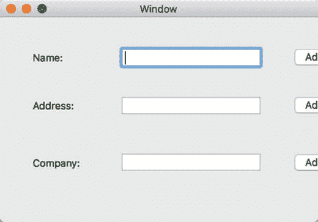

图 20-1. 调整窗口大小可能会切断或隐藏程序的用户界面

为确保调整窗口大小不会扭曲用户界面，你需要使用约束。约束可以定义以下一项或多项内容：

- 用户界面元素可以扩展或收缩的最大和最小尺寸
- 用户界面元素相对于窗口边框的位置
- 两个用户界面元素之间的距离

通过将约束应用于用户界面的所有部分，你可以确保无论用户如何调整窗口大小，用户界面都能始终保持良好外观。

## 约束窗口大小

默认情况下，你程序的每个窗口都可以由用户调整大小。这意味着用户可以缩小或放大窗口。当用户缩小窗口时，窗口可能会遮住或隐藏部分用户界面。当用户放大窗口时，窗口中将主要包含空白区域。

若要约束窗口的最大和最小尺寸，请按照以下步骤操作：

1. 点击包含你程序用户界面的 `.xib` 或 `.storyboard` 文件。如果使用故事板，请确保点击窗口控制器（而不是视图控制器）。
2. 选择“视图”➤“实用工具”➤“显示尺寸检查器”。尺寸检查器面板会显示出来，如图 20-2 所示。

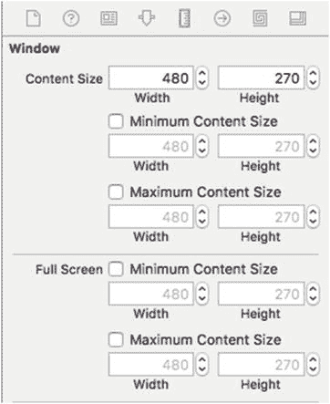

*图 20-2. 尺寸检查器允许你定义窗口的最大和最小尺寸*

3. 点击“内容大小”类别下的“最小内容大小”复选框，然后在“宽度”和“高度”文本字段中输入值。你在此定义的值将是窗口的最小尺寸。
4. 点击“内容大小”类别下的“最大内容大小”复选框，然后在“宽度”和“高度”文本字段中输入值。你在此定义的值将是窗口的最大尺寸。

通过定义最小尺寸，你可以确保缩小窗口不会遮住或隐藏部分用户界面。通过定义最大尺寸，你可以确保放大窗口不会产生大片空白区域。

## 将用户界面项约束到窗口边缘

当用户调整窗口大小时，窗口中的任何项（例如按钮、文本字段或标签）都会保持在原位。这就是为什么缩小窗口可能会覆盖或隐藏部分用户界面，而放大窗口则可能产生空白区域的原因。

要使用户界面适应窗口大小的变化，你需要在用户界面项（按钮、文本字段等）与窗口边缘之间放置约束。这样一来，当用户调整窗口大小时，用户界面项会保持与某条窗口边缘的固定距离。这使得用户界面可以在窗口改变宽度和/或高度时进行扩展或收缩。

要了解如何使用约束将用户界面项固定到窗口边缘，请按照以下步骤操作：

1. 在 Xcode 内，选择“文件”➤“新建”➤“项目”。
2. 在 macOS 类别下点击“应用程序”。
3. 点击“Cocoa 应用程序”，然后点击“下一步”按钮。Xcode 会要求输入产品名称。
4. 点击“产品名称”文本字段，然后输入 `ConstraintProgram`。
5. 确保“语言”弹出菜单显示 Swift，并且“使用故事板”复选框处于选中状态。
6. 点击“下一步”按钮。Xcode 会询问你想将项目存储在何处。
7. 选择一个文件夹来存储你的项目，然后点击“创建”按钮。
8. 在项目导航器中点击 `Main.storyboard` 文件。你程序的用户界面将会显示出来。
9. 选择“视图”➤“实用工具”➤“显示对象库”。
10. 在场景中的任意位置放置一个按钮。（确保将其放置在视图控制器上，而不是窗口控制器上。）
11. 选择“产品”➤“运行”。用户界面将会显示出来。
12. 将鼠标指针移到程序窗口的右下角，然后向右下方拖动鼠标。请注意，尽管窗口大小发生了变化，但按钮仍保持在原位。
13. 选择 `ConstraintProgram`➤“退出 `ConstraintProgram`”。Xcode 会再次出现。当你调整窗口大小时，按钮保持在原位，是因为按钮没有任何约束。通过在按钮与右侧窗口边缘之间放置一个约束，你可以让按钮随着右侧窗口边缘的移动而移动。
14. 在项目导航器中点击 `Main.storyboard` 文件，然后点击按钮将其选中。
15. 将鼠标指针移到按钮上方，按住 Control 键，然后将鼠标向右侧窗口边缘方向拖动。Xcode 会显示一条蓝色线条，如图 20-3 所示。

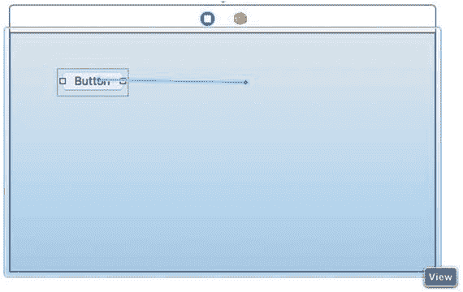

*图 20-3. 按住 Control 键拖动鼠标会创建一个约束*

16. 在按钮和窗口右边缘之间松开 Control 键和鼠标左键。会弹出一个菜单，如图 20-4 所示。

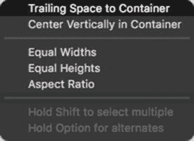

*图 20-4. 用于选择约束的弹出菜单*

17. 选择“尾部空间到容器”选项。Xcode 会从按钮到窗口右边缘绘制一个约束，如图 20-5 所示。

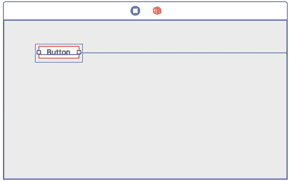

*图 20-5. 约束显示为一条线*

18. 选择“产品”➤“运行”。用户界面将会显示出来。
19. 将鼠标指针移到程序窗口的右下角，然后向右下方拖动鼠标。请注意，由于按钮有一个约束将其链接到窗口右边缘，每当窗口大小发生变化时，按钮都会移动，以保持与窗口右边缘的固定距离。
20. 选择 `ConstraintProgram`➤“退出 `ConstraintProgram`”。Xcode 会再次出现。

当你对按钮放置一个约束时，Xcode 会在按钮周围显示一个红色边框。这个红色边框提示你，该用户界面项上的约束不足。

在这种情况下，该约束定义了当窗口右边缘移动时按钮如何反应。但是，按钮缺少定义当窗口在高度上缩小或放大时按钮如何反应的约束。

理想情况下，你应该在每个用户界面项上放置足够的约束，以便它们定义窗口改变宽度或高度时所有可能的变化。要解决按钮的这个问题，你需要添加另一个约束，定义按钮相对于窗口顶部或底部的垂直位置。

1. 点击按钮将其选中。
2. 按住 Control 键，然后向窗口底部方向拖动鼠标。
3. 在按钮和窗口底部边缘之间松开 Control 键和鼠标左键。会弹出一个菜单，如图 20-6 所示。

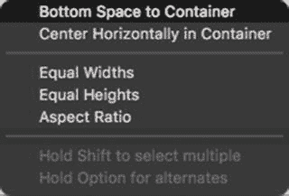

*图 20-6. 另一个用于为按钮应用约束的弹出菜单*

4. 选择“底部空间到容器”选项。Xcode 会从按钮到窗口底部绘制一个约束。请注意，Xcode 不再以红色高亮显示按钮周围的边框，因为你现在有足够的约束了。
5. 选择“产品”➤“运行”。用户界面将会显示出来。
6. 将鼠标指针移到程序窗口的右下角，然后向右下方拖动鼠标。请注意，由于按钮有一个约束将其链接到窗口的右边缘和底部边缘，每当窗口大小发生变化时，按钮都会移动，以保持与窗口右边缘和底部边缘的固定距离。
7. 选择 `ConstraintProgram`➤“退出 `ConstraintProgram`”。

对于每个用户界面项，你可以定义其相对于窗口顶部、左侧、右侧或底部的约束：

- `Trailing Space to Container`（尾部空间到容器）：将项约束到窗口的右边缘。
- `Leading Space to Container`（前导空间到容器）：将项约束到窗口的左边缘。
- `Top Space to Container`（顶部空间到容器）：将项约束到窗口的顶部边缘。
- `Bottom Space to Container`（底部空间到容器）：将项约束到窗口的底部边缘。

一旦你在用户界面项上放置了一个或多个约束，就可以在“尺寸检查器”面板中查看这些约束的更多详细信息，如图 20-7 所示。

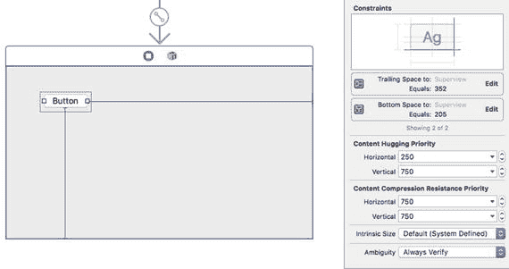

*图 20-7. “尺寸检查器”面板列出了每个约束的详细信息*

### 编辑约束

创建约束后，你可以随时修改它。修改约束的几种方式包括：

*   **更改约束的长度**：约束长度可以等于、小于等于或大于等于某个固定值。
*   **更改约束的优先级**：优先级用于定义哪些约束最重要。
*   **更改约束的乘数**：（默认值为 `1`，代表 100%或 1:1。）乘数会改变约束调整用户界面项目大小方式。

要修改约束，请遵循以下步骤：

1.  单击包含要修改约束的用户界面项目。
2.  选择 `View` ➤ `Utilities` ➤ `Show Size Inspector`。此时将出现“大小检查器”面板，并显示该项目上的约束（参见图 20-7）。
3.  在要修改的约束右侧，单击出现的 `Edit` 按钮。此时将弹出一个窗口，如图 20-8 所示。

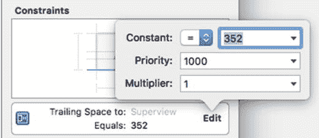

图 20-8. 编辑约束

4.  在 `Constant` 弹出菜单中单击，然后选择 `=`、`≤` 或 `≥`，如图 20-9 所示。

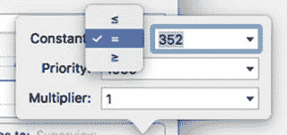

图 20-9. 编辑约束

5.  在 `Constant:` 标签右侧的文本框中单击，输入一个值，或选择 `standard value`（Xcode 使用推荐值）或 `canvas value`（Xcode 使用用户界面项目之间的距离来定义一个数值）。在大多数情况下，`standard value` 是最安全的选择，适用于不同类型的屏幕。
6.  在 `Priority` 文本框中单击并输入一个值。该值越高，约束的优先级就越高。当两个或更多约束冲突时，优先级决定了遵循哪个约束。
7.  在 `Multiplier` 文本框中单击并输入一个值，例如 `0.5` 或 `2`。`Multiplier` 的值定义了用户界面项目如何拉伸或收缩。

要了解多个约束如何影响用户界面项目的外观，请遵循以下步骤：

1.  确保你的 `ConstraintProgram` 已加载到 Xcode 中。
2.  在导航面板中单击 `Main.storyboard` 文件。程序的用户界面随之出现。
3.  单击推送按钮。应该有一个约束将该按钮连接到窗口的右边缘，另一个约束将按钮连接到窗口底部。
4.  将鼠标指针移到推送按钮上，按住 `Control` 键，然后将鼠标拖向窗口的左边缘。
5.  松开 `Control` 键和鼠标左键。此时将出现一个弹出菜单，如图 20-10 所示。

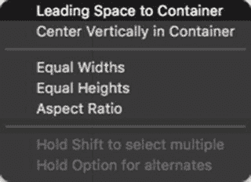

图 20-10. 为窗口左边缘定义新约束

6.  选择 `Leading Space to Container`。Xcode 会从推送按钮到窗口左边缘绘制一条约束。此时，你应该有了三个约束，分别作用于窗口的左、右和底部边缘，如图 20-11 所示。

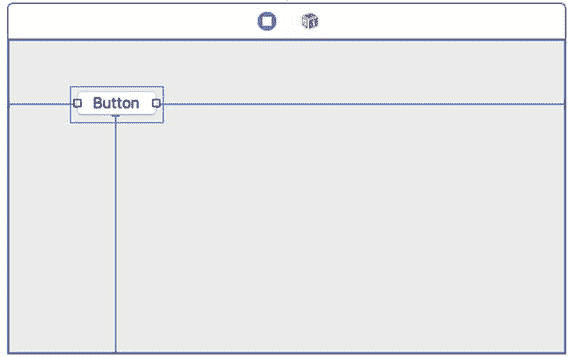

图 20-11. 推送按钮上的三个约束

7.  选择 `Product` ➤ `Run`。用户界面随之出现。
8.  将鼠标指针移到窗口的右边缘，然后拖动鼠标调整窗口大小。注意，左侧约束使推送按钮的左边缘与窗口左边缘保持固定距离，而右侧约束使推送按钮的右边缘与窗口右边缘保持固定距离，这将强制按钮拉伸，如图 20-12 所示。

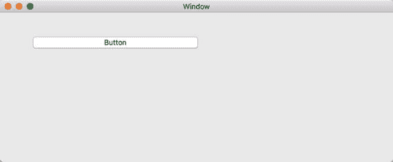

图 20-12. 窗口调整大小时，多个约束可以改变项目的外观

9.  选择 `ConstraintProgram` ➤ `Quit ConstraintProgram`。

由于你为推送按钮的左侧和右侧创建了两个约束，因此当窗口调整大小时，推送按钮会扩展。这是因为左侧和右侧约束都定义了推送按钮与窗口左右边缘之间的固定距离。

防止推送按钮扩展的一种方法是修改其左侧和右侧约束。右侧约束可以定义一个大于或等于的值，而不是固定值。要了解其工作原理，请遵循以下步骤：

1.  确保 `ConstraintProgram` 已加载到 Xcode 中。
2.  在项目导航面板中单击 `Main.storyboard` 文件。
3.  单击推送按钮。
4.  选择 `View` ➤ `Utilities` ➤ `Show Size Inspector`。此时将出现“大小检查器”面板，显示推送按钮上的约束（参见图 20-7）。
5.  在 `Trailing Space` 约束（右侧约束）右侧，单击出现的 `Edit` 按钮。此时将弹出一个窗口（参见图 20-8）。
6.  在 `Constant` 弹出菜单中单击，然后选择 `≥`，如图 20-13 所示。

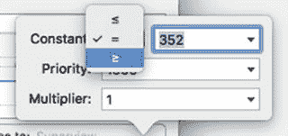

图 20-13. 将约束从 `=` 更改为 `≥`

7.  选择 `Product` ➤ `Run`。你的用户界面随之出现。
8.  将鼠标指针移到窗口的右边缘，然后拖动鼠标调整窗口大小。注意，左侧约束使推送按钮的左边缘与窗口左边缘保持固定距离，但当你加宽窗口时，推送按钮不再扩展。这是因为右侧约束定义了推送按钮到窗口右边缘的距离必须大于或等于一个固定值。
9.  选择 `ConstraintProgram` ➤ `Quit ConstraintProgram`。

### 创建尺寸约束

前面的示例展示了如何通过将约束从 `=` 修改为 `≥` 来防止按钮扩展尺寸。然而，保持用户界面元素固定尺寸的另一种方法是应用尺寸约束。尺寸约束可以定义以下之一：

- 高度
- 宽度
- 宽高比

宽高比使高度和宽度之间的比率保持固定值，因此加宽元素也会使其变高（反之亦然）。要定义尺寸约束，您只需在用户界面元素的边界内按住 Control 键并拖动。要了解如何定义尺寸约束，请按照以下步骤操作：

1. 确保 `ConstraintProgram` 已在 Xcode 中加载。
2. 在项目导航器窗格中点击 `Main.storyboard` 文件。
3. 点击该按钮。
4. 选择“视图” ➤ “实用工具” ➤ “显示尺寸检查器”。尺寸检查器窗格出现，显示该按钮上的约束（参见图 20-7）。
5. 将鼠标指针移动到按钮上。
6. 按住 Control 键并向左或向右拖动鼠标，但保持在按钮的边界内。
7. 松开 Control 键和鼠标左键。将出现一个弹出菜单，如图 20-14 所示。

   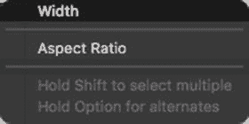

   图 20-14. 创建尺寸约束
8. 选择“宽度”。注意，Xcode 会在按钮下方显示一个宽度约束，如图 20-15 所示。此宽度约束使按钮保持固定尺寸。

   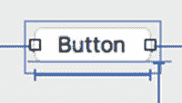

   图 20-15. 项目下方出现一个宽度约束
9. 点击出现在宽度约束右侧的“编辑”按钮。将出现一个弹出窗口。
10. 点击“常量”弹出菜单并将 `=` 更改为 `≤`。
11. 点击“常量”文本字段，并将其中显示的任意值（如 70）改为该值的两倍（如 140）。这将定义宽度约束，使按钮宽度小于或等于特定值。
12. 选择“产品” ➤ “运行”。您的用户界面将出现。注意，您只能将窗口宽度调整到有限大小。当您加宽窗口时，按钮宽度会扩展到一定尺寸。然后约束会阻止窗口继续调整大小。
13. 选择 `ConstraintProgram` ➤ 退出 `ConstraintProgram`。

### 在多个用户界面元素之间创建约束

将元素约束到窗口边缘以及约束元素尺寸是使用约束的两种方式。使用约束的第三种方式是定义两个独立用户界面元素（例如按钮和文本字段）之间的距离。

通过在用户界面元素之间定义约束，您可以确保无论用户如何调整程序窗口大小，整个用户界面都看起来良好。此外，在用户界面元素之间创建约束可以避免您为每个用户界面元素详尽地定义到窗口边缘的约束。

要在用户界面元素之间创建约束，请按住 Control 键并从其中一个用户界面元素拖动到另一个用户界面元素。您可以定义两个元素之间的固定距离，或者定义两个元素如何对齐，例如保持它们的顶部或底部彼此对齐。

要了解如何在用户界面元素之间创建约束，请按照以下步骤操作：

1. 确保 `ConstraintProgram` 已在 Xcode 中加载。
2. 在项目导航器窗格中点击 `Main.storyboard` 文件。
3. 点击该按钮。按钮与窗口右、左和下边缘之间应有三个约束。此外，按钮下方应有一个尺寸约束。
4. 在按钮右侧放置一个文本字段。
5. 将鼠标指针移到文本字段上，按住 Control 键并拖动鼠标，直到鼠标指针出现在按钮上方，如图 20-16 所示。

   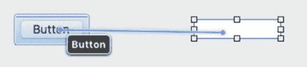

   图 20-16. 在用户界面元素之间定义约束
6. 松开 Control 键和鼠标左键。将出现一个弹出菜单，如图 20-17 所示。

   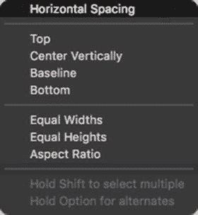

   图 20-17. 在用户界面元素之间选择约束
7. 选择“水平间距”选项。Xcode 在按钮和文本字段之间显示一个约束。注意，Xcode 会在文本字段周围显示红色边框，因为没有足够的约束来定义文本字段在窗口中的位置。您可以手动添加更多约束，但也可以让 Xcode 自动添加约束。唯一的缺点是 Xcode 并不总能猜测到您需要的正确约束。
8. 确保文本字段仍处于选中状态，然后选择“编辑器” ➤ “解决自动布局问题” ➤ 子菜单上半部分的“添加缺少的约束”，如图 20-18 所示。（如果您选择子菜单下半部分的“添加缺少的约束”，Xcode 将向用户界面上当前的所有元素添加约束。）Xcode 会添加额外的约束并移除文本字段周围的红色边框。

   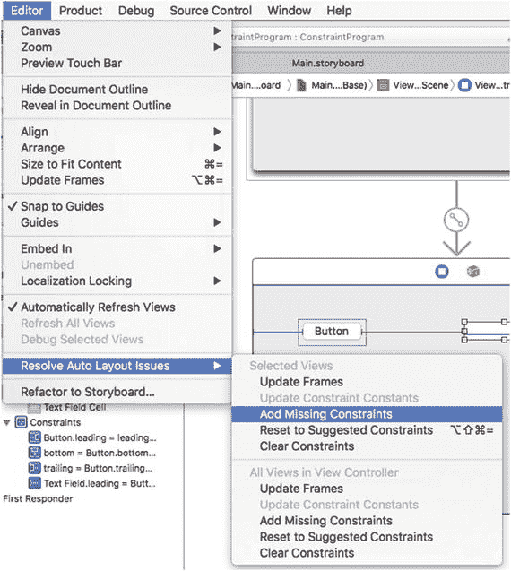

   图 20-18. Xcode 可以自动添加约束
9. 选择“产品” ➤ “运行”。您的用户界面将出现。注意，当您调整窗口大小时，文本字段总是会移动以保持与按钮的固定距离。
10. 选择 `ConstraintProgram` ➤ 退出 `ConstraintProgram`。

**注意**

如果您选择“编辑器” ➤ “解决自动布局问题” ➤ “重置为建议的约束”，Xcode 将自动向当前选中的用户界面元素添加所有必要的约束（如果您选择子菜单上半部分的“重置为建议的约束”），或者向所有用户界面元素添加约束（如果您选择子菜单下半部分的“重置为建议的约束”）。

### 删除约束

定义约束通常是一个反复试验的过程，直到获得您想要的结果。如果您定义的约束无法按预期工作，您可以随时删除该约束。要删除单个约束，您有两种选择：

- 点击用户界面上的约束，然后按退格键。
- 点击尺寸检查器窗格中的约束，然后按退格键。

如果您想删除单个用户界面元素（如按钮或文本字段）上的所有约束，请按照以下步骤操作：

1. 点击包含要删除约束的用户界面元素。
2. 选择“编辑器” ➤ “解决自动布局问题” ➤ “清除约束”（在子菜单的上半部分）。

如果您想删除用户界面上所有元素的约束，请按照以下步骤操作：

1. 点击包含要删除约束的用户界面元素。
2. 选择“编辑器” ➤ “解决自动布局问题” ➤ “清除约束”（在子菜单的下半部分）。

### 摘要

约束确保无论用户如何调整程序窗口大小，您的用户界面都能保持良好的外观。您可以定义三种类型的约束：

*   从用户界面项到窗口边缘
*   定义用户界面项高度和/或宽度的尺寸约束
*   在两个用户界面项之间

当使用多个约束时，您可以分配一个固定值，或者一个大于或小于的比较值。您还可以为约束分配优先级，以便当两个或多个约束冲突时，优先级较高的约束会优先被使用。

`Xcode`可以自动添加约束，但它们可能并非总是正常工作，因此请准备好尝试不同的约束，直到您的用户界面按照您期望的方式运行。

