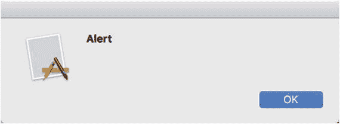
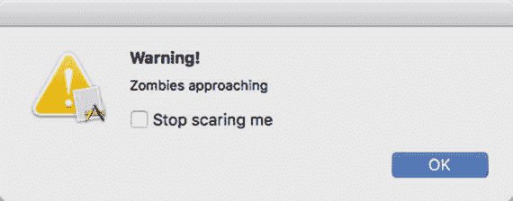
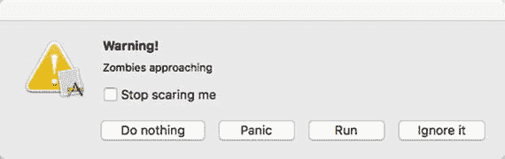
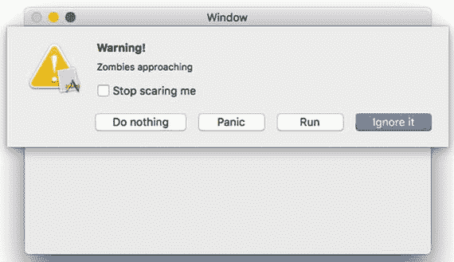
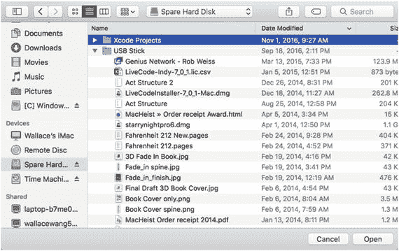
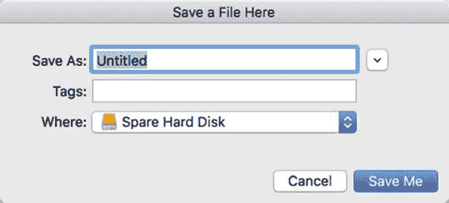
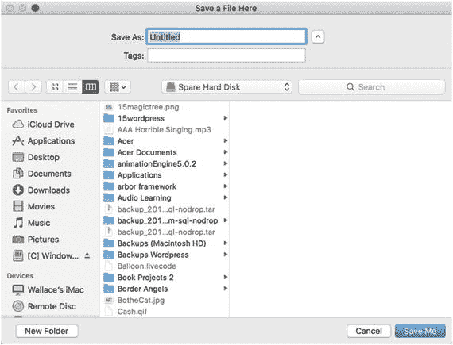
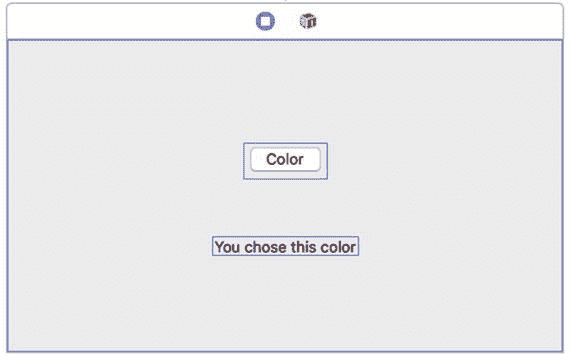
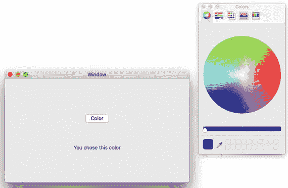

# 21. 使用警报和面板

在每个程序中，您都可以设计程序的独特功能，同时让 `Cocoa`框架负责使您的程序看起来像标准的 `macOS`程序并具有标准行为。为了创建几乎所有 `macOS`程序的通用功能，您可以使用警报和面板。

警报通常会弹出在屏幕上以通知用户，例如要求用户确认删除文件或提醒用户出现问题。面板显示通用的用户界面项，例如 `macOS`程序通常显示的打印面板，用于提供打印选项，或用于选择文件的面板。

通过使用警报和面板，您可以添加常见的 `macOS`用户界面元素，而无需创建自己的用户界面或编写 `Swift`代码。警报和面板是 `Cocoa`框架的一部分，您的 `macOS`程序可以使用它们来创建标准的 `macOS`用户界面。

## 使用警报

警报基于 `Cocoa`框架中的 `NSAlert`类。在最简单的层面上，您可以用两行 `Swift`代码创建一个警报：

```
let myAlert = NSAlert()
myAlert.runModal()
```

第一行声明了一个名为`myAlert`的对象，它基于`NSAlert`类。然后第二行使用`runModal()`方法来显示警报。当警报出现时，它被认为是模态的，这意味着警报在用户解除它之前不会让用户执行任何操作。

上面的两行代码创建了一个通用警报，它显示一个“好”按钮、一个通用图形图像和一个通用文本消息，如图 21-1 所示。



**图 21-1.** 创建一个通用警报

要自定义警报，您可以修改以下属性：

*   `messageText`：以粗体显示主要警报消息。在图 21-1 中，“警告”是`messageText`。
*   `informativeText`：直接在`messageText`下方显示非粗体文本。在图 21-1 中，没有`informativeText`。
*   `icon`：显示一个图标。默认情况下，该图标是程序的图标。
*   `alertStyle`：当设置为`NSAlertStyle.critical`时显示关键图标。否则，它显示默认的警报图标。
*   `showsSuppressionButton`：显示一个复选框，默认文本为“不再显示此消息”，除非定义了`suppressionButton?.title`属性。
*   `suppressionButton?.title`：将复选框的默认文本（“不再显示此消息”）替换为自定义文本。

要了解如何自定义警报，请按照以下步骤操作：

1.  在 `Xcode`中选择文件 ➤ 新建 ➤ 项目。
2.  在 `macOS`类别下单击应用程序。
3.  单击 `Cocoa`应用程序，然后单击“下一步”按钮。`Xcode`现在会要求输入产品名称。
4.  单击“产品名称”文本字段，然后输入 `AlertProgram`。
5.  确保语言弹出菜单显示 `Swift`，并且“使用故事板”复选框被选中。
6.  单击“下一步”按钮。`Xcode`会询问您想要将项目存储在哪里。
7.  选择一个文件夹来存储您的项目，然后单击“创建”按钮。
8.  在项目导航器中单击`Main.storyboard`文件。您的程序用户界面会出现。
9.  选择视图 ➤ 工具 ➤ 显示对象库。对象库出现在 `Xcode`窗口的右下角。
10. 将一个按钮拖到用户界面窗口上。
11. 选择视图 ➤ 助理编辑器 ➤ 显示助理编辑器。`ViewController.swift`文件会出现在用户界面旁边。
12. 将鼠标指针移到按钮上，按住 `Control`键，然后将鼠标拖到`ViewController.swift`文件底部最后一个花括号上方。
13. 松开 `Control`键和鼠标按钮。会出现一个弹出窗口。
14. 单击“连接”弹出菜单，然后选择操作。
15. 单击“名称”文本字段，然后输入 `showAlert`。
16. 单击“类型”弹出菜单，选择 `NSButton`，然后单击“连接”按钮。`Xcode`会创建一个空的 `IBAction`方法。
17. 修改 `IBAction`方法如下：

    ```
    @IBAction func showAlert(_ sender: NSButton) {
        let myAlert = NSAlert()
        myAlert.messageText = "Warning!"
        myAlert.informativeText = "Zombies approaching"
        myAlert.alertStyle = NSAlertStyle.critical
        myAlert.showsSuppressionButton = true
        myAlert.suppressionButton?.title = "Stop scaring me"
        myAlert.runModal()
    }
    ```

18. 选择产品 ➤ 运行。您的用户界面会出现。
19. 单击按钮。会出现一个警报，如图 21-2 所示。

    

    **图 21-2.** 显示自定义警报
20. 单击警报上的“好”按钮关闭它。
21. 选择 `AlertProgram` ➤ 退出 `AlertProgram`。


### 从警告框中获取反馈

警告框通常只显示一个“确定”按钮，供用户关闭对话框。然而，警告框可以通过以下两种方式之一从用户处获取反馈：

-   选中“不再提示”复选框
-   点击“确定”按钮之外的按钮

要判断用户是否勾选了“不再提示”复选框，你需要访问 `suppressionButton!.state` 属性。如果复选框被选中，`suppressionButton!.state` 属性的值为 1；如果复选框未被选中，则该属性值为 0。

从警告框获取反馈的第二种方式是显示两个或更多按钮。要向警告框添加更多按钮，你需要使用 `addButton` 方法。然后，要确定用户点击了哪个按钮，你需要使用 `NSAlertFirstButtonReturn`、`NSAlertSecondButtonReturn` 或 `NSAlertThirdButtonReturn` 这些常量。

如果你在警告框上有四个或更多按钮，你可以通过 `NSAlertThirdButtonReturn + 1` 检测第四个按钮，通过 `NSAlertThirdButtonReturn + 2` 检测第五个按钮，以此类推。

要了解如何识别用户在警告框中选择了哪个选项，请遵循以下步骤：

1.  确保你的 `AlertProgram` 项目已在 Xcode 中加载。
2.  在项目导航窗格中点击 `ViewController.swift` 文件。
3.  按如下方式修改 IBAction `showAlert` 方法：

    ```
    @IBAction func showAlert(_ sender: NSButton) {
        let myAlert = NSAlert()
        myAlert.messageText = "Warning!"
        myAlert.informativeText = "Zombies approaching"
        myAlert.alertStyle = NSAlertStyle.critical
        myAlert.showsSuppressionButton = true
        myAlert.suppressionButton?.title = "Stop scaring me"
        myAlert.addButton(withTitle: "Ignore it")
        myAlert.addButton(withTitle: "Run")
        myAlert.addButton(withTitle: "Panic")
        myAlert.addButton(withTitle: "Do nothing")
        let choice = myAlert.runModal()
        switch choice {
        case NSAlertFirstButtonReturn:
            print ("User clicked Ignore it")
        case NSAlertSecondButtonReturn:
            print ("User clicked Run")
        case NSAlertThirdButtonReturn:
            print ("User clicked Panic")
        case NSAlertThirdButtonReturn + 1:
            print ("User clicked Do nothing")
        default: break
        }
        if myAlert.suppressionButton!.state == 1 {
            print ("Checked")
        } else {
            print ("Not checked")
        }
    }
    ```

    `addButton` 方法在警告框上创建按钮，其中第一个 `addButton` 方法创建默认按钮，其余方法创建附加按钮。为了捕获用户点击的按钮，上述代码创建了一个名为“choice”的常量。然后，它使用一个 switch 语句来识别用户点击的是哪个按钮。请注意，第四个按钮是通过将 `NSAlertThirdButtonReturn` 常量加 1 来识别的。`suppressionButton!.state` 属性用于检查用户是否选中了警告框上显示的复选框。如果其值为 1，则表示用户选中了复选框；否则，如果值为 0，则表示未选中。

4.  选择 **Product** ➤ **Run**。你的用户界面将出现。
5.  点击该按钮。警告框将出现，如图 21-3 所示。

    

    **图 21-3.** 由 Swift 代码创建的警告框

6.  点击“Stop scaring me”复选框以将其选中。
7.  点击其中一个按钮，例如 Panic 或 Run。无论你点击哪个按钮，警告框都会消失。
8.  选择 **AlertProgram** ➤ **Quit AlertProgram**。Xcode 将再次出现，并在调试区域显示文本，例如“User clicked Panic”和“Checked”。

### 以工作表形式显示警告框

警告框通常显示为一个模态对话框，它会创建一个可以独立于主程序窗口移动的新窗口。另一种显示警告框的方式是作为工作表，从当前活动窗口的标题栏向下展开。

要使警告框显示为工作表，你需要使用 `beginSheetModalForWindow` 方法，如下所示：

```
alertObject.beginSheetModal(for: window, completionHandler: closure)
```

第一个参数定义了你希望工作表出现的窗口。在 `AlertProgram` 项目中，代表用户界面窗口的 IBOutlet 被称为 `window`。第二个参数是完成处理器标签，它标识了一个名为闭包的特殊函数的名称。

闭包代表了一种编写函数的简写方式。你不是用传统方式编写函数，例如：

```
func functionName(parameters) -> Type {
    // Insert code here
    return value
}
```

你可以像这样编写一个闭包：

```
let closureName = { (parameters) -> Type in
    // Insert code here
}
```

要了解如何将警告框转换为工作表并使用闭包，请遵循以下步骤：

1.  确保你的 `AlertProgram` 项目已在 Xcode 中加载。
2.  在项目导航窗格中点击 `ViewController.swift` 文件。
3.  按如下方式修改 IBAction `showAlert` 方法：

    ```
    @IBAction func showAlert(_ sender: NSButton) {
        let myAlert = NSAlert()
        myAlert.messageText = "Warning!"
        myAlert.informativeText = "Zombies approaching"
        myAlert.alertStyle = NSAlertStyle.critical
        myAlert.showsSuppressionButton = true
        myAlert.suppressionButton?.title = "Stop scaring me"
        myAlert.addButton(withTitle: "Ignore it")
        myAlert.addButton(withTitle: "Run")
        myAlert.addButton(withTitle: "Panic")
        myAlert.addButton(withTitle: "Do nothing")
        let myCode = { (choice:NSModalResponse) -> Void in
            switch choice {
            case NSAlertFirstButtonReturn:
                print ("User clicked Ignore it")
            case NSAlertSecondButtonReturn:
                print ("User clicked Run")
            case NSAlertThirdButtonReturn:
                print ("User clicked Panic")
            case NSAlertThirdButtonReturn + 1:
                print ("User clicked Do nothing")
            default: break
            }
            if myAlert.suppressionButton!.state == 1 {
                print ("Checked")
            } else {
                print ("Not checked")
            }
        }
        myAlert.beginSheetModal(for: NSApp.keyWindow!, completionHandler: myCode)
    }
    ```

4.  选择 **Product** ➤ **Run**。用户界面将出现。
5.  点击按钮。注意，现在警告框会作为工作表下拉显示，如图 21-4 所示。

    

    **图 21-4.** 作为工作表的警告框

6.  点击“Stop scaring me”复选框以将其选中。
7.  点击其中一个按钮，例如 Panic 或 Run。无论你点击哪个按钮，警告框都会消失。
8.  选择 **AlertProgram** ➤ **Quit AlertProgram**。Xcode 将再次出现，并在调试区域显示文本，例如“User clicked Run”和“Checked”。

在上述 Swift 代码中，闭包定义如下：

```
let myCode = { (choice:NSModalResponse) -> Void in
    switch choice {
    case NSAlertFirstButtonReturn:
        print ("User clicked Ignore it")
    case NSAlertSecondButtonReturn:
        print ("User clicked Run")
    case NSAlertThirdButtonReturn:
        print ("User clicked Panic")
    case NSAlertThirdButtonReturn + 1:
        print ("User clicked Do nothing")
    default: break
    }
    if myAlert.suppressionButton!.state == 1 {
        print ("Checked")
    } else {
        print ("Not checked")
    }
}
```

不过，你同样可以将闭包内联放置，这意味着不再由完成处理器标识闭包的名称，而是直接将闭包本身放在该位置。因此，在以上代码中，`beginSheetModal` 方法通过名称调用闭包，如下所示：

```
myAlert.beginSheetModal(for: NSApp.keyWindow!, completionHandler: myCode)
```

你可以将闭包名 `myCode` 替换为实际的闭包代码。


```swift
myAlert.beginSheetModal(for: NSApp.keyWindow!, completionHandler: {(choice:NSModalResponse) -> Void in
    switch choice {
    case NSAlertFirstButtonReturn:
        print ("用户点击了“忽略”")
    case NSAlertSecondButtonReturn:
        print ("用户点击了“运行”")
    case NSAlertThirdButtonReturn:
        print ("用户点击了“恐慌”")
    case NSAlertThirdButtonReturn + 1:
        print ("用户点击了“不做任何事”")
    default: break
    }
    if myAlert.suppressionButton!.state == 1 {
        print ("已勾选")
    } else {
        print ("未勾选")
    }
})
```

将闭包直接内联放在方法中可以缩短代码量，但代价是可能降低整体代码的可读性。通过名称分离闭包并按名称调用，可以更方便地在程序其他位置重复使用该闭包，同时也能让代码更清晰，但代价是你需要编写更多代码。

请选择你最喜欢的方式，但正如编程的所有方面一样，保持一致的风格，这样即使日后你不在场解释代码，其他程序员也能轻松理解。

## 使用面板

面板代表 macOS 程序所需的常见用户界面元素，例如显示“打开”面板，让用户选择要打开的文件；以及“保存”面板，让用户选择存储文件的文件夹。“打开”面板基于 `NSOpenPanel` 类，而“保存”面板基于 `NSSavePanel` 类。

### 创建打开面板

“打开”面板让用户选择一个要打开的文件。如果用户选择了文件，该面板需要返回一个文件名。“打开”面板使用的一些属性包括：

*   `canChooseFiles`：允许用户选择文件。
*   `canChooseDirectories`：允许用户选择文件夹或目录。
*   `allowsMultipleSelection`：允许用户选择多个项目。
*   `urls`：保存所选项目的名称。如果 `allowsMultipleSelection` 属性设置为 `true`，那么 `urls` 属性保存一个项目数组；否则，它只保存单个项目。

要了解如何使用“打开”面板，请按照以下步骤操作：

1.  在 Xcode 中，选择“文件” ➤ “新建” ➤ “项目”。
2.  在 macOS 类别下单击“应用程序”。
3.  单击“Cocoa 应用程序”，然后单击“下一步”按钮。Xcode 会要求输入产品名称。
4.  在“产品名称”文本字段中单击，然后输入 `PanelProgram`。
5.  确保“语言”弹出菜单显示 Swift，并且“使用 Storyboard”复选框已勾选。
6.  单击“下一步”按钮。Xcode 会询问你想将项目存储在哪里。
7.  选择一个文件夹来存储项目，然后单击“创建”按钮。
8.  在项目导航器中单击 `Main.storyboard` 文件。程序的用户界面会显示出来。
9.  选择“视图” ➤ “工具” ➤ “显示对象库”。对象库会出现在 Xcode 窗口的右下角。
10. 将一个“按钮”拖放到用户界面窗口上，然后双击它，将其标题更改为 `打开`。
11. 选择“视图” ➤ “助理编辑器” ➤ “显示助理编辑器”。`ViewController.swift` 文件会出现在用户界面旁边。
12. 将鼠标指针移到“按钮”上，按住 Control 键，然后将鼠标拖到 `ViewController.swift` 文件底部最后一个花括号的上方。
13. 释放 Control 键和鼠标按钮。会弹出一个窗口。
14. 在“连接”弹出菜单中单击，并选择“操作”。
15. 在“名称”文本字段中单击，然后输入 `openPanel`。
16. 在“类型”弹出菜单中单击，选择 `NSButton`，然后单击“连接”按钮。Xcode 会创建一个空的 `IBAction` 方法。
17. 按如下方式修改 `IBAction` 方法：

    ```swift
    @IBAction func openPanel(_ sender: NSButton) {
        let myOpen = NSOpenPanel()
        myOpen.canChooseFiles = true
        myOpen.canChooseDirectories = true
        myOpen.allowsMultipleSelection = true
        myOpen.begin { (result) -> Void in
            if result == NSFileHandlingPanelOKButton {
                print (myOpen.urls)
            }
        }
    }
    ```

18. 选择“产品” ➤ “运行”。用户界面会显示出来。
19. 单击该按钮。会出现一个“打开”面板，如图 21-5 所示。

    

    图 21-5. 打开面板

20. 按住 Command 键，然后点击两个不同的项目，例如两个不同的文件，或者一个文件和一个文件夹。
21. 单击“打开”按钮。
22. 选择“PanelProgram” ➤ “退出 PanelProgram”。Xcode 会再次出现。在调试区域中，你应该会看到你所选文件/文件夹的列表。

**注意：** “打开”面板只负责选择文件/文件夹，你仍然需要编写 Swift 代码来实际打开用户选择的任何文件。

### 创建保存面板

“保存”面板看起来和“打开”面板类似，但其目的是让用户选择一个文件夹并定义一个文件名来保存文件。如果用户选择了文件，该面板需要返回一个文件名。“保存”面板使用的一些属性包括：

*   `title`：在“保存”面板顶部显示文本。如果未定义，默认显示“保存”。
*   `prompt`：在默认按钮上显示文本。
*   `url`：保存用户所选内容的路径名和文件名。
*   `nameFieldStringValue`：仅保存用户选择的文件名。

要了解如何使用“保存”面板，请按照以下步骤操作：

1.  确保在 Xcode 中加载了 `PanelProgram` 项目。
2.  在项目导航器窗格中单击 `Main.storyboard` 文件。
3.  将一个“按钮”拖放到用户界面上，然后双击它，将其标题更改为 `保存`。
4.  选择“视图” ➤ “助理编辑器” ➤ “显示助理编辑器”。Xcode 会在用户界面旁边显示 `ViewController.swift` 文件。
5.  将鼠标指针移到“保存”按钮上，按住 Control 键，然后将鼠标拖到 `ViewController.swift` 文件中 `IBOutlet` 行的下方。
6.  释放 Control 键和鼠标。会弹出一个窗口。
7.  在“连接”弹出菜单中单击，并选择“操作”。
8.  在“名称”文本字段中单击，输入 `savePanel`，然后单击“连接”按钮。
9.  在“类型”弹出菜单中单击，选择 `NSButton`。然后单击“连接”按钮。Xcode 会创建一个空的 `IBAction` 方法。
10. 按如下方式修改这个 `IBAction` 方法：

    ```swift
    @IBAction func savePanel(_ sender: NSButton) {
        let mySave = NSSavePanel()
        mySave.title = "在此处保存文件"
        mySave.prompt = "保存我"
        mySave.begin { (result) -> Void in
            if result == NSFileHandlingPanelOKButton {
                print (mySave.url!)
                print (mySave.nameFieldStringValue)
            }
        }
    }
    ```

11. 选择“产品” ➤ “运行”。用户界面会显示出来。
12. 单击“保存”按钮。会出现一个“保存”面板，如图 21-6 所示。请注意，`title` 属性创建了出现在“保存”面板顶部的文本，而 `prompt` 属性则创建了出现在“保存”面板右下角默认按钮上的文本。

    

    图 21-6. 紧凑型保存面板

13. 单击“另存为”文本字段最右侧出现的“展开”按钮。“保存”面板会展开，如图 21-7 所示。

    

    图 21-7. 展开后的保存面板

14. 在“另存为”文本字段中单击，然后输入 `TestFile`。
15. 单击“保存我”按钮。
16. 选择“PanelProgram” ➤ “退出 PanelProgram”。Xcode 窗口会再次出现。在 Xcode 窗口底部的调试区域中，你应该能看到所选文件和文件夹的完整路径名，以及你输入的文件名。


### 创建颜色面板

颜色面板用于显示不同的颜色选项，以便用户选择不同的颜色。颜色面板需要返回用户选择的颜色。颜色面板使用的一些属性包括：

- `activate`：显示颜色面板
- `action`：定义打开颜色面板时要运行的函数
- `color`：以 `NSColor` 类的形式存储用户选择的颜色值

要学习如何使用颜色面板，请遵循以下步骤：

1.  在 Xcode 中，选择**文件 ➤ 新建 ➤ 项目**。
2.  在 **macOS** 类别下，点击**应用程序**。
3.  点击**Cocoa 应用程序**，然后点击**下一步**按钮。Xcode 会要求你输入产品名称。
4.  在**产品名称**文本框中点击，然后输入 `ColorPanelProgram`。
5.  确保**语言**弹出菜单显示为 **Swift**，并且“使用故事板”复选框已被选中。
6.  点击**下一步**按钮。Xcode 会询问你想在哪里存储项目。
7.  选择一个文件夹来存储你的项目，然后点击**创建**按钮。
8.  在项目导航器中点击 `Main.storyboard` 文件。你程序的用户界面将会出现。
9.  选择**视图 ➤ 工具 ➤ 显示对象库**。对象库会出现在 Xcode 窗口的右下角。
10. 将一个按钮拖拽到用户界面窗口中，并双击它，将其标题更改为**颜色**。
11. 将一个标签拖拽到用户界面窗口中，并双击它，将其显示的文本更改为**你选择了此颜色**，如图 21-8 所示。

    

    **图 21-8.** ColorPanelProgram 的用户界面

12. 选择**视图 ➤ 助理编辑器 ➤ 显示助理编辑器**。`ViewController.swift` 文件会出现在你的用户界面旁边。
13. 将鼠标指针移动到标签上，按住 **Control** 键，然后将鼠标拖拽到 `ViewController.swift` 文件中最后一行的 `class ViewController` 代码下方。
14. 松开 **Control** 键和鼠标按钮。会弹出一个窗口。
15. 在**名称**文本框中点击，输入 `myLabel`，然后点击**连接**按钮。Xcode 会创建一个 `IBOutlet`，如下所示：

    ```
    @IBOutlet weak var myLabel: NSTextField!
    ```

16. 在此 `IBOutlet` 下方，输入以下代码：

    ```
    let colorPanel = NSColorWell()
    ```

17. 将鼠标指针移动到按钮上，按住 **Control** 键，然后将鼠标拖拽到 `ViewController.swift` 文件底部最后一个花括号的上方。
18. 松开 **Control** 键和鼠标按钮。会弹出一个窗口。
19. 在**连接**弹出菜单中点击，并选择**动作**。
20. 在**名称**文本框中点击，然后输入 `chooseColor`。
21. 在**类型**弹出菜单中点击，选择 `NSButton`，然后点击**连接**按钮。Xcode 会创建一个空的 `IBAction` 方法。
22. 修改此 `IBAction` 方法，如下所示：

    ```
    @IBAction func chooseColor(_ sender: NSButton) {
        colorPanel.activate(true)
        colorPanel.action = #selector(changeColor(_:))
    }
    ```

    `activate` 命令用于显示颜色面板，`#selector` 命令用于运行 `changeColor` 函数，你需要创建这个函数。

23. 在此 `IBAction` 方法上方，输入以下函数：

    ```
    override func changeColor(_ sender: Any?) {
        myLabel.textColor = colorPanel.color
    }
    ```

    这个 `changeColor` 函数的作用是，获取用户在颜色面板中选择的任何颜色，并将其赋值给标签的文本颜色。

24. 选择**产品 ➤ 运行**。用户界面将会出现。
25. 在你程序的用户界面上点击**颜色**按钮。会显示一个颜色面板，如图 21-9 所示。

    

    **图 21-9.** 颜色面板

26. 点击一种颜色。请注意，每次你点击一种颜色时，标签中文本的颜色都会随之改变。
27. 选择**ColorPanelProgram ➤ 退出 ColorPanelProgram**。

### 总结

在设计标准的 macOS 用户界面时，你不必事事都亲力亲为。通过利用 Cocoa 框架，你可以创建外观和行为与其他 macOS 程序相一致的警报和面板，而无需自己编写大量额外的代码。

警报让你可以向用户显示简短的消息，例如警告。你可以使用文本和图形自定义警报，并在警报上放置两个或更多按钮。如果你在警报上放置了两个或更多按钮，则需要编写 Swift 代码来识别用户点击了哪个按钮。

警报通常显示为一个独立的窗口，但你也可以让它以从窗口标题栏向下弹出的表单形式出现。

面板显示常用的用户界面元素，例如用于选择要打开文件的“打开”面板，以及用于选择保存数据的文件夹和文件名的“保存”面板。“打开”和“保存”面板是 Cocoa 框架的一部分，但你还需要编写额外的 Swift 代码，才能使“打开”和“保存”面板实际打开文件或将文件保存到硬盘。

颜色面板让用户选择不同的颜色。要获取用户选择的颜色，请使用 `NSColorWell` 类的 `color` 属性。

警报和面板让你只需编写很少的额外代码就能创建标准的 macOS 用户界面元素。通过使用 Cocoa 框架的这些特性，你可以创建运行稳定、行为符合用户对 macOS 程序预期的标准 macOS 程序。

