# 22. 创建下拉菜单

下拉菜单是与 macOS 程序进行交互的标准方式。虽然你的程序可能会使用按钮来表示命令，但过多的按钮会使屏幕显得杂乱。为了避免在屏幕上塞入过多按钮，你可以将相关的命令分组到多个下拉菜单中。默认情况下，Xcode 创建的每个 macOS 项目都包含以下下拉菜单标题：

-   **文件**：显示用于打开、保存、创建和打印的命令。
-   **编辑**：显示用于复制、剪切、粘贴、撤销和重做命令的命令。
-   **格式**：显示用于修改文本或图形的命令，例如更改字体。
-   **视图**：显示用于更改数据在窗口中显示方式的命令，例如放大和缩小，或显示其他用户界面项目（如工具栏）。
-   **窗口**：显示用于操作文档窗口的命令，例如在多个打开的窗口之间切换。
-   **帮助**：显示用于获取程序使用帮助的命令。

虽然 Xcode 可以为你创建下拉菜单标题，但你还是需要编写 Swift 代码才能让它们真正起作用。除了使用标准的下拉菜单标题，你还可以添加自己的菜单标题或删除现有的标题。为了组织下拉菜单内的命令，你可以使用水平线将相似命令分组，或者将它们存储在子菜单中。为了方便用户，你还可以为命令分配键盘快捷键。

下拉菜单是用户控制程序的标准方式。通过为你自己的程序创建下拉菜单，你可以创建熟悉的用户界面，以便他人可以在几乎不需要额外培训的情况下，快速学习和使用你的程序。


## 编辑下拉菜单

每次创建 Cocoa 应用程序项目时，Xcode 都会创建一个包含常见菜单标题和命令的默认下拉菜单。无需编写一行 Swift 代码，其中许多命令就已经可以正常工作了。例如，应用程序菜单（即你的程序名称，如 `MenuProgram`）下的“退出”命令知道如何退出程序，而“窗口”菜单标题下的“缩放”和“最小化”命令知道如何缩放和最小化用户界面窗口。

在大多数情况下，你需要通过编辑现有命令、添加新命令以及删除现有命令来自定义这些下拉菜单。要修改程序的下拉菜单，你有两种选择：

*   直接编辑下拉菜单
*   打开文档大纲并编辑菜单

要直接编辑下拉菜单，请点击“项目导航器”窗格中的 `.xib` 或 `.storyboard` 文件，然后直接点击程序的下拉菜单，如图 22-1 所示。

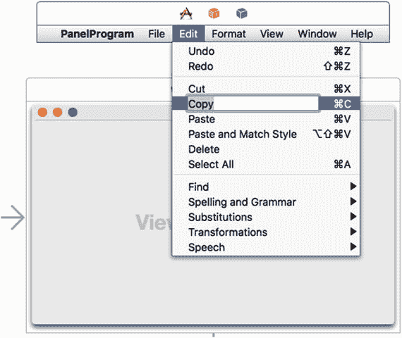

图 22-1. 你可以直接点击程序的下拉菜单来选择单个项目

编辑下拉菜单的第二种方法是点击“显示文档大纲”图标以打开文档大纲，如图 22-2 所示。

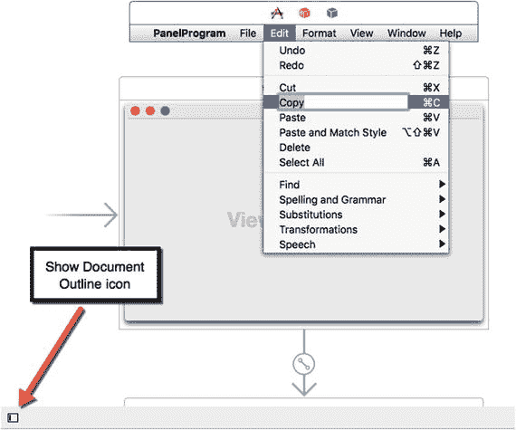

图 22-2. “显示文档大纲”图标

打开文档大纲后，你可以点击展开三角形来查看不同的下拉菜单及其命令，如图 22-3 所示。

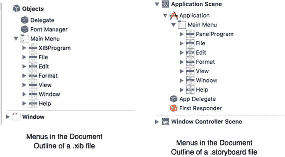

图 22-3. 在“文档大纲”窗格中查看菜单

要删除某个菜单项，请点击它以将其选中（可以直接点击下拉菜单项，也可以在“文档大纲”窗格中点击该菜单项），然后按退格键或删除键。这可以让你删除单个菜单项或整个菜单标题，例如“文件”或“编辑”下拉菜单标题。

> **注：** 如果你误删了某个菜单项或整个下拉菜单标题，只需选择“编辑”>“撤销”或按 `Command + Z` 即可立即恢复。

要向程序的下拉菜单中添加项目，你有两种选择：

*   向现有的下拉菜单标题（例如“文件”或“编辑”）添加一个新菜单项
*   添加一个包含自身命令列表的新下拉菜单标题

## 向菜单栏添加新的下拉菜单标题

你既可以直接在下拉菜单上添加菜单项和下拉菜单标题，也可以在文档大纲内部添加。

“对象库”显示了以下你可以添加到程序菜单栏的下拉菜单标题，如图 22-4 所示：

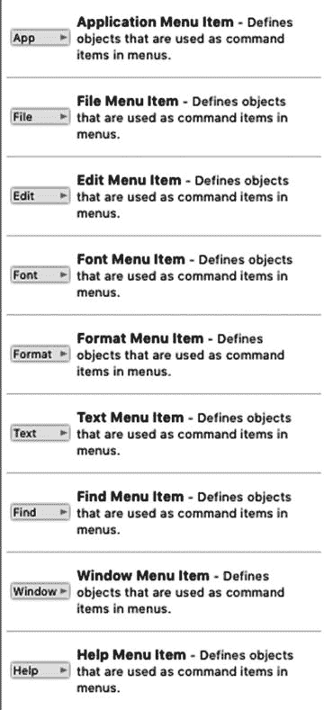

图 22-4. 你可以添加到程序菜单栏的下拉菜单标题

*   应用程序菜单项：包含应用程序下拉菜单标题中的典型命令，例如“关于”、“偏好设置”和“服务”
*   文件菜单项：包含文件下拉菜单标题中的典型命令，例如“打开”、“新建”和“保存”
*   编辑菜单项：包含编辑下拉菜单标题中的典型命令，例如“剪切”、“复制”和“粘贴”
*   字体菜单项：包含字体下拉菜单标题中的典型命令，例如“粗体”、“更大”和“拷贝样式”
*   格式菜单项：包含格式下拉菜单标题中的典型命令，例如“字体”和“文本”
*   文本菜单项：包含文本下拉菜单标题中的典型命令，例如“居中”、“书写方向”和“显示标尺”
*   查找菜单项：包含查找下拉菜单标题中的典型命令，例如“查找”、“查找和替换”以及“查找下一个”
*   窗口菜单项：包含窗口下拉菜单标题中的典型命令，例如“最小化”、“置于最前”和“缩放”
*   帮助菜单项：包含帮助下拉菜单标题中的典型命令，例如“应用程序帮助”

要将下拉菜单标题添加到程序的菜单栏，请遵循以下步骤：

1.  点击“项目导航器”窗格中的 `.xib` 或 `.storyboard` 文件。
2.  选择“视图”>“工具”>“显示对象库”，以在 Xcode 窗口的右下角显示对象库。
3.  从对象库中拖出一个下拉菜单项（见图 22-4），并将鼠标移动到程序的菜单栏上，直到出现一条垂直的蓝线，显示下拉菜单标题将要出现的位置，如图 22-5 所示。

   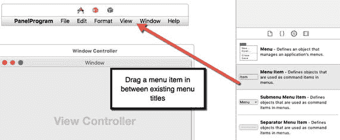

   图 22-5. 向菜单栏添加新的下拉菜单标题

   除了在程序菜单栏上拖动鼠标，你也可以在文档大纲中将鼠标拖到下拉菜单标题之间，直到出现一条水平的蓝线，显示菜单标题将要出现的位置，如图 22-6 所示。

   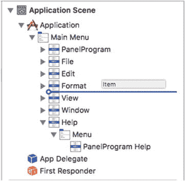

   图 22-6. 使用“文档大纲”向菜单栏添加新的下拉菜单标题

4.  松开鼠标。新的下拉菜单标题就会出现在菜单栏上。

要重新排列下拉菜单标题，请将鼠标指针移到要移动的菜单标题上（在菜单栏上或文档大纲中），然后拖动鼠标将菜单标题移到新位置。

## 向下拉菜单添加新命令

你可以在任何下拉菜单上删除、重新排列和添加命令。要删除命令，只需选中它并按退格键或删除键。要重新排列命令，请将其拖放到新位置。

要向下拉菜单添加新命令，你需要使用对象库中的以下三个项目，如图 22-7 所示：

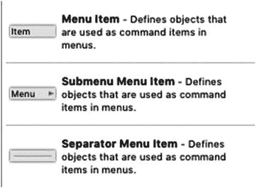

图 22-7. 用于修改下拉菜单命令的三个项目

*   菜单项：表示单个命令
*   子菜单项：表示一个包含更多命令的子菜单
*   分隔菜单项：显示一条水平线，用于分隔下拉菜单上的命令

要向下拉菜单添加新命令，请遵循以下步骤：

1.  点击“项目导航器”窗格中的 `.xib` 或 `.storyboard` 文件。
2.  选择“视图”>“工具”>“显示对象库”，以在 Xcode 窗口的右下角显示对象库。
3.  点击你要添加新命令的下拉菜单。你可以直接点击菜单栏上的下拉菜单标题，也可以在文档大纲中点击展开三角形来打开一个下拉菜单标题，如图 22-8 所示。

   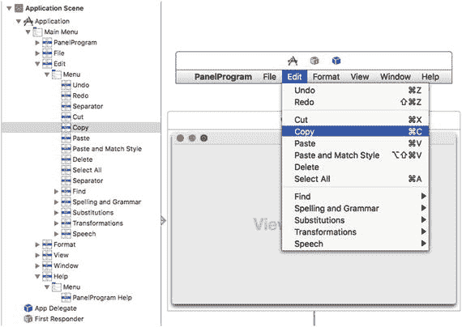

   图 22-8. 你可以直接在下拉菜单上或通过文档大纲添加新命令

4.  从对象库中拖出一个菜单项（见图 22-7），并将鼠标移入下拉菜单列表，直到出现一条水平的蓝线，显示命令将要出现的位置，如图 22-9 所示。

   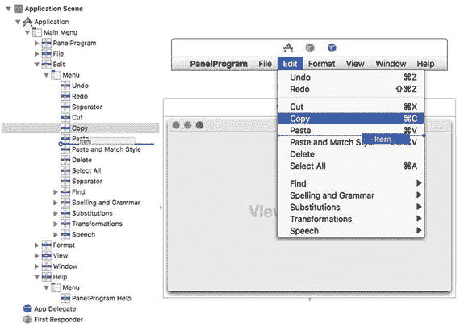

   图 22-9. 向下拉菜单列表中拖放新命令

5.  松开鼠标。Xcode 会将你的新菜单项添加到下拉菜单中。如果你添加的是子菜单项，现在就可以编辑存储在其子菜单中的命令了。


## 编辑命令

当你修改了菜单栏上出现的下拉菜单标题，以及每个下拉菜单上出现的命令后，你可能希望使用“检查器”面板进一步编辑每个单独的命令。“检查器”面板可用于修改以下属性：

- **标题**：显示菜单命令的文本
- **键位等效**：定义命令的键盘快捷键

要编辑命令（或下拉菜单标题），请按照以下步骤操作：

1. 在项目导航器面板中点击`.xib`或`.storyboard`文件。
2. 在“文档大纲”中或直接在下拉菜单上，点击要编辑的下拉菜单命令（或下拉菜单标题）。
3. 选择“显示”➤“实用工具”➤“显示属性检查器”。此时会出现“显示属性检查器”面板，如图 22-10 所示。

    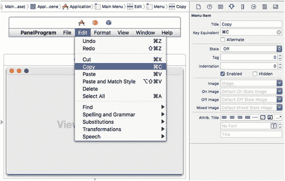

    图 22-10. 向下拉菜单列表中拖放新命令

4. 点击“检查器”面板中的“标题”文本字段，以编辑命令的文本。
5. 点击“键位等效”文本字段，然后按下（而非输入）你要分配给该命令的键盘快捷键。确保此键盘快捷键未被其他命令使用（例如“剪切”命令的 Command + X）。Xcode 将在下拉菜单命令的右侧显示你的键盘快捷键。

## 将菜单命令连接到 Swift 代码

当你修改了下拉菜单标题并用适当的命令填充它们后，最终你需要让这些命令真正执行某些操作。这意味着将你的菜单命令连接到`IBAction`方法，这与将按钮或其他用户界面项目连接到包含 Swift 代码的文件类似。你可以按住 Control 键，从下拉菜单上的菜单命令或“文档大纲”中显示的菜单命令拖拽。

当你创建一个 Cocoa 应用程序项目时，你会发现许多菜单命令已经可以工作，例如“文件”➤“打印”、“窗口”➤“最小化”以及应用程序名称➤“关于”命令。这些功能由 Cocoa 框架中的`NSApplication`、`NSWindow`、`NSView`和`NSResponder`类提供。

如果你点击 Cocoa 应用程序项目中的某个菜单命令，然后选择“显示”➤“实用工具”➤“显示连接检查器”，你将看到 Xcode 窗口右上角的“连接检查器”面板。

“连接检查器”面板允许你查看所选用户界面项目（如下拉菜单上的命令）连接到了什么，如图 22-11 所示。

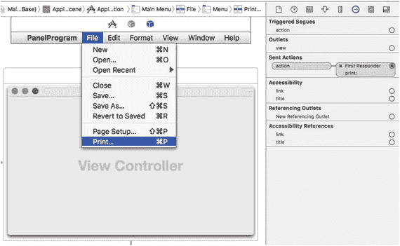

图 22-11. “连接检查器”面板显示了用户界面连接到了哪个`IBAction`方法

在图 22-11 中，“文件”菜单上的“打印”菜单命令连接到了`print:` `IBAction`方法，但此`IBAction`方法并不存储在特定文件中。相反，它连接到了一个名为“第一响应者”的对象，该对象由`NSResponder`类定义。

用户界面由多个基于`NSApplication`、`NSWindow`和`NSView`的对象组成，因此“第一响应者”只是指向第一个应响应用户点击用户界面项目（如“文件”菜单上的“打印”命令）的对象。如果这个第一个对象没有`print:` `IBAction`方法，它就会在下一个对象中搜索此`IBAction`方法。

因此，如果你在窗口上有一个文本字段并点击“文件”菜单上的“打印”命令，“打印”命令将首先在该文本字段（基于`NSTextField`，而`NSTextField`又基于`NSView`）中查找`print:` `IBAction`方法。如果在`NSTextField`类中找不到`print:` `IBAction`方法，它会接着在窗口（基于`NSWindow`）或应用程序本身（基于`NSApplication`）中查找。

如果你点击“第一响应者”图标，然后选择“显示”➤“实用工具”➤“显示连接检查器”，你可以看到“第一响应者”的“连接检查器”面板，该面板标识了所有连接到典型 Cocoa 应用程序项目默认下拉菜单的`IBAction`方法，如图 22-12 所示。

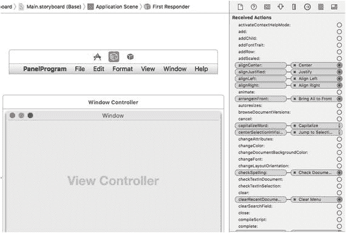

图 22-12. “第一响应者连接检查器”面板列出了所有连接到 Cocoa 应用程序项目默认下拉菜单的`IBAction`方法

> **注意：** 另一种查看“连接检查器”的方法是右键点击“第一响应者”图标，如图 22-13 所示。

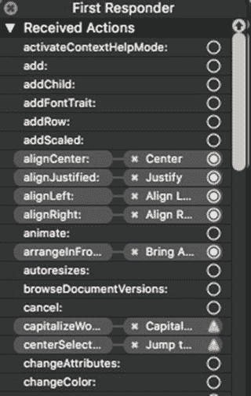

图 22-13. 右键点击“第一响应者”图标会列出所有连接到 Cocoa 应用程序项目默认下拉菜单的`IBAction`方法

尽管 Cocoa 应用程序模板创建了标准下拉菜单和命令，你仍需要编写 Swift 代码才能使许多命令真正生效。例如，“保存”命令不知道要保存什么或如何保存，“新建”命令不知道要创建哪种类型的文档。

要了解菜单命令如何像其他带有`.xib`文件的用户界面项目一样，与`IBAction`方法协同工作，请按照以下步骤操作：


从 Xcode 中选择 File ➤ New ➤ Project。  
点击 macOS 类别下的 Application。  
点击 Cocoa Application，然后点击 Next 按钮。Xcode 会要求输入产品名称。  
在 Product Name 文本字段中点击并输入 `MenuProgram`。  
确保 Language 弹出菜单显示 Swift，并且没有选中任何复选框。本项目将使用 `.xib` 文件作为用户界面。  
点击 Next 按钮。Xcode 会询问项目存储位置。  
选择一个文件夹来存储项目，然后点击 Create 按钮。  
在项目导航器中点击 `MainMenu.xib` 文件。  
在文档大纲中点击 Window 图标，以显示程序的用户界面。  
选择 View ➤ Utilities ➤ Show Object Library。Object Library 会出现在 Xcode 窗口的右下角。  
将一个文本字段拖拽到用户界面窗口中。你可能需要加宽该文本字段的宽度。  
将 Object Library 中的一个菜单项拖拽到 File 菜单的底部。你可以将该菜单项拖拽到 File 下拉菜单上，或拖拽到文档大纲中，如图 22-14 所示。

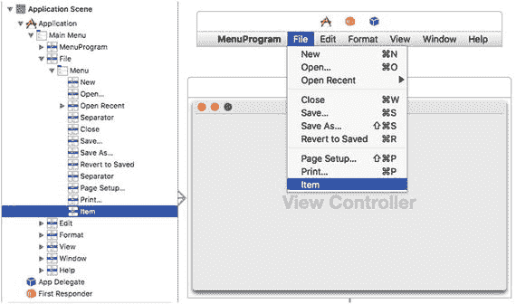

图 22-14.  
将菜单项拖拽到 File 下拉菜单的底部  
选择 View ➤ Assistant Editor ➤ Show Assistant Editor。`AppDelegate.swift` 文件会出现在用户界面旁边。  
将鼠标指针移到文本字段上，按住 Control 键，然后将其拖拽到 `AppDelegate.swift` 文件中的 `IBOutlet` 行下方。  
松开 Control 键和鼠标按钮。会出现一个弹出窗口。  
在 Name 文本字段中点击并输入 `textResult`，然后点击 Connect 按钮，使你的 `IBOutlet` 看起来像这样：

```
    @IBOutlet weak var textResult: NSTextField!
```

将鼠标指针移到刚刚添加到 File 下拉菜单底部的菜单项上（无论是在下拉菜单上还是在文档大纲中），按住 Control 键，然后将其拖拽到 `ViewController.swift` 文件底部最后一个大括号的上方。  
松开 Control 键和鼠标按钮。会出现一个弹出窗口。  
在 Connection 弹出菜单中点击并选择 Action。  
在 Name 文本字段中点击并输入 `myMenu`。  
在 Type 弹出菜单中点击并选择 `NSMenuItem`，然后点击 Connect 按钮。Xcode 会创建一个空的 `IBAction` 方法。  
按如下方式修改 `IBAction` 方法：

```
    @IBAction func myMenu(_ sender: NSMenuItem) {
    textResult.stringValue = "Clicked on = " + sender.title
    }
```

点击程序 File 下拉菜单中的 Save 命令（不是 Xcode 的 File 菜单）。  
选择 View ➤ Utilities ➤ Show Connections Inspector。Connections Inspector 面板显示 Save 命令已连接到 First Responder 中的 `saveDocument` IBAction 方法，如图 22-15 所示。

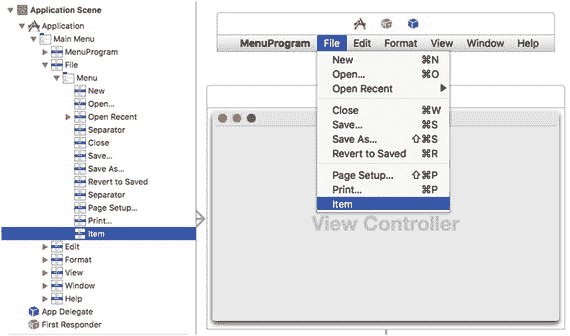

图 22-15.  
File 下拉菜单中 Save 命令的 Connections Inspector  
点击 First Responder 左侧出现的关闭图标（X）。这会切断 Save 命令与 `saveDocument` IBAction 方法之间的连接。  
将鼠标指针移到 File 下拉菜单中的 Save 命令上，按住 Control 键，然后将其拖拽到步骤 22 中创建的 IBAction 方法的 `myMenu` 函数关键字上。确保 Xcode 高亮显示整个 IBAction 方法并显示 Connect Action，如图 22-16 所示。

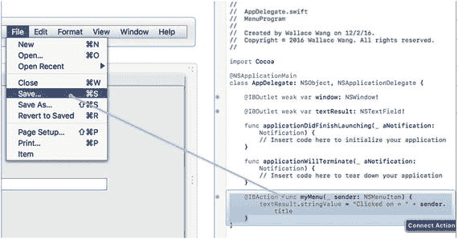

图 22-16.  
将 Save 命令连接到现有的 IBAction 方法  
松开 Control 键和鼠标按钮。Xcode 会将 Save 命令连接到 `myMenu` IBAction 方法。  
选择 Product ➤ Run。用户界面会出现。  
点击 File 菜单标题。注意，你的菜单项（标记为 Item）会出现在 File 下拉菜单的底部。  
点击 Save 命令。文本字段会显示“Clicked on = Save…”。  
点击 File 菜单标题并点击 Item（即你添加的菜单项）。文本字段会显示“Clicked on = Item”。  
选择 MenuProgram ➤ Quit MenuProgram。

`MenuProgram` 项目展示了如何将菜单命令连接到文本字段，以便文本字段显示用户点击的菜单命令的名称。但是，在使用 storyboard 时，连接菜单命令的方式略有不同。

主要区别在于，在 storyboard 中，下拉菜单存储在与实际用户界面不同的场景中，如图 22-17 所示。

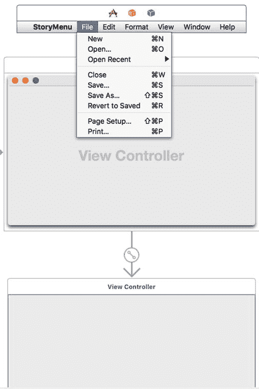

图 22-17.  
在 storyboard 中，下拉菜单出现在与用户界面分离的场景中

这意味着，当你对下拉菜单命令进行 Control 拖拽时，Xcode 会将你的 Swift 代码存储在 `AppDelegate.swift` 文件中；但如果你对用户界面元素（如文本字段）进行 Control 拖拽，Xcode 会将你的 Swift 代码存储在 `ViewController.swift` 文件中。

本质上，这意味着如果你为文本字段创建了一个 `IBOutlet`，它会存储在 `ViewController.swift` 文件中，而你的下拉菜单命令的 `IBAction` 方法则存储在 `AppDelegate.swift` 文件中，这意味着 `IBOutlet` 不知道这些 `IBAction` 方法的存在（反之亦然）。

解决这个问题的方法是将你的下拉菜单命令连接到 First Responder 图标。这意味着你的程序会首先在其 `AppDelegate.swift` 文件中查找 `IBAction` 方法，然后也会在其他文件中查找相同的 `IBAction` 方法。

因此，技巧是在 `AppDelegate.swift` 文件中创建一个空的 `IBAction` 方法，并在 `ViewController.swift` 文件中创建一个相同的 `IBAction` 方法，但你需要用 Swift 代码填充这第二个 `IBAction` 方法，以使其能够检索所选菜单命令的标题。

要了解菜单命令如何与 storyboard 配合工作，请按照以下步骤操作：

从 Xcode 中选择 File ➤ New ➤ Project。  
点击 macOS 类别下的 Application。  
点击 Cocoa Application，然后点击 Next 按钮。Xcode 会要求输入产品名称。  
在 Product Name 文本字段中点击并输入 `StoryMenu`。  
确保 Language 弹出菜单显示 Swift，并且仅选中“Use storyboards”复选框。  
点击 Next 按钮。Xcode 会询问项目存储位置。  
选择一个文件夹来存储项目，然后点击 Create 按钮。  
在项目导航器中点击 `Main.storyboard` 文件。程序的用户界面会出现。  
选择 View ➤ Utilities ➤ Show Object Library，然后将一个文本字段拖拽到用户界面（由标题栏中的视图控制器标识）上。你可能需要加宽文本字段的宽度。  
选择 View ➤ Assistant Editor ➤ Show Assistant Editor。Xcode 会在用户界面旁边显示 `ViewController.swift` 文件。  
将鼠标指针移到文本字段上，按住 Control 键，然后将其拖拽到 `class ViewController` 行下方。  
松开 Control 键和鼠标。会出现一个弹出窗口。  
在 Name 文本字段中点击并输入 `textResult`，然后点击 Connect 按钮。Xcode 会创建以下 `IBOutlet`：

```
    @IBOutlet weak var textResult: NSTextField!
```


14.  点击你程序中的**文件**下拉菜单（不是 Xcode 的**文件**菜单），显示其完整列表。此时助理编辑器应显示 `AppDelegate.swift` 文件。
15.  从对象库中拖拽一个菜单项，放到**文件**下拉菜单底部**打印**命令下方。
16.  将鼠标指针移到你刚刚添加到**文件**下拉菜单底部的新菜单项上，按住 Control 键，然后将鼠标拖到 `AppDelegate.swift` 文件底部最后一个花括号上方。此时会弹出一个窗口。
17.  点击“连接”弹出菜单，选择**操作**。
18.  点击“名称”文本字段，输入 `myMenu`。
19.  点击“类型”弹出菜单，选择 `NSMenuItem`，然后点击**连接**按钮。Xcode 会创建一个空的 IBAction 方法。
20.  选中这个空的 IBAction 方法，然后选择**编辑** ➤ **拷贝**。
21.  将鼠标指针移到你刚刚添加到**文件**菜单底部的新菜单项上，按住 Control 键，然后将鼠标拖到**第一响应者**图标上，如图 22-18 所示。

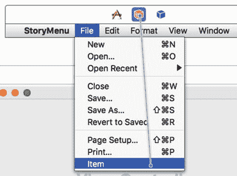

**图 22-18.** 将菜单命令连接到第一响应者图标

22.  松开 Control 键和鼠标。此时会弹出一个菜单，如图 22-19 所示。

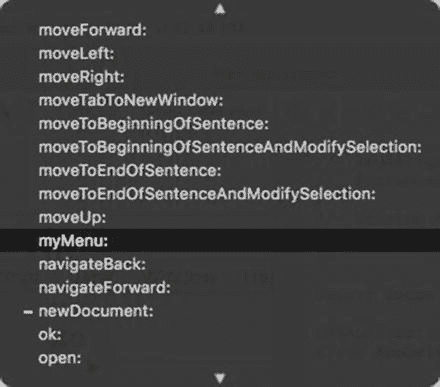

**图 22-19.** 将菜单命令连接到第一响应者图标

23.  点击 `myMenu`。
24.  将鼠标指针移到你程序中**文件**下拉菜单里的**保存**命令上（不是 Xcode 的**文件**菜单）。
25.  按住 Control 键，从**保存**命令拖向**第一响应者**图标。
26.  松开 Control 键和鼠标。此时会弹出一个菜单（参见图 22-19）。
27.  点击 `myMenu`。
28.  选择**视图** ➤ **标准编辑器** ➤ **查看标准编辑器**，使 Xcode 窗口中只显示一个文件。
29.  在项目导航器窗格中点击 `ViewController.swift` 文件。
30.  将光标移到 `ViewController.swift` 文件中最后一个花括号上方，然后选择**编辑** ➤ **粘贴**。Xcode 会将第 20 步中的 IBAction 方法粘贴过来。
31.  按如下方式修改这个 IBAction 方法：

```swift
@IBAction func myMenu(_ sender: NSMenuItem) {
    textResult.stringValue = "Clicked on = " + sender.title
}
```

32.  选择**产品** ➤ **运行**。你的用户界面会出现。
33.  在你的 StoryMenu 菜单栏上选择**文件** ➤ **保存**。请注意，文本字段会显示“Clicked on = Save…”。
34.  在你的 StoryMenu 菜单栏上选择**文件** ➤ **项目**。请注意，文本字段现在会显示“Clicked on = Item”。
35.  选择**StoryMenu** ➤ **退出 StoryMenu**。

### 总结

当你创建一个 Cocoa 应用程序项目时，Xcode 会自动为你的程序创建下拉菜单。你可以添加、删除或重新排列菜单栏上的菜单标题，或者下拉菜单中的菜单命令。为了方便用户，你甚至可以为菜单命令分配快捷键。

要编辑下拉菜单，你可以直接在下拉菜单上编辑，或者打开文档大纲。你可以通过 Control-拖拽的方式，从下拉菜单命令或文档大纲将菜单命令连接到 IBAction 方法。

在处理 `.storyboard` 文件时，你通常会将菜单命令连接到**第一响应者**图标。然后，你需要在正确的 Swift 文件中实现 IBAction 方法，以使该菜单命令生效。在处理 `.xib` 文件时，你可以直接将菜单命令连接到 IBAction 方法。

当 Xcode 为你的 Cocoa 应用程序创建下拉菜单时，许多菜单命令已经知道如何工作，例如**窗口** ➤ **缩放**和**文件** ➤ **关闭**。然而，大多数菜单命令在你编写自己的 Swift 代码使其在你的特定程序中正常工作之前，不会执行任何操作。

下拉菜单上的菜单命令为你提供了一种将命令连接到 IBAction 方法的额外方式。由于大多数 macOS 程序都依赖下拉菜单，因此应首先专注于将程序命令组织到下拉菜单中，然后编写 Swift 代码让每个菜单命令实际生效。

