# 23. 触控栏编程

Macintosh 电脑的最新输入设备是**触控栏**，它位于键盘上方，原本那一排功能键所在的位置。**触控栏**会根据你当前正在执行的操作显示上下文相关的快捷方式。例如，如果你正在打字，**触控栏**可能会显示建议输入的单词，你可以点击它们，从而无需完整键入整个单词。如果你正在编辑视频，**触控栏**可以让你在视频中前后滚动。

由于**触控栏**提供了一种与 Macintosh 交互的新方式，所有 macOS 程序都需要知道如何在**触控栏**上显示信息。**触控栏**编程的关键在于认识到并非所有 Macintosh 都配备**触控栏**。这意味着你不能在**触控栏**上显示任何无法同时在屏幕上查看的关键信息或命令。

**触控栏**的第二个关键特性是显示用户在那个特定时刻最可能需要的命令的快捷方式。如果你在编辑文本，**触控栏**应显示文本格式快捷方式，例如**粗体**、*斜体*和**下划线**命令。如果你在编辑图形，**触控栏**应切换并显示图形编辑快捷方式，例如用于选择不同颜色或更改绘图工具大小的按钮。

**触控栏**的关键在于使其适应用户。当为你自己的 macOS 程序添加**触控栏**快捷方式时，你需要：

-   在你程序用户界面的窗口中添加一个**触控栏**
-   在你的**触控栏**上添加按钮
-   创建一个 Swift 文件来控制包含**触控栏**的窗口
-   将**触控栏**按钮连接到 Swift 文件中的 IBAction 方法，使其能够执行操作

**注意：** 即使你的 Macintosh 没有配备**触控栏**，你也可以使用**触控栏**模拟器。要使用**触控栏**模拟器，你必须拥有 Xcode 8.1 或更高版本以及 macOS Sierra 10.12.1 或更高版本。

## 添加触控栏

**触控栏**只是对象库中的另一个项目，你可以将其拖拽到你的窗口上。如果你打开对象库并在搜索字段中输入**触控**，你可以轻松找到**触控栏**以及你可以添加到其中的所有项目，例如按钮或标签（参见图 23-1）。

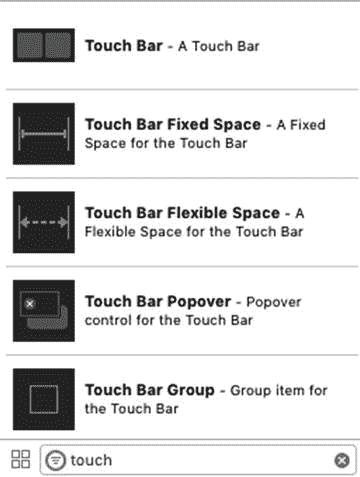

**图 23-1.** 对象库包含可以添加到**触控栏**的所有内容

向你的程序添加**触控栏**的第一步是将**触控栏**项目拖拽到窗口控制器上（不是视图控制器），如图 23-2 所示。

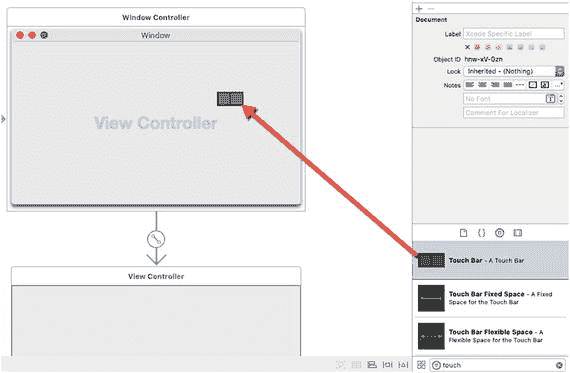

**图 23-2.** 将**触控栏**从对象库拖拽到窗口控制器

一旦你将**触控栏**放置在窗口控制器上，它就会出现在其下方，如图 23-3 所示。现在你需要创建一个 Swift 类文件，以包含使**触控栏**工作的 Swift 代码。

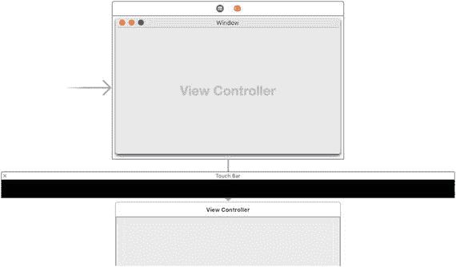

**图 23-3.** **触控栏**作为用户界面的一部分


## 创建 Swift 类文件

此时，Touch Bar 已连接到用户界面的窗口，但你还无法编写任何 Swift 代码使其工作，因为窗口控制器尚未定义对应的类文件。

要创建 Swift 类文件，请遵循以下步骤：

1.  选择“文件”➤“新建”➤“文件”。此时会出现模板窗口，如图 23-4 所示。

    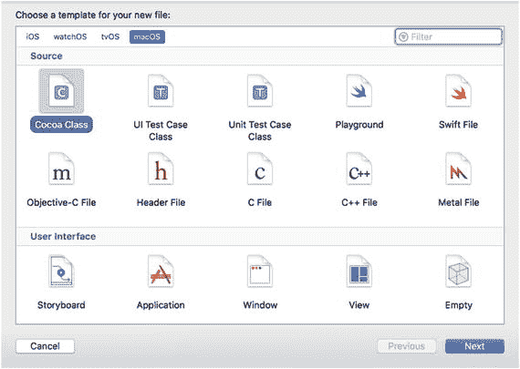

    图 23-4. 选择 Swift Cocoa 类文件  

2.  在 macOS 类别下的“Source”组中，点击“Cocoa Class”。  
3.  点击“下一步”按钮。此时会出现一个对话框，要求输入类名和子类，如图 23-5 所示。

    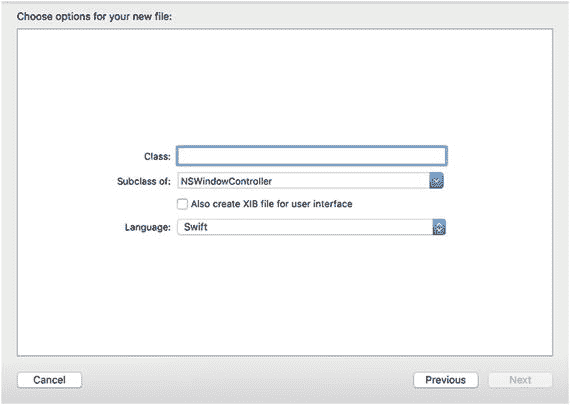

    图 23-5. 定义一个类  

4.  点击“Class”文本字段，并输入你的类名，例如 `TouchClass`。  
5.  确保“Subclass of”字段显示为 `NSWindowController`。  
6.  取消勾选“Also create XIB file for user interface”复选框。  
7.  确保“Language”弹出菜单显示为 Swift。  
8.  点击“下一步”按钮。此时会出现一个“保存”对话框。  
9.  点击“创建”按钮。Xcode 窗口将再次出现。

创建类文件后，需要将其连接到窗口控制器。要将类文件连接到窗口控制器，请执行以下步骤：

1.  点击包含窗口控制器和 Touch Bar 的 `.storyboard` 文件。  
2.  点击窗口顶部中央的蓝色“Window Controller”图标。  
3.  选择“视图”➤“实用工具”➤“显示身份检查器”。  
4.  点击“Class”字段右侧的向下箭头。你将看到一个可选的有效类文件菜单，如图 23-6 所示。

    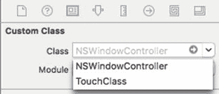

    图 23-6. 为窗口控制器选择类文件  

5.  点击你创建的类名（例如 `TouchClass`）。

至此，你的 Swift 类文件已连接到窗口控制器和 Touch Bar。现在，你可以向 Touch Bar 添加项目，并在刚选择的类文件中为 Touch Bar 创建 `IBOutlet` 和 `IBAction` 方法。

### 向 Touch Bar 添加项目

对象库包含了所有可以添加到 Touch Bar 的项目。你只能将 Touch Bar 项目放置在 Touch Bar 上，而不能放置普通的按钮或标签。要将项目放置在 Touch Bar 上，只需从对象库中拖放任意 Touch Bar 项目到 Touch Bar 上即可，如图 23-7 所示。

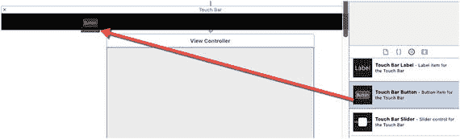

图 23-7. 从对象库将项目拖拽到 Touch Bar 上

Touch Bar 上常用的一些项目包括：

*   Touch Bar 按钮：显示一个单独的按钮
*   Touch Bar 固定/弹性间距：在多个 Touch Bar 项目之间创建间距
*   Touch Bar 标签：显示文本
*   Touch Bar 滑块：显示水平滑块

### 将 Touch Bar 项目连接到 Swift 代码

在 Touch Bar 上放置一个或多个项目后，你可以按住 Control 键从这些 Touch Bar 项目拖拽到你的 Swift 类文件，以创建 `IBOutlet` 和 `IBAction` 方法，如图 23-8 所示。

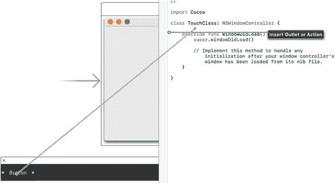

图 23-8. 从 Touch Bar 按住 Control 键拖拽到 Swift 类文件

对于许多 Touch Bar 项目，你可能需要编写额外的 Swift 代码才能让它们工作。如果你的 Macintosh 键盘上方没有 Touch Bar，你可以使用 Xcode 的 Touch Bar 模拟器。要启用 Touch Bar 模拟器，请选择“窗口”➤“显示 Touch Bar”（或按 Shift + Command + 5），如图 23-9 所示。

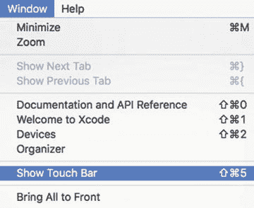

图 23-9. “显示 Touch Bar”命令出现在 Xcode 的“窗口”菜单中

如果你的 Macintosh 没有 Touch Bar，你需要运行你的程序，切换到 Xcode，选择“窗口”➤“显示 Touch Bar”，然后再切换回正在运行的程序，即可在屏幕上看到程序的模拟 Touch Bar。


## 创建触控栏程序

要创建示例触控栏程序并了解触控栏模拟器的工作原理，请按以下步骤操作：

1.  在 Xcode 中选择“文件”➤“新建”➤“项目”。
2.  在 macOS 类别下单击“应用程序”。
3.  单击“Cocoa 应用程序”，然后单击“下一步”按钮。 Xcode 现在会要求输入产品名称。
4.  单击“产品名称”文本字段并输入 `TouchProgram`。
5.  确保“语言”弹出菜单显示 Swift，并且“使用 Storyboard”复选框已被勾选。
6.  单击“下一步”按钮。 Xcode 会询问您希望将项目存储在何处。
7.  选择一个文件夹来存储您的项目，然后单击“创建”按钮。
8.  在项目导航器中单击 `Main.storyboard` 文件。
9.  选择“显示”➤“工具”➤“显示对象库”，在 Xcode 窗口的右下角显示对象库。
10. 单击对象库底部的搜索字段，然后输入 `touch`。对象库将仅显示触控栏项目（见图 23-1）。
11. 将触控栏项目拖放到窗口控制器上（见图 23-2）。触控栏会出现在窗口控制器下方。
12. 将一个触控栏按钮、一个触控栏颜色选择器和一个触控栏滑块拖到触控栏上，如图 23-10 所示。

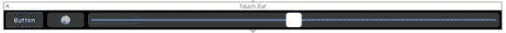

图 23-10. 带有一个按钮、颜色选择器和滑块的触控栏

13. 选择“文件”➤“新建”➤“文件”。会显示一个模板对话框（见图 23-4）。
14. 在 macOS 类别下的“来源”组中单击“Cocoa 类”，然后单击“下一步”按钮。会显示一个要求输入类名和子类的对话框（见图 23-5）。
15. 单击“类”文本字段并输入 `TouchClass`。
16. 取消勾选“同时为用户界面创建 XIB 文件”复选框。
17. 确保“子类为”字段包含 `NSWindowController`，并且“语言”弹出菜单显示 Swift。
18. 单击“下一步”按钮。会显示一个“保存”对话框。
19. 单击“创建”按钮。Xcode 窗口会再次出现。
20. 在导航器窗格中单击 `Main.storyboard` 文件。
21. 单击窗口顶部中央的蓝色“窗口控制器”图标，如图 23-11 所示。

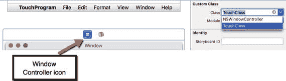

图 23-11. 单击蓝色“窗口控制器”图标可选择该窗口控制器

22. 选择“显示”➤“工具”➤“显示身份检查器”。
23. 单击“类”字段右侧向下的箭头。查看您可以选择的有效类文件菜单（见图 23-6）。
24. 选择 `TouchClass`。
25. 选择“显示”➤“助手编辑器”➤“显示助手编辑器”。触控栏会出现在 Xcode 中间窗格的左半部分，`TouchClass.swift` 文件会出现在右半部分。
26. 将鼠标指针移到触控栏按钮上。
27. 按住 Control 键，然后从触控栏按钮拖拽鼠标到 `class TouchClass` 行的下方，如图 23-12 所示。

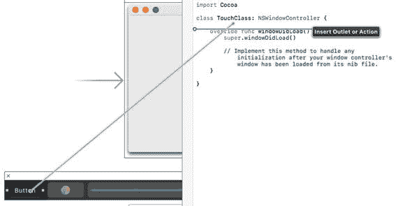

图 23-12. 从触控栏按住 Control 键拖拽到 Swift 类文件

28. 松开 Control 键和鼠标左键。会显示一个弹出窗口。
29. 单击“名称”文本字段并输入 `touchButton`，然后单击“连接”按钮。这会为触控栏按钮创建一个 `IBOutlet`：

```
@IBOutlet weak var touchButton: NSButton!
```

30. 将鼠标指针移到触控栏颜色选择器图标上。
31. 按住 Control 键，然后从触控栏按钮拖拽鼠标到 `class TouchClass` 行的下方。
32. 单击“名称”文本字段并输入 `colorIcon`，然后单击“连接”按钮。这会为触控栏颜色选择器创建一个 `IBOutlet`：

```
@IBOutlet weak var colorIcon: NSColorPickerTouchBarItem!
```

33. 在 `class TouchClass` 行上方添加以下代码行：

```
@available(OSX 10.12.1, *)
class TouchClass: NSWindowController {
```

这行 Swift 代码意味着您的程序只能运行在安装了 macOS 10.12.1 或更高版本的 Macintosh 电脑上。

34. 将鼠标指针移到触控栏颜色选择器滑块上。
35. 按住 Control 键，然后从触控栏按钮拖拽鼠标到 `class TouchClass` 行的下方。
36. 单击“名称”文本字段并输入 `touchSlider`，然后单击“连接”按钮。这会为触控栏颜色选择器创建一个 `IBOutlet`：

```
@IBOutlet weak var touchSlider: NSSliderAccessory!
```

37. 在 `class TouchClass` 行上方添加以下代码行，如下所示：

```
@available(OSX 10.12.2, *)
```

至此，您已经创建了一个触控栏并为其添加了项目。您还创建了代表每个触控栏项目的 `IBOutlet`。现在，最后一步是编写 Swift 代码，让每个触控栏项目都能正常工作。

要为您的触控栏项目编写 Swift 代码，请按以下步骤操作：

1.  将鼠标指针移到触控栏按钮上。
2.  按住 Control 键，然后从触控栏按钮拖拽鼠标到 `TouchClass.swift` 文件中最后一个大括号的上方。
3.  松开 Control 键和鼠标左键。会显示一个弹出窗口。
4.  单击“连接”弹出菜单并选择“动作”。
5.  单击“名称”文本字段并输入 `buttonClicked`。
6.  单击“类型”弹出菜单并选择 `NSButton`。然后单击“连接”按钮以创建一个 `IBAction` 方法。
7.  将鼠标指针移到触控栏颜色选择器图标上。
8.  按住 Control 键，然后从触控栏按钮拖拽鼠标到 `TouchClass.swift` 文件中最后一个大括号的上方。
9.  松开 Control 键和鼠标左键。会显示一个弹出窗口。
10. 单击“连接”弹出菜单并选择“动作”。
11. 单击“名称”文本字段并输入 `colorPicked`。
12. 单击“类型”弹出菜单并选择 `NSColorPickerTouchBarItem`，如图 23-13 所示。

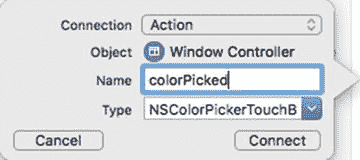

图 23-13. 为颜色选择器图标创建 IBAction 方法

13. 单击“连接”按钮以创建一个 `IBAction` 方法。
14. 单击“显示文稿大纲”图标以显示用户界面的所有部分。文稿大纲使您可以轻松选择正确的触控栏项目。触控栏滑块由一个滑块和一个水平滑块组成。如果您直接单击触控栏上的滑块，您可能会意外选中水平滑块而不是滑块。
15. 将鼠标指针移到“滑块”图标上。
16. 按住 Control 键，然后从触控栏按钮拖拽鼠标到 `TouchClass.swift` 文件中最后一个大括号的上方，如图 23-14 所示。

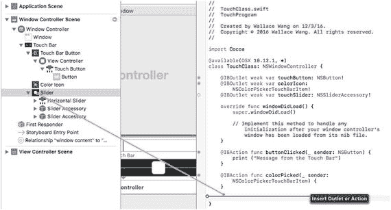

图 23-14. 从文稿大纲拖拽

17. 松开 Control 键和鼠标左键。会显示一个弹出窗口。
18. 单击“连接”弹出菜单并选择“动作”。
19. 单击“名称”文本字段并输入 `sliderChanged`。
20. 单击“类型”弹出菜单并选择 `NSSliderTouchBarItem`。然后单击“连接”按钮。
21. 将三个 `IBAction` 方法修改如下：

```
@IBAction func buttonClicked(_ sender: NSButton) {
    print ("来自触控栏的消息")
}
@IBAction func colorPicked(_ sender: NSColorPickerTouchBarItem) {
    print ("\(colorIcon.color.cgColor)")
}
@IBAction func sliderChanged(_ sender: NSSliderTouchBarItem) {
    print ("滑块值 = \(sender.slider.intValue)")
}
```

22. 通过输入 `colorIcon.isEnabled = true` 修改 `windowDidLoad` 函数，如下所示：


```swift
override func windowDidLoad() {
    super.windowDidLoad()
    colorIcon.isEnabled = true
    colorIcon.target = self
    colorIcon.action = #selector(colorPicked)
}
```

这段 Swift 代码告诉颜色选择器，在程序运行时将在触控栏上显示。

23. 选择 `Product` ➤ `Run`。你的 `TouchProgram` 用户界面会出现。现在你需要让触控栏模拟器也显示出来。
24. 点击 Dock 栏上的 Xcode 图标，切换回 Xcode。
25. 选择 `Window` ➤ `Show Touch Bar`（或按下 `Shift + Command + 5`）。触控栏模拟器会出现。
26. 点击 Dock 栏上的 `Touch Program` 图标，切换回你的 `TouchProgram`。注意触控栏模拟器现在会显示你添加的按钮、颜色选择器和滑块（参见图 23-15）。

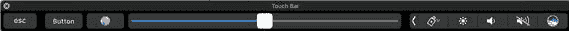

**图 23-15.** 显示触控栏模拟器

27. 点击触控栏左侧的按钮。文本“Message from the Touch Bar”会出现在 Xcode 窗口底部的调试区。
28. 来回拖动滑块。调试区会显示“Slider value = ”，后跟一个数值。
29. 点击触控栏上按钮和滑块之间的颜色选择器图标。触控栏现在会显示一系列颜色，如图 23-16 所示。


**图 23-16.** 颜色选择器在触控栏上显示可供选择的颜色

30. 点击任意颜色。注意调试区会显示你选择的颜色的名称（参见图 23-17）。

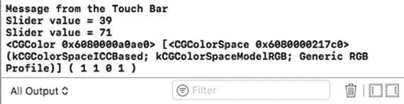

**图 23-17.** Xcode 的调试区显示来自触控栏的消息

31. 点击触控栏左侧圆圈中的 X，即可再次在触控栏上显示按钮、颜色选择器和滑块。
32. 选择 `TouchProgram` ➤ `Quit TouchProgram`。

### 总结

在所有 Macintosh 电脑都配备触控栏之前，触控栏将是用户与 macOS 程序交互的一种可选方式。最终，每台 Macintosh 都将配备触控栏，但在此之前，你需要添加下面这行代码，以确保触控栏程序仅在运行 macOS 10.12.2 或更高版本的 Macintosh 上运行：

```swift
@available(OSX 10.12.2, *)
```

要创建触控栏，你只需从对象库中将一个触控栏项目拖放到你的窗口控制器（而不是视图控制器）上。然后你需要创建一个 Swift 类文件，用于存放从你放置在触控栏上的任何项目（如按钮、滑块或标签）中关联的 `IBOutlet` 和 `IBAction` 方法。创建完 Swift 类文件后，你必须通过使用身份检查器将该类文件定义为与你的窗口控制器配合使用。

要让触控栏模拟器在没有触控栏的 Macintosh 上显示，你必须先运行你的程序，然后切换回 Xcode，选择 `Window` > `Show Touch Bar`。接着你需要切换回你正在运行的程序，才能看到触控栏实际工作。

触控栏将成为 Macintosh 的标准输入设备，因此可以预见 Apple 将添加你可以添加到触控栏上的新项目。随着越来越多的人习惯使用触控栏，可以肯定每个 macOS 程序都需要添加对触控栏的支持。

