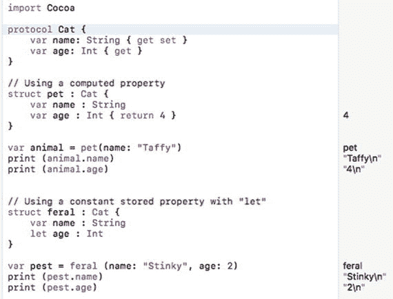
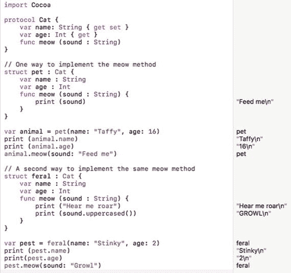
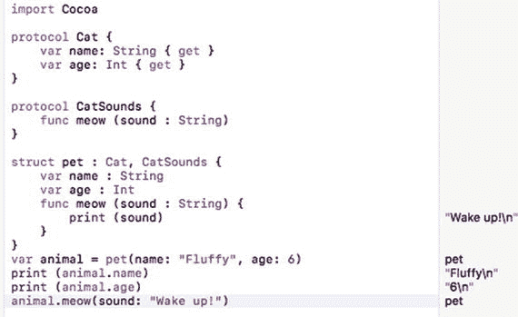
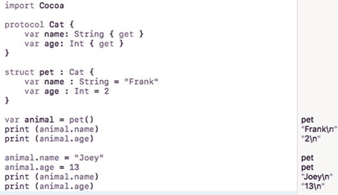
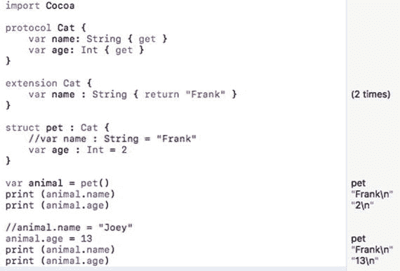
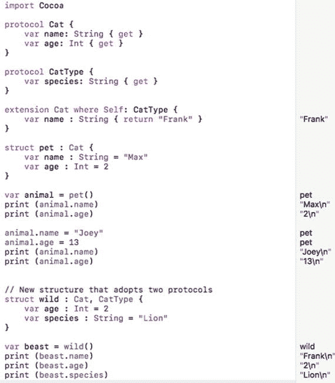
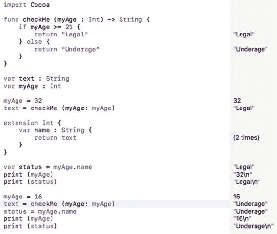

# 24. 面向协议编程

当 Apple 在 2014 年的全球开发者大会上推出 Swift 时，它被宣传为一种比 Objective-C 更简单、更安全、更快的用于 iOS、macOS、tvOS 和 watchOS 开发的编程语言。虽然 Swift 和 Objective-C 都支持面向对象编程，但 Swift 更进一步，还提供了面向协议编程。

纯面向对象编程语言的最大问题之一是，扩展类的功能意味着要创建额外的子类。然后你必须基于这些新子类创建对象。这可能是一种笨拙的解决方案，因为你现在必须跟踪一个或多个子类，其中每个子类都有不同的名称，并且它们之间可能只有细微的差别。

更糟糕的是，Swift（与某些面向对象编程语言不同）只允许单继承。这意味着一个类只能恰好继承自另一个类。如果你真的想从两个不同的类继承属性和方法，这是不可能的。

为了解决继承和多子类的问题，Swift 提供了协议。协议的工作方式与面向对象编程非常相似，但有一些额外的优势：

-   协议可以扩展类、结构体和枚举的功能。继承只能扩展类的功能。
-   单个类、结构体或枚举可以由一个或多个协议扩展。继承只能扩展单个类。

这意味着协议比类更灵活、更通用，同时为你提供了面向对象编程的优点，而没有其缺点。你可以使用协议（面向协议编程）代替类（面向对象编程），或者混合使用面向对象编程和面向协议编程，以兼得两者的优点。


## 理解协议

与类相似，协议可以定义属性（变量）和方法（函数）。主要区别在于，协议无法为属性设置初始值，也无法实现方法本身。协议仅定义属性及其数据类型。在协议中定义属性时，需要明确以下三项内容：

- 属性名称，可以是任意具有描述性的名称
- 属性的数据类型，例如 `Int`、`Double`、`String` 等
- 属性是只读 `{ get }`，还是可读写 `{ get set }`

**注意：** 可读写 `{ get set }` 属性不能赋值给常量存储属性（使用 `let` 关键字定义）或只读计算属性。只读 `{ get }` 属性则没有此类限制。

请参考下列协议：

```
protocol Cat {
    var name: String { get set }
    var age: Int { get }
}
```

现在你可以基于此协议创建一个结构体，例如：

```
struct pet : Cat {
    var name : String
    // let name : String -- 无效，因为 "let" 定义了常量存储属性
    // var name : String { return "Fred" } -- 无效，因为这是只读计算属性
    let age : Int
}
```

上述代码定义了一个名为 `pet` 的结构体，它遵循 `Cat` 协议。这意味着该结构体需要声明 `name` 属性为字符串类型，`age` 属性为整数类型。

请注意，由于 `Cat` 协议将 `age` 属性定义为只读 `{ get }`，你可以使用 `let` 关键字将其实现为常量。你也可通过返回一个值来计算 `age` 属性，例如：

```
struct pet : Cat {
    var name : String
    var age : Int { return 4 }
}
```

要了解如何使用含有不同类型属性的协议和结构体，请按以下步骤操作：

1.  在 Xcode 中选择 **File > New > Playground**。Xcode 会要求输入 playground 名称。
2.  点击 **Name** 文本框，输入 `ProtocolPlayground`。
3.  确保 **Platform** 弹出菜单显示为 `macOS`。
4.  点击 **Next** 按钮。Xcode 会询问你希望将 playground 存储在何处。
5.  选择一个文件夹来存储你的项目，然后点击 **Create** 按钮。
6.  按如下方式编辑 playground 代码：

    ```
    import Cocoa
    protocol Cat {
        var name: String { get set }
        var age: Int { get }
    }
    // 使用计算属性
    struct pet : Cat {
        var name : String
        var age : Int { return 4 }
    }
    var animal = pet(name: "Taffy")
    print (animal.name)
    print (animal.age)
    // 使用 "let" 定义常量存储属性
    struct feral : Cat {
        var name : String
        let age : Int
    }
    var pest = feral (name: "Stinky", age: 2)
    print (pest.name)
    print (pest.age)
    ```

请注意基于结构体声明变量时的差异。当 age 使用计算属性时，声明变量时无需创建初始值，例如：

```
// 使用计算属性 { return 4 }
struct pet : Cat {
    var name : String
    var age : Int { return 4 }
}
var animal = pet(name: "Taffy")
```

然而，如果你没有使用计算属性，那么在创建变量时必须显式地初始化它，例如：

```
// 使用 "let" 定义常量存储属性
struct feral : Cat {
    var name : String
    let age : Int
}
var pest = feral (name: "Stinky", age: 2)
```

图 24-1 展示了如何基于同一个协议定义两个结构体。



**图 24-1.** 两个不同的结构体可以遵循同一个协议

## 在协议中使用方法

当协议定义一个方法时，它仅定义方法名称、参数以及返回值的数据类型，但不包含任何实际实现该方法的 Swift 代码，例如：

```
protocol Cat {
    var name: String { get set }
    var age: Int { get }
    func meow (sound: String)
}
```

如果一个类、结构体或枚举遵循此 `Cat` 协议，它不仅需要定义 `name` 和 `age` 属性，还必须使用 Swift 代码实现协议中的方法，例如：

```
struct pet : Cat {
    var name : String
    var age : Int
    func meow (sound : String) {
        print (sound)
    }
}
```

即使类、结构体或枚举遵循的是完全相同的协议，其方法的实际实现也可能大相径庭。在上述示例中，`pet` 结构体使用单个 `print` 语句定义了 `meow` 函数。在下面的示例中，`feral` 结构体使用两个 `print` 语句定义了 `meow` 函数：

```
struct feral : Cat {
    var name : String
    var age : Int
    func meow (sound : String) {
        print ("听我咆哮")
        print (sound.uppercased())
    }
}
```

要了解如何在协议中定义方法并在不同结构体中实现它们，请按以下步骤操作：

1.  确保 Xcode 中已加载 `ProtocolPlayground` 文件。
2.  按如下方式编辑 playground 代码：

```
import Cocoa
protocol Cat {
    var name: String { get set }
    var age: Int { get }
    func meow (sound : String)
}
// 实现 meow 方法的一种方式
struct pet : Cat {
    var name : String
    var age : Int
    func meow (sound : String) {
        print (sound)
    }
}
var animal = pet(name: "Taffy", age: 16)
print (animal.name)
print (animal.age)
animal.meow(sound: "喂我")
// 实现同一个 meow 方法的第二种方式
struct feral : Cat {
    var name : String
    var age : Int
    func meow (sound : String) {
        print ("听我咆哮")
        print (sound.uppercased())
    }
}
var pest = feral(name: "Stinky", age: 2)
print (pest.name)
print(pest.age)
pest.meow(sound: "低吼")
```

图 24-2 展示了同一协议方法的两种不同实现的工作方式。



**图 24-2.** 尽管遵循同一协议，方法的实现可以不同

## 遵循多个协议

与面向对象编程相比，协议的一大优势在于单个类、结构体或枚举可以遵循两个或更多的协议。要实现这一点，你只需指定要遵循的每个协议的名称，如下所示：

```
struct structureName : protocolName1, protocolName2, protocolNameN {
```

通过允许你遵循多个协议，Swift 使编码更加灵活，因为你可以选择和使用所需的协议。要了解如何实现遵循多个协议，请按以下步骤操作：

1.  确保 Xcode 中已加载 `ProtocolPlayground` 文件。
2.  按如下方式编辑 playground 代码：

    ```
    import Cocoa
    protocol Cat {
        var name: String { get }
        var age: Int { get }
    }
    protocol CatSounds {
        func meow (sound : String)
    }
    struct pet : Cat, CatSounds {
        var name : String
        var age : Int
        func meow (sound : String) {
            print (sound)
        }
    }
    var animal = pet(name: "Fluffy", age: 6)
    print (animal.name)
    print (animal.age)
    animal.meow(sound : "起床!")
    ```

图 24-3 展示了这段代码如何通过一个结构体遵循两个协议来工作。请注意，这段代码的运行效果与将 `name` 和 `age` 属性与 `meow` 方法定义在同一协议中完全相同。通过将不同的属性和方法分离到两个或更多的协议中，你无需实现那些不需要的属性和/或方法。



**图 24-3.** 一个结构体可以遵循两个或更多协议

由于你可以遵循多个协议，通常最好让每个协议尽可能简短和简单。这样可以更容易地只使用你需要的协议，而无需被迫实现你可能不想要或不必要的额外属性和/或方法。


好的，身为高级文档工程师和翻译员，我将遵循您的指示，将以下英文文本翻译成中文，并严格保留 Markdown 格式。


### 协议扩展

在面向对象编程的世界中，你可以通过继承来扩展一个类，这会继承该类可能从其他类继承而来的所有属性和方法。在面向协议编程的世界中，你可以通过协议扩展来扩展一个协议。

协议扩展的用途之一是为属性定义默认值。你可以通过简单地为某个或多个属性赋值来定义默认值，例如：

```
protocol Cat {
    var name: String { get }
    var age: Int { get }
}
```

这段代码定义了一个名为 `Cat` 的协议，它定义了 `name` 和 `age` 属性为可获取的 `{ get }`。然后，你可以创建一个遵循 `Cat` 协议并为每个属性赋予初始值的结构体：

```
struct pet : Cat {
    var name : String = "Frank"
    var age : Int = 2
}
```

现在，如果你基于此结构体声明一个变量，该变量将包含这些初始值。尽管有初始值，你仍然可以随时在这些属性中存储新数据。要了解如何在不使用扩展的情况下为协议属性定义初始值，请按照以下步骤操作：

1.  确保 `ProtocolPlayground` 文件已在 Xcode 中加载。
2.  按如下方式编辑 playground 代码：

```
import Cocoa
protocol Cat {
    var name: String { get }
    var age: Int { get }
}
struct pet : Cat {
    var name : String = "Frank"
    var age : Int = 2
}
var animal = pet()
print (animal.name)
print (animal.age)
animal.name = "Joey"
animal.age = 13
print (animal.name)
print (animal.age)
```

当你第一次基于 `pet` 结构体创建 `animal` 变量时，初始的 `name` 属性值为 "Frank"，初始的 `age` 属性值为 2。你可以随时为这两个属性存储新值，如图 24-4 所示。



图 24-4. 你可以为协议定义的可获取属性分配初始值

如果你想为一个属性设置（并保持）一个初始值，这时就可以使用协议扩展了。协议扩展仅能用于可获取的 `{ get }` 属性。一个协议扩展只需使用 `extension` 关键字，后跟要扩展的协议名称，例如：

```
extension Cat {
    // 在此处为一个或多个可获取属性设置默认值
}
```

在扩展内部，你可以使用 `return` 关键字为一个或多个可获取属性计算默认值，例如：

```
extension Cat {
    var name : String { return "Frank" }
}
```

协议扩展不仅将 `name` 属性定义为包含字符串 "Frank"，还免除了在类、结构体或枚举中定义 `name` 属性的需要，例如：

```
extension Cat {
    var name : String { return "Frank" }
}
struct pet : Cat {
    var age : Int = 2
}
```

上述协议扩展和结构体本质上等同于以下代码：

```
struct pet : Cat {
    var name : String = "Frank"
    var age : Int = 2
}
```

主要区别在于，当 `name` 属性在结构体内部声明时，你可以在之后为其分配新的字符串。当 `name` 属性在协议扩展内部声明并设置为一个值时，你之后就不能再为其分配新的字符串了。要了解协议扩展如何定义默认值，请按照以下步骤操作：

1.  确保 `ProtocolPlayground` 文件已在 Xcode 中加载。
2.  按如下方式编辑 playground 代码：

```
import Cocoa
protocol Cat {
    var name: String { get }
    var age: Int { get }
}
extension Cat {
    var name : String { return "Frank" }
}
struct pet : Cat {
    //var name : String = "Frank"
    var age : Int = 2
}
var animal = pet()
print (animal.name)
print (animal.age)
//animal.name = "Joey"
animal.age = 13
print (animal.name)
print (animal.age)
```

在上面的代码中，两行被注释掉的代码向你展示了协议扩展所省略的内容。一旦你在协议扩展中定义了 `name` 属性，就不再需要在 `pet` 结构体中声明该 `name` 属性。在协议扩展中为 `name` 属性分配了默认值后，你也不能再为其分配新的字符串（例如 "Joey"）。图 24-5 显示了上述代码的结果。



图 24-5. 使用协议扩展定义默认值

在协议扩展中定义默认值的一个问题是，任何遵循该协议的对象都必须同时遵循该协议的扩展。这意味着所有基于该协议和扩展的对象都将拥有相同的、无法更改的默认值。

如果你希望在定义默认值时拥有灵活性，但仅针对特定的类、结构体或枚举，你可以创建一个协议扩展，该扩展仅适用于也遵循另一个协议的类、结构体或枚举：

```
extension protocol2Extend where Self: protocol2Use {
    // 在此处为一个或多个可获取属性设置默认值
}
```

上述 Swift 代码扩展了一个由 `protocol2Extend` 定义的协议。然而，`where Self:` 关键字标识了由 `protocol2Use` 定义的第二个协议。

因此，如果一个类、结构体或枚举遵循 `protocol2Extend` 定义的协议，那么只有当该类、结构体或枚举也遵循 `protocol2Use` 定义的第二个协议时，扩展才会设置默认值。

假设你创建了以下协议扩展：

```
extension Cat where Self: CatType {
    var name : String { return "Frank" }
}
```

这将为任何遵循 `Cat` 协议和 `CatType` 协议的类、结构体或枚举的 `name` 属性定义一个默认值 "Frank"。如果一个类、结构体或枚举仅遵循 `Cat` 协议，那么它的 `name` 属性将不会被分配默认值 "Frank"。

要了解此版本的协议扩展如何仅在类、结构体或遵循特定协议的前提下工作，请按照以下步骤操作：

1.  确保 `ProtocolPlayground` 文件已在 Xcode 中加载。
2.  按如下方式编辑 playground 代码：

```
import Cocoa
protocol Cat {
    var name: String { get }
    var age: Int { get }
}
protocol CatType {
    var species: String { get }
}
extension Cat where Self: CatType {
    var name : String { return "Frank" }
}
struct pet : Cat {
    var name : String = "Max"
    var age : Int = 2
}
var animal = pet()
print (animal.name)
print (animal.age)
animal.name = "Joey"
animal.age = 13
print (animal.name)
print (animal.age)
// 遵循两个协议的新结构体
struct wild : Cat, CatType {
    var age : Int = 2
    var species : String = "Lion"
}
var beast = wild()
print (beast.name)
print (beast.age)
print (beast.species)
```

注意，`pet` 结构体遵循了 `Cat` 协议，但由于它没有同时遵循 `CatType` 协议，因此你可以为其 `name` 属性分配一个初始值 "Max"，并且之后可以重新分配 "Joey" 给同一个 `name` 属性。

然而，`wild` 结构体同时遵循了 `Cat` 和 `CatType` 协议，因此它也遵循了协议扩展，该扩展将 "Frank" 作为默认值分配给 `wild` 结构体的 `name` 属性，如图 24-6 所示。



图 24-6. 协议扩展可以选择性地为遵循特定协议的结构体分配默认值


### 使用协议扩展扩展通用数据类型

协议扩展最有趣的用途之一，可能是为诸如 `String`、`Int` 和 `Double` 这样的通用数据类型添加属性。用于扩展数据类型的协议扩展如下所示：

```
extension dataType {
// 新属性 {
// 返回计算值
}
}
```

当你使用协议扩展通用数据类型时，必须创建一个变量，该变量代表数据类型，后跟一个句点和属性名。因此，如果你为 `Int` 数据类型创建了如下扩展：

```
extension Int {
var name : String {
return text
}
}
```

你可以像这样存储一个字符串值：

```
var status = 25.name   // 表示一个 String
```

要了解如何使用协议扩展来扩展通用数据类型，请按以下步骤操作：

1.  确保 `ProtocolPlayground` 文件已在 Xcode 中加载。  
2.  按如下方式编辑 playground 代码：

```
import Cocoa
func checkMe (myAge : Int) -> String {
if myAge >= 21 {
return "Legal"
} else {
return "Underage"
}
}
var text : String
var myAge : Int
myAge = 32
text = checkMe (myAge : myAge)
extension Int {
var name : String {
return text
}
}
var status = myAge.name
print (myAge)
print (status)
myAge = 16
text = checkMe (myAge : myAge)
status = myAge.name
print (myAge)
print (status)
```

图 24-7 显示了运行此代码的结果。如您所见，当 `myAge` 变量大于 21 时，其 `name` 属性会存储一个字符串，该字符串会被存入 `status` 变量。根据 `myAge` 变量的值，`name` 属性会存储字符串“Legal”或字符串“Underage”。



**图 24-7.** 协议扩展可以扩展通用数据类型

### 总结

协议提供了一种扩展现有代码的替代方式。就像类一样，协议可以定义属性和方法。主要区别在于，协议只定义方法的名称和参数，但并未实际包含实现该方法的 Swift 代码。

另一个区别是，当协议定义属性时，它还必须定义该属性是只读的 (`{ get }`) 还是可读写的 (`{ get set }`)。

协议的工作原理与继承非常相似。虽然继承只允许类继承自恰好一个其他类，但协议可以使用一个或多个协议来扩展类、结构体和枚举。

协议扩展允许你为属性定义默认值。当与诸如 `Int`、`String` 和 `Double` 这样的通用数据类型结合使用时，协议扩展允许数据类型存储额外的信息。

请记住，你可以混合使用面向对象编程和面向协议编程，因此你无需在两者之间二选一。对象和协议都可能有用，具体取决于你在特定程序中需要完成的任务。确保你理解如何定义、使用和扩展协议，因为协议将是 Swift 程序的一个常见特性。

