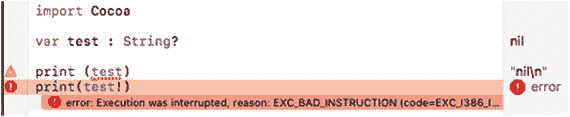
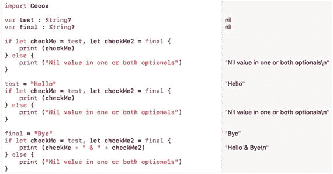
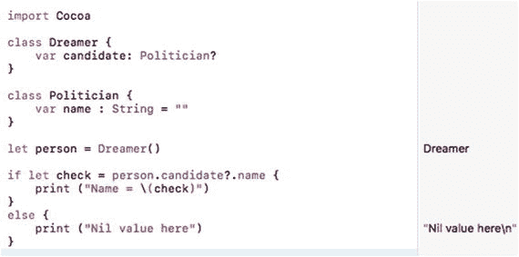
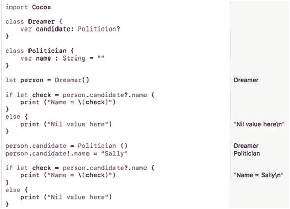
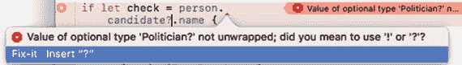
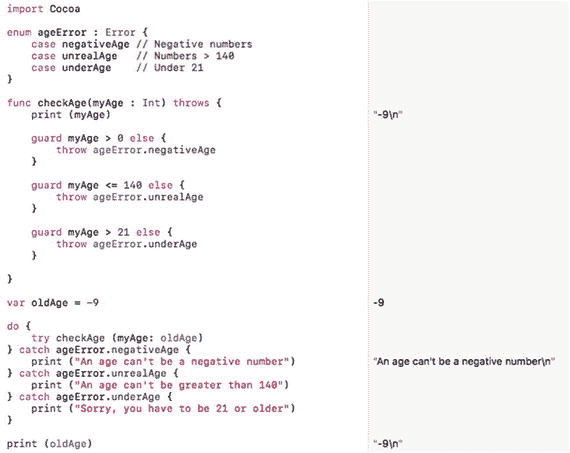

# 25. 防御性编程

程序员往往很乐观，因为当他们编写代码时，他们会假设代码能够正确运行。然而，在编程方面，更悲观一些通常更好。与其假设你的代码第一次就能运行成功，不如假设你的代码根本不能运行，这样更安全。这会迫使你在编写 Swift 代码时格外小心，以确保代码完全按照你的预期工作，并且不会发生任何意外行为。

没有程序是没有错误的。与其浪费时间查找问题，不如提前预见它们，并尽最大努力从一开始就防止它们潜入你的代码中。虽然 100% 的时间都编写出无错误的代码是不可能的，但你在编写代码时越具有防御性，就越不需要花时间查找导致代码无法正常工作的错误。

总的来说，不要做任何假设。假设每次都会让你大吃一惊，而且很少有好的结果。通过提前预见问题，你可以为它们制定计划，这样它们就不会破坏你的程序，也不会迫使你花费无数时间试图修复一个你本以为根本不应该存在的问题。

## 使用极限值进行测试

测试代码最简单的方法是从极限值开始，看看你的程序如何处理远远超出预期范围的数据。在处理数字时，程序通常假设用户会提供固定范围内的有效数据，但如果用户输入的是字母或符号（比如笑脸）而不是数字，会发生什么？如果用户输入的是整数而不是小数（或反之）呢？如果用户输入的是像 420 亿或 -0.00000005580 这样的极端数字呢？

在处理字符串时，进行同样类型的测试。当程序期望一个字符串却收到了一个数字时，它会如何反应？如果它收到一个包含 3000 个字符的巨大字符串呢？如果它收到带有重音符号或不寻常字母的外语符号呢？

通过使用极限值测试你的程序，你可以观察程序是优雅地响应，还是直接崩溃。最终目标是避免崩溃并优雅地响应。这可能意味着反复要求用户提供有效数据，或者至少在程序收到无效数据时警告用户。可靠的程序需要防范任何可能威胁其正常运行的因素。


## 使用可选变量

Swift 最强大的功能之一就是可选变量。可选变量可以包含一个值，也可以完全不包含任何值（用 `nil` 值标识）。不过，你必须小心使用可选变量，因为如果在它们包含 `nil` 值时试图使用它们，程序可能会崩溃。

使用可选变量时，需要注意以下几点：

*   检查可选变量是否持有 `nil` 值
*   解包可选变量以获取其实际值

通常情况下，你可以使用感叹号来访问可选变量内部存储的值，这被称为解包可选变量。解包可选变量时最大的问题在于，你可能错误地假定它的值不是 `nil`。假设你写了如下代码：

```
var test : String?
print (test)
print (test!)
```

由于 `test` 可选变量未被赋值，其默认值为 `nil`。第一个 `print` 命令会直接打印 `nil`。然而，第二个 `print` 命令试图解包这个可选变量，但由于其值为 `nil`，这会导致错误，如图 25-1 所示。



图 25-1.

解包一个值为 `nil` 的可选变量会导致错误

处理可选变量时，始终要先检查它们是否为 `nil`，再尝试使用。检查 `nil` 值的方法之一就是直接判断可选变量是否等于 `nil`，如下所示：

```
import Cocoa
var test : String?
if test == nil {
print ("Nil value")
} else {
print (test!)
}
```

在这个例子中，`if-else` 语句首先检查 `test` 可选变量是否等于 `nil`。如果是，则打印“Nil value”。如果不是，则可以使用感叹号安全地解包该可选变量。

另一种检查 `nil` 值的方法是将可选变量赋值给一个常量，这被称为可选绑定。与其直接使用可选变量，不如将其值绑定到一个常量上，例如：

```
if let constant = optionalVariable {
// 可选变量不为 nil
} else {
// 可选变量为 nil 值
}
```

如果需要同时检查多个可选变量，可以在一行中列出它们，如下所示：

```
if let constant = optionalVariable, constant2 = optionalVariable2 {
// 所有可选变量都不为 nil
} else {
// 一个或多个可选变量为 nil
}
```

如果常量持有值，那么 `if-else` 语句就可以使用该常量值。如果常量不持有值（包含 `nil`），那么 `if-else` 语句会执行其他操作，以避免使用 `nil` 值。通过使用常量来存储可选变量的值，你可以避免使用感叹号来解包可选变量。

让我们看看如何使用可选绑定：

1.  在 Xcode 中，选择“文件” ➤ “新建” ➤ “Playground”。Xcode 会要求输入一个 Playground 名称。
2.  点击“名称”文本字段，输入 `DefensePlayground`。
3.  确保“平台”弹出菜单显示为 macOS。
4.  点击“下一步”按钮。Xcode 会询问你想将 Playground 存储在何处。
5.  选择一个文件夹来存储项目，然后点击“创建”按钮。
6.  按如下方式编辑 Playground 代码：

```
import Cocoa
var test : String?
var final : String?
if let checkMe = test, let checkMe2 = final {
print (checkMe)
} else {
print ("Nil value in one or both optionals")
}
test = "Hello"
if let checkMe = test, let checkMe2 = final {
print (checkMe)
} else {
print ("Nil value in one or both optionals")
}
final = "Bye"
if let checkMe = test, let checkMe2 = final {
print (checkMe + " & " + checkMe2)
} else {
print ("Nil value in one or both optionals")
}
```

上面的代码将两个不同的可选变量值分别赋值给了两个不同的常量。只有当两个常量都包含非 nil 值时，`if-else` 语句的第一部分才会执行。如果其中一个或两个常量包含 `nil` 值，则会执行 `if-else` 语句的 `else` 部分，如图 25-2 所示。另请注意，代码中没有任何地方使用感叹号解包可选变量。



图 25-2.

使用可选绑定将可选变量的值赋给常量


## 使用可选链

在处理可选类型时，通常使用问号来声明可选变量，例如 `Int?`、`String?`、`Float?` 和 `Double?`。除了使用常见的数据类型之外，你还可以将任何类型声明为可选变量，包括类。

要将一个普通数据类型声明为可选变量，只需在数据类型名称后加上问号，如下所示：

```
var myNumber : String?
```

通常情况下，类中的属性持有常见的数据类型，例如 `String`、`Int` 或 `Double`。然而，类的属性也可以持有另一个类。如果你可以将一个类声明为一种类型，那么你也可以将一个类声明为可选变量，如下所示：

```
class Dreamer {
var candidate: Politician?
}
class Politician {
var name = ""
}
```

现在，如果你基于 `Dreamer` 类创建一个对象，你会得到一个持有可选变量的 `candidate` 属性：

```
let person = Dreamer()
```

`person` 对象基于 `Dreamer` 类，这意味着它也持有一个名为 `candidate` 的属性。然而，`candidate` 属性也是一个基于 `Politician` 类的可选变量对象。此时，`candidate` 属性的初始值为 `nil`。

要了解一个对象如何将另一个对象作为可选变量，请按照以下步骤操作：

1. 确保 `DefensePlayground` 已加载到 Xcode 中。
2. 将 playground 代码编辑如下：

```
    import Cocoa
    class Dreamer {
    var candidate: Politician?
    }
    class Politician {
    var name : String = ""
    }
    let person = Dreamer()
    if let check = person.candidate?.name {
    print ("Name = \(check)")
    }
    else {
    print ("Nil value here")
    }
```

这段代码未能从 `Politician` 类创建对象，因此 `candidate` 属性为 `nil`。因为你将 `candidate` 属性声明为可选变量，所以你可以在 `if-else` 语句中使用所谓的可选链来访问其 `name` 属性，如图 25-3 所示。



图 25-3. 可选链可以访问类的可选变量属性

要在 `candidate` 属性中存储一个值，你需要创建另一个对象，如下所示：

```
person.candidate = Politician()
```

然后，你需要将数据存储到 `Politician` 类的 `name` 属性中。为此，你需要解包可选变量（`Politician` 类）以访问其 `name` 属性，如下所示：

```
person.candidate!.name = "Sally"
```

请记住，只有当你绝对确定可选变量包含一个值时，才应使用感叹号解包可选变量。在这种情况下，你正在给可选变量赋值（`"Sally"`），因此解包可选变量是安全的。

让我们看看如何修改之前的代码以在可选变量属性中存储一个值：

1. 确保 `DefensePlayground` 已加载到 Xcode 中。
2. 将 playground 代码编辑如下：

```
    import Cocoa
    class Dreamer {
    var candidate: Politician?
    }
    class Politician {
    var name : String = ""
    }
    let person = Dreamer()
    if let check = person.candidate?.name {
    print ("Name = \(check)")
    }
    else {
    print ("Nil value here")
    }
    person.candidate = Politician ()
    person.candidate!.name = "Sally"
    if let check = person.candidate?.name {
    print ("Name = \(check)")
    }
    else {
    print ("Nil value here")
    }
```

请注意，`candidate` 可选变量（`Politician`）在你明确存储一个值之前是未定义的或为 `nil`。一旦你将字符串（`"Sally"`）存储到 `name` 属性中，它就不再持有 `nil` 值，如图 25-4 所示。



图 25-4. 你需要解包可选变量才能在其中存储一个值

处理可选变量的关键在于确保你正确使用问号和感叹号符号。幸运的是，如果你省略了任一符号，Xcode 通常可以提示你选择正确的符号，如图 25-5 所示。



图 25-5. Xcode 编辑器可以在你处理可选变量时提示你何时使用 `?` 或 `!` 符号

问号符号用于创建可选变量或安全地访问可选变量。感叹号符号用于解包可选变量，因此要确保那些被解包的可选变量持有非 nil 的值。

通常，每当你看到可选变量使用了问号，你的代码在处理 `nil` 值时很可能是安全的。然而，每当你看到可选变量使用了感叹号，请确保该可选变量持有一个值，因为如果它持有 `nil` 值，你的代码可能不安全并可能导致崩溃。

## 错误处理

由于你不可能每次都编写无错误的代码，Swift 提供了一种称为错误处理的功能。错误处理背后的理念是识别并捕获可能的错误，以便你的程序能够优雅地处理它们，而不是让程序崩溃或不可预测地运行。要处理错误，你需要遵循以下几个步骤：

* 定义你想要识别的描述性错误
* 识别一个或多个函数来检测错误并识别发生的错误类型
* 处理错误

### 使用枚举定义错误

在过去，程序经常显示充满十六进制数字和奇怪符号的晦涩错误消息。这类错误消息通常对于识别可能发生的问题毫无用处。这就是为什么错误处理的第一步是创建一个描述性错误类型的列表。

你为不同错误指定的名称完全是任意的，但你应该为不同类型的错误消息赋予有意义的名称。要创建一个描述性错误类型的列表，你需要创建一个使用 `ErrorType` 协议的 `enum`，如下所示：

```
enum enumName : Error {
case descriptiveError1
case descriptiveError2
case descriptiveError3
}
```

将 `enumName` 替换为能够标识你想要识别的错误类型的描述性名称。然后使用 `case` 关键字输入一个单词形式（不带空格）的描述性错误名称。你的可能错误列表可以少至一个，也可以多到你想要描述的任意数量，因此你不受固定数量的限制。如果你想创建一个列出三种错误类型的 `enum`，可以使用如下代码：

```
enum ageError : Error {
case negativeAge // 负数
case unrealAge   // 大于 140 的数
case underAge    // 未满 21 岁
}
```


#### 创建识别错误的函数

创建描述性错误类型的列表后，现在需要创建一个或多个你认为可能发生错误的函数。通常，你会像这样定义一个函数：

```
func functionName {
// 代码写在这里
}
```

要让一个函数识别错误，你需要插入 `throws` 关键字，如下所示：

```
func functionName throws {
// 代码写在这里
}
```

`throws` 关键字表示该函数“抛出”错误，由代码的其他部分来处理。在带有 `throws` 关键字的函数内部，你需要使用一个或多个 `guard` 语句。

`guard` 语句用于识别允许的情况，其工作方式类似于 `if-else` 语句。如果 `guard` 语句的布尔条件为 `true`，则不会发生任何事。然而，如果 `guard` 语句为 `false`，则 `guard` 语句可以使用 `throws` 关键字来识别特定类型的错误，如下所示：

```
guard 布尔条件 else {
throws 枚举名称.描述性错误
}
```

如果你只允许大于 21 的值，可以像这样创建一个 `guard` 语句：

```
guard myAge > 21 else {
throws ageError.underAge
}
```

如果布尔条件（`myAge > 21`）为 `true`，这个 `guard` 语句将不执行任何操作。否则，它将抛出 `ageError.underAge` 错误，其中“`ageError`”是枚举的名称，列出了要识别的不同错误，而“`underAge`”是可能发生的其中一个错误。

`guard` 语句总是定义可接受的行为（`myAge > 21`），否则它会通过 `throws` 关键字识别一个错误。一个函数（用 `throws` 关键字标识）可以包含一个或多个 `guard` 语句。

### 处理错误

当你用一个或多个 `throws` 关键字标识了函数，且这些函数使用一个或多个 `guard` 语句来识别可能的错误后，你最终需要一种方法来处理这些错误。在 Swift 中，你可以使用 `do-try-catch` 语句来完成，如下所示：

```
do {
try 调用可能抛出错误的函数
} catch 枚举名称.描述性错误 {
// 处理错误的代码
}
```

`do-try-catch` 语句尝试运行一个可以使用 `throws` 关键字识别错误的函数。如果该函数没有通过任何 `guard` 语句识别出错误，那么 `do-try-catch` 语句的执行效果与普通的函数调用完全相同。

然而，如果函数识别出一个错误，你就需要在 `do-try-catch` 语句中编写代码来处理该错误。处理这个错误的方式可以很简单，比如打印一条消息来告知你存在问题，也可以很复杂，比如运行一整套全新的代码来专门处理该问题。

关键在于，如果你预见到可能出现的错误并为处理这些错误编写了代码，那么你的程序崩溃的可能性就会降低。如果你的程序确实崩溃了，只需找出原因（这也许并不容易），创建一个新的描述性错误名称来标识它，然后创建一个新的 `catch` 语句来处理该错误。

让我们看看错误处理是如何工作的：

1.  确保 `DefensePlayground` 已加载到 Xcode 中。
2.  按如下方式编辑 playground 代码：

    ```
    import Cocoa
    enum ageError : Error {
    case negativeAge // 负数
    case unrealAge   // 大于 140 的数字
    case underAge    // 未满 21 岁
    }
    func checkAge(myAge : Int) throws {
    print (myAge)
    guard myAge > 0 else {
    throws ageError.negativeAge
    }
    guard myAge <= 140 else {
    throws ageError.unrealAge
    }
    guard myAge >= 21 else {
    throws ageError.underAge
    }
    }
    var oldAge = -9
    do {
    try checkAge (myAge: oldAge)
    } catch ageError.negativeAge {
    print ("年龄不能是负数")
    } catch ageError.unrealAge {
    print ("年龄不能大于 140")
    } catch ageError.underAge {
    print ("抱歉，你必须年满 21 岁")
    }
    print (oldAge)
    ```

注意负数是如何被识别并通过一条简单的消息来处理的，如图 25-6 所示。



图 25-6.

错误处理涉及一个枚举、一个包含 `guard` 语句的函数以及一个 `do-try-catch` 语句

将 `oldAge` 变量的值改为 250，看看 `do-try-catch` 语句如何将该数字识别为大于 140，从而判定为不现实的值。将 `oldAge` 变量的值改为 15，看看 `do-try-catch` 语句如何识别出年龄未满 21 岁。

要在程序中使用错误处理，你必须首先识别可能的问题，然后决定如何处理这些问题。错误处理只能识别你已经知道的错误，但它能让你的程序在面对可能遇到的常见问题时不那么脆弱。

### 总结

无论作为程序员的你多么有天赋、有技巧或受过何种教育，偶尔都会犯错误。有时这些错误是你可以轻松修正的小问题，但有时你犯的错误会导致各种难以捉摸的问题，让你在查找和修复时感到挑战重重且沮丧不已。这就是编程的本质。

然而，你无意间造成的任何问题，也都是你可以学会发现并修复的问题。一旦你明白了某个错误是如何产生的，你就很可能记住将来如何修复这类错误——无论是你自己还是别人再次犯下同样的错误。这让你得以解放，去犯那些你可能从未遇到过的新错误。

减少程序中错误的最佳方法是仔细检查你的代码，并假设任何事情都不会顺利运行。然后，寻找一切可能的方式来确保它不会出错。你越是带着防御心态去编码，就越有可能在问题发生之前就预防它们。

编程与其说是一门科学，不如说是一门艺术，因此，学会最适合你自己的方法来减少程序中引入的错误。在尝试新代码时，通常更安全的做法是在 Swift playground 或者与你实际程序分离的简单程序中先进行测试。

这样，你可以安全地隔离并测试你的代码。当它正常工作后，你就可以将其复制粘贴到你的程序中。

错误是编程世界的常态。理想情况下，你希望将更多时间花在编写代码上，而减少调试代码的时间。

