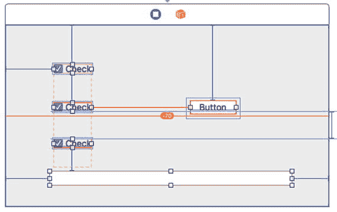
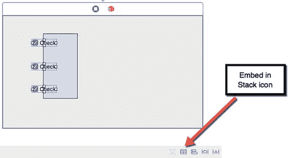
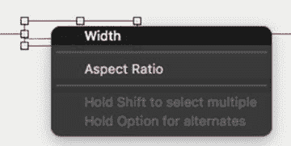
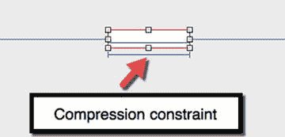
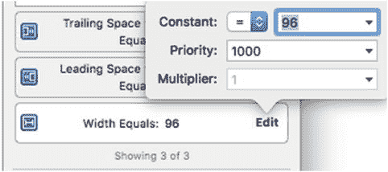
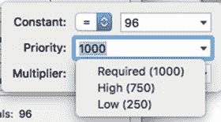
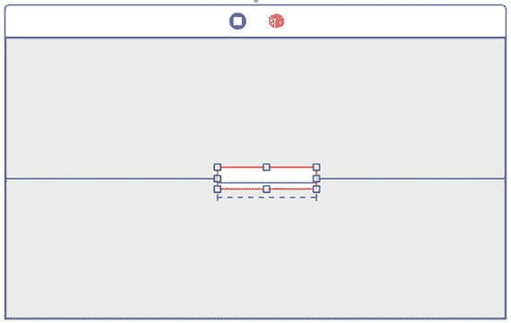
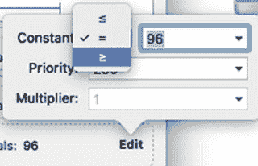

# 简化用户界面设计

设计用户界面可能颇具挑战。你不仅需要设计一个易于使用的用户界面，还需要设计一个能够响应用户对窗口大小所做任何更改的自适应用户界面。如果用户缩小窗口，你的用户界面必须相应缩小，且不能截断任何元素。如果用户放大窗口，你的用户界面必须相应扩展，以保持外观一致。

为了帮助创建自适应用户界面，Xcode 提供了约束，这些约束可以将各种用户界面元素的边缘固定到窗口边缘或其他用户界面元素的边缘。在本章中，你将了解更多关于约束和故事板的知识，这将帮助用户界面设计变得比以往任何时候都更简单。

## 使用堆栈视图

如果你的用户界面包含几个项目，例如一个文本字段、一个按钮和一个标签，那么对这些项目设置约束以使它们保持在正确的位置是相当直接的。但是，如果你的用户界面包含多个项目，那么对每个项目设置如此多的约束可能会变得混乱。更改一个约束，你的整个用户界面就可能无法正确适配，这通常意味着浪费时间去尝试让多个约束正常工作。图 26-1 展示了多个约束在拥挤的用户界面上看起来有多混乱。

图 26-1. 多个约束使得正确布局用户界面变得困难

为了解决这个问题，Xcode 提供了一项名为堆栈视图（stack view）的功能。堆栈视图的基本思想是，用户界面项目组通常需要保持在一起。你无需为每个项目单独设置约束，而是将它们分组到一个堆栈视图中，然后为这个单一的堆栈视图设置约束。

要了解如何创建和使用堆栈视图，请遵循以下步骤：

1. 在 Xcode 中选择“文件” ➤ “新建” ➤ “项目”。
2. 在 macOS 类别下点击“应用程序”。
3. 点击“Cocoa 应用程序”，然后点击“下一步”按钮。Xcode 现在会要求输入产品名称。
4. 在“产品名称”文本字段中点击，然后输入 `StackViewProgram`。
5. 确保“语言”弹出菜单显示为“Swift”，并且“使用故事板”复选框已被选中。
6. 点击“下一步”按钮。Xcode 会询问你希望将项目存储在哪里。
7. 选择一个文件夹来存储你的项目，然后点击“创建”按钮。
8. 在项目导航器中点击 `Main.storyboard` 文件。你的程序用户界面将会出现。
9. 选择“视图” ➤ “实用工具” ➤ “显示对象库”。对象库会出现在 Xcode 窗口的右下角。
10. 将三个复选框拖到用户界面窗口上，使它们上下堆叠。请注意，除非你将每个复选框精确对齐，否则它们看起来不会整齐。
11. 拖动鼠标选中所有三个复选框，如图 26-2 所示。（另一种选择多个项目的方法是按住 Shift 键，然后点击你想要选择的每个项目。）

    

    图 26-2. 拖动是快速选择多个项目的方法

12. 选择“编辑器” ➤ “嵌入” ➤ “堆栈视图”（或点击中间 Xcode 面板右下角的“嵌入堆栈”图标）。Xcode 会将你选中的项目分组到一个单独的堆栈视图中。
13. 将鼠标指针移到包含三个复选框的堆栈视图上，按住 Control 键，然后将鼠标向窗口的右边缘拖动。
14. 松开 Control 键和鼠标按钮。会弹出一个窗口。
15. 选择“尾随空间到容器”选项。Xcode 会为整个堆栈视图显示约束。
16. 将鼠标指针移到包含三个复选框的堆栈视图上，按住 Control 键，然后将鼠标向窗口的底部边缘拖动。
17. 松开 Control 键和鼠标按钮。会弹出一个窗口。
18. 选择“底部空间到容器”选项。Xcode 会为整个堆栈视图显示约束。
19. 选择“产品” ➤ “运行”。程序的用户界面会出现。
20. 拖动窗口的右下角来缩小和放大窗口。请注意，当你改变窗口的宽度和高度时，三个复选框的堆栈会作为一个整体一起移动。
21. 选择“StackViewProgram” ➤ “退出 StackViewProgram”。

## 修复约束冲突

理想情况下，约束应该将项目与窗口边缘或其他用户界面项目边缘保持特定距离。但是，如果你缩小或放大窗口，约束可能会产生意想不到的问题。

让我们看看在用户界面项目上设置两个约束是如何产生问题的：

1. 确保 `StackViewProgram` 项目已加载到 Xcode 中。
2. 在项目导航器面板中点击 `Main.storyboard` 文件。
3. 选择“编辑” ➤ “全选”（或按 Command + A）。Xcode 将选中当前在用户界面窗口上的堆栈视图。
4. 按下键盘上的 Delete 键，或选择“编辑” ➤ “删除”以从窗口中删除所有用户界面项目。
5. 选择“视图” ➤ “实用工具” ➤ “显示对象库”。
6. 将一个单独的文本字段拖到用户界面窗口的中间。（不必担心精确定位。）
7. 将鼠标指针移到文本字段上，按住 Control 键，然后将鼠标向窗口的右边缘拖动。
8. 松开 Control 键和鼠标。会弹出一个窗口。
9. 选择“尾随空间到容器”选项。Xcode 会为文本字段的右边缘到窗口的右边缘创建一个约束。
10. 将鼠标指针移到文本字段上，按住 Control 键，然后将鼠标向窗口的左边缘拖动。
11. 松开 Control 键和鼠标。会弹出一个窗口。
12. 选择“前导空间到容器”选项。Xcode 会为文本字段的左边缘到窗口的左边缘创建一个约束。
13. 选择“产品” ➤ “运行”。用户界面窗口会出现。
14. 将鼠标指针移到窗口的右边缘，通过向右拖动鼠标来增加窗口宽度。请注意，文本字段会向右扩展。
15. 将鼠标指针移到窗口的右边缘，通过向左拖动鼠标来缩小窗口宽度。请注意，文本字段会缩小。如果你继续缩小窗口宽度，文本字段最终会完全消失。
16. 选择“StackViewProgram” ➤ “退出 StackViewProgram”。

现在，你有两个约束将文本字段与两个窗口边缘保持固定距离，但它们并没有阻止文本字段在窗口过度缩小时消失。解决这个问题的一种方法是创建一个压缩约束。

压缩约束可以防止用户界面项目过度缩小或扩展。要创建压缩约束，你需要按住 Control 键，并在该用户界面元素的边界内拖动鼠标。

1. 确保 `StackViewProgram` 项目已加载到 Xcode 中。
2. 在项目导航器面板中点击 `Main.storyboard` 文件。
3. 将鼠标指针移到文本字段上。
4. 按住 Control 键，并左右拖动鼠标，确保鼠标指针保持在文本字段的边界内。
5. 松开 Control 键和鼠标。会弹出一个菜单，如图 26-3 所示。

图 26-3. 定义压缩约束

6. 选择“宽度”。Xcode 会在文本字段下方显示一个压缩约束，如图 26-4 所示。

图 26-4. 压缩约束出现在用户界面项目下方

7. 选择“产品” ➤ “运行”。用户界面窗口会出现。
8. 将鼠标指针移到窗口的右边缘，尝试拖动窗口以扩展或缩小其宽度。请注意，由于压缩约束的存在，你无法做到这一点。
9. 选择“StackViewProgram” ➤ “退出 StackViewProgram”。

压缩约束告诉 Xcode 保持文本字段的固定宽度，而左侧和右侧的约束则告诉 Xcode 保持文本字段与窗口左右边缘的固定距离。为了满足所有这些约束，窗口的宽度将无法再调整大小。

如果你想保持文本字段宽度不小于当前宽度，但允许窗口调整大小，该怎么办？一种解决方案是使用约束优先级。

优先级定义了哪些约束必须首先被满足。每次创建约束时，Xcode 都会为其分配优先级 1000，这是可能的最高优先级。如果你为某个约束设置了较低的优先级，那么该约束将允许具有更高优先级的约束优先执行。让我们看看更改约束优先级是如何工作的：

1.  确保 `StackViewProgram` 项目已在 Xcode 中加载。
2.  点击项目导航面板中的 `Main.storyboard` 文件。
3.  点击文本字段以将其选中。
4.  选择 “视图” ➤ “实用工具” ➤ “显示尺寸检查器”。尺寸检查器面板会出现在 Xcode 窗口的右上角。
5.  点击宽度约束右侧的 “编辑”。将出现一个弹出窗口，如图 26-5 所示。

图 26-5. 编辑约束
6.  点击优先级文本字段右侧的向下箭头。将出现一个弹出菜单，如图 26-6 所示。

图 26-6. 更改约束的优先级
7.  选择 “低 (250)”。请注意，Xcode 现在将宽度约束显示为虚线，以直观地表明其优先级低于用实线显示的约束，如图 26-7 所示。

图 26-7. 优先级较低的约束显示为虚线
8.  选择 “产品” ➤ “运行”。用户界面窗口出现。
9.  将鼠标指针移动到窗口的右边缘，并尝试拖动窗口以扩展或收缩其宽度。请注意，如果缩小窗口宽度，文本字段会再次消失。
10. 选择 `StackViewProgram` ➤ “退出 StackViewProgram”。

更改约束优先级可能并不总能达到你想要的效果，因此你可能需要更改约束的工作方式。大多数约束定义了一个必须满足的固定值。为了获得更大的灵活性，你还可以将这个相等约束更改为大于或等于约束，或小于或等于约束。

1.  确保 `StackViewProgram` 项目已在 Xcode 中加载。
2.  点击项目导航面板中的 `Main.storyboard` 文件。
3.  点击文本字段以将其选中。
4.  选择 “视图” ➤ “实用工具” ➤ “显示尺寸检查器”。尺寸检查器面板会出现在 Xcode 窗口的右上角。
5.  点击宽度约束右侧的 “编辑”。将出现一个弹出窗口（见图 26-5）。
6.  点击 “常量” 标签右侧的弹出菜单。将出现一个弹出菜单，如图 26-8 所示。

图 26-8. 将等号更改为大于或等于号，或小于或等于号
7.  选择 `≥`（大于或等于号）。
8.  点击优先级文本字段右侧的向下箭头，出现菜单后选择 “高 (750)”。
9.  选择 “产品” ➤ “运行”。请注意，如果缩小窗口宽度，压缩约束只会将文本字段收缩到一定距离，然后停止，从而防止文本字段完全消失。如果扩展窗口宽度，文本字段也会随之扩展。
10. 选择 `StackViewProgram` ➤ “退出 StackViewProgram”。

当你的用户界面无法正确地自适应时，请尝试以下一种或多种选项：

*   添加或删除约束
*   更改约束优先级
*   将约束从等于固定值的关系更改为大于或等于，或小于或等于的关系

每个用户界面在适应窗口大小调整时遇到的问题可能都不同，因此解决该问题可能简单到只修改一个约束，也可能复杂到需要修改多个约束。如果用户界面元素组会一起移动，为简化起见，可以将它们分组到一个栈视图中。

很多时候，你可能需要尝试修改不同的约束，以了解它们在不同组合下的工作方式。只要了解修改约束的各种选项，你最终会找到针对特定用户界面的最佳解决方案。

### 总结

每个程序的用户界面对于让用户控制程序都至关重要。如果用户界面让用户感到沮丧并阻止他们使用该程序，那么你的程序再强大也无济于事。

由于每个用户界面都需要响应用户可能对窗口大小进行的更改，栈视图允许你将相关元素分组，并将约束应用于整个栈视图。如果不将相关元素分组，你将不得不为每个元素单独应用约束，这可能会变得混乱，并且如果它们没有按预期响应，修复起来也会很困难。

如果存在约束冲突，你可以修改每个约束的优先级和/或修改约束的工作方式。最初创建约束时，Xcode 会将约束设置为等于一个固定值。为了提供灵活性，你可以将此等号更改为大于或等于号，或小于或等于号。

为了保持用户界面元素可见，你还可以应用压缩约束。与将元素链接到另一个元素或窗口边缘的普通约束不同，压缩约束定义了用户界面元素的宽度和/或高度。如果用户调整窗口大小，压缩约束可防止用户界面元素消失。

对于设计以特定顺序显示窗口或视图的用户界面，你可能会发现故事板文件比使用多个 `.xib` 文件更容易使用。无需将整个用户界面存储在一个故事板文件中（这可能会变得杂乱且难以理解），你可以创建故事板引用。

故事板引用将用户界面划分为多个故事板文件。通过将用户界面分离到多个故事板文件中，你可以更轻松地设计和理解用户界面的结构。

