# 27. 调试你的程序

在专业的软件开发领域中，你实际上会花费更多时间来修改现有程序，而不是创建新程序。然而，无论是编写新程序还是编辑现有程序，无论你拥有多少经验或受过多少教育，即便是最优秀的程序员也可能会犯错。事实上，你可以预料到，无论你多么小心，都难免会出错。一旦你接受了这个编程中不可避免的事实，你就可以学习如何发现并修复你的错误了。

在计算机世界里，错误通常被称为“bug”（臭虫），这个名称源于早期使用物理开关工作的计算机的一次事故。有一天计算机出了故障，当技术人员打开计算机时，发现一只飞蛾被压扁在一个开关里，导致开关无法闭合。从那时起，编程错误就被称为 bug，而修复计算机问题则被称为调试（debugging）。

三种常见的计算机 bug 类型是：

*   **语法错误**：当你拼错某些内容，例如关键字、变量名、函数名或类名，或者错误地使用了一个符号时发生。
*   **逻辑错误**：当你正确使用了命令，但代码的逻辑并未实现你预期的效果时发生。
*   **运行时错误**：当程序遇到意外情况时发生，例如用户输入了无效数据，或者其他程序意外地干扰了你的程序。

语法错误最容易发现和修复，因为它们只是你创建的变量名拼写错误，或者是 Xcode 可以帮助你识别的 Swift 命令拼写错误。如果你输入一个 Swift 关键字，例如 `var` 或 `let`，Xcode 会以粉红色（或你在 Xcode 编辑器中为关键字指定的任何颜色）显示该关键字。

现在，如果你输入一个 Swift 关键字，但它没有以通常的标识颜色显示，那么你就知道自己可能输入有误。通过给代码着色，Xcode 的编辑器可以帮助你直观地识别常见的拼写错误或笔误。

除了使用颜色之外，Xcode 编辑器还提供了第二种方法来帮助你在需要输入 Cocoa 框架中定义的方法或类名时避免错误。一旦 Xcode 识别出你可能正在输入 Cocoa 框架中的内容，它就会弹出一个可能选项的菜单。现在，你无需自己输入整个命令，只需在弹出菜单中点击你的选择，然后按一次或多次 Tab 键，让 Xcode 正确地输入你选择的命令，如图 27-1 所示。

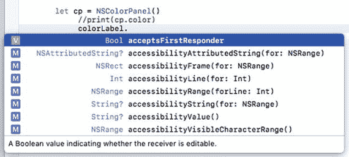

**图 27-1.** Xcode 显示一个你可能想要使用的命令菜单

语法错误常常会使你的程序完全无法运行。当语法错误阻止程序运行时，Xcode 通常可以识别出程序中拼写错误的命令所在的行（或附近区域），以便你进行修复，如图 27-2 所示。

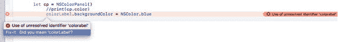

**图 27-2.** 语法错误通常会使程序无法运行，这使得 Xcode 能够识别出语法错误

> **注意：** Swift 将大写和小写字母视为完全不同的字符。一个常见的错误是输入小写字母代替大写字母（或反之）。

逻辑错误比语法错误更难发现和检测。Xcode 可以识别语法错误，因为它能识别拼写正确的 Swift 关键字（例如 `var`）和拼写错误的 Swift 关键字（例如 `varr`）之间的区别。

然而，逻辑错误发生在你正确使用了 Swift 代码，但代码并未按你预期的方式运行时。由于你的代码实际上是有效的，Xcode 无法知道它没有按你的预期工作。因此，逻辑错误可能难以调试，因为你认为自己编写的代码是正确的，但（显然）事实并非如此。

你如何在一个自认为编写正确的代码中发现错误呢？发现错误通常需要从程序的开头开始，一直详查每一行直到结束。（当然，有比逐行搜索整个程序更快的方法，你将在本章后面学习到。）

最后，最难发现和调试的错误是运行时错误。语法错误通常会使程序无法运行，因此，如果你的程序实际上能运行，你可以假设已经消除了代码中大部分（即使不是全部）语法错误。

逻辑错误可能更难发现，但它们是可预测的。例如，如果你的程序要求用户输入密码，但即使用户输入了正确的密码，程序却未能授予用户访问权限，你就知道自己遇到了一个逻辑错误。每次运行程序时，你都能可靠地预测逻辑错误何时会发生。

运行时错误则更加隐蔽，因为它们并非总是可预测地发生。例如，你的程序在你的计算机上可能运行得非常好，但当你将同一程序运行在一台完全相同的计算机上时，程序可能就会出错。这是因为两台不同计算机之间的条件永远不会完全相同。

因此，同一个程序在一台计算机上运行良好，但在另一台相同类型的计算机上却可能出错。问题在于，意外的外部环境可能会影响程序的行为。例如，你的程序可能一直运行正常，直到用户按下数字小键盘上的数字键，而不是字母数字键区顶部的数字键。

即使用户输入的是完全相同的数字（例如 5），程序可能会将位于 R 和 T 键上方的 5 键视为与数字小键盘上的 5 键完全不同的键。尽管这可能很细微，但足以导致程序失败或崩溃。

由于运行时错误并不总能复现，它们可能令人沮丧地难以发现，甚至更难修复，因为你无法总是检查程序在其他计算机上运行时可能面临的每一种情况。有些程序已知可以完美运行，除非用户意外同时按下了两个键。其他程序则运行良好，直到用户恰好在另一个程序试图通过互联网接收电子邮件的那一刻保存了文件。

通常您可以消除大多数语法错误，并发现和修复大多数逻辑错误。然而，可能无法发现并完全消除程序中的所有运行时错误。避免花费时间寻找 bug 的最佳方法是努力编写良好的代码，并仔细测试，以确保它尽可能没有错误。


## 简易调试技巧

当程序无法正常运行时，你常常对问题所在毫无头绪。虽然可以耐着性子从头到尾检查代码，但通常更快的做法是直接猜测错误可能出在哪里。

一旦大致确定了程序中可能出问题的部分，你有两个选择。第一，删除可疑代码并重新运行程序。如果问题神奇地消失了，那就说明删除的代码很可能就是罪魁祸首。

然而，如果程序依然无法运行，你就得把删除的代码重新输入回去。一个更简便的方法是把代码从 Xcode 中剪切粘贴并存储到文本编辑器（比如每台 Mac 都自带的 TextEdit 程序）中，但这也可能很繁琐。

因此，第二个解决方案是暂时隐藏你怀疑可能引发问题的代码。这样，如果问题依然存在，你只需取消隐藏，让代码重新可见即可。在 Xcode 中实现这一操作，只需将你的代码变成注释即可。

记住，注释是 Xcode 完全忽略的文本。你可以通过三种方式创建注释：

- 在要转换为注释的每一行开头添加 `//` 符号。这种方法允许你将单行代码转换为注释。
- 在要转换为注释的代码开头添加 `/*` 符号，在代码结尾添加 `*/` 符号。这种方法允许你将一行或多行代码转换为注释。
- 选中要转换为注释的代码行，然后选择 Editor ➤ Structure ➤ Comment Selection（或按 Command + `/`）。这种方法会在你选中的每一行代码开头添加 `//` 符号，从而将一行或多行代码转换为注释。

**注意**：Xcode 会用绿色（或你自定义的用于识别注释的颜色）为注释着色。创建注释后，请确保 Xcode 正确着色，以确认你已经成功创建了注释。如果 Xcode 未能识别你的注释，它会将你的文本视为有效的 Swift 命令，这很可能导致程序无法正常运行。

通过将代码转换为注释，你实际上是将那段代码对 Xcode 隐藏了。现在，如果你想将注释恢复为代码，只需移除定义注释代码的 `//` 或 `/*` 和 `*/` 符号即可。

如果你是通过选择 Editor ➤ Structure ➤ Comment Selection（或按 Command + `/`）来注释代码的，那么只需再选择 Editor ➤ Structure ➤ Uncomment Selection（或再次按 Command + `/`），即可将注释的代码恢复为可工作的代码。

除了将代码变为注释来临时隐藏之外，第二种简单的调试技巧是使用 `print` 命令。其理念是在代码中插入 `print` 命令，以打印出变量的值。

通过这种方式，你可以查看一个或多个变量可能包含的值。在程序中放置多个 `print` 命令，可以让你有机会确保程序运行正确。

要了解如何使用 `print` 命令结合代码注释来调试程序，请按以下步骤操作：

1. 在 Xcode 中选择 File ➤ New ➤ Project。
2. 在 macOS 类别下点击 Application。
3. 点击 Cocoa Application，然后点击 Next 按钮。Xcode 会要求输入产品名称。
4. 点击 Product Name 文本字段，输入 `DebugProgram`。
5. 确保 Language 弹出菜单显示为 Swift，并且 "Use Storyboards" 复选框已选中。
6. 点击 Next 按钮。Xcode 会询问你希望将项目存储在哪里。
7. 选择一个文件夹来存储项目，然后点击 Create 按钮。
8. 在项目导航器中点击 `AppDelegate.swift` 文件。`AppDelegate.swift` 文件的内容会显示出来。
9. 将 `applicationDidFinishLaunching` 方法编辑如下：

```
func applicationDidFinishLaunching(_ aNotification: Notification) {
    var myMessage = "Temperature in Celsius:"
    let temp = 100.0
    print (myMessage + "\(temp)")
    myMessage = "Temperature in Fahrenheit:"
    print (myMessage + "\(C2F(tempC: temp))")
}
```

10. 直接在这个函数上方添加以下代码：

```
func C2F (tempC : Double) -> Double {
    var tempF : Double
    tempF = tempC + 32 * 9/5
    return tempF
}
```

11. 选择 Product ➤ Run。你的程序用户界面会出现（显示为空白）。
12. 选择 DebugProgram ➤ Quit DebugProgram。Xcode 界面再次出现。如果你查看 Xcode 窗口底部调试区域，可以看到两个 `print` 命令打印的内容，即 "Temperature in Celsius: 100.0" 和 "Temperature in Fahrenheit: 157.6"，如图 27-3 所示。

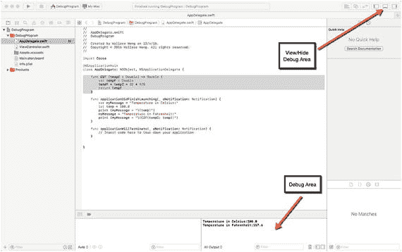

**图 27-3.** `print` 命令在 Xcode 窗口的调试区域显示文本

要显示或隐藏调试区域，你有三个选项：

- 点击 Xcode 窗口右上角的显示/隐藏调试区域图标。
- 选择 View ➤ Debug Area ➤ 显示/隐藏调试区域。
- 按 Shift + Command + Y。

通过查看调试区域，你可以看到 `print` 命令显示的内容。如果你对摄氏度和华氏度有所了解，就会知道摄氏度的沸点是 100 度，而华氏度的沸点是 212 度。然而，你的温度转换程序计算得出 100 摄氏度等于 157.6 华氏度，这意味着华氏温度应该接近 212 而不是 157.6。显然有问题，所以我们用 `print` 命令和注释来帮助调试问题。

1. 确保 DebugProgram 项目已在 Xcode 中加载。
2. 在项目导航器窗格中点击 `AppDelegate.swift` 文件。
3. 编辑 `C2F` 函数，在 `*` 符号（乘号）左侧输入 `//` 符号，如下所示：

```
func C2F (tempC : Double) -> Double {
    var tempF : Double
    tempF = tempC + 32 //* 9/5
    return tempF
}
```

这个注释可以让你检查 `tempC` 参数是否正确传递到 `C2F` 函数并存储到 `tempF` 变量中。

4. 在 `return` 语句上方添加一个 `print (tempC)` 命令，如下所示：

```
func C2F (tempC : Double) -> Double {
    var tempF : Double
    tempF = tempC + 32 //* 9/5
    print (tempF)
    return tempF
}
```

5. 选择 Product ➤ Run。程序空白的用户界面会出现。
6. 选择 DebugProgram ➤ Quit DebugProgram。Xcode 界面再次出现，在调试区域显示结果，打印出：

`Temperature in Celsius: 100.0 132.0 Temperature in Fahrenheit: 132.0`

通过注释掉代码的计算部分并使用 `print (tempF)` 命令，你可以看到 `C2F` 函数正确地存储了 100.0 到 `tempC` 变量中，并在存储到 `tempF` 变量之前加了 32。因为你注释掉了代码的计算部分，可以假设错误一定存在于被你注释掉的代码部分。

虽然公式看起来可能正确，但错误之所以发生，是因为 Swift（以及大多数编程语言）计算公式的方式。首先，它们从左到右计算。其次，它们会先计算乘法等运算，后计算加法。错误的发生是因为你的转换公式先计算 32 乘以 9（得到 288），然后将结果（288）除以 5 得到 57.6。最后，它将 57.6 加到 100.0 上，得到错误的结果 157.6。它真正应该做的是将 9/5 乘以摄氏温度，然后将结果加上 32。

7. 将 `C2F` 函数修改如下：

```
func C2F (tempC : Double) -> Double {
    var tempF : Double
    tempF = tempC * (9/5) + 32
    print (tempF)
    return tempF
}
```


8.  选择**产品** ➤ **运行**。程序空白的用户界面出现。
9.  选择**调试程序** ➤ **退出调试程序**。Xcode 界面再次出现。
10. 查看调试区，你会发现程序现在已正确地将 100 摄氏度转换为 212 华氏度。

对于简单的调试，临时将代码注释掉并使用`print`命令可以奏效，但反复添加和移除注释符号及`print`命令相当笨拙。更好的方法是使用断点和变量观察，这本质上等同于使用注释和`print`命令的效果。

## 使用 Xcode 调试器

虽然注释和`print`命令能帮你隔离代码中的问题，但使用起来可能很笨拙。`print`命令尤其繁琐，因为你必须先将其键入代码，然后在准备发布程序时记得将其移除。

虽然在程序中遗留一条或多条`print`命令不太可能损害程序性能，但在代码中保留不再起任何作用的代码是一种糟糕的编程实践。

作为在程序中四处键入`print`命令的替代方案，Xcode 提供了使用 Xcode 调试器这一更便捷的方案。调试器提供了两种查找和识别程序中错误的方法：

-   断点
-   变量观察

### 使用断点

断点允许你在代码中指定想要程序停止运行的具体行。程序停止后，你可以逐行单步执行代码。在此过程中，你还可以查看一个或多个变量的内容，以检查变量是否保存了正确的值。

例如，如果你的程序将摄氏度转换为华氏度，但不知何故将 100 摄氏度转换成了-41259 华氏度，你就知道代码运行不正常了。通过在代码中插入断点并在每个断点处检查变量的值，你可以确定代码是在哪里计算其值的。一旦你发现计算错误的那一行，你就知道程序中需要修复的确切区域了。

你可以通过以下任一方式设置断点：

-   在想要设置断点的代码左侧点击
-   将光标移动到想要设置断点的行，然后按下**Command** + **\**
-   选择**调试** ➤ **断点** ➤ **在当前行添加断点**

### 单步执行代码

一旦断点使程序停止运行，你就可以使用`step`命令逐行单步执行代码。Xcode 提供了多种不同的`step`命令，但最常用的有三种：

-   `step over`（单步跳过）
-   `step into`（单步进入）
-   `step out`（单步跳出）

`step over`命令会检查下一行代码，并将函数或方法调用视为单行代码。

`step into`命令在遇到高亮显示的函数或方法调用之前，其工作方式与`step over`命令完全相同。然后它会跳转到该函数或方法的第一行代码。

`step out`命令用于提前退出你使用`step into`命令进入的函数或方法。`step out`命令会返回到调用该函数或方法的那一行代码。

所有这三个`step`命令都是在程序在断点处暂时停止后使用的。通过使用`step`命令，你可以逐行检查代码，并观察不同变量中存储的值可能发生的变化。

这种变量观察允许你检查一个或多个变量的内容，以验证其是否保存了正确的数据。一旦你发现某个变量持有错误数据，就能准确定位到产生该错误的那一行代码。

断点最棒的地方在于，你可以轻松地添加和移除它们，因为它们完全不会修改你的代码，这与注释和多个`print`命令不同。Xcode 可以自动为你移除所有断点，这样你就不必在代码中逐个查找并移除了。

要了解如何使用断点、step 命令和变量观察，请遵循以下步骤：

1.  确保 Xcode 中已加载 DebugProgram 项目。
2.  在项目导航器窗格中点击`AppDelegate.swift`文件。
3.  按如下方式修改`C2F`函数：

```
    func C2F (tempC : Double) -> Double {
    var tempF : Double
    tempF = tempC + 32 * 9/5
    return tempF
    }
    ```

4.  将光标移动到`applicationDidFinishLaunching`函数中以下行内的任意位置：

```
    var myMessage = "Temperature in Celsius:"
    ```

5.  选择**调试** ➤ **断点** ➤ **在当前行添加断点**。Xcode 会显示一个蓝色箭头形式的断点，如图 27-4 所示。

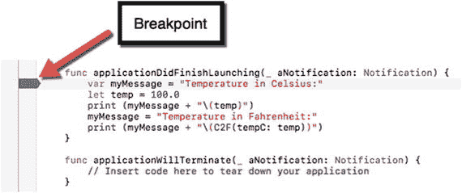

图 27-4.

断点出现在 Swift 代码的左侧  
6.  选择**产品** ➤ **运行**。注意 Xcode 会高亮显示断点所在的行，如图 27-5 所示。注意，最初`myMessage`变量的值是未定义的。

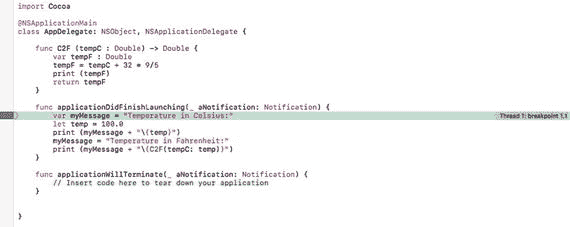

图 27-5.

断点暂停了程序执行，以便你能检查其当前状态  
7.  选择**调试** ➤ **单步跳过**（或按**F6**）。Xcode 会高亮显示断点下方的下一行。调试区左侧的信息会显示程序当前使用的值，如图 27-6 所示。注意，在断点处代码运行后，`myMessage`变量的值现在被定义为字符串“Temperature in Celsius:”。

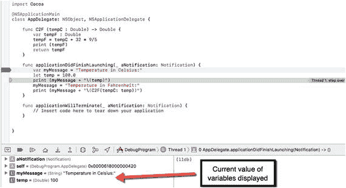

图 27-6.

通过观察变量如何变化，你可以看到每行代码如何影响每个变量  
8.  多次选择**调试** ➤ **单步跳过**（或按**F6**），直到 Xcode 高亮显示以下行：

```
    print (myMessage + "\(C2F(temp))")
    ```

9.  选择**调试** ➤ **单步进入**（或按**F7**）。Xcode 现在会高亮显示`C2F`函数的第一行代码，如图 27-7 所示。

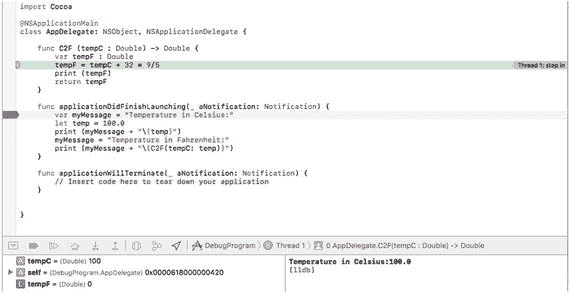

图 27-7.

单步进入命令允许你单步执行存储在函数或方法中的代码  
10. 选择**调试** ➤ **单步跳出**（或按**F8**）。Xcode 现在会高亮显示调用了`C2F`函数的那一行。  
11. 选择**调试** ➤ **继续**以继续运行程序，直到下一个断点。在此程序中只有一个断点，因此程序会显示其空白的用户界面。  
12. 选择**调试程序** ➤ **退出调试程序**。Xcode 窗口再次出现。  
13. **调试** ➤ **停用断点**。Xcode 会使断点变暗。Xcode 将忽略已停用的断点。  
14. 选择**产品** ➤ **运行**。注意，因为你已停用断点，Xcode 会忽略它，并显示空白的用户界面来运行你的程序。  
15. 选择**调试程序** ➤ **退出调试程序**。Xcode 窗口再次出现。


### 管理断点

在一个程序中，你可以设置的断点数量没有上限，因此请根据需要随意放置任意数量的断点，以帮助你追踪错误。当然，如果你在程序中放置了断点，你可能会忘记自己设置了多少个断点以及它们被设置在了哪里。为了帮助你管理断点，Xcode 提供了断点导航器。

你可以通过以下三种方式之一打开断点导航器：

*   选择“视图”➜“导航器”➜“显示断点导航器”
*   按下 `Command + 7`
*   点击导航器面板中的“显示断点导航器”图标

断点导航器会列出你在程序中设置的所有断点，并标识这些断点所在的文件以及每个断点的行号，如图 27-8 所示。

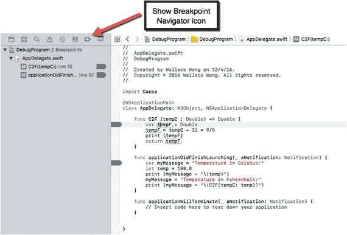

图 27-8. 断点导航器识别你所有的断点

由于断点导航器通过行号来识别断点，你可能希望在 Xcode 编辑器中显示行号（参见图 27-8）。要开启行号显示，请按以下步骤操作：

1.  选择 Xcode ➜ 偏好设置。此时会显示 Xcode 偏好设置窗口。
2.  点击“文本编辑”图标。文本编辑选项随即出现。
3.  选中“行号”复选框，如图 27-9 所示。

    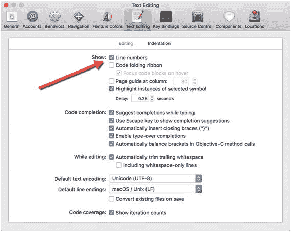

    图 27-9. “行号”复选框可让你在 Xcode 编辑器中显示或隐藏行号
4.  点击 Xcode 偏好设置窗口左上角的关闭按钮（红色按钮）。现在，Xcode 会在编辑器的左侧边距中显示行号。

要学习如何使用断点导航器，请按以下步骤操作：

1.  确保 DebugProgram 项目已加载到 Xcode 中。
2.  在 Xcode 中开启行号显示。
3.  在项目导航器面板中点击 `AppDelegate.swift` 文件。
4.  在你代码中的任意位置放置三个断点，使用你认为最方便的方法，例如点击 Xcode 编辑器的左侧边距、按下 `Command + \`，或者选择“调试”➜“断点”➜“在当前行添加断点”。（具体位置无关紧要。）
5.  在项目导航器面板中点击 `Main.storyboard` 文件。Xcode 会显示你程序的用户界面。
6.  选择“视图”➜“导航器”➜“显示断点导航器”。断点导航器会显示你的三个断点。
7.  点击任意一个断点。Xcode 会显示包含你所选断点的文件。
8.  在断点导航器面板中右键点击任意一个断点。此时会出现一个弹出菜单，如图 27-10 所示。

    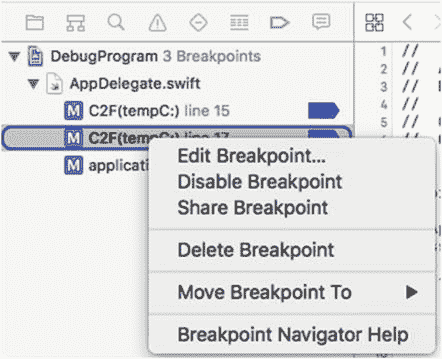

    图 27-10. 弹出菜单可让你修改断点
9.  选择“停用断点”。请注意，这可以让你单独停用或禁用某个断点，而不是通过“调试”➜“停用断点”命令一次性禁用所有断点。
10. 在断点导航器面板中右键点击任意一个断点，然后选择“删除断点”。（另一种删除断点的方法是将断点从代码中拖开，然后释放鼠标左键。）
11. 删除所有断点，直到没有剩余的断点为止。

### 使用符号断点

当你创建一个断点时，必须将其放置在希望程序执行时暂时停止的那一行代码上。然而，这通常意味着需要猜测问题可能在哪里，然后再使用各种单步执行命令来逐行检查代码。

为了避免这个问题，Xcode 提供了符号断点。符号断点仅在特定函数或方法运行时才停止程序执行。如果你不希望某个特定函数或方法每次运行时都停止程序执行，你可以告诉 Xcode 忽略它一定次数，例如 10 次。这意味着该函数或方法最多可以运行 10 次，到第 11 次被调用时，符号断点才会暂时暂停执行，以便你逐行逐步调试代码。

要创建一个符号断点，你可以定义以下内容：

*   符号：要暂停程序执行的函数或方法的名称
*   模块：包含“符号”文本字段所定义函数或方法的文件名
*   忽略次数：在程序执行被临时暂停之前，你希望该函数或方法运行的次数（0 或更多）

要了解符号断点是如何工作的，请按以下步骤操作：

1.  确保 DebugProgram 项目已加载到 Xcode 中。
2.  选择“调试”➜“断点”➜“创建符号断点”。此时会出现一个“符号断点”弹出窗口，如图 27-11 所示。

    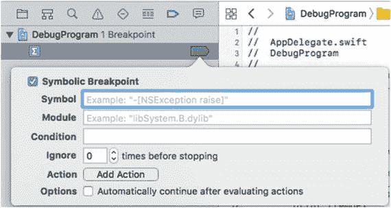

    图 27-11. “符号断点”弹出窗口可让你定义一个断点
3.  点击“符号”文本字段，并输入 `C2F`，这是你想要检查的函数或方法的名称。
4.  （可选）如果你在“符号”文本字段中指定的函数或方法名也用于其他文件，请点击“模块”文本字段并输入一个文件名。此文件名会将符号断点限定为仅作用于该特定文件中的那个函数或方法。由于 `C2F` 函数只使用一次，你可以将“模块”文本字段留空。
5.  （可选）点击“忽略次数”文本字段，输入一个数字，以指定在暂停程序执行之前，忽略函数或方法被调用的次数。在此例中，将 `0` 保留在“忽略次数”文本字段即可。
6.  点击“符号断点”弹出窗口之外的任意位置，使其消失。
7.  选择“产品”➜“运行”。`C2F` 符号断点会使程序在 `C2F` 函数中计算结果的代码的第一行处暂停执行，如图 27-12 所示。

    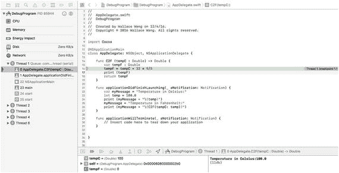

    图 27-12. 符号断点使程序在“符号”文本字段定义的 `C2F` 函数中暂停执行
8.  选择“产品”➜“停止”来让程序停止运行。
9.  选择“视图”➜“导航器”➜“显示断点导航器”。断点导航器面板会显示出来。
10. 在断点导航器面板中右键点击 `C2F` 断点，当弹出菜单出现时，选择“删除断点”。断点导航器面板中应不再显示任何断点。

注意

另一种无需指定特定代码行来设置断点的方法是创建异常断点。通常情况下，如果你的程序崩溃，Xcode 会显示一堆难以理解的错误信息，而你并不知道错误的原因。如果你设置了一个异常断点，Xcode 就能识别出导致崩溃的那行代码，以便你进行修复。


### 使用条件断点

普通断点通常会在每次执行到特定行时停止程序。然而，你可能希望仅当某个条件成立时才在特定行停止程序执行，例如当某个变量超过特定值时，这可能是程序出现问题的信号。

要了解条件断点的工作原理，请按照以下步骤操作：

1. 确保 `DebugProgram` 项目已在 Xcode 中加载。
2. 在项目导航器窗格中点击 `AppDelegate.swift` 文件。
3. 通过点击左侧页边距，或将光标移至该行并按 Command + \，或选择“调试”➤“断点”➤“在当前行添加断点”，在下面这行设置一个断点：

    ```
    print (myMessage + "\(C2F(temp))")
    ```

4. 选择“视图”➤“导航器”➤“显示断点导航器”。断点导航器窗格出现，显示你刚刚创建的断点。
5. 在断点导航器窗格中右键点击该断点，并选择“编辑断点”。此时会弹出一个窗口，如图 27-13 所示。

    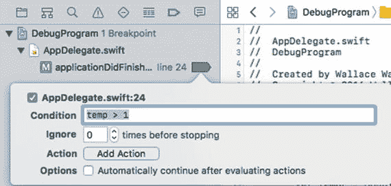

    图 27-13.
    该符号断点在由“符号”文本字段定义的 `C2F` 函数中暂停程序执行。

6. 点击“条件”文本字段，输入 `temp ➤ 1` 然后按 Return 键。
7. 选择“产品”➤“运行”。Xcode 会高亮你的断点以临时暂停程序执行，这意味着条件 (`temp ➤ 1`) 必须为真。
8. 选择“产品”➤“停止”以暂停并退出程序，然后返回 Xcode。
9. 选择“视图”➤“导航器”➤“显示断点导航器”，右键点击你创建的断点，并选择“编辑断点”。弹出窗口出现。
10. 点击“条件”文本字段，将文本编辑为 (`temp ➤ 500`)。按 Return 键。
11. 选择“产品”➤“运行”。请注意，这次你的断点没有停止程序执行，因为它的条件 (`temp ➤ 500`) 不成立。由于断点未停止程序，程序的空白用户界面出现了。
12. 选择“DebugProgram”➤“退出 DebugProgram”。
13. 将断点从左侧页边距拖走，松开鼠标左键以删除该断点。（你也可以在断点导航器窗格中右键点击该断点，并选择“删除断点”。）

### 总结

任何程序中都难免出现错误或缺陷。虽然语法错误易于发现和修复，但逻辑错误更难定位，因为你本以为代码会产生某种结果，结果却产生了另一种结果。此时，你需要弄清楚本以为自己一切正确，但究竟哪里做错了。更难以追踪的是运行时错误，它们往往看似随机发生，原因在于那些影响程序的未知条件。

为了帮助你追踪并消除大多数错误，可以使用 `print` 命令配合注释，但对于更健壮的调试，你应该使用 Xcode 内置的调试器。借助调试器，你可以在代码中设置断点，并观察值是如何存储在一个或多个变量中的。

条件断点仅在特定条件发生时停止程序执行。符号断点仅在调用特定函数或方法时停止程序执行。一旦断点停止了程序，你可以使用各种单步执行命令逐行继续检查代码。`step into` 命令允许你查看存储在函数或方法内部的代码，而 `step out` 命令则允许你提前退出函数或方法，并跳回到调用该函数或方法的位置。

通过使用断点和单步执行命令，你可以详尽地逐行检查程序的工作原理，从而尽可能多地消除错误。程序包含的错误越少，用户就会越满意。

