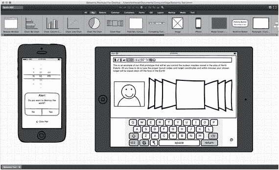
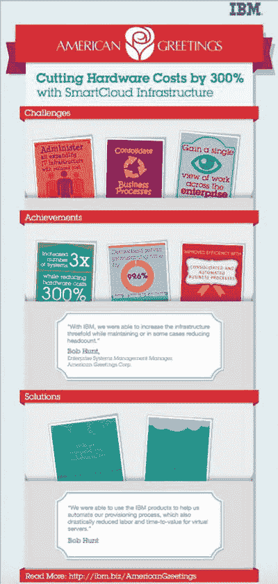

# 28. 在编码前后规划程序

在你投入数天、数周、数月甚至数年来开发一个程序之前，首先要确保这个世界确实需要你的程序。如果你是为自己编写程序，那么可以忽略其他人的看法。但是，如果你打算将程序出售给他人，请确保你的程序在开始之前就有前景。

以下是判断你的程序是否存在市场的一种方法。寻找竞争对手。大多数人认为瞄准没有竞争的市场更好，但如果没有竞争，这可能是一个重要的线索，表明同样也没有市场。

然而，如果你寻找一个充满众多竞争对手的市场，这意味着该类程序存在着一个活跃的市场。只需快速搜索一下彩票选号软件或占星程序，你就会发现大量的竞争对手。竞争越激烈，市场越活跃。

如果只有一两家大公司主导着某个特定市场，那么这个市场中的机会很可能已经过去了。例如，尽管有 macOS 和 Linux 可用，但 Windows 仍然是个人电脑的主流操作系统。同样，iOS 和 Android 主导着移动电脑市场，因此，试图编写一个与 Windows、Android 或 iOS 竞争的操作系统很可能会浪费你的时间。

同样，当今市场上只有少数几个主要的文字处理器、电子表格和演示程序，这意味着尝试编写另一个通用的文字处理器、电子表格或演示程序很可能是徒劳的。

竞争激烈意味着市场活跃。竞争极少或没有竞争意味着市场可能已经选定了一个领导者，你的程序很可能永远无法推翻这个领导者。试图说服人们购买你的文字处理器而不是使用 Microsoft Word 或 Pages，很可能是浪费时间。

因此，要寻找细分市场。例如，文字处理器市场可能已被 Microsoft Word 主导，但专用的文字处理器仍有需求。虽然 Microsoft Word 可以用于编写剧本和小说，但它并非为此目的而优化。这就是为什么其他公司能够成功销售用于编写剧本或小说的专用文字处理器，这些处理器能帮助你组织创意。

这样的细分市场对于大公司来说太小，不值得关注，这意味着你永远不必直接与这些大公司竞争。除了瞄准大公司忽略的细分市场之外，第二种方法是找出大公司软件中缺乏什么，然后编写一个程序来满足这个缺失的需求。

例如，Microsoft Office 提供了密码保护功能来锁定文件。然而，Microsoft 的加密功能很弱，容易被破解。因此，市场上就需要这样一种软件：它能够比 Microsoft Office 更好地加密文件，同时提供与 Microsoft Office 相似的用户界面。

最重要的是，编写程序是因为你对这个特定领域感兴趣，而不是因为你认为它能让你赚大钱。销售房地产管理软件或无人机控制软件可能有利可图，但除非你对这些领域感兴趣，否则你很可能没有热情或长期的兴趣去投入漫长的时间为这些用户开发和推广程序。

作为一般规则，要避免直接与大公司竞争。即使是苹果，也无法在个人电脑操作系统市场上与 Microsoft Windows 竞争，而像 Linux 这样的免费产品在对抗 Windows 方面也并未取得太大成功。

与其直接与大公司竞争，不如寻找那些太小以至于大公司无法涉足的细分市场，或者寻找补充大公司现有程序的方法。最重要的是，在你充满热情想要解决的某个领域里发现一个问题，这将为你提供动力去创造最好的程序。

## 明确程序的目标

当程序员初次产生一个想法时，他们往往会本能地冲到电脑前开始编写代码。然而，这就像住在洛杉矶时，突然想去纽约看看，然后跳上车就开过去。你最终或许能到达目的地，但若没有计划，很可能会因未规划路线或未准备让旅途更愉快的东西而浪费时间。

正如你在匆忙前往另一座城市之前，应该花时间提前规划一样，在开发新程序时，你也应该花时间提前规划。如果你凭着一时灵感冲动地开始编写 Swift 代码，很可能在程序完成前就耗尽了精力和想法。这很可能会产生一个半成品、设计糟糕的程序，需要大幅修改才能运行，或者更糟的是，可能不得不彻底放弃。

编写代码实际上是创建任何程序中最简单的部分。编程最难的部分，往往是确定你希望程序在完成后能实现什么目标。

例如，如果你正在学习和实验 Swift，你可能只是想通过创建程序来掌握某个特定功能，比如如何从股票市场网站获取数据，或者如何为游戏创建动画。在这种情况下，你的目标只是创建一些简短、一次性的程序，让你了解如何使用特定的编程功能。

如果你计划创建程序供他人使用，那么你需要做一些额外的规划。首先，你为什么想为他人创建程序？也许你想为某个人定制一个程序，或者你想创建一个具备现有程序所缺乏功能的程序。无论出于何种原因，每个程序最终都必须满足用户的需求。

如果你为自己使用而创建程序，那么你就是用户。但如果你为他人创建程序，那么用户可以是特定的人和计算机（例如，你所在牙科诊所的一位牙医），也可以是一个广泛的用户群体（任何需要管理牙科诊所的牙医）。无论用户是谁，都要找出你的程序必须为该用户解决的最重要的单一任务。然后确保你的程序能正确完成这一关键任务。

**注意**

2000 年至 2005 年间，美国联邦调查局（FBI）耗资 1.7 亿美元创建了一个名为“虚拟案件档案”的程序。由于该程序的目标和运作方式的规范不断变更，政府最终放弃了整个项目。如果你不知道程序应该做什么，你也就不会知道它应该如何实现那个结果。

在编写任何程序之前，请明确以下内容：

-   程序的用户是谁？
-   程序应该为用户做什么？
-   程序将如何为用户实现这一结果？

程序的用户完全决定了程序用户界面的设计。比较一下 777 喷气式客机的驾驶舱和普通汽车的仪表盘。对普通人来说，777 的驾驶舱可能看起来令人生畏，但对经验丰富的飞行员来说，一切触手可及，易于理解。如果你的程序面向专业人士，你的用户界面可以依赖用户的知识来操作。如果你的程序面向普通大众，你的用户界面可能需要更频繁地引导用户。

每个程序都必须为用户创造有用的结果。文字处理器将文本组织成格式整齐的页面，电子表格自动准确地计算数学公式，甚至游戏也能提供娱乐。想象一下，你的程序赋予了用户一种无法通过其他方式获得的超能力。你的程序将赋予用户什么超能力？

一旦你明确了程序应该为用户做什么，最后一步就是确定它将如何实现这一结果。程序通常接收用户输入，以某种方式处理这些输入，并提供新的结果。作为程序员，你需要一步一步地确定如何实现这个新结果。然后，你需要将这些步骤翻译成 Swift 这样的编程语言。

归根结底，编程是一种需要清晰、具体的目标和持之以恒的毅力才能获得成功的创造性才能。

## 设计程序的结构

一旦你明确了程序需要做什么以及如何做到，下一步就是设计程序实际工作的方式。编写程序并没有唯一的“最佳”方法，因为你可以用一百万种不同的方式编写同一个程序。然而，你需要设计的程序不仅要能工作，还要易于理解和在未来进行修改。

每个程序总有改进的空间。有时改进意味着优化程序，使其运行更快或占用更少内存。其他时候改进意味着为程序添加新功能。无论哪种情况，每个程序在其生命周期内都可能经历多次修改，因此从一开始就设计好程序至关重要，使其易于理解和修改。

在面向对象编程的世界里，设计程序的常见方式是将一个大型程序拆分为多个代表逻辑功能的对象。例如，如果你正在设计一个控制汽车的程序，你可以将程序划分为以下对象：

-   发动机对象
-   转向对象
-   音响对象
-   变速箱对象

现在，如果你需要改进程序的转向能力，你只需用一个新的`转向`对象替换旧的即可，而不会有改动影响程序其他部分的风险。

如何将程序划分为对象是完全自由的。你也可以将同一个汽车程序设计为以下对象：

-   前部对象
-   后部对象
-   内部对象
-   底盘对象

如果你从一开始就设计好程序，那么你或其它程序员将来就能轻松地对其进行修改。

## 设计程序的用户界面

除了程序设计的结构，程序的另一个关键要素是用户界面。借助 `Xcode`，你可以完全独立于用户界面来设计程序的结构（即它的各种对象），反之亦然。这让你拥有自由，可以轻松地设计或修改程序的结构或用户界面，而不会影响到程序的另一部分。

用户界面定义了用户如何看待你的程序。糟糕的用户界面会使程序难以使用，而优秀的用户界面则能让程序易于操作。即便程序底层结构很差，一个好的用户界面也能让程序看起来反应灵敏、优雅且设计精良。

那么，什么是好的用户界面呢？理想情况下，用户界面会融入背景，以至于用户甚至察觉不到它的存在。当你在 iPhone 或 iPad 的屏幕上用两根手指捏合时，就能让图像看起来变大或变小。

从用户的角度来看，用户界面仿佛不存在，因为用户获得了直接操控图像的直观感受。实际上，是用户界面将用户指尖的位置转换成了放大图像外观的效果。用户界面依然存在，但用户不需要阅读厚厚的培训手册并遵循多个步骤来操作它。优秀的用户界面本质上会融入背景之中。

下面来看看一个笨拙的用户界面会如何完成完全相同的任务。首先，用户需要点击屏幕上的一个按钮来显示菜单。其次，用户需要从该菜单中选择一个 `Zoom` 命令。第三，用户需要输入一个代表放大百分比的数字，例如 50% 或 125%。第四，用户需要点击一个 `OK` 按钮，才能最终完成任务并改变图像的放大倍率。

你更愿意使用哪一种用户界面？

通常来说，完成一项任务所需的步骤越多，用户界面就越难用，因为如果用户遗漏了一个步骤，或打乱了某个步骤的顺序，整个任务就会失败。程序员们常常试图通过增加快捷键或工具栏图标等更多方式来完成同一任务，以此来修复糟糕的用户界面设计。不幸的是，如果你的用户界面本身就很差，增加更多完成任务的方式并不一定会让它变得更容易使用。

如果你有一个糟糕的用户界面，与其试图修复一个有缺陷的设计，不如重新设计整个界面。

### 用纸和笔设计用户界面

通常来说，你对用户界面的第一个想法很少会成为最终的设计。这是因为你认为行得通的东西可能行不通，而你甚至没有考虑到的事情可能对用户至关重要。因此，与其先设计用户界面再被迫修改，不如用纸和笔来设计用户界面，这样会快得多，也简单得多。

一旦你在纸上有了一个粗略的设计，就把它拿给最终用户看，以获取他们的反馈。尽管看着静态的、粗略绘制的用户界面图像似乎没什么意义，但它能让你获得关于用户界面总体设计的反馈。在评估初步的用户界面时，可以向用户提出以下问题：

- 缺少什么？是否有命令或功能需要显示却没有显示出来？
- 什么是不需要的？是否有当前显示但不必要的命令或功能？
- 什么能让操作更简便？如何重新排列或组织用户界面使其更简单？
- 什么令人困惑？是否有用户不理解的地方？帮助菜单和描述性工具提示永远无法替代清晰简洁的用户界面设计。
- 什么是直观的？用户期望对你的用户界面做什么？你的用户界面是支持还是挫败了用户的期望？

在纸上设计用户界面快速、迅捷且容易。由于你在任何一个特定的用户界面设计上投入的时间都不多，因此抛弃糟糕的设计比试图辩护和证明保留它们的合理性要容易得多。

此外，纸上设计也方便你或他人在上面涂写以重新设计。因为任何人都可以快速而简单地制作纸质用户界面设计，所以请随意尝试。你能创建的用户界面设计越多，你就越有可能偶然发现一个可行的方案。

研究现有的程序，看看你最喜欢什么，最不喜欢什么。然后将这两种特性（你喜欢的和你讨厌的）放入不同的用户界面设计中。你可能认为最好的设计，也许恰恰是别人最不喜欢的；而你最不喜欢的那个设计，可能别人觉得是最好的。

### 用软件设计用户界面

当你已经尝试了不同的用户界面设计，并找到了一个或多个看起来很有前途的方案后，是时候超越纸和笔，创建一个能在电脑屏幕上实际查看的用户界面原型了。

在纸上看起来不错的东西，在电脑屏幕上可能行不通。更重要的是，电脑屏幕可以创建一种简单的交互形式。当用户点击按钮时，一个新屏幕会出现，就像真实的用户界面那样工作。这种交互性是纸笔设计难以模仿的。

创建交互式用户界面原型的一个快速方法是使用演示软件，例如 `PowerPoint` 或 `Keynote`。演示软件允许你创建幻灯片，每张幻灯片可以代表你的用户界面的一个窗口。你可以放置按钮和图形来创建粗略的用户界面设计，然后在这些按钮和幻灯片之间创建链接，以形成有限形式的交互。

交互式用户界面原型能让你测试用户期望用户界面如何响应。例如，用户可能期望在点击一个命令后看到某个特定窗口。如果你的交互式原型向用户展示了一个不同的窗口，那么你就知道需要修复什么了。

与纸笔设计一样，用户界面原型的目标是找出哪些可行、哪些不可行，同时尽可能少地花费时间在设计原型上。你在设计原型上花的时间越少，就有越多的时间去构思替代方案并测试它们。

除了使用演示软件创建用户界面原型外，你还可以购买专门的模拟软件，这些软件包含了常见的用户界面元素，如按钮、窗口和复选框，你可以快速拖放它们来创建一个模拟的用户界面，如图 28-1 所示。

图 28-1. Balsamiq Mockups 是一款专门用于创建用户界面原型的程序

用户界面原型的软件版本提供了交互性。当你对作为原型的用户界面设计感到满意时，最后一步就是将你的原型转换为真正的 `Xcode` 用户界面。

请记住，`Xcode` 允许你将 `Swift` 代码与用户界面完全分开创建。这意味着你可以在 `Xcode` 中创建用户界面，而无需编写一行代码。当你对用户界面的外观和设计感到满意时，可以将其各种元素（按钮、菜单等）连接到 `IBOutlets` 和 `IBAction` 方法，从而将你的用户界面与你的 `Swift` 代码链接起来。

## 营销你的软件

一旦创建了程序，你就需要对其进行测试以确保它能正常工作。这些早期测试者（称为 Alpha 和 Beta 测试者）可以帮助发现程序中的漏洞，以便你及时修复。当你的程序尽可能没有漏洞时，就是把它推向市场的时候了。

大多数人都会犯这样一个最大的错误：他们编写了一个程序，搭建了一个网站来宣传这个程序或他们的公司，然后就坐等订单纷至沓来。在 macOS 的世界里，苹果公司提供了专门的 Mac App Store，让每个 Mac 用户都有机会访问你的软件。

然而，仅仅在网站或 Mac App Store 上宣传你的软件，然后坐等人们购买是远远不够的。为了最大化销售额，你还必须推广你的软件。

对许多人来说，营销意味着花钱做广告。虽然你可以这样做，但最好还是尽可能少花钱。在广告和营销上花钱很容易，但除非你的广告和营销支出低于它们所产生的销售额，否则你就有慢慢破产的风险。大多数人犯错的地方在于，他们把钱花在了广告和营销上，却不知道这些投入是否带来了足够的销售额来证明这笔开销是值得的。

这就是为什么你应该专注于免费的方式来宣传和营销你的软件，这样你就能了解人们喜欢你的软件哪些方面，哪些类型的人更有可能购买你的软件，以及接触潜在用户的最佳方式，而所有这些都无需倾家荡产。

例如，假设你销售一款能让视频看起来像几十年前胶片拍摄的陈旧效果软件，画面带有划痕、褪色图像以及胶片在电影放映机中穿行的音效。你可能会最初瞄准那些想把视频变成老电影图乐子的用户，但你可能发现你的实际市场是好莱坞电影制片厂，他们需要创建视觉效果来模拟老电影。

你的初始市场可能并不在乎你的软件，但一个完全不同的市场却可能感兴趣。如果你把钱花在了对初始市场的广告上，那就等于把钱浪费在了那些并不真正想要你程序的人身上。也许要等到后来，你才能找到软件的真正市场，而这个市场可能来自你从未想过的某个意想不到的细分领域。

所以，不要用花钱来代替市场调研。花钱很容易，但花时间去评估你的营销和广告到底有多有效，以及你是否从一开始就瞄准了软件最有利可图的市场，这却要难得多。

除了花最少的钱通过网站推广你的软件之外，这里还有一些低成本的、几乎免费的其他推广方式：

*   开设博客。
*   赠送免费软件。
*   在 YouTube 等视频分享网站上发布你的软件视频。
*   创建并免费提供包含技巧的 PDF 文件，面向那些可能是你软件潜在客户的人群。
*   找到你的潜在客户聚集的社交网络，参与讨论并回答他们的问题。

### 撰写关于你软件的博客

一个网站就像是在沙漠中央竖立一块广告牌，指望人们会奇迹般地发现它。虽然搜索引擎可以帮助人们找到你的网站，但在你的网站上同时包含一个博客要好得多。

博客有几个目的。首先，通过坚持至少每周更新一篇博客，你为网站生成了新内容。新内容告诉搜索引擎你的网站是活跃的，因此搜索引擎会将其排名比那些几个月甚至几年未更新的网站更高。所以博客能提高你的搜索引擎排名，从而增加潜在客户找到你产品的机会。

其次，博客为你的软件赋予了人性化的一面。通过讨论你在创建软件时面临的挑战，以及回答人们关于你软件的疑问，你展示出有人在乎并愿意回应关于该软件的问题。在从一个匿名的公司购买，还是从一个看起来像真实的人那里购买之间做选择时，这种微妙的差异可以增加潜在客户购买你软件的可能性。

第三，每篇博文都相当于一个为你的软件做宣传的迷你广告。大多数人创建一个描述其软件的网站，希望以此说服人们购买他们的产品。而博客让你可以聚焦于软件的不同方面。一篇博文可能会谈论一个你特别引以为豪的特色功能。第二篇博文可能会讲述一个满意客户使用你的软件解决问题的故事。第三篇博文可能会解释你为何以某种特定方式设计你的程序。

由于每篇博文都略有不同，你避免了重复。然而，因为每篇博文都在持续推广你的软件，你便从不同角度不断宣传你的软件。这增加了某篇博文能说服某人购买你软件的机会。

写博客只需要花费时间，却能在反复推广你的软件的同时，提高搜索引擎排名。把博客看作是在互联网上免费做广告的一种方式。

### 赠送免费软件

公司免费赠送从食品到牙膏等各种样品是有原因的。他们知道，一旦你尝试并喜欢上某个产品，你购买它的可能性就会大大增加。如果你从未尝试过某个产品，公司想说服你购买就难得多。

赠送免费软件的原理也是如此。一些公司会免费提供他们软件的“精简版”，这些版本功能齐全。这让客户可以免费试用你的软件。一定比例的客户最终会想要更高级的功能，这些人就会转化为付费客户。

使用你免费软件的人越多，为高级版本付费的人也就越多。

例如，假设有 1% 尝试你免费软件的人决定购买你的高级版本。如果你能让 100 个人用上你的免费软件，那就意味着达成一笔销售。然而，如果你能让 10,000 个人用上你的免费软件，那就意味着 100 笔销售。

由于分发免费软件不会给你带来任何复制或分发成本，你的广告和营销成本基本上为零。

除了提供免费的“精简版”程序，你还可以提供与主要程序相关的免费软件。例如，假设你销售一款面向科学家的文字处理器，它可以编写复杂的数学和化学公式。与其赠送程序的免费“精简版”，不如赠送你的目标受众（工程师和科学家）可能喜欢的免费软件，比如一个交互式的元素周期表或一个简单的方程求解程序。

这样的免费软件只是免费提供给潜在客户一些东西。现在，如果他们喜欢你的免费软件，他们就更有可能信任你的商业软件。如果你的免费软件设计精良且实用，潜在客户就会相信你的商业软件也一定同样设计精良且实用。免费软件让潜在客户能够无风险地体验你的产品。

#### 发布关于你软件的演示视频

为你的软件撰写博客文章对喜欢阅读的人来说很棒。可惜如今世事繁忙，许多人没时间阅读。另一种方法是制作短视频演示你的软件如何运作，让人们看到你的软件能解决什么问题以及如何解决。

通常来说，没人想购买或使用你的软件。他们真正想要的是你的软件所能提供的解决方案，而这正是你需要在视频中强调的。不要解释菜单系统或用户界面的布局。专注于解决一个具体问题，并突出你软件中的独特之处。

例如，假设你的软件是为房地产经纪人设计的。你的潜在客户要么想节省时间，要么想赚更多钱，所以请展示你的软件如何能帮助房地产经纪人实现这两个目标。演示一个能简化现有耗时流程的功能。再展示另一个能以较少额外工作量增加房产潜在买家人数的功能。始终关注你的软件如何为用户带来好处。

保持视频简短且切中要点。更多人会观看一个不到一分钟、演示单一功能的视频。观看一个 30 分钟、演示多个功能的视频的人则要少得多。在像 YouTube 这样的许多视频分享网站上，你甚至可以将多个视频串联起来，这样当一个视频结束时，第二个视频自动开始。这样一来，每个视频都成了你产品的又一个广告，而通过将每个视频链接到另一个，每个新视频都能增加有人发现并观看其中至少一个视频的机会。

#### 提供免费信息

人们倾向于从他们信任的人那里购买更多产品，因此让人们对您产生信任的一种方法就是免费提供有用的信息。例如，如果你的软件帮助编辑照片，那就写一份捕捉更佳照片的窍门清单。然后以 PDF 文件形式分享这份窍门清单并免费赠送，附上一个链接到你的网站来推广你的软件。

免费、有用的信息充当着一种巧妙的广告。传统广告直接推销产品，这可能会立刻让哪怕是最好的潜在客户望而却步。而免费信息则巧妙地推广产品。由于免费信息对你的潜在客户有用，他们会更愿意查看它，甚至与他人分享。如果他们想了解更多信息，他们可以访问你的网站。

一种在视觉上吸引人的提供免费信息的方式是通过图文结合的形式，也就是所谓的信息图。信息图以色彩丰富的方式呈现信息，使其易于阅读和理解，无需阅读大量文字。如图 28-2 所示，就连 IBM 也会制作并分发免费的信息图来推广其服务和产品。

图 28-2. IBM 提供一份 PDF 格式的信息图，以推广其服务如何帮助了 American Greetings 公司

通过提供免费、有用的信息，你将自己塑造成权威。如果你能提供免费、有用的信息（以 PDF 文件和博客文章的形式）放在你的网站上，你就会给人们更多理由反复访问你的网站/博客。人们访问的次数越多，他们最终购买你的软件或向他人介绍你的网站/博客的可能性就越大。

免费、有用的信息能让你显得值得信赖，这降低了购买你软件的门槛。人们越信任你，他们就越有可能相信你的产品能实现你所宣称的功能。

### 加入社交网络

在你的博客中或以 PDF 文件形式免费提供有用的信息，可以帮助你确立自己在该领域的权威地位。然而，博客需要有人访问你的网站，而 PDF 文件则需要有人下载。分享免费有用信息的另一种方法是与热门社交网络保持持续联系。

找出你的潜在客户在使用哪些社交网络，然后加入这些网络。当人们提出问题，就跳进去用有用的建议回答他们。目的是解答人们的问题，并让自己显得值得信赖。然后确保你发布的每条消息都包含一个指向你网站或博客的链接。

参与社交网络能让你比指望人们访问你的博客或找到你的 PDF 文件更快地接触到潜在客户。只是要确保你提供的是有用的信息，而不是那些只会惹恼别人的、伪装拙劣的广告文案。人们在社交网络上越信任你，他们就越有可能访问你的网站/博客。

借助于所有这些技巧，目标并非让人立刻购买你的产品（尽管这总是好事）。真正的目标是引导他们向了解更多你和你的产品迈进一步。人们越了解你的产品，就越有可能向你购买。

广告和营销本质上是一场数字游戏。持续以不占用太多时间或金钱的方式免费帮助他人，最终你会发发现有人找到你并购买你的软件。你帮助别人越多，别人就越信任你并从你这里购买。

传统的营销和广告方式试图强迫人们听广告并违背自己意愿购买（这也是为什么这么多人讨厌营销和广告）。更有效的营销和广告方式是在要求潜在客户购买之前，先给他们一些有价值的东西。

### 总结

大多数程序员都专注于提升编程方面的技术知识。虽然尽可能多地了解 `Swift` 的功能特性和 `Cocoa` 框架总是有益的，但仅有技术知识通常是不够的。

编程并不仅仅是编写代码。在你开始编写 `Swift` 代码之前，需要确保你的程序有市场需求。与其试图与大公司竞争，不如寻找那些被大公司忽视的利基市场，或者想办法让你的程序能够补充大公司所提供的产品。大公司拥有远超你的资源，可以用来碾压任何直接竞争对手，因此，瞄准利基市场或为他们的产品提供补充，可以避免与体量更大的公司直接竞争。

在开始编写 `Swift` 代码之前，请先为你的软件用户界面创建原型。虽然对程序员来说，用户界面设计可能不像深入研究编写代码的复杂性那样有吸引力，但它是任何软件项目至关重要的组成部分。用户界面决定了人们如何看待你的程序。设计良好的用户界面能让你的程序更易于使用。而设计欠佳的用户界面则会让程序显得难以使用，即便它可能具备出色的技术特性。

使用纸和笔来尽可能快速、低成本地测试你的用户界面设计。当你需要创建交互式版本的用户界面时，可以使用像 `Keynote` 或 `PowerPoint` 这样的演示软件来制作简单的模拟图，或者考虑购买专门的原型设计软件。

当你有了最终的用户界面设计后，在 `Xcode` 中将其实现。请记住，随着程序的不断演进，你很可能还需要对用户界面进行调整。

最后，当你的程序完成时，你的工作仍未结束。你还需要为你的软件做广告和营销。与其花钱购买广告，不如优先选择免费的推广方式，这样成本更低，而且通常效果更好。

开设一个博客，免费分享信息，为他人提供有价值的东西。你给予他人的越多，他人就越有可能被你的产品吸引并购买。

正如你所看到的，编码只是创建和营销软件的一个环节。技术知识可以创造软件，但在编码之前和之后，你还需要额外的技能来恰当地设计你的程序，并在日后成功将其销售出去。

