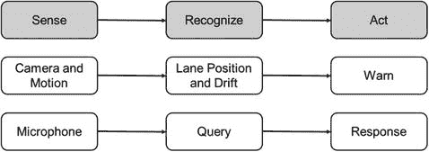
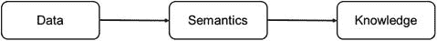
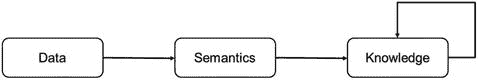
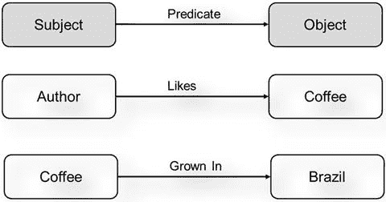
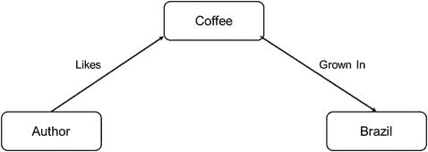
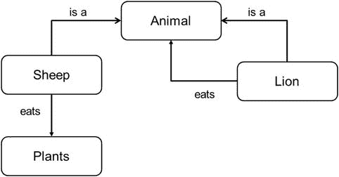
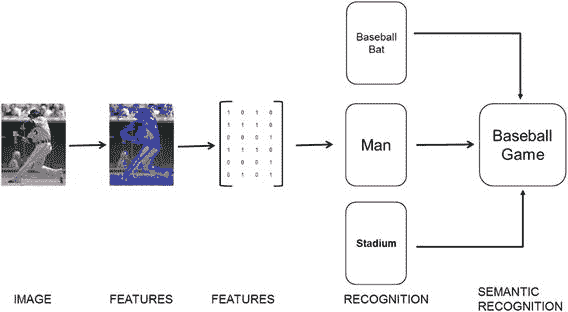
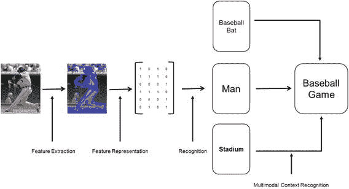

# 管道简介

当今的电子世界充满了（a）从各种来源收集数据的传感器，以及（b）将这些数据用于各种用途的应用程序。我们的智能手机包含摄像头、运动传感器、温度传感器、麦克风、GPS 传感器等。智能手表包含这些传感器以及更多，例如心率传感器、体温监测器等。我们不随身携带的设备则配备了监测环境的传感器，例如可以监测家中是否有人以实现自动温控的智能恒温器，以及用于入侵监测的摄像头（包括面部识别）。虽然传感器及其相关的意义构建世界似乎正变得日益拥挤、智能且高度复杂，但要理解这个世界的内部结构，人们需要了解一些基本原理和流程。本书将通过几个具体示例详细说明这些概念。在本章中，我们将呈现一个高层级的概览，并让读者初步领略本书后续内容。

## 动机

对于那些好奇传感器如何收集我们周围环境和行为信息，以及这些信息如何被处理以提供对我们有用的服务的读者来说，本书将帮助他们理解相关概念，并提供指导，以便他们能自行构建一些基础解决方案。理解所有这些复杂服务都建立在相似的基本原理之上，是迈向这一过程的基础步骤。

例如，考虑一个用于汽车的复杂高级驾驶辅助系统（ADAS）（图 1-1）。它使用一组传感器，如摄像头、运动传感器等，为驾驶员提供安全和舒适方面的辅助。其用途之一是自动追踪汽车在车道中的位置，并在车辆偏离车道时发出声音警告（车道偏离警告）。这个高度复杂的系统，其工作原理基于物联网（IoT）的基本处理流程，包括：收集数据的传感器（摄像头、运动传感器）、识别数据的算法（汽车在车道中的相对位置、车辆偏移），以及根据识别结果采取行动的应用程序（声音警告的开启/关闭）。如图 1-1 所示，这个流程是所有传感器数据复杂处理管道的基础，这将在本书的各个章节中逐渐明晰。

图 1-1. 传感器数据处理与应用程序的阶段

另一个例子是智能手机和其他设备提供的基于语音的自动个人助理。在这种应用中，用户通过语音命令激活系统，然后提出诸如“明天天气怎么样？”之类的查询。系统会“神奇地”理解问题，并给出语音回答。这个复杂系统的核心，正是我们熟悉的（感知、识别、行动）方法论。麦克风感知我们的语音，识别系统“理解”我们的意图，然后采取行动来满足请求。

本书的后续章节旨在为读者提供处理各种传感器所采集数据的步骤的高层级概览，使其能够应用于各种应用程序。我们将理解将数据转化为知识所需的逻辑步骤，并深入探讨一些具体的实现方式，以便读者能够轻松地“摆弄”代码和数据，从而理解实现的细节。

从高层级来看，从物理世界捕获的数据需要经历如图 1-2 所示的三个阶段，才能转化为可操作的知识。

图 1-2. 数据生命周期阶段

第一阶段显示的是由各种传感设备（视频、音频、压力、运动、温度等）捕获的数据。这些数据是原始的（未处理的），并夹杂着各种噪声，需要进行清理、过滤，并以结构化方式表示，才能用于分析和处理。在当前的讨论中，我们假设所有这些处理步骤都由图 1-2 中的数据块来表示。

数据本身是在特定时间段内的一系列单一测量值。要理解数据实际在“诉说”什么，观察者需要提取数据中的语义。例如，虽然 100°F 的环境温度读数本身告诉了我们热传感器采样的绝对温度，但其语义并不能立即被理解。将这个信息与一个（假设的）事实——该测量是在阿拉斯加冬季的冰川附近进行，且之前的测量值逐渐升高——结合起来，我们就获得了上下文和语义上的理解：测量地点正在发生一些不寻常的事情。

理解数据中蕴含的语义，使我们能够把握数据在上下文中的意义。此外，还能理解这些语义与迄今已知的其他事实之间的关系。这些关系构成了“知识”的基础。举一个非常简单的例子，在上述温度读数的实例中，与另一个事件（如一场大的森林火灾）的关联，可以为我们理解异常温度读数的根本原因提供依据。

上述讨论中蕴含的一个事实是“知识会自我滋养”，也就是说，如果系统已经“知道”阿拉斯加的天气通常比较凉爽，那么它就能知道那里出现的高温是一种异常。因此，我们可以重新绘制图 1-2，如图 1-3 所示，在知识构建器中加入一个反馈回路。

图 1-3. 迭代知识模型

知识指的是从传感器数据中提取的语义信息的聚合体，其组织方式使得关系通过链接扩展到整个知识库，这些链接会随着越来越多的语义信息可用而随时间建立起来。知识管理任务包含两个主要的结构部分：

1.  **知识表示**：知识需要以一种能够保留并修改各种概念之间的语义信息和关系的方式进行存储和表示。对知识的修改包括添加新的信息和实体，以及由新数据催化的当前关系或表示的变更。
2.  **知识操作**：这包括用于向知识数据库中插入和提取数据的工具、API 和编程语言。知识存储需要提供一种方式，以便在现有知识数据库中的正确位置插入新的关系。这涉及理解传入的语义数据，并提供一种机制来查找和操作正确的关系。提取过程涉及响应针对不同实体和概念之间关系的各种查询。提取器的输入是一个不完整的关系描述，输出则是填补描述中的空白。提取器需要支持一种逻辑语言，该语言能够用数学方式表示诸如“在 X 餐厅，我点烤鸡应该配什么酒？”这样的查询，并提供一种在知识数据库中遍历以获取答案的机制。

## 1.2 数据抽象的更高层次

在熟悉了功能模块的高级描述之后，我们现在简要概述端到端流水线中的数据抽象。这些抽象展示了如何将通过传感器从物理世界收集的数据，最终转化为可操作、有价值的信息。

就本书而言，我们关注以下数据抽象的细分层次。

1.  **原始传感器数据**：原始（或未经处理的）传感器数据由流水线前端的传感器捕获。数据的格式随传感器类型而变化。以下是几种传感器及其相关数据格式的示例：
    1.  **视觉**：通常，相机传感器拍摄场景的静态图像或视频。数据格式是模拟电压电平，代表图像传感器上不同位置的像素强度和颜色。这些电平被频繁采样并量化为比特，使信号更容易进行数字处理。这个过程称为模数转换。
    2.  **音频/语音**：类似麦克风的传感器通常捕获音频。如果目标是通过网络传输信息或通过数字工具处理信息，则会应用称为模数转换的过程来实现转换，结果是一个代表随时间变化的音频频率的比特流。
    3.  **运动**：惯性传感器通常测量加速度和运动（平移和旋转）。产生的数据是一串数字，代表上述参数的瞬时变化。
    4.  **温度传感器**通常报告某一时刻的瞬时温度。
    5.  **BMI 传感器**：脑机接口传感器，如 `EEG` 和 `EKG`，以活动图的形式报告脑活动测量值。图 1-4 展示了一种可以像耳机一样戴在头上的商用 BMI 传感器。

    

    图 1-4. BMI 传感器

2.  **特征**：一般来说，我们对数据中的某些更高级信息感兴趣，这些信息的聚合可以导致目标实体的识别。例如，在图像中定位边缘或角点可能是识别可辨识物体的第一步。类似地，识别音频流中的微话语使得能够将它们拼接成单词。

3.  **已识别实体**：识别通常是一项复杂的任务，涉及对所提取特征进行空间和时间分析，以将聚合特征映射到预先已知的实体。继续上面的例子，对于视觉而言，识别任务可能涉及对提取的特征进行分类，以识别物体和面部等形状。对于音频，对特征进行统计分析和分类使得聚合特征能够被识别为单词。通常，识别工具会使用它们最终要在特征池中“搜索”的实体示例进行预训练。例如，面部识别算法将使用每个面部的多张训练图像针对特定面部进行训练。一旦训练完成，模型便可以从测试图像中识别出训练过的面部。

4.  **语义关系**：语义关系提取，连同上下文关系提取，已变得越来越重要，尤其是随着机器在理解周围环境方面变得更加智能。语义关系指的是各种已识别实体之间的联系。例如，钥匙和锁之间的语义关系指的是用钥匙打开或锁上锁的操作。类似地，句子“我喜欢咖啡”使用谓语“喜欢”将“我”（主语）与“咖啡”（宾语）联系起来。许多更简单的语义关系可以通过这种（主语，谓语，宾语）三元组来表示。图 1-5 以图形方式展示了一个关系三元组的示例。

    

    图 1-5. 语义关系

5.  **上下文关系**：上下文关系有助于在语境中理解已识别数据。上下文可以通过多种方式获得。这些方式包括使用其他传感器以及利用已识别数据的历史记录进行上下文识别。由监控系统执行的面部识别操作，可以根据识别发生的时间（白天 vs. 夜晚）或根据被识别的人员，来确定是潜在的入侵还是正常操作。

6.  **知识**：看待知识这个概念的一种方式是将其可视化为一个更大的关系聚合体，这些关系通过谓语相互连接。添加越来越多的关系会产生一个图形化的知识结构，该结构在代表谓词的节点之间具有有向关系。例如，语义关系“我喜欢咖啡”和“咖啡种植在巴西”结合形成一个复合知识实体，如图 1-6 所示。

    

    图 1-6. 基础知识构建块

    扩展这一概念导致了一个丰富的知识库，其示例可以作为语义网的一部分找到。图 1-7 显示了这样一个数据库，它代表了食物类型之间的关系。例如，这种表示可用于解释水果可以是甜的或不甜的，并且这两种类型都可以食用。

    

    图 1-7. 扩展关系图

7.  **查询与响应**：知识库的最终目的是提供信息，以便为各种用途实现服务。各种形式的数据分析算法作用于知识节点和关系，以提取对提供所需服务有用的信息。查询过程侧重于构建系统的语义搜索输入，使得分析算法能够解析知识库以获得适当的响应。例如，使用图 1-8，可以解析查询“贝类是什么味道？”并提供答案（中等或强烈）作为响应。

    

    图 1-8. 用于语义知识抽取的示例知识流水线

    图 1-8 在上述讨论的基础上进行了总结，展示了一个包含图像识别流水线各个阶段的示例知识流水线。

## 1.3 操作

当我们在知识和分析流水线中从原始传感器数据采集移动到用途实现时，每一个数据转换都是由对前一个阶段生成的数据执行特定操作所带来的。虽然转换操作的性质因数据的性质、分析的目标和可用资源而异，但我们可以将操作大致归入下面给出的抽象类别中：

1.  特征提取器：原始传感器数据到特征
2.  识别算法
3.  多模态上下文提取器
4.  知识提取器
5.  知识表示框架
6.  一阶逻辑运算
7.  分析

牢记这些操作，现在可以在图 1-8 中显示转换操作，如图 1-9 所示。

图 1-9. 带有数据转换的图 1-8

现在，我们简要描述这些转换操作中的每一个。

### 1. 特征提取器

特征提取器的主要任务是从传感器收集的原始数据中获取第一层“有意义”的信息。特征提取操作的目的是减小待处理数据的规模。传感器会产生大量数据，其中很多数据对于正在考虑的应用程序而言包含冗余且“无意义”的信息。在整个处理管道中处理这些不需要的数据，将导致计算资源浪费、处理延迟增加、功耗浪费以及带宽过载。在管道早期提取特征，可以确保我们将所需信息与其余数据分离开来，从而减少浪费。此外，特征与管道其余部分的处理目标兼容，使得后续阶段能够轻松设计，并针对已知包含相关信息的数据实现最优功能。如果没有特征提取器，后续阶段将不得不执行复杂的操作来“搜索”整个数据以找到可用的相关信息。根据数据类型和分析目标的不同，特征提取器的实现方式也有所不同。例如，在试图识别人脸的视觉理解系统中，特征提取器可以实现基于肤色的分割方案，从而仅将包含肤色信息的数据发送到其他阶段。类似地，另一个实现物体识别的视觉系统可以配备实现边缘提取器的特征提取器，为识别模块提供物体边缘信息。在音频分析中，无需将原始音频发送给分析引擎，而是可以使用实现频率提取的特征提取器。

### 2. 识别

识别模块实现算法，用于从提供给它的特征中检测和标记实体。通常，识别算法通过向其输入真值与假值示例来训练，从而识别特定实体。这个阶段通常被称为“训练模型”，它会使算法的参数以某种方式配置，使其充当一个过滤器，当识别出某个训练过的实体时输出特定结果。一个训练好的模型通常需要重新训练才能识别新实体。在某些有限的情况下存在例外，例如模型可以自我学习或自我训练。识别算法的示例包括如今极为流行的卷积神经网络、贝叶斯分类器与非贝叶斯分类器，以及用于识别时序事件的时间滤波器。这些算法的实现可以根据所使用的传感器和提取的特征，确定视觉特征集是否包含人脸或物体、说出了哪个单词、以及正在执行何种动作。

### 3. 多模态上下文提取器

来自一个或多个传感器的已识别信息可以组合起来，以理解知识管道的运行“上下文”。上下文提取过程利用已有的识别输出，来提供对事件发生环境的理解。获取此类信息对于正确实现应用至关重要。

## 1.4 约束与参数

截至目前，讨论主要聚焦于知识生成管道中各个步骤对数据类型与数据理解算法的逻辑划分。此外，在设计此类管道时，设计师或架构师还需要考虑另一层操作划分。这种划分是将上述抽象管道映射到实际物理管道的直接结果。根据用途的不同，上述组件的实现将会受到图 1-10 所示参数的约束。这些参数同时也作为实现的设计输入，用以确定如何在端到端可用的不同硬件平台之间划分目前讨论的功能模块。

