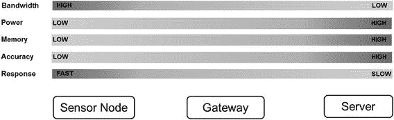
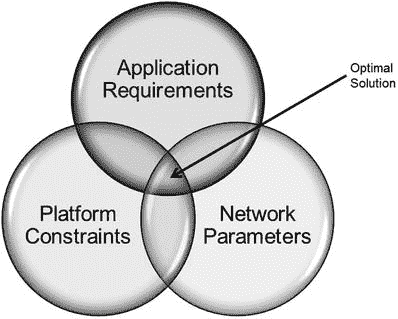
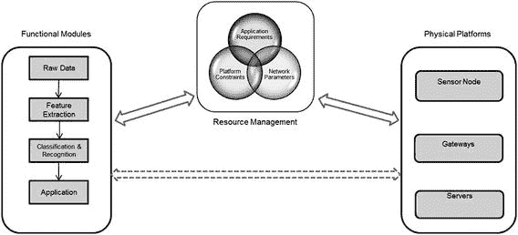

# 5. 资源共享约束

在流水线的每个阶段，像处理、功耗、内存、网络等物理资源通常在不同的应用之间共享。共享资源使得设计者为预定义性能构建架构变得非常复杂。存在一些方案可以保证最低级别的性能和资源份额（服务质量）来帮助应对这些情况，但这些方案通常需要付出成本。我们将在后续章节中对此进行更多讨论。图 1-11 展示了当我们从前端传感器移动到后端服务器时，资源可用性的变化。图中，`低`和`高`指的是资源可用性（带宽、功耗和内存）或计算特性（预期的准确性）。

图 1-11. 平衡各项约束

图 1-10. 执行流水线约束

总之，系统设计者必须根据上述性能约束，将端到端的能力模块高效地映射到可用硬件上。图 1-12 中的资源管理器需要基于上述所有约束，找到执行的“最佳平衡点”。

图 1-12. 在约束下设计系统

