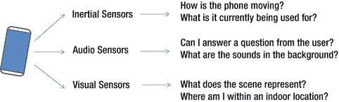
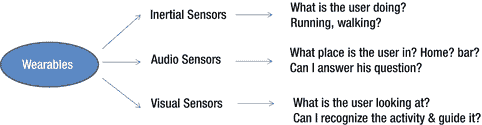
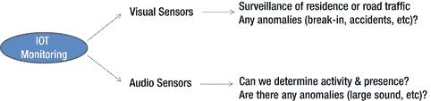
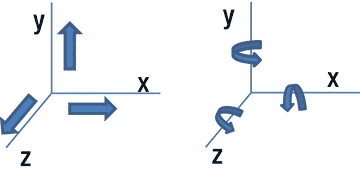
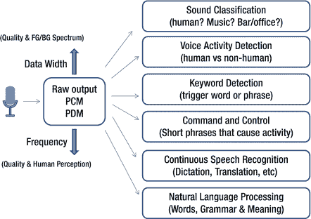

# 2. 从数据到识别

数字世界中的识别过程始于捕获物理世界原始数据的传感器。在本节中，我们将重点介绍三种类型的传感器（惯性、音频和视觉），以了解它们的使用方式，以及如何识别这些类型传感器的数据用于不同目的。让我们从几个在移动、可穿戴和物联网部署中的不同使用场景开始。

**移动设备**：如今的移动设备拥有许多传感器，用于理解用户情境和行为，并实现个性化交互。图 2-1 展示了移动设备中一些示例传感器及其提供的数据类型。惯性传感器能够理解手机在不同轴上的运动，包括加速度、旋转等。音频传感器使手机能够听到声音，例如用户的提问。视觉传感器使手机能够捕捉图片和视频，这可能有助于更好地理解位置或附近物体。

*图 2-1. 手机传感器使用示例*

还应注意，这些传感器的组合可以提供多模态识别，提供更丰富的情境数据。例如，结合音频和视觉传感器可以更好地理解场景中的活动。使用视觉传感器，可以看到场景中有一个孩子和一个大人，这可能表明大人在教孩子。向情境中添加音频感知则提供了额外的信息，例如活动是唱歌而不是说话。

**可穿戴设备**：与移动设备非常相似，可穿戴设备也使用类似的传感器，但现在能够确定用户的运动以及音频/视觉焦点和交互，可能从第一人称视角（例如头戴式设备）。图 2-2 展示了此类可穿戴传感器的用途类型。

*图 2-2. 可穿戴设备传感器使用示例*

**物联网设备**：虽然物联网设备中可能使用类似的传感器，但物联网设备的一个关键区别在于，它们通常着眼于一个场景和集体，而不是侧重于从用户角度出发的个性化场景。例如，IP 摄像头用于监控住宅（家庭）以及道路交叉口和交通。在这里，摄像头通常是静态的或仅在有限范围内移动，因此重点在于音频/视觉传感器的使用，而非惯性传感器。视觉传感器提供了理解场景变化以及识别附近车辆或人数量的能力。音频传感器通过提供诸如声音中的重大异常（例如道路上的事故或家中的窗户被闯入）等信息来补充额外信息。图 2-3 说明了这种用途。

*图 2-3. 物联网传感器使用示例*

再次强调，在这些情况下，使用多模态（音频+视觉）识别也大有裨益，因为我们可以通过同时关联声音和视觉线索来推断事故和入室行窃。

本章其余部分组织如下。我们将首先更详细地研究传感器类型，然后深入探讨每种传感器模态及其相关用途的识别技术。

## 2.1 传感器类型与识别层级

如上所述，传感器有多种类型，从惯性传感器到接近/位置传感器，再到音频/视觉传感器。在本节中，我们将介绍这三种传感器（惯性、音频和视觉），并描述它们的大致工作原理。

### 2.1.1 惯性测量单元

`accelerometer` (加速度计) 是理解惯性测量的最佳起点。加速度计本质上测量的是沿每个轴的作用力（即本征加速度）。通常，这类设备被称为三轴加速度计，因为它们提供沿 `x`、`y` 和 `z` 轴的作用力。`gyroscope` (陀螺仪) 通过测量绕给定轴的旋转来帮助确定方向。图 2-4 展示了加速度计和陀螺仪数据捕获的示意图。两者结合可以提供加速度和方向信息，因此可能被称为六轴传感器。根据使用模式，这些传感器的数据通常以从几 `Hz` 到` KHz` 的速率捕获。来自加速度计/陀螺仪的原始数据通常带有噪声，因此通常使用滤波器来确保基于多个数据点对这些数据进行平滑处理。此类传感器可应用于多种用例，示例如下：
*   对位置/方向的理解帮助当今的手机在竖屏或横屏模式下根据需要重新定向屏幕以及反向旋转。
*   这些传感器还可以通过缓冲连续数据并观察力和方向的变化来识别简单的手势。这些手势可以像沿特定轴的“摇动”、“翻转”或“画圆”运动一样简单。
*   传感器也用于导航目的，但它们是相对的，因为它们提供给定方向上的力，但不提供任何场域中的绝对位置。通常，这种方法被称为航位推算，并且需要其他传感器信息来确保不会由于嘈杂的传感器数据而导致相对定位随时间产生显著漂移。

图 2-4. 加速度计、陀螺仪和 IMU 简介

### 2.1.2 音频传感器

大多数设备中使用的典型音频传感器是标准麦克风。麦克风将声音转换为电信号，广泛应用于从典型的公共广播系统到电影、笔记本电脑、手机、可穿戴设备和物联网设备等众多应用中。在本节中，我们主要关注用于物联网和可穿戴应用的低端设备中的麦克风。这些设备中使用的大多数麦克风都是 MEMS（微机电系统）传感器，并且可能是模拟或数字的。麦克风的输出通常是脉冲密度调制（PDM）或脉冲编码调制（PCM），数据从 4 位到 64 位捕获，并且可以根据信噪比和捕获质量进行调优。麦克风的典型频率响应范围从 `20Hz` 到 `20KHz`。为了提高录音和识别的质量，例如，在手机中有时会使用两个或三个麦克风。这允许处理来自每个麦克风的数据并降低噪声，以提供更高质量的输出（例如，通话时的人声清晰度）。

音频传感器不仅用于捕获和记录内容，还用于音频分类和语音识别（见图 2-5）。以下是手机、可穿戴设备和物联网系统中使用单个或多个麦克风的一些主要应用场景：
*   **音频分类**：麦克风在物联网中的一个常见用例是对捕获声音的环境进行分类。例如，定期从厨房的麦克风捕获音频可以提供有关当前活动类型的信息——空闲、洗碗、水槽流水、烹饪等。研究人员正在使用诸如此类的机器听觉技术，甚至可以区分背景中的不同噪音。例如，从手机捕获的音频不仅可以提供前景人声的信息，还可以提供背景中正在发生的事情的信息。
*   **语音活动检测**：另一个常见用例是语音活动检测。这里重点在于尝试确定捕获的音频中是否存在语音。当手机或其他设备完全关机，只有麦克风以低速率捕获音频时，这非常有用。一旦音频中出现语音活动，音频子系统就会启动并执行更多处理（如下所述）。
*   **说话人识别**：说话人识别，有时也称为声纹识别，试图确定谁在说话。这对于识别音频转录中的说话人或将说话人识别作为身份验证方法的一部分很有用。当用作身份验证方法的一部分时，区分说话人识别（从多个说话人中识别出某一个）和说话人验证（确定之前已捕获其签名的特定说话人是否说话）非常重要。
*   **关键词识别**：关键词识别可能是最简单的语音识别形式，其重点是确定是否说出了某个特定单词。关键词识别可以是依赖说话人的（为特定说话人训练）或不依赖说话人的（普遍适用于所有人）。关键词识别也可以推广到关键短语识别，这两者通常用作启动额外活动的触发器，例如开始一个命令会话或启动一个应用程序。
*   **命令与控制**：命令与控制是指在语音识别中使用一小部分短语。举例来说，这可能包括一组控制玩具车的命令，例如“向前移动”、“向后移动”、“加速”、“减速”、“右转/左转”等。
*   **大词汇量连续语音识别（LVCSR）**：LVCSR 和一般的 CSR 指的是语音在被输入到语音识别系统时进行的连续识别。这通常涉及要识别的中等到大的词汇量。在上述所有问题中，这是最具挑战性和计算最复杂的语音识别问题，而该领域最近取得了许多进展，得以降低错误率并改善通用性。

图 2-5. 音频传感器和识别能力示例

在上述技术的基础上，读者可能感兴趣的更有趣的应用和功能是自然语言处理和语言翻译功能。这些功能现在正出现在不同的市场解决方案中。

### 2.1.3 视觉传感器

最常见的视觉传感器是摄像头。摄像头很好理解，因为它们长期以来一直用于摄影目的。在本书中，我们重点关注其作为视觉传感器的作用，用于识别设备可以自动看到、理解并据此采取行动的内容。

与惯性和音频数据不同，视觉数据为数据引入了空间维度，因为它本质上可以是 2D 或 3D 的。摄像头可用于即时 2D 捕获（静止图像），不包含任何时间信息；或者作为视频捕获的一部分，包含随时间捕获多个帧的丰富时间数据。通常，数据可以从极低保真度（例如，QVGA，即 `320x240` 的静止图像或每秒几帧）捕获到高保真度（例如，每秒 30 帧或更高的高清和 4K 分辨率）。捕获速率取决于使用模式，需要考虑人类消费（例如回放）是否是关键要求，或者是否仅需机器识别某些视觉方面即可。

视觉识别可用于许多不同的目的，范围从物体识别、人脸识别和场景识别，到相似性/异常检测、理解运动或尺度，以及视频摘要。图 2-6 提供了其中一些示例，并列举如下以供说明：

