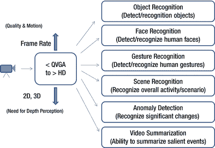

# 视觉识别技术

## 物体识别
物体识别指的是识别图像中物体的基本概念，并可能将其与先前捕获的预存物体数据库进行匹配。例如，增强现实应用可以识别图像中的纪念碑或旅游景点，并向观看者提供关于该物体的附加信息。同样地，零售商店中的物体可以被识别，并向用户提供关于健康、价格和成分的附加信息。

## 人脸识别
人脸识别包括检测图像中的人脸，以及将该人脸与数据库进行匹配以相应地标记人脸。人脸检测本身对数码摄影很有用，可以帮助用户拍出更好的照片。人脸识别具有诸多用途，从身份验证（登录平台）到社交网络应用（如 Facebook）等。

## 手势识别
手势识别指的是识别特定的静态姿势或动态手势，这些姿势或手势可以是手部/手臂的，也可以是整个人体的。现代游戏主机通常使用此类示例，玩家用其双手和整个身体与游戏互动。静态姿势比动态手势更容易识别，因为它通常涉及处理静态图像并将其与预先捕获的静态手势集进行匹配。手势识别也可以是用户相关的或用户无关的，前者需要系统针对特定用户进行训练，而后者则构建了足够的模型以适应任意用户。

## 场景识别
场景识别是一个极其复杂的、持续研究中的问题。最简单的场景识别形式是获取整个场景并将其与已知场景进行匹配。中等形式的场景识别涉及识别图像中的多个物体、人脸和人物，并利用这些信息来确定可能的活动或上下文。更复杂的场景识别形式要求系统尽管在两个场景中存在相似的物体，也能准确地区分它们。

## 相似性/异常检测
异常检测是视觉识别中的一个常见挑战，尤其是在使用摄像头进行监控的场景中，包括家庭监控和交通监控。在此，关键是识别是否发生了任何应触发进一步分析的异常。此类解决方案侧重于静态或动态地识别一组已知的特征（签名），从而确定画面中是否发生了任何显著变化。

## 视频摘要
视频摘要是一种元应用，它可以使用上述多种技术来总结长视频流中的显著方面。这包括场景变化、关键场景以及作为视频焦点的物体/角色。视频摘要使用户能够跳转到视频的特定部分，或快速识别在一组现有视频中正在寻找哪个视频。

**图 2-6.** 视觉传感器及其用途

还应注意，惯性、音频和视频传感器及识别技术可以结合使用以实现多模态识别。在下面的描述中，我们将首先分别研究每种独立的识别技术，然后展示将它们结合使用的示例。

