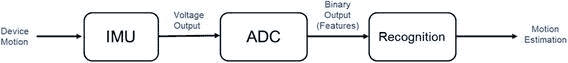

# 2.2 惯性传感器处理

本节简要概述了传感器如何用于测量设备运动和倾斜。如前所述，惯性传感器也可用于识别某些手势。我们将专注于惯性传感器。具体来说，目标是提供对 MEMS（微机电系统）的高层功能概述。我们不会深入探讨这些传感系统的构造细节，而是将重点放在数据理解部分。

设备运动可以通过两种基本方式进行测量：

**通过外部设备观测测量运动：** 设备外部的摄像头可以观察并映射设备行为。

- **优点：** 在受控环境中非常有用，可用于测量大致通用的物体的运动。
- **缺点：** 只能在限定区域内工作，依赖光照条件等。

**通过设备内部仪表测量运动：** 这涉及使用板载传感器对设备进行仪表化，从设备自身测量运动。

- **优点：** 几乎可以普遍测量精细运动和倾斜。
- **缺点：** 需要对每个设备进行仪表化。

我们将以上述第二种情况作为本节示例。做出这一选择主要有两个原因。首先，基于板载传感器的方法在从可穿戴设备、玩具、智能手机到飞机等各种设备中普遍存在。其次，本章已经详细介绍了视觉识别和处理。因此，我们将用这一部分来介绍一种新型传感器及其处理流程。

## 2.2.1 定义运动与自由度

在理解惯性传感器的处理流程之前，我们先定义设备可用的自由度（DOF）。我们定义如下两类共 6 个自由度：

- **平移自由度：** 存在 3 个这样的自由度，即设备可以前后移动、左右移动或上下移动。
- **旋转自由度：** 存在 3 个这样的自由度，即俯仰、横滚和偏航。

图 2-4 以图形方式展示了这些自由度。

惯性测量单元（IMU）包含以下两种常见的运动测量设备：

**加速度计：** 加速度计是一种“理应”测量加速度的设备。实际上，该设备会对惯性力作出反应。惯性传感器的主要用途是测量相对于地球“平面”的平移加速度和倾斜度。

**陀螺仪：** 陀螺仪主要用于测量沿某个轴的运动。这包括图 2-4 中的俯仰、横滚和偏航运动。该运动被测量为沿某轴角度的“变化率”。

通常，为了将 IMU 与设备的其余系统连接，会使用模数转换器（ADC）将产生的电压转换为位模式（数字）。这个数字给出了运动或倾斜度（沿一个或多个轴）的度量。图 2-7 展示了 IMU 处理流程的简化视图。

**图 2-7.** 识别 IMU 数据

