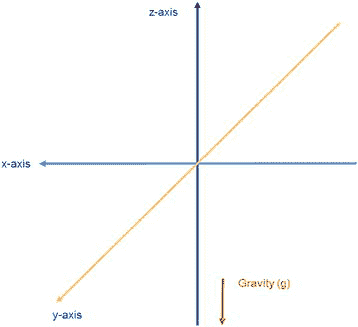
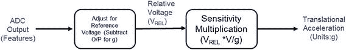
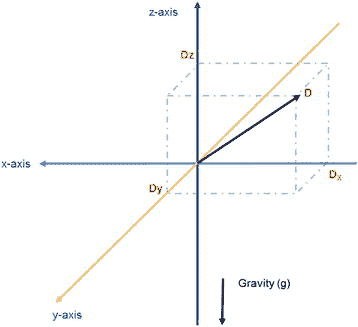

# 加速度计

加速度计检测的是与实际加速度矢量方向相反的力。这个力也被称为虚拟力或惯性力。加速度计唯一不会感受到任何被测力的地方是在太空中或自由落体过程中。因此，获取加速度计的“静止力”或“静止测量值”非常重要。这个力等于设备始终承受的重力。通常，为了提取设备相对于其在地球上位置的真实加速度，每次测量的力都需要对重力进行修正。

我们将通过聚焦于单轴加速度计设备来演示加速度计的工作原理。假设加速度计沿 z 轴测量力。模拟加速度计将惯性力测量为设备输出电压的变化。通常，为了将加速度计与设备系统的其余部分连接，会使用模数转换器（ADC）将产生的电压转换为比特模式（数字）。这个数字给出了在给定方向（沿某一轴）上的惯性力测量值。以下定义有助于理解加速度计的行为：

-   **参考电压/ADC 读数**：这是如上所述的静止力测量值。恒定的重力可能导致测量值出现在不同的轴上，具体取决于 IMU 和设备的朝向，我们稍后会了解到。材料和设计缺陷也可能导致此类设备的静止读数出现非零值。当我们使用加速度计进行任何实际应用时，需要补偿这个测量值。
-   **灵敏度**：加速度计的灵敏度指的是每单位测量加速度对应的电压（或 ADC 输出）变化。许多系统使用重力加速度（g）作为加速度的单位。因此，灵敏度可以用伏/克（V/g）来衡量。

图 2-8. 加速度计线性加速度测量轴

基于上述定义，图 2-9 展示了沿单轴计算加速度的过程。为简化起见，我们假设垂直轴为测量轴，这样重力作用在同一轴上，并可以通过简单的减法来处理。我们稍后将看到如何处理更一般的情况。

图 2-9. 单轴加速度计操作

## 多轴加速度计

对于具有多轴测量能力的加速度计，设备可以测量沿每个定义轴的加速度。例如，一个三轴加速度计可以测量沿 x、y 和 z 轴的惯性力/加速度。重要的是要注意，设备测量的任何加速度都以 x、y 和 z 分量形式报告，如图 2-10 所示。在图 2-10 中，力（加速度）的方向和大小由矢量 D 表示。加速度计输出将报告沿 x、y 和 z 方向的分量大小，分别由投影 Dx、Dy 和 Dz 表示。要准确测量加速度的大小和方向，需要了解制造商定义的轴朝向。幸运的是，多轴加速度计的另一个特性在这种情况下对我们有所帮助。

图 2-10. 三轴加速度计操作

## 测量倾斜角度

多轴加速度计在静止状态下测量重力这一事实可用于校准加速度计。在静止状态下，加速度计测量设备相对于地面的倾斜角度。当一个轴完美垂直对齐时，测得的电压（或 ADC 值）的另外两个分量将为零。因此，将设备对齐到多个位置并从这些位置获取 ADC 读数，可以精确定位加速度计轴的确切朝向。

