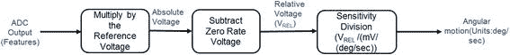

# 陀螺仪

加速度计测量平移加速度（上下、左右、前后）。设备在运动中还有另外 3 个自由度。这些与角运动相关。具体来说，它们被称为*俯仰*、*偏航*和*横滚*。这些如图 2-4 所示。陀螺仪以度/秒为单位测量绕 x、y 和 z 轴的角运动。用陀螺仪的语言来说，我们将每个自由度的测量称为一个*通道*。因此，一个三通道陀螺仪可以测量角运动的所有 3 个分量（*俯仰*、*横滚*和*偏航*）。

与上述加速度计的讨论类似，陀螺仪输出是经过 ADC 转换的模拟电压数字输出。电压变化与围绕给定轴的角度变化率呈线性关系。处理 ADC 输出后，陀螺仪读数通常以围绕特定轴的度/秒报告。与加速度计的讨论相似，我们定义以下内容：

-   **参考电压**：陀螺仪的参考电压指的是 ADC 的“步长”。简单来说，它定义了使 ADC 输出增加一个单位所需的电压量。
-   **零速率电压**：对于陀螺仪，这个电压是测量设备固有偏移的指标。理想情况下，静止状态的设备应在所有陀螺仪通道上报告为零读数。然而，材料和设计缺陷导致几乎所有这些设备都存在非零的静止读数。应从测量值中减去该读数，以获得正确的角运动测量值。
-   **灵敏度**：陀螺仪的灵敏度指的是每测量单位角速度变化对应的电压（或 ADC 输出）变化。陀螺仪灵敏度可以用毫伏/度/秒来衡量。

与加速度计的处理一致，陀螺仪传感器处理流程如图 2-11 所示。

图 2-11. 陀螺仪处理

