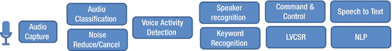
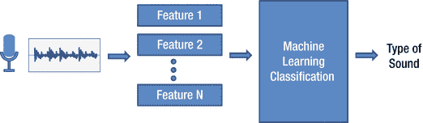
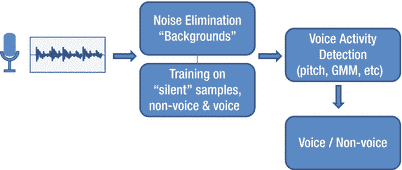
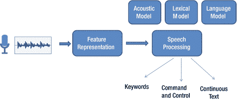
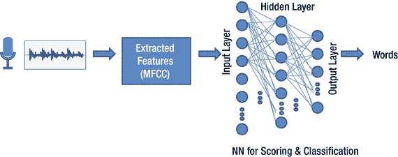
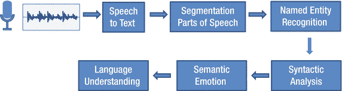

# 2.3 音频处理与识别——从声音到语音

正如前一节所述，随着越来越多的手机/可穿戴设备/物联网设备开始利用音频传感器（即麦克风）来捕获高质量的音频数据，基于音频传感器的识别技术正变得越来越普及。在本节中，我们将深入探讨音频识别的实现方式，涵盖从音频分类到大词汇量语音识别的各个方面。首先，图 2-12 展示了一个简单的音频与语音处理流程。

图 2-12. 音频/语音识别各阶段

让我们逐一梳理这些阶段，并研究其中使用的音频识别技术。在此之前，需要指出的是，处理音频进行识别的第一步是处理音频信号并提取关键特征。从音频中提取的最常见特征被称为`MFCCs`（梅尔频率倒谱系数）。计算`MFCCs`或其变体的方法有很多种。梅尔频率倒谱（`MFC`）代表了声音的功率谱，而系数（`MFCCs`）的计算过程是：首先对音频样本进行加窗处理，然后进行傅里叶变换，计算功率谱，映射到梅尔滤波器组，计算能量的对数，最后执行离散余弦变换以确定振幅。关于`MFCCs`的更多细节可在相关文献中找到（例如参考文献中由 K. Prahlad 等人撰写的文章）。

## 2.3.1 音频分类

我们首先介绍音频分类（见图 2-13），它主要关注非人类声音，试图理解并标记捕获到的声音。传统的音频分类方法是识别诸如`MFCCs`之类的关键特征，这些特征有助于将声音划分为不同类别，然后使用机器学习技术进行训练/分类。较新的技术尝试添加针对音频分类的额外特征，以提高准确性。其中一些技术可能特定于具体内容，但也有更通用的方法，例如参考文献中 Breebart 等人在《音频分类特征》一文中描述的，增加时间波动以及粗糙度/响度/尖锐度等特征。一旦确定了特征集，就可以使用标准的机器学习分类技术。标准分类技术包括最近邻算法、贝叶斯算法、高斯混合模型（`GMM`）等。近年来，神经网络被用于实现音频分类的有监督和无监督方法。

图 2-13. 音频分类示例

## 2.3.2 语音活动检测

语音活动检测（`VAD`）指的是在音频捕获中检测人类声音。图 2-14 展示了通用的`VAD`处理流程。`VAD`通常用作触发信号，以进入语音识别的下一阶段，例如关键词识别或命令/控制。文献和商业解决方案中存在多种不同类型的`VAD`实现。例如，使用简单滤波器（如基音识别）的方法，以及使用`GMM`（高斯混合模型）、统计模型和基于能量的`VAD`等更复杂的方法。`VAD`面临的主要挑战之一是音频捕获中的噪声水平。因此，降噪和噪声消除技术通常与`VAD`解决方案紧密结合。在参考文献中，Man-Wai Mak 等人指出，降噪和消除背景信号是提高`VAD`解决方案准确性的关键。最终，语音活动检测器可以用来减少语音识别所需的处理量，因为它起到过滤器的作用。因此，优化解决方案以减少假阴性（即存在人声时却指示无人声）至关重要，而不是减少假阳性（即无人声时却指示有人声）。

图 2-14. 语音活动检测示例

### 2.3.3 自动语音识别（ASR）

自动语音识别（Automatic Speech Recognition）或 `ASR` 是指计算机系统识别人类语音并将其转换为文本的能力。`ASR` 包含的能力范围从关键词识别（`KR`）、命令与控制（`CC`），到大词汇量连续语音识别（`LVCSR`）。`KR` 通常用作唤醒系统的触发词，而 `CC` 和 `LVCSR` 则作为会话的一部分，用于控制活动或听写用于邮件或其他目的的文本段落。虽然关键词识别可以以更定制化的方式实现，但 `KR`、`CC` 和 `LVCSR` 的通用技术可能相似，主要区别在于词汇量和语法理解的大小。图 2-15 展示了通用的语音识别处理流程。语音识别可以独立于说话者实现，即任何说话者都能与系统交互；也可以依赖于特定说话者，即系统根据特定用户或用户群进行训练。用于学习和探索的常见语音识别器或工具包包括 CMU Sphinx（ [`http://cmusphinx.sourceforge.net/`](http://cmusphinx.sourceforge.net/) ）和 Kaldi（ [`http://kaldi-asr.org/`](http://kaldi-asr.org/) ）。针对特定目标（如移动设备）的定制版本包括 PocketSphinx（ [`http://www.speech.cs.cmu.edu/pocketsphinx/`](http://www.speech.cs.cmu.edu/pocketsphinx/) ）。

图 2-15. 自动语音识别

传统的语音识别方法基于使用 `GMM`（高斯混合模型）和 `HMM`（隐马尔可夫模型）。要解决的核心问题是，根据输入的声学观测序列找出最可能的词序列。例如，语音识别的早期实现采用了以下关键处理阶段：

*   **特征提取**：输入的语音信号被分割成每段 10 毫秒的帧。每个 10 毫秒样本由一个包含 39 个分量的特征向量表示。
*   **GMM 评分**：为了确定语音中的 senones 并找到最佳匹配，对提供的特征向量执行 `GMM` 评分。
*   **HMM 处理**：语音模型需要 `HMM` 处理，以根据提供的词汇（词汇模型和语言模型）确定最可能的音素和词序列。

直到最近，大多数（`LVCSR`）语音识别器都基于 `GMM` + `HMM` 方法。然而，语音识别器的性能不足以实现高质量的大规模采用。语音识别器的性能指标包括词错误率、速度和整体准确率。为了解决这些问题，最近的语音识别器开始探索使用加权有限状态转换器（`WFST`）和深度学习（神经网络）进行语音识别。

神经网络在语音和视觉处理中的重要性日益增长。深度神经网络本质上是输入层和输出层之间有许多隐藏层的人工神经网络。`DNN` 取代了语音识别流程中 `GMM` 的使用（见图 2-16），将其从 `GMM` + `HMM` 解决方案转变为 `DNN` + `HMM` 解决方案。如今，大多数商用语音识别产品都基于深度神经网络，因为它提高了系统的词错误率和整体准确率。

图 2-16. 在 ASR 中使用深度神经网络

加权有限状态转换器用于表示 `HMM`，同时提供可以加速处理过程的附加信息，因为有向图中的每条边都标有输入、输出和权重。因此，`WFST` 是一个丰富的数学框架，在自然语言处理中的应用也超出了 `HMM` 的范畴。

### 2.3.4 自然语言处理（NLP）

`NLP` 涉及获取来自语音转文本解决方案或书面文本，并尝试以自动化方式提取信息或更深入地理解文本。`NLP` 的第一步是通过理解句子结构和识别词边界来对文本进行分词。另一个重要步骤是使用命名实体识别（`NER`），在适当的情况下将特定词语归类到更通用的类别中。图 2-17 展示了一个 `NLP` 基本流程的示例。在此过程中，单个词语也可以根据所完成的 `NLP` 分析类型被赋予相应的权重。

图 2-17. 自然语言处理示例

一旦这些初始处理阶段完成，就会应用机器学习技术来分析文本的关键方面。例如，可以通过分析文本中的词语来确定文本的情感（正面、负面等）。可以通过将文本中的词语与最可能的主题关联起来进行分类，从而识别文本的主题。还可以确定文本中提出问题的性质，用于诸如 `Siri` 和 `Cortana` 所针对的使用模式。

在上述章节中，我们介绍了音频/语音识别的关键方面，范围从音频分类、语音活动检测，到自动语音识别，再到自然语言处理。我们希望每个领域的概述能让您理解主要用途、使用的关键组件或算法，以及在开发此类技术时的注意事项。虽然我们没有深入探讨算法本身，但读者应该能够根据感兴趣的使用模式和练习的重点来确定哪些算法需要进一步研究。

