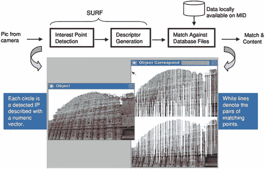
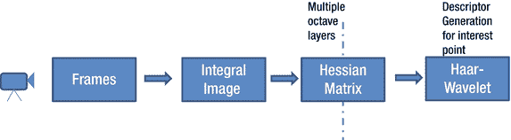
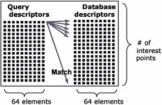
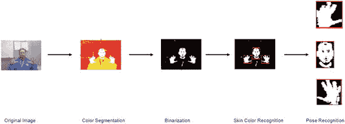
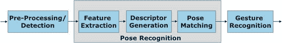
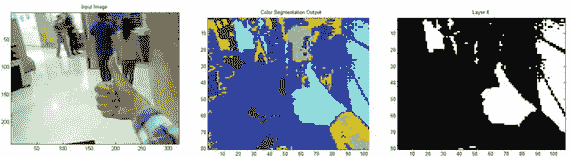
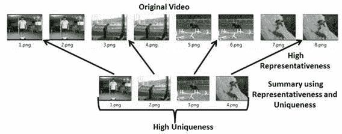
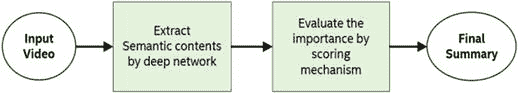

# 2.4 视觉处理与识别

视觉识别始于能够捕捉静态图像和视频的基本摄像头传感器。如前所述，视觉识别可以包括物体识别、手势识别、人脸识别、场景识别、异常检测和视频摘要。通常，视觉识别遵循以下基本过程：特征提取、描述符生成和匹配。从图像中提取特征，然后将其总结为一个描述符向量，接着与预先存在的向量数据库进行比较，以进行相关的识别。我们将针对上述每种识别类别，通过一些示例来描述此过程。

## 物体识别

物体识别指的是在图像或视频中检测并识别物体的能力。物体识别的实例范围广泛，从识别图像中的一盒麦片或一瓶葡萄酒，到在旅游景点识别一座历史古迹。其整体用途可以是统计零售货架上物品的数量（麦片盒或葡萄酒瓶），或是为正在用手机摄像头指向古迹的游客提供更多信息（增强现实）。虽然下文将从一个物体的角度描述典型的物体识别流程，但请注意，同样的原理也适用于识别多个物体，为此会包含聚类和边界框技术。

图 2-18（参考 S. Lee 等人的著作）展示了一个典型的物体识别流程，用于在查询图像中识别物体，并通过与数据库图像匹配进行识别。基本流程包括：(a) 特征检测（也称为兴趣点检测），(b) 描述符生成，以及 (c) 匹配。

图 2-18. 物体识别流程示例（S. Lee 等人）

多年来，针对物体识别已经开发并优化了许多算法。这些算法包括 `SURF`（加速鲁棒特征，参考 H. Bay 等人）、`SIFT`（尺度不变特征变换，参考 D. G. Lowe 等人）、`ORB`（参考 E. Rublee 等人）、`FAST`（参考 E. Rosten 等人）、`BRIEF`（参考 M. Calonder 等人）以及 `BRISK`（参考 S. Leutenegger 等人），仅举几例。这些算法提供了在图像中识别出能唯一描述物体的特征点的能力，以及生成描述符的方法，用于描述特征点周围的区域作为描述符向量的一部分。最初，算法是为了基本功能和准确性而设计的。然而，随着集成摄像头的移动设备普及，这些算法针对降低计算复杂度、提高速度、尺度不变性、旋转不变性和抗噪性进行了优化。建议读者参阅描述每种算法的论文以更深入地理解其细节。为了便于说明，图 2-19 展示了一个示例流程。

图 2-19. 物体识别流程（例如，SURF 组件 [参考 S. Lee 等人、H. Bay 等人的著作]）

一旦确定了特征/描述符，下一步就是通过匹配来识别物体。一个匹配数据库存储着先前捕获的描述符向量，将查询描述符向量与数据库进行匹配，即可获得最近似的匹配结果或一系列匹配结果作为输出。通常，这种匹配通过暴力匹配（计算 `L1`、`L2` 距离）来完成，如图 2-20 所示。除了暴力匹配，`ANN`（近似最近邻）方法也极为常见，尤其是在数据库规模显著增大时。有一些用于 `ANN` 计算的快速库，例如 `FLANN`（ [`http://www.cs.ubc.ca/research/flann/`](http://www.cs.ubc.ca/research/flann/) ），它们通常用于以最高速度和效率执行这些计算。

图 2-20. 使用 `L1`/`L2` 距离计算的暴力匹配（S. Lee 等人）

## 手势识别

手势识别指的是识别手部姿态、动态手势或类似的躯体姿态及动态身体动作的能力。最近，由于 Kinect（ [`http://www.xbox.com/en-US/xbox-one/accessories/kinect`](http://www.xbox.com/en-US/xbox-one/accessories/kinect) ）在诸如微软® Xbox（ [`http://www.xbox.com/en-US/`](http://www.xbox.com/en-US/) ）等游戏机中的广泛应用，手势变得更为普及。图 2-21 展示了使用基于肤色的分割方法识别手部姿态和面部特征的步骤。在本节中，我们将从描述基本的手部姿态识别过程开始。手部姿态识别最简单的形式是识别图像中是否存在手（检测），然后识别具体的手部姿态（识别）。

图 2-21. 手势识别示例

手部检测通常通过两种不同的机制完成：(a) 手部肤色，以及 (b) 描述典型手部形状的模型。有许多算法会分析图像中的不同颜色，试图判断图像中是否有手，从而分割图像的那一部分以进行进一步的识别处理。进行肤色分析时常用的色彩空间包括 `RGB`、`HSV`、`YUV` 和 `YCrCv`。有时也会采用考虑多种色彩空间的混合方法。基于颜色进行手部识别的关键挑战在于图像背景的性质。有时背景颜色可能与肤色相似。使用肤色的另一个关键挑战是，人类的肤色因人而异。因此，使该方法对用户无关也颇具挑战性。解决此问题的一个可能方案是让解决方案依赖特定用户，但这会带来一个要求，即用户需要通过注册过程来训练系统。大多数解决方案倾向于尽可能减少注册/用户训练的需求。

图 2-22 显示了一个使用肤色分析进行手部分割的示例。如图所示，最终结果基于两个步骤：肤色分割，以及与已知的手势模型（也称为手势词汇表）进行比较。在这种情况下，手势词汇表相对容易创建，因为它只涉及二维静态手势。随着动态手势的引入，以及需要追踪运动方向和深度信息，解决方案的复杂性也会增加。例如，Kinect 在其实现中使用了两个摄像头和一个红外传感器，用于在三维环境中识别手部和身体姿态。

图 2-22. 手部姿态检测与识别流程

### 2.4.3 视频摘要

视频摘要指的是分析完整视频并对其进行总结的能力，其方式可以是 (a) 用少量帧或视频片段提取视频的关键片段，或 (b) 通过识别视频中的一系列活动来创建简短的视频文字记录。其应用范围可以涵盖视频监控，其中异常情况是视频中的关键场景，或者事件摘要，例如识别足球比赛中的关键部分（如进球或主要进攻尝试）。在本节中，我们将重点关注前者，并描述用于识别视频关键部分以及对活动进行潜在分类的方法。

关于如何识别关键帧，文献中有多种方法。一个简单的思路是找出视频中哪些帧最能代表视频中的场景，同时识别出足够数量且彼此独特的帧。许多方法依赖于颜色、运动或其他低级特征检测器。还有一些方法侧重于边界检测，即帧之间的显著变化表明可能的关键事件。利用这些技术，可以识别视频中的关键帧，但根据帧之间的差异或相似程度，这些帧可能太多或太少。

最近的研究工作集中在结合使用多样性和覆盖度指标，来决定如何在视频中以有限数量的帧结束，这些帧既能保证充分的覆盖度，又能保证彼此间充分的多样性。S. Chakraborty 等人提出的一种方法，通过自适应地确定摘要长度以及在该摘要中选择哪些帧，试图做得更好。在这篇论文中，作者提出了一种自适应摘要技术，将该问题表述为一个优化问题，即选择一组能代表视频的充分独特的帧。该优化问题将代表性和独特性作为两个关键指标，并试图最大化这两个指标，以自适应方式识别关键帧。图 2-23 说明了基本思想。他们将其与传统机制（如随机抽样、聚类和曲率点使用）进行了比较，并表明其更有效。

*图 2-23. 视频摘要示例（来自 S. Chakraborty 等人）*

最近的研究尝试通过采用卷积神经网络（CNN）来识别实体（多个物体、位置、人物和活动），并根据这些实体的共现情况以及与重要性分类场景类型的关系对其进行评分，从而考虑视频的语义上下文。研究表明，这种方法具有巨大潜力，因为它在语义上更有意义且更有效。这种视频摘要技术的一个示例流程如图 2-24 所示。

*图 2-24. 使用深度网络的视频摘要示例*

总的来说，基于视觉信息的视频摘要是一个相当具有挑战性的重要问题，而现有文献在提供一套合适的摘要方案方面才刚刚起步。我们建议读者参考本章参考文献部分中的论文，以便更好地理解该领域的技术及其应用场景。

## 2.5 其他传感器

还有大量传感器超出了上述更详细讨论的范畴。以下是这些传感器及其潜在用途的总结。

### 2.5.1 接近传感器

接近传感器无需接触物体即可检测附近物体的存在。通常，接近传感器是基于红外（IR）的，通过感知红外场的变化来工作。接近传感器的一个使用示例是在手机中，用于确定手机在通话时是否贴近耳朵，以避免在此期间的意外触摸。另一个例子是在机器人中使用接近传感器来确定它是否靠近障碍物，因此需要绕过它或调头。除了红外接近传感器，无线解决方案如 `BLE` 和 Wi-Fi 设备也可用于确定设备是否在信标或接入点的接近范围内。由于这也与位置相关，将在下一节中更详细地讨论。

### 2.5.2 位置传感器

位置传感器有助于确定设备的地理位置。最常见的位置传感器是 GPS（全球定位系统）传感器，它在汽车和手机内的导航系统中非常频繁地使用。`GPS` 系统与绕地球运行的卫星通信，并使用三边测量法来确定包含 GPS 接收器的设备的位置。这对于室外定位非常有用，但不适用于室内定位。对于室内定位，可以使用类似的基于无线电的方法，但使用 Wi-Fi 接入点作为三角测量点，或者使用越来越流行的 `BLE` 信标。

### 2.5.3 触摸传感器

如今，触摸传感器在所有可穿戴手表、手机和平板电脑中都很常见，甚至现在也出现在笔记本电脑屏幕上。触摸屏的用途是允许用户用手指而不是鼠标与屏幕进行交互。使用手指使体验更加容易和直观。触摸屏可以是电阻式或电容式的——前者（电阻式）利用多层之间的电阻和手指作为识别触摸的方式，而后者（电容式）利用手指和屏幕之间的电流流动作为确定触摸的方式。最近的研究通过将按压力度（手指按压的力度）作为另一个关键输入融入到体验中，进一步提高了触摸屏的分辨率。

### 2.5.4 磁性传感器

磁场传感器或磁力计根据所使用的传感器类型，以不同的灵敏度水平检测和测量磁场。一种常见的磁力计是霍尔效应传感器，它根据磁场强度改变其输出电压。霍尔传感器可用于工业应用中，以感知磁性物体的存在以及测量它们到达/离开的时间。

### 2.5.5 化学和生物传感器

传感领域一个不断增长的方向是使用化学和生物传感器。化学传感器用于感知气体或液体的成分。这些传感器对于分析工业环境中的空气质量和气体存在非常有用。生物传感针对细胞、蛋白质、核酸等的存在。例如，这可用于分析皮肤状况。化学和生物传感的使用在环境、工业、健康和保健应用方面正变得极具吸引力。

## 2.6 总结

在本章中，我们回顾了三种类型的传感器（`IMU`、音频和视觉），并逐步介绍了处理原始传感器数据并将其转换为可识别信息的处理阶段。在此过程中，我们讨论了处理中涉及的关键组件以及用于权衡精度和计算复杂性的许多算法。例如，我们展示了视觉处理和识别范围从简单 2D 图像中的物体识别到跨多个帧的视频摘要。在下一章中，我们将讨论如何将这些传感器一起用于多模态处理，以及如何将识别出的信息转化为可操作的知识。

