# 3. 多模态识别

在上一章中，我们介绍了独立处理每种原始传感器数据以实现不同级别识别能力的方法。我们发现惯性传感器能提供关于不同轴向运动的信息。音频流不仅可以处理声音类型，还能处理词语和自然语言。我们还展示了如何识别不同的物体、人脸、活动等。现在，我们设想一下，如果能够同时关联多种传感器类型的理解结果，将会实现哪些可能性。这被称为“多模态识别”，本章将探讨实现多模态识别的不同方法。

## 3.1 为何采用多模态

图 3-1 以相同的三种传感器类型（惯性、音频和视觉）为例，介绍了多模态识别的好处。

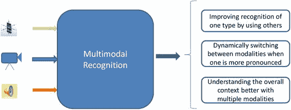

图 3-1. 多模态识别简介

多模态识别的好处首先体现在能够通过利用其他模态（如视觉）来辅助提升某一种模态（如声音）的识别能力。当识别能力受损、需要澄清或需要提升效率时，这种方法尤为有效。例如，当你听到“把它关掉”时，要理解“它”指代什么，就必须利用视觉识别来确定用户正在指向什么。在这种情况下，视觉识别提供了澄清，将模糊的指代“它”精确到风扇或灯等具体物品。除此之外，还可以利用一种模态来提高另一种模态的处理效率。我们来看一个零售场景的例子：用户需要某种特定产品的帮助。如果他或她已经站在货架前，只需要查询某个商品的价格，那么通过将查询词汇表缩减至仅包含与该场景相关的指令，就能轻松降低语音处理的复杂度。这是通过利用视觉线索判断用户所在位置，并确定他或她正在注视的产品类型来实现的。本章后面将使用这类例子来理解实现这一功能所需的多模态识别类型。

多模态识别的另一个好处是能够根据哪种模态更有效，动态地使用多种模态。例如，在处理（足球比赛）视频以生成摘要时，有些部分在视觉上很吸引人（某位球星的大力射门），有些部分则声音丰富（如评论员宣布进球及观众掌声）。两种模态都可以用来更好地理解每个感兴趣的视频片段。通过先独立处理音频和视频识别模态，再关联感兴趣的事件，就可以轻松实现这一点。或者，如果愿意关联球员（通过视觉识别）与其姓名（基于评论员音频的语音识别），则可以实现更细粒度的识别。

需要注意的是，作为人类，我们能够非常自然地处理这些模态，并在它们之间进行交叉关联以确定上下文。根据使用场景和上下文的不同，我们往往能在不同粒度级别上实现这一点。例如，我们可以在公园里骑自行车时处理声音、运动和视觉输入。挑战在于让计算设备也能达到同样的识别水平和效率，即根据需要在不同识别粒度以及不同模态之间的不同耦合级别之间动态切换。这是一个难题，但如下文所述，如果我们能单独分类每种多模态识别类型，并理解其优势和使用场景，就可以解决这个问题。

## 3.2 多模态的类型

在本节中，我们将介绍用于设计传感器融合解决方案的不同方法和框架。我们主要涵盖以下三种广泛使用的方法：基于耦合的分类、达萨拉蒂模型和传感器配置模型。

### 3.2.1 基于耦合程度的分类

来自多个传感器源的信息可以在识别链的不同阶段进行组合。为简单起见，我们考虑两个传感器处理管道，如图 3-2 所示。在图 3-2 中，两条处理管道相互独立运行。传感器融合可能发生在每条管道上的具体位置取决于多种因素，包括实现复杂度和识别任务所需的精度。我们定义了传感器数据融合的三个主要层次。

- **非耦合传感器数据融合 / 语义融合**：该定义指数据融合发生在各自管道中尽可能晚的阶段。这通常意味着在识别完成之后进行集成，如图 3-3 所示。这种方法的优点是传感器融合简单，并且可以使用现有的识别技术管道来完成。领域专家喜欢这种方法，因为跨领域技术知识的需求极低。通常很难找到能掌握多个传感器领域的技术专家。对于语义融合方法，领域专家可以独立工作，应用开发者可以在更高层次上集成各种模态。

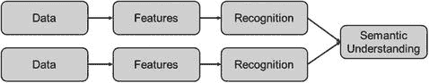

图 3-3. 非耦合融合

- **松耦合传感器数据融合 / 受限识别**：为了获得优于非耦合传感器融合的性能，专家采用一种模式，根据一个模态的结果来限制另一个模态的识别搜索空间。在这种方法中，一个识别管道帮助为另一个管道设定上下文。一旦完成，第二个识别管道只需在已建立的上下文边界内进行识别，从而可能节省计算资源并提高性能。图 3-4 说明了这一点。与语义传感器融合的情况类似，跨领域专业知识的需求极低，但开发者确实需要理解模态之间在识别上的语义依赖关系。

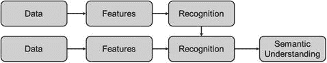

图 3-4. 松耦合融合

- **紧耦合传感器数据融合 / 数据-特征级融合**：这种对性能最友好的传感器融合模型允许多个传感器进行虚拟组合，使得对于大部分应用堆栈而言，组合后的传感器看起来就像一个单一的复杂传感器。如图 3-5 所示，传感器集成的方法包括组合来自传感器的原始数据并使用单一数据流进行处理。更实用的方法则是组合来自传感器的特征，以产生用于识别和过滤的单一特征集。虽然紧集成能为传感器融合应用带来最大的性能提升，但由于需要多领域专家共同处理数据集成，这种方法并不十分流行。在堆栈较低层级的数据表示非常依赖于特定传感器，因此需要专家做出明智的决策来合并来自多个数据源的数据。每个传感器模型在最低层都有不同的数据表示格式，这使得很难提出一种既能保留信息内容又能保持同质化的表示方式。

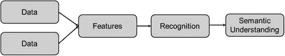

图 3-5. 紧耦合融合

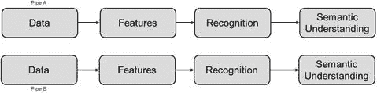

图 3-2. 两条传感器处理管道

### 3.2.2 Dasarathy 模型

Dasarathy 提出了一种优雅的模型来表示不同层次的数据融合（原论文信息请参见本章末尾的参考文献）。该模型将不同的数据融合方法表示为输入和输出数据类型的函数，从而产生了以下不同类型的融合。

- **数据输入-数据输出 (DAI-DAO)**：`DAI-DAO` 模型代表低级融合，即将来自多个传感器的传感器数据融合在一起，为后续的识别管道生成一个融合后的数据表示。生成的数据格式可以与输入相同（在融合相似传感器的情况下），也可以是全新的格式（异质传感器融合）。

- **数据输入-特征输出 (DAI-FEO)**：在此模型中，融合引擎将来自待融合数据源的数据作为输入，并将代表传感器组合信息的特征集作为输出。这种混合方法介于低级和中级融合方法之间。

- **特征输入-特征输出 (FEI-FEO)**：在 `FEI-FEO` 模型中，融合引擎组合来自不同传感器的预提取特征。其输出是组合了多个特征输入的特征集。该方法代表中级传感器融合。

- **特征输入-决策输出 (FEI-DEO)**：在此上下文中，“决策”指的是对传感器数据的识别。这种方法是中级和高级数据融合技术的混合体。此情形下的融合引擎将来自不同传感器管道的特征作为输入，并将这些特征组合起来以提供识别（决策）输出。

- **决策输入-决策输出 (DEI-DEO)**：此模型是高级传感器融合模型，即我们在上述讨论中提到的语义融合。通常，这种传感器融合是最简单的类型，因为我们实际上并没有“融合”任何东西。在大多数情况下，融合引擎会“组合”来自各管道的已识别信息，以得出识别决策。

### 3.2.3 传感器配置模型

基于传感器配置模型，多模态传感器融合可以通过以下模式之一提高识别的功能准确性。图 3-6 展示了这些模式下不同传感器管道之间的交互。

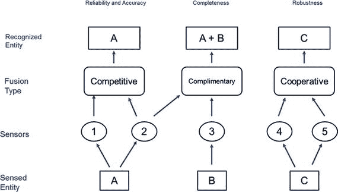

图 3-6. 基于传感器协作模型的融合

- **互补融合**：在互补传感器融合中，使用两个或更多传感器来识别无法从单个传感器中提取的信息。在这种情况下，传感器融合具有叠加效应。

- **冗余融合**：在此模式下，传感器融合使用两个或更多传感器提供关于同一底层过程的信息，以在识别中引入冗余。

- **协同融合**：在协同传感器融合中，使用不同传感器收集关于同一底层过程的不同信息，然后组合起来以更好地识别该底层过程，这与基于单个传感器的解决方案形成对比。

## 3.3 示例实现

在本节中，我们将提供前述章节中描述的不同类型多模态传感器集成的示例。我们将以音频和视觉传感器为例，但这些方法也可扩展到其他类型的异质传感器。

### 3.3.1 语义融合

设想一个涉及人机交互的场景：用户试图通过手势和语音与计算机或机器人进行交互。例如，用户可能指向摄像头视野中的一个物体，并语音询问该物体的属性。

这一场景需要融合视觉和音频流的识别结果来实现。图 3-7 展示了其数据流程。

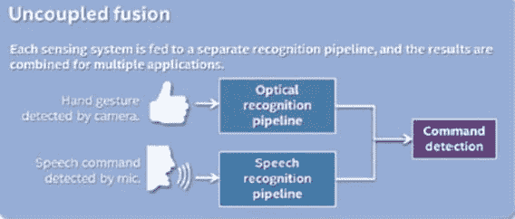

图 3-7. 基于手势的语音命令的语义融合

如图 3-7 所示，两条识别管道是独立且完备的，正如第 2 章中分别描述的那样。融合发生在语义层面，即在基本识别完成之后的阶段，此时我们处理的是数据的语义/含义。

### 3.3.2 受限识别

受限识别通过“限制”某一种识别模式的搜索范围，来提升多模态的识别性能。假设一个音视频联动查询系统，能够实时提供用户摄像头所指物体的详细信息。该场景涉及用智能相机对准一个未知物体，并对其提出语音查询。系统可以支持诸如“那是什么物体？”、“那本书的最低价是多少？”、“这本书的评论如何？”等查询。当系统通过语音识别技术“理解”了查询内容，并确定了查询的目标物体后，会进行在线搜索来获取答案。可能还需要一步来格式化结果，并以预定义的方式呈现给用户。

此类场景可以通过受限识别来提升性能和响应时间。其高层概念如图 3-8 所示。基本思路是：利用一个模态的上下文信息，可以显著提升另一个模态的性能。例如，如果语音识别引擎在自信地识别用户语音方面遇到困难，利用已识别的视觉物体作为上下文，可以改善语音识别性能。若语音识别引擎返回的查询字符串是“How are the reviews for this hook?”（这本书的评论怎么样？），且识别置信度分数低于预定阈值，那么，由于视觉识别模块报告当前识别到的物体中有“book”（书），就可以将查询纠正为“How are the reviews for this book?”

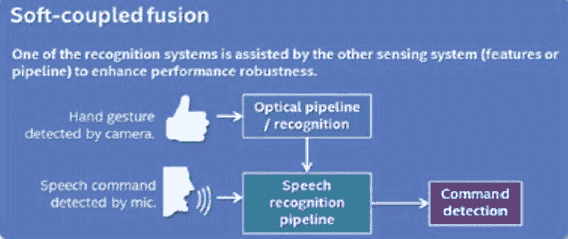

图 3-8. 基于手势的语音命令的受限识别

### 3.3.3 紧耦合融合

在这种情况下，多个传感器使用统一的识别流程。来自不同模态的数据在处理过程的早期阶段就被合并。可以是融合原始数据、过滤后的数据或特征。一个单一的识别分类器作用于融合后的数据来进行识别。以之前的音视频传感器融合为例：如果我们将流程修改为图 3-9 所示，那么识别模块将接收来自音频和视觉模态的合并输入，并基于合并后的数据进行识别，而不是在视觉识别完成后才去提升语音识别性能。

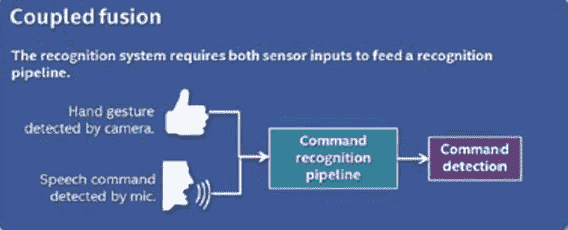

图 3-9. 基于手势的语音命令的紧耦合融合

这种识别形式通过消除模态间的重复识别，有潜力带来最大的性能提升。然而，由于多种原因，它也是实现起来最困难的方法，包括：

- **缺少跨领域专家**：在上述例子中，我们需要语音识别和视觉计算技术领域的专家密切合作。同时深谙两个领域技术细节的专家相对罕见。
- **不同的数据格式**：不同模态使用不同类型的数据和特征表示，这使得在有效合并它们的同时避免丢失相关信息成为一项挑战。
- **缺少训练数据**：为了有效训练多模态识别模型，我们需要多模态的训练数据。这类数据很难从传统数据源获得，需要通过人工构建场景来生成数据。这种训练数据的生成方式带来了巨大的可扩展性挑战。

## 3.4 传感器融合的数学方法

传感器融合通过多种方法实现更好的识别。两种主要方法是通过**推理**和**估计**。推理假设生成输入信号的过程的性质是预先已知的，因此可以利用获得的数据来推断被识别的实体。推理也可以被解释为决策融合的一种形式，因为决策是基于对感知情境的了解而做出的。另一方面，估计试图在给定数据观测特性的情况下，推导（或识别）产生数据的过程的性质。在接下来的内容中，我们将非常简要地介绍一些用于推理和估计的常用方法。这里的讨论既不详尽也不充分，感兴趣的读者建议查阅参考文献以更深入地理解这些主题。

### 3.4.1 推理方法

- **贝叶斯推理**：贝叶斯推理使用著名的贝叶斯法则，基于观测数据来识别目标实体。贝叶斯法则根据可能与事件有不同程度关联的条件先验知识，来描述事件发生的概率。对于多模态传感器融合，该方法利用输入值共现的先验知识，来确定被识别事件的发生。该方法在需要相对可控条件下进行准确识别的情景中非常流行。可控条件的具备使得获取大量训练数据成为可能，从而能够做出准确的决策。
- **登普斯特-沙弗推理**：登普斯特-沙弗推理方法基于证据理论，无需未知命题的先验概率。这使得该方法可以在输入信号的所有可能组合及其与融合输出之间的关系并非预先全部知晓的条件下进行推理。登普斯特-沙弗推理方法提供了在各种条件下实现的灵活性。然而，与贝叶斯方法相比，该方法以牺牲准确性来换取灵活性。
- **基于模糊逻辑的推理**：在许多传感器融合实例中，可能需要处理那些不太适合传统量化模型的数据。例如，给定两个传感器，`传感器 A` 和 `传感器 B`，可能需要基于诸如“`传感器 A` 报告一个高值且 `传感器 B` 有噪音”这样的条件来定义推理模型。在这种情况下，基于模糊逻辑的传感器融合系统尝试将变化或相关的参数作为输入变量，来找出最佳结果。

模糊逻辑系统按照图 3-10 所示的三个步骤运行。这些步骤是：

### 3.4.1 基于模糊逻辑的推理

模糊逻辑是一种多值逻辑系统，允许在 0 和 1 之间存在连续的真理值，这与传统的布尔逻辑（真/假）形成对比。这种方法对于传感器融合应用特别有用。模糊逻辑推理过程通常包括三个步骤：

1. **模糊化**：模糊化过程涉及将输入分配到各种预定义的输入类别中。对于每个输入，该步骤根据定义的边界确定对每个类别的“隶属度”。隶属度是一个介于 0 和 1 之间的值，用于定义输入在任何时刻的状态。

2. **推理**：基于规则的推理步骤利用输入状态得出推断结果。例如，应用的推理规则可以表述为“如果`传感器 A`为`高`且`传感器 B`为`嘈杂`，则使用`传感器 A`的输出更新来自`传感器 B`的结果”。

3. **去模糊化**：该过程的最后一步，利用推断输出和应用到的推理规则，生成传感器融合系统的可测量输出。对于上述示例，去模糊化步骤可以应用预定义的数学模型，根据`传感器 A`的输出更新`传感器 B`的数据。

#### 基于神经网络的推理

你会在很多地方看到将神经网络描述为“由简单、高度互联的处理元素组成的计算系统，这些处理元素通过对外部输入的动态状态响应来处理信息。” 神经网络（`NNs`）或人工神经网络（`ANNs`），正如它们经常被提及的那样，其模型是模仿人类大脑皮层的神经元结构。然而，`ANNs`的规模与人脑相比要小得多（一个大型`ANN`有数千个神经元，而人脑则有数十亿个神经元）。

在架构上，`ANNs`由神经元层组成。“输入层”由接收来自各种传感器数据的神经元组成。然后，数据由一个或多个“隐藏层”进行处理，最后通过“输出层”呈现给用户。每一层都由许多具有激活函数的相互连接的节点组成，用于处理数据。节点之间的连接是加权函数（图 3-11）。

`ANNs`必须经过一个“训练”或“学习”阶段，才能用于推理（或分类）。学习规则根据呈现的输入模式修改连接的权重。学习是通过预先知道正确期望输出的示例来实现的。向`ANNs`提供来自所有传感器的输入集。`ANN`会尝试“猜测”正确的输出。然后，训练过程计算`ANN`输出与理想期望输出之间的误差，并使用此误差来更新`ANN`的连接权重。接着呈现新的输入，并重复该过程，直到权重收敛到能产生满意结果的值。当然，实际过程要复杂得多，但这个高层级的过程概述对于我们讨论传感器融合方法来说已经足够了。

基于`ANN`的推理方法具有一个优势：基于示例的学习不依赖于了解输入和输出之间的实际关系。因此，这种方法在以下情况下非常有用：我们寻求在面对噪声时的鲁棒性；发现模式集之间的关系；输入量、数量或多样性很大；或者输入关系模糊且难以用传统方法描述。

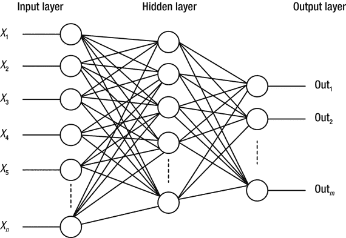

**图 3-11.** 人工神经网络

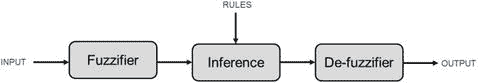

**图 3-10.** 基于模糊逻辑的推理

### 3.4.2 估计方法

给定一组观测值，估计技术倾向于推导出产生这些观测值的底层过程的参数。在多模态传感器融合应用中，观测值由来自多个传感器过程的组合信息构成。流行的估计方法假设底层过程是一个未知的线性过程。观测值是过程输出随时间变化与白噪声的组合。最小二乘估计是最流行的估计方法，描述如下。

- **最小二乘法**：给定一定数量的观测值，最小二乘法旨在找到代表这些观测值的“最佳拟合”线。该线被视为底层过程（和加性噪声）的表示。在该类方法中，此方法是最灵活的，因为它假设没有关于噪声过程概率密度的先验信息。这种方法得名于其估计旨在最小化测量值与估计过程之间的最小二乘误差。

## 3.5 总结

在本章中，我们介绍了多模态的概念，以及它如何用于提高相对于单模态识别的识别性能。我们讨论了多模态的不同用途，以及除了改进现有识别用法之外，它如何能激发新的基于识别的应用。我们简要介绍了几种在不同条件和架构目标下实现多模态识别的技术。鼓励读者参考下一节的参考文献，以获取有关这些技术的更深入信息。下一章将重点介绍提高识别性能的另一种方法，即通过利用上下文。

