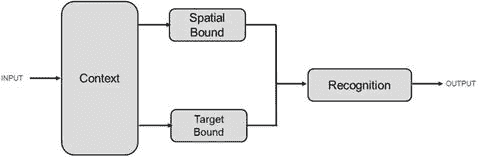
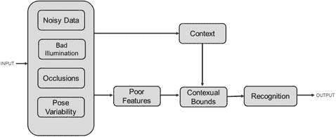
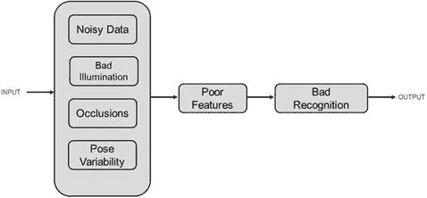
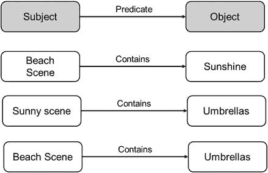
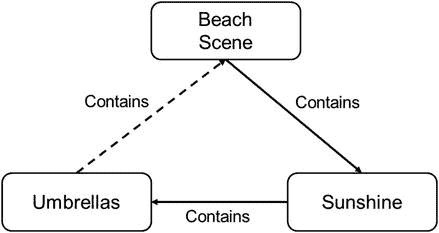

# 4. 上下文识别

在本章中，我们将超越识别这一主要主题，开始理解下一层次的理解是什么样子的。具体来说，我们将讨论“上下文”和上下文理解的概念。简单来说，上下文指的是我们试图理解事物所处的环境。正如我们在第 3 章多模态传感器融合中讨论的那样，拥有上下文信息可以实现更好的识别。反之，识别特定的环境属性可以帮助我们定义上下文，从而有助于理解正在观察的场景。下面概述了一些上下文识别的例子：

- 对环境有了解，有助于识别那些被遮挡且难以被传统算法识别的物体。例如，识别出一张桌子和一台显示器，就能很容易地识别出桌子上的键盘，即使键盘被遮挡且难以单独识别。
- 识别系统可以从了解不同物体之间的关系中受益。例如，在许多图片中，办公椅总是面向桌子。椅子与桌子之间的这种语义位置关系，可以使我们在识别出其中一个物体后，能够优化对另一个物体的识别。
- 上下文识别有助于预测场景中被遮挡的物体。例如，检测到在树后若隐若现的猫科动物尾巴，可以根据基于位置（森林 vs. 公园）的上下文，预测这是一只幼虎或一只大猫。

## 4.1 上下文与识别的关系

在本节中，我们尝试在“正向”方向上弥合识别与上下文之间的鸿沟，即我们将理解如何从识别中推断出上下文。

处理上下文识别的系统主要有两种类型，即基于规则的系统 and 基于知识的系统。上下文信息构成了基于规则和基于知识系统之间区别的基础。在理解上下文的重要性之前，我们先对这两种系统进行一个非常高层级的概述。实际的深入讨论将推迟到后面的章节。此外，我们将仅专注于从图像中识别物体这一目标，并将更复杂的使用目标留到后面的章节。

**目标**：给定一张图片，识别图像中的物体。

### 4.1.1 基于规则的系统

基于规则的系统按照前文所述的方式运行，即以“如果 XX 则 YY”的模式工作。图像被分解为多个特征，算法通过分析这些特征来寻找它们之间的预训练模式。如果该模式与某个训练样本匹配，或者大致“接近”某个已训练的表征规则，则识别被视为成功；否则，判定目标对象不存在于场景中。

### 4.1.2 基于知识的系统

在基于知识的系统中，系统利用先验信息来确定识别结果。随着系统在给定输入中发现越来越多相关的信息，某物被识别的概率也随之增加。这类系统利用观测之间先前观察到的相关性来判断识别匹配的可能性。很多时候，此类基于知识的系统会利用相关性信息来决定给定输入的哪些部分值得采用基于规则的方法进行识别匹配搜索。这种混合方法在优化识别系统的执行速度和准确性方面已被证明非常有效。

## 4.2 理解上下文

上下文由识别活动发生时所处的全部信息构成。例如，如果一个算法要在图像中识别一个键盘实例，上下文可能包含图像中的场景（森林、城市、办公室等）。如果是一张森林图片，上下文会提示找到键盘的可能性很小。反之，如果图像中的场景指向电脑桌，那么找到键盘的概率就会更高。接着可以利用更进一步的上下文线索来定位搜索区域（显示器下方、桌面上等）。

上下文也有助于人类进行识别或对不同场景做出反应。例如，观察到一只动物的部分身体（如尾巴），而该动物实际躲在树后看不见，人类观察者会根据上下文做出不同的反应。一个人在公园里看到上述被遮挡的动物，其行为很可能与在森林里看到同样情景的人不同。在这种情况下，观察周围的场景为识别提供了上下文（是无害的宠物还是野生动物）。

### 4.2.1 上下文的不同角色

上下文作为一个概念，在识别中可以扮演多种角色。简而言之，任何能提供目标实体环境信息的形式都可以构成上下文。以下是一些例子：

* **语义上下文**：多个实体可能因为同属一个环境而具有上下文关联。同样，如果实体通常不共享同一环境，它们之间就没有语义上下文关联。在一张包含电脑显示器的图像中找到电脑键盘的可能性，远高于在一张阳光海滩的图像中找到键盘。在这个例子中，显示器和键盘在语义上相关，而海滩和键盘在语义上无关。
* **空间上下文**：空间上下文指的是待识别物体或感兴趣物体之间的空间布局关系。例如，从空间上看，树木或消防栓总是位于地面之上。键盘通常放置在显示器下方，人行道则位于街道一侧。如果我们在场景中识别出其他空间相关的物体，空间上下文就使得缩小目标物体识别的搜索空间成为可能。
* **姿态上下文**：许多物体不仅在空间上相关，而且在姿态上也表现出相互的一致性。餐椅通常面向餐桌，道路同侧的汽车通常朝向相同方向，等等。将基于姿态的上下文信息添加到空间上下文中，通过引入用于物体间识别的语义线索，可以进一步降低识别系统的复杂度。

## 4.3 在识别中引入上下文

将上下文用于识别目的的好处可以通过以下指标来说明：

* **准确性**：从场景中获取上下文信息有助于更精确的识别。了解场景描绘的是海滩，有助于将一个物体识别为沙滩球，而不是某种水果（如甜瓜）。

其余三个好处直接源于在空间上以及基于上下文考虑的目标实体集合中搜索空间的缩减。

* **功耗**：通过利用场景上下文来限制目标对象的搜索空间，计算设备识别物体的功耗可以大幅降低。那些在上下文中不属于该场景的物体可以从目标搜索空间中被排除。
* **速度**：更小的搜索空间也意味着更快的识别时间。
* **计算量**：识别所需计算资源的规模也会随着搜索空间的缩小而降低。

下图 4-1 展示了第 1 章中识别管线的修改版本，其中加入了上下文模块。

**图 4-1.** 在识别中融入上下文

该流程展示了场景数据与识别之间的一些新处理模块。上下文模块使用预定义和训练好的方法来确定场景的上下文。基于场景上下文，空间边界模块将输入中的搜索空间限制在最可能包含目标实体的区域（使用前面描述的姿态、空间和语义上下文）。目标边界处理则根据上下文信息缩小样本空间，以匹配图像特征。这种上下文边界处理的结果是一个高度优化且快速的识别模块。

## 4.4 来自人类识别的启示

上下文识别的概念在很大程度上借鉴了人类识别。多项研究表明，人类之所以能够非常快速地识别不同的实体和情境，是因为拥有一种非常快速且优化的上下文搜索能力。正如上文对基于计算机的识别的描述，人类的识别既依赖于环境场景上下文，也依赖于空间上下文。

### 4.4.1 基于图像的上下文识别

在最近的一项研究中，受试者被要求描述一张模糊的街道图像中的场景。大多数人回答说，他们看到的是一个有汽车和行人的街景<参考文献>。而实际上，这张图像是由同一张汽车图像在两个相差 90 度的位置上合成的。大多数测试观察者将汽车误认为行人，这是人类上下文观察效应的一种体现——人们会预期在这样的场景中出现行人。上述例子也表明，在某些情况下，上下文可能会造成干扰，使问题难以解决。庆幸的是，与那些上下文有助于识别的场景相比，此类情况的数量要少得多。在上述例子中，上下文识别在一个合成且极不可能出现的场景中失效了。

类似地，让一组观察者在一张呈现的图像中执行“找人”任务，并通过眼动追踪仪记录他们的注意力，生成了一张平均热力图，这张图可被视为一种经过调制的显著性图。该显著性图显示，人类的注意力会迅速集中在图像中的少数几个区域，以寻找感兴趣的目标。从上下文来看，这些区域正是找到目标对象概率最高的位置，因此是集中搜索的合理起点。人类的搜索方法并非在整个图像上均匀分布，而是一旦粗略识别出场景的各个部分，搜索便会迅速聚焦于最可能包含目标实体的区域。与机器相比，研究显示，当观察者在场景中寻找某个物体时，他们会随意扫视场景，并将搜索固定在上下文中最有可能包含该物体的区域。在眼睛固定注视之前，大多数物体实际上已被“一瞥”识别。

**一致性与不一致性效应**：如果在包含上下文的场景之后呈现目标物体（例如，面包之后出现厨房，或森林中出现野生动物），物体检测的准确率（以检测速度衡量）会得到提升。

### 4.4.2 非基于图像的上下文识别

作为一个非视觉识别任务的例子，请考虑下面这句话：

“根据剑桥大学的一项研究，单词中字母的顺序并不重要，唯一重要的是首字母和尾字母在正确的位置上。其余的字母可以完全混乱，你仍然可以毫无问题地阅读它。这是因为人类的大脑不会逐个字母地阅读，而是将单词作为一个整体来理解。”

显然，上面这句话中的单词拼写有误，但读者并不难理解句子的意图。在很多情况下，读者阅读后面单词的速度比阅读前面单词更快。这是人类理解具有上下文特性的体现——我们期望单词符合上下文语境，也符合对句子中下一个词的预期。上述输入中的“噪声”被人类的上下文推理有效地抵消了。

即使部分单词拼写错误，句子也能被理解。实际上，只要字母数量以及首字母和尾字母保持不变，所有单词都可以拼错。

## 4.5 上下文识别：从人类到机器

将这一类比延伸到计算机系统，上下文识别系统利用了一个事实：物体从不会孤立出现，而通常是特定环境的一部分。通常，对输入数据进行快速评估（利用不同传感器来理解运行环境）比在图像中以不同粒度识别某些目标对象是否出现要更容易。场景的统计摘要为上下文推理提供了一种补充且有效的信息来源。具体而言，了解上下文还有助于在以下数据不完美的情况下提升识别效果（图 4-2、4-3）：

图 4-3. 上下文有助于减少不良传感器数据的影响

图 4-2. 不良传感器数据会导致识别问题

- **噪声数据**：由于传感器不完美或环境条件不利，输入数据可能受到噪声污染。噪声数据会使特征生成过程变得非常困难。传统上，在处理前会使用各种滤波方法对噪声数据进行平滑处理。虽然基于滤波的平滑方法对人类观察（例如，视觉上令人愉悦的图像）通常能取得良好效果，但它们通常对基于计算机的自动识别提出了重大挑战。具备上下文信息后，计算机识别方法更容易忽略噪声，转而寻找可能真实反映现实世界信息的特征。
- **遮挡数据**：如前所述，非上下文识别方法无法处理被传感器其他信息所遮挡的数据。然而，拥有上下文信息使得基于不完整的遮挡数据识别结果进行推测性识别成为可能。
- **分辨率不足**：有时传感器无法以足够高的保真度捕获目标图像，以满足识别算法的正常运行。原因多种多样，从目标物体超出传感器测距范围到传感器参数不佳。拥有上下文信息有助于通过将目标物体存在的概率模型与不完整信息相结合，来弥补数据分辨率不足的问题。
- **杂乱场景**：在杂乱场景中，物体分割成为识别算法的一个难题。然而，拥有场景上下文可以将问题简化为一个更小的目标区域，从而进行更高效的分析。
- **物体姿态可变性**：识别算法的性能取决于其训练数据的多样性。理论上不可能训练出一个算法能涵盖目标物体可能呈现的所有姿态、角度和环境。具备上下文识别能力有助于识别那些与训练模型相比在程度上有所变化的物体配置。
- **光照变化**：与姿态变化类似，训练数据无法涵盖目标物体可能被观测到的所有光照条件。对于非视觉任务而言，这相当于在不同环境下观测目标现象。拥有上下文信息有助于减少此类环境变化带来的影响。

## 4.6 表示上下文

至此，我们已经理解了上下文在识别中的必要性和重要性。本节将探讨在实际系统中有效利用上下文进行识别所面临的问题。两个主要问题是：

1.  上下文的简单表示
2.  能够提取并利用此类上下文的算法

虽然方法的详细讨论留待后续章节，但我们在此简要探讨如何进行上下文的表示。简而言之，上下文表示归结为不同对象与场景之间的关系问题。类似于第一章讨论的基于三元组的关系重定向，上下文可以表示为场景中不同实体之间的关系，或者对象与场景描述本身之间的关系。图 4-4 展示了实体与海滩场景之间，以及场景与对象本身之间的两种不同关系。

**图 4-4.** 表示上下文关系

这些关系也可以组合起来，呈现场景特定上下文的综合视图，如图 4-5 所示。

**图 4-5.** 推导复杂的上下文关系

当然，这只是上下文表示的一种形式，研究和实现中还存在着许多其他可能的变体。读者可参考相关文献以获取更多细节。

不同的上下文关系具有不同的强度。例如，空间关系并不总是严格的（如`键盘`与`显示器`vs.`壁炉`与`地面`）。通常，关系越强，基于上下文的识别就越容易。

## 4.7 场景理解的总结性思考

对于从图像中理解场景而言，底层场景的身份可以通过低层聚合特征统计来估测。场景识别领域最先进的方法包括将场景作为一个整体来表示，而不是将其分割成各个组成部分。这些方法也是许多上下文对象识别系统的基础。全局表示已被证明在场景识别中出奇地有效。

### 4.7.1 识别的显著性 vs 上下文

在对象检测方面，场景上下文的影响大于场景显著性。上下文会将注意力引导至相关区域，而显著性则会将异常点凸显出来。由上下文相关对象组成的场景，其整体意义远大于各个对象的简单相加。

## 4.8 总结

在本章中，我们探讨了上下文在有效识别和理解中的作用。上下文对于有效识别至关重要，因为它能提升应用和平台性能，并且是弥合人类感知与机器理解之间差距的重要一步。使用上下文可以在错误识别（或无法识别）与正确识别之间产生决定性差异。我们讨论了表示上下文的方法，并概述了关系表示如何成为实现高效上下文表示与使用的基石。在下一章中，我们将重点探讨如何从场景中提取上下文关系，以及表示关系的技术。

