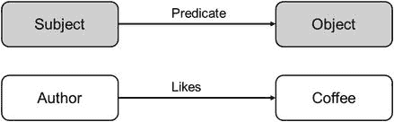
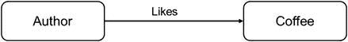
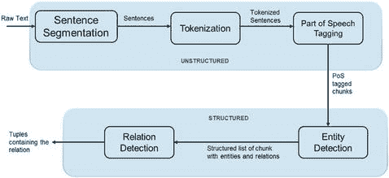
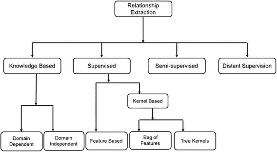
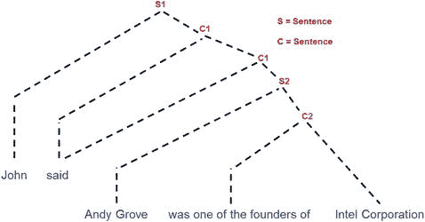
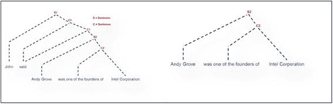
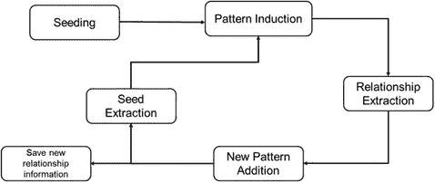
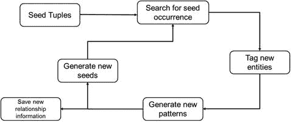

# 5. 提取与表示关系

在不同已识别实体之间提取关系，定义了知识处理流程中继识别之后的第二级操作。识别侧重于从传感器数据中识别并标记单个实体，而关系则明确展示了实体之间的连接方式。

第 4 章展示了一些关于上下文关系如何在实体中体现的例子。下图 5-1 类似于图 4-4，展示了实体之间的“主语-谓语-宾语”关系。该图表明，作者和咖啡通过一个实体（作者）喜欢另一个实体（咖啡）这一事实相关联。

**图 5-1.** 上下文如何决定关系

为了从高层次理解关系提取方法，我们将重点放在基于文本的关系提取方法上。理解关系提取的最佳途径是借助文本示例，因为许多其他模态在识别后都会转换为文本。

此外，许多从视频和语音等模态直接提取关系的方法都源于文本关系提取。我们将展示一个从视频中提取关系的示例。

## 5.1 从文本中提取关系的高层视角

如前所述，在最基本的层面上，关系就是连接两个（已识别的）实体的桥梁。一阶关系通过一个谓词连接两个实体。高阶关系则通过多个谓词连接一个或多个实体。

图 5-2 展示了一阶关系的示例。至于高阶关系的例子，可以考虑在餐厅点餐和选酒的问题。在这种情况下，理想的关系会连接一个人的食物偏好、可用选项以及最合适的葡萄酒搭配。

**图 5-2.** 关系示例

在本章中，我们将主要侧重于提取一阶关系。为了理解基于文本的关系提取方法，我们假设关系嵌入在包含实体的句子中，并且关系的描述可以通过句子（隐式或显式地）获得。提取关系的方法要么依赖于使用预训练的关系结构信息，要么动态学习结构以揭示关系。

文本句子的结构对于关系提取算法的性能至关重要。大多数算法要么依赖于句子的句法意义，要么依赖于句子中单词的结构。这意味着，如果后续阶段将使用基于文本的关系提取器，那么识别方法输出结构良好的文本就显得非常重要。我们将在本章后面讨论一个基于视频的场景理解方法如何输出此类信息的示例。

更正式地说，给定一个句子，关系被定义为元组 `t = (e_1, e_2, …, e_n)`，其中 `e_i` 是参与预定义关系 `r` 的实体。关系提取器的任务可以分解为以下几个部分：

-   识别关系中的相关实体。
-   识别每个参与关系实体的角色。

如图 5-3 所示，对于文本关系提取任务，这分解为非结构化和结构化文本分析两个阶段。在非结构化文本分析阶段，算法处理句子语义，以识别句子中不同的语法和句法成分。结构化阶段通常从识别关系中的参与实体开始，随后进行关系检测和结果表达。

**图 5-3.** 关系提取中的非结构化与结构化部分

## 5.2 关系抽取方法

基于文本的关系抽取方法可按图 5-4 所示分为不同类别。

- 基于知识的关系抽取
- 有监督关系抽取
- 半监督关系抽取
- 远程监督

图 5-4. 关系抽取方法的类型

### 5.2.1 基于知识的关系抽取

基于知识的关系抽取方法依赖于领域先验信息或文本的词汇与句法特性。

#### 5.2.1.1 领域相关的关系抽取方法

领域相关的基于知识的关系抽取方法专为特定操作领域的关系抽取而定制。例如，这些方法专用于在涉及癌症诊断、果树病害、鸟类迁徙模式等句子中寻找关系。拥有操作领域的先验信息使得这些方法能够高度定制化用于关系抽取。利用给定领域句子的已有信息，这些方法可以达到很高的准确率，因为特定领域中关系表达的模式通常非常规律且广为人知。在特定的应用领域，实体及其关系在文本中的表达方式通常数量有限。这使得训练这些方法进行抽取变得非常精准。

#### 5.2.1.2 领域无关的关系抽取方法

这些方法也称为基于词汇-句法模式的关系抽取，它们假设句子中存在一组描述关系的模式，这些关系以等价形式呈现。通过此方法抽取关系的模型经过训练，能够识别代表实体间相同关系但形式不同的各种句子结构。这些方法完全依赖于自然语言和句子的句法结构。基于语法句子结构，方法识别实体以及连接它们的关联关系。

#### 5.2.1.3 基于知识的关系抽取方法的性能

由于基于知识的方法依赖于领域和/或语言词汇及语法的先验知识，其性能高度依赖于代表领域知识和语言结构规则的训练集大小。此类算法的性能以精确率和召回率指标表示，呈现以下特性：

- **精确率**衡量在给定句子集中被正确识别的关系数量。通常，基于知识的关系抽取方法表现出高精确率。这是因为基于知识的关系抽取方法使用通过无歧义句子结构描述关系的样本进行训练。
- **召回率**衡量在测试集所有可用关系中正确识别的关系数量。基于知识的关系抽取方法通常在召回率指标上得分较低。这是因为训练方法无法覆盖关系表达中所有可能的句子结构变体。通常，规则并未考虑表达关系的大多数结构，导致许多关系被误判为假阳性。

### 5.2.2 有监督关系抽取

有监督关系抽取方法依赖预训练模型来识别句子中的命名实体，并将关系抽取任务转化为分类任务。有监督方法通常包含一个预处理步骤，用于识别感兴趣的实体及其之间的任何连接。然后通过分类方法处理这些连接，以确认预定义的关系，如图 5-5 所示。

图 5-5. 关系抽取管道

从高层次来看，该管道可根据功能分为以下部分。

- **预处理阶段**负责检测可能构成关系一部分的实体。所有此类可能的实体均利用句子结构（句法）和自然语言属性（语义）的知识进行识别。利用这些信息有助于隔离可能成为关系主语或谓语的实体，以及句子中可能对发现关系存在至关重要的部分。例如，给定句子"John said Andy Grove was one of the founders of Intel Corporation"，预处理步骤可能将实体"John, Andy Grove, and Intel"识别为可能参与由子句"was one of the founders of"部分或整体所描述关系的实体。根据这些识别结果，下一个模块根据所使用的分类阶段类型，将实体和句子格式化为特定格式。
- **分类器**同时使用正例和负例训练样本进行训练。接下来的子节将描述一些用于关系抽取的流行分类方法。

#### 5.2.2.1 基于特征的方法

基于特征的方法将描述关系的实体和句子表示为一组特征。这些特征通常是文本中提取的语义和句法特征的组合。

提取的句法特征包括：

- 实体
- 实体类型
- 可能描述实体间关系的子句
- 句子中的实体数量和单词数量
- 可能描述关系的单词数量及其顺序

语义特征通常包括实体间的词路径。

对于基于特征的分类器训练，会从代表已知关系结构的句子中生成多个正例和负例特征集。然后使用这些特征集训练分类器，以判断预定义关系是否存在。这种考量也使得选择正确特征变得非常困难，因为某些特征可能代表能很好指示潜在关系表达的句子部分，而另一些则可能是差的指示器。

基于特征的方法在训练阶段完全依赖人工感知和劳动，以尽可能多地从文本中识别正例和负例。然而，很容易发现，这种情况可能导致遗漏训练时未出现的文本中的关系。由于语言可以将关系表示为范围广泛的多种格式，基于特征的训练几乎不可能覆盖所有可能的情况。

#### 5.2.2.2 基于核的方法

基于核的方法旨在解决基于特征的方法在训练中遇到的问题，它通过使用核函数来比较测试句子与已知示例之间的相似性。与基于特征的方法通过特征精确匹配词序列不同，基于核的方法试图提取与已知表示形式的相似性，而不是寻找更精确的匹配。

基于核的关系抽取主要有两种类型：特征包核与树核。

**特征包核**：基于特征包的内核方法通过创建包含实体的句子中不同部分的表示来工作。

这类方法基于字符串属性，实际的功能核会计算学习样本与测试样本在子序列上的相似性。子序列根据它们在句子中相对于被研究实体的位置进行划分和比较。如果句子中相似的部分较长且连续，与较短且不连续的相似部分相比，基于核的方法将返回更好的匹配结果。

例如，如果 `e_1` 和 `e_2` 是两个目标实体，包含它们的句子可以细分为序列 `s_1`、`e_1`、`s_2`、`e_2` 和 `s_3`，其中：
- `s_1` 是第一个实体 `e_1` 之前的句子部分；
- `s_2` 是实体 `e_1` 与 `e_2` 之间的句子部分；
- `s_3` 是第二个实体 `e_2` 之后的句子部分。

给定句子“The author of this book likes coffee as a breakfast drink”，如果预处理步骤分别将“author”和“coffee”识别为实体`e_1`和`e_2`，则其他参数的值将是：
- `s_1` 是 “The”；
- `s_2` 是 “of this book likes”；
- `s_3` 是 “as a breakfast drink.”

相似度分数是在词级别计算的，即在应用分类器之前，词本身会被转换成特征表示。

**树核**：与基于特征包的方法不同，树核利用句子中的结构信息来确定预处理步骤中识别的两个实体之间是否存在关系。该结构包括句子中的词语及其顺序。

该方法会构建一个浅层句法分析树来表示给定句子中的词序列和实体。句子“John said Andy Grove was one of the founders of Intel Corporation”可以用树状形式表示，如图 5-6 所示。

图 5-6. 将句子表示为树

假设预处理步骤识别了实体“John”、“Andy Grove”和“Intel Corporation”，则识别出以下句法分析树。包含实体的两个句子（子句）`S1` 和 `S2` 被表示为句法分析树，如图 5-7 所示。当然，在本例中 `S1` 代表完整的输入句子。

图 5-7. 该句子可能的句法分析树

树 `S1` 不是浅层树，因为它不是包含关系（“founder”）的最小树，而 `S2` 则代表了这样一个浅层树。出于训练目的，句子 `S1` 被用作负例，而 `S2` 则作为正例。

虽然结构信息有助于基于核的方法在精确率和召回率指标上实现更好的性能，但该方法确实假设谓词（表达关系的词语）位于句子中的实体之间。尽管这并非普遍成立，但已证明这种结构信息在大多数情况下是正确的。

#### 5.2.2.3 监督方法的局限性

虽然基于核的方法比基于特征的方法有所改进，但监督方法仍然存在一些问题，主要是：
- 它们表现出可扩展性问题；这些方法很难扩展以覆盖新的关系；
- 很难实现扩展以从句子中识别出多个关系；
- 这些方法需要预处理来识别实体或创建句法分析树。这些方法在计算和算法上可能难以实现。

### 5.2.3 半监督方法

前面讨论的监督方法依赖已标注的数据来训练关系抽取所需的模型。在许多情况下，获取这些训练数据被证明是最耗时的任务，并且由于训练不足，模型性能通常会受到影响。标注任务不仅是规模问题，还涉及大量的人力投入。

半监督关系抽取方法倾向于通过自动化分类器训练中的标注部分来克服有效标注的局限性。由于获取标注数据成本高昂，半监督方法通过在数据标注和关系抽取模块之间建立紧密循环来引导训练数据的创建。通常，一个弱学习器会输出关系信息，这些信息可用作下一阶段的训练数据。

图 5-8 和以下步骤大致概述了一个半监督关系抽取系统。

- **种子设定**：算法通常从一些表达关系的事例元组开始。这些例子被称为“种子”。
- **模式归纳**：使用种子示例来学习（归纳）实体之间描述关系的模式。
- **关系抽取**：使用这些模式来抽取包含给定关系的句子。
- **新模式添加与种子扩展**：基于抽取出的句子，识别新的模式并将其添加到种子集中。
- **迭代**：该过程重复进行，并进入一个新的模式归纳步骤。

图 5-8. 半监督关系抽取流程

我们现在使用流行的半监督关系抽取方法来展示上述过程的一些示例。

#### 5.2.3.1 双重迭代模式关系扩展（DIPRE）

假设我们感兴趣的关系是“图书作者”。换言之，我们希望获取关系（`作者`，`出版物`），并从给定的文档集中尽可能多地提取此类关系。对于最流行的基于文本的关系提取任务，搜索域是整个网络。在此我们以此为例进行说明。

*   **种子阶段**：假设我们向算法输入一小批`<作者，图书>`关系作为种子。主要论文的作者使用了 5 个关系种子。
*   **实体搜索阶段**：第二阶段涉及在感兴趣的领域中搜索已标记的实体。对于上述选定的种子，这需要搜索所有同时出现作者和图书的句子。在我们的例子中，搜索可能会返回包含通过不同句子结构连接的`<作者，图书>`对的句子，例如“艾萨克·阿西莫夫撰写了《机器人黎明》”、“《机器人黎明》的作者是艾萨克·阿西莫夫”等。通常，搜索算法会提取大量此类句子。在 DIPRE 作者的情况下，使用 5 个种子进行搜索，最终发现了近 200 种模式。
*   **新模式生成阶段**：利用实体搜索阶段的搜索结果，此阶段检查每个句子以生成连接实体的模式。在我们的例子中，上面返回的句子可以分别形成诸如“978-1-4302-6593-1 撰写了 `<图书>`”和“`<图书>` 的作者是 978-1-4302-6593-1”形式的模式。
*   **新实体搜索阶段**：基于上一阶段提取的模式，此阶段搜索通过相同模式连接的新实体。新实体替换先前的种子，流程返回实体搜索阶段进行下一次迭代。以我们的例子为例，这些模式可以通过以下方式产生新实体。使用第一个模式，“978-1-4302-6593-1 撰写了 `<图书>`”可能会返回诸如“斯蒂芬·霍金撰写了《时间简史》”之类的句子；第二个模式“`<图书>` 的作者是 978-1-4302-6593-1”可能会返回诸如“《我所见的世界》的作者是阿尔伯特·爱因斯坦”之类的句子。我们观察到，此步骤能够扩展与种子实体具有相同关系的特定实体。现在可以将`<斯蒂芬·霍金，《时间简史》>`和`<阿尔伯特·爱因斯坦，《我所见的世界》>`添加到种子列表中，并重复该过程以获取更多关系描述的格式以及更多共享相似关系的实体。
*   **终止标准**：通常根据提取的实体数量和关系类型来设定终止标准，以停止执行。在我们的例子中，可以使用特定数量的`<作者，图书>`对的发现作为终止标准。

图 [5-9] 显示了该算法的完整流程。

图 5-9. DIPRE 流程

#### 5.2.3.2 Snowball

DIPRE 构成了许多流行的半监督关系提取方法的基础。该方法的一个主要缺点在于，在新实体搜索阶段使用了句子中的精确短语和词序来提取实体。基本上，算法会搜索句子中单词及其顺序的精确匹配来提取实体。例如，模式“`<图书>` 的作者是 978-1-4302-6593-1”会返回句子“《我所见的世界》的作者是阿尔伯特·爱因斯坦”，但无法返回句子“《我所见的世界》一书的作者是阿尔伯特·爱因斯坦”，因为单词“书”不在原始模板中。

为了避免这种严格的模板匹配，Snowball 使用了类似于基于核的有监督关系提取方法的功能。与有监督方法一样，模式被分解成多个部分。假设 `e_1` 和 `e_2` 是两个感兴趣的实体，包含它们的句子（模式）可以细分为序列 `s_1 e_1 s_2 e_2 s_3`，其中：

*   `s_1` 是模式中第一个实体 `e_1` 之前的部分；
*   `s_2` 是模式中实体 `e_1` 和 `e_2` 之间的部分；
*   `s_3` 是模式中第二个实体 `e_2` 之后的部分。

Snowball 使用与 DIPRE 相同的过程流程，但有一处更改。在新实体搜索阶段，对于模式的 `s_1`、`s_2` 和 `s_3` 部分，使用基于核的相似性方法，而非精确匹配。相似性度量使得标记那些在词汇和语义上与目标模式相似但不必完全匹配的句子成为可能。

最初的 Snowball 算法用于从网络数据中提取`<组织，地点>`关系，但该算法足够通用，可用于任何单一顺序的实体提取任务。

#### 5.2.3.3 KnowItAll

目前为止，讨论的所有方法都使用了某种用户提供的特定领域模式作为关系提取的种子。KnowItAll 系统试图通过提供一种使用相对较少的领域无关模式来标记训练示例的方法，来放宽这一限制。由于通用模式可应用于不同领域，该方法先识别出关系特定的规则，然后使用特定的实例化来提取领域特定的提取规则。

KnowItAll 系统由多个阶段组成。主要的操作模块包括一个引导单元、搜索引擎、关系提取器、评估器和一个知识库。系统的核心是一个搜索引擎，它利用来自网络的信息，根据引导单元和提取器的查询返回网页。此外，搜索引擎提供搜索的命中次数，以辅助计算搜索结果重要性的概率。通常，搜索引擎返回的相似关系表达式数量越多，表明提取出的关系越有效。引导单元使用通用规则模板来形成规则，并利用关于领域的信息来聚焦搜索。例如，“诸如 Y 之类的 X”是一条规则，暗示实体 X 和 Y 之间的通用相似性，可用于查找特定领域的实体。应用搜索“城市”的约束，可以与该规则结合，在诸如“诸如纽约之类的城市”这样的语句中搜索包含城市的关系。

提取器单元将引导单元的规则应用于搜索结果，以提取符合搜索的包含相关陈述的页面。提取的结果随后被发送给评估器，评估器根据出现的概率（使用命中次数）对结果进行阈值过滤，然后将最终的关系结果存储到知识库中。评估器通过将（特定领域的）信息聚焦约束应用于提取的结果，来使用引导单元提供的领域特定判别器。有关 KnowItAll 系统的更详细描述，请读者参考本章末尾的参考文献。

#### 5.2.3.4 `TextRunner`

相较于`DIPRE`、`Snowball`和`KnowItAll`系统，`TextRunner`系统旨在无需任何人工输入的情况下发现关系，并基于自行发现的正负训练样本来训练分类器。`TextRunner`系统的目的是遍历给定的文本库，搜索关系模式，并训练分类器，这些分类器随后可用于从新的文本句子中提取不同的关系。

该方法采用了类似`KnowItAll`的提取器和评估器，但使用一种领域无关的分类器训练方法替代了自举方法。

该学习方法接收一个文档池作为输入。这些文档可以从网络上抓取，或通过其他方法提供给算法。第一步将句子分割成块，并识别实体（名词）和可能的谓词。第二步尝试发现实体之间可能的关系。第三步、第四步和第五步使用不同的解析技术（句法分析、依存分析和预约束解析）将识别出的关系筛选为正关系示例或负关系示例。第六步使用生成的正负示例训练一个分类器。作者使用了多种类型的分类器。读者可参考本章的参考文献部分，以获取对该系统的详细描述。

## 5.3 `NEIL`（永不终结的图像学习）

到目前为止，我们主要关注基于文本输入的关系提取。所讨论的方法构成了从通过各种感知模态生成的数据中进行关系提取的基础。`NEIL`尝试使用上述方法从图像中检测和提取关系。该算法的操作流程如下。

*   **候选实体检测器训练**：该算法使用不同的方法来启动从文本到视觉关系提取的过程。第一步是执行实体检测。此处的实体被定义为对象、对象属性和场景。可以手动提供图像种子及其用于训练的标注。然而，一种更高效的方法是使用基于文本的图像搜索（发明者使用了谷歌图像搜索）来为每个实体搜索检索大量图像。在检索到的图像上，针对每个实体训练多个检测器。例如，我们可以训练数十或数百个分类器来检测一辆自行车。拥有多个检测器可以解决过拟合（模型只能检测一种类型/形状的自行车）问题，并覆盖对象、场景和属性的高维度问题（例如，“汽车”有多种形状、大小和颜色，一个“汽车”检测器必须能够检测到其中的绝大部分）。随后，对多个检测器针对同一个实体达成的共识用于决定最终的检测结果。
*   **关系发现**：在实体检测器检测到实体（对象、属性和场景）之后，关系发现步骤尝试发现以下类型的关系：
    *   **对象-对象关系**：对象-对象关系发现包括找出对象之间的部分整体关系、分类关系和相似关系。部分整体关系描述了一个对象是否是另一个对象的一部分（鼻子是脸的一部分），分类关系将实例连接到更广泛的类别（`iPhone`是一款手机），相似关系发现彼此相似的对象（蜜蜂看起来类似于黄蜂）。对象-对象关系的发现通过使用对象边界框进行。检测器识别图像中的对象并围绕它们“绘制”边界框。根据这些边界框的相对位置，关系发现阶段可以识别对象间的关系。例如，一个边界框嵌套在另一个边界框内表示部分整体关系。在不同的边界框中，两个不同的检测器在多个图像中对同一个对象进行边界框处理，则表明存在分类关系和相似关系。彼此靠近且一致出现的对象边界框可以指示空间关系（在图像中，显示器总是靠近键盘出现）。
    *   **对象-属性关系**：对象检测器和属性检测器一致地同时触发可以指示一个强烈的对象-属性关系。“太阳是明亮的”和“球是球形的”是对象-属性关系的一些例子。
    *   **场景-对象关系**：以类似于对象-属性关系的方式，场景-对象关系试图发现那些在特定场景中一致出现的对象。例如，“船只在海洋中被发现。”
    *   **场景-属性关系**：发现的场景-属性关系包括诸如“公园是绿色的”、“夜晚是黑暗的”等类型的关系。
*   **新实例发现**：利用前一步骤中发现的关系，该算法尝试寻找实体的新实例。例如，有时检测器可能无法检测到某个实体的特定实例（一个未经训练的汽车实例或类型），但利用发现的关系可以更容易地检测到这些新实例（与汽车最常关联的形状、颜色、场景等可以指向一个可能是汽车的对象）。
*   **检测器重训练**：利用新发现的实例，对检测器进行重训练，然后实体发现过程重新开始。

顾名思义，永不终结的图像学习是一个持续的迭代过程，它通过上述步骤在一个无限循环中工作，以不断增加发现的关系数量。

## 5.4 总结

至此，这一章关于关系发现的内容就结束了。在本章中，我们讨论了主要的关系提取方法如何基于文本关系发现。我们讨论了基于知识的关系提取方法，包括领域相关和领域无关的方法。有监督的文本关系提取方法包括基于特征和基于核的方法。为了减少训练所需的人工标注成本，半监督方法尝试通过从手动或自动生成的种子开始的迭代方法，自动标注种子关系和实体。我们以`NEIL`为例，讨论了基于文本的关系发现概念如何直接扩展到其他感知领域的关系提取。下一章将概述如何使用关系信息构建知识库，并针对不同的用途对发现的关系进行操作。

