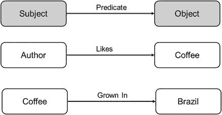
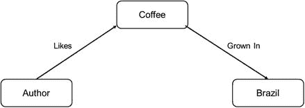
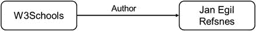
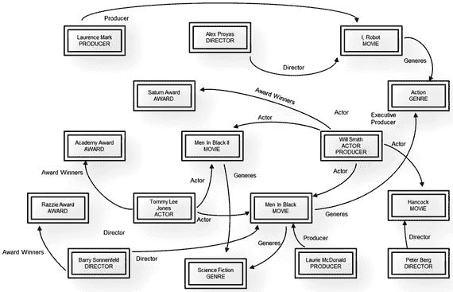
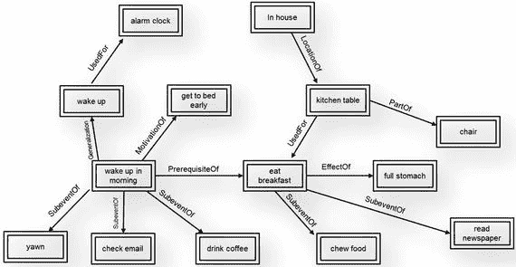

# 6. 知识与本体

到目前为止，本书各章节主要聚焦于数据采集和关系提取的首要任务。对于更复杂的应用，特别是那些展现出某种智能形式的应用，关系信息构成了推理和解释的基础。近期人工智能（AI）应用及其他数据分析服务的激增，部分原因在于各类知识表示机制得到了技术的充分利用。在本章中，我们将重点介绍一些流行的知识表示方法及其用途。

正如我们在前一章所讨论的，实体之间的关系在其最简单的形式下可以表示为三元组，通过该关系连接一个客体和一个主体。我们在图 6-1 中重现了本书前面用于说明这一概念的图。

图 6-1. 关系三元组

前一章讨论了几种提取这些关系类型的方法。我们还简要讨论了如何将具有共同元素（客体或主体）的多个三元组合并，形成关系的扩展，通常称为知识，如图 6-2 所示。

图 6-2. 从关系到知识的第一步

这些方法构成了知识构建的基础。重复这一基本步骤会产生一个知识图，该图嵌入了已通过关系提取发现的关系，并提供了从图结构本身识别新关系的工具。

这个图通常辅以能够对图执行逻辑运算的工具，以推理和解释当前的关系结构，并根据图中的知识推断出新的关系。

## 6.1 使用 RDF 进行关系表示

关系描述格式（`RDF`）是用于描述实体之间语义关系的格式。该格式已被万维网联盟（`W3C`）采纳为推荐标准。

本章讨论的技术描述了知识构建的一些最流行的方法。其中许多方法使用 `RDF` 作为语义描述语言。`RDF` 使用基于 XML 的描述格式，将各种实体描述为资源，将关系描述为资源属性。以下组件被定义为用于 `RDF`：

- **资源**：任何由 `RDF` 描述的实体都称为资源。`RDF` 在资源描述方面非常灵活。资源通常被定义并引用为“文档”的一部分，使用如图 6-2 所示的标准基于 XML 的格式。
- **属性**：实体的属性在 `RDF` 文档中被描述为属性。资源与其他资源的关系也作为属性嵌入在描述文档中。
- **陈述**：`RDF` 陈述被定义为一个 `RDF` 资源及其一个或多个属性以及与这些属性关联的属性的集合。在其最基本的形式中，`RDF` 陈述表示一个实体及其与其他实体的关系。一个完整的基于知识图就是此类陈述的集合。

`RDF` 使得构建基于知识图变得非常容易。它为知识生成和表示过程增加了灵活性。通过更新 XML 语句，可以向资源添加新属性。同样，通过简单的文档更新即可添加新关系。

来源：[`http://www.w3schools.com/xml/xml:rdf.asp`](http://www.w3schools.com/xml/xml:rdf.asp)

图 6-3 展示了一个 `RDF` 文档示例。该文档引用了资源 “[`http://www.w3school.com`](http://www.w3school.com/)”，并且包含两个属性（标题，作者）。这些属性指向与其他资源的关系。图 6-4 展示了图 6-3 中文档所描述关系的图形化表示。

图 6-4. 由图 6-3 的 `RDF` 文档描述的关系

图 6-3. `RDF` 文档

## 6.2 Freebase：关系数据库

`Freebase` 是最早的基于关系的数据存储之一。它由一家名为 `Metaweb` 的公司创立，旨在为商业和非商业组织提供基于关系的数据库访问。该数据库建立在用户提交的三元组以及从网络中发现的关系之上。对该数据库的关系信息贡献被设计为完全协作式的，任何人都可以提交关系三元组以供考虑纳入数据库。三元组使用 `RDF` 格式进行描述。在其鼎盛时期，`Freebase` 包含了约 19 亿个描述关系的三元组。该公司于 2010 年被谷歌收购，该数据库被用于部分构建谷歌的知识图谱。图 6-5 中的草图展示了类似于基于 `FreeBase` 图谱的知识存储的等效表示。

图 6-5. 类似于 `FreeBase` 知识存储的示例呈现

## 6.3 ConceptNet：常识知识

`ConceptNet` 是麻省理工学院（MIT）的一项倡议（[`http://alumni.media.mit.edu/~hugo/publications/papers/BTTJ-ConceptNet.pdf`](http://alumni.media.mit.edu/%7Ehugo/publications/papers/BTTJ-ConceptNet.pdf)），旨在表示并提供对常识知识的访问。诸如“柠檬是酸的”、“火是热的”以及“要开门，通常需要转动门把手”这类概念是人类理解的常识，但计算机需要被告知。拥有此类概念的知识库可以极大地辅助机器对更高层级概念的理解。例如，让机器人“到外面去”这一指令，隐含着通过转动门把手来开门这一前提。`ConceptNet` 旨在以包含海量常识信息的知识库形式提供这种常识。图 6-6 展示了 `ConceptNet` 如何表示和存储常识知识的示例。

图 6-6. 代表 `ConceptNet` 部分常识知识的草图

