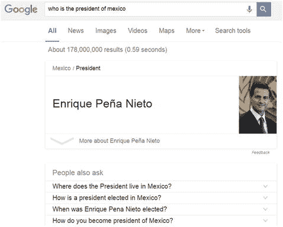

# Google 的知识图谱

谷歌已公开表示，其打算提供一种语义搜索能力，以利用网页中不同形式的关系。这些关系的数据可以来自文本、图片和视频。利用其网络数据缓存，谷歌已经从 `Maps`、`Finance`、`Movies` 和 `Music` 等产品创建了一个庞大的知识图谱。当搜索引擎爬取新数据时，它会返回数据，并对这些数据进行分析，以便纳入不断丰富的知识图谱中。当我们在使用 Google 搜索某些信息时，可以体验到语义搜索的运作过程：它首先尝试使用机器学习（自动完成、`Google Next`）来理解我们可能要搜索什么，然后返回的结果不只是网页，而是一种人类可读的答案形式（图 6-7）。

图 6-7.

Google 理解用户查询，并用答案而非网页链接进行回应 (`www.google.com`)

