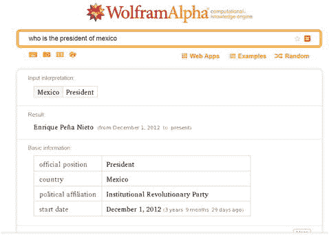

# Wolfram Alpha

`Wolfram Alpha` 是一个知识引擎，其内置的搜索 API 完全旨在通过语义响应来回答查询。与那些开始利用自身数据生成知识的商业搜索引擎不同，`Wolfram Alpha` 的设计目标就是从网络资源中生成知识，并向商业和非商业用户提供对其应用程序访问这些数据的权限。其最终成果是一个网络工具，它通过遍历其构建的知识图谱来实际回答用户的问题（图 6-8）。

图 6-8.

`Wolfram Alpha` 查询示例 (`https://www.wolframalpha.com/`)

`Wolfram Alpha` 知识引擎存储的总数据目前超过 10 万亿实体和关系。用于处理这些数据的算法和模型数量超过 5 万个。

该搜索引擎持续在后台运行，以发现新的数据和关系。它目前可以回答你的问题、教你音乐、比较书籍，并提供语义化的天气信息。`Wolfram Alpha` 引擎已与许多流行的搜索引擎集成。

