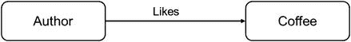
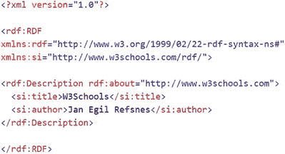

# 语义网

在本章结束时，我们非常简要地介绍一下语义网的概念。目前，万维网大部分是文档的语法集合，即网页表达的概念和观点与其他网页上的观点是相对独立的。当然，语法允许实体在网页之间进行显式的超链接。

这种句法结构对人类来说易于理解，但智能机器的发展使得人类需要一个机器也能理解的网络。人类可以有效解析语法化的网络，因为我们对定义和描述的概念有着天生的理解。像“猫跳过了椅子”这样的陈述对人类来说有意义，因为我们知道“猫”、“跳”和“椅子”是什么意思。然而，解析这样一个句子的机器首先需要了解这些概念，然后才能理解句子中实体之间的关系 `<猫, 跳过了, 椅子>`。当前的语法化网络是一个文档集合，其中计算机负责呈现，而人类则负责在信息之间提供链接。其主要目的是供人类消费信息。网络上唯一的身份标识以 `URL`（统一资源定位符）的形式为文档保留，这些 URL 也被称为网址，例如 `www.intel.com`。

当前的语法化网络布局使得处理需要上下文背景知识的查询、定位需要结合多个来源的信息、推理来自不同网页的信息等变得极其困难。语法化网络问题的根源在于，网页中嵌入的所有元数据都只集中在显示属性（字体、位置等）上，而网络上与其他实体相关的任何关系信息都无法用于解释。

语义网试图通过提供有助于对网络内容进行语义理解的信息访问，使网络变得机器可读。这一努力的起点是向网络上已有的内容添加语义注释。在可以使用任何此类注释来描述概念之前，就必须对所描述的概念和对象的“含义”达成一致。这一点在语义网上是通过使用本体论来实现的。

### 6.9.1 本体论

本体论的基本形式为术语提供了含义。本体论中术语的含义被正式指定并向用户开放。通过组合来自同一本体或多个本体中现有术语的信息，可以形成新的术语。针对上述示例，本体可以定义“猫”为四足动物，“椅子”为四足家具。动物和家具也可以在本体中进一步定义和描述。

因此，语义网的本体论是描述特定现实及这些描述相关含义假设的术语词汇表。

#### 6.9.1.1 本体的组成部分

本体由两个部分组成：

*   **概念名称**：概念名称描述术语。例如：
    *   `Cat` 是一个概念，其成员属于一种动物。
    *   `Carnivore` 是一个概念，其成员是吃其他动物部分的动物。
*   **背景知识**：背景知识赋予术语含义。例如：
    *   猫是食肉动物。
    *   没有个体能既是食肉动物又是食草动物。

#### 6.9.1.2 本体语言

为了语义网，人们进行了多种尝试来定义合适的本体语言。其中突出的是 `RDFS` 和 `OWL`。既然本章前面我们重点介绍了 `RDF` 作为关系的资源描述格式，这里我们将使用 `RDFS` 作为理解本体的途径。

`RDFS` 或 `RDF Schema` 旨在为语义网中 `RDF` 描述使用的术语提供词汇表。`RDFS` 是面向对象的，因为它将定义和描述分组到多个类别及其属性中。类可以有子类和超类，属性可以定义一系列可应用的值。

`RDFS` 模式由通用资源标识符（URI）指向。对于图 6-9 中的关系示例，概念/资源 `Author`、`likes` 和 `coffee` 将由存储在 URI 所指向的可访问网络地址处的 `RDFS` 描述。通常，资源是任何可以通过 URI 引用的对象。属性也被定义为资源。

图 6-9. 基础关系三元组

图 6-10 重复了图 6-3 中呈现的文档，以便我们观察资源描述的语法。

图 6-10. 嵌入了 RDFS 的 RDF

在图中，我们看到一条语句 `<rdf:Description rdf:about="http://www.w3schools.com/">`，它将解析代理指向 URI `http://www.w3schools.com/`，以获取资源 `title` 和 `author` 的描述。

能够将实例和资源描述链接回公共本体，使得计算机程序能够理解跨越不同调用的知识表示和描述。当用动物名称“猫”或个体宠物猫的名字“加菲猫”指代时，猫可以被解释为同一种动物。本体论方法为网络提供了语法，允许表达思想，而不仅仅是存储语义文档。

虽然 `RDFS` 是实现本体的一种方式，但还有许多其他方法，每种方法都附带一个供计算机浏览概念并在概念之间建立联系的包/工具。基于一阶逻辑（FOL）的工具允许组合概念并生成新概念。基于本体 Web 语言 `OWL`（`https://www.w3.org/OWL/`）的本体是世界万维网联盟接受的最流行的本体之一。`OWL` 语言附带了工具，供人们构建自己的本体以及操作已有本体。

## 6.10 总结

本章简要概述了从传感器信息进行知识理解的最终步骤。我们介绍了知识的概念，以及如何将其视为语义关系的集合。讨论了许多基于知识的商业应用，这些应用大量利用从人类和网络收集的数据来构建知识库，旨在提供智能服务。语义网是从传感器收集的原始数据进化到知识的最终步骤，也是我们从传感器获取知识之旅的最后一步。本体论和语义网的主题非常庞大，适合用专门的书籍来讨论。我们希望本节能为您提供一个简短的介绍，并借助参考章节的资源，让您能够自行深入学习该主题。感兴趣的读者可以通过本章末尾的参考资料，了解更多关于所讨论技术的内容。下一章将重点讨论在现实世界中实现传感器理解流水线的实际系统和平台考量。

