# 7. 端到端系统架构的影响

在本章（全书的最后一章）中，我们将讨论处理传感器数据以及分析处理后的数据以获取洞察和知识管理所带来的系统级影响。首先，让我们看看典型的端到端系统架构可能是什么样的。图 7-1 展示了针对不同环境的几种典型端到端系统架构，这些架构由三个平台组成。

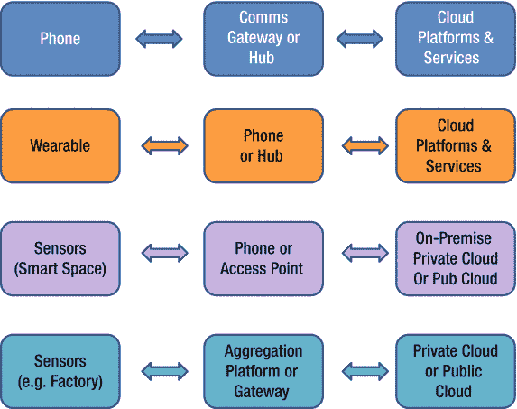

图 7-1. 端到端系统架构示例

在图 7-1 中，第一种端到端系统架构将手机视为传感器捕获设备。如今的手机能够捕获有价值的传感器数据，包括位置数据（用于导航和辅助）、音频数据（语音问答）、运动数据（用于健康/健身和导航）以及视觉数据（用于个人使用、社交媒体和其他目的的图片和视频）。当此类数据在家庭环境中被捕获时，它会通过通信网关（用于 Wi-Fi 通信）或个人集线器，然后可供云端使用。虽然网关/集线器主要用作通信介质，但这类平台拥有更强的计算能力，在某些场景下可用于额外的本地处理。最终，云端平台通常位于数据中心，拥有丰富的处理资源，可用于分析数据并由此提供有价值的服务。

类似地，图 7-1 也展示了一个可穿戴设备的示例。考虑一个戴在手腕上测量运动量的健身设备。这类设备通常具有短距离内的低带宽连接能力，因此需要与手机等贴身设备通信，以便在需要时将数据上传到云端。更复杂的智能手表设备可能具备额外的通信能力，如 Wi-Fi 和蜂窝网络，使其既能连接到本地连接集线器，也能在需要时直接与云端平台通信。可穿戴设备通常计算能力较低，功耗很小（毫瓦到几百毫瓦），而手机或集线器计算能力较高，功耗适中（瓦特级），云端平台则能够扩展到几十/几百瓦甚至更高。

进一步扩展，除了可穿戴设备，我们还可以考虑智能空间中的边缘传感器设备，用于感测运动或捕获音频/视觉数据以实现交互。此类智能空间中的设备可以通过手机或本地接入点与云端通信。在这种情况下，云端平台实际上可以是本地平台，在附近范围内提供服务，也可以是数据中心中的公有云，具体取决于预期的用途。图 7-1 中的最后一种端到端系统是前一种的扩展，因为它考虑在工业工厂类环境中使用一个聚合平台或网关，执行来自多个传感器的传感数据聚合，在本地提供潜在的分析功能，并将这些数据传输到私有或公有云平台进行进一步处理。

## 7.1 平台数据处理考量

在本章中，我们将针对本书前面讨论过的一些用途，考虑此类传感器处理可能或应该在哪里完成，并探讨该领域未来的机遇与挑战。

以下是在确定端到端平台中何处应执行处理时常见的考量因素：

### 7.1.1 计算能力

由于电池续航、外形尺寸、成本甚至散热等方面的限制，端到端系统架构中的每个平台都拥有截然不同的计算能力水平。例如，一个简单的传感器节点可能只有一个微控制器内核和运行频率低于 100 MHz 的简单控制逻辑，而一个网关平台可能拥有运行在几百 MHz 到 1 GHz 的多个内核，以及用于专门媒体或通信功能的额外硬件逻辑。云端平台通常拥有许多内核，每个内核运行在多个 GHz 频率。鉴于计算特性存在如此广泛的范围，确定在何处运行整体应用或服务的各个部分变得至关重要。例如，传感器节点可能只能完成少量处理，而将数据发送到网关或云端则可以实现更丰富的分析和更强大的服务。

### 7.1.2 电池续航与功耗限制

通常，传感器节点或手机计算能力有限的原因是它们由电池供电，因此需要以毫瓦或几十毫瓦的平均功率运行。鉴于这一特性，此类设备通常会“休眠”很长时间，只有在收到有趣的传感器数据或发生感兴趣的事件时才会进行处理。例如，在语音处理方面，边缘设备可能只能判断是否有关键词被说出，而实际的命令则在网关上处理，完整的问答处理和服务由云端提供。这样做是为了节省电池续航并限制传感器节点的成本。

### 7.1.3 交互性与延迟

上述关于语音识别的例子提供了一个关于负载划分的有趣视角。如果交互性和延迟很重要，那么人们会希望尽可能多地在靠近设备的地方进行处理，以最大限度地减少将数据发送到云端并获取回复的延迟。然而，与此同时，交互性可能需要访问云端的数据，而生成答案所需的领域专业知识实际上就在那里。解决此问题的一种方法是考虑本地（用户和设备特定的）命令/问题与全局命令/问题，并在边缘节点（或附近）启用本地命令，同时在云端处理全局（更通用的）命令。

#### 带宽可用性

除了交互性所需的本地处理之外，本地处理的另一个关键考量是带宽可用性。如果本地节点上的可用带宽非常低，那么将所有数据发送到云端进行处理就会变得困难（延迟更高）。通信处理也会消耗功率，因此本地计算与云端通信之间通常存在权衡。如果边缘设备是移动的，带宽的可用性也会根据当前位置的覆盖范围以及室内与室外场景而变化。

### 7.1.4 存储与内存限制

由于外形尺寸和功耗限制，本地边缘设备上可用的存储和内存量也是有限的，而在考虑网关和云端平台时，这些资源会逐渐增加。因此，如果需要历史数据来回答问题（再次以语音为例），那么网关或云端几乎必须通过在该问题背景下处理历史数据来提供答案。然而，如果答案只需要极少的历史数据（最近几秒或几分钟），那么本地设备或许有能力存储原始数据或日后回答问题所需的元数据。除了历史数据之外，能够访问其他数据也同样重要，如下所述。

### 7.1.5 访问其他数据（众包或专家数据）

在进行问答环节（语音示例）时，访问来自其他设备或先前收集的数据也可能很有用。因此，云平台在执行需要特定领域数据的问答任务时具有优势。如果数据是众包的，方法可以是分层的，其中本地网关可以提供一些上下文，但层次的最终根节点是云平台，所有众包数据都可以在其中聚合、处理和存储。

### 7.1.6 吞吐量与批处理

在某些情况下，分析需要将大量数据一起收集和处理。例如，如果需要对某个事件进行转录，且该转录不需要实时完成，那么在云端处理比在边缘处理更合适。完整数据的可用性有助于更好地分析，包括对事件进行总结，以及为转录的各个部分提供更好的上下文。这类场景往往倾向于在云端执行，而非在边缘设备上本地执行。

### 7.1.7 安全性与隐私性

隐私在决定本地处理还是云端处理方面起着重要作用。如果数据是敏感的，那么由于数据完整性丢失、数据暴露以及对安全漏洞的担忧等因素，倾向于本地处理的权重会很高。除了在边缘设备上进行本地处理之外，选择本地服务器还是公共云基础设施也取决于数据的敏感性以及有无可用的安全能力来对数据进行匿名化处理并防止其被滥用。

### 7.1.8 分层处理

最终，本地边缘设备处理与云端处理之间的利弊权衡会趋于收敛，形成一种分层处理方式：部分处理在边缘完成，而在网关和云端完成的处理量则逐渐增加。分层的使用不仅限于基本的静态分区，也包括利用众多分布式节点的可用性以并行方式执行处理的动态方法。

## 7.2 端到端系统划分与架构

图 7-2 说明了上述在端到端架构中三个平台之间进行工作负载划分的考虑因素。该图展示了上述因素如何影响边缘与云端之间数据处理位置的选择。

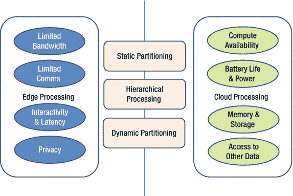

**图 7-2.** 端到端系统架构示例

随着我们进一步探索划分方法，深入了解端到端系统内的平台架构可能会很有意义。为此，我们将探讨五个不同的平台示例：(a) 简单传感器节点、(b) 可穿戴平台、(c) 手机平台、(d) 网关平台和 (e) 云服务器平台。

### 7.2.1 传感器节点

一个典型的基于微控制器的传感器节点架构如图 7-3 所示。这种平台通常包含一个微控制器芯片，以及外部传感器、电池，可能还有一个外部通信芯片。当前的增长趋势是将通信功能集成到微控制器 `SoC`（片上系统）中。

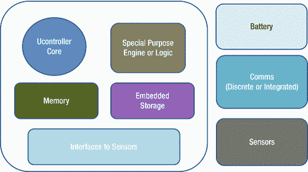

**图 7-3.** 传感器节点平台架构示例

在微控制器 `SoC` 内部，有一个用于嵌入式处理的控制器核心，以及内存、嵌入式存储和传感器接口。除了嵌入式核心外，还可能有额外的专用逻辑或引擎，用于在设备本地进行传感器处理。专用逻辑的类型在很大程度上取决于用途，但范围涵盖从数字信号处理到安全（加密）处理、媒体处理、模式匹配等。这些平台通常针对超低功耗（尤其是漏电功耗）进行优化，以便在大部分非活跃使用场景下延长电池寿命。

### 7.2.2 可穿戴平台

另一种新兴且日益复杂的平台类型是可穿戴平台。可穿戴平台架构看起来与传感器节点架构相似，不同之处在于其核心运行频率更高。它可能有两个核心，一个用于提供更高性能，另一个用于低功耗的始终在线处理。这类架构通常还倾向于拥有更多用于 `DSP`（数字信号处理）、安全和其他功能的专用逻辑。此外，与简单的传感器节点相比，可穿戴平台具有更强的通信和内存/存储能力。

图 7-4 展示了简单传感器平台与可穿戴平台之间的主要区别。一个简单的传感器节点可能主要运行写入其中的裸机代码，从而使某个功能执行得极为高效。可穿戴平台则变得越来越复杂，可能会运行嵌入式操作系统以提供更丰富的功能。可穿戴设备也可能有显示屏接口，尤其是智能手表等设备。虽然这些显示屏相当小，但它们仍然提供了丰富的用户界面，用于访问不同的微应用和面向消费者用途的服务。

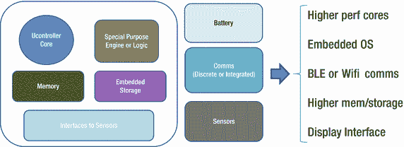

**图 7-4.** 从传感器节点到可穿戴平台

可穿戴设备上的关键通信能力包括蓝牙，可能还有 Wi-Fi 能力。蓝牙提供了在短距离内构建个人局域网的能力。最近，低功耗蓝牙（BLE）以超低功耗和能量实现了最小化的蓝牙通信。几乎所有在手机上运行的操作系统都支持蓝牙和 BLE 能力，以便实现与可穿戴平台的连接。通过这种方式，手机可以在日常生活中作为可穿戴设备更强大的集线器使用。蓝牙提供了从医疗保健、健身、耳机到其他领域的专用 profile。除了蓝牙之外，更强大的可穿戴平台最近开始实现 Wi-Fi 能力，以在家庭环境中提供更高带宽，但代价是功耗增加。随着可穿戴平台包含更高带宽的传感器（如音频和视频），这类能力变得很有用。

### 7.2.3 手机平台

下一个主要的平台示例是手机平台。如今的手机平台功能非常强大，拥有多个（可能异构的）核心、包括图形处理在内的专用引擎、连接能力，以及可观的存储容量。图 7-5 展示了一个包含上述关键能力的移动平台架构示例。

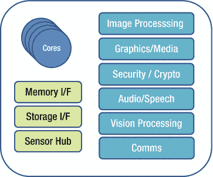

图 7-5. 异构移动平台架构

智能手机平台具有多种使用维度，包括：(a) 通过社交媒体、视频和其他播放功能提供丰富的视觉体验；(b) 通过众多云应用提供丰富的通信体验；(c) 通过外部硬传感器以及软感知（如访问浏览、邮件和其他用户活动）提供丰富的感知能力；(d) 通过从云商店下载的众多可用应用提供丰富的应用体验。为了支持所有这些体验，同时受限于外形尺寸和电池续航，该架构支持从始终开启的感知，到低功耗的轻量活动，再到需要时的高性能处理等多种操作级别。

为了支持低功耗执行，所有重要的子系统都开发了专用引擎并集成到手机平台中：(i) 成像，(ii) 图形和媒体处理，(iii) 加密处理，(iv) 音频处理以及语音识别，(v) 视觉处理，以及 (vi) 包括蓝牙、Wi-Fi 和蜂窝子系统在内的通信能力。此外，手机平台通常还集成一个传感器集线器，以低功耗模式处理来自运动、位置、音频和视觉的丰富传感器数据。智能手机平台可以访问大型内存和存储子系统。总而言之，当今的智能手机平台在计算能力上，相当于大约 25 年前的一台小型超级计算机。这一点在观察智能手机平台核心数量不断增加以及平台内内存和存储持续扩容时尤为明显。

### 7.2.4 网关平台

我们接下来描述的是一个网关或集线器平台。网关或集线器平台拥有多个处理核心、包括路由器功能以及媒体处理在内的通信功能，并且安全性是其关键重点，尤其是在家居环境中作为集线器平台或机顶盒使用时。此外，它通常集成大量的内存和存储，以处理大量媒体、多个同时进行的通信流以及元数据存储。对于类似机顶盒的功能而言，与数字有线电视以及大型显示器交互的能力变得至关重要，因此处理能力、存储和专用功能的需求会进一步增加。

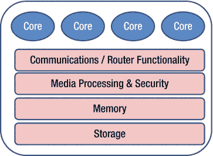

图 7-6. 网关或集线器平台架构

这类平台通常不依赖电池供电（不同于本节前面讨论的设备），因此网关/集线器通常始终由墙壁电源供电，并随时可进行高性能处理。将此类平台作为端到端系统架构的一部分，可以有机会将处理任务从传感器/手机边缘设备卸载到像网关这样的中央设备上，以便进行聚合和高性能处理（从而节省电池电量）。同时，由于网关/集线器位于本地场所内，并具备如 Wi-Fi 等高带宽通信能力，因此还能提供低交互延迟的优势。

### 7.2.5 云服务器平台

最后但同样重要的是，我们还应当了解位于云数据中心内的商业服务器的能力。传统上，服务器平台拥有大量的核心（例如 16-48 个），并以高性能运行，尤其是在处理吞吐量方面。由于云中有多个服务器平台，因此不仅可以在单个服务器内部进行并行处理，还可以在集群内或整个数据中心内的多台服务器之间实现并行处理。图 7-7（上部）展示了服务器平台架构的一个简化描述。

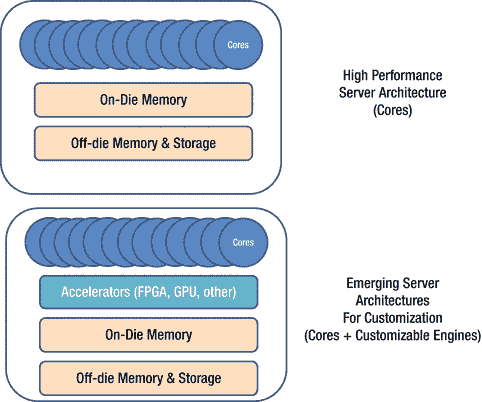

图 7-7. 云服务器平台架构

较新的服务器架构正试图通过定制化来提供更高的能效性能。这包括集成可编程/可重配置逻辑（如 `FPGA`，即现场可编程门阵列）以及其他加速器（如 `GPU`，即图形处理器）和领域专用引擎。

从图 7-7 的图示中可能可以明显看出，高性能核心的丰富程度表明了服务器相较于边缘设备或网关拥有更高的计算能力。服务器通常在几百瓦的功耗限制下运行，而手机运行在瓦级别，可穿戴设备或传感器节点在电池寿命/容量上则处于亚瓦级别。

## 7.3 端到端处理与映射示例

以上对各平台的描述，希望能阐明为何需要端到端系统架构来实现诸如视觉识别和处理这样丰富的体验。为了进一步探讨这一点，我们考虑三个处理示例：(a) 语音处理，(b) 视觉处理，以及 (c) 机器学习和分类任务。这些示例将基于本章前面描述的各种考量，进一步提供关于某些任务当前可在何处执行的理解。让我们从语音处理开始。

### 7.3.1 语音处理示例

为了详细理解语音处理，让我们看一个使用示例。设想一个人身上佩戴的可穿戴设备，旨在提供具有问答能力的助手功能。这种使用场景的端到端架构包括：(a) 身上的可穿戴设备，(b) 口袋里的智能手机，以及 (c) 数据中心里的云平台。在此，我们回顾一下语音处理流程以及端到端系统架构，以便开始考虑如何在上述不同平台之间完成任务划分。

回顾语音的流程，一个典型的问答辅助流程包括：降噪（以净化音频样本）、语音活动检测（以检测人声）、关键词识别（以识别唤醒词）、说话人识别（以识别正确的说话人）、命令与控制（以识别命令）、LVCSR（用于连续语音识别）、自然语言处理（以确定词语的含义），以及问答服务（以确定问题的答案）。

对于此示例，我们用于将语音流程划分到端到端架构中各平台的关键考量因素是：(a) 在受限功耗和电池续航范围内可用的算力，以及 (b) 用于存储处理所需语音模型的可用内存容量。为能演示甚至仅需少量优先级排序所带来的影响，我们将假设其他考量因素是次要的。

如今，大多数设备仅在边缘设备（如可穿戴设备、智能手机，甚至是环境智能中枢）上完成关键词识别。但随着低功耗硬件设计的进步，我们正不断突破极限，能够在更靠近边缘端的位置处理更多任务，而无需将所有音频数据发送到云端。这些进步通常涉及采用软硬件协同设计的方法来实现语音算法。由此产生的低功耗硬件设计，或许不仅能在本地设备上以低功耗（毫瓦级）实现关键词识别，还能完成一定程度的命令与控制（小词汇量）。因此，在不久的将来，可穿戴设备应该能够一路处理到有限命令与控制的功能。图 7-8 展示了一个在端到端平台架构上划分语音流程的示例。

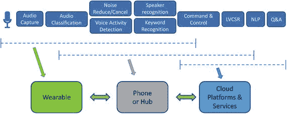

图 7-8.

语音流程的端到端划分（示例）

对于命令与控制中词汇量更大，但连续语音识别和自然语言处理中词汇量相对较小的情况，则需要在端到端流程中有一个更强大的系统。随着软硬件协同设计的进步，在不久的将来，智能手机或类似中枢的平台应能具备此类能力。最终，对于大词汇量语音识别和完整的自然语言处理，云平台是必需的，这不仅是为了满足算力需求，也是为了容纳大型和多种语言模型的内存需求。最后但同样重要的是，更通用的问答服务需要云服务，因为它需要公共领域知识，不仅要根据问题，还要结合使用场景的上下文来确定合适的答案。

### 7.3.2 视觉处理示例

我们的下一个端到端划分示例（视觉处理）考虑了一个更丰富的传感器（摄像头），因此需要更大量的算力、带宽和分析。这里我们考虑一个端到端架构，该架构包括一个类似手机的边缘设备（也可以是具有类似功能的视觉监控设备，甚至是使用类似手机平台的移动增强现实设备）、一个提供上下文数据的本地中枢，以及一个提供更丰富视觉服务的云平台。

图 7-9 展示了大多数使用场景所需的若干视觉处理能力，以及如何将这些能力映射到潜在的平台，并在这些平台上实现，同时需考虑算力、电池续航、内存/存储容量以及上下文模型和数据的可用性。我们从手势识别开始，这可以在本地实现。手势识别可以是对手部姿态以及动态运动的识别；只要手势数量有限，识别目标就可以在边缘设备上实现，功耗在几十毫瓦到几百毫瓦之间（取决于复杂度）。当我们开始考虑物体识别时，对本地设备来说，完成这项任务的挑战性就大了很多，尤其是当物体数量从几百个增加到几千个，再到数百万个时。对于几百个物体，本地设备可以提供用于物体识别的物体模型，并完成所需的识别。然而，如果物体数量无上限，并且需要一个大型物体数据库，那么处理就需要一个能够与大型数据库进行匹配的云服务器。也可以采用一种分层方法，即由本地中枢确定物体识别的上下文，并缓存使用场景中预期会经常出现的一些物体（在一定的空间/时间距离内）。

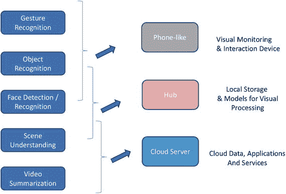

图 7-9.

视觉处理的划分（示例）

与物体识别类似，人脸识别的处理也取决于涉及的人脸数量（是仅有几张人脸的住宅，还是有上千张人脸的公司，亦或是存在数百万张人脸的公共查询）。根据这一点，处理可以在本地边缘设备、中枢或云服务器上完成。人脸检测（知道画面中有人脸并识别其位置）当然可以在本地设备上完成，但人脸识别则需要如上所述的可扩展分层方法。

当前，关于场景理解和视频摘要的研究活动非常活跃。理解一个场景意味着不仅要识别图像中的各个实体，还要理解场景中的活动或上下文。这需要上述的每一种能力（物体、人脸、手势）以及更多。根据所需的场景识别级别，可以在中枢或云端完成。同样，视频摘要试图识别视频中的关键场景，并确定整个视频在活动和故事情节方面的内容。小规模（识别能概括视频的代表性场景）的视频摘要可以在中枢完成，而诸如确定活动和情节等进一步的摘要则可能需要云处理。

需要注意的是，在考虑视觉处理时，一个关键的权衡因素是传输数据所需的带宽（从本地设备到中枢再到云端）。由于传输视觉数据的成本很高，同样重要的是要考虑是从一个节点向另一个节点传输原始数据，还是只应传输从原始数据中提取的特征以用于所需的处理。此外，由于视觉处理的目的并非创建事后可供人类观看的录制内容，因此在端到端系统架构中，当视觉流从一个节点传输到另一个节点时，保持最高的分辨率和帧率也并非至关重要。最后但同样重要的是，还应根据所讨论的使用模式，确定何时可以丢弃原始数据而仅保留元数据。

### 7.3.3 学习与分类

另一种跨越端到端系统架构的能力视角是学习与分类。机器学习技术日益广泛地应用于模式匹配、音频和视觉识别。机器学习的颠覆性在于，它不再编写基于代码或基于规则的方法来识别模式，而是使用实际数据作为训练样本来开发模型。

例如，如果需要识别 IMU 手势，可以通过使用从一组个体采集到的手势数据来训练机器学习模型（例如神经网络）从而开发手势模型。该训练过程要求设备采集数据，但不一定要求设备直接学习模型。可以采用基于云的解决方案来进行模型的训练与开发，然后将生成的模型下载到部署的设备上，以在实时场景中进行识别。

这种划分可以被视为两个不同的步骤：(a) 离线训练 和 (b) 在线分类。事实上，当今许多应用中使用的基础模型都依赖云端来同时完成离线训练和在线分类（如图 7-10 左上角所示）。然而，这种模型面临挑战：当将原始数据发送到云端进行在线分类的延迟限制其使用时，问题便会出现。因此，新的模型应运而生，设备通过基于云端离线训练产生的模型在本地实施分类。但这种模型在难以轻松集成个性化或因异常导致的变更时也会受到限制。因此，研究人员一直致力于开发检测异常并将其发送至云端以更新本地模型的技术。云端收集这些异常，定期生成更新的模型，并将更新部署到现场。研究人员还在尝试通过在设备本身学习本地变更来实现持续学习。这些变更不仅可以传输到云端用于更新，还可用于在本地更新模型。

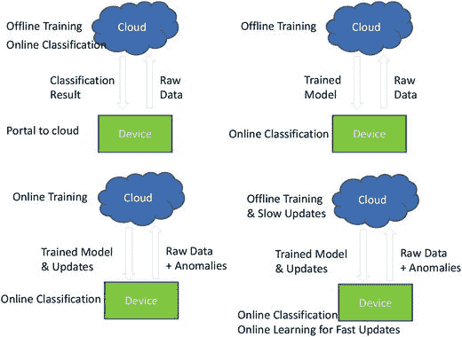

图 7-10.

学习与分类（离线 vs. 在线）

## 7.4 端到端分区的可编程性考量

在实现从感知到知识管理的能力时，考虑解决方案各组件的可编程性也至关重要。由于语音和视觉算法不断演进，且机器学习算法或神经网络的变体每隔几个月就会出现，因此当前实现能够轻松修改变得至关重要。此外，本章前几节介绍了多种分区可能性，这使得在硬件或算法改进成为可能时，能够动态更改这些分区也至关重要。

一种方法是开发应用程序编程接口，允许软件开发者一致地使用通用接口，同时为修改底层实现提供灵活性。例如，如果某个语音处理流水线在其语言模型实现中使用了 HMM，而未来希望改为 WFST，那么只要 API 定义良好且实现因此具备灵活性，这种改变就是可行的。

此外，由于一个组件的处理可以映射到多种不同的平台（本地设备、网关或云平台），并且在每个平台内部，处理引擎可以是核心、GPU、FPGA 或加速器（或专用引擎），因此实现必须对这些细节进行抽象，以提供更改映射和底层组件的灵活性。此类灵活方法的一个例子是远程卸载，作者提出了一种基于 OpenCL 的解决方案，用于抽象需要执行的函数，使其可以在本地设备或远程平台上运行，并且还可以在这些平台上的任何处理引擎（核心或加速器）上运行。由于异构架构因其功耗/性能优势而变得越来越普遍，此类解决方案正越来越受欢迎。图 7-11 展示了一个工作负载被分解为功能组件，并说明了使用存根将函数执行重定向到任何平台及平台内任何处理引擎的方法。用于确定在何处运行函数的策略，可基于数据传输的可用带宽、功耗/性能（影响设备电池续航），以及平台和引擎的可用性（如果多个工作负载同时运行，或者平台并非始终在网络中可用）。

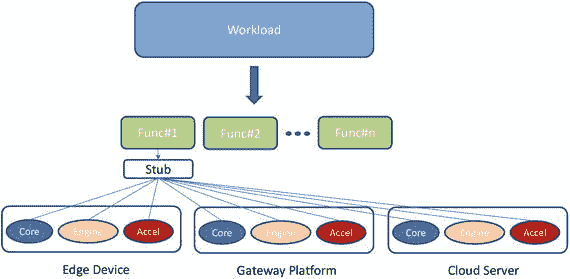

图 7-11.

工作负载分解与函数映射

## 7.5 总结与未来机遇

本章介绍了传感器处理流水线的端到端架构。正如本章通过各种示例所描述的，为语音或视觉能力及应用开发端到端系统架构面临着多重挑战。这为未来的研究和开发开辟了许多机遇。此处我们列出其中一些机遇：

-   为特定算法和原语开发专用引擎和加速器。
-   开发能够提供动态映射和分区灵活性的端到端系统架构。
-   开发允许探索合适分区策略的工具和模型。
-   开发跨多种应用的通用处理流水线。
-   为端到端系统开发运行时/编程模型。

## 7.6 结论

本章总结了对我们周围环境进行传感数据处理以理解其含义的不同方面的概述。我们希望本书达到了让读者对涉及的概念和操作有高层次理解的目标。书中的讨论详细介绍了理解传感器含义的步骤，包括：(a) 识别来自单个传感器的数据，(b) 使用多种传感模式来提高识别性能并实现新的应用，(c) 推导应用上下文，并利用该上下文改进识别操作，(d) 从识别出的信息中推导语义关系，(e) 表示这些关系以构建知识图谱，(f) 基于知识进行操作以实现智能应用，以及 (g) 实现传感器驱动知识流水线的系统考量。

虽然本书旨在提供所涉及技术的高层级概览，但内容旨在让读者理解知识流水线在多种传感模式和应用中的通用性质。从本书中获得的信息应能为读者提供足够的背景知识，使其能够通过选择感兴趣的领域和技术方向进入下一步学习。各章末尾提供的参考文献是进行此类探索的良好起点。
