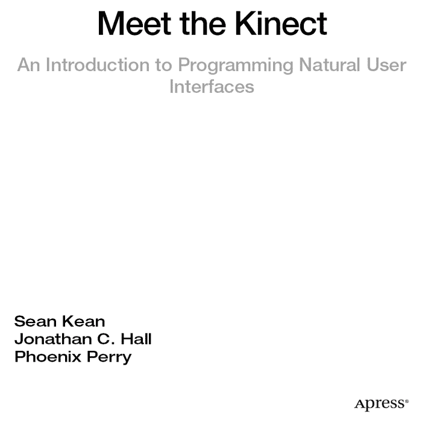

**认识 Kinect：自然用户界面编程入门**

版权所有 © 2012 Sean Kean, Jonathan C. Hall, and Phoenix Perry

本作品受版权保护。出版方保留所有权利，无论涉及全部或部分材料，具体包括翻译权、重印权、插图复用权、引用权、广播权、微缩胶片或其他任何物理形式的复制权，以及传输或信息存储检索、电子改编、计算机软件，或目前已知或未来开发的任何类似或不同方法的权利。涉及评论、学术分析或专门为输入计算机系统并执行而提供的材料（仅供购买者独家使用）的简短摘录，不受此法律限制。未经出版方所在地现行版权法许可，不得复制本出版物或其任何部分，且使用许可必须始终从 Springer 获取。使用许可可通过版权清算中心的 RightsLink 获得。违反者将根据相应的版权法被起诉。

ISBN-13 (平装): 978-1-4302-3888-1

ISBN-13 (电子版): 978-1-4302-3889-8

本书中可能出现商标名称、标识和图像。我们并非在每个商标名称、标识或图像出现时都使用商标符号，而是仅以编辑方式使用这些名称、标识和图像，以维护商标所有者的利益，并无意侵犯商标权。

本出版物中使用的商品名称、商标、服务标志及类似术语，即使未明确标识，也不应被视为对它们是否受所有权保护的立场表达。

尽管本书中的建议和信息在出版时被认为是真实准确的，但作者、编辑及出版方均不对可能存在的任何错误或遗漏承担法律责任。出版方不对其中包含的材料作任何明示或暗示的担保。

总裁兼出版人：Paul Manning  
首席编辑：Jonathan Gennick  
技术审校：Jarrett Webb  
编辑委员会：Steve Anglin, Mark Beckner, Ewan Buckingham, Gary Cornell, Morgan Ertel, Jonathan Gennick, Jonathan Hassell, Robert Hutchinson, Michelle Lowman, James Markham, Matthew Moodie, Jeff Olson, Jeffrey Pepper, Douglas Pundick, Ben Renow-Clarke, Dominic Shakeshaft, Gwenan Spearing, Matt Wade, Tom Welsh  
协调编辑：Anita Castro  
文字编辑：Scribendi.com  
排版：Bytheway Publishing Services  
索引编制：SPI Global  
插图制作：SPI Global  
封面设计：Anna Ishchenko

向全球图书贸易发行由 Springer Science+Business Media New York 负责，地址：233 Spring Street, 6th Floor, New York, NY 10013。电话：1-800-SPRINGER，传真：(201) 348-4505，电子邮件：`orders-ny@springer-sbm.com`，或访问 [www.springeronline.com](http://www.springeronline.com)。

有关翻译信息，请发送电子邮件至 `rights@apress.com`，或访问 [www.apress.com](http://www.apress.com)。

Apress 和 friends of ED 的书籍可批量购买用于学术、企业或促销用途。大部分图书也提供电子版及许可证。更多信息，请参阅我们的特殊批量销售–电子书许可网页：[www.apress.com/bulk-sales](http://www.apress.com/bulk-sales)。

作者在本文中引用的任何源代码或其他补充材料，读者可访问 `www.apress.com` 获取。关于如何查找图书源代码的详细信息，请访问 [www.apress.com/source-code/](http://www.apress.com/source-code/)。

*谨以此书献给 Christa Erickson：艺术家、教育家、漫游者，以及尊贵的导师。* —Sean Kean

## 目录概览

 目录

 关于作者

 关于技术审校

 致谢

 第 1 章：入门指南

 第 2 章：技术背后

 第 3 章：实际应用

 第 4 章：为 Kinect 编写脚本

 第 5 章：面向创意人士的 Kinect

 第 6 章：使用 Beckon 框架进行应用开发

 第 7 章：使用 Unity 开发 3D 游戏和用户界面

 第 8 章：微软的 Kinect SDK

 第 9 章：体三维显示技术

 第 10 章：未来何去何从？

 索引

