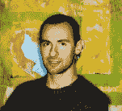
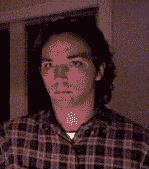

# Johnathan C. Hall

 索引

## 关于作者

  **肖恩·基恩**是一位居住在纽约布鲁克林的艺术家和企业家。他的背景涵盖工程、艺术、教育和旅行，他热衷于简化复杂技术，使工具更易于为他人所用。出于永不满足的好奇心，作者曾作为空乘人员游历各国，作为幼儿教育者通过玩耍重新发现学习，为获得出租车驾驶执照和房地产销售执照而研究纽约市的街道与建筑，并且编程经验超过 20 年。肖恩目前致力于在 HERE, Inc.（[`http://here.st`](http://here.st)）弥合物理世界与数字世界之间的鸿沟，通过 VoxieBox（[`www.voxiebox.com`](http://www.voxiebox.com)）推动体三维 3D 电视成为主流，并通过 Volumetric Society（[`www.volumetric.org`](http://www.volumetric.org)）的出版物、会议及本地分会聚会（您可以在所在城市协助组织），帮助从事体三维深度相机、软件和显示器的专业人士相互联系。

  **乔纳森·C·霍尔**是 Sensecast 的创始人之一，该应用能利用 Kinect 轻松构建动作控制界面。过去十年间，他一直是数字项目的独立设计师/开发者。霍尔还曾担任过新闻记者、世界最聪明人物的研究员、约旦国王阿卜杜拉二世及罗布·贾维克等知名人士的技术顾问，并学习过科学与人文课程。乔纳森拥有哈佛大学的文学士学位，主修语言与宗教，并在哥伦比亚大学攻读通信学博士（约完成了一半课程）。

  **菲尼克斯·佩里**于 1975 年出生于科罗拉多州丹佛市。从数字艺术策展人到创意总监，她在新媒体、设计和用户界面领域积累了丰富经验。佩里的作品涵盖众多学科，包括绘画、生成艺术、视频、游戏和音频。她的项目曾在世界各地的场馆和艺术节展出，例如"出来玩"艺术节、纽约科学馆的 Maker Faire、林肯中心、Transmediale、耶尔巴布埃纳艺术中心、洛杉矶当代艺术博物馆、Harvest Works、Babycastles、欧洲媒体艺术节、GenArt、首尔电影节以及 Harvestworks。她是纽约大学理工学院综合数字媒体专业的兼职教授，并在纽约布鲁克林拥有 Devotion 画廊。

## 关于技术审校

  **贾勒特·韦伯**利用多点触控技术和 Kinect 创造富有想象力、充满活力、互动且身临其境的体验。他居住于德克萨斯州奥斯汀。

